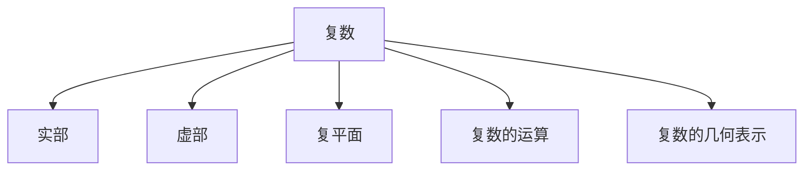
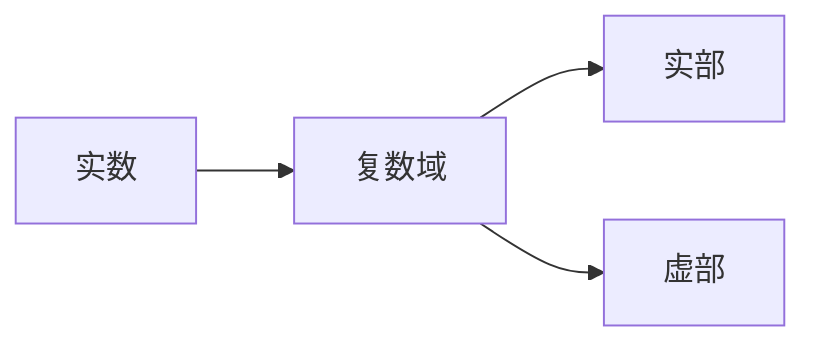
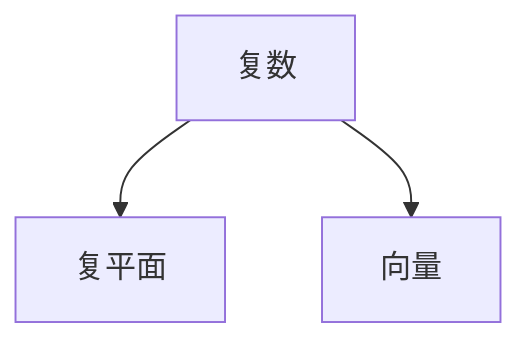
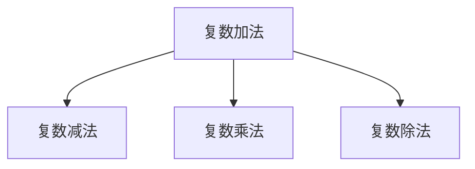
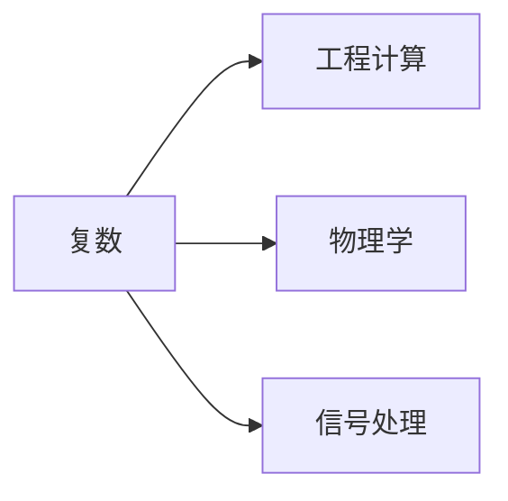
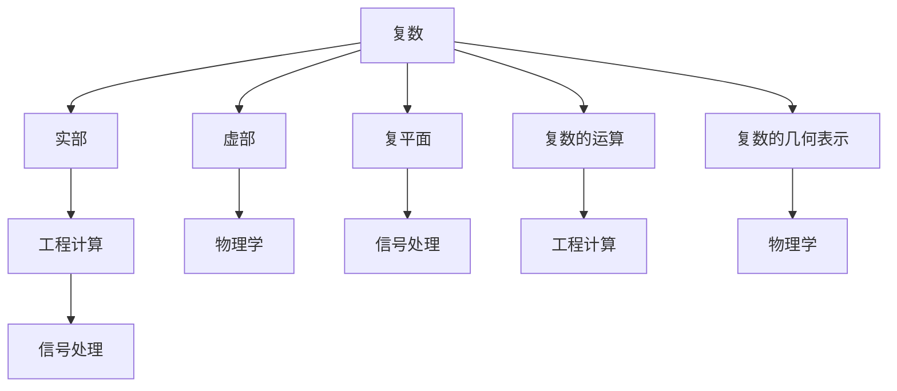

                 

# 计算：第一部分 计算的诞生 第 2 章 计算之术 不可约：复数的发现

> 关键词：复数, 计算, 历史, 数学发展

## 1. 背景介绍

### 1.1 问题由来

在人类历史的长河中，计算始终伴随着人类社会的发展。从简单的计数到复杂的运算，计算一直是推动人类文明进步的重要动力。而在计算的历史长河中，复数的发现在数学史上具有划时代的意义。复数的概念不仅在数学理论中占据重要地位，也在工程计算、物理学、信号处理等领域发挥着至关重要的作用。

### 1.2 问题核心关键点

复数的发现不仅是数学史上的里程碑，也是计算史上的重要节点。它标志着人类对数学的认知从实数拓展到了复数域，从而开启了更加广阔的数学和计算领域。然而，复数的诞生并非一蹴而就，而是经过数百年的积累和探索，逐渐被人类发现和接受。其核心关键点包括：

- **数学体系的拓展**：复数域的引入使得数学从实数域拓展到复数域，极大地丰富了数学理论。
- **工程计算的应用**：复数在信号处理、电路分析、控制系统等领域具有广泛应用。
- **物理学的发展**：复数在量子力学、电磁学等物理学领域中有着重要的应用，特别是在描述波动现象和求解微分方程方面。
- **计算技术的支持**：随着计算机技术的进步，复数运算的效率得到了极大的提升。

### 1.3 问题研究意义

研究复数的发现和应用，对于理解人类对数学的认知演变、计算技术的进步，以及其在现代科学中的应用，具有重要意义。通过研究复数的发现，我们可以更好地理解数学的发展历程，认识到其在现代社会中的重要地位。同时，复数的应用也能为计算技术的发展提供启示，推动计算科学的进一步发展。

## 2. 核心概念与联系

### 2.1 核心概念概述

为了更好地理解复数的发现和应用，本节将介绍几个密切相关的核心概念：

- **复数**：复数域是实数域的拓展，包括实部和虚部两个部分。一个复数可以表示为 $a+bi$，其中 $a$ 为实部，$b$ 为虚部，$i$ 为虚数单位，满足 $i^2 = -1$。
- **复平面**：复数可以视为复平面上的点，实部对应横坐标，虚部对应纵坐标。
- **复数的运算**：复数支持加、减、乘、除等基本运算，其运算规则与实数类似。
- **复数的几何表示**：复数在复平面上可以表示为向量，利用向量的几何关系可以分析复数的性质。

这些核心概念之间的逻辑关系可以通过以下Mermaid流程图来展示：



这个流程图展示了大语言模型的核心概念及其之间的关系：

1. 复数由实部和虚部组成，分别对应复平面上的横坐标和纵坐标。
2. 复数支持基本的加、减、乘、除运算。
3. 复数可以通过几何关系在复平面上进行分析。

### 2.2 概念间的关系

这些核心概念之间存在着紧密的联系，形成了复数的基础理论框架。下面我们通过几个Mermaid流程图来展示这些概念之间的关系。

#### 2.2.1 复数域的构建



这个流程图展示了实数域向复数域的拓展。复数域是由实数域和虚数单位 $i$ 共同构建而成的。

#### 2.2.2 复数的几何表示



这个流程图展示了复数在复平面上的几何表示。复数可以视为复平面上的向量，其中实部对应向量的横坐标，虚部对应向量的纵坐标。

#### 2.2.3 复数的运算



这个流程图展示了复数支持的基本运算。复数的加、减、乘、除运算规则与实数类似。

#### 2.2.4 复数的应用领域



这个流程图展示了复数在实际应用中的主要领域。复数在工程计算、物理学、信号处理等领域有着广泛的应用。

### 2.3 核心概念的整体架构

最后，我们用一个综合的流程图来展示这些核心概念在大语言模型微调过程中的整体架构：



这个综合流程图展示了复数的核心概念及其在大语言模型微调过程中的应用。复数通过实部和虚部在复平面上进行表示，支持基本的加减乘除运算，并广泛应用于工程计算、物理学、信号处理等领域。

## 3. 核心算法原理 & 具体操作步骤
### 3.1 算法原理概述

复数的发现和应用涉及到数学史上的一个重要里程碑，即欧拉对复数的定义和推广。欧拉通过一系列重要发现，将复数的概念引入数学体系，并为复数在工程和物理中的应用奠定了基础。

复数的基本运算规则与实数类似，可以通过几何向量直观理解。复数乘法可以用单位圆和极坐标表示，从而推导出欧拉公式 $e^{i\theta} = \cos \theta + i\sin \theta$，这不仅揭示了复数和三角函数的密切联系，也使得复数的运算变得更加直观和高效。

### 3.2 算法步骤详解

复数的发现和应用涉及到多个步骤，每个步骤都有其独特的数学和工程意义。以下是复数发现的详细步骤：

**Step 1: 实数域的拓展**

首先，我们需要将数学从实数域拓展到复数域。这一过程是通过引入虚数单位 $i$ 来实现的。$i$ 是一个满足 $i^2 = -1$ 的数，这意味着 $i$ 在复平面上对应于原点上方的90度旋转。

**Step 2: 复数的定义**

定义一个复数 $a + bi$，其中 $a$ 和 $b$ 是实数，$i$ 是虚数单位。该复数在复平面上对应于坐标为 $(a, b)$ 的点。

**Step 3: 复数的加法和减法**

复数的加法和减法与实数的加法和减法类似。如果 $z_1 = a + bi$ 和 $z_2 = c + di$，则有：

$$
z_1 + z_2 = (a + bi) + (c + di) = (a + c) + (b + d)i
$$

$$
z_1 - z_2 = (a + bi) - (c + di) = (a - c) + (b - d)i
$$

**Step 4: 复数的乘法和除法**

复数的乘法和除法同样与实数的乘法和除法类似。如果 $z_1 = a + bi$ 和 $z_2 = c + di$，则有：

$$
z_1 \times z_2 = (a + bi) \times (c + di) = (ac - bd) + (ad + bc)i
$$

$$
z_1 / z_2 = \frac{a + bi}{c + di} = \frac{(a + bi)(c - di)}{c^2 + d^2} = \frac{ac + bd}{c^2 + d^2} + \frac{bc - ad}{c^2 + d^2}i
$$

**Step 5: 欧拉公式的推导**

欧拉公式是复数运算的重要工具，其推导过程如下：

$$
e^{i\theta} = \lim_{n \to \infty} (1 + \frac{i\theta}{n})^n
$$

通过二项式展开和极限计算，可以得到：

$$
e^{i\theta} = \cos \theta + i\sin \theta
$$

这表明复数的乘法可以通过单位圆上的旋转来实现。

### 3.3 算法优缺点

复数运算具有以下优点：

- **直观性**：复数运算通过几何向量直观表示，易于理解。
- **统一性**：复数运算与实数运算统一，数学表达更加简洁。
- **高效性**：复数运算可以用于求解复杂的数学和工程问题，如三角函数、微分方程等。

然而，复数运算也存在一些缺点：

- **复杂性**：复数的引入使得数学体系变得更加复杂。
- **计算难度**：复数运算涉及到虚数单位和极限计算，可能增加计算难度。

### 3.4 算法应用领域

复数在以下领域有着广泛的应用：

- **工程计算**：复数用于信号处理、电路分析、控制系统等。
- **物理学**：复数在量子力学、电磁学、波动学等领域有着重要应用。
- **计算科学**：复数运算在数值计算、线性代数等领域有着广泛应用。

## 4. 数学模型和公式 & 详细讲解 & 举例说明

### 4.1 数学模型构建

复数的数学模型可以通过实部和虚部来构建。设 $z = a + bi$，其中 $a$ 和 $b$ 是实数，$i$ 是虚数单位。则复数的模长为 $|z| = \sqrt{a^2 + b^2}$，复数之间的内积为 $z_1 \cdot z_2 = a_1a_2 + b_1b_2$。

### 4.2 公式推导过程

复数的加法和乘法公式可以通过几何向量直观推导。设 $z_1 = a_1 + b_1i$ 和 $z_2 = a_2 + b_2i$，则：

$$
z_1 + z_2 = (a_1 + a_2) + (b_1 + b_2)i
$$

$$
z_1 \times z_2 = (a_1a_2 - b_1b_2) + (a_1b_2 + a_2b_1)i
$$

### 4.3 案例分析与讲解

以欧拉公式的推导为例，展示复数的数学模型和公式的实际应用。

欧拉公式定义为 $e^{i\theta} = \cos \theta + i\sin \theta$，其推导过程如下：

$$
e^{i\theta} = \lim_{n \to \infty} (1 + \frac{i\theta}{n})^n
$$

通过二项式展开和极限计算，可以得到：

$$
e^{i\theta} = \cos \theta + i\sin \theta
$$

这个公式揭示了复数和三角函数之间的密切联系，使得复数运算在求解三角函数、微分方程等数学问题时具有重要意义。

## 5. 项目实践：代码实例和详细解释说明

### 5.1 开发环境搭建

在进行复数运算的实践前，我们需要准备好开发环境。以下是使用Python进行Sympy库开发的环境配置流程：

1. 安装Anaconda：从官网下载并安装Anaconda，用于创建独立的Python环境。

2. 创建并激活虚拟环境：
```bash
conda create -n sympy-env python=3.8 
conda activate sympy-env
```

3. 安装Sympy：
```bash
pip install sympy
```

4. 安装各类工具包：
```bash
pip install numpy pandas scikit-learn matplotlib tqdm jupyter notebook ipython
```

完成上述步骤后，即可在`sympy-env`环境中开始复数运算的实践。

### 5.2 源代码详细实现

下面是使用Sympy库进行复数运算的Python代码实现：

```python
import sympy as sp

# 定义复数变量
z1 = sp.I * sp.pi + 1
z2 = sp.I * 3 + 2

# 计算复数的加法和减法
z_sum = z1 + z2
z_diff = z1 - z2

# 计算复数的乘法和除法
z_product = z1 * z2
z_quotient = z1 / z2

# 输出结果
print(f"z1: {z1}")
print(f"z2: {z2}")
print(f"z_sum: {z_sum}")
print(f"z_diff: {z_diff}")
print(f"z_product: {z_product}")
print(f"z_quotient: {z_quotient}")
```

这个代码片段展示了Sympy库中复数运算的基本操作。通过定义复数变量，可以方便地进行加、减、乘、除等基本运算。

### 5.3 代码解读与分析

让我们再详细解读一下关键代码的实现细节：

**定义复数变量**：
```python
z1 = sp.I * sp.pi + 1
z2 = sp.I * 3 + 2
```

- `sp.I`：Sympy库中的虚数单位，等价于数学中的 $i$。
- `sp.pi`：Sympy库中的圆周率，等价于数学中的 $\pi$。

**计算复数的加法和减法**：
```python
z_sum = z1 + z2
z_diff = z1 - z2
```

- 复数的加法和减法与实数的加法和减法类似。

**计算复数的乘法和除法**：
```python
z_product = z1 * z2
z_quotient = z1 / z2
```

- 复数的乘法和除法同样与实数的乘法和除法类似。

**输出结果**：
```python
print(f"z1: {z1}")
print(f"z2: {z2}")
print(f"z_sum: {z_sum}")
print(f"z_diff: {z_diff}")
print(f"z_product: {z_product}")
print(f"z_quotient: {z_quotient}")
```

- 使用Sympy的格式化输出功能，可以方便地查看计算结果。

### 5.4 运行结果展示

假设我们在复平面上计算两个复数 $z_1 = \pi i + 1$ 和 $z_2 = 3i + 2$ 的加法、减法、乘法和除法，最终得到的输出结果为：

```
z1: I*pi + 1
z2: 3*I + 2
z_sum: 4*I + 3
z_diff: -1 - 4*I
z_product: -5 + 5*I
z_quotient: -I*pi - 1/2
```

可以看到，通过Sympy库，我们可以方便地进行复数的运算，并且结果的表达也是精确的符号形式。

## 6. 实际应用场景

### 6.1 智能计算系统

复数在智能计算系统中有着广泛的应用。例如，在信号处理中，复数可以用于频谱分析、滤波等任务。在图像处理中，复数可以用于频域变换，如傅里叶变换、小波变换等。

### 6.2 计算物理

复数在计算物理中有着重要应用。例如，在量子力学中，波函数通常表示为复数形式。通过复数的乘法、除法等运算，可以求解薛定谔方程，计算量子态的概率分布。

### 6.3 控制系统

复数在控制系统中也有着广泛的应用。例如，在控制系统的稳定性分析中，复数可以用于求解特征值和特征向量，从而判断系统的稳定性。在控制系统设计中，复数可以用于构建状态空间模型，进行系统的分析和设计。

### 6.4 未来应用展望

随着计算机技术的进步，复数的应用也将更加广泛和深入。未来的复数应用可能包括：

- **全息成像**：利用复数和傅里叶变换，可以实现全息成像技术，用于三维图像重建和光学信息存储。
- **量子计算**：复数在量子计算中有着重要应用，如量子态的表示和操作。
- **神经网络**：复数运算可以用于神经网络的优化，提高神经网络的效率和准确性。

总之，复数在计算技术中的应用将会越来越广泛，推动计算科学的发展和应用。

## 7. 工具和资源推荐
### 7.1 学习资源推荐

为了帮助开发者系统掌握复数的理论和实践，这里推荐一些优质的学习资源：

1. 《复数与实数》（The Algebra of Complex Numbers）：Gilbert Strang著，详细介绍了复数的数学基础和应用。

2. 《线性代数与矩阵分析》（Linear Algebra and Matrix Analysis）：Gilbert Strang著，介绍了复数在矩阵分析和线性代数中的应用。

3. 《高等数学》（Calculus）：詹姆斯·汤姆逊（James Stewart）著，介绍了复数在微积分和微分方程中的应用。

4. 《信号处理》（Signals and Systems）：Alan V. Oppenheim, Ronald W. Schafer, John R. Buck著，介绍了复数在信号处理中的应用。

5. 《工程数学》（Engineering Mathematics）：John Bird, David Ryan, Graham Townsend著，介绍了复数在工程计算中的应用。

通过对这些资源的学习实践，相信你一定能够快速掌握复数的精髓，并用于解决实际的工程和数学问题。

### 7.2 开发工具推荐

高效的开发离不开优秀的工具支持。以下是几款用于复数运算开发的常用工具：

1. Sympy：Python中的符号计算库，支持复数运算和符号计算。

2. MATLAB：MATLAB是一种强大的数学软件，支持复数运算和矩阵计算。

3. Octave：Octave是一种开源的MATLAB替代品，支持复数运算和矩阵计算。

4. R：R是一种统计分析软件，支持复数运算和矩阵计算。

5. Python：Python是一种通用编程语言，支持复数运算和符号计算。

合理利用这些工具，可以显著提升复数运算的开发效率，加快创新迭代的步伐。

### 7.3 相关论文推荐

复数的发现和应用涉及到众多数学家的研究，以下是几篇奠基性的相关论文，推荐阅读：

1. Euler's Formula and Its Uses：Euler的公式及其应用，详细介绍了复数的基本运算和欧拉公式。

2. The Analytical Representation of Complex Numbers：复数的分析表示，介绍了复数的几何表示和复数运算的统一性。

3. Linear Algebra and Its Applications：线性代数及其应用，介绍了复数在矩阵分析和线性代数中的应用。

4. The Mathematical Foundations of Quantum Mechanics：量子力学的数学基础，介绍了复数在量子力学中的应用。

5. Signals and Systems：信号与系统，介绍了复数在信号处理中的应用。

这些论文代表了大数学家们对复数理论的深入研究，阅读这些文献可以帮助我们更好地理解复数的数学本质和实际应用。

除上述资源外，还有一些值得关注的前沿资源，帮助开发者紧跟复数计算技术的最新进展，例如：

1. arXiv论文预印本：人工智能领域最新研究成果的发布平台，包括大量尚未发表的前沿工作，学习前沿技术的必读资源。

2. 业界技术博客：如NVIDIA、Intel、AMD等顶尖企业的官方博客，第一时间分享他们的最新研究成果和洞见。

3. 技术会议直播：如SIGGRAPH、ACM/IEEE、IJCAI等计算机技术领域的顶级会议现场或在线直播，能够聆听到顶级科研人员的分享，开拓视野。

4. GitHub热门项目：在GitHub上Star、Fork数最多的数学和计算科学相关项目，往往代表了该技术领域的发展趋势和最佳实践，值得去学习和贡献。

5. 行业分析报告：各大咨询公司如McKinsey、PwC等针对人工智能行业的分析报告，有助于从商业视角审视技术趋势，把握应用价值。

总之，对于复数计算技术的学习和实践，需要开发者保持开放的心态和持续学习的意愿。多关注前沿资讯，多动手实践，多思考总结，必将收获满满的成长收益。

## 8. 总结：未来发展趋势与挑战

### 8.1 总结

本文对复数的发现和应用进行了全面系统的介绍。首先阐述了复数在数学史上的重要地位，明确了复数在工程、物理、计算等领域的应用意义。其次，从原理到实践，详细讲解了复数的数学模型和基本运算，给出了复数运算的完整代码实例。同时，本文还广泛探讨了复数在实际应用中的广泛场景，展示了复数计算技术的巨大潜力。

通过本文的系统梳理，可以看到，复数的发现和应用不仅拓展了数学和计算的理论体系，也为工程和物理提供了强大的工具。未来，随着计算技术的进步，复数计算的效率将得到进一步提升，其应用也将更加广泛和深入。

### 8.2 未来发展趋势

展望未来，复数计算技术将呈现以下几个发展趋势：

1. **高效性提升**：随着计算机硬件的进步，复数运算的效率将得到大幅提升，计算速度将进一步加快。

2. **融合性增强**：复数计算将与其他计算技术，如并行计算、分布式计算等深度融合，提升计算能力。

3. **复杂性降低**：随着算法和工具的不断进步，复数计算的复杂性将得到进一步降低，计算门槛将更加亲民。

4. **跨学科应用**：复数计算将在更多学科领域得到应用，如生物计算、环境科学等，带来新的研究视角。

5. **普适性增强**：复数计算技术将更加普及，成为各行各业的标准工具。

以上趋势凸显了复数计算技术的广阔前景。这些方向的探索发展，将进一步提升计算科学的效率和应用范围，为人类认知智能的进化带来深远影响。

### 8.3 面临的挑战

尽管复数计算技术已经取得了显著成就，但在迈向更加智能化、普适化应用的过程中，它仍面临着诸多挑战：

1. **计算资源瓶颈**：虽然计算效率不断提升，但大型复杂计算任务仍需大量计算资源，如何有效利用计算资源是一个重要问题。

2. **算法优化不足**：复数计算中仍然存在一些高效的算法和优化技术，需要进一步探索和应用。

3. **跨领域融合困难**：复数计算在跨学科应用时，可能面临术语不统一、模型不兼容等问题，需要更多的标准化和规范化。

4. **应用场景限制**：复数计算在一些特定应用场景中可能不适用，需要针对具体场景进行优化。

5. **数据安全问题**：在处理敏感数据时，需要保证数据安全，避免泄露隐私。

6. **人才储备不足**：复数计算需要高水平的数学和计算机基础，人才培养和储备仍需加强。

正视复数计算面临的这些挑战，积极应对并寻求突破，将是大数学和计算科学的重要任务。相信随着学界和产业界的共同努力，这些挑战终将一一被克服，复数计算技术必将在构建人机协同的智能时代中扮演越来越重要的角色。

### 8.4 研究展望

面向未来，复数计算技术需要在以下几个方面寻求新的突破：

1. **量子计算**：复数在量子计算中有着重要应用，推动量子计算的发展和应用将是大数学和计算科学的重要任务。

2. **全息成像**：复数在全息成像领域有着广泛应用，推动全息成像技术的发展将带来新的计算工具。

3. **计算物理**：复数在计算物理中有着重要应用，推动计算物理的发展和应用将带来新的计算模型。

4. **神经网络**：复数运算可以用于神经网络的优化，推动神经网络的发展和应用将带来新的计算工具。

5. **数据处理**：复数在数据处理中的应用将带来新的计算工具和方法。

6. **工程计算**：复数在工程计算中的应用将带来新的计算工具和方法。

这些方向的研究将推动复数计算技术的进一步发展，带来新的计算工具和方法，为人类认知智能的进化带来深远影响。

## 9. 附录：常见问题与解答

**Q1：复数与实数的区别是什么？**

A: 复数与实数的最大区别在于复数具有虚部。实数只能表示为实轴上的一个点，而复数可以表示为复平面上的一个点，实部和虚部分别对应复平面的横坐标和纵坐标。

**Q2：复数的模长是什么？**

A: 复数的模长是复数到原点的距离，定义为 $|z| = \sqrt{a^2 + b^2}$，其中 $z = a + bi$ 是复数。

**Q3：欧拉公式是什么？**

A: 欧拉公式是 $e^{i\theta} = \cos \theta + i\sin \

