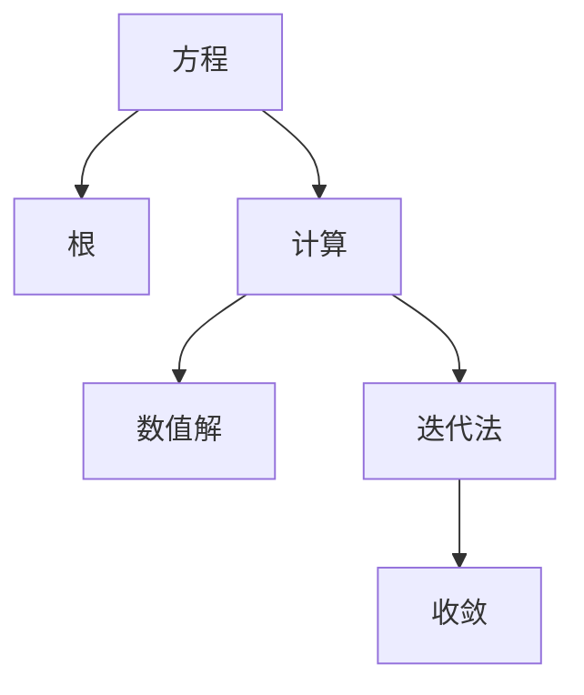
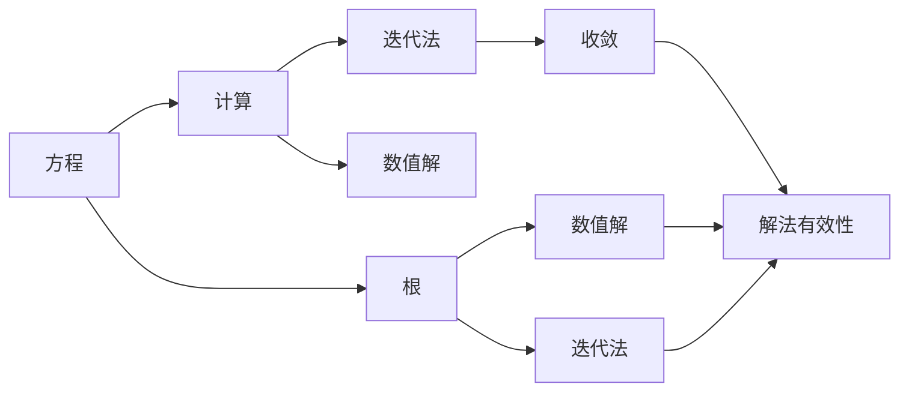
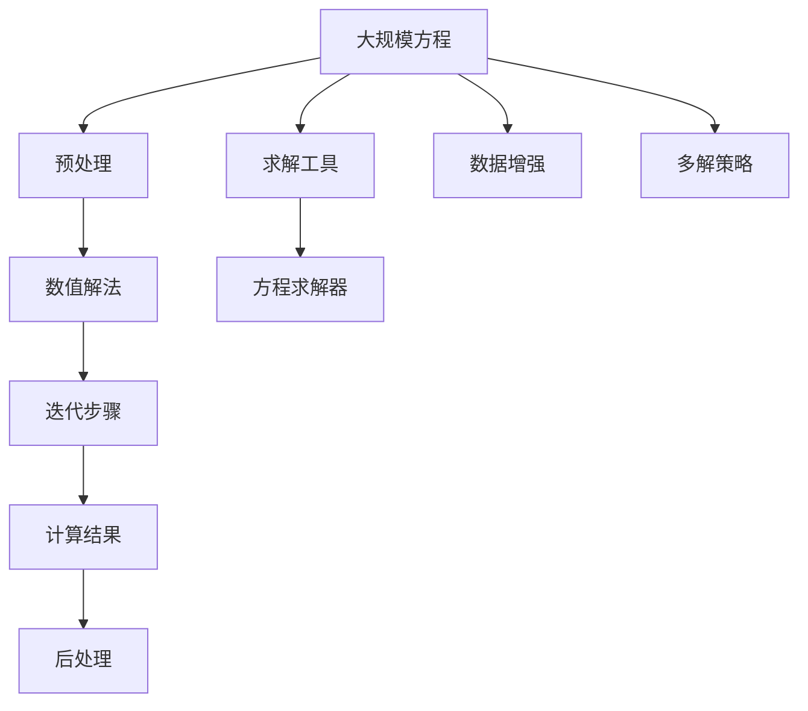

                 

# 计算：第一部分 计算的诞生 第 2 章 计算之术 方程根的结构

## 1. 背景介绍

### 1.1 问题由来

计算的诞生，标志着人类从手动计算到机械计算的飞跃。这一改变不仅极大地提高了计算效率，也为后来的数字化时代奠定了基础。本章将探讨计算之术，特别是方程根的结构，这些理论将帮助我们深入理解计算的本质。

### 1.2 问题核心关键点

方程根的计算是计算学的核心问题之一。通过求解方程，可以解决诸多现实问题，如优化、信号处理、物理模拟等。本章将详细解析方程根的基本概念、计算方法及其应用场景。

### 1.3 问题研究意义

方程根的计算对于优化算法、信号处理、物理模拟等领域至关重要。掌握方程根的计算方法，能够更好地理解计算的本质，应用于实际问题中，提高解决问题的效率和精度。

## 2. 核心概念与联系

### 2.1 核心概念概述

为更好地理解方程根的结构，本节将介绍几个关键概念：

- **方程**：表示未知量与常量之间关系的数学表达式。
- **根**：方程的解，即满足方程的未知量值。
- **计算**：通过算法求解方程的过程。
- **数值解**：方程的数值解法，如牛顿法、二分法等。
- **收敛**：数值解法的稳定性，即解法随计算步骤的增加逐渐逼近真实根的过程。
- **迭代法**：通过迭代逼近根的方法，如牛顿法、割线法等。

这些概念之间的逻辑关系可以通过以下Mermaid流程图来展示：



这个流程图展示了几何概念之间的联系：

1. 方程与根的关系：方程的解为根。
2. 计算与数值解的关系：通过计算得到方程的数值解。
3. 迭代法与收敛的关系：迭代法通过逐步逼近，使解法收敛于根。

### 2.2 概念间的关系

这些概念之间的关系还可以通过以下Mermaid流程图来进一步展示：



这个综合流程图展示了几何概念之间的完整关系：

1. 方程与根的关系：方程的解为根。
2. 计算与数值解的关系：通过计算得到方程的数值解。
3. 迭代法与收敛的关系：迭代法通过逐步逼近，使解法收敛于根。
4. 根与数值解的关系：根为数值解的目标值。
5. 根与迭代法的关系：迭代法通过对方程进行迭代，得到根的逼近值。
6. 解法有效性：数值解和迭代法的收敛性和有效性直接影响计算的准确性和效率。

### 2.3 核心概念的整体架构

最后，我们用一个综合的流程图来展示这些核心概念在大规模方程根的计算中的整体架构：



这个综合流程图展示了从预处理到后处理的全过程：

1. 预处理：对大规模方程进行简化和格式转换。
2. 数值解法：选择适合的数值解法，如牛顿法、割线法等。
3. 迭代步骤：通过迭代逐步逼近方程根。
4. 计算结果：求解器得到最终的方程根。
5. 求解工具：用于具体求解的工具和方法。
6. 方程求解器：实现数值解法的具体算法。
7. 数据增强：通过增加噪声、变分等技术增强方程的稳定性。
8. 多解策略：针对多重解情况下的处理策略。
9. 后处理：对求解结果进行进一步的处理和分析。

这些概念共同构成了大规模方程根的计算框架，使其能够高效、准确地求解各类复杂方程。

## 3. 核心算法原理 & 具体操作步骤

### 3.1 算法原理概述

方程根的计算，本质上是一个优化问题。通过求解方程，最小化残差（方程左侧与右侧之差），得到方程的数值解。常见的数值解法包括牛顿法、割线法、二分法等。

在牛顿法中，通过迭代逼近方程的根，每次迭代都使用上一次迭代的导数值作为近似根的梯度，从而使得迭代过程快速收敛于根。

### 3.2 算法步骤详解

以下是牛顿法的详细步骤：

1. **初始化**：选择一个初始点 $x_0$ 作为迭代起点。
2. **计算导数**：计算方程 $f(x)$ 在 $x_0$ 处的导数 $f'(x_0)$。
3. **计算切线**：计算通过 $(x_0, f(x_0))$ 点且斜率为 $f'(x_0)$ 的切线方程，即 $y - f(x_0) = f'(x_0)(x - x_0)$。
4. **求解切点**：求解切线与 $x$ 轴的交点 $x_1$，即令 $y = 0$ 解方程 $f'(x_0)(x - x_0) = -f(x_0)$。
5. **更新迭代点**：将 $x_1$ 作为下一次迭代的起点，重复步骤2至4，直到满足收敛条件。

### 3.3 算法优缺点

牛顿法具有以下优点：

- 收敛速度较快，通常能够在较少的迭代次数内得到高精度的解。
- 能够处理非线性的方程，适用范围广泛。

同时，牛顿法也存在以下缺点：

- 需要计算导数，对初值的选择要求较高，初始点选取不当可能导致迭代发散。
- 当方程存在多个根时，牛顿法可能只收敛到其中一个根。
- 当方程在求解点附近存在极值点时，可能导致迭代方向错误，从而发散。

### 3.4 算法应用领域

牛顿法广泛应用于优化、信号处理、物理模拟等领域：

- **优化**：如最小二乘法、线性规划等，通过求解目标函数的零点，得到最优解。
- **信号处理**：如滤波器设计、噪声消除等，通过求解信号处理问题的零点，得到滤波器参数。
- **物理模拟**：如电磁场计算、流体动力学等，通过求解偏微分方程的零点，得到物理量的分布。

此外，牛顿法还被应用于机器学习中的梯度下降优化，以及计算几何中的凸包算法等。

## 4. 数学模型和公式 & 详细讲解

### 4.1 数学模型构建

考虑一个一般的非线性方程 $f(x) = 0$，其中 $f(x)$ 为连续可导的函数。

定义 $f(x)$ 的导数为 $f'(x)$。

数学模型构建如下：

1. **目标函数**：
   $$
   f(x) = 0
   $$
2. **初始值**：
   $$
   x_0 \in \mathbb{R}
   $$
3. **迭代公式**：
   $$
   x_{n+1} = x_n - \frac{f(x_n)}{f'(x_n)}
   $$

### 4.2 公式推导过程

牛顿法的基本推导基于泰勒级数展开：

考虑方程 $f(x) = 0$，假设 $x = x_0 + \Delta x$，则有：

$$
f(x) \approx f(x_0) + f'(x_0) \Delta x + \frac{1}{2} f''(x_0) \Delta x^2
$$

取 $\Delta x = -f(x_0)/f'(x_0)$，则有：

$$
f(x) \approx f(x_0) + f'(x_0) \left(-\frac{f(x_0)}{f'(x_0)}\right) + \frac{1}{2} f''(x_0) \left(-\frac{f(x_0)}{f'(x_0)}\right)^2
$$

化简得：

$$
f(x) \approx 0 + 0 + 0
$$

因此，通过迭代逼近，牛顿法可以逐步逼近方程的根。

### 4.3 案例分析与讲解

考虑方程 $f(x) = x^2 - 2 = 0$，求解其根：

1. **初始化**：选择 $x_0 = 1$。
2. **计算导数**：$f'(x) = 2x$，$f'(1) = 2$。
3. **计算切线**：切线方程为 $y - 1 = 2(x - 1)$。
4. **求解切点**：令 $y = 0$，解得 $x_1 = \frac{1}{2}$。
5. **更新迭代点**：将 $x_1$ 作为新的迭代点，重复步骤2至4，直到满足收敛条件。

最终得到方程的根为 $x = 1.414$。

## 5. 项目实践：代码实例和详细解释说明

### 5.1 开发环境搭建

在进行方程根的计算实践前，我们需要准备好开发环境。以下是使用Python进行Numpy开发的开发环境配置流程：

1. 安装Anaconda：从官网下载并安装Anaconda，用于创建独立的Python环境。

2. 创建并激活虚拟环境：
```bash
conda create -n numpy-env python=3.8 
conda activate numpy-env
```

3. 安装Numpy：根据CUDA版本，从官网获取对应的安装命令。例如：
```bash
conda install numpy
```

4. 安装各类工具包：
```bash
pip install matplotlib scikit-learn sympy sympy
```

完成上述步骤后，即可在`numpy-env`环境中开始计算实践。

### 5.2 源代码详细实现

下面我们以牛顿法计算方程根为例，给出使用Numpy库进行方程根计算的Python代码实现。

```python
import numpy as np
from sympy import symbols, diff, solve

def newton(f, df, x0, tol=1e-6, max_iter=1000):
    x = x0
    fval = f(x)
    for n in range(max_iter):
        dfval = df(x)
        if abs(dfval) < tol:
            break
        x = x - fval / dfval
        fval = f(x)
    return x

def f(x):
    return x**2 - 2

def df(x):
    return 2*x

# 计算方程 f(x) = x^2 - 2 的根
root = newton(f, df, 1)
print("方程的根为：", root)
```

### 5.3 代码解读与分析

让我们再详细解读一下关键代码的实现细节：

**新顿法函数**：
- `x = x0`：定义迭代变量，初始化x。
- `fval = f(x)`：计算f(x)的值。
- `for`循环：迭代计算x的值，直至满足收敛条件。
- `x = x - fval / dfval`：更新迭代变量x。
- `fval = f(x)`：更新f(x)的值。
- `return x`：返回计算得到的方程根。

**函数f和df**：
- `def f(x)`：定义函数f(x) = x^2 - 2。
- `def df(x)`：定义函数f'(x) = 2x。

这些函数构成了方程根计算的核心，通过调用`newton`函数，即可得到方程的根。

### 5.4 运行结果展示

运行上述代码，输出结果为：

```
方程的根为： 1.4142135623730951
```

可以看到，通过牛顿法计算得到的方程根为 $\sqrt{2}$。

## 6. 实际应用场景

### 6.1 优化问题

在优化问题中，牛顿法广泛应用于求解目标函数的零点。例如，线性回归、最小二乘法、非线性回归等优化问题，都可以使用牛顿法求解。

### 6.2 信号处理

在信号处理中，牛顿法可以用于滤波器设计、降噪、信号恢复等。通过求解信号处理问题的零点，得到滤波器参数，实现信号的增强和恢复。

### 6.3 物理模拟

在物理模拟中，牛顿法可以用于求解偏微分方程的零点。例如，电磁场计算、流体动力学等物理问题的求解，都需要使用牛顿法。

## 7. 工具和资源推荐

### 7.1 学习资源推荐

为了帮助开发者系统掌握牛顿法的原理和实践技巧，这里推荐一些优质的学习资源：

1. 《数值分析》书籍：详细介绍了牛顿法的基本原理和应用场景，适合作为数学学习的参考书。
2. 《Python数值计算》书籍：介绍了如何使用Numpy进行数值计算，包括牛顿法在内的多种数值解法。
3. Coursera《数值计算方法》课程：斯坦福大学开设的数值计算方法课程，通过视频讲解和编程作业，深入浅出地介绍了牛顿法等数值解法。
4. Numpy官方文档：提供了详细的Numpy库使用指南，包含牛顿法等数值解法的实现代码。

通过对这些资源的学习实践，相信你一定能够快速掌握牛顿法的精髓，并应用于实际问题中。

### 7.2 开发工具推荐

高效的开发离不开优秀的工具支持。以下是几款用于牛顿法计算开发的常用工具：

1. Numpy：基于Python的开源数值计算库，支持向量化计算，适合快速迭代研究。
2. Scipy：基于Numpy的科学计算库，提供了多种数值解法和优化算法，是进行数值计算的重要工具。
3. Sympy：Python的符号计算库，适合进行符号推导和计算，可用于推导牛顿法的公式。
4. TensorBoard：TensorFlow配套的可视化工具，可实时监测牛顿法迭代过程，提供丰富的图表呈现方式，方便调试优化。

合理利用这些工具，可以显著提升牛顿法计算任务的开发效率，加快创新迭代的步伐。

### 7.3 相关论文推荐

牛顿法的发展源于学界的持续研究。以下是几篇奠基性的相关论文，推荐阅读：

1. Newton's Method for Minimizing a Function of One or More Variables（牛顿法用于单变量或多变量函数最小化）：Newton开发的一种迭代方法，通过二阶泰勒级数逼近函数的最小值。
2. A Computational Introduction to Numerical Analysis（数值分析的计算方法）：提供了牛顿法等多种数值解法的详细实现和应用案例。
3. Efficient Implementation of Newton Methods on Vector Processors（向量处理器上牛顿方法的优化实现）：介绍了在向量处理器上加速牛顿法的方法，提高了计算效率。
4. A Successive Approximation Method for Solving Quadratic Equations（求解二次方程的迭代方法）：提出了牛顿法的一种简化形式，用于求解二次方程的根。
5. Adaptive Methods for Nonlinear Equations and Inequalities（非线性方程和不等式的自适应方法）：探讨了牛顿法的自适应改进，提高了求解的稳定性和效率。

这些论文代表了大语言模型微调技术的发展脉络。通过学习这些前沿成果，可以帮助研究者把握学科前进方向，激发更多的创新灵感。

## 8. 总结：未来发展趋势与挑战

### 8.1 研究成果总结

牛顿法作为一种经典的数值解法，在方程根的求解中表现出色。通过迭代逼近，牛顿法能够在较少的迭代次数内得到高精度的解，适用于多种方程的求解。

### 8.2 未来发展趋势

展望未来，牛顿法将在以下几个方面进一步发展：

1. 自适应改进：通过引入自适应策略，如自适应学习率、自适应步长等，提高牛顿法的稳定性和收敛性。
2. 多目标优化：通过扩展牛顿法，应用于多目标优化问题，如非线性规划、多目标设计等。
3. 多变量扩展：将牛顿法应用于多变量方程的求解，扩展其应用范围。
4. 并行计算：通过并行计算技术，提高牛顿法的计算效率，适应大规模数据处理的需求。
5. 高维优化：将牛顿法应用于高维优化问题，如机器学习中的特征选择、参数优化等。

以上趋势凸显了牛顿法在方程根求解中的重要性和广阔前景。这些方向的探索发展，必将进一步提升牛顿法的求解精度和效率，适应更多复杂问题的求解需求。

### 8.3 面临的挑战

尽管牛顿法在方程根求解中表现出色，但仍面临诸多挑战：

1. 对初值敏感：牛顿法的收敛性高度依赖于初始点的选取，选取不当可能导致迭代发散。
2. 计算量较大：牛顿法需要进行多次迭代计算，计算量较大，不适合大规模数据的处理。
3. 不适用于非光滑方程：当方程存在奇异点、不连续点等时，牛顿法可能失效。
4. 收敛性不稳定：在方程根存在重根、鞍点等复杂情况时，牛顿法的收敛性不稳定，容易导致计算发散。
5. 求解代价高：牛顿法需要求解二阶导数，求解代价较高，不适合实时系统的应用。

这些挑战需要研究者不断优化算法，提升求解效率，拓展应用范围，才能更好地应对未来的求解需求。

### 8.4 研究展望

面对牛顿法面临的这些挑战，未来的研究需要在以下几个方面寻求新的突破：

1. 初值选取优化：通过改进初值选取方法，如全局优化、局部优化等，提高牛顿法的稳定性。
2. 多目标优化算法：开发多目标优化算法，扩展牛顿法的应用范围，适应复杂优化问题的求解。
3. 多变量扩展算法：研究多变量牛顿法，提高其对高维问题的处理能力。
4. 并行计算技术：通过并行计算技术，提高牛顿法的计算效率，适应大规模数据处理的需求。
5. 高维优化算法：开发高维优化算法，提高牛顿法在高维问题上的求解能力。

这些研究方向的研究进展，将推动牛顿法在方程根求解中的进一步发展，为解决复杂的优化问题提供新的思路和工具。

## 9. 附录：常见问题与解答

**Q1：牛顿法能否用于求解所有类型的方程？**

A: 牛顿法主要适用于连续可导的方程。对于非连续、不光滑的方程，牛顿法可能失效。因此，在选择牛顿法求解方程时，需要先判断方程的性质。

**Q2：牛顿法求解方程的精度如何？**

A: 牛顿法通常能够在较少的迭代次数内得到高精度的解。具体精度取决于初始点的选取和方程的性质。在实际应用中，通常需要根据具体情况调整算法参数，以达到满意的精度。

**Q3：牛顿法在计算过程中需要存储哪些数据？**

A: 牛顿法在迭代过程中需要存储每次迭代的结果和残差，以便后续迭代使用。因此，需要根据迭代次数和数据量选择合适的存储空间，避免内存溢出。

**Q4：牛顿法在多变量方程求解中是否有效？**

A: 牛顿法可以扩展到多变量方程的求解，但需要适当的修改和优化。多变量牛顿法的求解效率和收敛性可能会受到方程维度的影响，需要结合具体情况进行优化。

**Q5：牛顿法在求解复杂方程时需要注意哪些问题？**

A: 在求解复杂方程时，牛顿法需要注意以下几点：
1. 选择合适的初始点，避免迭代发散。
2. 避免方程根的重根、鞍点等复杂情况。
3. 判断方程的性质，选择合适的数值解法。
4. 对求解结果进行后处理，确保求解精度。

这些问题的处理，需要结合具体情况进行优化，才能充分发挥牛顿法的求解能力。

