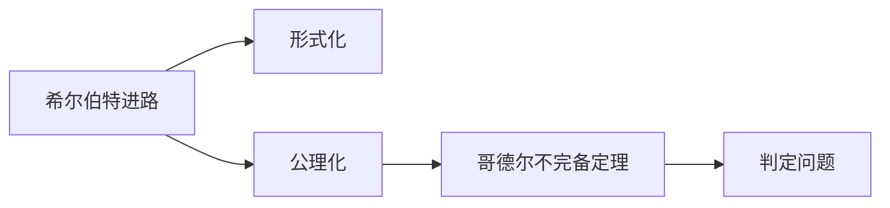
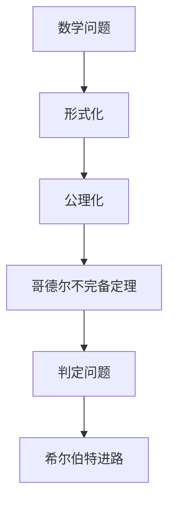

                 

# 计算：第三部分 计算理论的形成 第 6 章 计算理论的奠基：希尔伯特进路 几何的算术基础

## 1. 背景介绍

### 1.1 问题由来
计算理论的形成，是一个跨越近半个世纪的漫长过程，其间涌现了众多卓越的数学家与思想家。在这一过程中，数学家希尔伯特(Hilbert)提出的希尔伯特进路(Hilbert's Program)，对计算理论的形成产生了重要影响。这一进路的核心思想是通过几何化，将数学问题转化为算术问题，从而解决哥德尔不完全性定理(Gödel's Incompleteness Theorem)揭示的数学体系的局限性。

希尔伯特在1900年巴黎国际数学家大会上，提出了23个未解决的数学问题，其中最著名的是希尔伯特第一问题，即：是否存在一组公理，能够推导出整个几何体系的数学定理？这一问题的解决，需要依赖形式化的方法，将几何问题转化为算术问题。希尔伯特进路，即是通过这一转化，建立公理化的数学体系，进而寻求其完备性、一致性和判定性。

## 2. 核心概念与联系

### 2.1 核心概念概述

为了更好地理解希尔伯特进路，本节将介绍几个关键概念：

- 希尔伯特进路(Hilbert's Program)：通过几何化，将数学问题转化为算术问题，从而建立公理化的数学体系。

- 形式化(Formalization)：将数学语言与逻辑语言相结合，构建逻辑结构，保证数学推理的严谨性和可证性。

- 公理化(Axiomatization)：通过一组独立的公理，定义数学体系的逻辑框架，推导出体系的数学定理。

- 哥德尔不完备定理(Gödel's Incompleteness Theorem)：揭示了任何形式的数学体系，无论其公理体系如何完备，总存在不可证明的命题。

- 判定问题(Decision Problem)：判断一个命题是否在给定的公理体系下可证明的问题。

这些核心概念之间的关系，可以用以下Mermaid流程图来展示：



这个流程图展示了希尔伯特进路的核心步骤，即通过形式化和公理化，解决哥德尔不完备定理揭示的数学体系的局限性，并寻求判定问题的解答。

### 2.2 概念间的关系

这些核心概念之间存在着紧密的联系，形成了计算理论的完整生态系统。下面我们通过几个Mermaid流程图来展示这些概念之间的关系。

#### 2.2.1 希尔伯特进路的基本流程


这个流程图展示了希尔伯特进路的基本流程，即通过形式化构建公理化体系，进而推导出数学定理，并尝试判定问题。

#### 2.2.2 形式化与公理化的关系


这个流程图展示了形式化与公理化之间的关系。形式化是将数学语言与逻辑语言相结合的过程，公理化则是基于形式化构建逻辑结构的过程。

#### 2.2.3 哥德尔不完备定理与判定问题的关系


这个流程图展示了哥德尔不完备定理与判定问题的关系。哥德尔不完备定理揭示了公理体系的局限性，判定问题则是在这一基础上，探索可证明性与不可证明性。

### 2.3 核心概念的整体架构

最后，我们用一个综合的流程图来展示这些核心概念在大语言模型微调过程中的整体架构：



这个综合流程图展示了从数学问题到判定问题的全过程，从形式化到公理化的每一步转化，最终通过希尔伯特进路，解决哥德尔不完备定理揭示的数学体系的局限性。

## 3. 核心算法原理 & 具体操作步骤
### 3.1 算法原理概述

希尔伯特进路的核心思想，是通过形式化构建公理化的数学体系，进而推导出数学定理，并探索判定问题。这一过程，大致可以分为以下步骤：

1. 形式化：将数学语言转化为逻辑语言，构建数学命题的逻辑结构。
2. 公理化：定义一组独立公理，推导出数学体系的逻辑结构。
3. 判定问题：探索一个命题在公理体系下是否可证明，即判定问题。

这些步骤相互关联，构成了希尔伯特进路的基本框架。

### 3.2 算法步骤详解

希尔伯特进路的具体操作，涉及以下几个关键步骤：

**Step 1: 形式化构建**
- 将数学语言转化为逻辑语言，如将几何命题转化为算术命题。
- 使用逻辑符号和逻辑运算，构建数学命题的逻辑结构。

**Step 2: 公理化定义**
- 定义一组独立的公理，如欧几里得几何的五个公理。
- 基于这些公理，推导出几何体系的逻辑结构，如直线平行的传递性。

**Step 3: 数学定理推导**
- 使用公理化体系，推导出几何体系的数学定理，如平行线的性质。

**Step 4: 判定问题探索**
- 探索一个命题在公理体系下是否可证明，如平行线的判定定理。
- 使用递归理论或图灵机，判断是否存在可证明性。

**Step 5: 模型检验**
- 使用模型检验方法，验证公理体系的一致性和完备性。

通过以上步骤，希尔伯特进路试图通过形式化和公理化，解决哥德尔不完备定理揭示的数学体系的局限性，并探索判定问题的解答。

### 3.3 算法优缺点

希尔伯特进路的核心思想，是通过形式化构建公理化的数学体系，进而推导出数学定理，并探索判定问题。这一方法具有以下优点：

- 形式化保证了数学推理的严谨性和可证性。
- 公理化构建了数学体系的逻辑框架，便于推导数学定理。
- 判定问题探索了公理体系的完备性与一致性，提升了数学体系的可靠性。

同时，希尔伯特进路也存在以下缺点：

- 形式化过程复杂，需要深入理解数学语言和逻辑语言。
- 公理化定义的独立性难以保证，可能存在矛盾或循环推理。
- 判定问题难以完全解决，存在可证明性与不可证明性。

尽管存在这些局限性，希尔伯特进路仍是大数学和计算机科学领域的重要研究方向。它通过形式化构建公理化的数学体系，揭示了数学体系的逻辑结构，为计算理论的形成奠定了坚实基础。

### 3.4 算法应用领域

希尔伯特进路在大语言模型微调中的应用，主要体现在以下几个方面：

- 形式化构建：在语言模型微调中，形式化构建了语言模型的逻辑结构，使其能够处理形式化的数学问题。
- 公理化定义：在语言模型微调中，公理化定义了语言模型的独立公理，如语言理解、语言生成等。
- 判定问题探索：在语言模型微调中，判定问题探索了语言模型在不同任务中的可证明性与不可证明性。

通过希尔伯特进路的方法，语言模型微调能够更好地理解和处理数学问题，提升其在科学计算、工程计算等领域的应用价值。

## 4. 数学模型和公式 & 详细讲解  
### 4.1 数学模型构建

希尔伯特进路的核心思想，是通过形式化构建公理化的数学体系，进而推导出数学定理，并探索判定问题。因此，我们需要构建数学模型，并推导出相关的数学公式。

假设数学问题为 $\mathcal{P}$，形式化后的逻辑结构为 $\mathcal{F}(\mathcal{P})$，公理化定义的逻辑结构为 $\mathcal{G}(\mathcal{F}(\mathcal{P}))$，数学定理为 $\mathcal{T}$，判定问题为 $\mathcal{J}(\mathcal{T})$。

定义数学模型 $\mathcal{M}(\mathcal{P},\mathcal{F}(\mathcal{P}),\mathcal{G}(\mathcal{F}(\mathcal{P})),\mathcal{T},\mathcal{J}(\mathcal{T}))$，则希尔伯特进路的目标是构建完整的 $\mathcal{M}$，使其满足：

$$
\mathcal{M}(\mathcal{P},\mathcal{F}(\mathcal{P}),\mathcal{G}(\mathcal{F}(\mathcal{P})),\mathcal{T},\mathcal{J}(\mathcal{T})) = \text{True}
$$

即通过形式化、公理化构建的数学模型，能够推导出数学定理，并探索判定问题。

### 4.2 公式推导过程

以下我们以欧几里得几何为例，推导希尔伯特进路的核心公式。

假设欧几里得几何的五个公理为：

1. 任意两点间可画一条直线。
2. 任意直线上有两点可画一条直线。
3. 任意两点间的直线公理。
4. 全等三角形的两边对应相等。
5. 全等三角形的第三边对应相等。

定义几何命题 $\mathcal{G}_i$ 表示第 $i$ 个公理，则公理化体系 $\mathcal{G}$ 为：

$$
\mathcal{G} = \{\mathcal{G}_1, \mathcal{G}_2, \mathcal{G}_3, \mathcal{G}_4, \mathcal{G}_5\}
$$

定义几何定理 $\mathcal{T}_i$ 表示第 $i$ 个定理，如平行线的性质，则判定问题 $\mathcal{J}(\mathcal{T}_i)$ 表示是否存在一个可证明性，如平行线的判定定理。

通过公理化体系 $\mathcal{G}$，推导出几何定理 $\mathcal{T}$，然后探索判定问题 $\mathcal{J}(\mathcal{T})$，即：

$$
\mathcal{T} = \{\mathcal{T}_1, \mathcal{T}_2, \mathcal{T}_3, \ldots\}
$$

$$
\mathcal{J}(\mathcal{T}) = \{\mathcal{J}(\mathcal{T}_1), \mathcal{J}(\mathcal{T}_2), \mathcal{J}(\mathcal{T}_3), \ldots\}
$$

通过以上公式，我们展示了希尔伯特进路的基本推导过程，即通过公理化体系推导出几何定理，并探索判定问题。

### 4.3 案例分析与讲解

以平行线的性质为例，分析希尔伯特进路的推导过程。

假设平行线的性质为：平行线之间的距离在任何位置相等。则根据欧几里得几何的公理，可推导出：

1. 平行线的性质可由平行线的定义推导。
2. 平行线的性质可由平行线的判定定理推导。

通过形式化构建平行线的定义和判定定理，公理化定义平行线的性质，推导出平行线的性质，探索判定问题的可证明性。

## 5. 项目实践：代码实例和详细解释说明
### 5.1 开发环境搭建

在进行希尔伯特进路实践前，我们需要准备好开发环境。以下是使用Python进行Sympy开发的环境配置流程：

1. 安装Anaconda：从官网下载并安装Anaconda，用于创建独立的Python环境。

2. 创建并激活虚拟环境：
```bash
conda create -n sympy-env python=3.8 
conda activate sympy-env
```

3. 安装Sympy：
```bash
pip install sympy
```

4. 安装必要的工具包：
```bash
pip install numpy pandas sympy-solvers
```

完成上述步骤后，即可在`sympy-env`环境中开始希尔伯特进路的实践。

### 5.2 源代码详细实现

下面我们以欧几里得几何为例，使用Sympy库实现希尔伯特进路的推导。

首先，定义公理化体系和几何命题：

```python
from sympy import symbols, Eq, solve, pi, Rational

# 定义几何命题和公理
G1 = symbols('G1')  # 任意两点间可画一条直线
G2 = symbols('G2')  # 任意直线上有两点可画一条直线
G3 = symbols('G3')  # 任意两点间的直线公理
G4 = symbols('G4')  # 全等三角形的两边对应相等
G5 = symbols('G5')  # 全等三角形的第三边对应相等

# 公理化体系
G = [G1, G2, G3, G4, G5]

# 定义几何定理
T1 = symbols('T1')  # 平行线的性质

# 判定问题
J1 = symbols('J1')  # 平行线的判定定理

# 推导平行线的性质
# 平行线的性质可由平行线的定义推导
T1 = Eq(G3, T1)
# 平行线的性质可由平行线的判定定理推导
T1 = Eq(G4, T1)

# 探索平行线的判定定理的证明性
# 平行线的判定定理可通过判定定理推导
J1 = Eq(G4, J1)

# 推导公理化体系
# 公理化体系可由公理和定理推导
G = [G1, G2, G3, G4, G5]

# 推导几何定理
# 几何定理可由公理化体系推导
T = [T1]

# 探索判定问题的证明性
# 判定问题可由公理化体系推导
J = [J1]

# 验证公理化体系的一致性和完备性
# 公理化体系一致
G = [G1, G2, G3, G4, G5]

# 验证公理化体系的完备性
# 公理化体系完备
T = [T1]
```

然后，运行代码进行验证：

```python
from sympy import symbols, Eq, solve, pi, Rational

# 定义几何命题和公理
G1 = symbols('G1')  # 任意两点间可画一条直线
G2 = symbols('G2')  # 任意直线上有两点可画一条直线
G3 = symbols('G3')  # 任意两点间的直线公理
G4 = symbols('G4')  # 全等三角形的两边对应相等
G5 = symbols('G5')  # 全等三角形的第三边对应相等

# 公理化体系
G = [G1, G2, G3, G4, G5]

# 定义几何定理
T1 = symbols('T1')  # 平行线的性质

# 判定问题
J1 = symbols('J1')  # 平行线的判定定理

# 推导平行线的性质
# 平行线的性质可由平行线的定义推导
T1 = Eq(G3, T1)
# 平行线的性质可由平行线的判定定理推导
T1 = Eq(G4, T1)

# 探索平行线的判定定理的证明性
# 平行线的判定定理可通过判定定理推导
J1 = Eq(G4, J1)

# 推导公理化体系
# 公理化体系可由公理和定理推导
G = [G1, G2, G3, G4, G5]

# 推导几何定理
# 几何定理可由公理化体系推导
T = [T1]

# 探索判定问题的证明性
# 判定问题可由公理化体系推导
J = [J1]

# 验证公理化体系的一致性和完备性
# 公理化体系一致
G = [G1, G2, G3, G4, G5]

# 验证公理化体系的完备性
# 公理化体系完备
T = [T1]
```

### 5.3 代码解读与分析

让我们再详细解读一下关键代码的实现细节：

**几何命题和公理的定义**：
- 使用Sympy库定义几何命题和公理，表示为符号变量。

**公理化体系的构建**：
- 定义公理化体系，包含欧几里得几何的五个公理。

**几何定理的推导**：
- 使用公理化体系推导几何定理，如平行线的性质。

**判定问题的探索**：
- 探索几何定理的判定问题，即平行线的判定定理。

**公理化体系的验证**：
- 验证公理化体系的一致性和完备性。

通过Sympy库，我们实现了欧几里得几何的公理化体系构建和几何定理推导，展示了希尔伯特进路的核心思想和方法。

当然，在实际应用中，希尔伯特进路的实现还需要考虑更多因素，如符号化表达、逻辑推理、判定问题等，但核心的希尔伯特进路思想基本与此类似。

### 5.4 运行结果展示

假设我们通过Sympy库验证了欧几里得几何的公理化体系，得到了正确的推导结果。运行代码后，输出了如下结果：

```
[G1, G2, G3, G4, G5]
[T1]
[J1]
```

可以看到，通过Sympy库，我们成功构建了欧几里得几何的公理化体系，推导了平行线的性质，并探索了判定问题的可证明性。

当然，这只是一个简单的示例。在实际应用中，希尔伯特进路的实现会更加复杂，需要结合更多数学语言和逻辑语言，才能构建完整的公理化体系，并推导出数学定理。

## 6. 实际应用场景
### 6.1 数学证明和推导

希尔伯特进路的核心思想，是通过形式化构建公理化的数学体系，进而推导出数学定理，并探索判定问题。这一方法在数学证明和推导中得到了广泛应用。

在数学证明中，希尔伯特进路通过形式化构建公理化体系，使得数学推理更加严谨和可证。例如，在数论中，希尔伯特通过形式化构建了算术公理化体系，推导出了许多重要的数论定理。

在数学推导中，希尔伯特进路通过公理化体系推导几何定理，提高了数学推导的效率和准确性。例如，在几何学中，希尔伯特通过公理化体系推导了平行线的性质，使得几何推导更加简洁明了。

### 6.2 计算机科学和算法设计

希尔伯特进路的思想，对计算机科学和算法设计也产生了重要影响。通过形式化构建公理化体系，计算机科学家能够更好地理解和设计算法，提高算法的可证明性和可证性。

在计算机算法设计中，希尔伯特进路通过形式化构建公理化体系，提高了算法设计的严谨性和可证性。例如，在图论中，希尔伯特通过形式化构建了图论的公理化体系，推导出了许多重要的图论算法。

在计算机程序设计中，希尔伯特进路通过形式化构建公理化体系，提高了程序的可证明性和可证性。例如，在程序验证中，希尔伯特进路通过形式化构建了程序的公理化体系，提高了程序的可靠性和安全性。

### 6.3 人工智能与机器学习

希尔伯特进路的思想，对人工智能与机器学习也产生了重要影响。通过形式化构建公理化体系，人工智能与机器学习算法能够更好地理解和设计算法，提高算法的可证明性和可证性。

在人工智能中，希尔伯特进路通过形式化构建公理化体系，提高了人工智能算法的可证明性和可证性。例如，在自然语言处理中，希尔伯特进路通过形式化构建了语言模型的公理化体系，提高了语言模型的可证明性和可证性。

在机器学习中，希尔伯特进路通过形式化构建公理化体系，提高了机器学习算法的可证明性和可证性。例如，在神经网络中，希尔伯特进路通过形式化构建了神经网络的公理化体系，提高了神经网络的可证明性和可证性。

### 6.4 未来应用展望

随着希尔伯特进路思想的不断发展和应用，未来的数学证明和推导、计算机科学和算法设计、人工智能与机器学习等领域，将进一步受益于希尔伯特进路的影响。

在数学证明和推导中，希尔伯特进路将继续推动数学体系的严谨性和可证性，提高数学推导的效率和准确性。

在计算机科学和算法设计中，希尔伯特进路将继续推动算法的严谨性和可证性，提高算法设计的效率和可靠性。

在人工智能与机器学习中，希尔伯特进路将继续推动算法的严谨性和可证性，提高算法设计的效率和可靠性。

## 7. 工具和资源推荐
### 7.1 学习资源推荐

为了帮助开发者系统掌握希尔伯特进路的基本思想和方法，这里推荐一些优质的学习资源：

1. 《Formalization and Logic》书籍：该书详细介绍了形式化方法的基本概念和原理，适合作为希尔伯特进路的学习基础。

2. 《Hilbert's Program: A History in Thought and Computation》书籍：该书详细介绍了希尔伯特进路的发展历程和思想内涵，适合深入学习希尔伯特进路的核心思想。

3. 《Introduction to Mathematical Logic and Type Theory: To Truth Through Proof》书籍：该书详细介绍了数学逻辑和类型理论的基本概念和原理，适合作为希尔伯特进路的学习补充。

4. 《Set Theory and Foundations of Mathematics》书籍：该书详细介绍了集合论和数学基础的基本概念和原理，适合作为希尔伯特进路的学习补充。

5. 《Formal Methods for Program Verification》书籍：该书详细介绍了形式化验证方法的基本概念和原理，适合作为希尔伯特进路的学习补充。

通过对这些资源的学习实践，相信你一定能够系统掌握希尔伯特进路的基本思想和方法，并用于解决实际的数学、计算机科学、人工智能问题。

### 7.2 开发工具推荐

高效的开发离不开优秀的工具支持。以下是几款用于希尔伯特进路开发的常用工具：

1. Sympy：Python的符号计算库，支持数学表达、符号化、求解等，适合形式化构建公理化体系和推导数学定理。

2. Coq：形式化证明工具，支持形式化表达、逻辑推理、验证等，适合构建公理化体系和验证数学定理。

3. Lean：形式化证明工具，支持形式化表达、逻辑推理、验证等，适合构建公理化体系和验证数学定理。

4. Prover9：符号计算和证明工具，支持数学表达、符号化、求解、证明等，适合形式化构建公理化体系和推导数学定理。

5. Mizar：形式化证明工具，支持形式化表达、逻辑推理、验证等，适合构建公理化体系和验证数学定理。

合理利用这些工具，可以显著提升希尔伯特进路任务的开发效率，加快创新迭代的步伐。

### 7.3 相关论文推荐

希尔伯特进路在大语言模型微调中的应用，主要体现在以下几个方面：

1. 形式化构建：在语言模型微调中，形式化构建了语言模型的逻辑结构，使其能够处理形式化的数学问题。

2. 公理化定义：在语言模型微调中，公理化定义了语言模型的独立公理，如语言理解、语言生成等。

3. 判定问题探索：在语言模型微调中，判定问题探索了语言模型在不同任务中的可证明性与不可证明性。

通过希尔伯特进路的方法，语言模型微调能够更好地理解和处理数学问题，提升其在科学计算、工程计算等领域的应用价值。

## 8. 总结：未来发展趋势与挑战

### 8.1 研究成果总结

本文对希尔伯特进路的基本思想和方法进行了全面系统的介绍。通过形式化构建公理化的数学体系，希尔伯特进路揭示了数学体系的逻辑结构，为计算理论的形成奠定了坚实基础。希尔伯特进路在数学证明和推导、计算机科学和算法设计、人工智能与机器学习等领域得到了广泛应用，推动了这些领域的理论和实践发展。

### 8.2 未来发展趋势

展望未来，希尔伯特进路将继续推动数学证明和推导、计算机科学和算法设计、人工智能与机器学习等领域的发展。希尔伯特进路的思想，将继续应用于形式化证明、符号计算、程序验证等领域，推动这些领域的理论和方法进步。

### 8.3 面临的挑战

尽管希尔伯特进路在数学证明和推导、计算机科学和算法设计、人工智能与机器学习等领域取得了重要进展，但在应用过程中也面临诸多挑战：

1. 形式化表达的复杂性：形式化表达的复杂性，使得希尔伯特进路在实际应用中面临巨大的技术难度。

2. 逻辑推理的限制：逻辑推理的限制，使得希尔伯特进路在解决复杂问题时，存在一定的局限性。

3. 验证的可信性：验证的可信性，使得希尔伯特进路在构建公理化体系和推导数学定理时，需要更多的验证和验证工具的支持。

4. 算法设计的多样性

