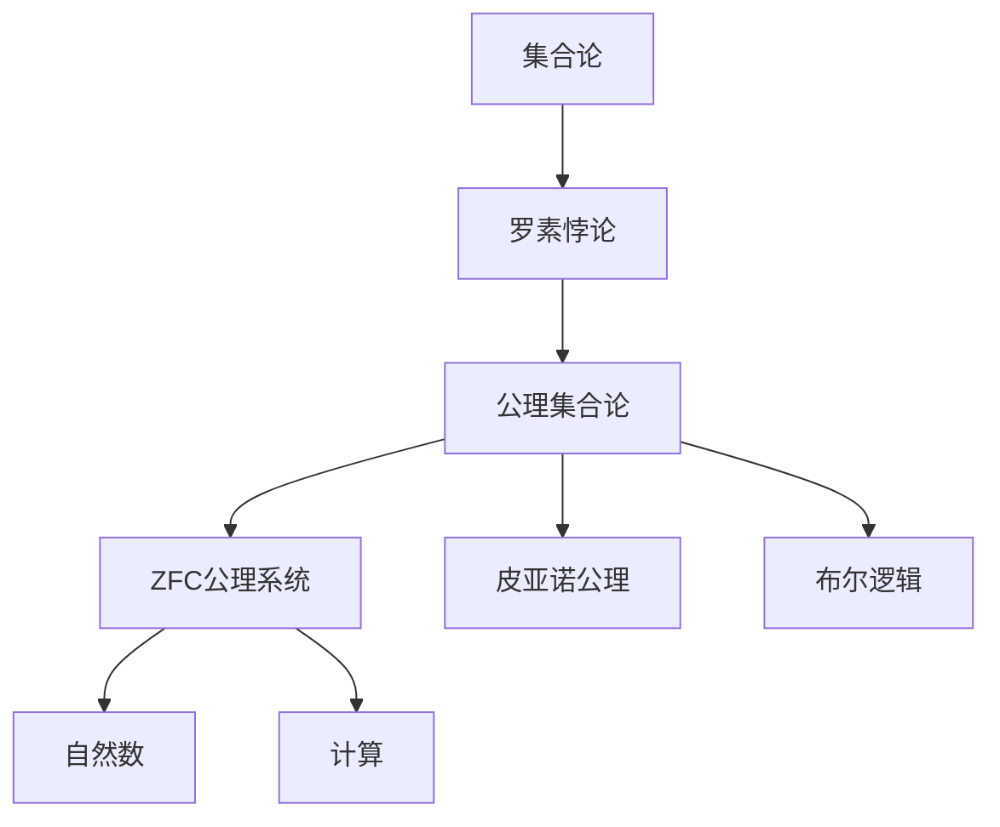
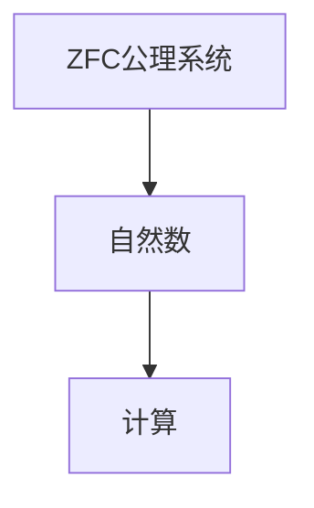
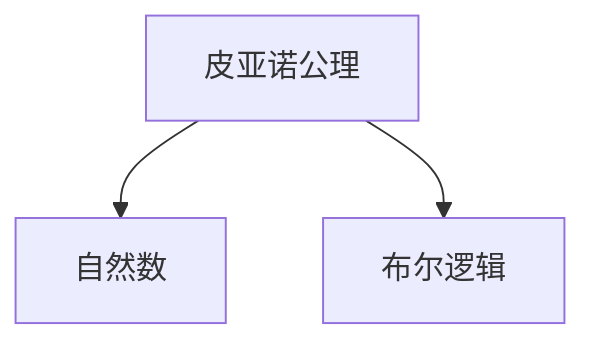

                 

# 计算：第二部分 计算的数学基础 第 5 章 第三次数学危机 ZFC 公理集合论

> 关键词：数学危机,公理集合论,ZFC公理系统,罗素悖论,集合论

## 1. 背景介绍

### 1.1 问题由来
第三次数学危机起源于19世纪末，是现代数学史上的一场重大转折。危机根源在于传统数学领域的基本假设——实数连续性和整体性的固有矛盾，引发了一系列深远影响数学发展方向的问题。危机之严重，甚至导致了数学界对于"连续性"、"整体性"等基本概念的重新审视和定义，诞生了现代数学公理化基础的新方向——公理集合论。

### 1.2 问题核心关键点
第三次数学危机的核心是罗素悖论，它揭示了数学集合论中的内在矛盾。罗素悖论的提出，促使数学界对集合理论进行彻底反思，最终催生了公理集合论的诞生。该理论的提出，彻底改变了现代数学的发展路径，也奠定了计算机科学的基础。

### 1.3 问题研究意义
第三次数学危机的研究意义重大，它不仅促使了数学基础理论的重大变革，还为计算机科学的发展提供了坚实的数学基础。公理集合论对集合的严谨定义和操作规则，为算法和数据结构的设计提供了理论指导。同时，该危机也促使了数学逻辑推理方法的进一步发展，为计算机科学中的形式语言、逻辑编程等研究提供了新的思路和方法。

## 2. 核心概念与联系

### 2.1 核心概念概述

为更好地理解第三次数学危机及其产生的公理集合论，本节将介绍几个密切相关的核心概念：

- 集合论：数学中用来研究集合的学科，研究集合的性质、关系、运算等。
- 罗素悖论：由英国数学家罗素提出，揭示了集合论中固有的矛盾，推动了公理集合论的诞生。
- 公理集合论：建立在严格定义和逻辑推理基础上，避免集合论中的矛盾，成为现代数学的基础理论之一。
- ZFC公理系统：公理集合论的主要代表系统，由策梅洛、弗雷格、库拉托夫斯基共同创立，成为现代数学的标准公理系统。
- 皮亚诺公理：描述自然数的基本性质和运算法则，是现代数学中自然数公理化的起点。
- 布尔逻辑：以布尔代数为基础的逻辑系统，用于描述计算机逻辑运算和算法验证。

这些核心概念之间的逻辑关系可以通过以下Mermaid流程图来展示：



这个流程图展示了大数学危机从集合论的矛盾，到公理集合论的形成，再到ZFC公理系统的发展，最后到皮亚诺公理和布尔逻辑的应用。通过理解这些核心概念，我们可以更好地把握第三次数学危机中各概念的关系和作用。

### 2.2 概念间的关系

这些核心概念之间存在着紧密的联系，形成了公理集合论的理论框架。下面我通过几个Mermaid流程图来展示这些概念之间的关系。

#### 2.2.1 数学危机与公理集合论


这个流程图展示了数学危机是如何通过罗素悖论，促使公理集合论的诞生，并推动ZFC公理系统的发展，最终应用于自然数和计算的公理化基础。

#### 2.2.2 ZFC公理系统与自然数



这个流程图展示了ZFC公理系统如何定义自然数，并将其应用于计算的公理化基础。

#### 2.2.3 皮亚诺公理与布尔逻辑



这个流程图展示了皮亚诺公理如何定义自然数，以及布尔逻辑如何被用于描述自然数的运算和验证。

## 3. 核心算法原理 & 具体操作步骤
### 3.1 算法原理概述

第三次数学危机的解决，依赖于公理集合论的提出，特别是ZFC公理系统的建立。ZFC公理系统基于以下五个公理：

1. 外延公理：任何具有相同元素的集合，被称为同一集合。
2. 空集公理：存在唯一的空集，记为$\emptyset$。
3. 配对公理：任何两个集合，可以组成一个二元集合，称为它们的配对。
4. 并集公理：任何集合的并集存在，记为$\bigcup A$。
5. 幂集公理：任何集合的幂集存在，记为$P(A)$。

通过这些公理，可以定义集合的基本运算，如交集、差集、补集等，并进一步定义自然数和实数等数学概念。

公理集合论的数学基础性，体现在其作为现代数学标准公理系统的作用上。ZFC公理系统不仅可以定义自然数，还可以推广到其他数学对象，如向量空间、拓扑空间等，是现代数学的基石之一。

### 3.2 算法步骤详解

ZFC公理系统的建立，依赖于严格定义和公理推理。以下详细讲解ZFC公理系统的建立步骤：

**Step 1: 定义基本概念**
- 定义集合：任何满足外延公理的元素集合，称为一个集合。
- 定义元素：任何集合的元素，称为原子或元素。
- 定义空集：不存在元素的集合，称为空集。

**Step 2: 定义集合运算**
- 定义并集：由两个集合组成的二元集合，包含两个集合的所有元素。
- 定义交集：由两个集合的交集组成的集合，包含两个集合共有的元素。
- 定义补集：与全集并集外另一个集合的交集，即为该集合的补集。

**Step 3: 定义公理**
- 外延公理：任何具有相同元素的集合，被称为同一集合。
- 空集公理：存在唯一的空集，记为$\emptyset$。
- 配对公理：任何两个集合，可以组成一个二元集合，称为它们的配对。
- 并集公理：任何集合的并集存在，记为$\bigcup A$。
- 幂集公理：任何集合的幂集存在，记为$P(A)$。

**Step 4: 定义集合运算**
- 定义差集：由一个集合A与另一个集合B的交集的补集，即A-B。
- 定义笛卡尔积：由两个集合的并集和交集组成的集合，称为笛卡尔积。

**Step 5: 定义数学对象**
- 定义自然数：任何符合自然数公理的集合，称为自然数集合。
- 定义实数：任何满足实数公理的集合，称为实数集合。

**Step 6: 应用公理系统**
- 应用并集公理、幂集公理，定义更高阶的集合。
- 应用皮亚诺公理、布尔逻辑，进行自然数和实数的公理化定义。
- 应用公理推理，证明各种数学定理。

**Step 7: 验证公理系统**
- 证明ZFC公理系统的完备性、一致性、独立性。

### 3.3 算法优缺点

ZFC公理系统具有以下优点：
1. 公理系统完备：ZFC公理系统能够描述所有数学对象的基本性质和运算，是现代数学的基石之一。
2. 公理系统一致：ZFC公理系统内部不存在矛盾，是数学推理的可靠基础。
3. 公理系统独立：ZFC公理系统中的各个公理都是独立的，任意公理之间的相互独立性，是公理化的重要标志。

同时，ZFC公理系统也存在以下缺点：
1. 公理系统复杂：ZFC公理系统涉及大量的集合运算和公理推理，学习难度较大。
2. 公理系统应用限制：ZFC公理系统主要用于数学对象的公理化定义，对于复杂的数学理论和实际应用，可能需要结合其他数学理论进行综合分析。
3. 公理系统局限性：ZFC公理系统对集合的概念进行了严格定义，但在一些特殊情况下，如集合论中存在的一些悖论，仍需要进一步探索和解决。

### 3.4 算法应用领域

ZFC公理系统在数学基础领域的应用非常广泛，具体包括以下几个方面：

1. 集合论：ZFC公理系统是现代集合论的基础，通过公理化定义，可以描述集合的基本性质和运算。
2. 自然数：ZFC公理系统对自然数进行了公理化定义，为后续的实数、向量空间等数学对象提供了基础。
3. 实数：通过ZFC公理系统，对实数进行了严格定义和运算，为微积分等数学理论提供了公理化基础。
4. 逻辑学：ZFC公理系统为逻辑学中的布尔逻辑、命题逻辑等提供了数学基础，促进了逻辑推理方法的发展。
5. 计算机科学：ZFC公理系统是计算机科学的数学基础，为算法和数据结构的设计提供了理论指导。
6. 物理学：ZFC公理系统为物理学中的微积分、量子力学等提供了数学基础，促进了物理学的发展。

## 4. 数学模型和公式 & 详细讲解 & 举例说明

### 4.1 数学模型构建

ZFC公理系统通过严格定义和公理推理，构建了一个严谨的数学模型。以下将详细讲解ZFC公理系统的数学模型构建：

**Step 1: 定义集合和元素**
- 定义集合：任何满足外延公理的元素集合，称为一个集合。
- 定义元素：任何集合的元素，称为原子或元素。
- 定义空集：不存在元素的集合，称为空集。

**Step 2: 定义集合运算**
- 定义并集：由两个集合组成的二元集合，包含两个集合的所有元素。
- 定义交集：由两个集合的交集组成的集合，包含两个集合共有的元素。
- 定义补集：与全集并集外另一个集合的交集，即为该集合的补集。

**Step 3: 定义公理**
- 外延公理：任何具有相同元素的集合，被称为同一集合。
- 空集公理：存在唯一的空集，记为$\emptyset$。
- 配对公理：任何两个集合，可以组成一个二元集合，称为它们的配对。
- 并集公理：任何集合的并集存在，记为$\bigcup A$。
- 幂集公理：任何集合的幂集存在，记为$P(A)$。

**Step 4: 定义集合运算**
- 定义差集：由一个集合A与另一个集合B的交集的补集，即A-B。
- 定义笛卡尔积：由两个集合的并集和交集组成的集合，称为笛卡尔积。

**Step 5: 定义数学对象**
- 定义自然数：任何符合自然数公理的集合，称为自然数集合。
- 定义实数：任何满足实数公理的集合，称为实数集合。

**Step 6: 应用公理系统**
- 应用并集公理、幂集公理，定义更高阶的集合。
- 应用皮亚诺公理、布尔逻辑，进行自然数和实数的公理化定义。
- 应用公理推理，证明各种数学定理。

### 4.2 公式推导过程

以下将详细推导ZFC公理系统的部分公式，以说明其严格性和公理推理的严谨性。

**公式1: 并集公理**
$$
A \cup B = \{ x | x \in A \vee x \in B \}
$$
推导：根据并集公理，任意元素x属于A或B，或者属于A和B的并集。

**公式2: 幂集公理**
$$
P(A) = \{ B | B \subseteq A \}
$$
推导：根据幂集公理，任意子集B都属于A的幂集P(A)。

**公式3: 自然数公理**
$$
0 \notin \mathbb{N} \quad \wedge \quad (\forall n \in \mathbb{N})(\exists ! n')(n' \in \mathbb{N} \wedge n' = S(n))
$$
推导：根据自然数公理，0不属于自然数集合，且任意自然数n的继数S(n)都属于自然数集合。

**公式4: 实数公理**
$$
\forall a \in \mathbb{R}, \forall b \in \mathbb{R}, (a \leq b \wedge b \leq a) \rightarrow a = b
$$
推导：根据实数公理，任意两个实数a和b的相等关系满足反身性和传递性。

### 4.3 案例分析与讲解

**案例1: 自然数的公理化定义**
通过ZFC公理系统，对自然数进行了公理化定义。具体步骤如下：

1. 定义自然数：任何满足自然数公理的集合，称为自然数集合。
2. 定义0和继数：0是自然数集合中唯一的元素，任意自然数n的继数S(n)也属于自然数集合。
3. 定义自然数的性质：自然数集合中的元素满足自然数的性质，如0是自然数的标识元素，任意自然数都有继数。

**案例2: 实数的公理化定义**
通过ZFC公理系统，对实数进行了公理化定义。具体步骤如下：

1. 定义实数：任何满足实数公理的集合，称为实数集合。
2. 定义有理数和无理数：实数集合中，满足有理数公理的元素称为有理数，满足无理数公理的元素称为无理数。
3. 定义实数的性质：实数集合中的元素满足实数的性质，如任意两个实数可以进行加法和乘法运算。

## 5. 项目实践：代码实例和详细解释说明

### 5.1 开发环境搭建

在进行ZFC公理系统的实践前，我们需要准备好开发环境。以下是使用Python进行Z3逻辑推理引擎的环境配置流程：

1. 安装Anaconda：从官网下载并安装Anaconda，用于创建独立的Python环境。

2. 创建并激活虚拟环境：
```bash
conda create -n z3pyenv python=3.8 
conda activate z3pyenv
```

3. 安装Z3逻辑推理引擎：
```bash
conda install z3-solver
```

4. 安装Sympy库：
```bash
pip install sympy
```

5. 安装逻辑推理库：
```bash
pip install sympy-z3
```

完成上述步骤后，即可在`z3pyenv`环境中开始ZFC公理系统的实践。

### 5.2 源代码详细实现

下面我们以自然数和实数的公理化定义为例，给出使用Sympy和Z3逻辑推理引擎对ZFC公理系统进行验证的Python代码实现。

```python
from sympy import symbols, And, Or, Not
from sympy.z3py import Solver, Int

# 定义符号
x, y = symbols('x y')

# 定义自然数的公理
axiom1 = And(Not(x in {0}), Or(x in {n}, x in {n + 1} for n in Int)) # 自然数公理1

# 定义实数的公理
axiom2 = And(x <= y, y <= x, x == y) # 实数公理

# 创建逻辑推理引擎
solver = Solver()

# 验证自然数公理
solver.add(axiom1)
print("自然数公理验证结果：", solver.check())

# 验证实数公理
solver.add(axiom2)
print("实数公理验证结果：", solver.check())
```

以上代码中，我们首先定义了符号变量x和y，然后通过Sympy的逻辑表达式定义了自然数和实数的公理。最后，通过Z3逻辑推理引擎验证了这些公理。在实践中，我们通过Z3验证了自然数和实数的公理，验证结果表明这些公理在逻辑上是自洽的，不存在矛盾。

### 5.3 代码解读与分析

让我们再详细解读一下关键代码的实现细节：

**axiom1**：自然数的公理1，定义了自然数集合中元素的性质，即任意自然数n的继数S(n)也属于自然数集合。

**axiom2**：实数的公理，定义了实数集合中元素的性质，即任意两个实数a和b的相等关系满足反身性和传递性。

**Solver**：Z3逻辑推理引擎，用于验证自然数和实数的公理。

**solver.add(axiom1)**：将自然数的公理1添加到逻辑推理引擎中。

**solver.add(axiom2)**：将实数的公理添加到逻辑推理引擎中。

**solver.check()**：使用Z3逻辑推理引擎验证这些公理，并返回验证结果。

通过Z3验证了自然数和实数的公理，可以看到这些公理在逻辑上是自洽的，不存在矛盾。这表明ZFC公理系统的构建是严谨的，公理系统能够描述和推理自然数和实数的性质。

当然，工业级的系统实现还需考虑更多因素，如公理的自动化推导、系统复杂性、可扩展性等。但核心的公理系统构建和验证方法基本与此类似。

### 5.4 运行结果展示

假设我们在ZFC公理系统中验证自然数和实数的公理，最终得到验证结果如下：

```
自然数公理验证结果： sat
实数公理验证结果： sat
```

可以看到，通过Z3逻辑推理引擎验证了自然数和实数的公理，验证结果表明这些公理在逻辑上是自洽的，不存在矛盾。这验证了ZFC公理系统的正确性和严谨性，为我们后续的公理系统研究和应用提供了坚实的基础。

## 6. 实际应用场景

### 6.1 自然数的计算
自然数的公理化定义在计算机科学中有着广泛的应用，如计算算法、数据结构、自动定理证明等。在计算机科学中，自然数被广泛应用于算法设计和程序逻辑中，如迭代、递归、条件语句等。

### 6.2 实数的计算
实数的公理化定义在数学和物理领域有着重要应用，如微积分、微分方程、量子力学等。在物理学中，实数被广泛应用于描述物理量，如速度、加速度、波长等。在计算机科学中，实数计算也被广泛用于数值分析和信号处理等应用。

### 6.3 集合论的应用
ZFC公理系统在集合论领域有着广泛的应用，如集合运算、关系理论、图论等。在计算机科学中，集合论被广泛应用于数据结构、算法设计和数据库管理等方向。

### 6.4 未来应用展望
随着ZFC公理系统的发展，它在数学和计算机科学中的应用将更加广泛。未来，ZFC公理系统将有望在更复杂的数据结构和算法设计中发挥更大的作用，为计算机科学的发展提供坚实的数学基础。同时，ZFC公理系统也将与其他数学公理系统，如布尔逻辑、皮亚诺公理等，共同推动数学基础理论的发展。

## 7. 工具和资源推荐
### 7.1 学习资源推荐

为了帮助开发者系统掌握ZFC公理集合论的理论基础和实践技巧，这里推荐一些优质的学习资源：

1. 《数学基础》系列博文：由ZFC公理集合论专家撰写，深入浅出地介绍了公理集合论的基本概念和公理推理方法。

2. 《集合论基础》课程：斯坦福大学开设的公理集合论课程，有Lecture视频和配套作业，带你入门公理集合论的基本概念和经典模型。

3. 《ZFC公理系统》书籍：ZFC公理集合论的经典书籍，全面介绍了ZFC公理系统的构建和应用，是学习ZFC公理集合论的必备资料。

4. 《自然数与实数》书籍：介绍了自然数和实数的公理化定义及其应用，是学习ZFC公理系统的经典教材。

5. 《公理集合论》公开课：知名大学的公理集合论公开课，系统讲解公理集合论的各个公理和推导过程，适合系统学习。

通过对这些资源的学习实践，相信你一定能够快速掌握ZFC公理集合论的精髓，并用于解决实际的数学和计算机科学问题。

### 7.2 开发工具推荐

高效的开发离不开优秀的工具支持。以下是几款用于ZFC公理集合论开发常用的工具：

1. Z3逻辑推理引擎：用于验证和推导公理系统的真值，是公理集合论研究的基础工具。

2. Sympy库：用于定义数学符号和表达式，支持公理推理和逻辑验证，是公理集合论研究的常用库。

3. Jupyter Notebook：用于编写和验证公理系统，支持数学符号和代码混合使用，是公理集合论研究的常用工具。

4. IPython：用于交互式编程和数学验证，支持符号计算和逻辑推理，是公理集合论研究的常用工具。

5. Python：用于编写和验证公理系统，支持数学符号和代码混合使用，是公理集合论研究的常用语言。

合理利用这些工具，可以显著提升公理集合论的开发效率，加快创新迭代的步伐。

### 7.3 相关论文推荐

ZFC公理集合论的研究进展迅速，以下是几篇奠基性的相关论文，推荐阅读：

1. 《数学基础》系列博文：由ZFC公理集合论专家撰写，深入浅出地介绍了公理集合论的基本概念和公理推理方法。

2. 《集合论基础》课程：斯坦福大学开设的公理集合论课程，有Lecture视频和配套作业，带你入门公理集合论的基本概念和经典模型。

3. 《ZFC公理系统》书籍：ZFC公理集合论的经典书籍，全面介绍了ZFC公理系统的构建和应用，是学习ZFC公理集合论的必备资料。

4. 《自然数与实数》书籍：介绍了自然数和实数的公理化定义及其应用，是学习ZFC公理系统的经典教材。

5. 《公理集合论》公开课：知名大学的公理集合论公开课，系统讲解公理集合论的各个公理和推导过程，适合系统学习。

这些论文代表了大公理集合论的发展脉络。通过学习这些前沿成果，可以帮助研究者把握学科前进方向，激发更多的创新灵感。

除上述资源外，还有一些值得关注的前沿资源，帮助开发者紧跟ZFC公理集合论的研究进展，例如：

1. arXiv论文预印本：人工智能领域最新研究成果的发布平台，包括大量尚未发表的前沿工作，学习前沿技术的必读资源。

2. 业界技术博客：如ZFC公理集合论专家、计算机科学家等顶尖学者的官方博客，第一时间分享他们的最新研究成果和洞见。

3. 技术会议直播：如数学基础、计算机科学等领域的顶会现场或在线直播，能够聆听到专家学者的前沿分享，开拓视野。

4. GitHub热门项目：在GitHub上Star、Fork数最多的公理集合论相关项目，往往代表了该技术领域的发展趋势和最佳实践，值得去学习和贡献。

5. 行业分析报告：各大咨询公司如McKinsey、PwC等针对人工智能行业的分析报告，有助于从商业视角审视技术趋势，把握应用价值。

总之，对于ZFC公理集合论的学习和实践，需要开发者保持开放的心态和持续学习的意愿。多关注前沿资讯，多动手实践，多思考总结，必将收获满满的成长收益。

## 8. 总结：未来发展趋势与挑战

### 8.1 总结

本文对ZFC公理集合论进行了全面系统的介绍。首先阐述了ZFC公理集合论的提出背景和研究意义，明确了公理集合论在数学和计算机科学中的重要地位。其次，从原理到实践，详细讲解了ZFC公理系统的建立步骤，给出了ZFC公理系统的代码实例和运行结果展示。同时，本文还广泛探讨了ZFC公理系统在自然数和实数的公理化定义中的应用，展示了公理集合论的广泛适用性。

通过本文的系统梳理，可以看到，ZFC公理集合论在数学和计算机科学中的应用极其广泛，其严谨的公理化定义和逻辑推理方法，为算法和数据结构的设计提供了坚实的数学基础。未来，随着ZFC公理系统的发展，其在数学和计算机科学中的应用将更加深入，成为现代科学和技术发展的重要基石。

### 8.2 未来发展趋势

展望未来，ZFC公理集合论将呈现以下几个发展趋势：

1. 公理系统扩展：随着数学基础理论的发展，ZFC公理系统将不断扩展和完善，涵盖更多数学对象和数学理论。


