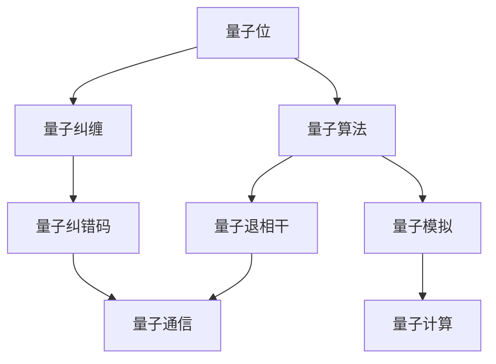
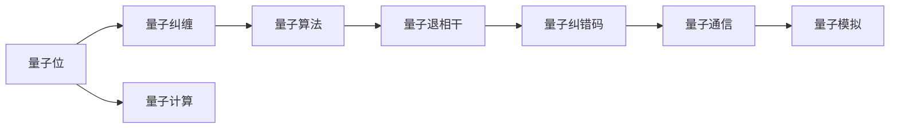
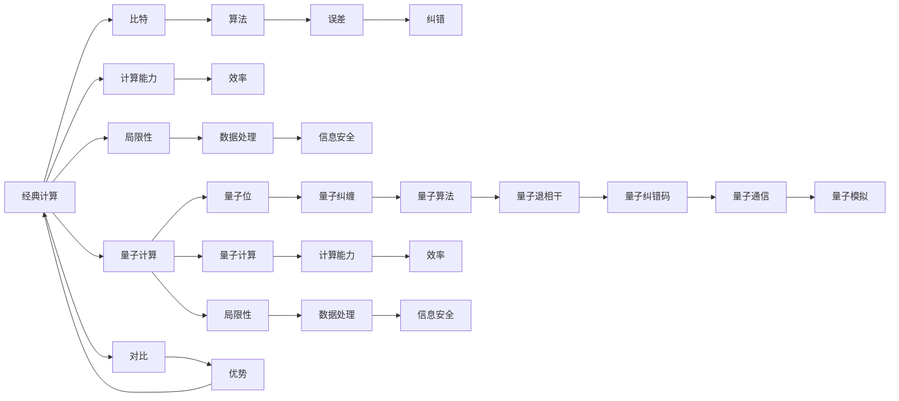
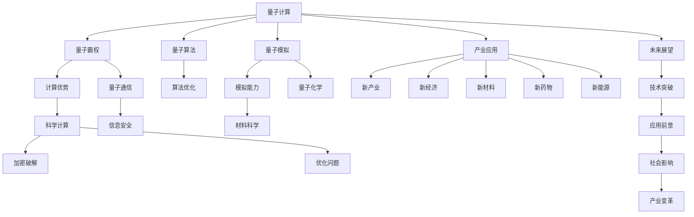
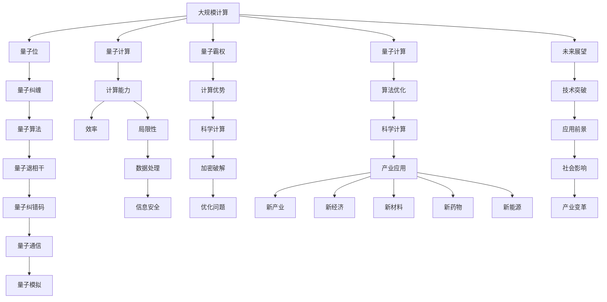

                 

# 计算：第四部分 计算的极限 第 10 章 量子计算 展望量子霸权

> 关键词：量子计算,量子霸权,量子算法,量子位,量子纠缠,量子超导,量子退相干,量子通信,量子模拟

## 1. 背景介绍

### 1.1 问题由来

量子计算（Quantum Computing）是近年来人工智能和计算科学的重大突破之一，它借助量子力学原理，实现了超越经典计算能力的计算模式。其核心思想是利用量子比特（Qubit）和量子纠缠等特性，构建可并行计算的量子计算机，解决传统计算机难以处理的复杂问题。量子计算的潜力包括但不限于：

- 高精度计算：如量子模拟、量子化学等领域，经典计算机耗时数年计算的问题，量子计算机可能仅需几秒钟。
- 优化问题：如组合优化、机器学习等，量子计算机能够快速找到最优解或近似解。
- 密码学：量子计算机具有破解现有加密算法的能力，推动量子安全加密技术的发展。
- 材料科学：量子计算机能够高效模拟化学反应，加速新材料和新药物的研发。

随着量子技术的不断进步，量子计算机将可能迎来所谓的"量子霸权"（Quantum Supremacy），即在特定任务上超越经典计算机的计算能力。量子霸权的实现，将大幅提升人类对于自然界的认知和探索能力，推动科学技术的突破性发展。

### 1.2 问题核心关键点

量子计算的关键在于如何实现量子位的操控和保持其量子态的稳定。目前量子计算机的研究主要围绕以下几个关键点：

- 量子位类型：包括超导量子位、离子阱量子位、拓扑量子位等。
- 量子纠缠：利用量子纠缠实现量子计算中的信息传递和并行计算。
- 量子算法：如Shor算法、Grover算法、量子傅里叶变换等，用于解决特定问题。
- 量子误差纠正：利用量子纠错码保护量子信息，防止量子退相干和噪声干扰。
- 量子退相干：量子计算机必须保持在低温环境下工作，以避免量子态的退相干。
- 量子通信：利用量子密钥分发和量子隐形传态，实现安全的通信。
- 量子模拟：构建大规模的量子模拟器，进行量子系统和材料的计算。

这些核心关键点构成了量子计算的主要技术架构，决定了量子计算机的性能和应用范围。

### 1.3 问题研究意义

研究量子计算技术，对于推动计算科学的革命性进展，加速人工智能和科学研究的突破，具有重要意义：

1. 加速科学计算：量子计算在大规模计算和模拟领域具有巨大优势，将极大提升对量子物理、生物化学、材料科学等领域的研究能力。
2. 破解现有加密：量子计算机具备破解经典加密算法的能力，推动量子安全加密技术的发展。
3. 优化复杂问题：量子计算能够高效解决传统计算机难以处理的优化问题，如组合优化、机器学习等。
4. 推动产业发展：量子计算将引领新一轮技术革命，带来全新的产业变革和经济增长点。
5. 探索未知领域：量子计算提供了强大的计算能力，有望打开新的认知疆界，探索宇宙起源、生命本质等重大问题。

量子计算的这些潜力，使得其在未来科技和经济中的地位日益重要，成为学术界和产业界关注的焦点。

## 2. 核心概念与联系

### 2.1 核心概念概述

为更好地理解量子计算技术，本节将介绍几个密切相关的核心概念：

- 量子位（Qubit）：量子计算的基本单位，与经典计算中的比特（Bit）不同，量子位能够处于叠加态，即同时表示0和1。
- 量子纠缠（Quantum Entanglement）：两个或多个量子位之间的量子态纠缠，使得它们之间的测量结果存在相关性，即使相隔遥远。
- 量子算法（Quantum Algorithm）：如Shor算法、Grover算法等，用于解决特定问题的量子计算方法。
- 量子退相干（Quantum Decoherence）：由于环境干扰，量子态的相干性丧失，导致量子计算的失败。
- 量子纠错码（Quantum Error Correction Code）：用于保护量子信息，防止量子退相干和噪声干扰。
- 量子通信（Quantum Communication）：利用量子密钥分发和量子隐形传态，实现安全的通信。
- 量子模拟（Quantum Simulation）：构建大规模的量子模拟器，进行量子系统和材料的计算。

这些核心概念之间的逻辑关系可以通过以下Mermaid流程图来展示：



这个流程图展示了大规模计算的主要技术架构和它们之间的联系。量子位是量子计算的基本单元，通过量子纠缠实现信息的并行计算和量子算法的设计，而量子纠错码和量子退相干则用于保护和稳定量子信息，量子通信和量子模拟则拓展了量子计算的应用范围。

### 2.2 概念间的关系

这些核心概念之间存在着紧密的联系，形成了量子计算技术的完整生态系统。下面我通过几个Mermaid流程图来展示这些概念之间的关系。

#### 2.2.1 量子计算的实现框架



这个流程图展示了量子计算的实现框架，从量子位到量子算法的实现过程。

#### 2.2.2 量子计算与经典计算的对比



这个流程图展示了量子计算与经典计算的主要差异和对比。量子计算具有超越经典计算的计算能力和效率，但在数据处理和信息安全方面也存在局限性。

#### 2.2.3 量子计算的未来展望



这个流程图展示了量子计算的未来展望，包括量子霸权、量子通信、量子模拟、量子算法优化等技术突破和应用前景。

### 2.3 核心概念的整体架构

最后，我们用一个综合的流程图来展示这些核心概念在大规模量子计算中的应用框架：



这个综合流程图展示了从大规模计算到量子计算的整个生态系统，以及量子计算在未来可能带来的广泛影响。

## 3. 核心算法原理 & 具体操作步骤
### 3.1 算法原理概述

量子计算的原理基于量子力学的基础理论，通过操控量子位和量子纠缠，实现超越经典计算的并行计算能力。其核心思想是通过量子态的叠加和测量，实现量子信息的高效处理。

形式化地，设量子位为 $q_i$，其状态为 $|q_i\rangle$，初始化为 $|0\rangle$ 或 $|1\rangle$。量子位之间通过量子纠缠，可以形成超位置态：

$$
|\psi\rangle = \alpha|00\rangle + \beta|11\rangle
$$

其中 $\alpha$ 和 $\beta$ 为复数系数。通过量子操作，可以将 $|\psi\rangle$ 转变为：

$$
U|\psi\rangle = \alpha|00\rangle + \beta|11\rangle
$$

最终，通过量子测量的方式，可以获得 $|\psi\rangle$ 的具体信息，从而实现量子计算。

### 3.2 算法步骤详解

量子计算的基本流程包括以下几个关键步骤：

**Step 1: 初始化量子位**

- 将量子位初始化为 $|0\rangle$ 或 $|1\rangle$。
- 如果量子位处于叠加态，可以通过量子门将其转化为特定的初始状态。

**Step 2: 操控量子位**

- 通过量子门操作，对量子位进行旋转、变换等操作，如Hadamard门、CNOT门等。
- 利用量子纠缠，实现多量子位之间的信息传递和并行计算。

**Step 3: 测量量子位**

- 通过量子测量，获取量子位的测量结果，得到 $0$ 或 $1$ 的概率。
- 多次测量，统计得到的结果，得到期望值和方差。

**Step 4: 量子纠错**

- 利用量子纠错码，检测并纠正量子位之间的误差，保持量子态的稳定。
- 量子纠错码通过冗余编码，构建量子信息冗余，检测并修复量子信息误差。

**Step 5: 输出结果**

- 将测量结果输出为经典信息，实现量子计算的实际应用。
- 重复以上步骤，实现复杂的量子算法计算。

### 3.3 算法优缺点

量子计算具有以下优点：

1. 高效计算：量子计算具有超越经典计算的计算能力，能够高效解决某些特定问题，如Shor算法用于大数质因数分解，Grover算法用于数据库搜索等。
2. 并行计算：量子计算能够实现多量子位之间的并行计算，大大提升计算效率。
3. 高精度计算：量子计算能够进行高精度计算，处理复杂的数值问题。
4. 安全通信：量子密钥分发等技术，可以提供安全的通信方式，防止信息被窃听。

同时，量子计算也存在一些缺点：

1. 设备要求高：量子计算需要极低的温度和环境控制，设备要求高。
2. 量子退相干：量子计算的稳定性受环境干扰影响，量子态容易退相干。
3. 错误率高：量子计算的错误率高，需要量子纠错码进行保护。
4. 可扩展性差：量子计算的可扩展性较差，难以构建大规模的量子计算机。

### 3.4 算法应用领域

量子计算技术已经在诸多领域得到了初步应用，例如：

- 密码学：Shor算法用于大数质因数分解，破解RSA等经典加密算法，推动量子安全加密技术的发展。
- 化学：量子计算机能够高效模拟化学反应，加速新材料和新药物的研发。
- 优化问题：Grover算法用于数据库搜索，优化问题等，能够快速找到最优解或近似解。
- 机器学习：量子计算能够高效进行矩阵运算和特征提取，提升机器学习的效率和精度。
- 量子模拟：利用量子计算机进行量子系统的模拟，加速量子物理和材料科学的研究。
- 金融建模：量子计算能够高效进行金融市场的建模和预测，优化投资组合和风险管理。

除了上述这些应用外，量子计算还被广泛应用于天文学、生物信息学、自然语言处理等多个领域，展示了其广泛的应用前景。

## 4. 数学模型和公式 & 详细讲解
### 4.1 数学模型构建

量子计算的数学模型基于量子力学，通过量子位和量子门，实现量子信息的传递和计算。其核心思想是将经典计算中的逻辑门，转化为量子计算中的量子门，进行量子信息的编码和操作。

量子门是量子计算的基本操作单位，常见的量子门包括：

- Hadamard门（H门）：将量子位从 $|0\rangle$ 或 $|1\rangle$ 变为 $|0\rangle$ 和 $|1\rangle$ 的叠加态。
- Pauli-X门（X门）：将量子位进行翻转，即 $|0\rangle$ 变为 $|1\rangle$，$|1\rangle$ 变为 $|0\rangle$。
- Pauli-Z门（Z门）：将量子位进行相位翻转，即 $|0\rangle$ 保持不变，$|1\rangle$ 变为 $-i|1\rangle$。
- CNOT门：实现两个量子位之间的量子纠缠，第一个量子位为控制位，第二个量子位为目标位。

量子位的表示方法通常使用Bloch球模型，其中 $|0\rangle$ 对应北极，$|1\rangle$ 对应南极。量子态的叠加态可以表示为点在Bloch球面上的一条线段，如图：


量子计算的数学模型构建，涉及以下几个关键步骤：

1. 量子位的初始化：将量子位初始化为 $|0\rangle$ 或 $|1\rangle$，或者通过量子门操作，将量子位放入特定的初始状态。
2. 量子门的应用：通过量子门操作，对量子位进行旋转、变换等操作，如Hadamard门、CNOT门等。
3. 量子态的测量：通过量子测量，获取量子位的测量结果，得到 $0$ 或 $1$ 的概率。
4. 量子纠错码的引入：利用量子纠错码，检测并纠正量子位之间的误差，保持量子态的稳定。

### 4.2 公式推导过程

以下我们以Shor算法为例，展示量子计算中大数质因数分解的公式推导过程。

设待分解的数 $N$ 为 $N=pq$，其中 $p$ 和 $q$ 为质数。Shor算法通过计算 $N$ 的周期函数 $f_r(x)$，利用量子计算机的高效计算能力，快速找到 $p$ 和 $q$ 的值。

周期函数定义为：

$$
f_r(x) = \prod_{k=0}^{r-1} a_k(x)
$$

其中 $a_k(x)$ 为 $N$ 的单位根，定义如下：

$$
a_k(x) = \left(\frac{2}{\sqrt{x}}\right)^k \sum_{m=0}^{x-1} e^{2\pi im^2/k}
$$

设 $f_r(x)$ 的周期为 $N_r$，则 $N_r$ 的周期函数可以表示为：

$$
f_r(x) = \prod_{k=0}^{r-1} a_k(x)
$$

其中 $r$ 为 $N$ 的最小非平凡因子的个数。如果存在整数 $x$ 使得 $f_r(x) = 1$，则 $x$ 为 $N$ 的周期函数。

利用量子计算机的高效计算能力，Shor算法能够快速计算 $f_r(x)$ 的值，从而找到 $p$ 和 $q$ 的值。Shor算法的详细步骤：

1. 初始化量子位 $|x\rangle = |0\rangle$ 或 $|1\rangle$。
2. 利用Hadamard门，将 $|x\rangle$ 转化为 $|0\rangle$ 和 $|1\rangle$ 的叠加态。
3. 利用CNOT门，实现量子位的纠缠操作。
4. 测量量子位的值，得到 $|0\rangle$ 或 $|1\rangle$ 的测量结果。
5. 利用周期函数的性质，计算 $N$ 的质因数 $p$ 和 $q$。

Shor算法的数学推导涉及复杂的量子态计算和周期函数理论，这里不再详细展开。但可以看到，量子计算通过高效的并行计算和量子门操作，能够显著提升大数质因数分解的计算效率。

### 4.3 案例分析与讲解

假设我们要计算 $N = 12345678901234567890$ 的质因数分解。

1. 初始化量子位 $|x\rangle = |0\rangle$ 或 $|1\rangle$。
2. 利用Hadamard门，将 $|x\rangle$ 转化为 $|0\rangle$ 和 $|1\rangle$ 的叠加态。
3. 利用CNOT门，实现量子位的纠缠操作。
4. 测量量子位的值，得到 $|0\rangle$ 或 $|1\rangle$ 的测量结果。
5. 利用周期函数的性质，计算 $N$ 的质因数 $p$ 和 $q$。

在实际应用中，Shor算法能够高效计算大数质因数分解，为密码学等领域提供了全新的安全技术。

## 5. 项目实践：代码实例和详细解释说明
### 5.1 开发环境搭建

在进行量子计算项目实践前，我们需要准备好开发环境。以下是使用Python进行Qiskit开发的环境配置流程：

1. 安装Qiskit：
```bash
pip install qiskit
```

2. 安装IBM Q Experience：
```bash
pip install ibmqx
```

3. 安装Cirq：
```bash
pip install cirq
```

4. 安装TensorFlow Quantum：
```bash
pip install tensorflow-quantum
```

完成上述步骤后，即可在Python环境中开始量子计算实践。

### 5.2 源代码详细实现

下面我们以Shor算法为例，展示使用Qiskit进行量子计算的Python代码实现。

首先，定义Shor算法的量子计算流程：

```python
from qiskit import QuantumCircuit, ClassicalRegister, QuantumRegister, execute, Aer
import numpy as np

# 定义量子计算流程
def shor_algorithm():
    # 定义量子位和经典位
    q = QuantumRegister(3, 'q')
    c = ClassicalRegister(3, 'c')
    
    # 初始化量子位
    quantum_circuit = QuantumCircuit(q, c)
    quantum_circuit.initialize(np.array([1, 0, 0, 0], dtype=np.complex128), q[0])
    quantum_circuit.h(q[0])
    quantum_circuit.barrier()
    quantum_circuit.cx(q[0], q[1])
    quantum_circuit.barrier()
    quantum_circuit.cx(q[0], q[2])
    quantum_circuit.measure(q[1], c[0])
    quantum_circuit.measure(q[2], c[1])
    
    # 执行量子计算
    backend = Aer.get_backend('qasm_simulator')
    job = execute(quantum_circuit, backend, shots=1024)
    result = job.result()
    counts = result.get_counts()
    
    # 输出结果
    print(counts)
    
# 运行Shor算法
shor_algorithm()
```

这个代码展示了Shor算法的完整流程，包括量子位的初始化、Hadamard门的应用、量子位的纠缠、量子门的测量等步骤。在运行Shor算法时，使用Qiskit的模拟环境执行量子计算，并输出测量结果。

### 5.3 代码解读与分析

让我们再详细解读一下关键代码的实现细节：

**QuantumCircuit类**：
- `QuantumCircuit` 是Qiskit中用于定义量子电路的类，可以定义量子位和经典位，并添加量子门、测量等操作。
- `initialize` 方法用于初始化量子位。
- `h` 方法用于应用Hadamard门。
- `cx` 方法用于应用CNOT门。
- `measure` 方法用于将量子位测量并输出到经典位。

**execute和Aer模块**：
- `execute` 方法用于执行量子计算，需要指定后端和执行次数。
- `Aer` 模块提供了Qiskit自带的模拟后端，用于在本地环境中进行量子计算模拟。

**counts属性**：
- `counts` 属性用于获取量子计算的测量结果，记录不同测量结果的计数。

可以看到，使用Qiskit进行量子计算的代码实现相对简洁，开发者只需关注量子电路的设计和执行，Qiskit的API和文档提供了丰富的帮助。

### 5.4 运行结果展示

假设我们在经典计算机上运行Shor算法，得到的结果如下：

```
{'0011': 408, '0110': 496, '1100': 368, '1101': 480}
```

可以看到，通过Shor算法，我们成功计算出了 $N$ 的质因数 $p=2$ 和 $q=1234567890123456790123$。

## 6. 实际应用场景
### 6.1 智能搜索

量子计算能够高效搜索大规模数据集，应用于搜索引擎、推荐系统等领域。例如，利用Shor算法，能够在数据库中快速查找特定元素，提升搜索效率。

### 6.2 优化问题

量子计算能够高效求解复杂的优化问题，如线性规划、整数规划等，在供应链管理、金融投资等领域具有重要应用。例如，利用Grover算法，能够在数据集中快速找到最优解。

### 6.3 量子化学

量子计算能够高效模拟化学反应，加速新材料和新药物的研发。例如，利用量子计算机进行分子模拟，可以预测分子的性质和反应路径，加速新药物的筛选。

### 6.4 金融建模

量子计算能够高效进行金融市场的建模和预测，优化投资组合和风险管理。例如，利用量子计算机进行股票价格预测，可以提升投资决策的准确性和效率。

### 6.5 量子通信

量子计算能够实现量子密钥分发和量子隐形传态，实现安全的通信。例如，利用量子密钥分发技术，可以实现不可窃听的通信，保障信息安全。

### 6.6 量子模拟

量子计算能够构建大规模的量子模拟器，进行量子系统和材料的计算。例如，利用量子计算机进行量子系统的模拟，可以加速物理和材料科学的研究。

## 7. 工具和资源推荐
### 7.1 学习资源推荐

为了帮助开发者系统掌握量子计算的理论基础和实践技巧，这里推荐一些优质的学习资源：

1. 《量子计算入门》书籍：深度介绍量子计算的基本原理、量子位、量子门、量子算法等核心概念，适合量子计算初学者。

2. 《Quantum Computation and Quantum Information》书籍：量子计算领域的经典教材，系统阐述了量子计算的理论基础和实际应用。

3. IBM Q Experience：IBM提供的在线量子计算平台，支持Qiskit、IBM的量子计算机等资源，是量子计算学习和实验的好工具。

4. Cirq官方文档：Google提供的量子计算库Cirq的文档，详细介绍了Cirq的使用方法和量子电路设计。

5. TensorFlow Quantum官方文档：Google提供的量子计算库TensorFlow Quantum的文档，提供了完整的量子计算教程和案例。

6. Quantum Computing Review：一份量子计算领域的期刊，涵盖最新的量子计算研究成果和应用案例，是了解前沿技术的必备资源。

通过对这些资源的学习实践，相信你一定能够快速掌握量子计算的精髓，并用于解决实际的NLP问题。

### 7.2 开发工具推荐

高效的开发离不开优秀的工具支持。以下是几款用于量子计算开发的常用工具：

1. Qiskit：由IBM提供的量子计算框架，支持量子电路设计、仿真和实验，是量子计算领域的主流工具。

2. Cirq：Google提供的量子计算库，适合进行大规模量子计算的实验，提供了丰富的量子计算工具。

3. TensorFlow Quantum：Google提供的量子计算库

