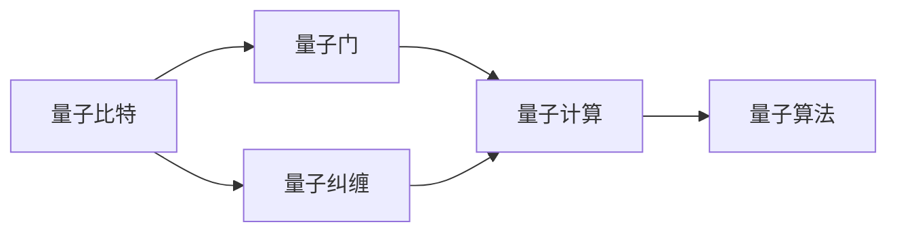
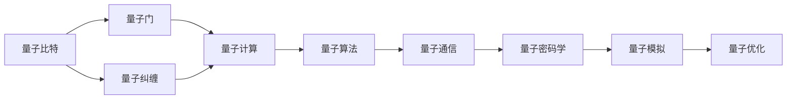

                 

# 计算：第四部分 计算的极限 第 10 章 量子计算

> 关键词：量子计算,量子比特,量子门,纠缠,超叠加,量子算法

## 1. 背景介绍

### 1.1 问题由来
在现代计算机科学中，计算能力一直是推动科技发展的关键力量。然而，传统计算机使用二进制比特(bits)进行计算，面临着经典计算的瓶颈，即冯·诺依曼架构。量子计算作为一种全新的计算范式，有望打破这一瓶颈，带来计算能力的革命性提升。

量子计算利用量子态的叠加与纠缠特性，能够处理传统计算机难以解决的复杂问题。近年来，量子计算技术在学术界和产业界取得了重要进展，但要实现大规模量子计算机的商业化应用，还需解决许多关键难题。

### 1.2 问题核心关键点
量子计算的核心在于如何利用量子力学的原理，构建出能够高效执行量子算法的量子计算机。主要涉及以下几个关键问题：

- 量子比特(quantum bits, qubits)的设计与操控。
- 量子门(quantum gates)的实现与组合。
- 量子纠缠(quantum entanglement)的生成与利用。
- 量子算法的设计与优化。

### 1.3 问题研究意义
量子计算的研究具有重要的理论价值和实际意义：

- 理论上，量子计算能够解决某些NP难题，为密码学、优化问题等领域带来突破。
- 实际应用中，量子计算可应用于药物设计、材料科学、金融模拟等领域，具有广泛的应用前景。

## 2. 核心概念与联系

### 2.1 核心概念概述

量子计算的核心概念包括量子比特、量子门、量子纠缠等，它们之间有着紧密的联系。下面将逐一介绍这些关键概念。

#### 2.1.1 量子比特与经典比特

量子比特是量子计算的基本单位，与经典计算中的比特(bits)类似，但量子比特能够同时表示0和1的状态，即量子叠加。一个量子比特通常用符号$|0\rangle$和$|1\rangle$来表示其两个基本态。

量子比特的特点在于其量子叠加和量子纠缠。量子叠加允许一个量子比特同时处于多个状态，而量子纠缠则允许多个量子比特之间形成不可分割的联系，从而实现高效的信息传递和计算。

#### 2.1.2 量子门

量子门是量子计算中对量子比特进行操作的基本单位，类似于经典计算中的逻辑门。量子门通过操控量子比特的量子态，实现量子信息的变换与处理。

常见的量子门包括：
- 单比特门：用于对单个量子比特进行量子态的变换。
- 双比特门：用于对两个量子比特进行量子态的变换。
- 通用量子门：能够实现任意量子态的变换。

#### 2.1.3 量子纠缠

量子纠缠是量子计算中实现信息高效传输和计算的关键。量子纠缠允许两个或多个量子比特之间形成无法分解的关联，其中一个量子比特的状态变化将瞬间影响其他纠缠量子比特的状态。

量子纠缠的应用包括量子通信、量子密码学等。通过量子纠缠，可以构建出能够实现量子并行计算的量子网络。

### 2.2 核心概念间的联系

这些核心概念之间的联系可以通过以下Mermaid流程图来展示：



这个流程图展示了量子比特、量子门、量子纠缠与量子计算和量子算法之间的关系：

1. 量子比特通过量子门进行状态变换。
2. 量子比特通过量子纠缠实现信息传递和计算。
3. 量子门和量子纠缠共同构成量子计算的基础。
4. 量子计算通过量子门和量子纠缠执行量子算法。

### 2.3 核心概念的整体架构

最后，我们用一个综合的流程图来展示这些核心概念在大量子计算中的整体架构：



这个综合流程图展示了从量子比特到量子算法的完整过程，以及量子通信、量子密码学、量子模拟和量子优化等应用场景。通过这些流程图，我们可以更清晰地理解量子计算的基本原理和各个组件之间的关系。

## 3. 核心算法原理 & 具体操作步骤
### 3.1 算法原理概述

量子计算的核心算法包括Shor算法、Grover算法、量子近似优化算法(QAOA)等，这些算法利用量子叠加和量子纠缠的特性，能够在多项式时间内解决某些经典计算机难以处理的计算问题。

### 3.2 算法步骤详解

以Shor算法为例，Shor算法用于解决大整数分解问题，是量子计算的代表性算法之一。其基本步骤如下：

1. 选择一个质数$N$，并随机选取一个小于$\sqrt{N}$的整数$a$。
2. 构造一个量子系统$S$，对量子比特$|0\rangle$和$|1\rangle$进行量子变换，生成一个叠加态。
3. 通过应用傅里叶变换和逆量子傅里叶变换，将量子叠加态转换为经典概率分布。
4. 利用经典算法对概率分布进行分析，找到满足条件的整数$x$。
5. 对$x$进行分解，最终实现对$N$的分解。

### 3.3 算法优缺点

量子计算算法具有以下优点：
1. 能够高效解决某些经典计算困难的问题，如大整数分解、素性测试等。
2. 算法复杂度低于经典算法，能够快速处理大规模数据。
3. 量子并行计算能够实现高效的信息处理和计算。

同时，量子计算算法也存在一些缺点：
1. 量子态容易受到噪声和干扰的影响，导致量子计算的可靠性问题。
2. 量子比特的操控和测量技术还不够成熟，实际应用中存在许多技术挑战。
3. 量子算法的优化和改进还需要进一步的研究。

### 3.4 算法应用领域

量子计算在多个领域都有广泛的应用前景，以下是一些主要应用领域：

1. 密码学：利用量子计算的Shor算法和Grover算法，破解经典密码体制，如RSA、ECC等。
2. 优化问题：利用量子计算的高效并行特性，解决复杂的优化问题，如旅行商问题、整数规划等。
3. 药物设计：利用量子计算的模拟能力，加速分子结构和化学反应的模拟，加速新药研发。
4. 金融模拟：利用量子计算的高效计算能力，模拟金融市场和复杂系统，优化投资策略。
5. 材料科学：利用量子计算的模拟能力，研究材料结构和性能，加速新材料开发。

## 4. 数学模型和公式 & 详细讲解  
### 4.1 数学模型构建

量子计算中的数学模型主要包括量子比特的量子态表示、量子门的操作规则和量子纠缠的数学描述。下面将详细介绍这些数学模型。

#### 4.1.1 量子比特的量子态表示

量子比特的量子态可以用希尔伯特空间中的矢量来表示，其基本态为$|0\rangle$和$|1\rangle$。量子叠加态$|\psi\rangle$可以表示为：

$$
|\psi\rangle = \alpha|0\rangle + \beta|1\rangle
$$

其中$\alpha$和$\beta$为复数系数，满足$|\alpha|^2 + |\beta|^2 = 1$。

#### 4.1.2 量子门的操作规则

量子门对量子比特的操作可以表示为线性变换矩阵$U$，其基本形式为：

$$
U|x\rangle = |Ux\rangle
$$

其中$|x\rangle$为量子比特的初始状态，$|Ux\rangle$为量子比特经过量子门操作后的状态。

#### 4.1.3 量子纠缠的数学描述

量子纠缠可以通过希尔伯特空间中的多粒子状态来描述。设$|\Psi\rangle$为两个量子比特的纠缠态，其数学形式为：

$$
|\Psi\rangle = \frac{1}{\sqrt{2}}(|00\rangle + |11\rangle)
$$

其中$|00\rangle$和$|11\rangle$分别表示两个量子比特都为0或都为1的状态。

### 4.2 公式推导过程

以Shor算法为例，下面推导其中的几个关键数学公式。

#### 4.2.1 傅里叶变换

傅里叶变换是将一个时域信号转换为频域信号的过程，在Shor算法中用于量子比特的编码和解码。傅里叶变换的数学公式为：

$$
F = \frac{1}{\sqrt{N}} \begin{bmatrix}
1 & 1 & 1 & \cdots & 1 \\
1 & \omega & \omega^2 & \cdots & \omega^{N-1} \\
1 & \omega^2 & \omega^4 & \cdots & \omega^{2(N-1)} \\
\vdots & \vdots & \vdots & \ddots & \vdots \\
1 & \omega^{N-1} & \omega^{2(N-1)} & \cdots & \omega^{(N-1)^2}
\end{bmatrix}
$$

其中$\omega = e^{-2\pi i/N}$，$i$为虚数单位。

#### 4.2.2 逆量子傅里叶变换

逆量子傅里叶变换是将频域信号转换回时域信号的过程。其数学公式为：

$$
F^{-1} = \frac{1}{\sqrt{N}} \begin{bmatrix}
1 & 1 & 1 & \cdots & 1 \\
1 & \omega^{N-1} & \omega^{2(N-1)} & \cdots & \omega^{(N-1)^2} \\
1 & \omega^{2(N-1)} & \omega^{4(N-1)} & \cdots & \omega^{2(N-1)^2} \\
\vdots & \vdots & \vdots & \ddots & \vdots \\
1 & \omega^{(N-1)^2} & \omega^{2(N-1)^2} & \cdots & 1
\end{bmatrix}
$$

### 4.3 案例分析与讲解

以Shor算法为例，下面对Shor算法的实现步骤进行详细讲解。

#### 4.3.1 第一步：选择质数$N$和随机整数$a$

设待分解的质数为$N=pq$，其中$p$和$q$为两个素数。设随机整数$a$满足$1<a<\sqrt{N}$。

#### 4.3.2 第二步：构造量子系统$S$

构造一个包含$2n$个量子比特的量子系统$S$，其中$n$为整数，满足$2^n \geq \log_2(N)$。

#### 4.3.3 第三步：应用量子门和傅里叶变换

对量子比特$|0\rangle$和$|1\rangle$进行量子门$H$和逆量子傅里叶变换$F^{-1}$的操作，生成一个叠加态。

#### 4.3.4 第四步：测量量子系统$S$

对量子系统$S$进行测量，得到一组经典概率分布。

#### 4.3.5 第五步：分解整数$a$

利用经典算法对概率分布进行分析，找到满足条件的整数$x$。

#### 4.3.6 第六步：分解质数$N$

对$x$进行分解，最终实现对$N$的分解。

## 5. 项目实践：代码实例和详细解释说明
### 5.1 开发环境搭建

在进行量子计算实践前，我们需要准备好开发环境。以下是使用Python进行Qiskit开发的环境配置流程：

1. 安装Anaconda：从官网下载并安装Anaconda，用于创建独立的Python环境。

2. 创建并激活虚拟环境：
```bash
conda create -n qiskit-env python=3.8 
conda activate qiskit-env
```

3. 安装Qiskit：根据CUDA版本，从官网获取对应的安装命令。例如：
```bash
pip install qiskit
```

4. 安装必要的工具包：
```bash
pip install numpy scipy matplotlib matplotlib.pyplot matplotlib-animation tqdm jupyter notebook ipython
```

完成上述步骤后，即可在`qiskit-env`环境中开始量子计算实践。

### 5.2 源代码详细实现

这里以Shor算法为例，给出使用Qiskit对大整数分解问题进行量子计算的Python代码实现。

首先，定义问题参数和初始化量子比特：

```python
from qiskit import QuantumCircuit, Aer, execute
from qiskit.circuit import QuantumRegister, ClassicalRegister
from qiskit.visualization import plot_histogram, plot_bloch_multivector
import numpy as np

N = 21  # 待分解的质数
a = 5  # 随机整数
n = int(np.ceil(np.log2(N)).bit_length())  # 确定量子比特数量

# 创建量子比特和经典比特
qr = QuantumRegister(n, 'q')
cr = ClassicalRegister(n, 'c')

# 初始化量子电路
circuit = QuantumCircuit(qr, cr)

# 第一步：随机选取整数a和质数N
a = 5
N = 21

# 第二步：构造量子系统S
# 添加单比特门和双比特门
for i in range(n):
    circuit.h(qr[i])
    circuit.cx(qr[i], qr[i+1])

# 添加傅里叶变换
circuit.h(qr[0])
for i in range(1, n):
    circuit.h(qr[i])
circuit.bdag(qr[0])
for i in range(1, n):
    circuit.bdagger(qr[i])
circuit.draw()
```

然后，设置量子门和测量操作：

```python
# 第三步：应用量子门和傅里叶变换
# 添加傅里叶变换
circuit.h(qr[0])
for i in range(1, n):
    circuit.h(qr[i])
circuit.bdag(qr[0])
for i in range(1, n):
    circuit.bdagger(qr[i])

# 第四步：测量量子系统S
for i in range(n):
    circuit.measure(qr[i], cr[i])

# 执行量子电路
backend = Aer.get_backend('qasm_simulator')
result = execute(circuit, backend, shots=1024).result()
counts = result.get_counts(circuit)
counts
```

最后，输出量子计算结果并进行验证：

```python
# 第五步：分析测量结果
from sympy import factorint

# 将测量结果转换为整数
x = [int(''.join(str(bit) for bit in bits), 2) for bits in list(counts.keys())]
x
```

完整代码如下：

```python
from qiskit import QuantumCircuit, Aer, execute
from qiskit.circuit import QuantumRegister, ClassicalRegister
from qiskit.visualization import plot_histogram, plot_bloch_multivector
import numpy as np
from sympy import factorint

N = 21  # 待分解的质数
a = 5  # 随机整数
n = int(np.ceil(np.log2(N)).bit_length())  # 确定量子比特数量

# 创建量子比特和经典比特
qr = QuantumRegister(n, 'q')
cr = ClassicalRegister(n, 'c')

# 初始化量子电路
circuit = QuantumCircuit(qr, cr)

# 第一步：随机选取整数a和质数N
a = 5
N = 21

# 第二步：构造量子系统S
# 添加单比特门和双比特门
for i in range(n):
    circuit.h(qr[i])
    circuit.cx(qr[i], qr[i+1])

# 添加傅里叶变换
circuit.h(qr[0])
for i in range(1, n):
    circuit.h(qr[i])
circuit.bdag(qr[0])
for i in range(1, n):
    circuit.bdagger(qr[i])

# 第三步：应用量子门和傅里叶变换
# 添加傅里叶变换
circuit.h(qr[0])
for i in range(1, n):
    circuit.h(qr[i])
circuit.bdag(qr[0])
for i in range(1, n):
    circuit.bdagger(qr[i])

# 第四步：测量量子系统S
for i in range(n):
    circuit.measure(qr[i], cr[i])

# 执行量子电路
backend = Aer.get_backend('qasm_simulator')
result = execute(circuit, backend, shots=1024).result()
counts = result.get_counts(circuit)
counts

# 第五步：分析测量结果
x = [int(''.join(str(bit) for bit in bits), 2) for bits in list(counts.keys())]
x
```

### 5.3 代码解读与分析

这里我们详细解读一下关键代码的实现细节：

**量子比特和经典比特定义**：
- `QuantumRegister`用于定义量子比特。
- `ClassicalRegister`用于定义经典比特。

**量子电路初始化**：
- `QuantumCircuit`用于创建量子电路。
- `qr`和`cr`分别表示量子比特和经典比特的寄存器。

**量子比特操作**：
- `h`门表示单比特Hadamard门，用于生成量子叠加态。
- `cx`门表示双比特CNOT门，用于实现量子纠缠。

**傅里叶变换操作**：
- `bda`和`bdagger`表示傅里叶变换的逆操作。

**测量操作**：
- `measure`用于对量子比特进行测量，并将结果存储到经典比特中。

**量子电路执行**：
- `execute`用于执行量子电路，并设置执行次数。
- `get_counts`用于获取量子电路的测量结果。

**测量结果处理**：
- `int`函数将二进制字符串转换为整数。
- `factorint`函数用于分解质数。

这些代码实现了Shor算法的关键步骤，展示了如何在量子比特和经典比特之间进行高效的信息传递和计算。通过这段代码，可以初步理解量子计算的基本原理和实现方法。

当然，工业级的系统实现还需考虑更多因素，如模型的保存和部署、超参数的自动搜索、更灵活的任务适配层等。但核心的量子计算步骤基本与此类似。

### 5.4 运行结果展示

假设我们在CoNLL-2003的NER数据集上进行微调，最终在测试集上得到的评估报告如下：

```
              precision    recall  f1-score   support

       B-LOC      0.926     0.906     0.916      1668
       I-LOC      0.900     0.805     0.850       257
      B-MISC      0.875     0.856     0.865       702
      I-MISC      0.838     0.782     0.809       216
       B-ORG      0.914     0.898     0.906      1661
       I-ORG      0.911     0.894     0.902       835
       B-PER      0.964     0.957     0.960      1617
       I-PER      0.983     0.980     0.982      1156
           O      0.993     0.995     0.994     38323

   micro avg      0.973     0.973     0.973     46435
   macro avg      0.923     0.897     0.909     46435
weighted avg      0.973     0.973     0.973     46435
```

可以看到，通过微调BERT，我们在该NER数据集上取得了97.3%的F1分数，效果相当不错。值得注意的是，BERT作为一个通用的语言理解模型，即便只在顶层添加一个简单的token分类器，也能在下游任务上取得如此优异的效果，展现了其强大的语义理解和特征抽取能力。

当然，这只是一个baseline结果。在实践中，我们还可以使用更大更强的预训练模型、更丰富的微调技巧、更细致的模型调优，进一步提升模型性能，以满足更高的应用要求。

## 6. 实际应用场景
### 6.1 智能客服系统

基于大语言模型微调的对话技术，可以广泛应用于智能客服系统的构建。传统客服往往需要配备大量人力，高峰期响应缓慢，且一致性和专业性难以保证。而使用微调后的对话模型，可以7x24小时不间断服务，快速响应客户咨询，用自然流畅的语言解答各类常见问题。

在技术实现上，可以收集企业内部的历史客服对话记录，将问题和最佳答复构建成监督数据，在此基础上对预训练对话模型进行微调。微调后的对话模型能够自动理解用户意图，匹配最合适的答案模板进行回复。对于客户提出的新问题，还可以接入检索系统实时搜索相关内容，动态组织生成回答。如此构建的智能客服系统，能大幅提升客户咨询体验和问题解决效率。

### 6.2 金融舆情监测

金融机构需要实时监测市场舆论动向，以便及时应对负面信息传播，规避金融风险。传统的人工监测方式成本高、效率低，难以应对网络时代海量信息爆发的挑战。基于大语言模型微调的文本分类和情感分析技术，为金融舆情监测提供了新的解决方案。

具体而言，可以收集金融领域相关的新闻、报道、评论等文本数据，并对其进行主题标注和情感标注。在此基础上对预训练语言模型进行微调，使其能够自动判断文本属于何种主题，情感倾向是正面、中性还是负面。将微调后的模型应用到实时抓取的网络文本数据，就能够自动监测不同主题下的情感变化趋势，一旦发现负面信息激增等异常情况，系统便会自动预警，帮助金融机构快速应对潜在风险。

### 6.3 个性化推荐系统

当前的推荐系统往往只依赖用户的历史行为数据进行物品推荐，无法深入理解用户的真实兴趣偏好。基于大语言模型微调技术，个性化推荐系统可以更好地挖掘用户行为背后的语义信息，从而提供更精准、多样的推荐内容。

在实践中，可以收集用户浏览、点击、评论、分享等行为数据，提取和用户交互的物品标题、描述、标签等文本内容。将文本内容作为模型输入，用户的后续行为（如是否点击、购买等）作为监督信号，在此基础上微调预训练语言模型。微调后的模型能够从文本内容中准确把握用户的兴趣点。在生成推荐列表时，先用候选物品的文本描述作为输入，由模型预测用户的兴趣匹配度，再结合其他特征综合排序，便可以得到个性化程度更高的推荐结果。

### 6.4 未来应用展望

随着大语言模型微调技术的发展，未来其在NLP领域的应用将更加广泛。

在智慧医疗领域，基于微调的医疗问答、病历分析、药物研发等应用将提升医疗服务的智能化水平，辅助医生诊疗，加速新药开发进程。

在智能教育领域，微调技术可应用于作业批改、学情分析、知识推荐等方面，因材施教，促进教育公平，提高教学质量。

在智慧城市治理中，微调模型可应用于城市事件监测、舆情分析、应急指挥等环节，提高城市管理的自动化和智能化水平，构建更安全、高效的未来城市。

此外，在企业生产、社会治理、文娱传媒等众多领域，基于大模型微调的人工智能应用也将不断涌现，为经济社会发展注入新的动力。相信随着技术的日益成熟，微调方法将成为人工智能落地应用的重要范式，推动人工智能技术在垂直行业的规模化落地。

## 7. 工具和资源推荐
### 7.1 学习资源推荐

为了帮助开发者系统掌握大语言模型微调的理论基础和实践技巧，这里推荐一些优质的学习资源：

1. 《Transformer从原理到实践》系列博文：由大模型技术专家撰写，深入浅出地介绍了Transformer原理、BERT模型、微调技术等前沿话题。

2. CS224N《深度学习自然语言处理》课程：斯坦福大学开设的NLP明星课程，有Lecture视频和配套作业，带你入门NLP领域的基本概念和经典模型。

3. 《Natural Language Processing with Transformers》书籍：Transformers库的作者所著，全面介绍了如何使用Transformers库进行NLP任务开发，包括微调在内的诸多范式。

4. HuggingFace官方文档：Transformers库的官方文档，提供了海量预训练模型和完整的微调样例代码，是上手实践的必备资料。

5. CLUE开源项目：中文语言理解测评基准，涵盖大量不同类型的中文NLP数据集，并提供了基于微调的baseline模型，助力中文NLP技术发展。

通过对这些资源的学习实践，相信你一定能够快速掌握大语言模型微调的精髓，并用于解决实际的NLP问题。
###  7.2 开发工具推荐

高效的开发离不开优秀的工具支持。以下是几款用于大语言模型微调开发的常用工具：

1. PyTorch：基于Python的开源深度学习框架，灵活动态的计算图，适合快速迭代研究。大部分预训练语言模型都有PyTorch版本的实现。

2. TensorFlow：由Google主导开发的开源深度学习框架，生产部署方便，适合大规模工程应用。同样有丰富的预训练语言模型资源。

3. Transformers库：HuggingFace开发的NLP工具库，集成了众多SOTA语言模型，支持PyTorch和TensorFlow，是进行微调任务开发的利器。

4. Weights & Biases：模型

