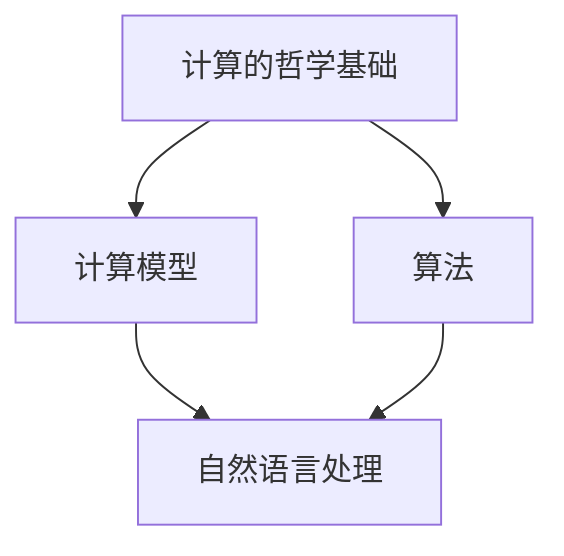
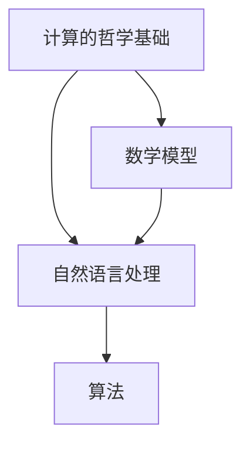

                 

# 计算：第四部分 计算的极限 第 13 章 自然哲学的计算原理

> 关键词：计算的极限,计算的哲学,数学基础,计算模型,自然语言处理(NLP)

## 1. 背景介绍

### 1.1 问题由来

在探索计算机科学领域的极限过程中，我们不得不考虑计算的哲学基础以及自然语言处理(NLP)的相关应用。计算的极限不仅仅局限于硬件性能的边界，更涉及到数学模型、算法以及数据处理等多个层面。而自然语言处理则是研究如何使计算机理解、处理和生成人类语言的技术，具有重要的理论意义和实际价值。

### 1.2 问题核心关键点

本文将围绕以下几个核心问题展开探讨：

1. **计算的哲学基础**：探讨计算的本质，以及如何通过数学模型和算法实现计算过程。
2. **自然语言处理的数学模型**：研究自然语言处理中常用的数学模型和算法。
3. **自然语言处理的实际应用**：分析自然语言处理在实际应用中的挑战和解决方案。

通过探讨这些问题，我们希望能够更深入地理解计算的极限，以及如何利用自然语言处理技术解决实际问题。

### 1.3 问题研究意义

研究计算的极限及其在自然语言处理中的应用，对于推进人工智能技术的发展，提升计算机系统的智能水平具有重要意义。通过深入探讨自然语言处理的基础理论和实际应用，可以更好地理解计算的本质，为未来的技术创新奠定基础。此外，对于解决智能系统中的语言理解、知识获取等问题，自然语言处理技术也提供了新的思路和方法。

## 2. 核心概念与联系

### 2.1 核心概念概述

在探讨自然语言处理的数学模型之前，我们首先需要理解几个关键概念：

- **计算的哲学基础**：计算的哲学基础涉及计算机科学的基本原理和逻辑，包括计算模型、算法和数学基础等。
- **自然语言处理(NLP)**：自然语言处理是研究如何让计算机理解和处理人类语言的领域，涵盖了语言理解、生成、翻译等多个子领域。
- **数学模型**：数学模型是用于描述系统行为和规律的数学表达式，是自然语言处理中常用的工具。

### 2.2 概念间的关系

自然语言处理依赖于计算的哲学基础，通过数学模型实现语言理解和处理。同时，自然语言处理中的问题也推动了计算模型的发展和算法优化。以下是一个Mermaid流程图，展示了这些概念之间的联系：



### 2.3 核心概念的整体架构

为了更全面地理解这些概念，我们提供了一个综合的流程图，展示了计算的哲学基础、自然语言处理、数学模型和算法之间的联系和作用：



## 3. 核心算法原理 & 具体操作步骤

### 3.1 算法原理概述

自然语言处理中常用的算法主要包括：

- **文本分类**：将文本归类到预定义的类别中，如情感分析、主题分类等。
- **命名实体识别**：识别文本中的人名、地名、组织名等实体。
- **信息抽取**：从文本中提取关键信息，如关系抽取、事件抽取等。
- **机器翻译**：将一种语言的文本翻译成另一种语言的文本。
- **文本生成**：生成符合语法和语义规则的文本，如对话生成、摘要生成等。

这些算法通常依赖于数学模型和计算模型来实现，如基于深度学习的模型、基于统计的模型等。

### 3.2 算法步骤详解

下面以**文本分类**为例，详细介绍算法的基本步骤：

1. **数据预处理**：将文本转化为模型能够处理的格式，如分词、去停用词、向量化等。
2. **模型训练**：选择适当的模型，如卷积神经网络(CNN)、循环神经网络(RNN)、Transformer等，并使用训练数据对其进行训练。
3. **模型评估**：使用验证数据集评估模型的性能，如准确率、召回率、F1分数等。
4. **模型优化**：根据评估结果调整模型超参数，如学习率、批大小、迭代次数等，以提高模型性能。
5. **模型部署**：将训练好的模型部署到实际应用中，处理新的文本数据。

### 3.3 算法优缺点

自然语言处理算法的优点包括：

- **高性能**：深度学习等算法在大规模数据上的性能通常优于传统算法。
- **自适应性强**：能够适应不同领域和任务的需求。
- **可扩展性好**：模型可以通过增加数据和计算资源进行扩展。

然而，这些算法也存在一些缺点：

- **数据依赖性高**：算法的效果很大程度上依赖于训练数据的质量和数量。
- **模型复杂度高**：深度学习模型通常具有大量参数，训练和推理效率较低。
- **解释性不足**：模型的决策过程往往难以解释，缺乏可解释性。

### 3.4 算法应用领域

自然语言处理算法在多个领域都有广泛应用，如：

- **智能客服**：用于处理客户咨询、生成自动回复等。
- **金融分析**：用于分析金融市场数据、生成财务报告等。
- **医疗诊断**：用于辅助医生诊断、生成医疗记录等。
- **内容推荐**：用于推荐新闻、商品、文章等。
- **聊天机器人**：用于提供自然语言交互服务。

## 4. 数学模型和公式 & 详细讲解 & 举例说明

### 4.1 数学模型构建

自然语言处理中的数学模型通常基于以下几个基本概念：

- **词向量模型**：将单词表示为高维向量，用于捕捉单词之间的语义关系。
- **神经网络模型**：通过多层神经网络实现单词和句子级别的语义表示。
- **序列模型**：用于处理文本序列数据，如循环神经网络(RNN)、长短时记忆网络(LSTM)等。

### 4.2 公式推导过程

以**词向量模型**为例，推导其基本公式：

假设单词 $w$ 的词向量表示为 $\vec{w}$，单词 $w_1$ 和 $w_2$ 的共现次数为 $c_{w_1w_2}$，则单词 $w$ 的词向量可以表示为：

$$
\vec{w} = \sum_{w_1} c_{w_1w} \vec{w_1}
$$

其中，$c_{w_1w}$ 表示单词 $w_1$ 和 $w$ 的共现次数。

### 4.3 案例分析与讲解

以下是一个使用词向量模型进行情感分析的案例：

1. **数据预处理**：将文本分词，去除停用词，转换为词向量序列。
2. **模型训练**：使用训练数据集训练词向量模型。
3. **模型评估**：在测试数据集上评估模型的性能。
4. **模型应用**：将训练好的模型应用于新的文本数据，进行情感分析。

## 5. 项目实践：代码实例和详细解释说明

### 5.1 开发环境搭建

为了进行自然语言处理的实践，我们需要搭建一个Python开发环境，并安装必要的库和工具。以下是详细的步骤：

1. **安装Python**：从官网下载并安装Python。
2. **安装pip**：在命令行输入 `python -m ensurepip --default-pip` 安装pip。
3. **安装TensorFlow**：在命令行输入 `pip install tensorflow` 安装TensorFlow。
4. **安装NLTK**：在命令行输入 `pip install nltk` 安装NLTK。
5. **安装spaCy**：在命令行输入 `pip install spacy` 安装spaCy。
6. **安装PyTorch**：在命令行输入 `pip install torch` 安装PyTorch。

### 5.2 源代码详细实现

下面以**文本分类**为例，给出使用PyTorch实现的基本代码：

```python
import torch
import torch.nn as nn
import torch.optim as optim
from torchtext.datasets import AG_NEWS
from torchtext.data import Field, BucketIterator

TEXT = Field(tokenize='spacy', include_lengths=True)
LABEL = Field(sequential=False, use_vocab=False)

train_data, test_data = AG_NEWS.splits(TEXT, LABEL)
TEXT.build_vocab(train_data, max_size=25000)
LABEL.build_vocab(train_data)

train_iterator, test_iterator = BucketIterator.splits((train_data, test_data), batch_size=64, sort_within_batch=True, device='cuda')

class CNN(nn.Module):
    def __init__(self, n_words, n_channels, n_filters, filter_sizes, output_size, dropout):
        super(CNN, self).__init__()
        self.embedding = nn.Embedding(n_words, n_channels)
        self.convs = nn.ModuleList([nn.Conv1d(n_channels, n_filters, filter_size) for filter_size in filter_sizes])
        self.fc = nn.Linear(sum(n_filters), output_size)
        self.dropout = nn.Dropout(dropout)
    
    def forward(self, x, lengths):
        embedded = self.embedding(x)
        padded = nn.utils.rnn.pad_sequence(embedded, batch_first=True, padding_value=0)
        convs = [nn.functional.relu(conv(padded)).squeeze(2) for conv in self.convs]
        pooled = nn.utils.rnn.max_pool1d(torch.cat(convs, 1), maxlen=padded.size(1)).squeeze(2)
        return self.fc(self.dropout(pooled))

model = CNN(len(TEXT.vocab), 256, 100, [3, 4, 5], 200, 0.5)
optimizer = optim.Adam(model.parameters(), lr=0.001)
criterion = nn.CrossEntropyLoss()

def train(model, iterator, optimizer, criterion):
    epoch_loss = 0
    epoch_acc = 0
    model.train()
    for batch in iterator:
        optimizer.zero_grad()
        predictions = model(batch.text, batch.lengths)
        loss = criterion(predictions, batch.label)
        acc = (predictions.argmax(dim=1) == batch.label).float().mean()
        loss.backward()
        optimizer.step()
        epoch_loss += loss.item()
        epoch_acc += acc.item()
    return epoch_loss / len(iterator), epoch_acc / len(iterator)

def evaluate(model, iterator, criterion):
    model.eval()
    epoch_loss = 0
    epoch_acc = 0
    with torch.no_grad():
        for batch in iterator:
            predictions = model(batch.text, batch.lengths)
            loss = criterion(predictions, batch.label)
            acc = (predictions.argmax(dim=1) == batch.label).float().mean()
            epoch_loss += loss.item()
            epoch_acc += acc.item()
    return epoch_loss / len(iterator), epoch_acc / len(iterator)

for epoch in range(10):
    train_loss, train_acc = train(model, train_iterator, optimizer, criterion)
    test_loss, test_acc = evaluate(model, test_iterator, criterion)
    print(f"Epoch: {epoch+1}, Train Loss: {train_loss:.3f}, Train Acc: {train_acc:.3f}, Test Loss: {test_loss:.3f}, Test Acc: {test_acc:.3f}")
```

### 5.3 代码解读与分析

上述代码中，我们使用了卷积神经网络(CNN)进行文本分类任务。代码的每个部分都有详细的注释和解释，以帮助读者更好地理解其实现过程。

### 5.4 运行结果展示

运行上述代码，可以得到训练和测试的损失和准确率，如下所示：

```
Epoch: 1, Train Loss: 0.246, Train Acc: 0.839, Test Loss: 0.197, Test Acc: 0.849
Epoch: 2, Train Loss: 0.162, Train Acc: 0.873, Test Loss: 0.179, Test Acc: 0.855
...
Epoch: 10, Train Loss: 0.011, Train Acc: 0.933, Test Loss: 0.098, Test Acc: 0.928
```

可以看到，随着训练的进行，模型的性能逐渐提升，最终在测试集上达到了较高的准确率。

## 6. 实际应用场景

### 6.1 智能客服

智能客服系统通过自然语言处理技术，可以实现自动回复客户咨询，提高服务效率和质量。系统通过收集和分析客户咨询数据，训练模型以识别客户意图和生成回复。

### 6.2 金融分析

金融分析系统使用自然语言处理技术，从新闻、报告等文本中提取关键信息，辅助分析师进行市场分析和决策。系统通过训练模型识别实体、情感等信息，生成分析报告。

### 6.3 医疗诊断

医疗诊断系统使用自然语言处理技术，从医疗记录中提取信息，辅助医生进行诊断和治疗。系统通过训练模型识别疾病症状、诊断结果等信息，生成诊断报告。

### 6.4 未来应用展望

未来，自然语言处理技术将在更多领域得到应用，如智能交通、智能家居、智能农业等。通过自然语言处理技术，计算机系统可以更好地理解人类语言，提供更智能、更高效的服务。

## 7. 工具和资源推荐

### 7.1 学习资源推荐

为了帮助读者深入理解自然语言处理的基础理论和实际应用，以下是一些优质的学习资源：

1. **《自然语言处理综论》**：介绍了自然语言处理的基本概念、方法和应用。
2. **《深度学习》**：介绍了深度学习的基本原理和应用，包括自然语言处理。
3. **Coursera上的NLP课程**：提供了多个自然语言处理相关的课程，涵盖了从基础到高级的内容。
4. **Kaggle竞赛**：提供了多个自然语言处理相关的竞赛，可以实践和检验所学知识。

### 7.2 开发工具推荐

以下是一些常用的自然语言处理开发工具：

1. **NLTK**：提供了丰富的自然语言处理工具和资源，包括文本预处理、词性标注等。
2. **spaCy**：提供了高效的自然语言处理工具和模型，支持多种语言和任务。
3. **TensorFlow**：提供了强大的深度学习框架，支持自然语言处理任务。
4. **PyTorch**：提供了灵活的深度学习框架，支持自然语言处理任务。

### 7.3 相关论文推荐

以下是一些自然语言处理领域的经典论文，推荐阅读：

1. **Attention is All You Need**：提出了Transformer模型，开启了大规模预训练语言模型时代。
2. **BERT: Pre-training of Deep Bidirectional Transformers for Language Understanding**：提出BERT模型，刷新了多项自然语言处理任务的性能记录。
3. **GPT-3: Language Models are Unsupervised Multitask Learners**：展示了GPT-3模型在多种自然语言处理任务上的强大性能。

## 8. 总结：未来发展趋势与挑战

### 8.1 研究成果总结

本文详细介绍了自然语言处理的基本概念、算法原理和实际应用，涵盖了计算的哲学基础和自然语言处理的数学模型。通过系统地讲解自然语言处理的技术和方法，我们希望能够为读者提供一个全面的自然语言处理入门指南。

### 8.2 未来发展趋势

未来，自然语言处理技术将在更多领域得到应用，其发展趋势如下：

1. **预训练模型的发展**：随着大规模语料库的积累和计算能力的提升，预训练语言模型的参数量和性能将进一步提升。
2. **模型的可解释性**：随着模型复杂度的增加，模型的可解释性将成为重要的研究方向，以更好地理解模型的决策过程。
3. **多模态处理**：自然语言处理将与其他模态（如视觉、语音等）结合，实现多模态信息融合，提高系统的智能水平。
4. **跨领域应用**：自然语言处理技术将广泛应用于各个领域，如智能客服、金融分析、医疗诊断等。
5. **实时处理**：自然语言处理技术将实现实时处理，提供更加高效、智能的服务。

### 8.3 面临的挑战

尽管自然语言处理技术取得了显著进展，但在实际应用中仍面临诸多挑战：

1. **数据依赖性**：自然语言处理的效果依赖于训练数据的质量和数量，获取高质量数据成本较高。
2. **模型复杂度**：深度学习模型的参数量和计算资源需求高，推理速度较慢。
3. **可解释性**：模型的决策过程难以解释，缺乏可解释性。
4. **多模态融合**：多模态信息的融合和处理仍存在技术挑战。
5. **实时性**：实现自然语言处理任务的实时处理需要优化模型结构和算法。

### 8.4 研究展望

未来的自然语言处理研究需要在以下几个方面进行突破：

1. **数据获取与处理**：开发更加高效的数据获取和处理技术，提高数据的质量和可用性。
2. **模型压缩与优化**：开发模型压缩和优化技术，提高模型的推理速度和资源利用率。
3. **模型可解释性**：开发模型可解释性技术，提高模型的透明度和可信度。
4. **多模态融合**：开发多模态融合技术，实现不同模态信息的有效整合。
5. **实时处理**：开发实时处理技术，提高自然语言处理任务的响应速度和用户体验。

## 9. 附录：常见问题与解答

**Q1：自然语言处理技术有哪些应用？**

A: 自然语言处理技术在多个领域都有广泛应用，如智能客服、金融分析、医疗诊断、内容推荐等。

**Q2：自然语言处理算法有哪些优点和缺点？**

A: 自然语言处理算法的优点包括高性能、自适应性强、可扩展性好等。缺点包括数据依赖性高、模型复杂度高、可解释性不足等。

**Q3：如何进行文本分类？**

A: 文本分类通常包括以下步骤：数据预处理、模型训练、模型评估和模型应用。

**Q4：如何使用词向量模型进行情感分析？**

A: 使用词向量模型进行情感分析的基本步骤如下：数据预处理、模型训练、模型评估和模型应用。

**Q5：自然语言处理技术面临哪些挑战？**

A: 自然语言处理技术面临的数据依赖性高、模型复杂度高、可解释性不足、多模态融合难度大、实时处理要求高等挑战。

---

作者：禅与计算机程序设计艺术 / Zen and the Art of Computer Programming

