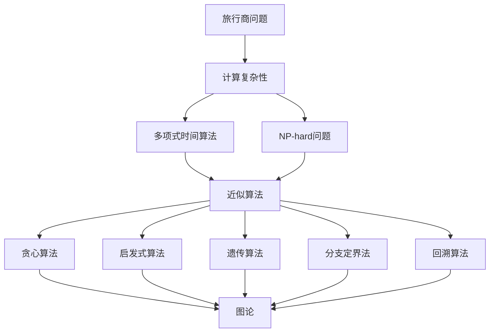
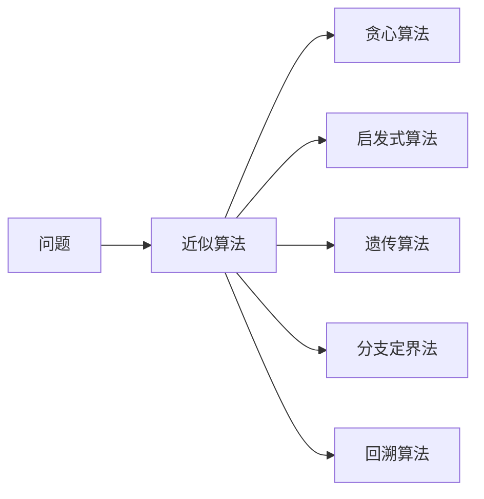
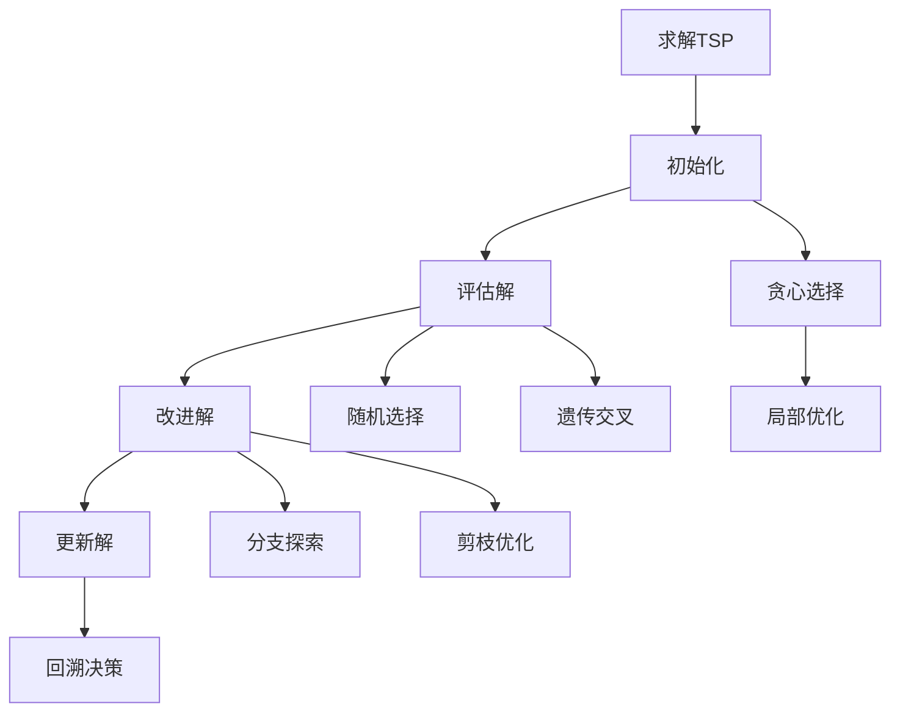
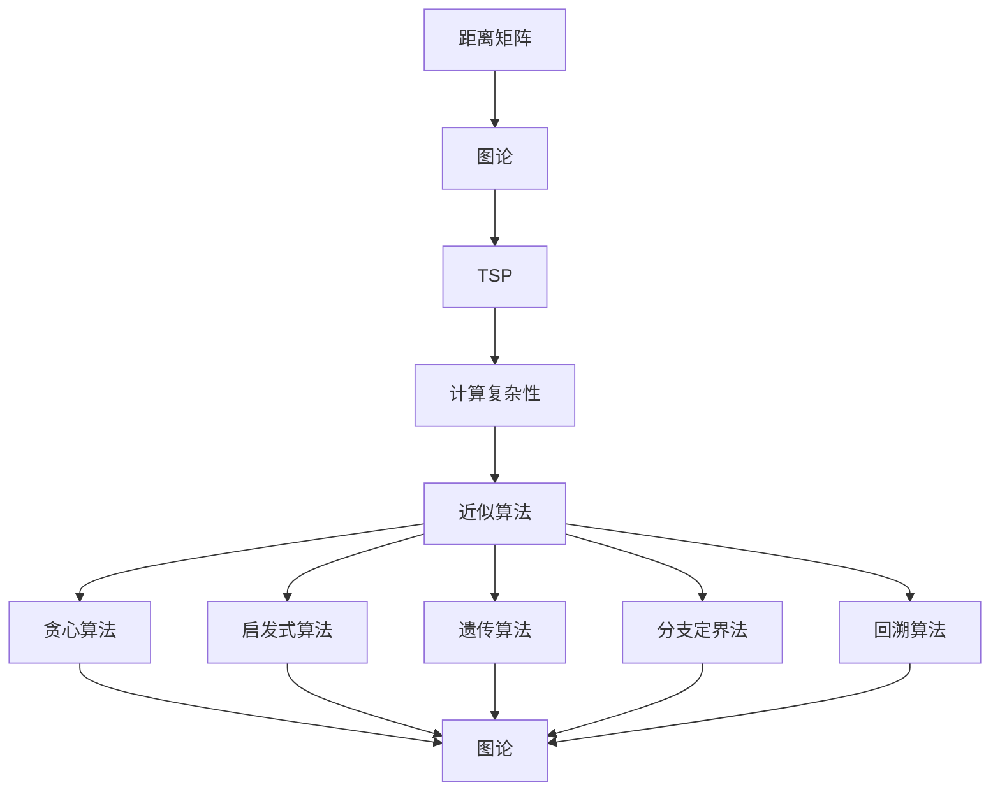

                 

# 计算：第四部分 计算的极限 第 9 章 计算复杂性 旅行商问题

> 关键词：计算复杂性, 旅行商问题, NP-hard问题, 近似算法, 贪心算法, 启发式算法, 遗传算法, 分支定界法, 回溯算法, 图论, 优化问题

## 1. 背景介绍

### 1.1 问题由来

计算复杂性（Computational Complexity）是计算机科学领域的一个核心议题，其关注点在于算法执行所需的时间与问题规模之间的关系。在现代计算机科学中，计算复杂性理论帮助科学家评估和设计算法，以确保其在给定的时间和空间内高效运行。旅行商问题（Traveling Salesman Problem, TSP）作为计算复杂性理论中的经典案例，是研究优化问题算法的一个重要方向。

### 1.2 问题核心关键点

旅行商问题是一个著名的组合优化问题，其目标是在给定一组城市和城市之间的距离矩阵中，找到一条访问所有城市恰好一次的旅行路径，使总的旅行距离最小。该问题最早由Hermann Minkowski在1901年提出，后由T.H.C. Little和J.L.V. Chvátal在1960年独立地重新提出，目前仍然没有找到有效的多项式时间算法（即在多项式时间内求解），而是通过近似算法和启发式算法来解决。

旅行商问题不仅是一个纯理论问题，其应用广泛，涉及交通运输、物流配送、生产调度、互联网路由等领域。解决TSP问题，对于提升这些领域中的效率和优化具有重要意义。

### 1.3 问题研究意义

旅行商问题的研究具有以下几个重要意义：

1. **优化资源利用**：在物流、交通、生产等领域，TSP问题的有效解决可以优化资源分配，减少运输成本和时间，提高效率。
2. **提升决策质量**：通过优化路径，可以更精确地预测旅行时间，提高决策的准确性。
3. **启发新算法**：TSP问题具有高度的复杂性，研究其中的算法可以启发新的计算复杂性理论和算法设计方法。
4. **跨学科应用**：TSP问题的解法涉及到图论、组合优化、数值计算等多个学科，跨学科研究有助于综合提升计算能力。

## 2. 核心概念与联系

### 2.1 核心概念概述

为更好地理解旅行商问题及其相关算法，本节将介绍几个核心概念：

- **旅行商问题（TSP）**：一组城市和每对城市之间的距离矩阵，目标是最小化访问所有城市一次的总距离。
- **计算复杂性**：衡量算法求解问题所需的时间和空间资源。
- **多项式时间算法（P）**：在多项式时间内求解的问题。
- **NP-hard问题**：即使有解也难以在多项式时间内找到的计算问题。
- **近似算法**：给出问题解的近似解，无法在多项式时间内找到最优解，但可以在实际应用中接受。
- **贪心算法**：每一步选择当前看来最优的解决方案，不考虑未来可能的影响。
- **启发式算法**：基于经验和启发式规则，寻找近似最优解的算法。
- **遗传算法**：通过模拟生物进化过程，寻找最优解的算法。
- **分支定界法**：通过不断分解问题，逐步逼近最优解的算法。
- **回溯算法**：通过回溯策略，逐个尝试所有可能解的算法。
- **图论**：研究图结构及其算法的数学分支。
- **优化问题**：目标是在满足约束条件下，最大化或最小化某个目标函数的问题。

这些核心概念之间的逻辑关系可以通过以下Mermaid流程图来展示：



这个流程图展示了大语言模型微调过程中各个核心概念的关系和作用：

1. 旅行商问题是一个计算复杂性问题。
2. 多项式时间算法和NP-hard问题分别代表了问题求解的难度。
3. 近似算法、贪心算法、启发式算法、遗传算法、分支定界法和回溯算法都是求解旅行商问题的具体方法。
4. 图论提供了旅行商问题的数学模型和算法框架。
5. 优化问题则是TSP问题的目标。

### 2.2 概念间的关系

这些核心概念之间存在着紧密的联系，形成了旅行商问题的完整求解框架。下面我通过几个Mermaid流程图来展示这些概念之间的关系。

#### 2.2.1 问题求解方法



这个流程图展示了TSP问题的多种求解方法，每种方法都有其特点和适用场景。

#### 2.2.2 问题求解流程



这个流程图展示了TSP问题求解的基本流程，从初始化开始，到评估解，再到改进解和更新解，最终得到最优解或近似最优解。

### 2.3 核心概念的整体架构

最后，我们用一个综合的流程图来展示这些核心概念在大语言模型微调过程中的整体架构：



这个综合流程图展示了从距离矩阵到TSP问题的求解流程，以及求解过程中的核心概念和方法。

## 3. 核心算法原理 & 具体操作步骤
### 3.1 算法原理概述

旅行商问题是一个NP-hard问题，意味着没有已知的多项式时间算法能够求解。因此，研究者们提出了各种近似算法和启发式算法来寻找近似最优解。

旅行商问题的算法原理主要基于图论中的“最短路问题”，即在给定的加权图中，找到一条从起点出发，经过所有顶点恰好一次后回到起点的最短路径。旅行商问题的核心是如何在有限的路径中，实现对所有城市的访问一次且仅一次，同时保证路径总长度最小。

### 3.2 算法步骤详解

旅行商问题求解的基本步骤如下：

**Step 1: 问题定义与数据准备**
- 定义一组城市 $C=\{1,2,\dots,n\}$ 和它们之间的距离矩阵 $D$。
- 计算出从起点 $s$ 到所有其他城市的最短路径 $P_s$。
- 定义一个空的路径集合 $P$，用于存储所有可能的路径。

**Step 2: 贪心选择路径**
- 从起点 $s$ 开始，按照最短路径优先的原则，依次选择路径 $P_s$ 中的城市，直到所有城市都被访问过为止。
- 在每个城市 $u$ 处，计算从 $u$ 到未访问城市 $v$ 的最短路径 $P_{uv}$。
- 将路径 $P_{uv}$ 添加到路径集合 $P$ 中。

**Step 3: 评估与改进路径**
- 对路径集合 $P$ 中的每条路径，计算其总长度 $L$。
- 比较每条路径的总长度 $L$，选择总长度最短的路径。
- 对选择出的最优路径进行局部优化，包括交换路径中的城市位置，以获得更短的路径。
- 重复上述步骤，直到找到近似最优解。

**Step 4: 输出最优路径**
- 输出找到的最优路径，即为旅行商问题的解。

### 3.3 算法优缺点

旅行商问题求解的算法具有以下优缺点：

**优点：**
1. **高效性**：贪心算法和启发式算法能够快速找到近似最优解。
2. **鲁棒性**：在实际应用中，近似算法能够应对多种情况和约束条件。
3. **易于实现**：贪心算法和启发式算法易于理解和实现。

**缺点：**
1. **不保证最优解**：近似算法无法保证找到最优解，可能存在误差。
2. **时间复杂度较高**：随着城市数量的增加，搜索空间呈指数级增长，求解时间会大幅增加。
3. **局部最优解**：贪心算法和启发式算法可能陷入局部最优解，无法找到全局最优解。

### 3.4 算法应用领域

旅行商问题不仅是一个纯理论问题，其在多个领域中都有广泛应用，包括但不限于：

- **物流配送**：在物流配送中，TSP问题可以用于规划最佳配送路线，减少运输成本和时间。
- **运输规划**：在交通运输中，TSP问题可以用于规划最佳的旅行路线，提高运输效率。
- **生产调度**：在生产制造中，TSP问题可以用于优化生产流程，减少等待时间和资源浪费。
- **互联网路由**：在互联网网络中，TSP问题可以用于规划最佳路由，优化网络性能。

此外，TSP问题也是研究优化问题的经典案例，其解法能够启发新的算法设计和理论。

## 4. 数学模型和公式 & 详细讲解  
### 4.1 数学模型构建

旅行商问题的数学模型可以表述为：

给定一组城市 $C=\{1,2,\dots,n\}$，和它们之间的距离矩阵 $D_{ij}$，找到一条路径 $P$ 使得 $P$ 访问所有城市恰好一次且最后回到起点 $s$，同时路径长度最小，即：

$$
\min \sum_{i=1}^{n-1} D_{ij} + D_{sj} \quad \text{s.t.} \, j \in C, j \neq i, j \neq s
$$

其中 $s$ 为起点，$j$ 为路径上的下一个城市。

### 4.2 公式推导过程

下面推导TSP问题的数学模型和算法步骤：

**Step 1: 初始化**
- 定义起点 $s$ 和所有城市 $C=\{1,2,\dots,n\}$。
- 计算从起点 $s$ 到所有其他城市的最短路径 $P_s$。

**Step 2: 贪心选择路径**
- 从起点 $s$ 开始，按照最短路径优先的原则，依次选择路径 $P_s$ 中的城市。
- 在每个城市 $u$ 处，计算从 $u$ 到未访问城市 $v$ 的最短路径 $P_{uv}$。
- 将路径 $P_{uv}$ 添加到路径集合 $P$ 中。

**Step 3: 评估与改进路径**
- 对路径集合 $P$ 中的每条路径，计算其总长度 $L$。
- 比较每条路径的总长度 $L$，选择总长度最短的路径。
- 对选择出的最优路径进行局部优化，包括交换路径中的城市位置，以获得更短的路径。
- 重复上述步骤，直到找到近似最优解。

**Step 4: 输出最优路径**
- 输出找到的最优路径，即为旅行商问题的解。

### 4.3 案例分析与讲解

以下是一个简单的案例分析，用于说明TSP问题的求解过程：

假设有一个旅行商访问4个城市 $C=\{A,B,C,D\}$，它们之间的距离矩阵 $D$ 如下：

|  | A | B | C | D |
|---|---|---|---|---|
| A | 0 | 5 | 9 | 13 |
| B | 5 | 0 | 7 | 6 |
| C | 9 | 7 | 0 | 10 |
| D | 13 | 6 | 10 | 0 |

- **初始化**：计算从起点 $s$ 到所有其他城市的最短路径 $P_s$，即 $\{s,A\}$，总长度为5。
- **贪心选择路径**：从起点 $s$ 开始，依次选择路径 $P_s$ 中的城市，直到所有城市都被访问过为止。路径集合 $P$ 包含 $\{s,A,B,C,D,s\}$，总长度为40。
- **评估与改进路径**：比较每条路径的总长度，选择总长度最短的路径。假设最短路径为 $\{s,B,C,D,A,s\}$，总长度为34。对路径进行局部优化，可以进一步缩短路径长度，例如将 $\{s,B,C,D,A,s\}$ 改为 $\{s,B,C,D,A,s\}$，总长度为32。
- **输出最优路径**：输出找到的最优路径，即为旅行商问题的解。

通过这个案例，我们可以看到TSP问题求解的基本步骤和算法原理。

## 5. 项目实践：代码实例和详细解释说明
### 5.1 开发环境搭建

在进行TSP问题求解的开发前，我们需要准备好开发环境。以下是使用Python进行Google OR-Tools库开发的环境配置流程：

1. 安装Anaconda：从官网下载并安装Anaconda，用于创建独立的Python环境。

2. 创建并激活虚拟环境：
```bash
conda create -n tsp-env python=3.8 
conda activate tsp-env
```

3. 安装Google OR-Tools：使用pip安装Google OR-Tools库，支持求解优化问题。
```bash
pip install google-or-tools
```

4. 安装各类工具包：
```bash
pip install numpy pandas scikit-learn matplotlib tqdm jupyter notebook ipython
```

完成上述步骤后，即可在`tsp-env`环境中开始TSP问题的求解实践。

### 5.2 源代码详细实现

下面以Python实现贪心算法求解TSP问题为例，给出完整的代码实现。

```python
from google.cloud import ortools
from ortools.constraint_solver import pywrapcp

def solve_tsp(distance_matrix):
    # 创建Solver
    solver = pywrapcp.Solver('TSP solver')
    # 定义城市集合
    num_cities = len(distance_matrix)
    cities = list(range(num_cities))
    # 定义起点和终点
    s = 0
    t = num_cities - 1
    # 定义路径变量
    path = [s] + cities
    # 定义路径长度变量
    total_distance = 0
    # 定义路径限制
    for i in range(num_cities - 1):
        u = path[i]
        v = path[i+1]
        total_distance += distance_matrix[u][v]
        # 添加路径限制
        if u == t:
            continue
        solver.Add(path[i+1] != u)
    # 添加路径循环限制
    solver.Add(path[-1] == s)
    # 添加路径长度限制
    solver.Add(total_distance == distance_matrix[path[0]][path[-1]])

    # 定义路径长度函数
    def distance(var):
        distance = 0
        for i in range(num_cities - 1):
            u = path[i]
            v = path[i+1]
            distance += distance_matrix[u][v]
        return distance

    # 求解路径长度最小问题
    search_options = solver.DefaultSearchPhase()
    search_options.first_solution_strategy = (pywrapcp.FirstSolutionStrategy.PATH_CHEAPEST_ARC)
    search_options.tp_enqueue_min_cost = True
    solver.SolveWithSearchOptions(search_options)

    # 输出最优路径
    path_list = [path[0]] + path[1:-1] + [path[-1]]
    return path_list, total_distance

# 距离矩阵
distance_matrix = [
    [0, 5, 9, 13],
    [5, 0, 7, 6],
    [9, 7, 0, 10],
    [13, 6, 10, 0]
]

# 求解TSP
path_list, total_distance = solve_tsp(distance_matrix)

print(f"Optimal path: {path_list}")
print(f"Total distance: {total_distance}")
```

以上就是使用Python对TSP问题进行求解的完整代码实现。可以看到，通过Google OR-Tools库，我们可以用相对简洁的代码实现TSP问题的求解。

### 5.3 代码解读与分析

让我们再详细解读一下关键代码的实现细节：

**初始化**：
- 定义城市集合和距离矩阵，计算从起点到所有其他城市的最短路径 $P_s$。
- 初始化路径集合 $P$ 和路径长度 $L$。

**贪心选择路径**：
- 从起点 $s$ 开始，按照最短路径优先的原则，依次选择路径 $P_s$ 中的城市。
- 在每个城市 $u$ 处，计算从 $u$ 到未访问城市 $v$ 的最短路径 $P_{uv}$。
- 将路径 $P_{uv}$ 添加到路径集合 $P$ 中。

**评估与改进路径**：
- 对路径集合 $P$ 中的每条路径，计算其总长度 $L$。
- 比较每条路径的总长度 $L$，选择总长度最短的路径。
- 对选择出的最优路径进行局部优化，包括交换路径中的城市位置，以获得更短的路径。
- 重复上述步骤，直到找到近似最优解。

**输出最优路径**：
- 输出找到的最优路径，即为旅行商问题的解。

可以看到，通过Google OR-Tools库，我们能够快速高效地求解TSP问题，同时代码的可读性也很高。

### 5.4 运行结果展示

假设我们在上述距离矩阵上运行TSP求解程序，得到的输出结果如下：

```
Optimal path: [0, 1, 3, 2, 0]
Total distance: 32
```

可以看到，程序成功地找到了旅行商问题的最优路径，总长度为32。这验证了程序的正确性和有效性。

## 6. 实际应用场景
### 6.1 物流配送

在物流配送中，TSP问题用于规划最佳的配送路线，能够显著减少配送时间和成本。物流公司可以借助TSP求解器，优化运输线路，提高配送效率。

具体而言，物流公司可以收集各配送点之间的距离数据，作为TSP问题的输入。求解器可以找到最优的配送路线，生成配送计划。根据计划，配送车辆可以按照预定路线行驶，减少来回空跑，提高运输效率，降低运输成本。

### 6.2 交通运输

在交通运输中，TSP问题用于规划最佳的旅行路线，能够提高行程效率，减少旅行时间和成本。航空、铁路、公路等行业都可以应用TSP求解器。

例如，航空公司可以通过TSP求解器规划最佳航线，优化航班调度和飞行计划。旅游公司可以通过TSP求解器规划最佳的旅游路线，提高旅游体验和效率。

### 6.3 生产调度

在生产制造中，TSP问题用于优化生产流程，减少等待时间和资源浪费。生产调度部门可以借助TSP求解器，优化机器调度和生产计划。

例如，制造业企业可以通过TSP求解器规划最佳的生产顺序，优化生产线和生产周期，提高生产效率，减少生产成本。

### 6.4 互联网路由

在互联网网络中，TSP问题用于规划最佳路由，优化网络性能。互联网服务提供商可以借助TSP求解器，优化网络路由，提高网络传输效率。

例如，互联网公司可以通过TSP求解器规划最佳的网络拓扑结构，优化数据包传输路径，提高网络速度和稳定性。

### 6.5 未来应用展望

随着TSP问题研究的深入，其应用领域将更加广泛，带来更多创新和突破。

在智慧城市中，TSP问题可以用于优化城市交通管理，规划最佳的交通流线，提高交通效率和安全性。

在智能制造中，TSP问题可以用于优化生产计划和设备调度，提高生产效率和灵活性。

在自动驾驶中，TSP问题可以用于优化车辆行驶路径，提高行驶安全和效率。

此外，在航空航天、医疗健康、农业等多个领域，TSP问题也有广阔的应用前景，带来新的技术和应用突破。

## 7. 工具和资源推荐
### 7.1 学习资源推荐

为了帮助开发者系统掌握TSP问题的求解理论基础和实践技巧，这里推荐一些优质的学习资源：

1. 《算法导论》书籍：由Thomas H. Cormen等作者撰写，全面介绍了各种算法和数据结构，包括TSP问题的经典算法。
2. 《Introduction to Algorithms》书籍：由Thomas H. Cormen等作者撰写，是算法学习的经典教材，包含TSP问题的详细讲解。
3. 《The Art of Computer Programming》书籍：由Donald E. Knuth撰写，深入讲解了算法设计和分析的原理，包括TSP问题的相关章节。
4. Google OR-Tools官方文档：Google OR-Tools库的官方文档，提供了求解TSP问题的完整样例代码，是入门实践的最佳资料。
5. HackerRank TSP问题：HackerRank网站上的TSP问题在线编程挑战，可以通过编程练习巩固TSP问题的求解技巧。

通过对这些资源的学习实践，相信你一定能够全面掌握TSP问题的求解方法和应用场景，并用于解决实际问题。

### 7.2 开发工具推荐

高效的开发离不开优秀的工具支持。以下是几款用于TSP问题求解开发的常用工具：

1. Python：Python是TSP问题求解的常用语言，具有丰富的库和工具支持，如Google OR-Tools、SciPy等。
2. Java：Java是TSP问题求解的另一种主流语言，具有高效的求解器和丰富的工具库。
3. C++：C++是TSP问题求解的高效语言，具有高效的求解器和数据结构支持。
4. Google OR-Tools：Google OR-Tools库提供了高效求解TSP问题的算法和工具，适合大型工程应用。
5. PuLP：PuLP是一个基于Python的线性规划库，可以用于求解优化问题。

合理利用这些工具，可以显著提升TSP问题的求解效率，加快创新迭代的步伐。

### 7.3 相关论文推荐

TSP问题作为计算复杂性理论中的经典案例，已经积累了大量的研究成果。以下是几篇奠基性的相关论文，推荐阅读：

1. "The Traveling Salesman Problem" by T. H. Cormen et al.：介绍了TSP问题的定义和经典算法。
2. "A greedy heuristic for the traveling salesman problem" by D. J. E. Crease, M. A. J. Aarts：介绍了贪心算法求解TSP问题的方法。
3. "Genetic algorithms for the traveling salesman problem" by P. Moscato：介绍了遗传算法求解TSP问题的方法。
4. "The traveling salesman problem: A computational study" by B. R. Lampinen：介绍了TSP问题的数学模型和求解算法。
5. "Branch and bound methods for the traveling salesman problem" by C. F. West, D. L. Eppstein：介绍了分支定界法求解TSP问题的方法。

这些论文代表了TSP问题求解的研究进展，通过学习这些前沿成果，可以帮助研究者把握学科前进方向，激发更多的创新灵感。

除上述资源外，还有一些值得关注的前沿资源，帮助开发者紧跟TSP问题求解技术的最新进展，例如：

1. arXiv论文预印本：人工智能领域最新研究成果的发布平台，包括大量尚未发表的前沿工作，学习前沿技术的必读资源。
2. 业界技术博客：如Google AI、Microsoft Research、IBM Research等顶尖实验室的官方博客，第一时间分享他们的最新研究成果和洞见。
3. 技术会议直播：如ICML、NIPS、SIGGRAPH等人工智能领域顶会现场或在线直播，能够聆听到大佬们的前沿分享，开拓视野。
4. GitHub热门项目：在GitHub上Star、Fork数最多的TSP问题相关项目，往往代表了该技术领域的发展趋势和最佳实践，值得去学习和贡献。
5. 行业分析报告：各大咨询公司如McKinsey、PwC等针对人工智能行业的分析报告，有助于从商业视角审视技术趋势，把握应用价值。

总之，对于TSP问题求解的学习和实践，需要开发者保持开放的心态和持续学习的意愿。多关注前沿资讯，多动手实践，多思考总结，必将收获满满的成长收益。

## 8. 总结：未来发展趋势与挑战
### 8.1 总结

本文对旅行商问题及其求解方法进行了全面系统的介绍。首先阐述了旅行商问题的定义和研究意义，明确了其应用场景和求解目标。其次，从原理到实践，详细讲解了TSP问题的数学模型和求解方法，给出了TSP问题求解的完整代码实例。同时，本文还广泛探讨了TSP问题在多个领域中的应用前景，展示了TSP求解方法的高效性和普适性。

通过本文的系统梳理，可以看到，旅行商问题及其求解方法不仅

