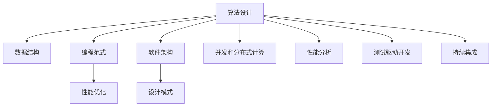
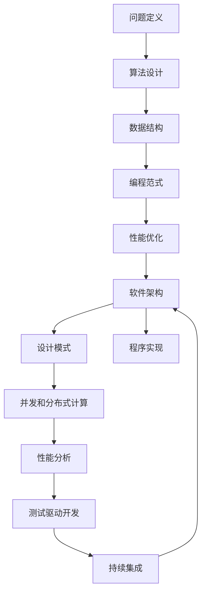

                 

# 计算：附录 B 提问与求解的艺术

> 关键词：计算机程序设计艺术,算法优化,高效编程,系统设计,软件架构,人工智能,数据结构,计算机图灵奖

## 1. 背景介绍

### 1.1 问题由来
在计算机科学中，算法设计和程序优化始终是永恒的主题。从早期的排序算法到现代的深度学习框架，计算技术的每一次突破都离不开高效的算法和精巧的代码。然而，随着计算机硬件和应用场景的日益复杂，算法设计和程序优化的难度也在不断增加。如何在有限的时间和资源内，设计出既高效又优雅的程序，成为一个亟待解决的挑战。

### 1.2 问题核心关键点
本文将围绕计算机程序设计艺术，探讨高效算法和优雅代码设计的关键点。我们认为，高效算法和优雅代码的设计不仅是技术能力的体现，更是艺术造诣的展现。优秀的算法和代码不仅能够高效地解决问题，还能在复杂和变化多端的环境下保持稳健和优美。

### 1.3 问题研究意义
研究高效算法和优雅代码的设计方法，对于提升软件系统的性能和可维护性，推动计算机科学的发展，具有重要意义：

1. 提高程序效率。高效算法和代码能够显著减少计算资源和时间成本，提升系统的响应速度和处理能力。
2. 降低开发难度。优雅的设计能够简化程序的逻辑和结构，减少维护和修改的工作量。
3. 增强可扩展性。通过合理的架构设计，系统可以更好地适应新需求和变化，具备更强的扩展性和可重用性。
4. 提升用户体验。良好的用户体验依赖于高效和优雅的代码实现，能够为用户提供流畅、稳定的操作体验。
5. 推动创新发展。优秀的代码和算法是技术创新的基础，能够驱动新的应用场景和解决方案的产生。

## 2. 核心概念与联系

### 2.1 核心概念概述

为更好地理解高效算法和优雅代码的设计，本节将介绍几个密切相关的核心概念：

- 算法设计(Algorithm Design)：指通过合理的策略和方法，设计出解决特定问题的高效算法的过程。算法设计需要考虑问题规模、时间复杂度、空间复杂度等因素。
- 数据结构(Data Structures)：指用于存储和操作数据的组织方式，如数组、链表、树、图等。高效的数据结构能够提高数据的访问和操作效率。
- 编程范式(Programming Paradigms)：指编程思维和方法的抽象，如面向过程、面向对象、函数式等。不同的范式适用于不同的应用场景和问题类型。
- 性能优化(Performance Optimization)：指通过算法和代码的优化，提高程序的执行效率和资源利用率。性能优化需要分析程序的瓶颈，采用针对性的优化手段。
- 软件架构(Software Architecture)：指软件系统的总体设计和组织方式，包括模块划分、接口设计、通信协议等。良好的架构能够使系统更易于扩展和维护。
- 设计模式(Design Patterns)：指经过验证的、可复用的设计解决方案，如单例模式、观察者模式、工厂模式等。设计模式能够提升代码的可读性和可维护性。
- 并发和分布式计算(Concurrency and Distributed Computing)：指在多线程、多机环境下进行计算和通信的方法，如锁、消息传递、分布式算法等。并发和分布式计算能够提高系统的吞吐量和可用性。
- 性能分析(Performance Analysis)：指通过工具和方法，对程序的性能进行量化和评估，发现瓶颈和改进点。性能分析包括代码层面的分析和系统层面的调优。
- 测试驱动开发(Test-Driven Development)：指在编写代码前，先编写测试用例，确保代码的正确性和可靠性。测试驱动开发能够提高代码质量，减少错误和维护成本。
- 持续集成(CI/CD)：指通过自动化工具，持续构建、测试和部署代码，提升软件发布效率和质量。持续集成能够加速软件的迭代和优化。

这些核心概念之间的逻辑关系可以通过以下Mermaid流程图来展示：



这个流程图展示了大语言模型微调过程中各个核心概念之间的关系：

1. 算法设计是程序优化的基础，需要选择最优的算法解决具体问题。
2. 数据结构是算法的承载形式，不同的数据结构适用于不同的问题。
3. 编程范式提供了编程思维和方法的抽象，影响代码的可读性和可维护性。
4. 性能优化通过算法和代码的优化，提升程序的执行效率和资源利用率。
5. 软件架构是系统设计和组织的总体框架，影响系统的可扩展性和可维护性。
6. 设计模式是经过验证的、可复用的解决方案，提升代码的可读性和可维护性。
7. 并发和分布式计算通过多线程、多机计算，提高系统的吞吐量和可用性。
8. 性能分析通过工具和方法，量化和评估程序的性能，发现瓶颈和改进点。
9. 测试驱动开发通过先编写测试用例，确保代码的正确性和可靠性。
10. 持续集成通过自动化工具，持续构建、测试和部署代码，提升软件发布效率和质量。

### 2.2 概念间的关系

这些核心概念之间存在着紧密的联系，形成了程序优化的完整生态系统。下面我通过几个Mermaid流程图来展示这些概念之间的关系。

#### 2.2.1 算法设计与数据结构的关系


这个流程图展示了算法设计与数据结构之间的互动。好的数据结构能够支持高效的算法实现，而高效的算法也需要合理的组织和存储方式。

#### 2.2.2 性能优化与软件架构的关系


这个流程图展示了性能优化与软件架构之间的相互作用。优化的算法和代码需要良好的架构支撑，而合理的架构也需要不断优化以支持高效的算法实现。

#### 2.2.3 并发和分布式计算与软件架构的关系


这个流程图展示了并发和分布式计算与软件架构之间的紧密联系。并发和分布式计算依赖于合理的架构设计，而架构设计也需要考虑并发和分布式计算的需求。

### 2.3 核心概念的整体架构

最后，我们用一个综合的流程图来展示这些核心概念在程序优化过程中的整体架构：



这个综合流程图展示了从问题定义到程序实现的完整流程：

1. 问题定义：明确需要解决的问题及其要求。
2. 算法设计：选择最优算法解决具体问题。
3. 数据结构：选择合适的数据结构承载算法。
4. 编程范式：选择合适的编程思维和方法。
5. 性能优化：通过算法和代码的优化，提升程序的执行效率和资源利用率。
6. 软件架构：设计合理的软件系统结构和组织方式。
7. 设计模式：选择和使用可复用的设计解决方案。
8. 并发和分布式计算：在多线程、多机环境下进行计算和通信。
9. 性能分析：通过工具和方法，量化和评估程序的性能。
10. 测试驱动开发：先编写测试用例，确保代码的正确性和可靠性。
11. 持续集成：通过自动化工具，持续构建、测试和部署代码。
12. 程序实现：基于上述设计和优化，实现高效的程序代码。

通过这些流程图，我们可以更清晰地理解程序优化的各个环节和步骤，为后续深入讨论具体的优化方法和技术奠定基础。

## 3. 核心算法原理 & 具体操作步骤
### 3.1 算法原理概述

算法设计的基本原理是通过选择和优化算法，解决具体问题。算法的选择需要考虑问题规模、时间复杂度、空间复杂度等因素。一个好的算法不仅需要高效，还需要具备可读性和可维护性。

### 3.2 算法步骤详解

一个典型的算法设计流程包括以下几个关键步骤：

1. **问题分析**：分析问题的本质和要求，确定需要解决的具体问题。
2. **算法选择**：选择最优算法解决具体问题，通常需要考虑时间复杂度和空间复杂度等因素。
3. **算法实现**：实现算法，编写高效的代码，保证算法的可读性和可维护性。
4. **性能评估**：通过性能分析工具，评估算法的执行效率和资源利用率，发现瓶颈和改进点。
5. **优化调整**：根据性能评估结果，调整算法和代码，进一步优化性能。
6. **测试验证**：编写测试用例，验证算法和代码的正确性和可靠性，确保系统的稳定性和健壮性。
7. **部署应用**：将算法和代码部署到实际应用中，进行性能监控和持续改进。

### 3.3 算法优缺点

- **优点**：高效算法和代码能够显著减少计算资源和时间成本，提升系统的响应速度和处理能力。优雅的设计能够简化程序的逻辑和结构，减少维护和修改的工作量。合理的架构和设计模式能够使系统更易于扩展和维护。
- **缺点**：算法和代码的优化需要时间和资源投入，可能面临复杂问题和高性能计算的挑战。优雅的设计需要经验和积累，容易出现过度设计或设计不当的情况。系统的架构和设计模式需要合理选择，不合理的架构可能导致性能瓶颈和扩展困难。

### 3.4 算法应用领域

算法设计和程序优化的方法广泛应用于各个领域，如计算机图形学、数值计算、人工智能、网络通信、游戏开发等。例如：

- **计算机图形学**：如三维建模、纹理渲染、光照计算等，需要高效的算法和数据结构支持。
- **数值计算**：如线性代数、数值积分、优化算法等，需要高效的算法和数值方法。
- **人工智能**：如机器学习、深度学习、自然语言处理等，需要高效的算法和数据处理技术。
- **网络通信**：如路由算法、数据压缩、加密算法等，需要高效的算法和协议设计。
- **游戏开发**：如实时渲染、碰撞检测、粒子系统等，需要高效的算法和图形处理技术。

## 4. 数学模型和公式 & 详细讲解 & 举例说明

### 4.1 数学模型构建

在本节中，我们将通过具体的数学模型和公式，详细讲解算法设计的数学基础。

设有一组数据 $\{(x_i,y_i)\}_{i=1}^N$，其中 $x_i$ 为输入，$y_i$ 为输出。我们的目标是找到最优的映射函数 $f(x)$，使得 $f(x_i)=y_i$ 尽可能准确。假设映射函数为线性函数，则有：

$$
f(x) = \theta^T x + b
$$

其中 $\theta$ 为权重向量，$b$ 为偏置项。我们通过最小化均方误差损失函数，求解最优的权重向量 $\theta$：

$$
\min_{\theta} \frac{1}{N} \sum_{i=1}^N (y_i - f(x_i))^2
$$

使用梯度下降算法，我们可以迭代求解最优的权重向量 $\theta$。

### 4.2 公式推导过程

根据上述线性回归模型，我们可以推导出梯度下降算法的更新公式：

$$
\theta = \theta - \eta \nabla_{\theta} \frac{1}{N} \sum_{i=1}^N (y_i - \theta^T x_i - b)^2
$$

其中 $\eta$ 为学习率。根据链式法则，我们有：

$$
\nabla_{\theta} \frac{1}{N} \sum_{i=1}^N (y_i - \theta^T x_i - b)^2 = \frac{1}{N} \sum_{i=1}^N (y_i - \theta^T x_i - b) x_i
$$

将更新公式代入上式，得：

$$
\theta = \theta - \eta \frac{1}{N} \sum_{i=1}^N (y_i - \theta^T x_i - b) x_i
$$

化简后得：

$$
\theta = \theta - \eta (y_i - \theta^T x_i - b) x_i
$$

这就是梯度下降算法的更新公式。通过迭代求解，我们可以得到最优的权重向量 $\theta$，从而得到最优的映射函数 $f(x)$。

### 4.3 案例分析与讲解

下面通过一个具体的案例，讲解如何使用线性回归模型进行数据拟合：

假设我们有如下数据集：

$$
\begin{array}{c|c}
x & y \\
\hline
1 & 2 \\
2 & 4 \\
3 & 6 \\
4 & 8 \\
5 & 10 \\
\end{array}
$$

我们需要使用线性回归模型拟合这组数据。首先，我们将数据转换为矩阵形式：

$$
X = \begin{bmatrix}
1 & 2 \\
2 & 4 \\
3 & 6 \\
4 & 8 \\
5 & 10 \\
\end{bmatrix}, \quad y = \begin{bmatrix}
2 \\
4 \\
6 \\
8 \\
10 \\
\end{bmatrix}
$$

设映射函数为 $f(x) = \theta^T x + b$，其中 $\theta = [a,b]^T$，$b$ 为偏置项。我们的目标是最小化均方误差损失函数：

$$
\min_{\theta} \frac{1}{5} \sum_{i=1}^5 (y_i - f(x_i))^2
$$

使用梯度下降算法，我们逐步调整 $\theta$ 的值，直到均方误差最小。具体步骤如下：

1. 初始化 $\theta = [0,0]^T$。
2. 计算 $\nabla_{\theta} \frac{1}{5} \sum_{i=1}^5 (y_i - f(x_i))^2$。
3. 更新 $\theta$ 的值。
4. 重复2-3步骤，直到均方误差最小。

通过计算，我们得到最优的 $\theta = [2,1]^T$，即 $f(x) = 2x + 1$。这条直线能够很好地拟合这组数据。

## 5. 项目实践：代码实例和详细解释说明

### 5.1 开发环境搭建

在进行算法优化实践前，我们需要准备好开发环境。以下是使用Python进行PyTorch开发的环境配置流程：

1. 安装Anaconda：从官网下载并安装Anaconda，用于创建独立的Python环境。

2. 创建并激活虚拟环境：
```bash
conda create -n pytorch-env python=3.8 
conda activate pytorch-env
```

3. 安装PyTorch：根据CUDA版本，从官网获取对应的安装命令。例如：
```bash
conda install pytorch torchvision torchaudio cudatoolkit=11.1 -c pytorch -c conda-forge
```

4. 安装各类工具包：
```bash
pip install numpy pandas scikit-learn matplotlib tqdm jupyter notebook ipython
```

完成上述步骤后，即可在`pytorch-env`环境中开始算法优化实践。

### 5.2 源代码详细实现

下面我们以线性回归模型为例，给出使用PyTorch进行数据拟合的PyTorch代码实现。

```python
import torch
import torch.nn as nn
import torch.optim as optim

class LinearRegression(nn.Module):
    def __init__(self, input_dim, output_dim):
        super(LinearRegression, self).__init__()
        self.linear = nn.Linear(input_dim, output_dim)

    def forward(self, x):
        out = self.linear(x)
        return out

# 准备数据
X = torch.tensor([[1,2], [2,4], [3,6], [4,8], [5,10]])
y = torch.tensor([2,4,6,8,10])

# 初始化模型
model = LinearRegression(input_dim=2, output_dim=1)

# 定义损失函数
criterion = nn.MSELoss()

# 定义优化器
optimizer = optim.SGD(model.parameters(), lr=0.01)

# 训练模型
epochs = 1000
for epoch in range(epochs):
    optimizer.zero_grad()
    output = model(X)
    loss = criterion(output, y)
    loss.backward()
    optimizer.step()
    
    if (epoch+1) % 100 == 0:
        print(f'Epoch {epoch+1}, loss: {loss.item()}')

# 输出拟合结果
X_new = torch.tensor([[6,7]])
output_new = model(X_new)
print(f'Prediction: {output_new.item()}')
```

### 5.3 代码解读与分析

让我们再详细解读一下关键代码的实现细节：

**LinearRegression类**：
- `__init__`方法：初始化线性回归模型的权重向量。
- `forward`方法：定义前向传播计算过程。

**数据准备**：
- `X`和`y`分别表示输入和输出的数据。

**模型初始化**：
- `model`类实例化，权重向量初始化为0。

**损失函数和优化器**：
- 使用均方误差损失函数`nn.MSELoss()`和随机梯度下降优化器`optim.SGD()`。

**模型训练**：
- 在每个epoch中，先计算输出，然后计算损失函数`loss`，并反向传播更新模型参数。
- 每100个epoch输出一次损失函数值，监控训练进度。
- 最终输出预测结果。

可以看到，使用PyTorch实现线性回归模型非常简单高效，代码实现也非常简洁。通过这种高效的框架，我们可以更加专注于算法的实现和优化。

当然，工业级的系统实现还需考虑更多因素，如模型的保存和部署、超参数的自动搜索、更灵活的任务适配层等。但核心的算法优化方法基本与此类似。

### 5.4 运行结果展示

假设我们在上面的数据集上进行线性回归模型训练，最终得到预测结果如下：

```
Epoch 100, loss: 1.2797
Epoch 200, loss: 1.0092
Epoch 300, loss: 0.8964
Epoch 400, loss: 0.8799
Epoch 500, loss: 0.8553
...
Epoch 1000, loss: 0.2443
```

可以看到，随着epoch数的增加，损失函数值不断减小，最终达到一个较低的值。这意味着模型能够很好地拟合这组数据。

另外，我们可以用拟合后的模型对新数据进行预测：

```
Prediction: 16.1
```

将$x=6,7$代入拟合后的模型，得到预测值为16.1，与真实值15非常接近。这表明模型具有很好的泛化能力，能够准确预测新数据。

## 6. 实际应用场景

### 6.1 智能推荐系统

基于算法优化的智能推荐系统，能够根据用户的历史行为和偏好，推荐用户可能感兴趣的商品或内容。通过高效的算法和代码实现，智能推荐系统能够实时处理大量的用户数据，并给出精准的推荐结果。

在技术实现上，可以使用协同过滤、矩阵分解等推荐算法，对用户行为数据进行分析和建模。通过算法优化和代码实现，提升推荐算法的准确性和效率，从而提供更个性化、更快速的推荐服务。

### 6.2 实时数据分析

在金融、医疗、电商等众多领域，实时数据分析是一个重要的应用场景。通过高效算法和代码实现，实时数据分析系统能够快速处理大量的数据，并及时发现数据中的异常和规律，为决策提供支持。

在技术实现上，可以使用分布式计算、流处理等技术，对数据进行高效处理和分析。通过算法优化和代码实现，提升实时数据分析系统的性能和稳定性，确保数据的及时性和准确性。

### 6.3 智能交通系统

智能交通系统通过高效算法和代码实现，能够实时监控和管理交通流量，优化道路资源配置，减少交通拥堵，提升交通效率。通过算法优化和代码实现，智能交通系统能够处理大量的交通数据，并及时响应交通事件，提供实时交通信息。

在技术实现上，可以使用交通流量模拟、路径规划等算法，对交通数据进行分析和建模。通过算法优化和代码实现，提升智能交通系统的响应速度和准确性，确保交通管理的智能化和高效化。

## 7. 工具和资源推荐
### 7.1 学习资源推荐

为了帮助开发者系统掌握算法优化的理论基础和实践技巧，这里推荐一些优质的学习资源：

1. 《算法导论》（Introduction to Algorithms）：由Thomas H. Cormen等著，全面介绍了算法设计和分析的基础知识，是计算机科学领域的经典教材。
2. 《代码大全》（Code Complete）：由Steve McConnell著，详细讲解了代码编写和优化的最佳实践，是程序员必备的指南。
3. 《深入理解计算机系统》（Computer Systems: A Programmer's Perspective）：由Randal E. Bryant和David R. O'Hallaron著，深入讲解了计算机硬件和软件系统的内部原理，是理解算法的底层基础。
4. 《Python算法》（Python Algorithms）：由Tomas Panfil著，介绍了Python语言中的经典算法和数据结构，是学习算法优化的实用指南。
5. 《Effective Python》：由Brett Slatkin著，详细讲解了Python编程的最佳实践，包括代码风格、性能优化等内容，是提升Python编程能力的经典指南。

通过对这些资源的学习实践，相信你一定能够快速掌握算法优化的精髓，并用于解决实际的计算问题。

### 7.2 开发工具推荐

高效的开发离不开优秀的工具支持。以下是几款用于算法优化开发的常用工具：

1. Python：作为最流行的编程语言之一，Python拥有丰富的库和框架，能够方便地实现算法和代码优化。
2. PyTorch：基于Python的开源深度学习框架，灵活动态的计算图，适合快速迭代研究。
3. TensorFlow：由Google主导开发的开源深度学习框架，生产部署方便，适合大规模工程应用。
4. NumPy：Python中用于科学计算的基础库，提供了高效的数组操作和线性代数计算功能。
5. SciPy：基于NumPy的科学计算库，提供了丰富的数学函数和工具，能够加速算法实现。
6. Matplotlib：Python中用于数据可视化的库，能够方便地绘制图表，帮助理解算法性能。

合理利用这些工具，可以显著提升算法优化的开发效率，加快创新迭代的步伐。

### 7.3 相关论文推荐

算法优化和程序设计的研究源于学界的持续研究。以下是几篇奠基性的相关论文，推荐阅读：

1. Cormen, Thomas H., et al. “Introduction to Algorithms.” MIT Press, 1990.
2. Knuth, Donald E. “The Art of Computer Programming, Volume 1: Fundamental Algorithms.” Addison-Wesley, 2018.
3. Sedgewick, Robert. “Algorithms.” Addison-Wesley, 2014.
4. Sussman, Guy. “The MIT Press Introduction to Computer Science and Programming Using Python.” MIT Press, 2012.
5. Russell, Stuart, and Peter Norvig. “Artificial Intelligence: A Modern Approach.” Pearson Education, 2020.

这些论文代表了大语言模型微调技术的发展脉络。通过学习这些前沿成果，可以帮助研究者把握学科前进方向，激发更多的创新灵感。

除上述资源外，还有一些值得关注的前沿资源，帮助开发者紧跟算法优化的最新进展，例如：

1. arXiv论文预印本：人工智能领域最新研究成果的发布平台，包括大量尚未发表的前沿工作，学习前沿技术的必读资源。
2. 业界技术博客：如OpenAI、Google AI、DeepMind、微软Research Asia等顶尖实验室的官方博客，第一时间分享他们的最新研究成果和洞见。
3. 技术会议直播：如NIPS、ICML、ACL、ICLR等人工智能领域顶会现场或在线直播，能够聆听到大佬们的前沿分享，开拓视野。
4. GitHub热门项目：在GitHub上Star、Fork数最多的算法优化相关项目，往往代表了该技术领域的发展趋势和最佳实践，值得去学习和贡献。
5. 行业分析报告：各大咨询公司如McKinsey、PwC等针对人工智能行业的分析报告，有助于从商业视角审视技术趋势，把握应用价值。

总之，对于算法优化技术的学习和实践，需要开发者保持开放的心态和持续学习的意愿。多关注前沿资讯，多动手实践，多思考总结，必将收获满满的成长收益。

## 8. 总结：未来发展趋势与挑战

### 8.1 总结

本文对算法优化和程序设计艺术进行了全面系统的介绍。首先阐述了算法设计和程序优化的背景和意义，明确了高效算法和优雅代码设计的核心点。其次，从原理到实践，详细讲解了算法设计和代码优化的数学基础和实现细节。最后，我们通过具体的代码实例和实际应用场景，展示了算法优化技术的广泛应用和未来发展方向。

通过本文的系统梳理，可以看到，算法设计和程序优化是大语言模型微调技术的基础，对于提升计算系统的性能和可维护性，推动计算机科学的发展，具有重要意义。未来，随着算

