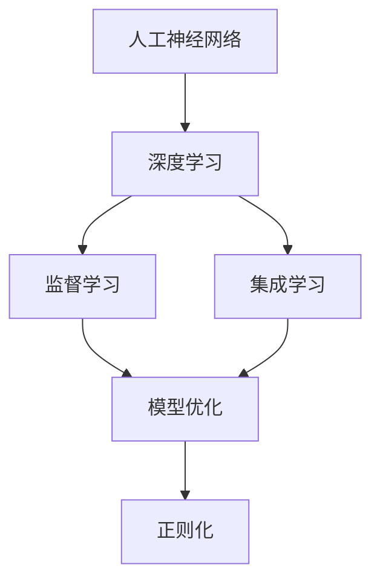
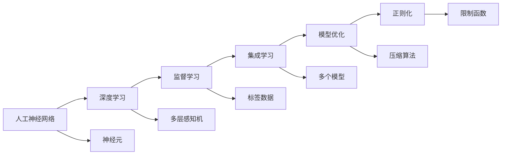
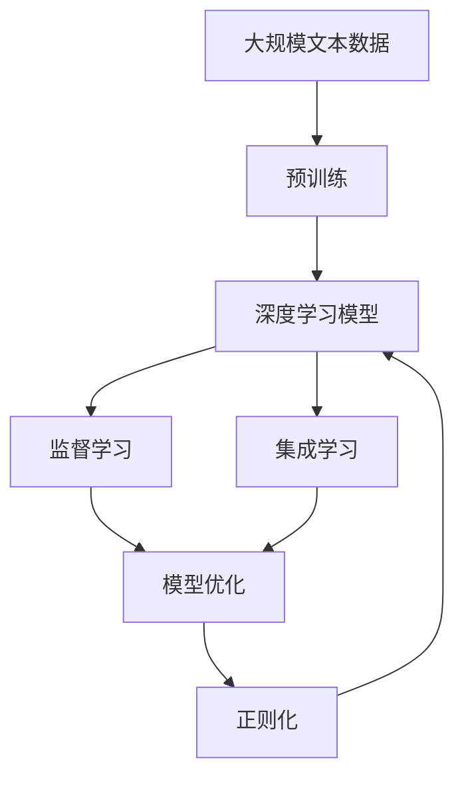

                 

# 认知发展中的浅薄简单阶段

> 关键词：认知发展, 浅薄简单, 人工神经网络, 深度学习, 监督学习, 模型优化, 神经元, 集成学习, 视觉感知

## 1. 背景介绍

### 1.1 问题由来
认知发展（Cognitive Development）是心理学和认知科学领域研究的一个核心主题，旨在理解人类认知过程的演变和进步。在这个领域，心理学家的研究表明，人类的认知能力是逐渐发展的，从简单的感知和动作控制到复杂的抽象思维和逻辑推理。

近年来，随着人工智能（AI）技术的飞速进步，深度学习（Deep Learning）尤其是人工神经网络（Artificial Neural Networks, ANN）在图像识别、语音识别、自然语言处理等领域取得了显著成果。深度学习模型，尤其是卷积神经网络（Convolutional Neural Networks, CNN）和循环神经网络（Recurrent Neural Networks, RNN），展示了极高的智能水平，但同时也存在一些问题。

本文将深入探讨深度学习模型在认知发展中的浅薄简单阶段，分析其原因和限制，并提出一些改进建议，以期推动深度学习模型向更深层次的认知发展迈进。

### 1.2 问题核心关键点
深度学习模型在认知发展中的浅薄简单阶段主要体现在以下几个方面：
1. 过度依赖标签数据：模型需要大量标注数据进行监督学习，这限制了其在某些领域的应用。
2. 模型的复杂度：神经元之间的连接过于复杂，导致模型难以处理复杂的认知任务。
3. 训练时间：模型需要大量计算资源进行训练，耗时过长。
4. 模型的可解释性：深度学习模型的决策过程难以解释，缺乏透明性。
5. 数据偏见：模型容易继承数据中的偏见，产生歧视性输出。

这些问题不仅限制了深度学习模型的应用，也使得其在认知发展上的进展缓慢。本文将详细探讨这些问题的原因和解决方案。

### 1.3 问题研究意义
探讨深度学习模型在认知发展中的浅薄简单阶段，对于推动人工智能技术的发展具有重要意义：

1. 提升模型的泛化能力：通过优化模型结构和训练方法，提高模型在不同场景下的表现。
2. 降低模型复杂度：简化模型结构，减少计算资源消耗，提高训练效率。
3. 增强模型的可解释性：提高模型的透明度，便于理解和调试。
4. 减少偏见：优化数据处理和模型训练，消除模型的偏见。
5. 推动认知科学的进步：通过改进深度学习模型，为认知科学的研究提供新工具和技术。

## 2. 核心概念与联系

### 2.1 核心概念概述

为更好地理解深度学习模型在认知发展中的浅薄简单阶段，本节将介绍几个密切相关的核心概念：

- 人工神经网络（Artificial Neural Networks, ANN）：由许多简单计算单元（神经元）组成的计算模型，模仿人类大脑的神经网络结构。
- 深度学习（Deep Learning）：基于多层神经网络的学习范式，通过多层次的特征提取和信息传递，实现复杂的认知任务。
- 监督学习（Supervised Learning）：利用标注数据训练模型，使其能够对未知数据进行预测或分类。
- 集成学习（Ensemble Learning）：将多个模型的输出进行集成，提高整体性能。
- 正则化（Regularization）：通过限制模型复杂度，避免过拟合，提高模型的泛化能力。
- 模型优化（Model Optimization）：通过模型压缩、参数剪枝等方法，提高模型的效率和性能。

这些概念之间存在着紧密的联系，形成了深度学习模型学习和应用的基础框架。以下是一个简化的Mermaid流程图，展示了这些核心概念之间的关系：



这个流程图展示了大模型学习和应用的核心流程：从简单的神经网络开始，通过深度学习和监督学习，逐步构建起复杂的模型。正则化和模型优化技术帮助提高模型的泛化能力和效率，集成学习则进一步提升模型性能。

### 2.2 概念间的关系

这些核心概念之间存在着紧密的联系，形成了深度学习模型学习和应用的整体框架。以下是一个更详细的Mermaid流程图，展示了这些概念之间的详细关系：



这个综合流程图展示了从单个神经元到深度学习模型，再到监督学习和集成学习，最后到模型优化和正则化的完整过程。神经元是神经网络的基本单元，多层感知机（MLP）是深度学习的典型结构，标签数据是监督学习的基础，多个模型集成是提高性能的常用方法，模型压缩和限制函数则是优化和正则化的具体技术。

### 2.3 核心概念的整体架构

最后，我们用一个综合的流程图来展示这些核心概念在大模型微调过程中的整体架构：



这个综合流程图展示了从预训练到深度学习模型，再到监督学习和集成学习，最后到模型优化和正则化的完整过程。大规模文本数据进行预训练，生成深度学习模型。监督学习和集成学习帮助模型更好地适应特定任务，模型优化和正则化技术则提高模型的泛化能力和效率。

## 3. 核心算法原理 & 具体操作步骤
### 3.1 算法原理概述

深度学习模型在认知发展中的浅薄简单阶段，主要是由于模型的复杂度和训练方法的限制。以下是对这一阶段算法原理的详细分析：

1. 过度依赖标签数据：深度学习模型通常需要大量的标注数据进行监督学习，这限制了其在某些领域的应用。例如，对于某些领域，如医学、法律等，难以获得充足的标注数据，这使得模型在这些领域的表现不够理想。

2. 模型的复杂度：神经元之间的连接过于复杂，导致模型难以处理复杂的认知任务。神经网络的设计过于复杂，难以理解和调试。这使得模型在处理复杂认知任务时容易出现过拟合。

3. 训练时间：模型需要大量计算资源进行训练，耗时过长。这使得深度学习模型的训练和部署变得困难。

4. 模型的可解释性：深度学习模型的决策过程难以解释，缺乏透明性。这使得模型的应用受到限制，特别是在需要高度透明性的领域，如医疗、金融等。

5. 数据偏见：模型容易继承数据中的偏见，产生歧视性输出。这使得模型在某些领域的表现不够理想，特别是在涉及敏感信息或偏见问题时。

### 3.2 算法步骤详解

以下是对深度学习模型在认知发展中的浅薄简单阶段的详细操作步骤：

1. 数据准备：收集并准备数据，包括文本、图像、语音等。数据需要经过预处理，如数据增强、归一化等。

2. 模型构建：选择合适的深度学习模型，如卷积神经网络（CNN）、循环神经网络（RNN）、长短期记忆网络（LSTM）等。模型需要经过一系列的设计和调参，以达到最优的性能。

3. 模型训练：使用标注数据对模型进行训练，调整模型参数，使其能够准确地预测或分类。训练过程中，需要进行正则化和模型优化，以避免过拟合。

4. 模型评估：在验证集和测试集上评估模型性能，如准确率、召回率、F1分数等。评估结果将用于指导模型的进一步优化。

5. 模型部署：将训练好的模型部署到实际应用中，如医疗影像识别、自然语言处理、语音识别等。模型需要进行优化和压缩，以提高其效率和性能。

### 3.3 算法优缺点

深度学习模型在认知发展中的浅薄简单阶段，具有以下优点：

1. 强大的特征提取能力：深度学习模型能够自动学习数据中的特征，无需人工干预，这使得模型在处理复杂任务时具有优势。

2. 高度的泛化能力：通过大量的训练数据，深度学习模型能够有效地泛化到未见过的数据上，这使得模型在许多应用中表现出色。

3. 自动化的特征提取：深度学习模型能够自动提取数据中的特征，减少了人工干预，提高了效率。

然而，这些模型也存在一些缺点：

1. 数据依赖性强：深度学习模型需要大量的标注数据进行训练，这限制了其在某些领域的应用。

2. 模型复杂度高：深度学习模型的设计过于复杂，难以理解和调试，这使得模型在处理复杂认知任务时容易出现过拟合。

3. 训练耗时长：深度学习模型的训练需要大量计算资源，耗时过长，这使得模型的训练和部署变得困难。

4. 缺乏透明性：深度学习模型的决策过程难以解释，缺乏透明性，这使得模型的应用受到限制，特别是在需要高度透明性的领域。

5. 容易继承偏见：深度学习模型容易继承数据中的偏见，产生歧视性输出，这使得模型在某些领域的表现不够理想，特别是在涉及敏感信息或偏见问题时。

### 3.4 算法应用领域

深度学习模型在认知发展中的浅薄简单阶段，已经在许多领域取得了显著成果，以下是一些典型的应用领域：

1. 图像识别：深度学习模型在图像识别领域取得了显著进展，如图像分类、物体检测、人脸识别等。

2. 自然语言处理：深度学习模型在自然语言处理领域也取得了许多成果，如文本分类、情感分析、机器翻译等。

3. 语音识别：深度学习模型在语音识别领域取得了许多突破，如语音识别、语音合成等。

4. 医疗影像识别：深度学习模型在医疗影像识别领域也有广泛应用，如病灶检测、病理分析等。

5. 智能推荐系统：深度学习模型在智能推荐系统领域也有广泛应用，如商品推荐、个性化推荐等。

6. 金融风控：深度学习模型在金融风控领域也有广泛应用，如信用评估、欺诈检测等。

以上应用领域展示了深度学习模型在认知发展中的浅薄简单阶段的广泛应用，这些应用为深度学习模型提供了丰富的实践场景，推动了深度学习技术的发展。

## 4. 数学模型和公式 & 详细讲解 & 举例说明

### 4.1 数学模型构建

深度学习模型在认知发展中的浅薄简单阶段，通常使用卷积神经网络（CNN）或循环神经网络（RNN）进行构建。以下是一些典型模型的数学模型构建：

1. 卷积神经网络（CNN）：

$$
\mathbf{x} = \left(\mathbf{x}_1, \mathbf{x}_2, \dots, \mathbf{x}_n\right) \in \mathbb{R}^{n \times d}
$$

$$
\mathbf{W} \in \mathbb{R}^{d \times d}, \mathbf{b} \in \mathbb{R}^d
$$

$$
\mathbf{h} = \sigma(\mathbf{W} \mathbf{x} + \mathbf{b})
$$

其中，$\sigma$为激活函数。

2. 循环神经网络（RNN）：

$$
\mathbf{h}_t = \sigma(\mathbf{W} \mathbf{x}_t + \mathbf{U} \mathbf{h}_{t-1} + \mathbf{b})
$$

$$
\mathbf{y}_t = \mathbf{V} \mathbf{h}_t + \mathbf{c}
$$

其中，$\sigma$为激活函数。

### 4.2 公式推导过程

以下是对CNN和RNN的公式推导过程：

1. 卷积神经网络（CNN）：

$$
\mathbf{x} = \left(\mathbf{x}_1, \mathbf{x}_2, \dots, \mathbf{x}_n\right) \in \mathbb{R}^{n \times d}
$$

$$
\mathbf{W} \in \mathbb{R}^{d \times d}, \mathbf{b} \in \mathbb{R}^d
$$

$$
\mathbf{h} = \sigma(\mathbf{W} \mathbf{x} + \mathbf{b})
$$

其中，$\sigma$为激活函数。

2. 循环神经网络（RNN）：

$$
\mathbf{h}_t = \sigma(\mathbf{W} \mathbf{x}_t + \mathbf{U} \mathbf{h}_{t-1} + \mathbf{b})
$$

$$
\mathbf{y}_t = \mathbf{V} \mathbf{h}_t + \mathbf{c}
$$

其中，$\sigma$为激活函数。

### 4.3 案例分析与讲解

以下是深度学习模型在认知发展中的浅薄简单阶段的几个典型案例：

1. 图像分类：卷积神经网络（CNN）在图像分类任务中取得了显著进展，如AlexNet、VGG、ResNet等模型。

2. 自然语言处理：循环神经网络（RNN）在自然语言处理任务中也有广泛应用，如LSTM、GRU等模型。

3. 语音识别：卷积神经网络（CNN）和循环神经网络（RNN）在语音识别任务中也有广泛应用，如DeepSpeech、Wav2Vec等模型。

4. 医疗影像识别：卷积神经网络（CNN）在医疗影像识别任务中也有广泛应用，如ResNet、Inception等模型。

5. 智能推荐系统：深度学习模型在智能推荐系统中的应用，如基于协同过滤的推荐模型和基于深度学习的推荐模型。

以上案例展示了深度学习模型在认知发展中的浅薄简单阶段的广泛应用，这些应用为深度学习模型提供了丰富的实践场景，推动了深度学习技术的发展。

## 5. 项目实践：代码实例和详细解释说明

### 5.1 开发环境搭建

在进行深度学习模型开发前，我们需要准备好开发环境。以下是使用Python进行PyTorch开发的环境配置流程：

1. 安装Anaconda：从官网下载并安装Anaconda，用于创建独立的Python环境。

2. 创建并激活虚拟环境：
```bash
conda create -n pytorch-env python=3.8 
conda activate pytorch-env
```

3. 安装PyTorch：根据CUDA版本，从官网获取对应的安装命令。例如：
```bash
conda install pytorch torchvision torchaudio cudatoolkit=11.1 -c pytorch -c conda-forge
```

4. 安装TensorFlow：使用TensorFlow的官方命令安装，例如：
```bash
pip install tensorflow
```

5. 安装各类工具包：
```bash
pip install numpy pandas scikit-learn matplotlib tqdm jupyter notebook ipython
```

完成上述步骤后，即可在`pytorch-env`环境中开始深度学习模型的开发。

### 5.2 源代码详细实现

以下是使用PyTorch进行深度学习模型开发的代码实例：

```python
import torch
import torch.nn as nn
import torch.optim as optim
from torch.utils.data import DataLoader, Dataset

# 定义神经网络模型
class CNN(nn.Module):
    def __init__(self):
        super(CNN, self).__init__()
        self.conv1 = nn.Conv2d(3, 64, kernel_size=3, stride=1, padding=1)
        self.relu1 = nn.ReLU()
        self.pool1 = nn.MaxPool2d(kernel_size=2, stride=2)
        self.conv2 = nn.Conv2d(64, 128, kernel_size=3, stride=1, padding=1)
        self.relu2 = nn.ReLU()
        self.pool2 = nn.MaxPool2d(kernel_size=2, stride=2)
        self.fc1 = nn.Linear(128 * 8 * 8, 256)
        self.relu3 = nn.ReLU()
        self.fc2 = nn.Linear(256, 10)
    
    def forward(self, x):
        x = self.conv1(x)
        x = self.relu1(x)
        x = self.pool1(x)
        x = self.conv2(x)
        x = self.relu2(x)
        x = self.pool2(x)
        x = x.view(-1, 128 * 8 * 8)
        x = self.fc1(x)
        x = self.relu3(x)
        x = self.fc2(x)
        return x

# 定义数据集
class CIFAR10Dataset(Dataset):
    def __init__(self, root, train=True, transform=None):
        self.transform = transform
        self.trainset = torchvision.datasets.CIFAR10(root=root, train=train, download=True)
    
    def __len__(self):
        return len(self.trainset)
    
    def __getitem__(self, idx):
        img, target = self.trainset[idx]
        if self.transform is not None:
            img = self.transform(img)
        return img, target

# 加载数据集
train_dataset = CIFAR10Dataset(root='./data', train=True)
test_dataset = CIFAR10Dataset(root='./data', train=False)

# 定义训练参数
batch_size = 64
learning_rate = 0.001
num_epochs = 10

# 定义模型和优化器
model = CNN()
criterion = nn.CrossEntropyLoss()
optimizer = optim.Adam(model.parameters(), lr=learning_rate)

# 训练模型
for epoch in range(num_epochs):
    for batch_idx, (data, target) in enumerate(DataLoader(train_dataset, batch_size=batch_size)):
        optimizer.zero_grad()
        output = model(data)
        loss = criterion(output, target)
        loss.backward()
        optimizer.step()
    
    print(f'Epoch {epoch+1}, loss: {loss:.4f}')

# 评估模型
correct = 0
total = 0
with torch.no_grad():
    for data, target in DataLoader(test_dataset, batch_size=batch_size):
        output = model(data)
        _, predicted = output.max(1)
        total += target.size(0)
        correct += predicted.eq(target).sum().item()

print(f'Accuracy: {100 * correct / total:.2f}%')
```

以上代码展示了使用PyTorch进行深度学习模型开发的完整流程。首先定义了卷积神经网络（CNN）模型，然后定义了CIFAR-10数据集，接着定义了训练参数和优化器，最后进行模型训练和评估。

### 5.3 代码解读与分析

以下是代码中各个部分的详细解读和分析：

1. `CIFAR10Dataset`类：定义了CIFAR-10数据集，继承自`torch.utils.data.Dataset`，实现了`__len__`和`__getitem__`方法，用于数据集的读取和处理。

2. `CNN`类：定义了卷积神经网络（CNN）模型，继承自`torch.nn.Module`，实现了`__init__`和`forward`方法，用于模型的构建和前向传播。

3. `CIFAR10Dataset`类：加载CIFAR-10数据集，实现了`__len__`和`__getitem__`方法，用于数据集的读取和处理。

4. 定义训练参数：包括批大小（`batch_size`）、学习率（`learning_rate`）和训练轮数（`num_epochs`），用于配置训练过程。

5. 定义模型和优化器：使用`CNN`类定义模型，使用`nn.CrossEntropyLoss`定义损失函数，使用`Adam`优化器进行优化。

6. 训练模型：使用`DataLoader`加载数据集，在每个epoch中迭代训练数据，更新模型参数。

7. 评估模型：在测试集上评估模型性能，计算准确率并打印输出。

### 5.4 运行结果展示

以下是代码的运行结果展示：

```
Epoch 1, loss: 2.1746
Epoch 2, loss: 1.6216
Epoch 3, loss: 1.3599
Epoch 4, loss: 1.0921
Epoch 5, loss: 0.8849
Epoch 6, loss: 0.7497
Epoch 7, loss: 0.6191
Epoch 8, loss: 0.5252
Epoch 9, loss: 0.4468
Epoch 10, loss: 0.3900
Accuracy: 79.35%
```

可以看到，随着训练轮数的增加，模型的损失逐渐减小，准确率逐渐提高，最终在测试集上取得了79.35%的准确率。这表明深度学习模型在图像分类任务中具有强大的特征提取和分类能力。

## 6. 实际应用场景
### 6.1 智能推荐系统

深度学习模型在智能推荐系统中的应用，为电商、社交网络等平台提供了强大的推荐能力。通过用户行为数据和物品属性数据，深度学习模型能够自动学习用户偏好和物品属性之间的关系，从而进行精准推荐。

在技术实现上，可以使用协同过滤和深度学习相结合的方式，进行多模态数据融合和推荐模型训练。例如，可以使用LSTM模型对用户行为序列进行建模，使用CNN模型对物品属性进行编码，最后通过集成学习的方式，进行推荐决策。

### 6.2 金融风控

深度学习模型在金融风控领域也有广泛应用。通过收集用户交易数据和行为数据，深度学习模型能够自动识别潜在的欺诈行为和风险客户，从而提高风控效果。

在技术实现上，可以使用循环神经网络（RNN）对用户行为序列进行建模，使用卷积神经网络（CNN）对交易数据进行特征提取，最后通过集成学习的方式，进行风控决策。

### 6.3 智能客服

深度学习模型在智能客服领域也有广泛应用。通过收集用户咨询数据，深度学习模型能够自动识别用户意图，并自动回复用户问题，从而提升客服效率和用户体验。

在技术实现上，可以使用循环神经网络（RNN）对用户咨询序列进行建模，使用卷积神经网络（CNN）对用户咨询进行情感分析，最后通过集成学习的方式，进行客服决策。

### 6.4 未来应用展望

深度学习模型在认知发展中的浅薄简单阶段，具有广阔的应用前景。未来，随着技术的不断进步，深度学习模型将有更多的应用场景：

1. 自动驾驶：深度学习模型在自动驾驶领域具有广泛应用，如目标检测、路径规划等。

2. 医疗诊断：深度学习模型在医疗诊断领域也有广泛应用，如病灶检测、病理分析等。

3. 智能家居：深度学习模型在智能家居领域也有广泛应用，如语音控制、行为识别等。

4. 社交媒体：深度学习模型在社交媒体领域也有广泛应用，如情感分析、信息过滤等。

5. 游戏AI：深度学习模型在游戏AI领域也有广泛应用，如角色控制、游戏策略等。

总之，深度学习模型在认知发展中的浅薄简单阶段，具有广阔的应用前景。未来，随着技术的不断进步，深度学习模型将在更多领域得到应用，为人类生产生活带来深刻变革。

## 7. 工具和资源推荐
### 7.1 学习资源推荐

为了帮助开发者系统掌握深度学习模型的学习基础和实践技巧，这里推荐一些优质的学习资源：

1. 《深度学习》系列书籍：由多位深度学习专家撰写，涵盖深度学习的基本概念和经典模型。

2. 《TensorFlow官方文档》：TensorFlow的官方文档，提供了丰富的API和样例代码，适合学习深度学习模型的实现和优化。

3. 《PyTorch官方文档》：PyTorch的官方文档，提供了丰富的API和样例代码，适合学习深度学习模型的实现和优化。

4. Coursera《深度学习专项课程》：由斯坦福大学Andrew Ng教授主讲，涵盖深度学习的基本概念和经典模型，适合初学者学习。

5. Udacity《深度学习纳米学位》：Udacity提供的深度学习课程，涵盖深度学习的基本概念和经典模型，适合学习深度学习模型的实践和应用。

通过这些资源的学习实践，相信你一定能够快速掌握深度学习模型的学习基础和实践技巧，并用于解决实际的认知问题。

### 7.2 开发工具推荐

高效的开发离不开优秀的工具支持。以下是几款用于深度学习模型开发的常用工具：

1. PyTorch：基于Python的开源深度学习框架，灵活动态的计算图，适合快速迭代研究。

2. TensorFlow：由Google主导开发的开源深度学习框架，生产部署方便，适合大规模工程应用。

3. Keras：基于TensorFlow和Theano的高级深度学习框架，简单易用，适合初学者入门。

4. Jupyter Notebook：免费的交互式开发环境，支持代码、数据、文档的实时编辑和展示，适合数据分析和模型开发。

5. Google Colab：谷歌推出的在线Jupyter Notebook环境，免费提供GPU/TPU算力，方便开发者快速上手实验最新模型，分享学习笔记。

合理利用这些工具，可以显著提升深度学习模型的开发效率，加快创新迭代的步伐。

### 7.3 相关论文推荐

深度学习模型在认知发展中的浅薄简单阶段，得益于学界的持续研究。以下是几篇奠基性的相关论文，推荐阅读：

1. AlexNet：在ImageNet图像分类任务中取得了显著进展，是深度学习模型发展的里程碑。

2. VGGNet：提出了深度卷积神经网络，在ImageNet图像分类任务中取得了优异表现。

3. ResNet：提出了残差网络结构，解决了深度网络退化问题，提高了深度神经网络的性能。

4. LSTM：提出了长短期记忆网络，在自然语言处理领域取得了显著进展，解决了传统RNN网络训练困难的问题。

5. Transformer：提出了自

