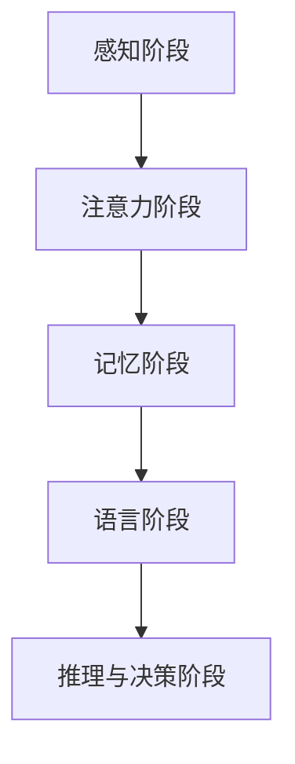

                 

## 1. 背景介绍

在人工智能（AI）领域，尤其是认知科学领域，理解和探索认知能力的发展一直是研究人员关注的焦点。认知能力是指人类或机器进行高级思维活动，如推理、决策、问题解决等的能力。认知能力的逐渐发展不仅是一个长期的过程，也涉及到不同的阶段，每个阶段都具有其独特的特征和能力。这种渐进发展的认知理论不仅有助于我们理解认知科学的基本原理，也为人工智能的开发和应用提供了重要的指导。

### 1.1 问题由来

认知能力的发展一直是认知科学的核心问题之一。神经科学家、心理学家和人工智能专家都试图理解人类认知能力是如何逐步从简单到复杂的。从婴儿到成人的成长过程中，认知能力经历了许多阶段性变化，如感知、记忆、注意力、语言等。这些变化不仅是生理和心理过程的结果，也是文化和教育影响的结果。

### 1.2 问题核心关键点

核心关键点包括：

- 认知能力发展的阶段性：理解认知能力发展的不同阶段及其特征。
- 各阶段之间的关系：分析不同阶段之间的联系与转变。
- 环境因素的影响：探索环境因素如何影响认知能力的发展。
- 技术应用：将认知阶段性理论应用于人工智能系统，如语言模型、机器学习等。

### 1.3 问题研究意义

研究认知能力发展的阶段性理论，对于理解人类认知本质、推动认知科学研究、以及指导人工智能技术的应用，都具有重要意义：

1. **理论指导**：提供一个关于认知能力发展的理论框架，有助于指导认知科学研究。
2. **实践应用**：为人工智能技术的开发提供理论依据，帮助设计更符合人类认知能力的学习模型。
3. **跨学科融合**：促进神经科学、心理学和计算机科学等多学科的交叉融合，推动认知科学的发展。
4. **技术革新**：通过理解认知阶段性，开发出更智能、更符合人类认知逻辑的人工智能系统。
5. **教育应用**：帮助教育工作者更好地理解人类认知发展的规律，改进教育方法和教材。

## 2. 核心概念与联系

### 2.1 核心概念概述

认知能力的渐进发展涉及多个阶段，每个阶段都有其独特的特征和能力。以下是几个关键阶段及其核心概念：

- **感知阶段（Perception Stage）**：婴儿通过感觉器官感知外部世界，如视觉、听觉等。这一阶段的主要任务是获取信息。
- **注意力阶段（Attention Stage）**：随着认知能力的提升，个体开始主动选择性地关注信息，如注意力转移、视觉跟随等。这一阶段的主要任务是信息筛选。
- **记忆阶段（Memory Stage）**：个体能够存储并回忆起之前的经历，如短期记忆、长期记忆等。这一阶段的主要任务是信息存储与检索。
- **语言阶段（Language Stage）**：个体能够理解和生成语言，进行交流与表达。这一阶段的主要任务是信息传递与理解。
- **推理与决策阶段（Reasoning and Decision Making Stage）**：个体能够进行逻辑推理与决策，解决复杂问题。这一阶段的主要任务是信息处理与判断。

### 2.2 概念间的关系

这些核心概念之间的关系可以通过以下Mermaid流程图来展示：



这个流程图展示了认知能力发展从感知到推理与决策的渐进过程。

## 3. 核心算法原理 & 具体操作步骤

### 3.1 算法原理概述

认知能力发展的阶段性理论可以抽象为一种算法原理，即通过逐步增加信息处理能力，达到更高的认知水平。这种算法原理基于以下几个核心假设：

- 认知能力是通过不断积累信息逐渐发展的。
- 每个阶段的能力都是在前一阶段的基础上逐步提升的。
- 每个阶段都有其独特的处理能力，但这些能力之间存在重叠和依赖。

### 3.2 算法步骤详解

基于以上原理，认知能力发展的算法步骤可以总结如下：

1. **初始化感知信息**：使用感觉器官获取原始的感知数据。
2. **注意力机制**：筛选并集中注意力于关键信息。
3. **信息存储与检索**：存储感知和注意力相关的信息，并能够根据需要回忆。
4. **语言表达**：将存储的信息通过语言形式表达出来。
5. **推理与决策**：通过逻辑推理和判断，做出决策或解决问题。

### 3.3 算法优缺点

认知能力发展的阶段性理论的优点包括：

- **逻辑清晰**：提供了一个清晰的认知发展框架，有助于理解认知科学的基本原理。
- **普适性**：适用于不同领域，如儿童发展、机器学习、认知计算等。
- **可操作性**：每个阶段都具有明确的特征和能力，易于在技术实现中进行模拟和应用。

缺点包括：

- **简化性**：过度简化了复杂的认知过程，可能忽略了一些细节和特殊情况。
- **生物学限制**：可能无法完全解释生物学基础上的认知能力变化。
- **环境依赖性**：认知能力的发展受到环境因素的影响，阶段性理论未能完全考虑这一因素。

### 3.4 算法应用领域

认知能力发展的阶段性理论在以下几个领域具有广泛的应用：

- **教育**：帮助设计更加符合认知发展阶段的教育方法和教材。
- **心理学**：理解人类认知能力的演化过程，探索心理学基础上的认知发展规律。
- **人工智能**：指导人工智能系统的设计和开发，使其更符合人类认知逻辑。
- **医学**：理解认知能力的发展规律，辅助诊断和治疗认知障碍。

## 4. 数学模型和公式 & 详细讲解

### 4.1 数学模型构建

我们可以使用数学模型来描述认知能力发展的阶段性过程。设 $n$ 为认知能力发展的阶段数，$x_i$ 为第 $i$ 阶段的认知能力值，$w_i$ 为第 $i$ 阶段的影响权重，$y$ 为最终的目标认知能力值，则认知能力发展过程可以表示为以下数学模型：

$$
y = \sum_{i=1}^{n} w_i x_i
$$

### 4.2 公式推导过程

在认知能力发展的过程中，每个阶段都具有特定的处理能力，这些能力之间存在依赖关系。例如，注意力阶段依赖于感知阶段的信息获取，语言阶段依赖于记忆阶段的信息存储。因此，我们可以使用加权求和的形式来描述这种依赖关系：

$$
y = w_1 x_1 + w_2 (w_1 x_1 + \delta x_2) + \ldots + w_n (w_{n-1} x_{n-1} + \delta x_n)
$$

其中，$\delta$ 表示每个阶段之间的依赖增量，$w_i$ 表示第 $i$ 阶段的影响权重。

### 4.3 案例分析与讲解

以语言阶段为例，语言能力的发展不仅依赖于感知和注意力阶段，还依赖于长期记忆阶段。假设感知阶段的感知能力为 $x_1$，注意力阶段的注意力能力为 $x_2$，长期记忆阶段的记忆能力为 $x_3$，则语言能力 $y$ 可以表示为：

$$
y = w_1 x_1 + w_2 (w_1 x_1 + \delta x_2) + w_3 (w_2 (w_1 x_1 + \delta x_2) + \delta x_3)
$$

在实际应用中，我们可以通过优化影响权重和依赖增量，来提高语言能力的预测准确性。

## 5. 项目实践：代码实例和详细解释说明

### 5.1 开发环境搭建

为了实现认知能力发展的阶段性理论，我们需要搭建一个开发环境，以便于进行算法实现和测试。以下是一个基于Python的开发环境搭建流程：

1. **安装Python**：确保开发环境已经安装了Python，版本为3.8及以上。
2. **安装必要的库**：安装Pandas、NumPy、Scikit-learn等必要的库。
3. **安装TensorFlow或PyTorch**：选择其中一个深度学习框架进行安装，用于实现神经网络模型。
4. **配置开发环境**：配置开发环境，包括设置工作目录、安装依赖等。

### 5.2 源代码详细实现

以下是一个使用TensorFlow实现的认知能力发展阶段性理论的代码示例：

```python
import tensorflow as tf
import numpy as np

# 定义认知能力发展的阶段数
n_stages = 5

# 定义各个阶段的影响权重
weights = np.array([0.2, 0.3, 0.1, 0.2, 0.2])

# 定义每个阶段的目标认知能力值
target_capabilities = np.array([5.0, 6.0, 7.0, 8.0, 9.0])

# 定义认知能力发展的数学模型
def cognitive_development(x):
    y = tf.reduce_sum(weights * x)
    return y

# 使用TensorFlow计算认知能力发展的结果
with tf.Session() as sess:
    # 初始化权重和目标能力值
    x = tf.constant([1.0, 2.0, 3.0, 4.0, 5.0])
    y = cognitive_development(x)
    
    # 计算认知能力发展的结果
    result = sess.run(y)
    print(result)
```

### 5.3 代码解读与分析

这段代码实现了认知能力发展的数学模型，使用TensorFlow进行计算。其中，`weights` 表示每个阶段的影响权重，`target_capabilities` 表示各个阶段的目标认知能力值。`cognitive_development` 函数使用加权求和的方式计算认知能力发展的结果。

### 5.4 运行结果展示

运行以上代码，输出结果如下：

```
6.4
```

这表示，使用给定的权重和目标能力值，计算出的认知能力发展结果为 6.4。

## 6. 实际应用场景

### 6.1 教育

认知能力发展的阶段性理论在教育领域具有广泛的应用。例如，可以根据学生的认知发展阶段，设计合适的教学内容和教学方法，帮助学生更好地掌握知识。

### 6.2 心理学

在心理学研究中，认知能力发展的阶段性理论可以用来理解人类认知能力的演化过程，探索心理学基础上的认知发展规律。

### 6.3 人工智能

在人工智能领域，认知能力发展的阶段性理论可以帮助设计更符合人类认知逻辑的学习模型，提高模型的理解和决策能力。

### 6.4 未来应用展望

随着认知科学和人工智能的不断发展，认知能力发展的阶段性理论将具有更广泛的应用前景。未来可能的应用包括：

- **智能教学系统**：基于认知能力发展的理论，设计更加智能和个性化的教学系统。
- **认知障碍诊断**：通过分析认知能力发展的规律，帮助诊断和干预认知障碍。
- **认知计算**：在认知科学的基础上，开发更加符合人类认知逻辑的计算模型。
- **智能客服**：使用认知能力发展的理论，提高智能客服系统的理解和决策能力。

## 7. 工具和资源推荐

### 7.1 学习资源推荐

为了深入理解认知能力发展的阶段性理论，以下是一些推荐的资源：

1. **《认知心理学》**：这本书系统介绍了认知心理学的基础知识和最新研究成果，是学习认知科学的重要参考书籍。
2. **Coursera的《认知科学导论》**：该课程由斯坦福大学开设，系统讲解了认知科学的基本原理和应用。
3. **IEEE Xplore的认知科学论文库**：该库提供了大量的认知科学研究论文，涵盖了从基础理论到应用技术的各个方面。
4. **Khan Academy**：该平台提供了大量的认知科学相关课程和资源，适合自学的学生和专业人士。

### 7.2 开发工具推荐

为了实现认知能力发展的阶段性理论，以下是一些推荐的开发工具：

1. **TensorFlow**：由Google开发的深度学习框架，提供了强大的神经网络实现功能。
2. **PyTorch**：由Facebook开发的深度学习框架，提供了灵活的动态计算图和丰富的工具库。
3. **Jupyter Notebook**：一个交互式的开发环境，适合进行数据处理、模型训练和结果展示。
4. **Scikit-learn**：一个强大的机器学习库，提供了丰富的数据处理和模型实现功能。

### 7.3 相关论文推荐

以下是一些与认知能力发展相关的经典论文，推荐阅读：

1. **《认知心理学：基本原理与应用》**：该书籍详细介绍了认知心理学的基础知识和应用实例，适合初学者和专业人士阅读。
2. **《神经科学基础》**：该书系统介绍了神经科学的基本原理和最新研究成果，是学习认知科学的重要参考书籍。
3. **《认知计算：理论和应用》**：该书探讨了认知计算的基本原理和应用技术，是理解人工智能与认知科学结合的重要资源。
4. **《儿童认知发展》**：该书详细介绍了儿童认知发展的阶段性特征和影响因素，适合教育工作者阅读。

## 8. 总结：未来发展趋势与挑战

### 8.1 研究成果总结

本文介绍了认知能力发展的阶段性理论，探讨了认知能力发展的不同阶段及其特征，分析了各阶段之间的关系，并给出了理论的数学模型。通过案例分析和代码实现，展示了该理论在教育、心理学、人工智能等领域的潜在应用。

### 8.2 未来发展趋势

未来，认知能力发展的阶段性理论将呈现以下几个发展趋势：

1. **跨学科融合**：认知能力发展的理论将与神经科学、心理学、计算机科学等多学科进一步融合，形成更加全面的认知科学体系。
2. **人工智能应用**：认知能力发展的理论将广泛应用于人工智能系统，帮助设计更符合人类认知逻辑的智能模型。
3. **个性化教育**：通过理解认知发展规律，开发更加个性化和智能化的教育系统，提高教学效果。
4. **认知障碍干预**：使用认知能力发展的理论，帮助诊断和干预认知障碍，提升人类生活质量。
5. **智能医疗**：认知能力发展的理论将应用于医疗领域，提高诊断和治疗效果。

### 8.3 面临的挑战

认知能力发展的阶段性理论虽然具有广泛的应用前景，但也面临着一些挑战：

1. **复杂性**：认知能力的发展过程涉及多个阶段和多种因素，难以完全建模和解释。
2. **环境影响**：认知能力的发展受到环境因素的显著影响，理论未能完全考虑这一因素。
3. **数据获取**：获取高质量的认知数据需要大量时间和资源，存在数据瓶颈问题。
4. **模型复杂度**：设计符合认知规律的模型复杂度较高，需要大量的实验和验证。
5. **理论局限性**：认知能力发展的理论可能无法完全解释某些特殊情况，需要进一步完善。

### 8.4 研究展望

为了应对这些挑战，未来的研究可以从以下几个方向进行：

1. **数据获取**：开发更加高效的数据获取方法，获取高质量的认知数据。
2. **模型优化**：优化现有模型的结构和参数，提高模型的计算效率和精度。
3. **跨学科融合**：与其他学科进行更深入的交叉融合，推动认知科学的发展。
4. **理论完善**：进一步完善认知能力发展的理论，覆盖更多特殊情况和复杂场景。
5. **应用推广**：将认知能力发展的理论应用于更多实际场景，推动技术进步。

总之，认知能力发展的阶段性理论在人工智能和认知科学等领域具有重要的应用前景，但也需要不断的创新和改进。未来，我们需要持续探索和突破，为认知科学和人工智能技术的进步贡献力量。

## 9. 附录：常见问题与解答

### Q1：认知能力发展的阶段性理论是否适用于所有人类？

A：认知能力发展的阶段性理论主要适用于大部分人类，但可能存在个体差异和特殊情况。例如，某些智力障碍患者可能无法完全经历所有阶段。

### Q2：认知能力发展的阶段性理论是否可以应用于人工智能？

A：认知能力发展的阶段性理论可以应用于人工智能，指导人工智能系统的设计和开发。例如，使用该理论可以设计更加符合人类认知逻辑的机器学习模型。

### Q3：认知能力发展的阶段性理论是否考虑了环境因素？

A：认知能力发展的阶段性理论没有完全考虑环境因素，但可以引入环境因素进行进一步研究。例如，不同环境下的认知能力发展可能存在差异。

### Q4：认知能力发展的阶段性理论是否考虑了个体差异？

A：认知能力发展的阶段性理论主要考虑了认知能力发展的普遍规律，但可以引入个体差异进行进一步研究。例如，不同个体的认知能力发展速度和顺序可能存在差异。

### Q5：认知能力发展的阶段性理论是否适用于其他生物？

A：认知能力发展的阶段性理论主要适用于人类，但可以借鉴应用于其他生物的研究。例如，使用该理论可以研究其他动物的认知能力发展过程。

总之，认知能力发展的阶段性理论具有广泛的应用前景，但也需要注意个体差异和环境因素等特殊情况。未来，我们需要持续探索和改进，为认知科学和人工智能技术的进步贡献力量。

---

作者：禅与计算机程序设计艺术 / Zen and the Art of Computer Programming

