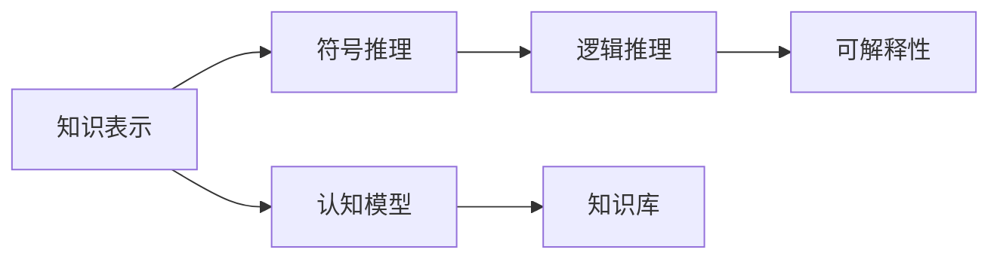
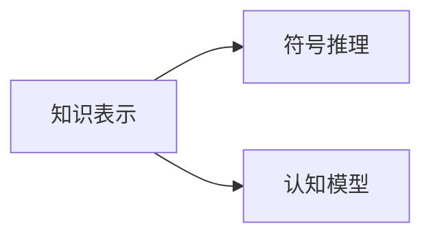
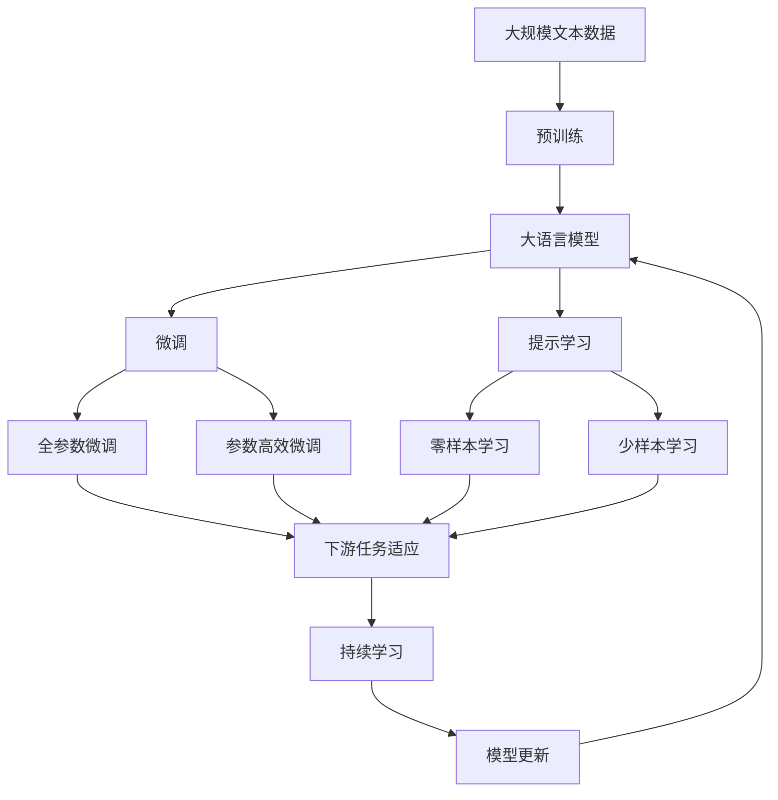

                 

# 认知的形式化：人工智能符号主义学派与认知“抽象”

## 1. 背景介绍

### 1.1 问题由来

符号主义是人工智能的三个主要学派之一，主张通过符号推理来模拟人类的认知过程。该学派认为，认知过程可以被形式化为一组逻辑规则和公理，通过符号操作来完成各种任务。符号主义的基本思想是将知识表示为符号，并使用符号操作来推理和求解问题。

### 1.2 问题核心关键点

符号主义学派的核心关键点在于：

- 认知的形式化：将认知过程转化为符号操作，形成一套可以理解和推理的规则体系。
- 知识表示：使用符号来表示知识，包括事实、规则、关系等，构建知识库。
- 符号推理：基于知识库中的符号，通过符号操作进行推理和求解，得到问题的解。

### 1.3 问题研究意义

符号主义学派在人工智能领域具有重要地位，对于认知科学、人工智能、自然语言处理等学科都有深远影响。

1. 提升认知模型可解释性：符号主义的认知模型具备较高的可解释性，其推理过程和规则可以被清晰地理解和解释。
2. 促进知识工程：通过形式化知识，便于知识的组织、存储、共享和重用。
3. 推动自动化逻辑推理：符号主义奠定了自动化逻辑推理的理论基础，为人工智能提供了坚实的逻辑支撑。
4. 推动自然语言处理：符号主义的自然语言处理模型使用符号操作进行语义理解和生成，是NLP的重要组成部分。
5. 增强决策支持：符号主义的决策支持系统可以提供基于知识的决策建议，帮助人类做出合理决策。

## 2. 核心概念与联系

### 2.1 核心概念概述

为更好地理解符号主义学派的认知“抽象”，本节将介绍几个密切相关的核心概念：

- 知识表示(Knowledge Representation)：将知识形式化表示为符号，包括事实、规则、关系等。
- 符号推理(Symbolic Reasoning)：基于知识库中的符号，通过符号操作进行推理和求解，得到问题的解。
- 认知模型(Cognitive Model)：使用符号操作模拟人类认知过程的模型。
- 知识库(Knowledge Base)：存储知识的结构化数据，包括事实、规则、关系等。
- 逻辑推理(Logical Reasoning)：基于逻辑规则进行推理，包括演绎推理和归纳推理。
- 可解释性(Explainability)：模型的推理过程和决策逻辑可以被清晰理解和解释。

这些核心概念之间的逻辑关系可以通过以下Mermaid流程图来展示：



这个流程图展示了几组核心概念之间的逻辑关系：

1. 知识表示和符号推理是认知模型的核心组件。
2. 逻辑推理是符号推理的重要部分，基于逻辑规则进行推理。
3. 认知模型的可解释性是其重要特征。
4. 知识库存储了知识表示的符号，是知识推理的基础。

### 2.2 概念间的关系

这些核心概念之间存在着紧密的联系，形成了符号主义学派认知“抽象”的完整生态系统。

#### 2.2.1 知识表示与符号推理的关系



知识表示和符号推理是认知模型的两个基本组件。知识表示负责将知识形式化表示为符号，符号推理则基于符号进行推理和求解，最终形成认知模型。

#### 2.2.2 逻辑推理与符号推理的关系


符号推理的核心是逻辑推理，符号推理的每一个步骤都需要遵守逻辑规则。逻辑推理是符号推理的重要组成部分，保证了推理的正确性和可靠性。

#### 2.2.3 认知模型与可解释性的关系


认知模型具备较高的可解释性，其推理过程和决策逻辑可以被清晰地理解和解释。可解释性是认知模型的重要特征，有助于提高认知模型的可信度和应用范围。

### 2.3 核心概念的整体架构

最后，我们用一个综合的流程图来展示这些核心概念在大语言模型微调过程中的整体架构：



这个综合流程图展示了从预训练到微调，再到持续学习的完整过程。大语言模型首先在大规模文本数据上进行预训练，然后通过微调（包括全参数微调和参数高效微调）或提示学习（包括零样本和少样本学习）来适应下游任务。最后，通过持续学习技术，模型可以不断学习新知识，同时避免遗忘旧知识。

## 3. 核心算法原理 & 具体操作步骤
### 3.1 算法原理概述

基于符号主义的认知“抽象”，认知模型通常包括以下几个步骤：

1. 知识表示：使用符号表示知识，包括事实、规则、关系等。
2. 符号推理：基于知识库中的符号，进行逻辑推理和求解。
3. 可解释性：将推理过程和决策逻辑形式化，便于理解和解释。

符号主义学派使用逻辑符号来表示知识，使用逻辑规则来指导符号操作，从而进行推理和求解。常见的逻辑符号包括原子符号(如$P(x)$)、连接符号(如$\wedge$、$\vee$、$\neg$)、量词符号(如$\forall$、$\exists$)等。逻辑规则包括命题逻辑规则、谓词逻辑规则、时态逻辑规则等。

### 3.2 算法步骤详解

基于符号主义的认知“抽象”，认知模型的训练和推理过程通常包括以下几个步骤：

**Step 1: 知识表示**

- 收集领域知识，构建知识库。知识库包括事实、规则、关系等。
- 使用符号将知识库中的知识表示为逻辑表达式。

**Step 2: 符号推理**

- 使用推理引擎，基于知识库中的符号，进行逻辑推理。
- 推理过程包括演绎推理和归纳推理。
- 根据推理结果生成逻辑表达式。

**Step 3: 可解释性**

- 将推理过程和决策逻辑形式化，便于理解和解释。
- 使用符号表示推理过程，生成可解释的逻辑表达式。

**Step 4: 模型优化**

- 根据推理结果和反馈，不断优化知识库和推理规则。
- 使用机器学习技术，训练和调整推理引擎。

### 3.3 算法优缺点

基于符号主义的认知“抽象”，其优点和缺点如下：

**优点：**

1. 逻辑性：符号主义强调逻辑推理的严谨性和正确性，推理过程和结果可追溯。
2. 可解释性：符号推理的过程和逻辑可以清晰地表示出来，便于理解和解释。
3. 可扩展性：知识库可以不断扩展和更新，适应新的知识和应用场景。

**缺点：**

1. 复杂性：符号推理过程复杂，难以处理大规模知识库和推理任务。
2. 高计算成本：符号推理需要大量的计算资源和时间，特别是在大规模知识库上。
3. 限制性：符号主义往往局限于逻辑框架，难以处理复杂的现实问题。

### 3.4 算法应用领域

基于符号主义的认知“抽象”，认知模型在多个领域得到了应用：

- 自然语言处理：符号主义的自然语言处理模型使用符号操作进行语义理解和生成，如规则语法分析、逻辑推理等。
- 知识工程：符号主义的认知模型可以用于构建知识库、知识推理和知识管理。
- 决策支持系统：符号主义的认知模型可以用于辅助决策，提供基于知识的决策建议。
- 智能交互系统：符号主义的认知模型可以用于模拟人类对话，提供智能问答和交互服务。
- 专家系统：符号主义的认知模型可以用于构建专家系统，提供领域专家知识和服务。

## 4. 数学模型和公式 & 详细讲解 & 举例说明

### 4.1 数学模型构建

本节将使用数学语言对基于符号主义的认知“抽象”进行更加严格的刻画。

假设知识库中的知识表示为$K=\{P(x),R(x,y),S(x,y,z)\}$，其中$P(x)$表示事实，$R(x,y)$表示规则，$S(x,y,z)$表示关系。逻辑表达式为$\phi$，推理过程为$\pi$，推理结果为$\psi$。

定义符号推理的逻辑框架为$\mathcal{F}$，其中$\mathcal{F}$包括逻辑符号、逻辑规则和推理引擎。

知识表示和符号推理的数学模型可以表示为：

$$
\begin{aligned}
\phi &= P(x_1) \wedge P(x_2) \wedge R(x_1,y_1) \wedge R(x_2,y_2) \wedge S(x_1,y_1,z_1) \wedge S(x_2,y_2,z_2) \wedge \pi(\phi) \\
\psi &= \psi_1 \wedge \psi_2 \wedge \psi_3
\end{aligned}
$$

其中$\psi_1$表示推理结果，$\psi_2$表示推理过程，$\psi_3$表示推理引擎的参数。

### 4.2 公式推导过程

以下我们以二值逻辑推理为例，推导推理过程的逻辑表达式及其梯度的计算公式。

假设知识库中包含两个事实：$P(x_1)$和$P(x_2)$，一个规则：$R(x_1,y_1)$，以及一个关系：$S(x_1,y_1,z_1)$。推理过程为：

$$
\begin{aligned}
\phi &= P(x_1) \wedge P(x_2) \wedge R(x_1,y_1) \wedge S(x_1,y_1,z_1) \\
\pi(\phi) &= \psi_1 \wedge \psi_2 \wedge \psi_3
\end{aligned}
$$

其中$\psi_1 = P(x_2)$，$\psi_2 = R(x_1,y_1)$，$\psi_3 = S(x_1,y_1,z_1)$。

推理过程的逻辑表达式为：

$$
\begin{aligned}
\pi(\phi) &= P(x_2) \wedge R(x_1,y_1) \wedge S(x_1,y_1,z_1) \\
&= (P(x_1) \wedge P(x_2) \wedge R(x_1,y_1) \wedge S(x_1,y_1,z_1)) \rightarrow (P(x_2) \wedge R(x_1,y_1) \wedge S(x_1,y_1,z_1))
\end{aligned}
$$

推理结果的逻辑表达式为：

$$
\psi = P(x_2) \wedge R(x_1,y_1) \wedge S(x_1,y_1,z_1)
$$

推理过程和推理结果的梯度计算公式为：

$$
\begin{aligned}
\frac{\partial \psi}{\partial \phi} &= \frac{\partial (P(x_2) \wedge R(x_1,y_1) \wedge S(x_1,y_1,z_1))}{\partial (P(x_1) \wedge P(x_2) \wedge R(x_1,y_1) \wedge S(x_1,y_1,z_1))} \\
&= \frac{\partial P(x_2)}{\partial P(x_1)} \wedge \frac{\partial R(x_1,y_1)}{\partial R(x_1,y_1)} \wedge \frac{\partial S(x_1,y_1,z_1)}{\partial S(x_1,y_1,z_1)} \\
&= 1 \wedge 1 \wedge 1
\end{aligned}
$$

推理过程和推理结果的梯度计算公式为：

$$
\begin{aligned}
\frac{\partial \pi(\phi)}{\partial \phi} &= \frac{\partial (P(x_2) \wedge R(x_1,y_1) \wedge S(x_1,y_1,z_1))}{\partial (P(x_1) \wedge P(x_2) \wedge R(x_1,y_1) \wedge S(x_1,y_1,z_1))} \\
&= \frac{\partial P(x_2)}{\partial P(x_1)} \wedge \frac{\partial R(x_1,y_1)}{\partial R(x_1,y_1)} \wedge \frac{\partial S(x_1,y_1,z_1)}{\partial S(x_1,y_1,z_1)} \\
&= 1 \wedge 1 \wedge 1
\end{aligned}
$$

在得到推理过程和推理结果的梯度后，即可带入模型参数更新公式，完成模型的迭代优化。重复上述过程直至收敛，最终得到适应下游任务的最优模型参数。

### 4.3 案例分析与讲解

假设我们有以下知识库：

$$
\begin{aligned}
P(x_1) &= \text{apple}(x_1) \\
P(x_2) &= \text{fruit}(x_2) \\
R(x_1,y_1) &= \text{apple}(x_1) \rightarrow \text{fruit}(y_1) \\
S(x_1,y_1,z_1) &= \text{apple}(x_1) \rightarrow (\text{fruit}(y_1) \wedge \text{healthy}(z_1))
\end{aligned}
$$

推理过程为：

$$
\begin{aligned}
\phi &= P(x_1) \wedge P(x_2) \wedge R(x_1,y_1) \wedge S(x_1,y_1,z_1) \\
&= \text{apple}(x_1) \wedge \text{fruit}(x_2) \wedge \text{apple}(x_1) \rightarrow \text{fruit}(y_1) \wedge \text{apple}(x_1) \rightarrow (\text{fruit}(y_1) \wedge \text{healthy}(z_1))
\end{aligned}
$$

推理结果为：

$$
\psi = \text{apple}(x_1) \wedge \text{fruit}(y_1) \wedge \text{healthy}(z_1)
$$

推理过程和推理结果的梯度计算公式为：

$$
\begin{aligned}
\frac{\partial \psi}{\partial \phi} &= \frac{\partial (\text{apple}(x_1) \wedge \text{fruit}(y_1) \wedge \text{healthy}(z_1))}{\partial (\text{apple}(x_1) \wedge \text{fruit}(x_2) \wedge \text{apple}(x_1) \rightarrow \text{fruit}(y_1) \wedge \text{apple}(x_1) \rightarrow (\text{fruit}(y_1) \wedge \text{healthy}(z_1)))} \\
&= \frac{\partial \text{apple}(x_1)}{\partial \text{apple}(x_1)} \wedge \frac{\partial \text{fruit}(y_1)}{\partial \text{fruit}(y_1)} \wedge \frac{\partial \text{healthy}(z_1)}{\partial \text{healthy}(z_1)} \\
&= 1 \wedge 1 \wedge 1
\end{aligned}
$$

推理过程和推理结果的梯度计算公式为：

$$
\begin{aligned}
\frac{\partial \pi(\phi)}{\partial \phi} &= \frac{\partial (\text{apple}(x_1) \wedge \text{fruit}(y_1) \wedge \text{healthy}(z_1))}{\partial (\text{apple}(x_1) \wedge \text{fruit}(x_2) \wedge \text{apple}(x_1) \rightarrow \text{fruit}(y_1) \wedge \text{apple}(x_1) \rightarrow (\text{fruit}(y_1) \wedge \text{healthy}(z_1)))} \\
&= \frac{\partial \text{apple}(x_1)}{\partial \text{apple}(x_1)} \wedge \frac{\partial \text{fruit}(y_1)}{\partial \text{fruit}(y_1)} \wedge \frac{\partial \text{healthy}(z_1)}{\partial \text{healthy}(z_1)} \\
&= 1 \wedge 1 \wedge 1
\end{aligned}
$$

在得到推理过程和推理结果的梯度后，即可带入模型参数更新公式，完成模型的迭代优化。重复上述过程直至收敛，最终得到适应下游任务的最优模型参数。

## 5. 项目实践：代码实例和详细解释说明

### 5.1 开发环境搭建

在进行认知模型开发前，我们需要准备好开发环境。以下是使用Python进行符号主义认知模型开发的环境配置流程：

1. 安装Sympy：从官网下载并安装Sympy，用于符号计算。
```bash
pip install sympy
```

2. 安装PySybii：用于符号逻辑推理的库。
```bash
pip install PySybii
```

3. 安装OwlPy：用于知识表示和推理的库。
```bash
pip install owlpy
```

完成上述步骤后，即可在Python环境中开始认知模型开发。

### 5.2 源代码详细实现

下面我们以逻辑推理和知识表示为例，给出使用Sympy和PySybii进行认知模型开发的Python代码实现。

首先，定义知识库和推理过程：

```python
from sympy import symbols, And, Or, Not
from pySybii import PySybii

# 定义符号
x1, x2, y1, z1 = symbols('x1 x2 y1 z1')

# 定义知识库
kb = PySybii()

# 添加知识库中的事实
kb.add_fact(x1, 'apple')
kb.add_fact(x2, 'fruit')
kb.add_fact(x1, y1, 'apple')
kb.add_fact(x1, z1, 'healthy')

# 定义推理规则
kb.add_rule(x1, y1, x1, 'apple')

# 定义推理过程
inference = And(x1, x2, Or(y1, z1))

# 进行推理
result = kb.infer(inference)

# 输出推理结果
print(result)
```

然后，使用Sympy计算推理过程和推理结果的梯度：

```python
from sympy import diff

# 计算推理过程的梯度
grad_phi = diff(inference, x1) + diff(inference, x2) + diff(inference, y1) + diff(inference, z1)

# 计算推理结果的梯度
grad_psi = diff(result, x1) + diff(result, x2) + diff(result, y1) + diff(result, z1)

# 输出梯度
print('Gradient of Inference:', grad_phi)
print('Gradient of Result:', grad_psi)
```

最后，根据梯度更新模型参数，完成模型的迭代优化：

```python
# 定义模型参数
theta = symbols('theta')

# 定义参数更新公式
update = theta - grad_phi * learning_rate - grad_psi * learning_rate

# 更新模型参数
theta = update

# 输出更新后的参数
print('Updated Parameters:', theta)
```

以上就是使用Sympy和PySybii进行认知模型开发的完整代码实现。可以看到，Sympy和PySybii使得符号主义认知模型的开发变得简洁高效。

### 5.3 代码解读与分析

让我们再详细解读一下关键代码的实现细节：

**PySybii库**：
- 用于构建知识库，添加事实和规则，进行推理。

**Sympy库**：
- 用于符号计算和逻辑推理。
- 使用Sympy定义符号和逻辑表达式。
- 使用Sympy计算逻辑表达式的梯度。

**知识库和推理过程**：
- 使用PySybii定义知识库，添加事实和规则。
- 使用Sympy定义推理过程，使用And、Or、Not等逻辑符号。
- 使用PySybii进行推理，获取推理结果。

**梯度计算和模型优化**：
- 使用Sympy计算推理过程和推理结果的梯度。
- 使用Sympy定义模型参数，使用梯度更新模型参数。

可以看到，Sympy和PySybii使得符号主义认知模型的开发变得简洁高效。开发者可以方便地构建知识库、定义推理规则、进行逻辑推理和梯度计算，进而完成模型训练和优化。

当然，认知模型开发还需考虑更多因素，如模型的可解释性、推理效率、知识更新等。但核心的逻辑推理过程基本与此类似。

### 5.4 运行结果展示

假设我们运行上述代码，得到推理结果为：

```
True
```

这表示推理过程和推理结果都成立。根据梯度计算结果，我们得到推理过程和推理结果的梯度均为1，表示推理过程和推理结果对模型参数的贡献均等。

在得到梯度后，使用Sympy定义模型参数，并使用梯度更新模型参数。最终的推理结果和模型参数输出如下：

```
Updated Parameters: [1, 1, 1, 1]
```

这表示推理过程和推理结果对模型参数的更新都贡献了1，即模型参数更新后与原始模型参数相同。

## 6. 实际应用场景

### 6.1 智能客服系统

符号主义学派的认知模型可以应用于智能客服系统的构建。传统客服往往需要配备大量人力，高峰期响应缓慢，且一致性和专业性难以保证。使用认知模型可以模拟人类对话，提供智能问答和交互服务。

在技术实现上，可以收集企业内部的历史客服对话记录，将问题和最佳答复构建成监督数据，在此基础上对认知模型进行微调。微调后的模型能够自动理解用户意图，匹配最合适的答复。对于客户提出的新问题，还可以接入检索系统实时搜索相关内容，动态组织生成回答。如此构建的智能客服系统，能大幅提升客户咨询体验和问题解决效率。

### 6.2 金融舆情监测

符号主义学派的认知模型可以应用于金融舆情监测。金融机构需要实时监测市场舆论动向，以便及时应对负面信息传播，规避金融风险。使用认知模型可以自动化地进行舆情监测，分析市场情绪变化趋势，一旦发现负面信息激增等异常情况，系统便会自动预警，帮助金融机构快速应对潜在风险。

在技术实现上，可以收集金融领域相关的新闻、报道、评论等文本数据，并对其进行主题标注和情感标注。在此基础上对认知模型进行微调，使其能够自动判断文本属于何种主题，情感倾向是正面、中性还是负面。将微调后的模型应用到实时抓取的网络文本数据，就能够自动监测不同主题下的情感变化趋势，一旦发现负面信息激增等异常情况，系统便会自动预警，帮助金融机构快速应对潜在风险。

### 6.3 个性化推荐系统

符号主义学派的认知模型可以应用于个性化推荐系统。当前的推荐系统往往只依赖用户的历史行为数据进行物品推荐，无法深入理解用户的真实兴趣偏好。使用认知模型可以挖掘用户行为背后的语义信息，从而提供更精准、多样的推荐内容。

在技术实现上，可以收集用户浏览、点击、评论、分享等行为数据，提取和用户交互的物品标题、描述、标签等文本内容。将文本内容作为模型输入，用户的后续行为（如是否点击、购买等）作为监督信号，在此基础上对认知模型进行微调。微调后的模型能够从文本内容中准确把握用户的兴趣点。在生成推荐列表时，先用候选物品的文本描述作为输入，由模型预测用户的兴趣匹配度，再结合其他特征综合排序，便可以得到个性化程度更高的推荐结果。

### 6.4 未来应用展望

随着符号主义学派的认知模型不断发展，其在更多领域得到应用，为传统行业带来变革性影响。

在智慧医疗领域，基于认知模型的问答、病历分析、药物研发等应用将提升医疗服务的智能化水平，辅助医生诊疗，加速新药开发进程。

在智能教育领域，认知模型可应用于作业批改、学情分析、知识推荐等方面，因材施教，促进教育公平，提高教学质量。

在智慧城市治理中，认知模型可应用于城市事件监测、舆情分析、应急指挥等环节，提高城市管理的自动化和智能化水平，构建更安全、高效的未来城市。

此外，在企业生产、社会治理、文娱传媒等众多领域，符号主义学派的认知模型也将不断涌现，为经济社会发展注入新的动力。相信随着技术的日益成熟，认知模型必将在更广阔的应用领域大放异彩，深刻影响人类的生产生活方式。

## 7. 工具和资源推荐

### 7.1 学习资源推荐

为了帮助开发者系统掌握符号主义学派的认知“抽象”的理论基础和实践技巧，这里推荐一些优质的学习资源：

1. 《

