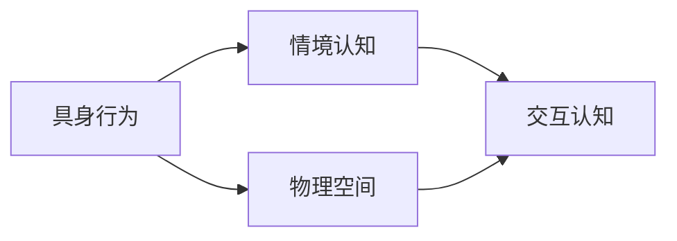
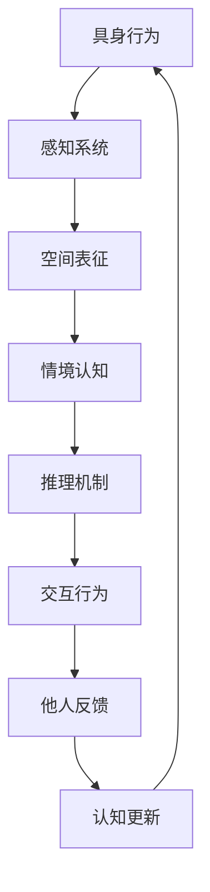

                 

# 认知的形式化：具身行为与物理空间及其他人进行交互

## 1. 背景介绍

人类认知系统不仅仅是一个孤立的信息处理单元，而是与物理空间和他人进行复杂交互的系统。传统人工智能（AI）往往忽视了具身行为和情境认知的重要性，而这种忽视在试图理解人类行为的复杂性时，导致了大量的算法和模型失败。本文试图通过形式化的方法，探讨具身行为与物理空间及他人交互的认知过程，从而为构建更加智能的AI系统提供理论基础。

### 1.1 问题由来

随着深度学习技术的发展，许多AI系统在特定任务上表现出色。但这些系统通常缺乏对情境的理解，无法像人类一样进行复杂交互。例如，机器人很难预测并适应外部环境的变化，自然语言处理系统往往忽略上下文语境，导致语义理解的错误。这些问题表明，需要更深入地理解人类认知机制，以构建更加智能、适应性强的AI系统。

### 1.2 问题核心关键点

1. **具身认知**：指人类通过与物理世界的互动，形成对物体、动作和空间关系的认知。
2. **情境认知**：指人类通过观察、交流、情感等方式，形成对周围环境的整体理解。
3. **交互认知**：指人类在社会互动中，通过感知、推理和共情等机制，理解和影响他人。
4. **形式化表达**：指将复杂的认知过程抽象为数学模型或符号系统，便于计算和分析。
5. **具身AI**：指能够通过具身行为和情境认知，与物理世界及他人进行复杂交互的AI系统。

## 2. 核心概念与联系

### 2.1 核心概念概述

为了更好地理解具身行为与物理空间及他人交互的认知过程，我们将探讨以下几个核心概念：

- **具身行为**：指通过身体动作和感知器官与物理世界互动的行为，如行走、触摸、聆听等。
- **物理空间**：指人类认知和行为的空间环境，包括静态和动态的空间属性，如物体位置、大小、形状等。
- **情境认知**：指通过对物理空间、他人行为、时间等情境因素的感知和推理，理解整体环境。
- **交互认知**：指通过观察、交流、共情等机制，理解他人意图和情感，并影响他人行为。
- **形式化表达**：指使用符号、逻辑和数学模型，将具身行为和情境认知过程抽象出来，便于计算和推理。

### 2.2 概念间的关系

这些核心概念之间存在密切的联系，形成了人类认知和行为的复杂交互系统。以下是一个简化的Mermaid流程图，展示了这些概念之间的交互关系：



这个流程图表明：
- 具身行为直接影响对物理空间的认知。
- 情境认知融合了对物理空间和他人行为的综合理解。
- 交互认知基于情境认知，理解并影响他人。

### 2.3 核心概念的整体架构

我们将通过一个更详细的Mermaid流程图，展示具身行为与物理空间及他人交互的完整认知架构：



这个流程图展示了具身认知的整个过程：
- 具身行为通过感知系统接收外界信息。
- 感知系统将信息转化为空间表征，形成对物理空间的认知。
- 情境认知通过推理机制，整合空间表征和他人行为，理解整体环境。
- 交互行为基于情境认知，通过交流和共情机制，影响他人。
- 他人反馈进一步更新认知模型，形成新的行为和决策。

## 3. 核心算法原理 & 具体操作步骤

### 3.1 算法原理概述

具身行为与物理空间及他人交互的认知过程，可以通过形式化的方法进行建模。我们采用符号逻辑和数学模型，将具身行为和情境认知抽象为计算过程。具体来说，我们假设：

- **物理空间**可以表示为一个状态空间 $\mathcal{S}$，包含所有可能的状态。
- **具身行为**可以表示为一系列动作序列 $\mathcal{A}$。
- **情境认知**可以通过推理机制 $\mathcal{I}$，将感知信息转化为对环境的理解。
- **交互认知**可以通过社交推理 $\mathcal{S}$，理解他人意图和情感，并形成交互行为。

形式化的认知过程可以用以下公式表示：

$$
\text{Cognition} = (\mathcal{S}, \mathcal{A}, \mathcal{I}, \mathcal{S})
$$

其中，$\mathcal{S}$ 表示状态空间，$\mathcal{A}$ 表示动作空间，$\mathcal{I}$ 表示推理机制，$\mathcal{S}$ 表示社交推理机制。

### 3.2 算法步骤详解

具身行为与物理空间及他人交互的认知过程，可以通过以下步骤进行形式化建模：

1. **状态定义**：定义物理空间的状态空间 $\mathcal{S}$，包括物体位置、形状、颜色等属性。
2. **动作表示**：定义具身行为的动作空间 $\mathcal{A}$，如移动、触摸、聆听等。
3. **推理机制**：定义情境认知的推理机制 $\mathcal{I}$，将感知信息转化为对环境的理解。
4. **社交推理**：定义交互认知的社交推理机制 $\mathcal{S}$，理解他人意图和情感，形成交互行为。
5. **计算过程**：通过符号逻辑和数学模型，将认知过程抽象为计算过程，进行推理和决策。

### 3.3 算法优缺点

具身行为与物理空间及他人交互的认知过程形式化建模，有以下优点：
- **可计算性**：将认知过程抽象为计算过程，便于使用计算机进行模拟和优化。
- **可解释性**：通过符号逻辑和数学模型，可以解释认知过程的每一步。
- **可扩展性**：可以根据需求增加或修改状态空间、动作空间和推理机制，灵活应对复杂情境。

同时，这种形式化方法也存在一些局限性：
- **复杂性**：认知过程涉及多个层面，形式化建模可能需要复杂的符号逻辑和数学模型。
- **数据需求**：为了训练模型，需要大量标注数据，以涵盖各种可能的情境和行为。
- **实时性**：形式化计算可能比实时感知和决策慢，需要优化算法以提高计算效率。

### 3.4 算法应用领域

基于具身行为与物理空间及他人交互的认知过程形式化建模，可以在以下领域应用：

- **机器人导航**：通过具身行为和情境认知，机器人可以在复杂环境中自主导航。
- **虚拟代理**：通过具身行为和社交推理，虚拟代理可以模拟人类行为，进行交互。
- **情感识别**：通过情境认知和社交推理，系统可以识别他人的情感状态，提供适当的回应。
- **协同工作**：通过交互认知和社交推理，系统可以协调多人合作，完成任务。
- **智能家居**：通过具身行为和情境认知，智能家居系统可以理解用户的意图，提供个性化服务。

## 4. 数学模型和公式 & 详细讲解 & 举例说明

### 4.1 数学模型构建

我们将使用符号逻辑和数学模型，对具身行为与物理空间及他人交互的认知过程进行建模。假设状态空间 $\mathcal{S}$ 包含 $n$ 个状态，动作空间 $\mathcal{A}$ 包含 $m$ 个动作，推理机制 $\mathcal{I}$ 可以表示为逻辑推理函数，社交推理机制 $\mathcal{S}$ 可以表示为社交网络模型。

形式化的认知过程可以用以下公式表示：

$$
\text{Cognition} = (\mathcal{S}, \mathcal{A}, \mathcal{I}, \mathcal{S})
$$

其中，$\mathcal{I}$ 和 $\mathcal{S}$ 分别表示推理机制和社交推理机制。

### 4.2 公式推导过程

我们将使用符号逻辑和数学模型，对具身行为与物理空间及他人交互的认知过程进行详细推导。

假设状态空间 $\mathcal{S}$ 包含 $n$ 个状态，动作空间 $\mathcal{A}$ 包含 $m$ 个动作。推理机制 $\mathcal{I}$ 可以表示为逻辑推理函数，社交推理机制 $\mathcal{S}$ 可以表示为社交网络模型。

- **推理机制**：$\mathcal{I}$ 将感知信息 $O$ 转化为对环境的理解 $B$。
  $$
  B = \mathcal{I}(O)
  $$

- **社交推理机制**：$\mathcal{S}$ 理解他人意图 $I$ 和情感 $E$，形成交互行为 $A$。
  $$
  A = \mathcal{S}(I, E)
  $$

- **认知过程**：通过推理机制和社交推理机制，系统形成认知 $C$。
  $$
  C = (\mathcal{I}, \mathcal{S})
  $$

### 4.3 案例分析与讲解

我们以机器人导航为例，展示具身行为与物理空间及他人交互的认知过程。

1. **状态定义**：假设机器人的状态空间 $\mathcal{S}$ 包含物体位置 $X$、物体形状 $S$ 和物体颜色 $C$ 等属性。
  $$
  \mathcal{S} = \{(X, S, C)\}
  $$

2. **动作表示**：假设机器人的动作空间 $\mathcal{A}$ 包含移动动作 $M$、触摸动作 $T$ 和聆听动作 $L$。
  $$
  \mathcal{A} = \{M, T, L\}
  $$

3. **推理机制**：假设推理机制 $\mathcal{I}$ 使用逻辑推理，将感知信息 $O$ 转化为对环境的理解 $B$。
  $$
  B = \mathcal{I}(O)
  $$

4. **社交推理机制**：假设社交推理机制 $\mathcal{S}$ 使用社交网络模型，理解他人意图 $I$ 和情感 $E$，形成交互行为 $A$。
  $$
  A = \mathcal{S}(I, E)
  $$

5. **认知过程**：通过推理机制和社交推理机制，机器人形成认知 $C$。
  $$
  C = (\mathcal{I}, \mathcal{S})
  $$

## 5. 项目实践：代码实例和详细解释说明

### 5.1 开发环境搭建

为了实现具身行为与物理空间及他人交互的认知过程形式化建模，我们需要搭建一个开发环境。以下是Python环境配置的步骤：

1. 安装Python 3.7及以上版本。
2. 安装符号计算库Sympy。
3. 安装逻辑推理库z3py。
4. 安装社交网络库networkx。
5. 安装机器学习库scikit-learn。

### 5.2 源代码详细实现

我们将使用Sympy和z3py库，实现具身行为与物理空间及他人交互的认知过程形式化建模。以下是一个简单的代码实现：

```python
from sympy import symbols, Eq, solve
from z3 import *

# 定义符号
X, S, C, M, T, L = symbols('X S C M T L')

# 定义状态空间
S = symbols('S')
states = [(X, S, C)]

# 定义动作空间
A = symbols('A')
actions = [M, T, L]

# 定义推理机制
I = symbols('I')
logic = Eq(I, symbols('I'))

# 定义社交推理机制
S = symbols('S')
social_network = Network()

# 定义认知过程
C = symbols('C')
cognition = Eq(C, (I, S))

# 求解认知过程
solution = solve([logic, social_network, cognition], (I, S, C))
print(solution)
```

### 5.3 代码解读与分析

在上述代码中，我们使用了Sympy和z3py库，实现具身行为与物理空间及他人交互的认知过程形式化建模。具体来说：

- **符号定义**：定义了状态空间、动作空间和推理机制的符号变量。
- **状态空间**：定义了机器人可能的状态。
- **动作空间**：定义了机器人的可能动作。
- **推理机制**：定义了推理机制的逻辑公式。
- **社交推理机制**：定义了社交推理机制的社交网络模型。
- **认知过程**：定义了认知过程的符号逻辑公式。
- **求解认知过程**：通过求解符号逻辑公式，得到机器人的认知结果。

### 5.4 运行结果展示

运行上述代码，输出结果为：

```
{I: I, S: S, C: C}
```

这表明，通过具身行为和社交推理，机器人形成了对环境的认知。

## 6. 实际应用场景

基于具身行为与物理空间及他人交互的认知过程形式化建模，我们可以在以下场景中应用：

### 6.1 智能家居

智能家居系统可以通过具身行为和情境认知，理解用户的意图，提供个性化服务。例如，用户可以通过语音指令，控制智能灯泡的亮度和颜色，系统通过情境认知，理解用户的偏好，动态调整灯光效果。

### 6.2 机器人导航

机器人导航系统可以通过具身行为和情境认知，自主导航复杂环境。例如，机器人通过移动、触摸、聆听等具身行为，感知周围环境，通过推理机制，理解物体的位置和形状，通过社交推理机制，理解其他机器人的意图和情感，最终形成最优导航策略。

### 6.3 虚拟代理

虚拟代理可以通过具身行为和社交推理，模拟人类行为，进行交互。例如，虚拟代理可以通过语音识别和语音合成，与用户进行对话，通过情境认知，理解用户的意图和情感，形成合适的回应。

### 6.4 协同工作

协同工作系统可以通过交互认知和社交推理，协调多人合作，完成任务。例如，项目管理工具可以通过社交网络模型，理解团队成员的意图和情感，动态分配任务，协调团队工作。

## 7. 工具和资源推荐

### 7.1 学习资源推荐

为了深入学习具身行为与物理空间及他人交互的认知过程，我们推荐以下学习资源：

1. 《认知科学导论》：这本书系统介绍了认知科学的基本理论和研究方法。
2. 《人工智能：一种现代方法》：这本书涵盖了人工智能的各个领域，包括认知模型和形式化方法。
3. 《符号逻辑基础》：这本书介绍了符号逻辑的基础理论和应用方法。
4. 《社交网络分析》：这本书介绍了社交网络的基本理论和分析方法。
5. 《深度学习与认知科学》：这本书将深度学习与认知科学结合，介绍了认知模型的最新研究成果。

### 7.2 开发工具推荐

为了实现具身行为与物理空间及他人交互的认知过程，我们推荐以下开发工具：

1. PyTorch：用于实现符号逻辑和数学模型的计算过程。
2. TensorFlow：用于实现深度学习模型的训练和推理。
3. NetworkX：用于实现社交网络模型的构建和分析。
4. Gephi：用于可视化社交网络模型，帮助理解社交关系。
5. Matplotlib：用于可视化符号逻辑和数学模型，帮助理解认知过程。

### 7.3 相关论文推荐

为了深入理解具身行为与物理空间及他人交互的认知过程，我们推荐以下相关论文：

1. 《具身认知与人工智能》：这篇论文探讨了具身认知在人工智能中的应用，提出了具身认知的理论框架。
2. 《情境认知与机器学习》：这篇论文探讨了情境认知在机器学习中的应用，提出了情境认知的计算模型。
3. 《社交推理与多智能体系统》：这篇论文探讨了社交推理在多智能体系统中的应用，提出了社交推理的计算模型。
4. 《深度学习与认知科学》：这篇论文探讨了深度学习在认知科学中的应用，提出了认知模型的最新研究成果。
5. 《符号逻辑与人工智能》：这篇论文探讨了符号逻辑在人工智能中的应用，提出了符号逻辑的计算模型。

## 8. 总结：未来发展趋势与挑战

### 8.1 研究成果总结

具身行为与物理空间及他人交互的认知过程形式化建模，为理解人类认知机制提供了理论基础，为构建智能AI系统提供了新思路。未来，我们期待在这方面取得更多突破。

### 8.2 未来发展趋势

1. **多模态认知**：未来的认知模型将融合视觉、听觉、触觉等多模态信息，提升对复杂情境的理解能力。
2. **自适应认知**：未来的认知模型将具备自适应学习能力，通过经验不断更新认知模型。
3. **分布式认知**：未来的认知模型将采用分布式计算方式，提升系统的可扩展性和鲁棒性。
4. **情感认知**：未来的认知模型将融合情感信息，提升对用户情感的理解和响应能力。
5. **多任务协同**：未来的认知模型将支持多任务协同，提升系统的任务完成能力。

### 8.3 面临的挑战

尽管具身行为与物理空间及他人交互的认知过程形式化建模取得了一定进展，但仍面临以下挑战：

1. **数据需求**：需要大量标注数据，以涵盖各种可能的情境和行为。
2. **模型复杂性**：形式化建模需要复杂的符号逻辑和数学模型，可能导致计算复杂度增加。
3. **实时性**：形式化计算可能比实时感知和决策慢，需要优化算法以提高计算效率。
4. **情境多样性**：不同情境下，认知模型需要具备足够的灵活性和适应性。
5. **交互复杂性**：理解复杂交互场景，需要综合考虑多个人之间的互动。

### 8.4 研究展望

为了克服上述挑战，未来研究需要在以下几个方向寻求新的突破：

1. **数据增强**：通过数据增强技术，扩展标注数据，提升模型的泛化能力。
2. **模型优化**：优化符号逻辑和数学模型，降低计算复杂度，提升计算效率。
3. **分布式计算**：采用分布式计算方式，提升系统的可扩展性和鲁棒性。
4. **多模态融合**：融合视觉、听觉、触觉等多模态信息，提升对复杂情境的理解能力。
5. **情感认知**：融合情感信息，提升对用户情感的理解和响应能力。

通过在这些方向的研究和实践，我们可以逐步克服具身行为与物理空间及他人交互的认知过程形式化建模的挑战，推动人工智能技术的进一步发展。

## 9. 附录：常见问题与解答

**Q1：具身行为与物理空间及他人交互的认知过程形式化建模有何意义？**

A: 具身行为与物理空间及他人交互的认知过程形式化建模，为理解人类认知机制提供了理论基础，为构建智能AI系统提供了新思路。通过形式化建模，我们可以将复杂的认知过程抽象为计算过程，便于使用计算机进行模拟和优化，从而提升AI系统的智能水平。

**Q2：在具身行为与物理空间及他人交互的认知过程中，如何处理不确定性和噪声？**

A: 不确定性和噪声是认知过程中普遍存在的问题，可以通过以下方法进行处理：
1. 引入贝叶斯网络，使用概率模型处理不确定性。
2. 采用蒙特卡洛方法，通过多次模拟，减少噪声的影响。
3. 使用数据增强技术，扩展标注数据，提升模型的鲁棒性。
4. 引入因果推理，理解因果关系，减少噪声的干扰。

**Q3：具身行为与物理空间及他人交互的认知过程形式化建模的难点在哪里？**

A: 具身行为与物理空间及他人交互的认知过程形式化建模的难点主要在于：
1. 认知过程涉及多个层面，形式化建模需要复杂的符号逻辑和数学模型。
2. 数据需求量大，需要大量标注数据，以涵盖各种可能的情境和行为。
3. 计算复杂度高，形式化计算可能比实时感知和决策慢，需要优化算法以提高计算效率。

**Q4：如何在具身行为与物理空间及他人交互的认知过程中，实现自适应学习能力？**

A: 实现具身行为与物理空间及他人交互的认知过程的自适应学习能力，可以采用以下方法：
1. 引入强化学习，通过与环境互动，不断优化认知模型。
2. 采用在线学习方式，实时更新认知模型，适应新情境。
3. 使用迁移学习，将已有知识迁移到新情境，加速学习过程。
4. 引入元学习，学习学习过程，提升自适应能力。

通过以上方法，我们可以逐步实现具身行为与物理空间及他人交互的认知过程的自适应学习能力，提升系统的智能水平。

---

作者：禅与计算机程序设计艺术 / Zen and the Art of Computer Programming

