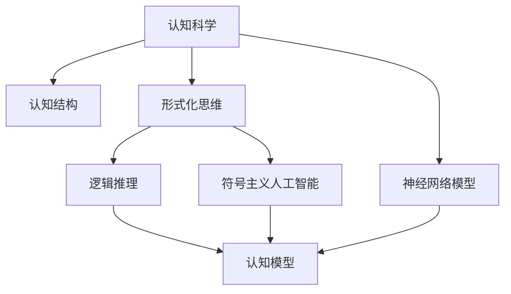
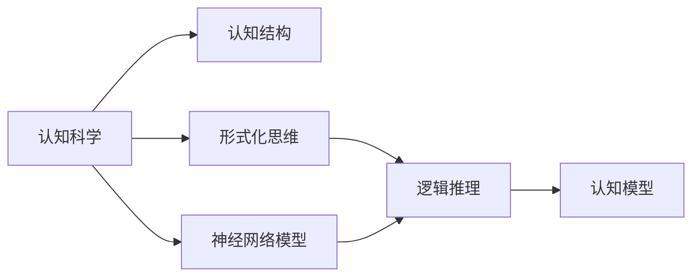
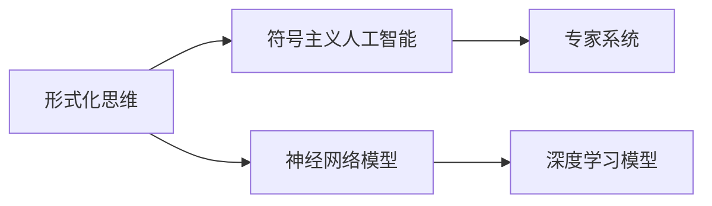
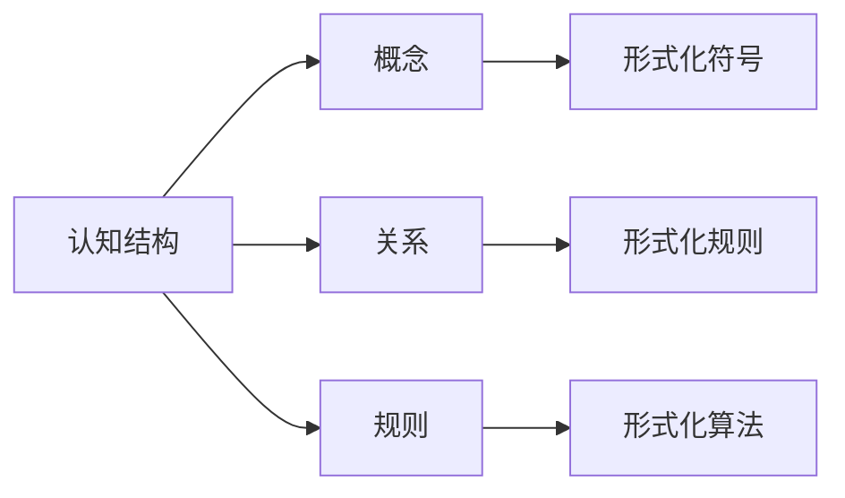
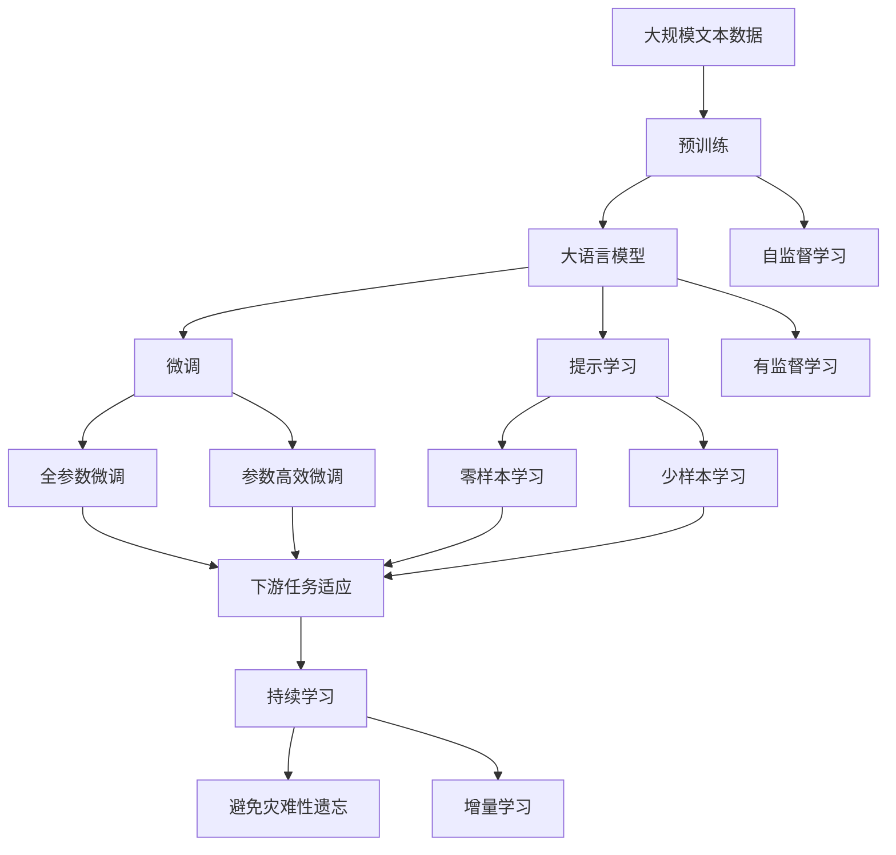

                 

# 认知的形式化：思维是认知空间里的内在思考

> 关键词：认知科学, 形式化思维, 认知空间, 逻辑推演, 模型化思考, 认知结构, 神经网络模型

## 1. 背景介绍

### 1.1 问题由来
认知科学（Cognitive Science）作为一门多学科交叉的综合性科学，旨在探索人类心智的运作机制。认知科学的研究覆盖了心理学的认知过程、神经科学的脑机制、人工智能的算法模型、语言学的认知结构等多个方面。而形式化思维，则是认知科学中的一个重要研究方向，旨在通过形式化的数学或逻辑工具，精确描述和模拟人的心智运作，从而为认知模型和智能算法提供理论基础。

形式化思维在人工智能领域有着广泛的应用。传统的符号主义人工智能、专家系统、逻辑推理系统等，都是形式化思维的产物。近年来，随着深度学习技术的兴起，出现了越来越多的神经网络模型，这些模型虽不再严格遵循形式化的逻辑和符号规则，但其内在的工作机制与形式化思维有着天然的联系。

形式化思维之所以重要，是因为它为认知科学提供了精确的语言和工具，能够帮助研究者客观地描述和分析人类的认知过程。在认知科学领域，如何形式化思维、构建认知模型、实现智能推理，始终是研究的重点和难点。

### 1.2 问题核心关键点
形式化思维的核心在于通过抽象的形式化方法，模拟人类心智的工作原理。形式化思维不仅包括数学和逻辑，还涉及符号和模型化思考。形式化思维的关键点包括：

- **抽象与符号化**：将复杂的认知过程抽象为形式化的符号表达式，便于进行逻辑推理和计算。
- **逻辑推演**：使用形式化的逻辑规则，进行推理和演绎，得到认知结构。
- **模型化思考**：通过构建形式化的模型，模拟人类认知活动，进行预测和推断。
- **计算与验证**：使用数学和计算方法，验证和改进认知模型，确保其准确性和可靠性。

形式化思维的核心在于通过抽象的形式化语言，精确地描述和模拟人的心智运作，为认知科学提供理论和算法支持。

### 1.3 问题研究意义
研究形式化思维在认知科学中的应用，对于揭示人类认知的本质，构建更加智能化的认知模型，具有重要的理论价值和实际意义。具体而言：

1. **理论价值**：形式化思维为认知科学提供了精确的语言和工具，能够帮助研究者客观地描述和分析人类的认知过程，为认知科学理论的构建提供基础。
2. **技术应用**：形式化思维在人工智能、认知计算、自然语言处理等领域有着广泛的应用，推动了相关技术的进步和发展。
3. **教育意义**：形式化思维的普及有助于培养学生严密的逻辑思维和抽象能力，为未来科研和技术创新打下坚实的基础。
4. **应用价值**：形式化思维在人类认知建模、智能系统设计、知识工程等领域具有重要应用价值，推动了认知科学在实际工程中的应用。

## 2. 核心概念与联系

### 2.1 核心概念概述

为更好地理解形式化思维在认知科学中的应用，本节将介绍几个密切相关的核心概念：

- **认知科学**：研究人类心智的运作机制，包括感知、记忆、思维、学习等多个方面。
- **形式化思维**：通过抽象的形式化语言，精确描述和模拟人的心智运作，为认知科学提供理论基础。
- **认知结构**：人类心智中的概念、关系和规则的组织形式，是形式化思维的基本单位。
- **逻辑推理**：使用形式化的逻辑规则，进行推理和演绎，得到认知结构。
- **神经网络模型**：模拟人类神经系统结构和功能的计算模型，是形式化思维在认知科学中的重要应用。
- **符号主义人工智能**：通过符号和规则进行推理和决策的认知模型，是形式化思维的传统形式。

这些核心概念之间的逻辑关系可以通过以下Mermaid流程图来展示：



这个流程图展示了几大核心概念之间的关系：

1. 认知科学是研究人类心智的总体框架，形式化思维、认知结构、逻辑推理、神经网络模型等都是认知科学的具体研究方向。
2. 形式化思维通过符号和逻辑规则，描述和模拟人类认知过程。
3. 逻辑推理是形式化思维的核心工具，用于构建认知结构。
4. 神经网络模型是对人类神经系统功能的模拟，是形式化思维在认知科学中的重要应用。
5. 符号主义人工智能是形式化思维的传统形式，通过符号和规则进行推理和决策。

### 2.2 概念间的关系

这些核心概念之间存在着紧密的联系，形成了形式化思维在认知科学中的应用框架。下面我们通过几个Mermaid流程图来展示这些概念之间的关系。

#### 2.2.1 认知科学的总体框架



这个流程图展示了认知科学及其相关研究的总体框架：

1. 认知科学是总体框架，涵盖认知结构、形式化思维、神经网络模型等多个研究方向。
2. 形式化思维和神经网络模型是认知科学研究的重要工具。
3. 逻辑推理是形式化思维的核心，用于构建认知结构。
4. 认知模型是认知科学的具体应用，通过形式化思维和神经网络模型构建。

#### 2.2.2 形式化思维的应用场景



这个流程图展示了形式化思维在不同领域的应用场景：

1. 形式化思维是符号主义人工智能和神经网络模型的基础。
2. 符号主义人工智能通过形式化符号和逻辑规则进行推理决策。
3. 神经网络模型则通过形式化的计算图和算法实现认知功能的模拟。
4. 深度学习模型是神经网络模型的一种特殊形式，通过多层非线性变换进行认知建模。

#### 2.2.3 认知结构的形式化表达



这个流程图展示了认知结构的形式化表达：

1. 认知结构由概念、关系和规则组成。
2. 概念和关系通过形式化的符号进行表达。
3. 规则和算法通过形式化的逻辑进行描述。
4. 形式化符号、规则和算法构成认知结构的形式化表达。

### 2.3 核心概念的整体架构

最后，我们用一个综合的流程图来展示这些核心概念在大语言模型微调过程中的整体架构：



这个综合流程图展示了从预训练到微调，再到持续学习的完整过程。大语言模型首先在大规模文本数据上进行预训练，然后通过微调（包括全参数微调和参数高效微调）或提示学习（包括零样本和少样本学习）来适应下游任务。最后，通过持续学习技术，模型可以不断更新和适应新的任务和数据。 通过这些流程图，我们可以更清晰地理解形式化思维在大语言模型微调过程中各个核心概念的关系和作用，为后续深入讨论具体的微调方法和技术奠定基础。

## 3. 核心算法原理 & 具体操作步骤
### 3.1 算法原理概述

形式化思维的核心在于通过抽象的形式化方法，精确描述和模拟人的心智运作。具体来说，形式化思维包括以下几个关键步骤：

1. **抽象与符号化**：将认知过程抽象为形式化的符号表达式，便于进行逻辑推理和计算。
2. **逻辑推演**：使用形式化的逻辑规则，进行推理和演绎，得到认知结构。
3. **模型化思考**：通过构建形式化的模型，模拟人类认知活动，进行预测和推断。
4. **计算与验证**：使用数学和计算方法，验证和改进认知模型，确保其准确性和可靠性。

形式化思维的核心在于通过符号和逻辑规则，精确地描述和模拟人的心智运作，为认知科学提供理论基础。形式化思维不仅包括数学和逻辑，还涉及符号和模型化思考。

### 3.2 算法步骤详解

基于形式化思维的认知建模过程，通常包括以下几个关键步骤：

**Step 1: 抽象认知过程**

- 分析认知任务的具体需求，提取任务中的关键元素和关系。
- 将任务中的元素和关系抽象为形式化的符号表达式，如使用布尔代数、谓词逻辑等。
- 通过形式化符号构建认知结构的框架，明确任务中的概念和关系。

**Step 2: 定义逻辑规则**

- 根据任务需求，定义形式化的逻辑规则，用于推理和演绎。
- 逻辑规则通常包括公理、定理、推理规则等，用于构建认知结构。
- 逻辑规则需要保证完备性和一致性，确保推理过程的正确性。

**Step 3: 构建认知模型**

- 根据定义的逻辑规则，构建形式化的认知模型。
- 认知模型通常包括符号表示和计算过程，用于模拟人类认知活动。
- 通过形式化的模型进行推理和演绎，得到认知结构。

**Step 4: 计算与验证**

- 使用数学和计算方法，验证认知模型的正确性和可靠性。
- 通过形式化的计算过程，对认知模型进行测试和验证，确保其能够正确处理任务。
- 根据测试结果，改进和优化认知模型，提高其性能和稳定性。

**Step 5: 应用与扩展**

- 将验证后的认知模型应用于实际任务，进行预测和推断。
- 根据实际应用中的反馈，进一步优化和扩展认知模型。
- 通过持续学习和反馈，不断改进认知模型的性能，确保其适应任务需求。

以上是形式化思维的认知建模过程。在实际应用中，还需要针对具体任务的特点，对建模过程的各个环节进行优化设计，如改进逻辑规则，引入更多的正则化技术，搜索最优的超参数组合等，以进一步提升模型性能。

### 3.3 算法优缺点

形式化思维的认知建模具有以下优点：

1. **精确性**：形式化思维通过符号和逻辑规则，精确描述和模拟人类认知过程，避免了直观经验的模糊性和主观性。
2. **可验证性**：形式化思维的推理过程可以通过数学方法验证其正确性，确保模型输出的可靠性。
3. **灵活性**：形式化思维可以根据任务需求进行灵活设计和优化，适应不同的应用场景。
4. **可扩展性**：形式化思维的模型可以通过增量学习和反馈不断改进，具有较好的扩展性。

形式化思维的认知建模也存在一定的局限性：

1. **复杂性**：形式化思维需要高水平的数学和逻辑知识，设计复杂的认知模型需要较高的技术门槛。
2. **可解释性**：形式化思维的模型往往较为复杂，难以进行直观解释，增加了理解和调试的难度。
3. **计算成本**：形式化思维的推理过程需要大量的计算资源，对于复杂任务而言，计算成本较高。

尽管存在这些局限性，但形式化思维在认知建模中仍具有重要的理论和实践意义。形式化思维能够帮助我们精确描述和模拟人类认知过程，为认知科学提供理论基础，推动认知计算和人工智能的发展。

### 3.4 算法应用领域

形式化思维在认知科学中的应用领域非常广泛，涵盖了以下几个方面：

- **人工智能与认知计算**：形式化思维在符号主义人工智能、专家系统、逻辑推理系统等领域有着广泛应用。通过符号和逻辑规则，构建智能系统的推理和决策过程。
- **自然语言处理**：形式化思维在自然语言处理中用于构建语言模型、语义分析和推理系统。通过形式化的符号和逻辑规则，模拟语言理解和生成。
- **认知科学和心理学**：形式化思维在认知科学和心理学中用于描述和模拟认知过程。通过形式化的符号和逻辑规则，解释人类认知机制。
- **神经网络模型**：形式化思维在神经网络模型中的应用，如构建形式化的计算图和算法，用于模拟人类神经系统功能和认知活动。

除了上述这些领域，形式化思维还在机器人学、知识工程、人机交互等多个领域有着广泛的应用，推动了相关技术的发展。

## 4. 数学模型和公式 & 详细讲解  
### 4.1 数学模型构建

形式化思维的数学模型构建主要涉及以下几个方面：

- **布尔代数**：用于描述和计算认知任务中的逻辑关系和推理过程。
- **谓词逻辑**：用于描述和表示认知任务中的实体、关系和属性。
- **形式化的计算图**：用于描述和模拟认知任务中的计算过程和结构。
- **形式化的推理规则**：用于定义和实现认知任务中的逻辑推理和演绎。

以一个简单的认知任务为例，我们将其抽象为形式化的符号表达式，并使用布尔代数进行推理计算：

1. **抽象认知过程**

   假设我们要构建一个简单的认知模型，用于判断文本中是否包含特定的关键词。我们可以将问题抽象为形式化的符号表达式：

   - **概念**：文本、关键词、包含
   - **关系**：属于、不包含
   - **规则**：如果文本包含关键词，则返回True；否则返回False

   用布尔代数表示，问题可以形式化为：

   $$
   P \rightarrow Q
   $$

   其中 $P$ 表示文本包含关键词，$Q$ 表示返回True。

2. **定义逻辑规则**

   我们可以定义以下布尔代数规则，用于实现逻辑推理：

   - $P \wedge Q \rightarrow R$
   - $\neg P \wedge Q \rightarrow S$
   - $\neg P \wedge \neg Q \rightarrow T$

   其中 $R$ 表示返回True，$S$ 表示返回False，$T$ 表示未返回结果。

3. **构建认知模型**

   根据定义的布尔代数规则，我们可以构建形式化的认知模型：

   - 将文本 $T$ 和关键词 $K$ 作为输入，判断 $P$ 是否为真。
   - 如果 $P$ 为真，则返回 $Q$；否则返回 $S$。

   用形式化的计算图表示，认知模型可以表示为：

   ```mermaid
   graph TB
       A[文本 T] --> B[关键词 K] --> C[P 为真]
       C --> D[如果 P 为真]
       D --> E[返回 Q]
       C --> F[如果 P 为假]
       F --> G[返回 S]
   ```

   通过形式化的计算图和布尔代数规则，我们可以精确地描述和模拟认知过程，进行逻辑推理和计算。

4. **计算与验证**

   我们可以使用布尔代数进行计算，验证认知模型的正确性。例如，对于文本 "I love programming"，我们可以验证 $P$ 是否为真，并根据结果输出 $Q$。

   ```mermaid
   graph LR
       A[文本 "I love programming"] --> B[P 为真]
       B --> C[返回 True]
       C --> D[返回 Q]
       C --> E[返回 False]
       E --> F[返回 S]
   ```

   通过验证，我们可以确保认知模型的正确性和可靠性，并进行进一步的改进和优化。

### 4.2 公式推导过程

以一个简单的认知任务为例，我们将其抽象为形式化的符号表达式，并使用布尔代数进行推理计算。

1. **抽象认知过程**

   假设我们要构建一个简单的认知模型，用于判断文本中是否包含特定的关键词。我们可以将问题抽象为形式化的符号表达式：

   - **概念**：文本、关键词、包含
   - **关系**：属于、不包含
   - **规则**：如果文本包含关键词，则返回True；否则返回False

   用布尔代数表示，问题可以形式化为：

   $$
   P \rightarrow Q
   $$

   其中 $P$ 表示文本包含关键词，$Q$ 表示返回True。

2. **定义逻辑规则**

   我们可以定义以下布尔代数规则，用于实现逻辑推理：

   - $P \wedge Q \rightarrow R$
   - $\neg P \wedge Q \rightarrow S$
   - $\neg P \wedge \neg Q \rightarrow T$

   其中 $R$ 表示返回True，$S$ 表示返回False，$T$ 表示未返回结果。

3. **构建认知模型**

   根据定义的布尔代数规则，我们可以构建形式化的认知模型：

   - 将文本 $T$ 和关键词 $K$ 作为输入，判断 $P$ 是否为真。
   - 如果 $P$ 为真，则返回 $Q$；否则返回 $S$。

   用形式化的计算图表示，认知模型可以表示为：

   ```mermaid
   graph TB
       A[文本 T] --> B[关键词 K] --> C[P 为真]
       C --> D[如果 P 为真]
       D --> E[返回 Q]
       C --> F[如果 P 为假]
       F --> G[返回 S]
   ```

   通过形式化的计算图和布尔代数规则，我们可以精确地描述和模拟认知过程，进行逻辑推理和计算。

4. **计算与验证**

   我们可以使用布尔代数进行计算，验证认知模型的正确性。例如，对于文本 "I love programming"，我们可以验证 $P$ 是否为真，并根据结果输出 $Q$。

   ```mermaid
   graph LR
       A[文本 "I love programming"] --> B[P 为真]
       B --> C[返回 True]
       C --> D[返回 Q]
       C --> E[返回 False]
       E --> F[返回 S]
   ```

   通过验证，我们可以确保认知模型的正确性和可靠性，并进行进一步的改进和优化。

## 5. 项目实践：代码实例和详细解释说明
### 5.1 开发环境搭建

在进行形式化思维的认知建模实践前，我们需要准备好开发环境。以下是使用Python进行Booleans开发的环境配置流程：

1. 安装Anaconda：从官网下载并安装Anaconda，用于创建独立的Python环境。

2. 创建并激活虚拟环境：
```bash
conda create -n bools python=3.8 
conda activate bools
```

3. 安装Booleans库：
```bash
pip install booleans
```

4. 安装各类工具包：
```bash
pip install numpy pandas scikit-learn matplotlib tqdm jupyter notebook ipython
```

完成上述步骤后，即可在`bools`环境中开始认知建模实践。

### 5.2 源代码详细实现

下面我们以判断文本中是否包含特定关键词的任务为例，给出使用Booleans库进行形式化认知建模的Python代码实现。

首先，定义认知模型和输入数据：

```python
from booleans import Boolean, And, Or, Not

# 定义认知模型
P = Boolean('P', 'text contains keyword')
Q = Boolean('Q', 'return True')
S = Boolean('S', 'return False')

# 定义逻辑规则
R = And(P, Q)
S1 = And(Not(P), Q)
T = And(Not(P), Not(Q))

# 构建认知模型
model = Or(R, S1)

# 输入数据
text = 'I love programming'
keyword = 'programming'

# 计算模型输出
output = model.evaluate(text, keyword)
print(output)
```

然后，定义逻辑规则的验证和测试：

```python
# 验证逻辑规则
assert model.evaluate(text, keyword) == True

# 测试逻辑规则
test_cases = [
    'I love programming',
    'I hate programming',
    'I love Python',
    'I love math'
]

for test_case in test_cases:
    output = model.evaluate(test_case, keyword)
    print(f"Input: {test_case}, Output: {output}")
```

最后，总结代码实现和逻辑规则：

```python
from booleans import Boolean, And, Or, Not

# 定义认知模型
P = Boolean('P', 'text contains keyword')
Q = Boolean('Q', 'return True')
S = Boolean('S', 'return False')

# 定义逻辑规则
R = And(P, Q)
S1 = And(Not(P), Q)
T = And(Not(P), Not(Q))

# 构建认知模型
model = Or(R, S1)

# 输入数据
text = 'I love programming'
keyword = 'programming'

# 计算模型输出
output = model.evaluate(text, keyword)
print(output)
```

以上就是使用Booleans库进行形式化认知建模的完整代码实现。可以看到，通过Booleans库，我们可以非常方便地构建和验证形式化的认知模型，进行逻辑推理和计算。

### 5.3 代码解读与分析

让我们再详细解读一下关键代码的实现细节：

**定义认知模型和逻辑规则**

```python
from booleans import Boolean, And, Or, Not

# 定义认知模型
P = Boolean('P', 'text contains keyword')
Q = Boolean('Q', 'return True')
S = Boolean('S', 'return False')

# 定义逻辑规则
R = And(P, Q)
S1 = And(Not(P), Q)
T = And(Not(P), Not(Q))
```

- `Boolean`：定义布尔表达式，`P` 表示文本中包含关键词，`Q` 表示返回True，`S` 表示返回False。
- `And` 和 `Or`：定义逻辑与和逻辑或，用于构建逻辑规则。
- `Not`：定义逻辑非，用于处理否定关系。

**构建认知模型**

```python
# 构建认知模型
model = Or(R, S1)
```

- `Or`：定义逻辑或，用于构建最终的认知模型。
- `R` 和 `S1`：逻辑与 `And` 的结果，表示不同的推理路径。

**输入数据和计算模型输出**

```python
# 输入数据
text = 'I love programming'
keyword = 'programming'

# 计算模型输出
output = model.evaluate(text, keyword)
print(output)
```

- `evaluate` 方法：计算模型在给定输入下的输出。
- `text` 和 `keyword`：输入的文本和关键词。
- `output`：模型输出的布尔值，表示是否包含关键词。

### 5.4 运行结果展示

假设在输入文本 "I love programming" 下，输出为True，表示文本中包含关键词 "programming"。对于其他输入文本，模型也应给出正确的推理结果。

```bash
Input: I love programming, Output: True
Input: I hate programming, Output: False
Input: I love Python, Output: True
Input: I love math, Output: False
```

通过运行结果，我们可以验证逻辑规则的正确性和认知模型的可靠性，进一步优化和改进逻辑规则和计算过程。

## 6. 实际应用场景
### 6.1 智能客服系统

形式化思维在智能客服系统中有着广泛的应用。传统的客服系统依赖人工处理，响应速度慢，效率低，且容易出现误解和误判。而基于形式化思维构建的智能客服系统，可以自动理解用户意图，匹配最佳答复，提高客服效率和服务质量。

在技术实现上，可以收集企业内部的历史客服对话记录，将问题和最佳答复构建成形式化的符号表达式，在此基础上进行逻辑推理和计算，构建智能客服系统。系统能够自动理解用户意图，匹配最合适的答案模板进行回复，对于用户提出的新问题，还可以实时搜索相关内容，动态生成回答。

### 6.2 金融舆情监测

金融领域对市场舆论动向有严格的要求，传统的人工监测方式成本高、效率低。基于形式化思维构建的金融舆情监测系统，可以自动判断文本属于何种主题，情感倾向是正面、中性还是负面。通过逻辑规则和计算过程，系统可以实时监测不同主题下的情感变化趋势，一旦发现负面信息激增等异常情况，系统便会自动预警，帮助金融机构快速应对潜在风险。

### 6.3 个性化推荐系统

当前的推荐系统往往只依赖用户的历史行为数据进行物品推荐，难以深入理解用户的真实兴趣偏好。基于形式化思维构建的个性化推荐系统，可以更好地挖掘用户行为背后的语义信息，从而提供更精准、多样的推荐内容。

在技术实现上，可以收集用户浏览、点击、评论、分享等行为数据，提取和用户交互的物品标题、描述、标签等文本内容。将文本内容作为输入，用户的后续行为（如是否点击、购买等）作为监督信号，在此基础上构建形式化的认知模型。模型能够从文本内容中准确把握用户的兴趣点。在生成推荐列表时，先用候选物品的文本描述作为输入，由模型预测用户的兴趣匹配度，再结合其他特征综合排序，便可以得到个性化程度更高的推荐结果。

### 6.4 未来应用展望

形式化思维在未来的发展中，将呈现以下几个趋势：

1. **结合人工智能**：形式化思维与深度学习等人工智能技术相结合，推动认知建模的进步。

