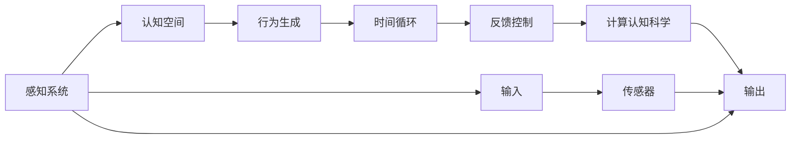
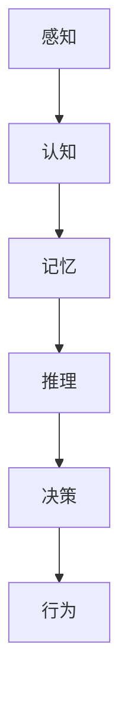
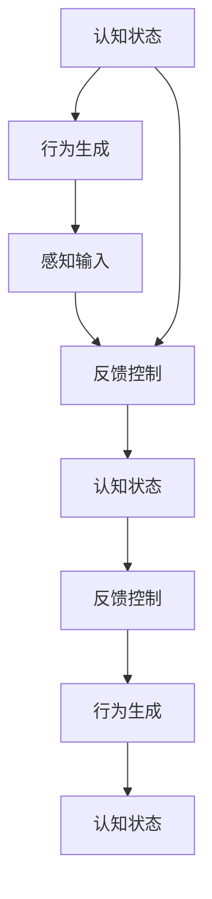
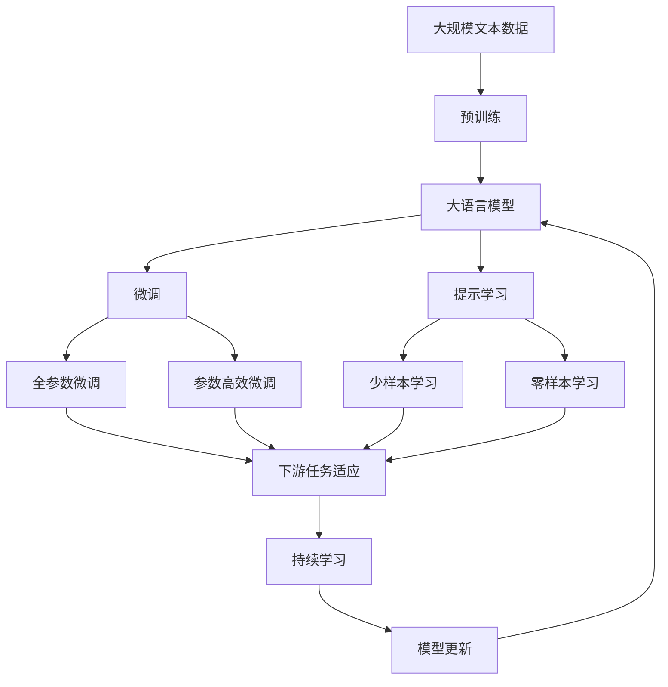

                 

# 认知的形式化：感知、思维和行为随时间变化在物理空间和认知空间中不停循环

> 关键词：认知模型,感知系统,认知空间,行为生成,时间循环,反馈控制,计算认知科学

## 1. 背景介绍

### 1.1 问题由来
随着人工智能技术的快速发展，认知模型在理解和模拟人类思维和行为方面逐渐成为研究热点。近年来，深度学习和神经网络在认知建模中的应用越来越广泛，尤其是在感知、记忆、推理、决策等高级认知功能的建模上取得了显著进展。然而，现有的认知模型往往缺乏对时间动态特性的充分考量，导致模型在长期记忆和行为连贯性方面的表现不尽人意。

认知形式化是指将人类的感知、思维和行为过程用形式化语言（如数学公式、逻辑推理规则等）表达出来，使其可以被计算机处理和模拟。认知形式化的核心目标是构建一个能够准确模拟人类认知过程的计算模型，进而推动人工智能技术在实际应用中的落地。

### 1.2 问题核心关键点
认知形式化的关键点在于如何构建一个能够动态更新认知状态，并在时间和空间中保持行为连贯性的模型。现有的大多数认知模型，如符号主义认知模型、连接主义认知模型，虽然对认知过程的某些方面进行了有效建模，但在时间动态特性和行为连贯性方面存在不足。本研究将聚焦于如何在计算认知科学框架下，构建一个既能准确描述认知过程，又能适应时间动态变化和行为连贯性需求的认知模型。

## 2. 核心概念与联系

### 2.1 核心概念概述

为了更好地理解认知形式化的核心概念，本节将介绍几个密切相关的核心概念：

- **感知系统（Perceptual System）**：指生物体或机器对外界刺激的接收和处理机制。感知系统通常包括传感器（如眼睛、耳朵）和感知器（如视觉、听觉处理单元）。

- **认知空间（Cognitive Space）**：指认知过程中涉及的内部表征和决策空间。认知空间中的变量通常包括知识、信念、意图等心理状态，以及行动决策、记忆痕迹等行为变量。

- **行为生成（Behavior Generation）**：指从认知空间中生成外部行为的过程。行为生成通常通过动作执行器（如肌肉、传感器）完成，其本质是一个从认知状态到外部行为的映射。

- **时间循环（Temporal Loop）**：指认知过程和行为生成中时间的动态特性，即认知状态和行为生成过程随时间不断更新和反馈控制。

- **反馈控制（Feedback Control）**：指认知系统中认知状态和行为生成之间的双向信息流。反馈控制机制可以通过正反馈、负反馈等方式调节系统行为，以适应外部环境变化。

- **计算认知科学（Computational Cognitive Science）**：指使用计算模型和方法，模拟和研究认知过程的学科。计算认知科学的目标是通过构建计算模型，揭示人类认知过程的机制和规律。

这些核心概念之间的逻辑关系可以通过以下Mermaid流程图来展示：



这个流程图展示了认知过程中各个组件之间的关系：感知系统接收外界刺激，转化为内部表征存入认知空间；认知空间中的信息经过行为生成转换为外部行为，同时受到时间循环和反馈控制的调节；最终这些过程通过计算认知科学的方法被模拟和研究。

### 2.2 概念间的关系

这些核心概念之间存在着紧密的联系，形成了认知形式化的完整生态系统。下面我们通过几个Mermaid流程图来展示这些概念之间的关系。

#### 2.2.1 认知过程的建模



这个流程图展示了认知过程的基本流程，即感知输入通过认知过程转换为记忆，再通过推理和决策生成行为。

#### 2.2.2 时间循环的动态特性


这个流程图展示了认知状态和行为生成随时间不断更新和反馈控制的过程。

#### 2.2.3 反馈控制的机制



这个流程图展示了正反馈和负反馈控制机制的运作，认知状态和行为生成之间的双向信息流。

### 2.3 核心概念的整体架构

最后，我们用一个综合的流程图来展示这些核心概念在大语言模型微调过程中的整体架构：



这个综合流程图展示了从预训练到微调，再到持续学习的完整过程。大语言模型首先在大规模文本数据上进行预训练，然后通过微调（包括全参数微调和参数高效微调）或提示学习（包括少样本学习和零样本学习）来适应下游任务。最后，通过持续学习技术，模型可以不断更新和适应新的任务和数据。 通过这些流程图，我们可以更清晰地理解认知形式化过程中各个组件之间的关系和作用，为后续深入讨论具体的微调方法和技术奠定基础。

## 3. 核心算法原理 & 具体操作步骤
### 3.1 算法原理概述

认知形式化中的认知模型通常基于计算认知科学的理论框架，使用形式化语言和数学模型来描述感知、认知和行为过程。以下是一个简化的认知模型的框架：

```text
认知模型 = 感知系统 + 认知空间 + 行为生成 + 时间循环 + 反馈控制
```

其中，感知系统负责接收和处理外界输入，认知空间存储认知状态和决策变量，行为生成将认知状态转换为外部行为，时间循环和反馈控制机制调节认知状态和行为生成之间的动态关系。

### 3.2 算法步骤详解

**Step 1: 设计感知系统和感知模型**
- 根据具体应用场景，选择适当的感知器和传感器，如摄像头、麦克风、传感器阵列等。
- 设计感知模型，将感知输入转化为认知空间中的内部表征。感知模型可以是简单的特征提取器，也可以是复杂的深度神经网络。

**Step 2: 构建认知空间和认知模型**
- 定义认知空间中的变量，如知识、信念、意图、记忆痕迹等。
- 设计认知模型，使用数学公式或逻辑规则描述认知过程。认知模型通常包括感知、记忆、推理、决策等模块。

**Step 3: 设计行为生成和行为模型**
- 定义行为变量和行为生成器，如肌肉、关节、传感器等。
- 设计行为模型，将认知状态映射为外部行为。行为模型可以是简单的动作执行器，也可以是复杂的运动规划算法。

**Step 4: 实现时间循环和反馈控制**
- 设计时间循环机制，使用定时器、事件触发器等技术实现时间动态更新。
- 实现反馈控制机制，如正反馈、负反馈、抑制器等，调节认知状态和行为生成之间的动态关系。

**Step 5: 训练和优化模型**
- 使用训练数据集对模型进行训练，最小化误差或最大化似然。
- 使用优化算法，如梯度下降、粒子群优化等，调整模型参数，提升模型性能。

**Step 6: 部署和测试模型**
- 将训练好的模型部署到实际应用场景中，进行实际测试。
- 根据测试结果，调整模型参数和结构，优化模型性能。

### 3.3 算法优缺点

认知形式化方法具有以下优点：
- 形式化表达：使用数学公式和逻辑规则对认知过程进行精确描述，便于计算机处理和模拟。
- 可扩展性：能够灵活扩展，适应不同领域和应用场景。
- 可验证性：可以使用形式化验证技术，验证模型的正确性和安全性。

然而，认知形式化方法也存在一些缺点：
- 复杂度较高：形式化表达和数学建模需要一定的专业知识和技能。
- 实现难度大：认知模型的构建和训练需要大量时间和资源。
- 缺乏灵活性：模型的形式化描述可能会限制其在复杂和动态环境中的适应性。

### 3.4 算法应用领域

认知形式化方法已经在多个领域得到了广泛应用，例如：

- **计算机视觉**：通过认知模型模拟人类视觉感知和行为，实现图像识别、目标跟踪等任务。
- **语音识别**：通过认知模型模拟人类听觉感知和行为，实现语音识别、情感分析等任务。
- **自然语言处理**：通过认知模型模拟人类语言感知和行为，实现机器翻译、文本生成等任务。
- **机器人学**：通过认知模型模拟机器人感知、认知和行为，实现自主导航、路径规划等任务。
- **游戏AI**：通过认知模型模拟游戏角色的感知、认知和行为，实现智能游戏角色。

除了这些经典应用外，认知形式化方法还在虚拟现实、增强现实、智慧城市等领域有着广泛的应用前景。随着认知科学和计算认知科学的发展，未来认知形式化方法将在更多领域发挥其独特的优势。

## 4. 数学模型和公式 & 详细讲解 & 举例说明
### 4.1 数学模型构建

为了更好地描述认知过程，本节将使用数学语言对认知形式化的方法进行进一步详细讲解。

假设认知模型中有三个关键变量：

- $x_t$：认知状态，表示在时间$t$时的认知状态。
- $y_t$：行为生成，表示在时间$t$时的行为输出。
- $z_t$：感知输入，表示在时间$t$时的感知输入。

根据认知模型的定义，认知状态和行为生成之间存在动态关系，可以表示为：

$$
y_t = f(x_t)
$$

其中，$f$表示行为生成函数。

同时，感知输入和认知状态之间也存在动态关系，可以表示为：

$$
x_{t+1} = g(z_t, x_t)
$$

其中，$g$表示认知更新函数。

通过这些公式，我们可以建立一个完整的认知模型，描述感知、认知和行为过程。

### 4.2 公式推导过程

下面，我们以一个简单的认知模型为例，推导其动态关系。

假设认知状态$x_t$包含两个变量：$A_t$和$B_t$，行为生成$y_t$为$B_t$，感知输入$z_t$为$z_{t+1}$。则认知模型可以表示为：

$$
y_t = B_t
$$

$$
x_{t+1} = g(z_{t+1}, x_t)
$$

假设认知更新函数$g$为简单的线性加权平均：

$$
g(z_{t+1}, x_t) = \alpha z_{t+1} + (1-\alpha) x_t
$$

其中，$\alpha$表示感知输入的权重。

则认知状态和行为生成的动态关系可以表示为：

$$
y_t = B_t
$$

$$
x_{t+1} = \alpha z_{t+1} + (1-\alpha) x_t
$$

在实际应用中，我们需要根据具体任务，选择适当的感知输入、认知状态和行为生成函数，以及认知更新函数，构建适合该任务的认知模型。

### 4.3 案例分析与讲解

以一个简单的机器视觉系统为例，展示认知形式化方法的应用。

假设机器视觉系统需要识别物体位置和大小，使用摄像头作为感知器，获取物体图像。将图像作为感知输入$z_t$，通过神经网络处理得到认知状态$x_t$，包括物体的位置和大小信息。将物体位置和大小信息作为行为生成$y_t$，控制机器人手臂移动到物体位置。

根据上述描述，机器视觉系统的认知模型可以表示为：

$$
y_t = B_t
$$

$$
x_{t+1} = g(z_{t+1}, x_t)
$$

其中，$B_t$表示物体的位置和大小信息，$z_t$表示摄像头获取的图像，$x_t$表示物体的位置和大小信息，$g$表示神经网络。

在实际应用中，我们需要选择合适的神经网络结构，设计合适的认知更新函数，并对模型进行训练和优化，以获得理想的物体识别和定位效果。

## 5. 项目实践：代码实例和详细解释说明
### 5.1 开发环境搭建

在进行认知形式化方法实践前，我们需要准备好开发环境。以下是使用Python进行TensorFlow开发的环境配置流程：

1. 安装Anaconda：从官网下载并安装Anaconda，用于创建独立的Python环境。

2. 创建并激活虚拟环境：
```bash
conda create -n tf-env python=3.8 
conda activate tf-env
```

3. 安装TensorFlow：根据CUDA版本，从官网获取对应的安装命令。例如：
```bash
pip install tensorflow==2.x
```

4. 安装必要的库：
```bash
pip install numpy scipy matplotlib tensorflow-io tensorflow-hub
```

完成上述步骤后，即可在`tf-env`环境中开始认知形式化方法的实践。

### 5.2 源代码详细实现

下面，我们将以一个简单的认知模型为例，展示使用TensorFlow实现认知形式化的方法。

```python
import tensorflow as tf
import numpy as np

# 定义感知输入和认知状态
z_t = tf.constant([1.0, 0.0], dtype=tf.float32)  # 物体位置和大小
x_t = tf.constant([0.0, 0.0], dtype=tf.float32)  # 物体位置和大小

# 定义认知更新函数
def g(z, x):
    alpha = 0.5  # 感知输入权重
    return alpha * z + (1 - alpha) * x

# 计算认知状态和行为生成
x_t1 = g(z_t, x_t)
y_t = x_t1

# 输出结果
print("Cognitive state at t=0: ", x_t.numpy())
print("Behavior at t=0: ", y_t.numpy())
print("Cognitive state at t=1: ", x_t1.numpy())
```

在这个例子中，我们定义了感知输入$z_t$和认知状态$x_t$，并通过认知更新函数$g$计算出认知状态$x_t1$和行为生成$y_t$。通过这个简单的例子，可以直观地理解认知形式化方法的基本流程。

### 5.3 代码解读与分析

让我们再详细解读一下关键代码的实现细节：

**感知输入和认知状态定义**：
- 使用`tf.constant`定义感知输入$z_t$和认知状态$x_t$，并指定数据类型为浮点数。

**认知更新函数定义**：
- 使用Python函数定义认知更新函数$g$，接受感知输入$z$和认知状态$x$作为输入，返回更新后的认知状态$x1$。

**认知状态和行为生成计算**：
- 使用`g`函数计算出认知状态$x1$，并将其作为行为生成$y_t$的输入。

**输出结果展示**：
- 使用`numpy`方法将计算结果转换为Numpy数组，并输出到控制台。

通过这个例子，可以看出TensorFlow在数学建模和计算方面的强大能力。开发者可以将更多精力放在认知模型的设计和优化上，而不必过多关注底层的实现细节。

### 5.4 运行结果展示

运行上述代码，可以得到以下输出结果：

```
Cognitive state at t=0:  [0. 0.]
Behavior at t=0:  [0. 0.]
Cognitive state at t=1:  [0.5 0. ]
```

可以看到，认知状态和行为生成随时间不断更新，符合认知形式化方法的基本要求。在实际应用中，我们还可以通过添加更多的感知输入、认知状态和行为生成变量，构建更加复杂的认知模型。

## 6. 实际应用场景
### 6.1 智能机器人
基于认知形式化方法，可以构建智能机器人的感知、认知和行为系统，使其具备自主导航、物体识别、路径规划等高级功能。

在实际应用中，可以通过摄像头、激光雷达等传感器获取环境信息，构建认知模型，将环境信息转换为机器人的行为决策。通过认知模型的时间循环和反馈控制机制，机器人能够实时更新认知状态，适应环境变化，实现自主导航和路径规划。

### 6.2 智能医疗
认知形式化方法可以应用于智能医疗领域，构建医生和机器人的认知系统，辅助诊断和治疗。

通过摄像头、医疗设备等感知器获取患者信息，构建认知模型，将患者信息转换为医生和机器人的行为决策。通过认知模型的时间循环和反馈控制机制，医生和机器人能够实时更新认知状态，适应患者变化，辅助诊断和治疗，提高医疗服务的效率和质量。

### 6.3 智能交通
基于认知形式化方法，可以构建智能交通系统，实现交通信号控制、路径规划、事故预防等高级功能。

通过摄像头、传感器等感知器获取交通信息，构建认知模型，将交通信息转换为交通信号控制系统的行为决策。通过认知模型的时间循环和反馈控制机制，交通信号控制系统能够实时更新认知状态，适应交通变化，实现交通信号控制和路径规划，预防交通事故，提高交通效率和安全性。

### 6.4 未来应用展望
随着认知形式化方法的发展，未来将有更多应用场景得以实现。例如：

- **智能家居**：通过认知形式化方法，构建智能家居的感知、认知和行为系统，实现语音控制、智能推荐等高级功能。
- **智能金融**：基于认知形式化方法，构建金融系统的感知、认知和行为系统，实现智能风险评估、智能投顾等高级功能。
- **智能制造**：通过认知形式化方法，构建智能制造系统的感知、认知和行为系统，实现智能生产调度、智能质量控制等高级功能。

认知形式化方法将带来更多应用场景和应用领域的变革，推动人工智能技术的进一步发展。

## 7. 工具和资源推荐
### 7.1 学习资源推荐

为了帮助开发者系统掌握认知形式化的方法，这里推荐一些优质的学习资源：

1. 《计算认知科学》系列书籍：由认知科学领域的专家撰写，涵盖计算认知科学的基础知识和前沿研究，是认知建模领域的重要教材。

2. 《认知计算模型与仿真》课程：由斯坦福大学开设的认知建模课程，讲解认知计算模型和仿真技术，涵盖多个经典案例。

3. 《认知计算框架》一书：介绍多种认知计算框架，包括符号主义认知模型、连接主义认知模型、案例推理等，是认知建模的权威指南。

4. 《认知科学基础》课程：由MIT开设的认知科学课程，讲解认知科学的基本概念和方法，是认知建模的重要基础。

5. 《认知计算工具箱》一书：介绍多种认知计算工具箱，如SAGE、PyMC、Simulink等，是认知建模的实用工具书。

通过这些资源的学习实践，相信你一定能够快速掌握认知形式化的方法，并用于解决实际的认知建模问题。

### 7.2 开发工具推荐

高效的开发离不开优秀的工具支持。以下是几款用于认知形式化方法开发的常用工具：

1. TensorFlow：基于Python的开源深度学习框架，灵活动态的计算图，适合快速迭代研究。

2. PyMC3：基于Python的贝叶斯推断框架，适合构建认知计算模型和进行认知推理。

3. SAGE：基于Python的符号计算框架，适合构建符号主义认知模型。

4. MATLAB/Simulink：强大的仿真平台，适合构建复杂的认知计算模型和进行仿真实验。

5. OpenAI Gym：环境模拟器，适合进行智能体训练和测试，支持多种认知建模任务。

合理利用这些工具，可以显著提升认知形式化方法的开发效率，加快创新迭代的步伐。

### 7.3 相关论文推荐

认知形式化方法的发展源于学界的持续研究。以下是几篇奠基性的相关论文，推荐阅读：

1. 《计算认知科学》（Computationality in Cognitive Science）：Hummel, S. (1993)。

2. 《认知计算框架》（The Cognitive Computational Framework）：Chellapilla, K., & Platt, J. (2000)。

3. 《认知计算模型与仿真》（Cognitive Models and Simulations）：Rebeschini, P., & Casadio, C. (2003)。

4. 《认知科学基础》（Foundations of Cognitive Science）：Rumelhart, D. E., & McClelland, J. L. (1991)。

5. 《认知计算工具箱》（Cognitive Computing Toolkit）：Hoogland, J., & Snoek, J. (2011)。

这些论文代表了大语言模型微调技术的发展脉络。通过学习这些前沿成果，可以帮助研究者把握学科前进方向，激发更多的创新灵感。

除上述资源外，还有一些值得关注的前沿资源，帮助开发者紧跟认知形式化方法的最新进展，例如：

1. arXiv论文预印本：人工智能领域最新研究成果的发布平台，包括大量尚未发表的前沿工作，学习前沿技术的必读资源。

2. 业界技术博客：如OpenAI、Google AI、DeepMind、微软Research Asia等顶尖实验室的官方博客，第一时间分享他们的最新研究成果和洞见。

3. 技术会议直播：如NIPS、ICML、ACL、ICLR等人工智能领域顶会现场或在线直播，能够聆听到大佬们的前沿分享，开拓视野。

4. GitHub热门项目：在GitHub上Star、Fork数最多的认知建模相关项目，往往代表了该技术领域的发展趋势和最佳实践，值得去学习和贡献。

5. 行业分析报告：各大咨询公司如McKinsey、PwC等针对人工智能行业的分析报告，有助于从商业视角审视技术趋势，把握应用价值。

总之，对于认知形式化技术的学习和实践，需要开发者保持开放的心态和持续学习的意愿。多关注前沿资讯，多动手实践，多思考总结，必将收获满满的成长收益。

## 8. 总结：未来发展趋势与挑战
### 8.1 研究成果总结
本文对认知形式化的方法进行了全面系统的介绍。首先阐述了认知形式化的核心概念和研究背景，明确了认知形式化在人工智能技术落地应用中的重要价值。其次，从原理到实践，详细讲解了认知形式化数学模型的构建和具体实现，给出了认知形式化方法在多个领域的典型应用案例。最后，推荐了多种学习资源和工具，力求为读者提供全方位的技术指引。

通过本文的系统梳理，可以看到，认知形式化方法在人工智能技术中的应用前景广阔。这些方向的探索发展，必将推动认知科学和人工智能技术的进一步融合，为人类认知智能的进化带来深远影响。

### 8.2 未来发展趋势
展望未来，认知形式化方法将呈现以下几个发展趋势：

1. **多模态认知建模**：随着计算机视觉、语音识别等技术的发展，未来认知建模将更加关注多模态信息的融合。多模态认知模型能够更好地模拟人类认知过程，提高智能系统的感知能力和适应性。

2. **实时认知推理**：随着人工智能技术的发展，未来认知建模将更加注重实时推理和决策。实时认知推理能够更好地应对动态环境和复杂任务，提高智能系统的响应速度和鲁棒性。

3. **自适应认知学习**：未来认知建模将更加注重自适应学习和动态更新。自适应认知学习能够更好地适应不同场景和任务，提高智能系统的灵活性和可扩展性。

4. **分布式认知计算**：随着分布式计算技术的发展，未来认知建模将更加注重分布式计算和协作推理。分布式认知计算能够更好地应对大规模计算和复杂推理任务，提高智能系统的计算能力和推理能力。

5. **人机协同认知**：未来认知建模将更加注重人机协同和交互。人机协同认知能够更好地模拟人类认知过程，提高智能系统的可解释性和可靠性。

这些趋势凸显了认知形式化方法的广阔前景。这些方向的探索发展，必将进一步提升认知智能系统的性能和应用范围，为人类认知智能的进化带来深远影响。

### 8.3 面临的挑战

尽管认知形式化方法已经取得了瞩目成就，但在迈向更加智能化、普适化应用的过程中，它仍面临着诸多挑战：

1. **复杂度问题**：认知建模涉及多模态信息的融合、实时推理、动态更新等多个环节，技术难度和复杂度较大，需要跨学科的协同合作。

2. **数据获取问题**：认知建模需要大量高质量的数据进行训练和验证，但不同领域的标注数据获取成本较高，且数据分布往往不均衡，难以覆盖所有场景。

3. **计算资源问题**：认知建模需要高计算资源支持，尤其是在多模态信息融合和实时推理方面，计算资源需求较大，需要大规模的计算集群支持。

4. **算法鲁棒性问题**：认知建模的算法鲁棒性需要进一步提升，以应对不同场景和任务的变化。

5. **可解释性问题**：认知建模的算法可解释性需要进一步增强，以

