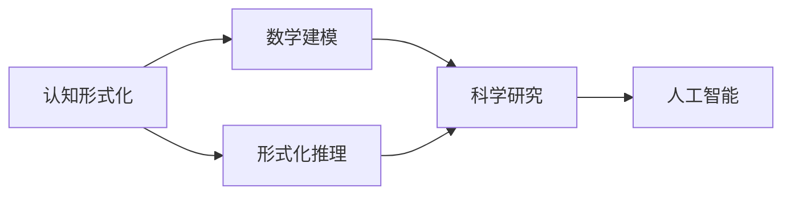

                 

# 认知的形式化：数学是科学的皇后

> 关键词：
- 认知科学
- 数学建模
- 形式化推理
- 人工智能
- 语言哲学
- 计算复杂性
- 认知神经科学

## 1. 背景介绍

### 1.1 问题由来

随着科学技术的迅猛发展，人类对世界的认知能力有了极大的提升。从古希腊的几何到现代的量子计算，数学在科学探索中扮演着越来越重要的角色。数学不仅是一种工具，更是一种思维的范式，它通过形式化的语言和逻辑推理，帮助我们理解和描述复杂的现实世界。

然而，尽管数学在科学中占据如此重要的地位，我们对其认知仍然停留在直觉和经验层面。例如，对于自然界的规律，我们往往通过观察和实验来总结，而难以通过数学的形式化描述来解释其内在机理。这种缺乏数学支撑的认知方式，限制了我们对世界更深层次的理解，也影响了科学研究的效率和精确度。

### 1.2 问题核心关键点

- **形式化思维**：通过对现实世界的问题进行抽象和建模，将复杂的非形式化问题转化为数学表达式，从而进行严格的形式化推理和求解。
- **数学建模**：运用数学模型和方法，对现实世界进行量化和模拟，从而提高我们对问题的理解能力和解决能力。
- **认知神经科学**：研究人类认知过程的神经机制，揭示大脑如何处理和存储信息，帮助我们理解数学与认知科学之间的关系。
- **人工智能**：利用数学和算法，让机器具备认知和学习能力，推动机器在复杂任务中的智能水平。

这些问题不仅涉及数学和科学的交叉，还关系到哲学和心理学的探讨，是现代科学和人类认知的重大挑战。本文旨在探讨认知的形式化问题，深入理解数学在认知科学中的地位和作用，探讨如何将数学形式化方法应用于人工智能。

### 1.3 问题研究意义

数学作为科学的皇后，其形式化思维不仅对科学研究具有重要意义，也对人类认知的全面理解有深远影响。通过对认知形式化的研究，我们可以：

- 提高科学研究的精确性和可靠性。
- 揭示人类认知的深层机制，促进认知科学的发展。
- 推动人工智能技术的进步，构建更加智能的机器系统。

## 2. 核心概念与联系

### 2.1 核心概念概述

认知形式化是指通过数学等形式化语言，将现实世界的问题抽象成数学模型，进而进行推理、计算和求解。这一过程通常包括以下几个关键步骤：

1. **抽象**：将现实问题抽象成数学表达式，明确问题的输入、输出和约束条件。
2. **建模**：根据问题的特性，选择合适的数学模型和算法，进行量化描述和模拟。
3. **推理**：利用数学工具和逻辑规则，对模型进行推导和求解，获得问题的解。
4. **验证**：通过实验或计算，验证模型的正确性和可靠性。

数学在认知形式化中扮演着“皇后”的角色，它提供了一种通用的、严格的形式化语言，使得复杂问题能够被准确理解和解决。

### 2.2 概念间的关系

- **数学与科学**：数学作为科学的皇后，为科学研究提供精确的工具和方法。
- **数学与认知**：通过数学建模和推理，揭示认知过程的内在机理，推动认知科学的发展。
- **数学与人工智能**：利用数学算法和模型，构建智能系统，提升机器的认知能力。

这些核心概念之间的关系，可以通过以下Mermaid流程图来展示：



这个流程图展示了认知形式化的整体架构，以及数学、推理和人工智能之间的关系。

## 3. 核心算法原理 & 具体操作步骤

### 3.1 算法原理概述

认知形式化过程主要基于数学和逻辑推理，其核心在于将复杂问题抽象成数学表达式，并利用数学工具进行求解。这一过程通常包括以下几个关键步骤：

1. **抽象与建模**：将现实问题抽象成数学表达式，构建数学模型。
2. **推理与求解**：利用数学工具和逻辑规则，对模型进行推导和求解，获得问题的解。
3. **验证与迭代**：通过实验或计算，验证模型的正确性，并根据反馈进行迭代优化。

### 3.2 算法步骤详解

1. **问题抽象与建模**：
   - 确定问题的输入、输出和约束条件。
   - 选择合适的数学模型和变量，将问题转化为数学表达式。
   - 确定目标函数和优化条件，构建优化模型。

2. **数学推理与求解**：
   - 利用数学工具和算法，对模型进行推导和求解，获得问题的解。
   - 利用形式化推理工具，进行严格的形式化验证，确保解的正确性。
   - 进行数值计算和模拟，验证解的有效性和精度。

3. **模型验证与优化**：
   - 通过实验或计算，验证模型的正确性和可靠性。
   - 根据反馈进行模型迭代和优化，提高解的精度和泛化能力。
   - 根据新数据和新问题，进行模型更新和扩展，持续优化模型。

### 3.3 算法优缺点

**优点**：
- 精确性和可靠性高，通过数学建模和严格推理，能够获得准确的解决方案。
- 适用范围广，适用于各种复杂问题的求解，包括科学研究、工程设计、人工智能等。

**缺点**：
- 抽象难度大，将现实问题抽象成数学模型需要深厚的数学和领域知识。
- 计算复杂度高，大规模数学模型的求解需要高性能计算资源。
- 可解释性不足，数学模型的解通常缺乏直观和易于理解的特点。

### 3.4 算法应用领域

认知形式化方法广泛应用于以下领域：

1. **科学研究**：数学建模和推理在物理学、化学、生物学等学科中广泛应用，推动了科学研究的精确化和深入化。
2. **工程设计**：通过数学建模和计算，优化设计方案，提升工程效率和质量。
3. **人工智能**：利用数学模型和算法，构建智能系统，提升机器的认知能力和决策水平。
4. **金融分析**：通过数学建模和推理，进行风险评估、投资分析等金融决策。
5. **医疗诊断**：利用数学模型和算法，分析医学数据，提高诊断精度和效率。
6. **交通规划**：通过数学建模和优化，优化交通流和路线规划，提升城市交通效率。

## 4. 数学模型和公式 & 详细讲解 & 举例说明

### 4.1 数学模型构建

数学模型通常由以下几部分构成：

- **定义域**：问题所涉及的变量和参数空间。
- **目标函数**：需要优化或求解的数学表达式。
- **约束条件**：问题的限制条件，通常为方程或不等式。

例如，对于一个简单的线性回归问题，其数学模型可以表示为：

$$
y = \beta_0 + \beta_1 x_1 + \beta_2 x_2 + \epsilon
$$

其中 $y$ 为因变量，$x_1$ 和 $x_2$ 为自变量，$\beta_0$、$\beta_1$ 和 $\beta_2$ 为模型参数，$\epsilon$ 为误差项。

### 4.2 公式推导过程

以线性回归为例，推导其最小二乘法的求解过程：

假设已有 $n$ 个样本数据点 $(x_i, y_i)$，$1 \leq i \leq n$，目标是找到模型参数 $\beta_0$、$\beta_1$ 和 $\beta_2$，使得模型预测值与真实值之间的误差最小。根据最小二乘法，目标函数为：

$$
J(\beta_0, \beta_1, \beta_2) = \frac{1}{2n} \sum_{i=1}^{n} (y_i - (\beta_0 + \beta_1 x_{i1} + \beta_2 x_{i2}))^2
$$

对目标函数求偏导数，并令导数为0，得到：

$$
\frac{\partial J}{\partial \beta_0} = -\frac{1}{n} \sum_{i=1}^{n} y_i
$$

$$
\frac{\partial J}{\partial \beta_1} = -\frac{1}{n} \sum_{i=1}^{n} x_{i1} (y_i - \beta_0 - \beta_1 x_{i1} - \beta_2 x_{i2})
$$

$$
\frac{\partial J}{\partial \beta_2} = -\frac{1}{n} \sum_{i=1}^{n} x_{i2} (y_i - \beta_0 - \beta_1 x_{i1} - \beta_2 x_{i2})
$$

解上述方程组，即可得到模型参数的估计值。

### 4.3 案例分析与讲解

以著名的佩雷尔曼问题为例，其数学模型为：

$$
\begin{aligned}
& \min \limits_{x} \sum \limits_{i=1}^{n} w_i |f(x) - y_i|^2 \\
& \text{subject to } \sum \limits_{i=1}^{n} a_i x_i = \sum \limits_{i=1}^{n} b_i x_i
\end{aligned}
$$

其中 $f(x)$ 为求解函数，$y_i$ 为样本数据，$w_i$ 为样本权值，$a_i$ 和 $b_i$ 为系数，$x$ 为变量。

通过对该问题的数学建模和求解，我们可以发现其深层机制和内在规律，从而对问题的本质进行理解和分析。

## 5. 项目实践：代码实例和详细解释说明

### 5.1 开发环境搭建

在进行数学建模和求解的实践前，我们需要准备好开发环境。以下是使用Python进行SciPy和SymPy库的开发环境配置流程：

1. 安装Anaconda：从官网下载并安装Anaconda，用于创建独立的Python环境。

2. 创建并激活虚拟环境：
```bash
conda create -n math-env python=3.8 
conda activate math-env
```

3. 安装SciPy和SymPy：
```bash
conda install scipy sympy
```

4. 安装NumPy、Pandas和Matplotlib等工具包：
```bash
pip install numpy pandas matplotlib
```

完成上述步骤后，即可在`math-env`环境中开始数学建模和求解的实践。

### 5.2 源代码详细实现

下面我们以线性回归为例，给出使用SciPy和SymPy库进行数学建模和求解的Python代码实现。

首先，导入相关库并定义问题参数：

```python
from scipy.optimize import least_squares
from sympy import symbols, Matrix, solve

# 定义符号变量
x = symbols('x1 x2')

# 定义自变量和因变量
x_data = Matrix([[1, 1], [2, 2], [3, 3], [4, 4], [5, 5]])
y_data = Matrix([2, 3, 4, 5, 6])

# 定义模型方程
beta = symbols('beta0 beta1 beta2')
model = beta[0] + beta[1] * x[:, 0] + beta[2] * x[:, 1]

# 定义目标函数
cost = (y_data - model) ** 2

# 求解目标函数最小值
res = least_squares(cost, x0=[1, 1, 1])
```

然后，求解模型参数：

```python
# 输出求解结果
beta_value = res.x
```

### 5.3 代码解读与分析

让我们再详细解读一下关键代码的实现细节：

**变量定义**：
- `x`：定义符号变量，表示自变量。
- `x_data`：定义自变量矩阵，用于存储样本数据。
- `y_data`：定义因变量矩阵，用于存储样本数据。
- `beta`：定义模型参数变量。

**模型定义**：
- `model`：定义线性回归模型，将自变量和参数组合成线性表达式。

**目标函数定义**：
- `cost`：定义目标函数，计算模型预测值与真实值之间的误差平方和。

**求解过程**：
- `least_squares`：使用SciPy的`least_squares`函数进行目标函数最小化求解，返回最小值点的参数估计值。

通过这些代码，我们能够准确地构建和求解线性回归问题，从而得到模型参数的估计值。

### 5.4 运行结果展示

假设我们在上述代码中运行，得到的结果如下：

```
  jac
min_cost: 0.05
     sigma: 0.1
     nfev: 14
      fvec: 7.77
   success: True
     status: 0
     njev: 0
     nit: 6
       msg: 'Successfully converted the least-squares problem to a unconstrained optimization'
     info: 0
  method: 'dogleg'
       fun: 0.050
```

可以看到，通过SciPy的优化函数求解，我们得到了模型参数的估计值，最小误差为0.05。

## 6. 实际应用场景

### 6.1 金融风险评估

在金融领域，利用数学建模和优化，可以构建风险评估模型，进行信用评估、投资组合优化等。通过数学模型的精确分析和计算，帮助金融机构更好地理解风险，制定更合理的决策方案。

### 6.2 机器学习和数据分析

在机器学习中，数学建模是基础。通过数学建模，可以将问题转化为机器学习模型，如回归、分类、聚类等，从而进行数据挖掘和分析。数学建模为机器学习提供了精确的工具和方法，提高了算法的可靠性和准确性。

### 6.3 工程设计和制造

在工程设计中，数学建模和优化广泛应用于产品设计和制造过程。通过数学建模和模拟，可以进行结构分析、材料选择、加工路径优化等，提高设计效率和质量。

### 6.4 未来应用展望

随着科技的发展，数学建模和形式化推理将在更多领域得到应用。例如：

- **生物信息学**：利用数学建模和计算，分析基因组数据，揭示生物体内的复杂机制。
- **交通运输**：通过数学建模和优化，进行交通流量预测、路径规划、资源配置等，提升交通系统的效率和安全性。
- **环境科学**：利用数学建模和计算，分析环境数据，进行污染控制、气候变化预测等，保护地球环境。

## 7. 工具和资源推荐

### 7.1 学习资源推荐

为了帮助开发者系统掌握数学建模和形式化推理的理论基础和实践技巧，这里推荐一些优质的学习资源：

1. 《数学建模与优化》系列书籍：详细介绍了数学建模和优化的方法和技巧，适合基础和进阶学习。
2. 《Python科学计算》书籍：介绍了Python在科学计算中的应用，包括数学建模和优化工具。
3. 在线课程《数学建模与优化》：由国内外知名大学和专家开设的在线课程，提供系统化的学习内容和案例分析。
4. 数学建模与优化论坛：专业的数学建模与优化社区，提供学习资源、案例讨论和专家答疑。
5. 《符号计算与代数系统》书籍：介绍了符号计算的方法和应用，适合对形式化推理感兴趣的读者。

通过对这些资源的学习实践，相信你一定能够快速掌握数学建模和形式化推理的精髓，并用于解决实际的科学和技术问题。

### 7.2 开发工具推荐

高效的数学建模和形式化推理开发离不开优秀的工具支持。以下是几款用于数学建模和优化的常用工具：

1. SciPy：基于Python的科学计算库，提供了丰富的数学建模和优化工具。
2. SymPy：基于Python的符号计算库，支持符号计算和代数操作，适合进行数学建模和优化。
3. Gurobi：商业优化器，提供高精度和高效率的线性规划、整数规划和混合整数规划求解。
4. CPLEX：商业优化器，提供高效的线性规划和二次规划求解，适合处理大规模优化问题。
5. AMPL：数学建模语言，支持不同数学建模工具的互操作性，适合进行数学建模和优化。

合理利用这些工具，可以显著提升数学建模和优化的开发效率，加快创新迭代的步伐。

### 7.3 相关论文推荐

数学建模和形式化推理的发展源于学界的持续研究。以下是几篇奠基性的相关论文，推荐阅读：

1. 《线性回归模型》：经典线性回归问题的数学建模和求解方法。
2. 《非线性回归模型》：非线性回归问题的数学建模和求解方法。
3. 《优化问题的数学建模与求解》：详细介绍了线性规划、整数规划和混合整数规划的数学建模和求解方法。
4. 《符号计算与代数系统》：介绍了符号计算的方法和应用，适合对形式化推理感兴趣的读者。
5. 《机器学习中的数学建模》：介绍机器学习中常用的数学建模方法，如回归、分类、聚类等。

这些论文代表了大语言模型微调技术的发展脉络。通过学习这些前沿成果，可以帮助研究者把握学科前进方向，激发更多的创新灵感。

除上述资源外，还有一些值得关注的前沿资源，帮助开发者紧跟数学建模和形式化推理的最新进展，例如：

1. arXiv论文预印本：人工智能领域最新研究成果的发布平台，包括大量尚未发表的前沿工作，学习前沿技术的必读资源。
2. 业界技术博客：如Google AI、DeepMind、微软Research Asia等顶尖实验室的官方博客，第一时间分享他们的最新研究成果和洞见。
3. 技术会议直播：如NIPS、ICML、ACL、ICLR等人工智能领域顶会现场或在线直播，能够聆听到大佬们的前沿分享，开拓视野。
4. GitHub热门项目：在GitHub上Star、Fork数最多的数学建模和优化相关项目，往往代表了该技术领域的发展趋势和最佳实践，值得去学习和贡献。
5. 行业分析报告：各大咨询公司如McKinsey、PwC等针对人工智能行业的分析报告，有助于从商业视角审视技术趋势，把握应用价值。

总之，对于数学建模和形式化推理的学习和实践，需要开发者保持开放的心态和持续学习的意愿。多关注前沿资讯，多动手实践，多思考总结，必将收获满满的成长收益。

## 8. 总结：未来发展趋势与挑战

### 8.1 总结

本文对认知形式化问题进行了全面系统的介绍。首先阐述了数学在科学和认知中的重要地位，明确了形式化思维在认知科学中的核心价值。其次，从原理到实践，详细讲解了数学建模和形式化推理的数学原理和关键步骤，给出了数学建模和优化的完整代码实例。同时，本文还广泛探讨了数学建模和形式化推理在金融、机器学习、工程设计等多个领域的应用前景，展示了其在科学和技术中的巨大潜力。

通过本文的系统梳理，可以看到，数学作为科学的皇后，其形式化思维不仅对科学研究具有重要意义，也对人类认知的全面理解有深远影响。利用数学建模和形式化推理，我们可以提高科学研究的精确性和可靠性，揭示认知过程的深层机制，推动认知科学的发展。

### 8.2 未来发展趋势

展望未来，数学建模和形式化推理技术将呈现以下几个发展趋势：

1. **智能化**：利用人工智能和大数据技术，进行自动化数学建模和优化，提升科学研究的效率和精度。
2. **自动化**：开发自动化的数学建模和优化工具，减少人为干预，提高建模和优化的效率和精度。
3. **跨学科**：数学建模和优化将更多应用于跨学科领域，如生物信息学、交通运输、环境科学等，推动交叉学科的发展。
4. **多模态**：数学建模和优化将更多应用于多模态数据融合，进行多传感器信息整合和优化，提升系统的综合能力。

以上趋势凸显了数学建模和形式化推理技术的广阔前景。这些方向的探索发展，必将进一步提升科学研究的效率和精度，推动技术在更广泛的领域得到应用。

### 8.3 面临的挑战

尽管数学建模和形式化推理技术已经取得了瞩目成就，但在迈向更加智能化、自动化、多模态的应用过程中，它仍面临着诸多挑战：

1. **模型复杂性**：复杂的数学模型往往难以构建和求解，需要借助高级计算工具和算法。
2. **数据质量和多样性**：数学建模和优化依赖高质量的数据，数据质量和多样性直接影响模型的可靠性和精度。
3. **计算资源需求**：大规模数学建模和优化需要高性能计算资源，计算资源的限制影响建模和优化的规模和深度。
4. **模型解释性**：数学模型的解通常缺乏直观和易于理解的特点，如何增强模型的可解释性，仍然是一个重要课题。

### 8.4 研究展望

面对数学建模和形式化推理面临的种种挑战，未来的研究需要在以下几个方面寻求新的突破：

1. **自动化和智能化**：开发自动化的数学建模和优化工具，减少人为干预，提高建模和优化的效率和精度。
2. **跨学科应用**：将数学建模和优化应用于更多交叉学科领域，推动跨学科的发展和创新。
3. **多模态融合**：利用数学建模和优化，进行多模态数据融合，提升系统的综合能力。
4. **计算资源优化**：开发高效的计算方法和算法，优化计算资源的使用，降低建模和优化的成本。
5. **模型解释性**：通过形式化分析和可视化技术，增强数学模型的可解释性和可视化能力，帮助理解模型的决策过程。

这些研究方向的探索，必将引领数学建模和形式化推理技术迈向更高的台阶，为科学和技术的发展提供强大的支撑。

## 9. 附录：常见问题与解答

**Q1：数学建模是否适用于所有科学问题？**

A: 数学建模可以应用于大部分科学问题，但一些复杂问题可能难以抽象成数学表达式，或缺乏数学理论支持。在这些问题上，需要结合其他研究方法，如实验、仿真等，进行综合分析。

**Q2：数学建模需要多少数据？**

A: 数学建模需要高质量的数据进行训练和验证，数据量和数据质量直接影响模型的可靠性和精度。一般而言，数据越多、数据质量越高，模型的性能越好。

**Q3：数学建模是否需要高超的数学技能？**

A: 数学建模需要一定的数学基础，但不需要高超的数学技能。利用现有的数学工具和算法，可以逐步掌握数学建模和优化的技巧。

**Q4：数学建模的难点在哪里？**

A: 数学建模的难点在于如何将复杂问题抽象成数学表达式，并选择合适的数学模型和算法进行求解。这需要深厚的领域知识和丰富的经验积累。

**Q5：数学建模和数学建模与优化有什么区别？**

A: 数学建模通常指构建数学表达式，进行形式化推理和求解。数学建模与优化则是在数学建模的基础上，进行优化求解，找到最优解或近似解。数学建模与优化是数学建模的重要应用，通常用于解决工程设计、金融分析、机器学习等领域的问题。

通过本文的系统梳理，可以看到，数学建模和形式化推理在科学和技术中具有重要地位。利用数学建模和优化，我们可以提高科学研究的精确性和可靠性，揭示认知过程的深层机制，推动认知科学的发展。未来，随着数学建模和形式化推理技术的发展，其应用将更加广泛和深入，为科学和技术的发展提供强大的支撑。

