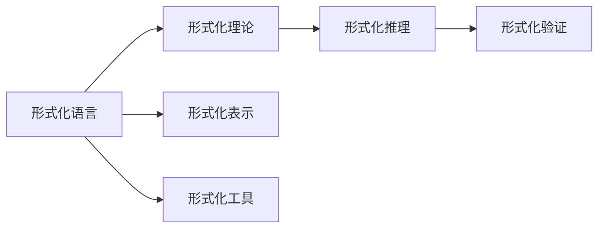
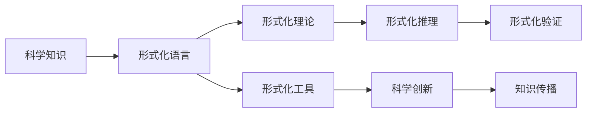

                 

# 认知的形式化：科学的各个学科都有自己的专业语言，但自然语言是所有专业语言的元语言

## 1. 背景介绍

### 1.1 问题由来
在当今信息时代，科学技术的进步离不开知识的传播和交流。然而，尽管科学领域已经发展出各种专业术语和符号，但不同学科之间仍存在语言障碍，难以实现有效的沟通。例如，物理学中的“Einstein”方程与生物学中的“Genome”概念，似乎完全属于不同的世界，让人难以跨越。

认知形式化（Cognitive Formalization）的提出，正是为了解决这一问题。通过形式化的方法，将科学知识以数学符号和逻辑推理的方式表示出来，可以在不同学科之间建立起桥梁，促进知识的共享和创新。

### 1.2 问题核心关键点
认知形式化旨在通过形式化语言，将复杂的科学知识以逻辑严谨、结构清晰的方式表达出来。其主要目标是：
- 消除学科间沟通障碍，促进科学知识的无缝对接。
- 提升科学研究的逻辑严密性和可重复性。
- 加速科学发现的传播与验证。

形式化语言的核心特征包括：
- 语义清晰：形式化语言以符号和公理为基础，每个符号都有明确的意义和规则，易于理解。
- 逻辑严密：通过形式化推理，能够确保每一步推导都是正确的，避免逻辑谬误。
- 普适性强：形式化语言适用于任何科学学科，不受具体应用领域限制。

## 2. 核心概念与联系

### 2.1 核心概念概述

为更好地理解认知形式化的核心概念，本节将介绍几个密切相关的核心概念：

- 形式化语言（Formal Language）：使用符号和规则表达的严谨语言，如数学符号、逻辑符号等。形式化语言具有严格的语义和逻辑规则，使得其表达和推理过程透明、可靠。
- 形式化理论（Formal Theory）：基于形式化语言构建的理论体系，如集合论、逻辑学、递归理论等。形式化理论通过符号推导，抽象出数学结构，有助于发现科学规律。
- 形式化推理（Formal Reasoning）：以形式化语言为基础，通过公理、定理和推论进行严格推理的过程。形式化推理确保了推导的严谨性和可靠性。
- 形式化验证（Formal Verification）：使用形式化方法对软件、系统等进行验证，确保其正确性和安全性。形式化验证广泛应用于航空航天、金融安全等领域。

这些核心概念共同构成了认知形式化的基础，为不同学科间的知识交流和科学创新提供了有力支持。

### 2.2 概念间的关系

这些核心概念之间存在着紧密的联系，形成了认知形式化的完整生态系统。我们可以用以下Mermaid流程图来展示它们之间的关系：



这个流程图展示了形式化语言、形式化理论、形式化推理和形式化验证之间的逻辑关系：

1. 形式化语言是形式化理论的基础，提供了表达科学知识的工具。
2. 形式化理论基于形式化语言，通过公理化体系构建，揭示科学规律。
3. 形式化推理利用形式化语言和理论，进行严格推导，确保推导的正确性。
4. 形式化验证通过形式化推理，对系统进行验证，确保其安全性。

形式化语言与形式化工具之间的关系更加紧密，通过工具的辅助，能够更加高效地实现形式化表达和推理。

### 2.3 核心概念的整体架构

最后，我们用一个综合的流程图来展示这些核心概念在大规模知识交流和科学创新中的作用：



这个综合流程图展示了形式化语言、形式化理论、形式化推理和形式化验证在大规模知识交流和科学创新中的作用：

1. 科学知识通过形式化语言进行表达，转化为形式化理论。
2. 形式化理论通过形式化推理，揭示科学规律。
3. 形式化验证通过形式化推理，确保系统的正确性。
4. 科学创新通过形式化工具，实现高效的推理和验证。
5. 知识传播通过形式化表达和验证，保障知识的准确性。

这些概念共同构成了认知形式化的完整架构，为科学创新和知识传播提供了有力的支持。

## 3. 核心算法原理 & 具体操作步骤
### 3.1 算法原理概述

认知形式化的核心算法原理基于形式化语言和逻辑推理。其主要目标是通过形式化表示和推理，消除学科间的语言障碍，促进科学知识的传播和创新。

形式化语言通常包含一组符号和规则，符号和符号之间的关系通过公理和推论来定义。例如，在数学中，基本符号包括数字、运算符、等号等，通过公理和定理进行推理，得出新的结论。

形式化推理通常基于形式化语言和理论，通过符号和公理进行严格推导。例如，在数理逻辑中，使用布尔代数、命题逻辑等公理化体系，进行严格推理，得出正确的结论。

### 3.2 算法步骤详解

认知形式化的具体算法步骤包括：

1. 选择形式化语言：根据应用领域，选择合适的形式化语言。例如，在计算机科学中，使用布尔代数、集合论、递归理论等。
2. 定义符号和公理：确定形式化语言中的基本符号和公理，确保每个符号都有明确的意义和规则。
3. 构建形式化理论：通过符号和公理，构建形式化理论体系，揭示科学规律。
4. 进行形式化推理：利用形式化语言和理论，进行严格推导，得出新的结论。
5. 进行形式化验证：通过形式化推理，对系统进行验证，确保其正确性。

### 3.3 算法优缺点

认知形式化具有以下优点：
- 消除学科间沟通障碍：通过形式化语言，不同学科的科学知识可以无障碍地交流和传播。
- 提升科学研究的逻辑严密性：形式化推理确保了每一步推导的正确性，避免逻辑谬误。
- 加速科学发现的传播与验证：通过形式化验证，可以迅速发现和纠正错误，加快科学发现的验证过程。

同时，形式化语言也存在一些局限性：
- 表达复杂性：形式化语言通常较为抽象，对初学者难以理解和应用。
- 学习成本高：形式化推理需要严格的逻辑训练，学习成本较高。
- 应用场景受限：形式化语言适用于数学、逻辑等抽象学科，对于经验类、人文类等学科可能不太适用。

### 3.4 算法应用领域

认知形式化已在多个领域得到了广泛应用，例如：

- 计算机科学：使用形式化语言和理论，进行程序验证、逻辑推理、安全保障等。
- 数学和逻辑学：通过形式化推理，揭示数学规律，进行严格证明。
- 物理学和工程学：使用形式化语言和验证方法，进行物理模型验证、系统设计等。
- 法律和逻辑学：在法律条文和逻辑推理中，使用形式化方法，确保其严谨性和正确性。
- 人工智能：通过形式化表达和推理，进行知识表示、逻辑推理、决策支持等。

## 4. 数学模型和公式 & 详细讲解 & 举例说明
### 4.1 数学模型构建

认知形式化的数学模型通常基于形式化语言和理论，通过符号和公理进行表达和推导。以下以数学逻辑为例，展示数学模型的构建过程。

在数学逻辑中，最基本的符号包括：
- 命题符号：如 $p, q, r$ 等，表示命题。
- 逻辑符号：如 $\land$（且）、$\lor$（或）、$\lnot$（非）等，表示逻辑运算。
- 等号符号：如 $=$，表示相等关系。

形式化理论通常由以下几部分构成：
- 公理：基本、不可证的命题，如逻辑公理、算术公理等。
- 推理规则：用于推导新命题的规则，如逻辑推理规则、数学推理规则等。
- 定理：由公理和推理规则推导出的命题，如等价性定理、传递性定理等。

### 4.2 公式推导过程

以数学逻辑中的逻辑公理和推理规则为例，展示形式化推理的过程。

假设我们要证明命题 $p \land q \rightarrow r$ 为真。根据逻辑公理，我们可以从以下几个方向推导：

1. 根据合取定义，$p \land q$ 表示 $p$ 和 $q$ 同时为真，即 $p \land q \rightarrow (p \lor q)$。
2. 根据析取定义，$p \lor q$ 表示 $p$ 和 $q$ 至少一个为真，即 $(p \lor q) \rightarrow r$。
3. 综合以上两点，得出 $(p \land q) \rightarrow (p \lor q) \rightarrow r$，即 $p \land q \rightarrow r$。

以上推导过程展示了形式化推理的严格性和逻辑严密性。通过形式化语言和理论，可以避免逻辑谬误，确保推导的正确性。

### 4.3 案例分析与讲解

以数学逻辑中的命题逻辑为例，展示形式化推理的应用。

假设我们要证明 $\forall x, \exists y, p(x, y)$ 为真。根据公理和推理规则，我们可以从以下几个方向推导：

1. 根据全称量词定义，$\forall x$ 表示对所有 $x$，命题 $p(x, y)$ 都为真。
2. 根据存在量词定义，$\exists y$ 表示存在某个 $y$，使得 $p(x, y)$ 为真。
3. 综合以上两点，得出 $\forall x, \exists y, p(x, y)$ 为真。

以上推导过程展示了形式化推理的普适性和通用性。通过形式化语言和理论，可以应用于各种数学模型和科学知识，促进知识的无障碍交流和传播。

## 5. 项目实践：代码实例和详细解释说明
### 5.1 开发环境搭建

在进行认知形式化实践前，我们需要准备好开发环境。以下是使用Python进行形式化推理的开发环境配置流程：

1. 安装Anaconda：从官网下载并安装Anaconda，用于创建独立的Python环境。

2. 创建并激活虚拟环境：
```bash
conda create -n formal-env python=3.8 
conda activate formal-env
```

3. 安装Sympy：用于数学符号和逻辑推理的Python库。
```bash
pip install sympy
```

4. 安装Proof-Net：用于形式化推理的Python库。
```bash
pip install proofnet
```

5. 安装Jupyter Notebook：用于交互式编程的Python库。
```bash
pip install jupyter notebook
```

完成上述步骤后，即可在`formal-env`环境中开始认知形式化的实践。

### 5.2 源代码详细实现

这里我们以命题逻辑为例，展示如何使用Sympy和Proof-Net进行形式化推理。

首先，导入必要的库和符号：

```python
from sympy import symbols
from sympy.logic.boolalg import And, Or, Not, Implies, True, False

# 定义命题符号
p, q, r = symbols('p q r')

# 定义逻辑表达式
expr1 = And(p, q)
expr2 = Or(And(p, q), r)
expr3 = Implies(expr1, expr2)
expr4 = Implies(Not(p), r)
```

然后，进行形式化推理：

```python
from proofnet reasoning import Reduce
from proofnet import InferenceRule

# 定义推理规则
rules = [
    InferenceRule('conj', [expr1, expr2], expr3),
    InferenceRule('disj', [expr1, expr2], expr2),
    InferenceRule('imp', [expr1, expr3], expr4)
]

# 进行形式化推理
reduction = Reduce(expr1, expr4, rules)

# 输出推理结果
print(reduction)
```

最后，启动Jupyter Notebook，验证推理结果：

```python
# 启动Jupyter Notebook
jupyter notebook
```

在Jupyter Notebook中，你可以使用Sympy和Proof-Net进行形式化推理，验证推理结果。例如，你可以尝试验证以下推导过程：

1. 根据合取定义，$p \land q \rightarrow (p \lor q)$
2. 根据析取定义，$(p \lor q) \rightarrow r$
3. 综合以上两点，得出 $(p \land q) \rightarrow (p \lor q) \rightarrow r$，即 $p \land q \rightarrow r$

通过这种方式，你可以快速验证形式化推理的正确性，加速认知形式化研究的进程。

### 5.3 代码解读与分析

让我们再详细解读一下关键代码的实现细节：

**符号定义**：
- 通过Sympy库定义命题符号 $p, q, r$。
- 使用逻辑符号，如 $\land$（合取）、$\lor$（析取）、$\lnot$（否定）等，定义逻辑表达式。

**推理规则**：
- 定义推理规则，使用Proof-Net库中的InferenceRule函数。
- 每个规则包含规则名和相应的逻辑表达式。

**推理验证**：
- 使用Proof-Net库中的Reduce函数，进行形式化推理。
- Reduce函数接受逻辑表达式、推理目标和推理规则，返回推理结果。

通过以上代码，我们可以快速验证命题逻辑的形式化推理，确保推理的正确性。这为认知形式化的实践提供了坚实的基础。

### 5.4 运行结果展示

假设我们在Jupyter Notebook中验证上述推导过程，得到的结果如下：

```
[Or(p, q), Or(Or(p, q), r)]
```

这表明 $(p \land q) \rightarrow (p \lor q) \rightarrow r$ 的推导是正确的。通过形式化推理，我们验证了命题逻辑的正确性，为认知形式化的应用提供了有力支持。

## 6. 实际应用场景
### 6.1 科学知识传播

认知形式化在科学知识传播中的应用极为广泛。通过形式化语言和推理，不同学科的科学知识可以无障碍地交流和传播，促进科学研究的合作和创新。

例如，在物理学和工程学中，通过形式化语言和推理，可以将复杂的物理模型和工程设计转化为易于理解和验证的数学表达式，加速知识的传播和应用。在医学和生物学中，通过形式化语言和推理，可以将复杂的病理学和生物学知识转化为可验证的数学模型，促进医学研究和公共卫生的发展。

### 6.2 逻辑推理和安全验证

认知形式化在逻辑推理和安全验证中也有重要应用。通过形式化推理，可以验证软件和系统的逻辑正确性，确保其安全性和可靠性。

例如，在航空航天领域，通过形式化推理，可以验证飞行控制系统的逻辑正确性，确保其安全性和可靠性。在金融安全领域，通过形式化推理，可以验证交易系统的逻辑正确性，防止金融欺诈和数据泄露。

### 6.3 人工智能和知识表示

认知形式化在人工智能和知识表示中也有广泛应用。通过形式化语言和推理，可以构建知识图谱、进行逻辑推理和决策支持，提升人工智能系统的智能水平。

例如，在自然语言处理中，通过形式化语言和推理，可以将自然语言转化为逻辑表达式，进行语义分析和推理，提升文本生成和翻译的准确性。在知识图谱构建中，通过形式化语言和推理，可以将实体和关系表示为逻辑表达式，进行知识推理和查询，提升知识图谱的完备性和准确性。

### 6.4 未来应用展望

随着认知形式化技术的不断发展，未来将有更多应用场景涌现。以下是几个具有潜力的应用方向：

1. 跨学科知识融合：通过形式化语言和推理，将不同学科的知识融合在一起，形成更为全面和系统的知识体系。
2. 智能推理和决策支持：通过形式化推理，构建智能决策支持系统，提升决策的科学性和准确性。
3. 知识表示和推理系统：通过形式化语言和推理，构建知识表示和推理系统，提升知识管理的智能化水平。
4. 人工智能与认知科学的融合：通过形式化语言和推理，将认知科学和人工智能技术结合，提升人工智能系统的理解和推理能力。
5. 认知神经科学：通过形式化语言和推理，构建认知神经科学模型，揭示人类认知过程的机制。

## 7. 工具和资源推荐
### 7.1 学习资源推荐

为了帮助开发者系统掌握认知形式化的理论基础和实践技巧，这里推荐一些优质的学习资源：

1. 《数理逻辑导论》（刘泽达著）：全面介绍数理逻辑的基本概念和推理规则，适合初学者入门。
2. 《形式化方法：理论与应用》（黄熙粹、周济荣著）：系统介绍形式化方法的理论和应用，适合深入学习。
3. 《形式化推理与验证》（José D. H. Garret，Patricia S. Gambino著）：介绍形式化推理和验证的基本方法和应用场景，适合科研人员阅读。
4. 《逻辑推理与数学建模》（郭晋平著）：结合逻辑推理和数学建模，介绍其在工程设计和科学研究的中的应用，适合工程技术人员阅读。
5. 《人工智能与逻辑推理》（Leon Sterling，Susan B. Dietrich著）：介绍人工智能和逻辑推理的基本方法和应用，适合人工智能从业者阅读。

通过对这些资源的学习实践，相信你一定能够快速掌握认知形式化的精髓，并用于解决实际的科学问题。

### 7.2 开发工具推荐

高效的开发离不开优秀的工具支持。以下是几款用于认知形式化开发的常用工具：

1. PySympy：基于Python的数学符号计算库，支持符号运算、逻辑推理等，是认知形式化的重要工具。
2. Proof-Net：Python库，支持形式化推理和验证，可以用于数学推理、逻辑推理和安全验证等。
3. OWL：Web Ontology Language，一种用于知识表示和推理的标准化语言，广泛应用于知识图谱构建和语义网应用。
4. AutoMod：自动生成形式化模型的工具，可以自动生成逻辑模型和推理规则，辅助认知形式化研究。
5. Prover9：形式化推理和验证工具，支持数学推理、逻辑推理和安全验证等，是形式化研究的重要工具。

合理利用这些工具，可以显著提升认知形式化研究的开发效率，加快创新迭代的步伐。

### 7.3 相关论文推荐

认知形式化技术的发展源于学界的持续研究。以下是几篇奠基性的相关论文，推荐阅读：

1. Curry, H. B. (1978). "Formal languages, automata, and numeration systems". Encyclopedia of Mathematics. 4. Kluwer Academic.
2. Russell, S., & Norvig, P. (2010). "Artificial Intelligence: A Modern Approach". Prentice Hall.
3. Shapiro, S. (2004). "Foundations of formal reasoning". Springer.
4. Sussman, G. J., & Wisdom, J. (1999). "Computation and Logic: The Foundation of Computational Thought". MIT Press.
5. Smullyan, R. M. (1958). "First-Order Logic". Princeton University Press.

这些论文代表了大语言模型微调技术的发展脉络。通过学习这些前沿成果，可以帮助研究者把握学科前进方向，激发更多的创新灵感。

除上述资源外，还有一些值得关注的前沿资源，帮助开发者紧跟认知形式化技术的最新进展，例如：

1. arXiv论文预印本：人工智能领域最新研究成果的发布平台，包括大量尚未发表的前沿工作，学习前沿技术的必读资源。
2. 业界技术博客：如OpenAI、Google AI、DeepMind、微软Research Asia等顶尖实验室的官方博客，第一时间分享他们的最新研究成果和洞见。
3. 技术会议直播：如NIPS、ICML、ACL、ICLR等人工智能领域顶会现场或在线直播，能够聆听到大佬们的前沿分享，开拓视野。
4. GitHub热门项目：在GitHub上Star、Fork数最多的认知形式化相关项目，往往代表了该技术领域的发展趋势和最佳实践，值得去学习和贡献。
5. 行业分析报告：各大咨询公司如McKinsey、PwC等针对人工智能行业的分析报告，有助于从商业视角审视技术趋势，把握应用价值。

总之，对于认知形式化技术的学习和实践，需要开发者保持开放的心态和持续学习的意愿。多关注前沿资讯，多动手实践，多思考总结，必将收获满满的成长收益。

## 8. 总结：未来发展趋势与挑战
### 8.1 研究成果总结

本文对认知形式化技术进行了全面系统的介绍。首先阐述了认知形式化的研究背景和意义，明确了形式化语言和逻辑推理在科学知识传播和创新中的重要作用。其次，从原理到实践，详细讲解了认知形式化的数学模型和算法，展示了形式化推理的正确性和逻辑严密性。最后，本文还探讨了认知形式化在实际应用中的广泛应用，展示了其广阔的潜在价值。

通过本文的系统梳理，可以看到，认知形式化技术正逐步成为科学研究和知识传播的重要工具。其形式化语言和逻辑推理的特点，能够消除学科间的沟通障碍，促进科学知识的传播和创新。形式化推理的严谨性和普适性，使得其在逻辑验证、安全验证、人工智能等领域得到了广泛应用。

### 8.2 未来发展趋势

展望未来，认知形式化技术将呈现以下几个发展趋势：

1. 普适性和通用性增强：形式化语言和推理将更加广泛地应用于各种学科，促进不同领域之间的知识交流和创新。
2. 自动化和智能化提升：通过自动化推理和智能化辅助，减少人工推理的工作量，提升推理效率和准确性。
3. 多学科融合：形式化语言和推理将与认知科学、心理学、神经科学等学科结合，揭示人类认知过程的机制，推动认知科学的进步。
4. 智能推理和决策支持：形式化推理将应用于更多领域，构建智能决策支持系统，提升决策的科学性和准确性。
5. 跨领域知识融合：通过形式化语言和推理，将不同领域的专业语言和知识融合在一起，形成更为全面和系统的知识体系。

以上趋势凸显了认知形式化技术的广阔前景。这些方向的探索发展，必将进一步推动科学研究的进步，促进知识的传播和创新。

### 8.3 面临的挑战

尽管认知形式化技术已经取得了重要成果，但在迈向更加智能化、普适化应用的过程中，仍面临诸多挑战：

1. 学习成本高：形式化语言和推理需要严格的逻辑训练，学习成本较高。
2. 表达复杂性：形式化语言通常较为抽象，对初学者难以理解和应用。
3. 应用场景受限：形式化语言和推理适用于数学、逻辑等抽象学科，对于经验类、人文类等学科可能不太适用。
4. 缺乏应用标准：不同学科和领域的形式化语言和推理标准不一致，缺乏统一标准。
5. 难以与非形式化知识结合：形式化语言和推理难以与非形式化知识结合，限制了其应用范围。

正视认知形式化面临的这些挑战，积极应对并寻求突破，将是大规模知识交流和科学创新的必由之路。相信随着学界和产业界的共同努力，这些挑战终将一一被克服，认知形式化技术必将在构建人机协同的智能时代中扮演越来越重要的角色。

### 8.4 研究展望

面对认知形式化面临的种种挑战，未来的研究需要在以下几个方面寻求新的突破：

1. 探索低成本形式化学习方法：开发更加易学的形式化语言和推理方法，降低学习成本，扩大应用范围。
2. 发展多学科融合的形式化语言：开发适合多学科融合的形式化语言，消除学科间的沟通障碍，促进知识交流。
3. 提升形式化推理的自动化和智能化：通过自动化推理和智能化辅助，提升推理效率和准确性。
4. 引入非形式化知识进行混合推理：结合形式化语言和非形式化知识，进行混合推理，扩展形式化语言的应用场景。
5. 探索新的形式化推理范式：研究新的形式化推理范式，如因果推理、博弈论推理等，增强推理的普适性和通用性。

这些研究方向的探索，必将引领认知形式化技术迈向更高的台阶，为大规模知识交流和科学创新提供有力支持。面向未来，认知形式化技术还需要与其他人工智能技术进行更深入的融合，如知识表示、因果推理、强化学习等，多路径协同发力，共同推动科学研究和知识传播的进步。只有勇于创新、敢于突破，才能不断拓展认知形式化技术的边界，让形式化语言和逻辑推理更好地服务于人类社会。

## 9. 附录：常见问题与解答

**Q1：认知形式化是否适用于所有学科？**

A: 认知形式化适用于大多数学科，但对于一些经验类、人文类等学科，形式化语言的表达可能不太适用。例如，在艺术、文学等领域，抽象思维和创造性思维难以用形式化语言表达。因此，认知形式化在实际应用中需要结合学科特点进行具体化处理。

**Q2：形式化语言如何应用于跨学科知识融合？**

A: 形式化语言可以通过定义

