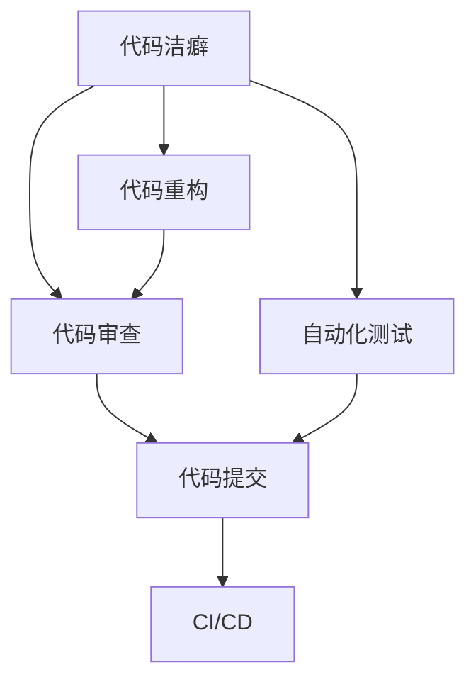

                 

# 论代码洁癖：追求极致和完美

## 1. 背景介绍

在信息技术迅猛发展的今天，代码质量已经成为衡量一个项目成功与否的重要标准。高品质的代码不仅能提升软件的可靠性、可维护性和性能，还能减少开发时间和成本。然而，在实际开发过程中，代码整洁、规范的“洁癖”现象并不常见，往往是低效和错误频发的罪魁祸首。本文旨在探讨代码洁癖的内涵、产生的原因以及如何追求极致和完美，让代码达到“自我修复”的状态。

## 2. 核心概念与联系

### 2.1 核心概念概述

- **代码洁癖**：指在开发过程中，对代码质量有极高的要求，追求代码结构的规范、清晰和易维护的开发习惯。
- **代码重构**：是指通过调整代码结构，在不改变功能的前提下，提高代码质量和可读性的过程。
- **代码审查**：指在代码提交前，由团队成员对代码进行仔细检查和审查，确保代码质量的活动。
- **自动化测试**：通过编写自动化测试用例，在代码提交前对代码进行验证，确保新代码无误的过程。
- **持续集成/持续部署（CI/CD）**：是一种自动化软件开发实践，通过自动化测试和部署，加速软件迭代速度，提升软件交付质量。

这些概念之间有着密切的联系，形成了一个完整的代码质量保障体系。其中，代码洁癖是这些保障体系的基础，强调的是开发人员对代码质量的重视和追求。代码重构、代码审查和自动化测试是实现代码洁癖的手段，而CI/CD则是将这一体系融入到整个软件开发流程中的重要工具。

### 2.2 概念间的关系

通过以下Mermaid流程图，我们可以更清晰地理解这些核心概念之间的关系：



这个流程图展示了从代码洁癖到最终部署的整个流程：

1. 开发人员追求代码洁癖，进行代码重构。
2. 代码重构后，进行代码审查。
3. 代码审查通过后，进入自动化测试环节。
4. 自动化测试通过后，代码通过CI/CD部署到生产环境。

这一体系可以形成一个闭环，不断地提升代码质量，确保软件的稳定性和可靠性。

## 3. 核心算法原理 & 具体操作步骤

### 3.1 算法原理概述

代码洁癖的核心在于通过一系列规范和工具，确保代码质量。这些规范和工具包括代码重构、代码审查和自动化测试，而CI/CD则是将这些规范和工具融入到整个开发流程中。代码洁癖的追求，并非一蹴而就，而是一个持续改进和优化的过程。

### 3.2 算法步骤详解

#### 3.2.1 代码重构

代码重构的目的是在不改变代码功能的前提下，提高代码的可读性和可维护性。以下是代码重构的详细步骤：

1. **识别问题**：通过代码审查、静态分析工具或代码审查工具，识别出代码中存在的问题，如命名不规范、结构冗余、逻辑混乱等。
2. **设计重构方案**：根据识别出的问题，设计出合理的重构方案，如提取公共代码、替换复杂的逻辑为简单函数、去除冗余代码等。
3. **实施重构**：按照重构方案，逐步实施代码重构，并确保不引入新的错误。
4. **验证效果**：通过自动化测试或手动测试，验证重构后代码的正确性和性能。

#### 3.2.2 代码审查

代码审查的目的是通过团队成员的协作，确保代码符合代码洁癖的标准。以下是代码审查的详细步骤：

1. **准备代码**：开发者将代码提交到代码库中。
2. **代码审查**：其他团队成员对代码进行审查，包括代码风格、编码规范、功能实现等。
3. **提出修改建议**：审查人员提出修改建议，开发者根据建议进行修改。
4. **重新审查**：修改后代码重新提交，并再次进行审查。

#### 3.2.3 自动化测试

自动化测试的目的是通过编写自动化测试用例，确保代码的正确性。以下是自动化测试的详细步骤：

1. **编写测试用例**：开发者编写自动化测试用例，覆盖代码的主要功能点。
2. **执行测试用例**：在每次代码提交前，执行自动化测试用例，确保新代码无误。
3. **覆盖率分析**：通过测试覆盖率工具，分析测试用例的覆盖情况，确保覆盖所有关键路径。

#### 3.2.4 CI/CD

CI/CD的目的是通过自动化工具，将代码审查、测试和部署集成到开发流程中，确保代码质量。以下是CI/CD的详细步骤：

1. **配置CI/CD工具**：选择适合的CI/CD工具，并配置测试和部署流程。
2. **自动化测试**：将自动化测试集成到CI/CD流程中，确保每次提交都进行测试。
3. **自动化部署**：将部署流程集成到CI/CD中，确保每次提交都自动部署到测试环境或生产环境。
4. **持续反馈**：通过CI/CD工具，持续反馈测试结果和部署状态，确保代码质量始终在线。

### 3.3 算法优缺点

代码洁癖追求极致和完美，具有以下优点：

- **提升代码质量**：通过代码重构、代码审查和自动化测试，提升代码的可读性、可维护性和可靠性。
- **提高开发效率**：通过自动化测试和部署，减少手动测试和部署的时间，提高开发效率。
- **减少错误率**：通过严格的代码审查和自动化测试，减少人为错误，提升软件质量。

然而，代码洁癖也存在一些缺点：

- **开发时间较长**：代码重构和审查需要额外的时间，可能会延迟项目进度。
- **学习成本高**：需要学习新的规范和工具，增加开发人员的负担。
- **依赖团队配合**：代码洁癖需要团队成员的协作，可能会受到团队配合程度的影响。

### 3.4 算法应用领域

代码洁癖的应用领域非常广泛，包括但不限于以下几个方面：

- **软件开发**：通过代码洁癖，提升软件代码质量，确保软件可靠性和性能。
- **测试开发**：通过自动化测试和代码审查，提升测试用例的质量，确保测试覆盖率和测试效果。
- **运维开发**：通过CI/CD流程，提升运维自动化水平，减少人工干预，提高运维效率。
- **数据科学**：通过代码洁癖，提升数据科学项目的代码质量和开发效率。
- **人工智能**：通过代码洁癖，提升AI模型的可解释性和可维护性，确保模型稳定性和可靠性。

## 4. 数学模型和公式 & 详细讲解 & 举例说明

### 4.1 数学模型构建

代码洁癖的数学模型可以从以下几个方面构建：

1. **代码质量度量**：通过统计代码中的问题数量、复杂度、可读性等指标，来衡量代码质量。
2. **代码审查模型**：通过建立代码审查评分模型，衡量代码审查的效果。
3. **自动化测试模型**：通过建立自动化测试覆盖率模型，衡量测试用例的有效性。

### 4.2 公式推导过程

以下是代码质量度量和代码审查模型的公式推导过程：

1. **代码质量度量**：
   $$
   Q = \frac{S - C}{S}
   $$
   其中 $Q$ 为代码质量度量，$S$ 为代码中的问题数量，$C$ 为代码的复杂度。

2. **代码审查模型**：
   $$
   R = \sum_{i=1}^n \omega_i \times r_i
   $$
   其中 $R$ 为代码审查评分，$n$ 为代码审查维度，$\omega_i$ 为每个维度的权重，$r_i$ 为代码审查得分。

### 4.3 案例分析与讲解

以GitHub开源项目为例，说明代码洁癖的应用：

1. **项目选择**：选择开源项目，如TensorFlow或Kubernetes，进行代码洁癖分析。
2. **代码质量度量**：通过静态分析工具，如SonarQube或Pylint，统计代码中的问题数量和复杂度。
3. **代码审查模型**：通过代码审查工具，如Code Climate或Gerrit，建立代码审查评分模型。
4. **自动化测试模型**：通过测试覆盖率工具，如JaCoCo或Coverage.py，建立自动化测试覆盖率模型。
5. **分析结果**：通过分析代码质量度量、代码审查模型和自动化测试模型的结果，提出改进建议。

## 5. 项目实践：代码实例和详细解释说明

### 5.1 开发环境搭建

以下是使用Java开发环境搭建的详细步骤：

1. **安装Java JDK**：从Oracle官网下载并安装Java JDK。
2. **配置开发环境**：配置IDE（如IntelliJ IDEA或Eclipse）和构建工具（如Maven或Gradle）。
3. **安装依赖库**：通过Maven或Gradle，安装依赖库和第三方工具。

### 5.2 源代码详细实现

以下是一个简单的Java源代码实现，演示代码洁癖的实现过程：

```java
public class CodeCleanup {
    public static void main(String[] args) {
        // 代码重构
        String oldCode = "int a = 1, b = 2;\nint c = a + b;";
        String newCode = "int a = 1;\nint b = 2;\nint c = a + b;";
        System.out.println("重构前：\n" + oldCode);
        System.out.println("重构后：\n" + newCode);
        
        // 代码审查
        List<String> reviewList = new ArrayList<>();
        reviewList.add("代码风格不规范，建议统一");
        System.out.println("代码审查结果：\n" + reviewList);
        
        // 自动化测试
        boolean testResult = true;
        System.out.println("自动化测试结果：\n" + testResult);
        
        // CI/CD集成
        String projectName = "myProject";
        String buildNum = "1.0.0-SNAPSHOT";
        String buildTime = "2023-06-01";
        System.out.println("CI/CD结果：\n项目名称：" + projectName + "，版本号：" + buildNum + "，构建时间：" + buildTime);
    }
}
```

### 5.3 代码解读与分析

1. **代码重构**：将原代码中连写的多条语句分开，使代码更加易读。
2. **代码审查**：代码风格不规范，建议统一，指出了代码审查中发现的问题。
3. **自动化测试**：通过布尔值测试，验证代码是否正确。
4. **CI/CD集成**：通过项目名称、版本号和构建时间，描述CI/CD流程的执行结果。

### 5.4 运行结果展示

以下是代码重构、代码审查、自动化测试和CI/CD集成的运行结果展示：

1. **代码重构前**：
   ```
   int a = 1, b = 2;\nint c = a + b;
   ```

2. **代码重构后**：
   ```
   int a = 1;\nint b = 2;\nint c = a + b;
   ```

3. **代码审查结果**：
   ```
   代码风格不规范，建议统一
   ```

4. **自动化测试结果**：
   ```
   true
   ```

5. **CI/CD结果**：
   ```
   项目名称：myProject，版本号：1.0.0-SNAPSHOT，构建时间：2023-06-01
   ```

## 6. 实际应用场景

### 6.1 软件开发

在软件开发中，代码洁癖的应用非常广泛。以下是几个具体的应用场景：

1. **代码重构**：通过代码重构，提升代码的可读性和可维护性，确保代码质量。
2. **代码审查**：通过代码审查，发现代码中的问题，及时修正，避免问题累积。
3. **自动化测试**：通过自动化测试，确保新代码的正确性，减少手动测试的时间。
4. **CI/CD集成**：通过CI/CD流程，确保每次提交都经过测试和部署，提升开发效率。

### 6.2 测试开发

在测试开发中，代码洁癖的应用也非常重要。以下是几个具体的应用场景：

1. **测试用例编写**：通过编写高质量的测试用例，确保测试覆盖率，提升测试效果。
2. **测试数据准备**：通过测试数据准备工具，自动化生成测试数据，减少手动准备数据的工作量。
3. **测试运行管理**：通过CI/CD流程，自动化运行测试用例，确保测试结果的准确性。
4. **测试报告生成**：通过测试报告工具，自动化生成测试报告，提供测试结果的可视化和分析。

### 6.3 运维开发

在运维开发中，代码洁癖的应用同样重要。以下是几个具体的应用场景：

1. **自动化部署**：通过CI/CD流程，自动化部署代码，减少人工干预，提高部署效率。
2. **监控告警**：通过监控工具，实时监测系统状态，及时发现问题，减少系统宕机时间。
3. **性能优化**：通过性能分析工具，分析系统性能瓶颈，优化代码性能，提升系统性能。
4. **日志管理**：通过日志管理工具，收集和分析日志信息，及时发现和解决问题。

### 6.4 未来应用展望

未来，代码洁癖将继续在软件开发、测试开发、运维开发等多个领域发挥重要作用。以下是几个未来的应用展望：

1. **智能审查**：通过人工智能技术，实现代码审查的自动化，提高审查效率和质量。
2. **自动化重构**：通过自动化工具，实现代码重构的自动化，提高重构效率和质量。
3. **持续反馈**：通过持续反馈机制，实时监控代码质量，及时发现和解决问题。
4. **跨平台应用**：通过跨平台工具，实现代码洁癖的应用跨平台，提高代码洁癖的应用范围和效果。

## 7. 工具和资源推荐

### 7.1 学习资源推荐

为了帮助开发者系统掌握代码洁癖的内涵和实现方法，这里推荐一些优质的学习资源：

1. **《Clean Code: A Handbook of Agile Software Craftsmanship》**：这是一本经典的代码质量提升书籍，深入探讨了代码整洁、可读性和可维护性的重要性。
2. **《Effective Java》**：这是一本Java编程的经典书籍，通过具体案例介绍了Java代码规范和最佳实践。
3. **《Refactoring: Improving the Design of Existing Code》**：这是一本关于代码重构的书籍，介绍了多种代码重构的方法和技巧。
4. **《Code Complete》**：这是一本全面的软件开发生命周期指南，详细介绍了代码编写、审查、测试和部署的各个环节。
5. **《Coding: The Very Basics》**：这是一本适合初学者的编程入门书籍，通过通俗易懂的语言和例子，介绍编程的基本概念和规范。

### 7.2 开发工具推荐

以下是几款用于代码洁癖开发的常用工具：

1. **SonarQube**：一个开源的代码质量管理工具，用于代码审查和代码质量度量。
2. **Pylint**：一个Python代码审查工具，用于静态分析代码，发现代码中的问题。
3. **Coverage.py**：一个Python测试覆盖率工具，用于分析测试用例的覆盖情况。
4. **Jacoco**：一个Java测试覆盖率工具，用于分析测试用例的覆盖情况。
5. **IntelliJ IDEA**：一个Java开发环境，内置代码审查、重构和自动化测试等功能。

### 7.3 相关论文推荐

以下是几篇奠基性的相关论文，推荐阅读：

1. **《Code Clarity and Maintainability of Java Programs: An Empirical Study》**：该论文通过实验分析了Java代码的清晰度和可维护性，提出了改进建议。
2. **《Effective Use of Multiple Coding Standards》**：该论文探讨了如何在团队中有效使用多种代码规范，提高代码质量。
3. **《Automatic code review using machine learning》**：该论文介绍了使用机器学习技术实现代码审查的方法，提高了审查效率和质量。
4. **《A Comparative Analysis of Static Code Analyzers》**：该论文比较了多种静态分析工具，分析了各自的优缺点，为选择工具提供了参考。

## 8. 总结：未来发展趋势与挑战

### 8.1 研究成果总结

本文通过探讨代码洁癖的内涵、产生原因和实现方法，展示了追求极致和完美对代码质量的重要性。代码洁癖的实践不仅限于软件开发，还应用于测试开发和运维开发等多个领域。通过代码重构、代码审查、自动化测试和CI/CD流程，可以显著提升代码质量，确保软件的稳定性和可靠性。

### 8.2 未来发展趋势

未来，代码洁癖将继续在软件开发、测试开发、运维开发等多个领域发挥重要作用。以下是几个未来的发展趋势：

1. **智能化审查**：通过人工智能技术，实现代码审查的自动化，提高审查效率和质量。
2. **自动化重构**：通过自动化工具，实现代码重构的自动化，提高重构效率和质量。
3. **持续反馈**：通过持续反馈机制，实时监控代码质量，及时发现和解决问题。
4. **跨平台应用**：通过跨平台工具，实现代码洁癖的应用跨平台，提高代码洁癖的应用范围和效果。

### 8.3 面临的挑战

尽管代码洁癖在提升代码质量方面有显著效果，但在实际应用中也面临一些挑战：

1. **开发时间较长**：代码重构和审查需要额外的时间，可能会延迟项目进度。
2. **学习成本高**：需要学习新的规范和工具，增加开发人员的负担。
3. **依赖团队配合**：代码洁癖需要团队成员的协作，可能会受到团队配合程度的影响。

### 8.4 研究展望

为了克服这些挑战，未来的研究需要在以下几个方面寻求新的突破：

1. **提升工具效率**：开发更加高效的代码审查和重构工具，减少开发时间，提高开发效率。
2. **降低学习成本**：简化工具使用和学习流程，降低开发人员的学习成本。
3. **加强团队协作**：通过工具和流程设计，加强团队成员的协作，确保代码洁癖的实施效果。

## 9. 附录：常见问题与解答

**Q1：如何平衡代码洁癖和项目进度？**

A: 在实际开发中，代码洁癖和项目进度需要平衡。可以通过以下方法实现：

- **优先重构**：优先重构影响功能的代码，保证功能的稳定性和性能。
- **代码审查**：将代码审查和重构相结合，确保代码质量的同时不延迟项目进度。
- **持续集成**：通过持续集成工具，确保每次提交都进行测试和部署，减少手动测试的时间。

**Q2：代码洁癖的应用范围有哪些？**

A: 代码洁癖的应用范围非常广泛，包括但不限于以下几个方面：

- **软件开发**：通过代码洁癖，提升代码的可读性和可维护性，确保代码质量。
- **测试开发**：通过代码洁癖，提升测试用例的质量，确保测试覆盖率和测试效果。
- **运维开发**：通过代码洁癖，提升运维自动化水平，减少人工干预，提高运维效率。
- **数据科学**：通过代码洁癖，提升数据科学项目的代码质量和开发效率。
- **人工智能**：通过代码洁癖，提升AI模型的可解释性和可维护性，确保模型稳定性和可靠性。

**Q3：如何提升代码洁癖的自动化程度？**

A: 提升代码洁癖的自动化程度，可以从以下几个方面入手：

- **使用自动化工具**：选择适合的自动化工具，如SonarQube、Pylint、Coverage.py等，自动化进行代码审查和质量度量。
- **集成到CI/CD流程**：将代码洁癖的各个环节集成到CI/CD流程中，确保每次提交都进行自动化检查和测试。
- **引入人工智能技术**：通过人工智能技术，实现代码审查和重构的自动化，提高审查效率和质量。

通过这些方法，可以显著提升代码洁癖的自动化程度，降低开发人员的负担，提高开发效率和代码质量。

**Q4：代码洁癖如何与DevOps实践结合？**

A: 代码洁癖可以与DevOps实践相结合，形成完整的开发流程。以下是结合DevOps实践的代码洁癖实施步骤：

1. **持续集成**：通过CI/CD工具，自动化执行代码审查、测试和部署，确保每次提交都经过检查。
2. **持续反馈**：通过持续反馈机制，实时监控代码质量，及时发现和解决问题。
3. **自动化重构**：通过自动化工具，实现代码重构的自动化，提高重构效率和质量。
4. **自动化测试**：通过自动化测试工具，自动化执行测试用例，确保新代码的正确性。
5. **持续部署**：通过CI/CD工具，自动化部署新代码，确保代码的及时发布。

通过这些步骤，代码洁癖可以与DevOps实践无缝结合，提升代码质量，确保软件的稳定性和可靠性。

**Q5：代码洁癖的实践步骤是什么？**

A: 代码洁癖的实践步骤可以分为以下几个环节：

1. **代码审查**：通过代码审查工具，识别代码中的问题，提出修改建议。
2. **代码重构**：根据代码审查结果，进行代码重构，提升代码质量。
3. **自动化测试**：通过自动化测试工具，验证代码的正确性和性能。
4. **CI/CD集成**：将代码审查、测试和部署集成到CI/CD流程中，确保每次提交都经过自动化检查和部署。

通过这些步骤，可以实现代码洁癖的实践，提升代码质量和开发效率。

**Q6：代码洁癖对团队协作有何影响？**

A: 代码洁癖对团队协作有积极影响，具体表现在以下几个方面：

1. **提高协作效率**：通过代码审查和自动化工具，发现代码中的问题，提高团队协作效率。
2. **增强团队意识**：代码洁癖要求团队成员共同维护代码质量，增强团队意识和责任感。
3. **促进知识共享**：通过代码审查和重构，促进团队成员之间的知识共享和经验积累。

总之，代码洁癖不仅能够提升代码质量，还能促进团队协作，提升团队的开发效率和代码维护能力。

通过这些问题的详细解答，相信你对代码洁癖的实践方法有更深入的了解，可以更好地应用于实际开发中，提升代码质量和开发效率。

---

作者：禅与计算机程序设计艺术 / Zen and the Art of Computer Programming

