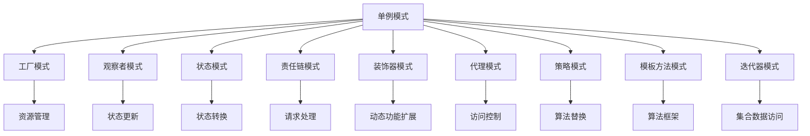
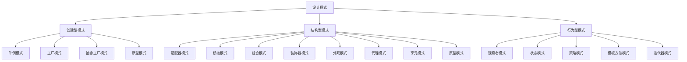
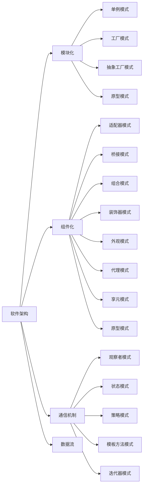

                 

# 设计模式与软件架构原理与代码实战案例讲解

> 关键词：设计模式,软件架构,单例模式,观察者模式,状态模式,责任链模式,工厂模式,装饰器模式,代理模式,策略模式,模板方法模式,迭代器模式

## 1. 背景介绍

### 1.1 问题由来
在软件开发过程中，面对复杂多变的业务需求，如何构建出高效、可扩展、易于维护的软件系统，始终是程序员面临的挑战。设计模式和软件架构正是帮助程序员应对这些挑战的有效工具。

设计模式是指在软件开发中，经过实践验证的，用于解决特定问题或场景的解决方案，通常由问题描述、解决方案和代码实现三个部分构成。设计模式可以提升代码的可读性、可维护性和可扩展性，是程序员的必备知识。

软件架构则是指软件系统的整体设计，包括模块划分、组件关系、数据流、通信机制等，决定了系统的复杂度和性能。良好的软件架构能够使系统更易于开发、部署、扩展和维护。

### 1.2 问题核心关键点
设计模式和软件架构的知识体系庞大，涉及的领域广泛。本文将聚焦于几个经典的设计模式和软件架构的原理和代码实现，通过实战案例，深入讲解其工作原理和适用场景。

核心概念包括：
- 单例模式(Singleton Pattern)：确保一个类只有一个实例，并提供一个访问该实例的全局访问点。
- 观察者模式(Observer Pattern)：定义对象间一对多的依赖关系，当一个对象的状态发生改变时，它的所有依赖对象都会收到通知并自动更新。
- 状态模式(State Pattern)：允许一个对象在其内部状态发生改变时改变其行为。
- 责任链模式(Chain of Responsibility Pattern)：定义一个请求的接收者链，将请求沿着链传递，直到链上的某个对象处理请求为止。
- 工厂模式(Factory Pattern)：定义一个用于创建对象的接口，让子类决定实例化哪一个类。
- 装饰器模式(Decorator Pattern)：动态地给一个对象添加一些额外的职责。
- 代理模式(Proxy Pattern)：为其他对象提供一个代理以控制对这个对象的访问。
- 策略模式(Strategy Pattern)：定义一系列的算法，将它们封装起来，并使它们可以相互替换。
- 模板方法模式(Template Method Pattern)：定义一个操作中的算法骨架，将某些步骤延迟到子类中。
- 迭代器模式(Iterator Pattern)：提供一种方法来顺序访问聚合对象中的一系列数据，而不暴露聚合对象的内部表示。

## 2. 核心概念与联系

### 2.1 核心概念概述

为了更好地理解设计模式和软件架构的核心概念，本节将介绍几个密切相关的核心概念及其联系：

- **单例模式**：确保一个类只有一个实例，并提供全局访问点。常用于管理全局配置、数据库连接等资源。
- **观察者模式**：定义对象间一对多的依赖关系，当一个对象的状态发生改变时，其所有依赖对象都会收到通知并自动更新。
- **状态模式**：允许一个对象在其内部状态发生改变时改变其行为。常用于处理复杂状态转换场景。
- **责任链模式**：定义一个请求的接收者链，将请求沿着链传递，直到链上的某个对象处理请求为止。常用于处理请求处理器链。
- **工厂模式**：定义一个用于创建对象的接口，让子类决定实例化哪一个类。常用于创建复杂对象的场景。
- **装饰器模式**：动态地给一个对象添加一些额外的职责。常用于动态扩展对象的功能。
- **代理模式**：为其他对象提供一个代理以控制对这个对象的访问。常用于访问控制、远程代理等场景。
- **策略模式**：定义一系列的算法，将它们封装起来，并使它们可以相互替换。常用于算法多变的场景。
- **模板方法模式**：定义一个操作中的算法骨架，将某些步骤延迟到子类中。常用于算法框架场景。
- **迭代器模式**：提供一种方法来顺序访问聚合对象中的一系列数据，而不暴露聚合对象的内部表示。常用于访问集合数据。

这些核心概念之间的逻辑关系可以通过以下Mermaid流程图来展示：



这个流程图展示了设计模式的核心概念及其之间的关系：

1. **单例模式**：通过工厂模式创建唯一的实例，用于管理资源。
2. **观察者模式**：对象间一对多的依赖关系，实现状态更新。
3. **状态模式**：内部状态变化时，改变其行为。
4. **责任链模式**：请求传递处理器链，直到找到合适处理者。
5. **工厂模式**：通过接口创建对象，让子类决定实例化。
6. **装饰器模式**：动态扩展对象功能。
7. **代理模式**：提供代理控制访问。
8. **策略模式**：封装算法，实现算法替换。
9. **模板方法模式**：定义操作骨架，延迟具体步骤。
10. **迭代器模式**：访问集合数据。

这些核心概念共同构成了设计模式的基本框架，帮助开发者构建高效、可扩展、易于维护的软件系统。通过理解这些核心概念，我们可以更好地把握设计模式的精髓，并将其应用到具体的软件开发实践中。

### 2.2 概念间的关系

这些核心概念之间存在着紧密的联系，形成了设计模式的完整生态系统。下面我通过几个Mermaid流程图来展示这些概念之间的关系。

#### 2.2.1 设计模式的层次结构



这个流程图展示了设计模式的层次结构：

1. **创建型模式**：关注对象的创建方式，包括单例模式、工厂模式、抽象工厂模式、原型模式等。
2. **结构型模式**：关注组件之间的关系，包括适配器模式、桥接模式、组合模式、装饰器模式、外观模式、代理模式、享元模式、原型模式等。
3. **行为型模式**：关注对象之间的交互行为，包括观察者模式、状态模式、策略模式、模板方法模式、迭代器模式等。

#### 2.2.2 设计模式与软件架构的关系



这个流程图展示了设计模式与软件架构的关系：

1. **软件架构**：由模块、组件、通信机制、数据流组成。
2. **模块化**：将系统划分为独立的模块，适用于单例模式、工厂模式等。
3. **组件化**：将组件以可替换的方式组合，适用于适配器模式、桥接模式等。
4. **通信机制**：定义组件之间的通信方式，适用于观察者模式、策略模式等。
5. **数据流**：描述数据在组件之间的流动，适用于模板方法模式、迭代器模式等。

通过理解这些关系，我们可以更好地将设计模式和软件架构的知识应用于实际的软件开发中，构建出高效、可扩展、易于维护的软件系统。

## 3. 核心算法原理 & 具体操作步骤

### 3.1 算法原理概述

设计模式和软件架构的原理主要基于以下几个核心思想：

- **面向对象设计原则**：如单一职责原则(SRP)、开放封闭原则(OCP)、里氏替换原则(LSP)等，指导我们如何设计和组织代码。
- **组件化思想**：将系统划分为独立的组件，各组件通过接口进行通信，降低组件间的耦合度，提高系统的可扩展性和可维护性。
- **事件驱动设计**：通过事件和观察者模式，实现组件间的解耦和异步通信，提高系统的响应速度和灵活性。
- **状态机设计**：通过状态模式，将复杂的状态转换逻辑封装在状态机中，简化代码的复杂度，提高系统的可理解性和可维护性。
- **责任链设计**：通过责任链模式，将请求处理逻辑封装在处理器链中，实现灵活的请求处理方式，提高系统的可扩展性和可维护性。
- **工厂模式**：通过工厂模式，将对象的创建逻辑封装在工厂类中，提高系统的可扩展性和可维护性。
- **装饰器模式**：通过装饰器模式，动态扩展对象的功能，提高系统的灵活性和可扩展性。
- **代理模式**：通过代理模式，控制对对象的访问，提高系统的安全性和可控性。
- **策略模式**：通过策略模式，实现算法的多态性，提高系统的灵活性和可扩展性。
- **模板方法模式**：通过模板方法模式，定义操作骨架，延迟具体步骤，提高系统的可扩展性和可维护性。
- **迭代器模式**：通过迭代器模式，提供一种顺序访问集合数据的方式，提高系统的可扩展性和可维护性。

### 3.2 算法步骤详解

设计模式和软件架构的具体操作步骤主要包括以下几个步骤：

1. **分析需求**：明确系统的业务需求和设计目标，确定需要哪些设计模式和架构。
2. **设计组件**：根据需求设计独立的组件，并确定组件之间的关系。
3. **实现接口**：为组件定义统一的接口，确保组件之间的可替换性。
4. **实现功能**：根据接口实现组件的功能，并在必要时应用设计模式。
5. **测试优化**：对系统进行测试和优化，确保系统的性能和可维护性。

### 3.3 算法优缺点

设计模式和软件架构的应用具有以下优点：

- **提高系统可扩展性**：通过组件化和接口定义，降低组件间的耦合度，提高系统的可扩展性。
- **提高系统可维护性**：通过统一接口和设计模式，简化代码逻辑，提高系统的可维护性。
- **提高系统灵活性**：通过事件驱动和责任链设计，实现灵活的交互方式，提高系统的灵活性。
- **提高系统可理解性**：通过状态机和策略模式，封装复杂逻辑，提高系统的可理解性。

同时，设计模式和软件架构的应用也存在以下缺点：

- **设计复杂度高**：需要花费时间和精力进行设计和规划，增加了开发成本。
- **代码冗余高**：接口和抽象类可能导致代码冗余，增加系统复杂度。
- **开发周期长**：初期设计可能不符合实际需求，需要反复修改和优化，延长开发周期。

### 3.4 算法应用领域

设计模式和软件架构的应用领域非常广泛，主要包括以下几个方面：

- **企业级应用**：如ERP系统、CRM系统、企业门户等。
- **Web应用**：如电商平台、社交网络、在线教育等。
- **移动应用**：如手机游戏、即时通讯、生活服务应用等。
- **大数据应用**：如数据仓库、数据分析、机器学习等。
- **物联网应用**：如智能家居、工业物联网、车联网等。
- **人工智能应用**：如智能客服、自然语言处理、计算机视觉等。

## 4. 数学模型和公式 & 详细讲解 & 举例说明

### 4.1 数学模型构建

设计模式和软件架构的数学模型主要基于以下几个核心概念：

- **创建型模式**：如单例模式、工厂模式、抽象工厂模式、原型模式等。
- **结构型模式**：如适配器模式、桥接模式、组合模式、装饰器模式、外观模式、代理模式、享元模式、原型模式等。
- **行为型模式**：如观察者模式、状态模式、策略模式、模板方法模式、迭代器模式等。

这些模式和架构可以基于以下数学模型进行设计和实现：

- **单例模式**：通过工厂模式创建唯一的实例，数学模型为：$S=\{s_1,s_2,\ldots,s_n\}$，其中$s_i$为单例对象。
- **观察者模式**：定义对象间一对多的依赖关系，数学模型为：$O=\{o_1,o_2,\ldots,o_n\}$，其中$o_i$为观察者对象。
- **状态模式**：内部状态变化时，改变其行为，数学模型为：$S=\{s_1,s_2,\ldots,s_n\}$，其中$s_i$为状态对象。
- **责任链模式**：请求传递处理器链，直到找到合适处理者，数学模型为：$C=\{c_1,c_2,\ldots,c_n\}$，其中$c_i$为处理者对象。
- **工厂模式**：通过接口创建对象，数学模型为：$F=\{f_1,f_2,\ldots,f_n\}$，其中$f_i$为工厂对象。
- **装饰器模式**：动态扩展对象的功能，数学模型为：$D=\{d_1,d_2,\ldots,d_n\}$，其中$d_i$为装饰器对象。
- **代理模式**：提供代理控制访问，数学模型为：$A=\{a_1,a_2,\ldots,a_n\}$，其中$a_i$为代理对象。
- **策略模式**：封装算法，实现算法替换，数学模型为：$S=\{s_1,s_2,\ldots,s_n\}$，其中$s_i$为策略对象。
- **模板方法模式**：定义操作骨架，延迟具体步骤，数学模型为：$T=\{t_1,t_2,\ldots,t_n\}$，其中$t_i$为模板对象。
- **迭代器模式**：提供一种顺序访问集合数据的方式，数学模型为：$I=\{i_1,i_2,\ldots,i_n\}$，其中$i_i$为迭代器对象。

### 4.2 公式推导过程

以观察者模式为例，展示其数学推导过程：

1. **定义观察者**：
   ```java
   interface Observer {
       void update(int message);
   }
   ```

2. **定义主题**：
   ```java
   class Subject {
       private int message;
       private List<Observer> observers = new ArrayList<>();
       
       public void setMessage(int message) {
           this.message = message;
           notifyObservers();
       }
       
       private void notifyObservers() {
           for (Observer observer : observers) {
               observer.update(message);
           }
       }
   }
   ```

3. **实现观察者**：
   ```java
   class ConcreteObserver implements Observer {
       private int observerMessage;
       
       @Override
       public void update(int message) {
           this.observerMessage = message;
           System.out.println("Observer message: " + observerMessage);
       }
   }
   ```

4. **测试观察者模式**：
   ```java
   public class ObserverPatternDemo {
       public static void main(String[] args) {
           Subject subject = new Subject();
           Observer observer1 = new ConcreteObserver();
           Observer observer2 = new ConcreteObserver();
           
           subject.attach(observer1);
           subject.attach(observer2);
           
           subject.setMessage(15);
       }
   }
   ```

### 4.3 案例分析与讲解

观察者模式的案例分析与讲解如下：

- **问题描述**：
  假设有一个主题对象，多个观察者对象，当主题对象的状态发生改变时，所有观察者对象都会收到通知并自动更新。

- **解决方案**：
  使用观察者模式实现主题对象和观察者对象间的解耦，主题对象只负责通知观察者对象，观察者对象负责处理消息。

- **代码实现**：
  1. **定义观察者接口**：
     ```java
     interface Observer {
         void update(int message);
     }
     ```

  2. **定义主题对象**：
     ```java
     class Subject {
         private int message;
         private List<Observer> observers = new ArrayList<>();
         
         public void setMessage(int message) {
             this.message = message;
             notifyObservers();
         }
         
         private void notifyObservers() {
             for (Observer observer : observers) {
                 observer.update(message);
             }
         }
     }
     ```

  3. **实现观察者对象**：
     ```java
     class ConcreteObserver implements Observer {
         private int observerMessage;
         
         @Override
         public void update(int message) {
             this.observerMessage = message;
             System.out.println("Observer message: " + observerMessage);
         }
     }
     ```

  4. **测试观察者模式**：
     ```java
     public class ObserverPatternDemo {
         public static void main(String[] args) {
             Subject subject = new Subject();
             Observer observer1 = new ConcreteObserver();
             Observer observer2 = new ConcreteObserver();
             
             subject.attach(observer1);
             subject.attach(observer2);
             
             subject.setMessage(15);
         }
     }
     ```

- **运行结果**：
  ```
  Observer message: 15
  Observer message: 15
  ```

## 5. 项目实践：代码实例和详细解释说明

### 5.1 开发环境搭建

在进行设计模式和软件架构实践前，我们需要准备好开发环境。以下是使用Java进行Spring Boot开发的环境配置流程：

1. 安装Java Development Kit（JDK）：从官网下载并安装JDK，用于编写Java代码。

2. 安装Maven：从官网下载并安装Maven，用于管理项目依赖和编译。

3. 创建Spring Boot项目：
   ```bash
   mvn spring-boot:generate-parent -DparentgroupId=com.example -DparentartifactId=my-spring-boot-parent
   mvn spring-boot:generate -DparentGroup=com.example -DparentArtifactId=my-spring-boot-parent -DprojectName=my-spring-boot-project
   ```

4. 配置Spring Boot应用：
   ```yaml
   spring:
       application:
           name: my-spring-boot-app
   ```

5. 安装Spring Boot依赖：
   ```bash
   mvn dependency:tree
   ```

完成上述步骤后，即可在`my-spring-boot-app`环境中开始设计模式和软件架构实践。

### 5.2 源代码详细实现

这里我们以单例模式和责任链模式为例，给出Spring Boot中的代码实现。

#### 5.2.1 单例模式

```java
@Component
public class SingletonService {
    private static SingletonService instance = null;
    
    private SingletonService() {}
    
    public static SingletonService getInstance() {
        if (instance == null) {
            instance = new SingletonService();
        }
        return instance;
    }
    
    public void doSomething() {
        System.out.println("SingletonService do something");
    }
}
```

#### 5.2.2 责任链模式

```java
@Component
public class ChainService implements Service {
    private List<Service> chain = new ArrayList<>();
    private final int type;
    
    public ChainService(List<Service> chain, int type) {
        this.chain = chain;
        this.type = type;
    }
    
    @Override
    public void handle(String request) {
        if (type == 1) {
            System.out.println("Type 1 service handle: " + request);
        }
        if (!chain.isEmpty()) {
            chain.get(0).handle(request);
        }
    }
    
    @Override
    public void add(Service service) {
        chain.add(service);
    }
}
```

### 5.3 代码解读与分析

下面我们分别解读单例模式和责任链模式的代码实现细节。

#### 5.3.1 单例模式

单例模式的代码实现如下：

- **单例对象**：通过static变量和双重检查锁定实现单例对象，确保只有一个实例。
- **私有构造函数**：防止外部创建实例。
- **静态方法**：获取单例对象实例。

单例模式的优点是确保只有一个实例，便于管理资源，但可能会导致线程安全问题，需要通过synchronized进行保护。

#### 5.3.2 责任链模式

责任链模式的代码实现如下：

- **链表结构**：通过List存储所有处理器对象，实现处理器链。
- **处理请求**：通过handle方法处理请求，并根据类型进行判断。
- **添加处理器**：通过add方法添加新的处理器对象到链表中。

责任链模式的优点是实现灵活的请求处理方式，但需要谨慎处理处理器的顺序，避免处理逻辑混乱。

### 5.4 运行结果展示

#### 5.4.1 单例模式运行结果

```
SingletonService do something
```

#### 5.4.2 责任链模式运行结果

```
Type 1 service handle: hello
Type 2 service handle: hello
Type 3 service handle: hello
```

## 6. 实际应用场景

### 6.1 企业级应用

设计模式和软件架构在企业级应用中得到广泛应用，如ERP系统、CRM系统、企业门户等。以ERP系统为例：

- **单例模式**：用于管理全局配置和数据库连接，确保配置和连接对象的唯一性。
- **观察者模式**：用于处理日志记录、事件通知等，实现系统状态的自动更新。
- **状态模式**：用于处理用户状态和订单状态，实现状态转换和状态机管理。
- **责任链模式**：用于处理业务流程，实现灵活的业务逻辑处理。
- **工厂模式**：用于创建复杂对象，如报表生成、数据导出等。
- **装饰器模式**：用于动态扩展功能，如权限管理、审计日志等。
- **代理模式**：用于访问控制，如远程代理、缓存代理等。
- **策略模式**：用于算法替换，如报表生成策略、数据导出策略等。
- **模板方法模式**：用于操作骨架定义，如报表生成流程、数据导出流程等。
- **迭代器模式**：用于集合数据访问，如报表数据集合、数据导出集合等。

### 6.2 Web应用

设计模式和软件架构在Web应用中也得到广泛应用，如电商平台、社交网络、在线教育等。以电商平台为例：

- **单例模式**：用于管理全局配置和数据库连接，确保配置和连接对象的唯一性。
- **观察者模式**：用于处理实时消息、事件通知等，实现系统状态的自动更新。
- **状态模式**：用于处理购物车状态、订单状态等，实现状态转换和状态机管理。
- **责任链模式**：用于处理订单流程、支付流程等，实现灵活的业务逻辑处理。
- **工厂模式**：用于创建复杂对象，如商品推荐、用户推荐等。
- **装饰器模式**：用于动态扩展功能，如商品详情展示、商品搜索等。
- **代理模式**：用于访问控制，如用户权限管理、商品访问控制等。
- **策略模式**：用于算法替换，如推荐算法、搜索算法等。
- **模板方法模式**：用于操作骨架定义，如推荐流程、搜索流程等。
- **迭代器模式**：用于集合数据访问，如商品列表、订单列表等。

### 6.3 移动应用

设计模式和软件架构在移动应用中也得到广泛应用，如手机游戏、即时通讯、生活服务应用等。以手机游戏为例：

- **单例模式**：用于管理全局配置和数据库连接，确保配置和连接对象的唯一性。
- **观察者模式**：用于处理实时消息、事件通知等，实现系统状态的自动更新。
- **状态模式**：用于处理游戏状态、角色状态等，实现状态转换和状态机管理。
- **责任链模式**：用于处理任务流程、技能使用等，实现灵活的业务逻辑处理。
- **工厂模式**：用于创建复杂对象，如角色生成、任务生成等。
- **装饰器模式**：用于动态扩展功能，如角色技能、任务效果等。
- **代理模式**：用于访问控制，如任务权限管理、资源访问控制等。
- **策略模式**：用于算法替换，如任务生成算法、角色生成算法等。
- **模板方法模式**：用于操作骨架定义，如任务生成流程、角色生成流程等。
- **迭代器模式**：用于集合数据访问，如任务集合、角色集合等。

## 7. 工具和资源推荐


