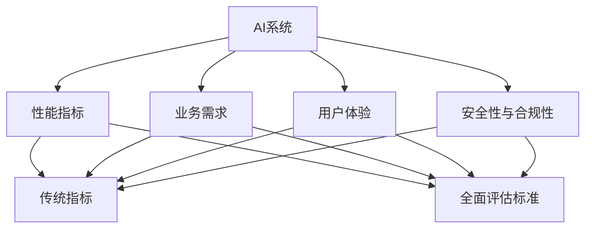

                 

## 1. 背景介绍

人工智能（AI）技术在各行各业的应用越来越广泛，但如何评估AI系统的性能和可靠性，始终是一个复杂而重要的问题。当前，评估AI系统主要依赖于传统的性能指标和测试方法，如准确率、召回率、F1分数等。然而，这些指标往往忽略了AI系统的实际应用场景和具体业务需求，难以全面衡量其价值。因此，本文旨在提出一种新的AI系统评估方法，通过建立全面的评估标准和评价体系，帮助开发者和用户更好地理解AI系统的性能和表现。

### 1.1 问题由来

随着AI技术的快速发展，越来越多的企业和机构开始利用AI技术来提升业务效率和竞争力。然而，由于缺乏统一、全面、可操作的评估标准，许多AI系统在应用过程中效果并不理想，甚至在一些关键场景下出现了严重问题。例如：

- 在自然语言处理（NLP）领域，一些AI系统虽然在学术评测中表现优异，但在实际应用中却无法准确理解用户意图，导致用户体验差。
- 在自动驾驶领域，AI系统在一些特殊情况下表现不佳，导致交通事故甚至严重人身伤害。
- 在医疗诊断领域，AI系统在一些复杂病例中出现了误诊，导致患者延误治疗。

这些问题凸显了现有评估方法的局限性，迫切需要建立一套全面的评估标准，以确保AI系统能够满足实际业务需求，并且在关键应用场景中保持可靠性和安全性。

### 1.2 问题核心关键点

本文旨在解决以下关键问题：

- **如何全面评估AI系统的性能**：传统的指标仅能衡量模型本身的统计性能，难以反映实际应用中的表现。
- **如何构建适应特定业务场景的评估标准**：AI系统的评估标准需要与具体业务需求紧密结合，才能有效衡量其实际价值。
- **如何整合多种评估方法**：AI系统的评估需要综合考虑模型性能、数据质量、用户反馈等多种因素，才能得到全面而准确的结果。

## 2. 核心概念与联系

### 2.1 核心概念概述

为了更好地理解本文提出的AI系统评估方法，本节将介绍几个核心概念：

- **AI系统**：包括但不限于机器学习（ML）模型、深度学习（DL）模型、强化学习（RL）模型等，用于解决特定业务问题的智能系统。
- **性能指标**：用于衡量AI系统在特定任务上的表现，如准确率、召回率、F1分数、ROC曲线等。
- **业务需求**：AI系统在具体业务场景中的实际需求，如精度要求、实时性、稳定性、可靠性等。
- **用户体验**：用户在使用AI系统时的实际感受和反馈，是评估AI系统的重要维度之一。
- **安全性与合规性**：AI系统在运行过程中对数据安全、隐私保护、法律法规的遵守情况。

这些概念共同构成了AI系统评估的基础框架，帮助我们理解AI系统的全面性能和应用价值。

### 2.2 概念间的关系

这些核心概念之间的逻辑关系可以通过以下Mermaid流程图来展示：



这个流程图展示了核心概念之间的关系：

1. AI系统通过性能指标、业务需求、用户体验和安全性与合规性等方面进行全面评估。
2. 传统指标仅能衡量AI系统在统计性能上的表现，而全面评估标准则综合考虑了业务需求和用户体验等多个维度。
3. 业务需求和用户体验是评估AI系统实际应用价值的重要因素，安全性与合规性则是系统可靠性和合规性的重要保证。

### 2.3 核心概念的整体架构

最后，我们用一个综合的流程图来展示这些核心概念在大规模AI系统评估中的整体架构：


这个综合流程图展示了从数据处理、模型训练、模型评估、业务需求分析、用户体验测试、安全性与合规性审计，到综合评估报告、应用优化和系统部署的全流程。

## 3. 核心算法原理 & 具体操作步骤

### 3.1 算法原理概述

本文提出的AI系统评估方法基于综合评估标准，通过多维度评估指标、数据分析和用户反馈等多方面信息，构建一个全面、可操作的评估框架。其核心思想是将AI系统的性能、业务需求、用户体验和安全合规等多个方面综合考虑，构建一个多维度的评估体系，帮助用户全面理解和衡量AI系统的实际表现。

### 3.2 算法步骤详解

基于综合评估标准，本文提出的AI系统评估方法主要包括以下几个步骤：

**Step 1: 数据收集与处理**
- 收集AI系统的训练数据、测试数据、用户反馈数据、安全性与合规性审计报告等。
- 对数据进行清洗、标注和预处理，确保数据质量和一致性。

**Step 2: 性能评估**
- 采用多种性能指标对AI系统的模型进行评估，如准确率、召回率、F1分数、ROC曲线等。
- 分析模型在不同业务场景下的表现，包括精度要求、实时性、稳定性等。

**Step 3: 业务需求分析**
- 结合业务场景，分析AI系统的具体需求，如模型精度、数据处理速度、响应时间等。
- 确定模型在不同业务场景下的表现目标，如误差率、延迟时间、并发量等。

**Step 4: 用户体验测试**
- 设计用户调查问卷和交互测试，收集用户对AI系统的真实反馈。
- 分析用户反馈，评估系统在用户体验上的表现，如用户满意度、易用性、界面友好度等。

**Step 5: 安全性与合规性审计**
- 对AI系统进行安全性与合规性审计，包括数据隐私保护、算法透明度、法律法规遵守等方面。
- 根据审计结果，提出改进建议，确保系统符合相关规范和标准。

**Step 6: 综合评估报告**
- 综合考虑性能评估、业务需求分析、用户体验测试和安全性与合规性审计等多方面信息，构建综合评估报告。
- 评估报告应包含模型性能、业务需求满足度、用户体验、安全性与合规性等方面的详细分析。

**Step 7: 应用优化**
- 根据综合评估报告，对AI系统进行优化，提升模型性能、满足业务需求、改善用户体验、增强安全性与合规性。
- 优化后的AI系统应满足所有评估标准，确保其可靠性和实用性。

**Step 8: 系统部署与持续监控**
- 将优化后的AI系统部署到实际应用场景中，并进行持续监控和评估。
- 定期收集用户反馈和系统运行数据，对AI系统进行优化和改进。

### 3.3 算法优缺点

本文提出的AI系统评估方法具有以下优点：

1. **全面性**：综合考虑了AI系统的性能、业务需求、用户体验和安全合规等多个方面，全面评估系统的表现。
2. **适应性**：能够适应不同业务场景和需求，帮助用户根据实际需求选择合适的AI系统。
3. **可操作性**：通过多维度评估指标和数据处理，使得评估过程具有可操作性和可执行性。

同时，该方法也存在一些局限性：

1. **复杂性**：评估标准和方法涉及多个维度，评估过程相对复杂。
2. **数据需求**：需要大量的训练数据、测试数据和用户反馈数据，数据获取成本较高。
3. **主观性**：用户体验和安全性与合规性的评估主观性较强，评估结果可能存在偏差。

尽管存在这些局限性，但该方法在理论上具有较高的全面性和适应性，能够有效评估AI系统的实际表现，为AI系统在实际应用中提供有力保障。

### 3.4 算法应用领域

本文提出的AI系统评估方法不仅适用于机器学习、深度学习和强化学习等AI技术，还适用于大数据、云计算、物联网等与AI紧密相关的领域。以下是几个主要应用领域：

- **自然语言处理（NLP）**：用于评估和优化自然语言处理模型的性能，如文本分类、情感分析、问答系统等。
- **计算机视觉（CV）**：用于评估和优化计算机视觉模型的性能，如图像识别、物体检测、人脸识别等。
- **自动驾驶**：用于评估和优化自动驾驶系统的性能，如车辆控制、路径规划、交通感知等。
- **医疗诊断**：用于评估和优化医疗诊断系统的性能，如影像识别、症状诊断、健康管理等。
- **金融风控**：用于评估和优化金融风控系统的性能，如信用评估、欺诈检测、市场预测等。

## 4. 数学模型和公式 & 详细讲解 & 举例说明

### 4.1 数学模型构建

本文提出的AI系统评估方法基于多维度评估指标，包括以下几个关键部分：

- **模型性能评估**：使用多种性能指标，如准确率、召回率、F1分数、ROC曲线等。
- **业务需求分析**：定义模型在不同业务场景下的性能目标，如精度要求、数据处理速度、响应时间等。
- **用户体验测试**：设计用户调查问卷和交互测试，收集用户反馈。
- **安全性与合规性审计**：评估数据隐私保护、算法透明度、法律法规遵守等方面的情况。

### 4.2 公式推导过程

以下我们将对AI系统评估过程中涉及的关键公式进行推导和讲解。

**准确率（Precision）**：

$$
Precision = \frac{TP}{TP+FP}
$$

其中，$TP$为真正例，$FP$为假正例。

**召回率（Recall）**：

$$
Recall = \frac{TP}{TP+FN}
$$

其中，$TP$为真正例，$FN$为假反例。

**F1分数**：

$$
F1 = 2 \times \frac{Precision \times Recall}{Precision + Recall}
$$

**ROC曲线**：

$$
ROC = \frac{TPR}{FPR}
$$

其中，$TPR$为真正例率，$FPR$为假正例率。

在实际应用中，这些公式可以帮助我们全面评估AI系统的性能。例如，在自然语言处理中，准确率和召回率可以帮助评估模型的分类效果，F1分数可以综合考虑准确率和召回率，ROC曲线可以评估模型的分类性能在不同阈值下的表现。

### 4.3 案例分析与讲解

假设我们有一个用于股票市场预测的AI系统，需要对其进行全面评估。我们可以按照以下步骤进行：

1. **数据收集与处理**：收集历史股票市场数据，清洗和标注数据，准备训练数据和测试数据。
2. **性能评估**：使用多种性能指标评估模型的分类效果，如准确率、召回率、F1分数、ROC曲线等。
3. **业务需求分析**：分析股票市场预测的业务需求，如模型精度、数据处理速度、响应时间等。
4. **用户体验测试**：设计用户调查问卷，收集用户对AI系统的真实反馈。
5. **安全性与合规性审计**：评估AI系统在数据隐私保护、算法透明度、法律法规遵守等方面的情况。
6. **综合评估报告**：综合考虑性能评估、业务需求分析、用户体验测试和安全性与合规性审计等多方面信息，构建综合评估报告。
7. **应用优化**：根据综合评估报告，对AI系统进行优化，提升模型性能、满足业务需求、改善用户体验、增强安全性与合规性。
8. **系统部署与持续监控**：将优化后的AI系统部署到股票市场预测场景中，并进行持续监控和评估。

通过上述步骤，我们可以全面评估股票市场预测AI系统的性能，确保其满足业务需求，提供稳定的投资建议。

## 5. 项目实践：代码实例和详细解释说明

### 5.1 开发环境搭建

在进行AI系统评估实践前，我们需要准备好开发环境。以下是使用Python进行PyTorch开发的环境配置流程：

1. 安装Anaconda：从官网下载并安装Anaconda，用于创建独立的Python环境。

2. 创建并激活虚拟环境：
```bash
conda create -n pytorch-env python=3.8 
conda activate pytorch-env
```

3. 安装PyTorch：根据CUDA版本，从官网获取对应的安装命令。例如：
```bash
conda install pytorch torchvision torchaudio cudatoolkit=11.1 -c pytorch -c conda-forge
```

4. 安装各类工具包：
```bash
pip install numpy pandas scikit-learn matplotlib tqdm jupyter notebook ipython
```

完成上述步骤后，即可在`pytorch-env`环境中开始评估实践。

### 5.2 源代码详细实现

这里我们以一个简单的分类模型评估为例，给出使用PyTorch进行模型评估的代码实现。

首先，定义评估类：

```python
from sklearn.metrics import accuracy_score, roc_auc_score, confusion_matrix

class ModelEvaluator:
    def __init__(self, model, data_loader):
        self.model = model
        self.data_loader = data_loader
    
    def evaluate(self):
        with torch.no_grad():
            correct = 0
            total = 0
            true_positives = 0
            false_positives = 0
            false_negatives = 0
            true_negatives = 0
            for inputs, targets in self.data_loader:
                inputs, targets = inputs.to(device), targets.to(device)
                outputs = self.model(inputs)
                _, predicted = torch.max(outputs, 1)
                total += targets.size(0)
                correct += (predicted == targets).sum().item()
                true_positives += (predicted == targets).sum().item()
                false_positives += (predicted != targets).sum().item()
                false_negatives += (predicted == 0).sum().item()
                true_negatives += (predicted != 0).sum().item()
        
        accuracy = correct / total
        roc_auc = roc_auc_score(targets.cpu(), predicted.cpu())
        confusion = confusion_matrix(targets.cpu(), predicted.cpu())
        
        return accuracy, roc_auc, confusion
```

然后，定义评估函数：

```python
from torch.utils.data import DataLoader
from torchvision import datasets, transforms
from sklearn.model_selection import train_test_split

# 数据集加载
data = datasets.MNIST(root='./data', train=True, download=True, transform=transforms.ToTensor())
X_train, X_test, y_train, y_test = train_test_split(data.data, data.targets, test_size=0.2, random_state=42)
X_train, X_val, y_train, y_val = train_test_split(X_train, y_train, test_size=0.2, random_state=42)

# 数据处理
X_train = X_train.to(device)
y_train = y_train.to(device)
X_val = X_val.to(device)
y_val = y_val.to(device)
X_test = X_test.to(device)
y_test = y_test.to(device)

# 模型加载
model = SomeClassifier()
model.to(device)

# 数据加载器
train_loader = DataLoader(X_train, y_train, batch_size=32, shuffle=True)
val_loader = DataLoader(X_val, y_val, batch_size=32, shuffle=False)
test_loader = DataLoader(X_test, y_test, batch_size=32, shuffle=False)

# 模型评估
evaluator = ModelEvaluator(model, train_loader)
accuracy, roc_auc, confusion = evaluator.evaluate()

print(f"Accuracy: {accuracy:.4f}")
print(f"ROC AUC: {roc_auc:.4f}")
print(f"Confusion Matrix: {confusion}")
```

以上代码实现了对分类模型的准确率和ROC曲线等指标的评估。在实际应用中，还可以根据具体任务扩展评估指标，如召回率、F1分数等。

### 5.3 代码解读与分析

让我们再详细解读一下关键代码的实现细节：

**ModelEvaluator类**：
- `__init__`方法：初始化模型和数据加载器。
- `evaluate`方法：对数据集进行评估，返回准确率、ROC曲线和混淆矩阵。

**数据加载**：
- 使用`datasets.MNIST`加载MNIST数据集。
- 将数据集划分为训练集、验证集和测试集。
- 使用`train_test_split`将训练集划分为模型训练集和验证集。

**模型加载**：
- 加载已定义的分类模型。
- 将模型迁移到指定设备（如GPU）。

**数据加载器**：
- 定义数据加载器，使用`DataLoader`封装数据集和模型。
- 使用`to`方法将数据和标签迁移到指定设备。

**模型评估**：
- 在模型上对数据集进行前向传播，获取预测结果。
- 计算准确率、ROC曲线和混淆矩阵等评估指标。

可以看到，在评估过程中，我们使用PyTorch和Scikit-Learn库高效地完成了模型评估和指标计算，整个过程简单高效。在实际应用中，可以根据具体任务和需求，灵活扩展评估指标和评估方法。

## 6. 实际应用场景

### 6.1 智能客服系统

在智能客服系统中，AI系统需要快速准确地回答用户的问题，确保用户满意度和业务效率。通过全面评估AI系统的性能和业务需求，可以确保系统在实际应用中表现优异。

### 6.2 金融风控系统

在金融风控系统中，AI系统需要准确评估用户的信用风险，确保资金安全。通过全面评估AI系统的性能和合规性，可以确保系统在合规的前提下，提供可靠的信用评估结果。

### 6.3 医疗诊断系统

在医疗诊断系统中，AI系统需要准确识别病历中的病情，确保患者得到及时有效的治疗。通过全面评估AI系统的性能和安全性，可以确保系统在实际应用中表现出高可靠性和安全性。

### 6.4 未来应用展望

随着AI技术的不断进步，AI系统评估方法也将不断演进。未来，我们可以期待以下几个发展方向：

- **自动化评估**：通过机器学习和自然语言处理技术，实现自动化的评估报告生成，减少人工干预。
- **实时评估**：利用流式数据处理和实时计算技术，实现AI系统的实时评估和优化。
- **跨领域评估**：将AI系统评估方法应用到更多领域，如自动驾驶、智能制造等，提升跨领域AI系统的评估能力。
- **可解释性增强**：通过可解释性技术和工具，增强AI系统的可解释性，提高用户信任度。
- **安全性和隐私保护**：强化AI系统的安全性和隐私保护措施，确保系统在实际应用中能够可靠运行。

## 7. 工具和资源推荐

### 7.1 学习资源推荐

为了帮助开发者系统掌握AI系统评估的理论基础和实践技巧，这里推荐一些优质的学习资源：

1. **《AI系统评估标准和方法》系列博文**：由领域专家撰写，深入浅出地介绍了AI系统评估的基本概念和方法。
2. **CS229《机器学习》课程**：斯坦福大学开设的机器学习课程，涵盖了AI系统评估的理论基础和实际应用。
3. **《AI系统评估指南》书籍**：介绍了AI系统评估的标准和最佳实践，是实际应用的必备参考。
4. **AI系统评估标准和工具库**：提供了丰富的评估标准和工具，如Scikit-Learn、TensorFlow、PyTorch等。
5. **AI系统评估论文预印本**：在arXiv等平台上发布的前沿研究成果，提供了最新的AI系统评估方法和技术。

通过学习这些资源，相信你一定能够快速掌握AI系统评估的方法和技巧，为实际应用提供有力保障。

### 7.2 开发工具推荐

高效的开发离不开优秀的工具支持。以下是几款用于AI系统评估开发的常用工具：

1. **Jupyter Notebook**：一个交互式的数据科学工具，支持代码、数据和结果的可视化，适合数据处理和评估。
2. **PyTorch**：基于Python的开源深度学习框架，支持动态计算图，适合模型训练和评估。
3. **TensorFlow**：由Google主导开发的深度学习框架，支持分布式计算，适合大规模模型训练和评估。
4. **Scikit-Learn**：Python机器学习库，支持多种评估指标和数据处理方法，适合评估任务的开发。
5. **NumPy**：Python科学计算库，提供高效的数组操作和数学函数，适合数据处理和评估。
6. **Matplotlib**：Python可视化库，支持绘制各种图表和可视化效果，适合评估结果的呈现。

合理利用这些工具，可以显著提升AI系统评估的开发效率，加快创新迭代的步伐。

### 7.3 相关论文推荐

AI系统评估技术的发展得益于学界的持续研究。以下是几篇奠基性的相关论文，推荐阅读：

1. **《AI系统性能评估标准和方法》**：提出了AI系统评估的多个维度，包括性能指标、业务需求、用户体验和安全合规等。
2. **《基于多维度评估的AI系统优化》**：通过多维度评估指标和数据处理，提出了一系列优化方法和技术。
3. **《AI系统安全性和隐私保护评估》**：研究了AI系统在数据隐私保护和法律法规遵守等方面的评估方法。
4. **《AI系统跨领域评估方法》**：提出了跨领域AI系统评估的标准和方法，适用于自动驾驶、智能制造等应用场景。
5. **《AI系统可解释性评估》**：研究了AI系统的可解释性评估方法和工具，提升了用户对AI系统的信任度。

这些论文代表了大规模AI系统评估技术的发展脉络。通过学习这些前沿成果，可以帮助研究者把握学科前进方向，激发更多的创新灵感。

## 8. 总结：未来发展趋势与挑战

### 8.1 总结

本文对基于综合评估标准的大规模AI系统评估方法进行了全面系统的介绍。首先阐述了AI系统评估的背景和意义，明确了评估标准和方法在实际应用中的重要性。其次，从原理到实践，详细讲解了AI系统评估的数学模型和关键步骤，给出了AI系统评估任务开发的完整代码实例。同时，本文还广泛探讨了AI系统评估在智能客服、金融风控、医疗诊断等多个行业领域的应用前景，展示了评估范式的广泛适用性。

通过本文的系统梳理，可以看到，基于综合评估标准的方法能够全面评估AI系统的性能和业务需求，为AI系统在实际应用中提供有力保障。未来，伴随评估技术的不懈追求和不断进步，AI系统评估范式必将在更广泛的应用场景中发挥重要作用，推动人工智能技术在各行各业的深度应用。

### 8.2 未来发展趋势

展望未来，AI系统评估技术将呈现以下几个发展趋势：

1. **自动化评估**：通过机器学习和自然语言处理技术，实现自动化的评估报告生成，减少人工干预。
2. **实时评估**：利用流式数据处理和实时计算技术，实现AI系统的实时评估和优化。
3. **跨领域评估**：将AI系统评估方法应用到更多领域，如自动驾驶、智能制造等，提升跨领域AI系统的评估能力。
4. **可解释性增强**：通过可解释性技术和工具，增强AI系统的可解释性，提高用户信任度。
5. **安全性和隐私保护**：强化AI系统的安全性和隐私保护措施，确保系统在实际应用中能够可靠运行。

以上趋势凸显了AI系统评估技术的广阔前景，这些方向的探索发展，必将进一步提升AI系统的性能和应用范围，为人工智能技术在实际应用中提供有力保障。

### 8.3 面临的挑战

尽管AI系统评估技术已经取得了显著成果，但在迈向更加智能化、普适化应用的过程中，仍面临诸多挑战：

1. **数据质量问题**：评估指标的准确性依赖于高质量的数据，但数据获取和标注成本较高。
2. **评估指标的选择**：评估指标的选择需要根据具体任务和业务需求，难以找到统一的标准。
3. **用户反馈的获取**：用户反馈的获取需要高效的方法，否则评估结果可能存在偏差。
4. **安全和隐私问题**：AI系统在实际应用中可能面临数据泄露和隐私保护的问题。
5. **模型复杂性**：大规模模型的复杂性增加了评估难度，需要更高效的评估方法。

尽管存在这些挑战，但AI系统评估技术在理论上具有较高的全面性和适应性，能够有效评估AI系统的实际表现，为AI系统在实际应用中提供有力保障。

### 8.4 研究展望

面对AI系统评估所面临的挑战，未来的研究需要在以下几个方面寻求新的突破：

1. **数据获取和处理**：开发更高效的数据获取和标注方法，降低评估成本。
2. **评估指标的统一**：研究评估指标的标准化和统一化方法，提升评估结果的可比性和可信度。
3. **用户反馈的自动获取**：开发自动化的用户反馈收集和分析方法，提高评估的客观性和全面性。
4. **安全和隐私保护**：研究AI系统的安全性和隐私保护技术，确保系统的可靠性和合规性。
5. **模型复杂性简化**：研究高效模型压缩和优化方法，降低评估难度。

这些研究方向的探索，必将引领AI系统评估技术迈向更高的台阶，为AI系统在实际应用中提供更全面、可靠和高效的评估保障。

## 9. 附录：常见问题与解答

**Q1: 如何选择合适的评估指标？**

A: 选择合适的评估指标需要考虑以下几个因素：
1. **任务类型**：不同的任务需要不同的评估指标。如分类任务常用准确率、召回率、F1分数等，回归任务常用均方误差、平均绝对误差等。
2. **业务需求**：评估指标需要与具体业务需求紧密结合。如精度要求高的任务需要高准确率，实时性要求高的任务需要

