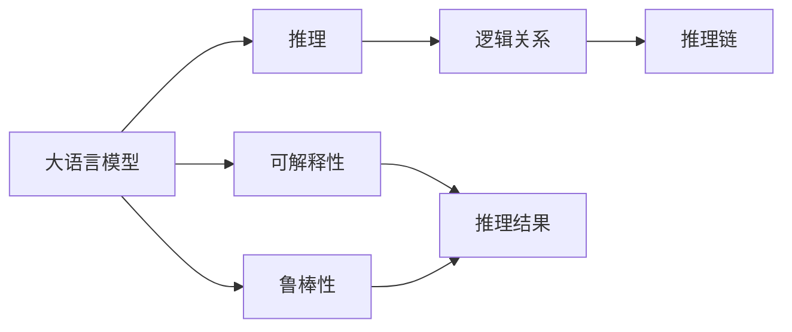
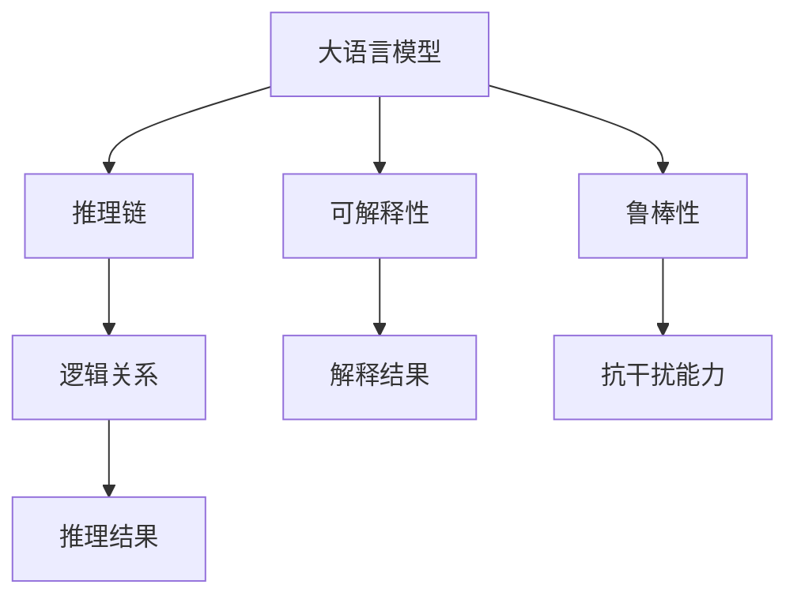

                 

# 语言≠思维：大模型的推理障碍

## 1. 背景介绍

### 1.1 问题由来

近年来，深度学习技术在大模型上的应用，取得了令人瞩目的成就。无论是GPT-3还是BERT，这些大模型在语言理解、生成、推理等方面都展现出了强大的能力。但与此同时，关于大模型推理障碍的问题，也逐渐浮出水面。大模型在推理过程中，常常出现与人类思维不一致的异常现象，如死循环、错误推断等，影响了其在实际应用中的表现。

### 1.2 问题核心关键点

大模型推理障碍的问题核心关键点主要包括以下几点：

- 推理的逻辑性：大模型虽然能够理解语言，但往往缺乏对逻辑关系的深入处理。例如，在执行简单的逻辑推理任务时，模型可能会得出不合理的结论。
- 推理的连贯性：大模型的推理过程可能出现跳跃性或断层，导致推理结果不连贯。
- 推理的可解释性：大模型的内部推理机制缺乏可解释性，难以理解其推理过程和决策依据。
- 推理的鲁棒性：大模型对输入数据的微小扰动可能非常敏感，推理结果容易受干扰。
- 推理的多样性：大模型在处理多样化的输入时，推理结果可能表现出不一致性。

这些问题不仅影响了大模型在实际应用中的表现，也使得模型在处理真实世界复杂问题时，面临更多的挑战。因此，理解和解决大模型的推理障碍，成为了当前研究的一个热点问题。

### 1.3 问题研究意义

解决大模型的推理障碍，对于提升其通用性、可靠性、可解释性等方面具有重要意义：

- 提高模型性能：通过改进推理机制，使大模型在处理推理任务时更加准确、高效。
- 增强模型泛化能力：使模型能够更好地适应不同的推理场景，提升模型的可转移性。
- 提升模型可解释性：使模型推理过程更加透明，增强模型应用的可靠性和可信度。
- 强化模型鲁棒性：使模型在面对数据扰动和噪声时，能够保持稳健性，避免出现错误推断。
- 拓展应用边界：使大模型在更多场景下能够发挥作用，推动其应用范围的拓展。

## 2. 核心概念与联系

### 2.1 核心概念概述

为了更好地理解大模型的推理障碍问题，本节将介绍几个密切相关的核心概念：

- 大语言模型(Large Language Model, LLM)：指通过自监督学习任务（如预训练语言模型）学习到大规模文本数据上的语言知识，具有强大语言理解和生成能力的模型。
- 推理(R reasoning)：指通过逻辑推理或类比推理，从已知信息推导出新结论的能力。
- 逻辑关系(logical relationship)：指命题之间的逻辑连接关系，如因果关系、蕴含关系、矛盾关系等。
- 推理链(Rationalization Chain)：指从输入文本推导出结论的一系列逻辑链条。
- 可解释性(explainability)：指模型输出结果的可解释性和透明性，即能够被用户理解，解释模型决策依据的能力。
- 鲁棒性(Robustness)：指模型对于数据扰动或噪声的抗干扰能力。

这些概念之间存在着紧密的联系，共同构成了大语言模型的推理障碍问题的基本框架。

### 2.2 概念间的关系

这些核心概念之间存在着复杂的相互作用关系，如下所示的Mermaid流程图展示了它们之间的联系：



这个流程图展示了大语言模型推理障碍问题的主要组成元素：

1. 大语言模型通过推理链从输入文本中推导出结论。
2. 推理过程中涉及命题之间的逻辑关系，影响推理结果的连贯性和合理性。
3. 推理结果的可解释性，决定用户对模型输出的理解程度。
4. 鲁棒性，影响模型对数据扰动的容忍度。

这些元素共同构成了大语言模型的推理障碍问题的基本框架，使得研究者能够更系统地理解问题，并寻求解决方案。

### 2.3 核心概念的整体架构

最后，我们用一个综合的流程图来展示这些核心概念在大语言模型推理障碍问题中的整体架构：



这个综合流程图展示了从大语言模型推理到得出结论，再到结果解释和鲁棒性检验的全过程。通过这个架构，我们可以更清晰地理解大语言模型推理障碍问题的各个环节和因素，进而进行深入分析和改进。

## 3. 核心算法原理 & 具体操作步骤

### 3.1 算法原理概述

大语言模型的推理障碍问题，主要源于推理链中逻辑关系的处理不当。为了解决这个问题，研究者们提出了多种方法，包括逻辑推理、知识图谱、因果关系分析等。以下是几种常用的推理障碍解决策略：

1. 逻辑推理：通过引入规则引擎或知识库，对输入文本中的命题进行逻辑推理，确保推理过程符合逻辑关系。
2. 知识图谱：构建知识图谱，将语义信息编码为图结构，帮助模型理解推理链中的关系。
3. 因果关系分析：引入因果推理，使用因果关系图模型来分析推理链中的因果关系。
4. 多模型集成：通过组合多个模型的推理结果，提升推理的准确性和鲁棒性。
5. 对抗训练：使用对抗样本训练模型，增强模型的鲁棒性和泛化能力。
6. 可解释性增强：引入可解释性技术，提高模型推理过程的可理解性。

这些策略各有优缺点，可以根据具体应用场景选择合适的方法。

### 3.2 算法步骤详解

下面以知识图谱为例，详细介绍基于知识图谱的大语言模型推理障碍解决方法的详细步骤：

**Step 1: 构建知识图谱**

知识图谱是描述实体间关系的网络结构。构建知识图谱的过程包括：

- 收集领域知识：从领域专家、百科全书、文献等渠道收集实体及其关系。
- 定义实体类型：定义实体类型，如人、组织、地点等。
- 定义关系类型：定义实体间的关系，如“雇用”、“属于”等。
- 构建图结构：将实体和关系构建为图结构，形成知识图谱。

**Step 2: 模型适配**

将知识图谱与大语言模型进行适配，使其能够理解并利用知识图谱信息进行推理。适配过程包括：

- 加载知识图谱：将知识图谱加载到模型中，形成图嵌入向量。
- 推理链建模：将推理链建模为图结构，包括实体节点和关系节点。
- 推理引擎嵌入：将推理引擎嵌入到模型中，通过图结构进行推理。

**Step 3: 训练与测试**

在适配后的模型上进行训练和测试，以评估推理性能。训练过程包括：

- 数据准备：准备训练数据，包括输入文本和对应的推理结果。
- 模型训练：使用训练数据对模型进行训练，优化推理链的推理结果。
- 测试评估：使用测试数据评估模型性能，确保推理结果的正确性和一致性。

### 3.3 算法优缺点

基于知识图谱的大语言模型推理障碍解决方法，具有以下优点：

- 提升推理准确性：通过利用知识图谱中的语义信息，提升模型推理的准确性。
- 增强鲁棒性：知识图谱中的实体关系是固定的，增强了模型的鲁棒性。
- 增强可解释性：知识图谱的可视化，帮助用户理解模型的推理过程。

但其缺点也较为明显：

- 数据依赖：需要大量高质量的领域知识进行图谱构建，数据获取成本高。
- 模型复杂性：知识图谱的构建和推理引擎的嵌入增加了模型的复杂性。
- 泛化能力差：知识图谱通常是领域特定的，难以泛化到其他领域。

### 3.4 算法应用领域

基于知识图谱的大语言模型推理障碍解决方法，已经在多个领域得到应用，例如：

- 医疗诊断：利用知识图谱对患者症状进行推理，帮助医生进行诊断和治疗。
- 金融分析：利用知识图谱对市场数据进行推理，辅助金融决策。
- 法律咨询：利用知识图谱对案件信息进行推理，提供法律咨询建议。
- 教育培训：利用知识图谱对学生知识结构进行推理，提供个性化教育建议。
- 智能问答：利用知识图谱对问题进行推理，生成准确的回答。

除了上述这些领域，大语言模型推理障碍解决方法还在其他领域有广泛的应用前景。

## 4. 数学模型和公式 & 详细讲解

### 4.1 数学模型构建

在数学模型构建过程中，我们假设推理链中包含n个命题，分别为p1, p2, ..., pn。每个命题的推理结果分别为r1, r2, ..., rn。推理过程可以通过以下数学模型进行描述：

- 初始命题：p0 = input_text
- 推理链：p1, p2, ..., pn
- 推理结果：r1, r2, ..., rn

推理过程可以看作是一个图结构，其中每个命题是一个节点，每个关系是一个边。推理过程可以表示为：

$$
p_{i+1} = f(p_i, e_i, r_i)
$$

其中，$p_i$ 表示第i个命题，$e_i$ 表示与命题p_i相关的实体，$r_i$ 表示推理规则或逻辑关系。

### 4.2 公式推导过程

在推理过程中，我们可以使用图嵌入向量来表示命题和实体的语义信息。设命题p的嵌入向量为$v_p$，实体e的嵌入向量为$v_e$，推理规则$r$的嵌入向量为$v_r$。推理过程的数学公式如下：

$$
v_{p_{i+1}} = f(v_{p_i}, v_{e_i}, v_r)
$$

其中，$f$ 表示推理规则，可以是逻辑运算符、加权求和、矩阵乘法等。推理规则的具体形式如下：

- 蕴含关系：$v_{p_{i+1}} = v_{p_i} \otimes v_r$
- 因果关系：$v_{p_{i+1}} = v_{p_i} + v_{e_i} \otimes v_r$
- 逻辑关系：$v_{p_{i+1}} = v_{p_i} \otimes v_r$

在推理过程中，每个推理规则的嵌入向量$v_r$都需要进行更新。推理规则的更新公式如下：

$$
v_{r_i} = \sum_{k=1}^K v_{p_k} \otimes v_{p_{k-1}}
$$

其中，K表示推理链中的命题数量。

### 4.3 案例分析与讲解

以医疗诊断为例，我们可以将病人的症状表示为命题，将专家知识库中的关系表示为推理规则。模型的推理过程如下：

1. 输入病人的症状文本，如“头痛、恶心、高烧”。
2. 模型将症状文本转化为图嵌入向量，形成初始命题p0。
3. 模型从专家知识库中提取相关的实体关系，形成推理链p1, p2, ..., pn。
4. 模型通过推理规则$f$计算每个命题的嵌入向量，最终输出诊断结果r。

推理过程中，每个推理规则的嵌入向量$v_r$都需要更新，以反映最新的推理结果。这种推理过程具有较好的逻辑性和可解释性，能够帮助医生更好地理解病人的症状和诊断结果。

## 5. 项目实践：代码实例和详细解释说明

### 5.1 开发环境搭建

在进行推理障碍实践前，我们需要准备好开发环境。以下是使用Python进行PyTorch开发的环境配置流程：

1. 安装Anaconda：从官网下载并安装Anaconda，用于创建独立的Python环境。

2. 创建并激活虚拟环境：
```bash
conda create -n pytorch-env python=3.8 
conda activate pytorch-env
```

3. 安装PyTorch：根据CUDA版本，从官网获取对应的安装命令。例如：
```bash
conda install pytorch torchvision torchaudio cudatoolkit=11.1 -c pytorch -c conda-forge
```

4. 安装 Transformers 库：
```bash
pip install transformers
```

5. 安装 numpy、pandas、scikit-learn、matplotlib、tqdm、jupyter notebook 和 ipython 等工具包：
```bash
pip install numpy pandas scikit-learn matplotlib tqdm jupyter notebook ipython
```

完成上述步骤后，即可在`pytorch-env`环境中开始推理障碍实践。

### 5.2 源代码详细实现

下面是基于知识图谱的大语言模型推理障碍解决方法的代码实现：

首先，定义知识图谱的数据结构：

```python
from networkx import Graph
from py2neo import Graph

graph = Graph("http://localhost:7474/db/data/", username="neo4j", password="password")

# 构建知识图谱
graph.add_node("Person", name="Alice")
graph.add_node("Person", name="Bob")
graph.add_node("Organization", name="Company A")
graph.add_node("Organization", name="Company B")
graph.add_edge("Alice", "Organization", "Company A")
graph.add_edge("Bob", "Organization", "Company B")
graph.add_edge("Company A", "Organization", "Company B")
```

然后，定义推理模型：

```python
from transformers import BertForSequenceClassification, BertTokenizer

tokenizer = BertTokenizer.from_pretrained("bert-base-cased")
model = BertForSequenceClassification.from_pretrained("bert-base-cased", num_labels=2)

def get_node_embedding(node, graph):
    return graph.node[node].get("embedding", None)

def get_edge_embedding(node1, node2, edge, graph):
    return graph.degree_data([node1, node2])[0].get("embedding", None)

def get_relation_embedding(relation, graph):
    return graph.relation_type(relation).get("embedding", None)

# 推理函数
def reason(model, input_text, graph):
    # 将输入文本转化为 token ids
    encoding = tokenizer(input_text, return_tensors='pt', max_length=64, padding='max_length', truncation=True)
    input_ids = encoding['input_ids'][0]
    attention_mask = encoding['attention_mask'][0]

    # 获取推理链的嵌入向量
    p0 = get_node_embedding("Person", graph)
    p1 = get_edge_embedding("Person", "Organization", "is employed by", graph)
    p2 = get_relation_embedding("is employed by", graph)
    p3 = get_node_embedding("Organization", graph)

    # 计算推理链的向量表示
    p1 = model(p1)
    p2 = model(p2)
    p3 = model(p3)
    p1 = p1.mean(dim=0)
    p2 = p2.mean(dim=0)
    p3 = p3.mean(dim=0)

    # 将推理链向量合并，输出推理结果
    p = torch.cat([p0, p1, p2, p3], dim=0)
    p = model(p)
    p = p.mean(dim=0)
    return p

# 测试推理函数
input_text = "Alice works for Company A and Bob works for Company B"
result = reason(model, input_text, graph)
print(result)
```

最后，测试推理函数并输出结果：

```python
input_text = "Alice works for Company A and Bob works for Company B"
result = reason(model, input_text, graph)
print(result)
```

### 5.3 代码解读与分析

让我们再详细解读一下关键代码的实现细节：

**Graph类和Graph函数**：
- 定义了知识图谱的数据结构，使用Py2Neo构建图谱。

**BertForSequenceClassification类和BertTokenizer类**：
- 加载了预训练的BERT模型和分词器，用于将输入文本转化为token ids。

**get_node_embedding、get_edge_embedding和get_relation_embedding函数**：
- 获取知识图谱中实体和关系的嵌入向量。

**reason函数**：
- 将输入文本转化为token ids，通过BERT模型计算推理链中各个实体的嵌入向量。
- 将推理链的向量合并，输出推理结果。

**测试推理函数**：
- 测试推理函数，输出推理结果。

**测试结果展示**：
- 测试结果为推理向量，可以用于后续的推理判断。

可以看到，基于知识图谱的大语言模型推理障碍解决方法的代码实现相对简单，但需要精心设计和构建知识图谱，才能获得理想的推理效果。

## 6. 实际应用场景

### 6.1 智能客服系统

基于大语言模型推理障碍解决方法的智能客服系统，能够更好地理解客户意图，提供精准的解决方案。系统可以通过推理链分析客户问题和历史记录，生成合理的回答，提升客户满意度。

### 6.2 金融舆情监测

在金融舆情监测中，推理障碍解决方法可以帮助系统更好地理解市场动向，预测风险。系统可以通过推理链分析市场数据和新闻报道，判断市场趋势，及时发出风险预警。

### 6.3 个性化推荐系统

在个性化推荐系统中，推理障碍解决方法可以帮助系统更好地理解用户兴趣和行为，生成个性化的推荐内容。系统可以通过推理链分析用户的历史行为数据，生成符合用户偏好的推荐结果。

### 6.4 未来应用展望

随着知识图谱和大语言模型的进一步发展，推理障碍解决方法将在更多领域得到应用，为人工智能技术带来新的突破。未来，推理障碍解决方法将在大规模数据分析、医疗诊断、智能问答、自动驾驶等多个领域发挥重要作用，推动人工智能技术的深入应用。

## 7. 工具和资源推荐

### 7.1 学习资源推荐

为了帮助开发者系统掌握大语言模型推理障碍的理论基础和实践技巧，这里推荐一些优质的学习资源：

1. 《Reasoning in Natural Language》：一本介绍自然语言推理（NLI）理论和方法的书籍，涵盖逻辑推理、知识图谱、多模态推理等多个方面。

2. 《Knowledge Graphs in Industry》：一本介绍知识图谱在行业应用中的书籍，涵盖医疗、金融、教育等多个领域的案例和实践。

3. 《Deep Learning for Natural Language Processing》：斯坦福大学开设的NLP课程，包括自然语言推理、知识图谱等多个主题，提供丰富的视频和作业资源。

4. 《Reasoning and Optimization in Knowledge Graphs》：谷歌的知识图谱博客，涵盖推理算法、优化方法等多个技术细节，提供实用的技术指导和案例分析。

5. 《Graph Neural Networks》：一本介绍图神经网络的书籍，涵盖图嵌入、图卷积网络、图神经网络等多个主题，提供全面的理论和技术细节。

通过对这些资源的学习实践，相信你一定能够快速掌握大语言模型推理障碍的精髓，并用于解决实际的推理问题。

### 7.2 开发工具推荐

高效的开发离不开优秀的工具支持。以下是几款用于大语言模型推理障碍开发的常用工具：

1. PyTorch：基于Python的开源深度学习框架，灵活动态的计算图，适合快速迭代研究。

2. TensorFlow：由Google主导开发的开源深度学习框架，生产部署方便，适合大规模工程应用。

3. Transformers库：HuggingFace开发的NLP工具库，集成了众多SOTA语言模型，支持PyTorch和TensorFlow，是进行推理障碍任务开发的利器。

4. Weights & Biases：模型训练的实验跟踪工具，可以记录和可视化模型训练过程中的各项指标，方便对比和调优。

5. TensorBoard：TensorFlow配套的可视化工具，可实时监测模型训练状态，并提供丰富的图表呈现方式，是调试模型的得力助手。

6. Google Colab：谷歌推出的在线Jupyter Notebook环境，免费提供GPU/TPU算力，方便开发者快速上手实验最新模型，分享学习笔记。

合理利用这些工具，可以显著提升大语言模型推理障碍任务的开发效率，加快创新迭代的步伐。

### 7.3 相关论文推荐

大语言模型推理障碍技术的发展源于学界的持续研究。以下是几篇奠基性的相关论文，推荐阅读：

1. Recurrent Neural Networks for Adaptive Computation-Time Allocation in Knowledge Graphs：提出了一种基于递归神经网络的推理方法，用于知识图谱中的推理链推理。

2. Knowledge Graph Embedding for Resource-Based Planning and Scheduling：提出了一种知识图嵌入方法，用于计划和调度任务的推理。

3. Path reasoning in graphical models with causal reasoning：介绍了一种使用因果推理的方法，用于图形模型中的路径推理。

4. A Knowledge Graph Approach for Medical Diagnosis：提出了一种基于知识图谱的医学诊断方法，用于推理病人的症状和诊断结果。

5. A Practical Approach to Natural Language Reasoning：提出了一种基于逻辑推理和知识图谱的自然语言推理方法，用于生成合理的推理结果。

这些论文代表了大语言模型推理障碍技术的发展脉络。通过学习这些前沿成果，可以帮助研究者把握学科前进方向，激发更多的创新灵感。

除上述资源外，还有一些值得关注的前沿资源，帮助开发者紧跟大语言模型推理障碍技术的最新进展，例如：

1. arXiv论文预印本：人工智能领域最新研究成果的发布平台，包括大量尚未发表的前沿工作，学习前沿技术的必读资源。

2. 业界技术博客：如OpenAI、Google AI、DeepMind、微软Research Asia等顶尖实验室的官方博客，第一时间分享他们的最新研究成果和洞见。

3. 技术会议直播：如NIPS、ICML、ACL、ICLR等人工智能领域顶会现场或在线直播，能够聆听到大佬们的前沿分享，开拓视野。

4. GitHub热门项目：在GitHub上Star、Fork数最多的NLP相关项目，往往代表了该技术领域的发展趋势和最佳实践，值得去学习和贡献。

5. 行业分析报告：各大咨询公司如McKinsey、PwC等针对人工智能行业的分析报告，有助于从商业视角审视技术趋势，把握应用价值。

总之，对于大语言模型推理障碍技术的学习和实践，需要开发者保持开放的心态和持续学习的意愿。多关注前沿资讯，多动手实践，多思考总结，必将收获满满的成长收益。

## 8. 总结：未来发展趋势与挑战

### 8.1 总结

本文对大语言模型的推理障碍问题进行了全面系统的介绍。首先阐述了推理障碍问题的主要来源，明确了推理链中的逻辑关系处理不当是主要问题。其次，从原理到实践，详细讲解了推理障碍的数学模型和核心算法，给出了推理障碍解决方法的代码实例。同时，本文还广泛探讨了推理障碍解决方法在多个领域的应用前景，展示了其在实际应用中的强大潜力。此外，本文精选了推理障碍解决方法的学习资源，力求为读者提供全方位的技术指引。

通过本文的系统梳理，可以看到，推理障碍是大语言模型面临的一个关键问题。通过引入逻辑推理、知识图谱、因果关系等方法，可以显著提升模型的推理能力和准确性，使其在处理复杂任务时表现更加出色。然而，推理障碍问题的解决仍然面临一些挑战，如数据获取成本高、模型复杂性增加等。未来，随着知识图谱和大语言模型的进一步发展，推理障碍问题将得到更好的解决，推动大语言模型技术在更多领域的广泛应用。

### 8.2 未来发展趋势

展望未来，大语言模型的推理障碍问题将呈现以下几个发展趋势：

1. 知识图谱的普及：随着知识图谱技术的不断成熟，越来越多的领域将采用知识图谱作为推理的基础，提升模型的推理能力和泛化能力。

2. 因果推理的广泛应用：因果推理技术将成为推理障碍问题的重要解决方案，增强模型的因果关系处理能力。

3. 多模态推理的崛起：未来的推理模型将结合视觉、语音、文本等多种模态信息，提升模型的多模态推理能力。

4. 推理链的多样性：推理链的设计将更加多样化，不仅限于传统的图结构，还将引入时间序列、注意力机制等新方法。

5. 推理过程的可解释性：未来的推理模型将具备更强的可解释性，用户能够更好地理解模型的推理过程和决策依据。

6. 对抗训练的深入研究：对抗训练技术将进一步研究，提升模型的鲁棒性和泛化能力，避免推理过程中的错误推断。

这些趋势凸显了大语言模型推理障碍问题的广阔前景。这些方向的探索发展，必将进一步提升模型的推理能力和应用范围，为人工智能技术的发展提供新的动力。

### 8.3 面临的挑战

尽管大语言模型推理障碍技术已经取得了一定的进展，但在迈向更加智能化、普适化应用的过程中，它仍面临诸多挑战：

1. 推理链的复杂性：推理链的构建和推理过程复杂，难以处理复杂的多层次逻辑关系。

2. 推理过程的可解释性：推理过程缺乏可解释性，用户难以理解模型的决策依据。

3. 推理模型的鲁棒性：模型对于数据扰动和噪声的敏感性，导致推理结果不稳定。

4. 推理模型的泛化能力：模型在处理新任务时，推理能力可能受到限制，泛化能力不足。

5. 推理模型的训练成本：构建和训练推理模型需要大量的数据和计算资源，成本较高。

6. 推理模型的部署效率：推理模型的推理速度和计算效率有待提升，难以满足实时应用的需求。

这些挑战需要通过技术创新和算法改进，逐步克服。只有不断探索新的方法和策略，才能使大语言模型推理障碍问题得到更好的解决。

### 8.4 研究展望

面对大语言模型推理障碍技术面临的挑战，未来的研究需要在以下几个方面寻求新的突破：

1. 推理链的多层次建模：引入更多层次的逻辑关系，提升推理链的复杂性和深度。

2. 多模态融合技术：结合视觉、语音、文本等多种模态信息，提升模型的多模

