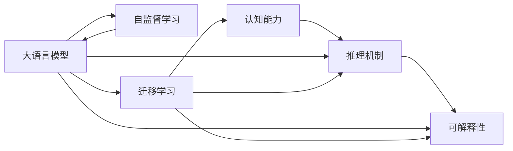

                 

## 1. 背景介绍

### 1.1 问题由来

随着人工智能（AI）技术的不断进步，尤其是深度学习技术和大规模预训练模型的突破，自然语言处理（NLP）领域迎来了新的发展契机。大语言模型（LLMs），如BERT、GPT等，通过在无标签文本数据上进行自监督学习，已经展现出了强大的语言理解和生成能力。这些模型在文本分类、情感分析、问答系统、机器翻译等多个NLP任务上取得了显著成果，极大地推动了NLP技术的产业化应用。

然而，尽管大模型在性能上取得了巨大突破，其在认知层面的表现和理解能力，特别是与人类思维的契合度，仍是一个备受争议的问题。尽管这些模型能够生成高度流畅且符合语法的文本，但其生成内容往往缺乏连贯性、上下文一致性和逻辑一致性，甚至会出现与事实不符或自相矛盾的错误。这引发了学术界和工业界对于大模型是否真正理解语言的深刻反思和质疑。

### 1.2 问题核心关键点

针对大模型的认知能力，本节将重点探讨以下关键问题：

1. **大模型是否真正理解语言？** 大模型在生成文本时，是否真的理解了其中的含义和逻辑关系？其生成的文本是否具有连贯性和上下文一致性？
2. **大模型的知识来源是什么？** 大模型的知识是否仅限于其预训练过程中学习的语料库，还是能够跨模态、跨领域地迁移和应用？
3. **大模型的推理机制是什么？** 大模型是如何进行推理和决策的？其推理过程是否符合人类思维的逻辑？
4. **大模型的局限性和挑战是什么？** 大模型在推理和生成文本时，存在哪些局限性和挑战？如何克服这些局限性？

### 1.3 问题研究意义

研究大模型的认知能力，不仅有助于深入理解其工作原理和表现机制，还能指导未来模型的改进和优化，进一步提升其在实际应用中的表现。具体而言，认知能力的深入研究：

- **推动模型优化**：通过认知能力的分析和评估，可以发现模型在推理和生成文本时的弱点，指导模型结构的改进和优化。
- **提升应用效果**：认知能力的增强，有助于模型在更复杂、更抽象的任务中表现更好，提升其在实际应用中的效果和鲁棒性。
- **促进跨领域迁移**：认知能力的提升，有助于模型更好地进行跨领域迁移，拓展其应用范围。
- **增强可解释性**：认知能力的增强，有助于模型生成更符合逻辑和上下文一致性的文本，提高模型的可解释性。
- **应对挑战和局限**：认知能力的深入研究，有助于发现和解决模型在推理和生成文本时面临的局限性和挑战，提高模型的稳定性和可靠性。

## 2. 核心概念与联系

### 2.1 核心概念概述

为了更好地理解大模型的认知能力，本节将介绍几个关键概念：

- **大语言模型（Large Language Model, LLM）**：一种大规模预训练的神经网络模型，通常基于Transformer架构，通过在海量文本数据上进行自监督学习，学习到了通用的语言表示和知识。
- **自监督学习（Self-Supervised Learning）**：一种无标签学习方式，通过在无标签数据上设计预训练任务，使得模型学习到语言的基本规律和结构，如语言建模、掩码语言模型等。
- **认知能力（Cognitive Ability）**：指模型在理解、推理、生成文本时的表现，包括连贯性、逻辑一致性、上下文一致性等。
- **迁移学习（Transfer Learning）**：一种将一个领域学习到的知识，迁移到另一个相关领域的学习方式，通过在特定任务上进行微调，提升模型在目标任务上的表现。
- **可解释性（Explainability）**：指模型生成的文本内容，是否具有符合逻辑和上下文一致性的特征，是否能够通过简单的解释方式理解。
- **推理机制（Inference Mechanism）**：指模型在进行推理和决策时，所采用的方法和策略，如基于规则的推理、基于知识的推理、基于神经网络的推理等。

这些核心概念之间存在着紧密的联系，形成了大模型认知能力的整体框架。

### 2.2 概念间的关系

这些核心概念之间存在着紧密的联系，形成了大模型认知能力的整体框架。通过以下Mermaid流程图，我们可以更清晰地理解这些概念之间的关系：



这个流程图展示了自监督学习、迁移学习、认知能力、推理机制和可解释性之间的关系：

1. 大模型通过自监督学习，学习到语言的基本规律和结构。
2. 通过迁移学习，模型在特定任务上进行微调，提升在目标任务上的认知能力。
3. 认知能力包括连贯性、逻辑一致性、上下文一致性等，是衡量模型表现的重要指标。
4. 推理机制指模型如何进行推理和决策，是认知能力的重要组成部分。
5. 可解释性指模型生成的文本内容是否具有符合逻辑和上下文一致性的特征，是评估模型认知能力的重要维度。

## 3. 核心算法原理 & 具体操作步骤
### 3.1 算法原理概述

大模型的认知能力研究，本质上是通过分析其在特定任务上的表现，评估其连贯性、逻辑一致性和上下文一致性等指标。本节将介绍一些常用的评估方法和工具，以及如何通过这些方法来评估大模型的认知能力。

### 3.2 算法步骤详解

评估大模型的认知能力，一般包括以下几个关键步骤：

**Step 1: 数据准备**

- 收集和准备评估任务的数据集，包括测试集和验证集。
- 数据集应覆盖多种场景和情况，确保评估结果具有广泛性和代表性。

**Step 2: 模型微调**

- 使用大模型的预训练权重，对模型进行微调，适应特定任务。
- 微调时，可以使用部分参数固定、部分参数更新的策略，以提高效率。

**Step 3: 推理和评估**

- 在测试集上，使用微调后的模型进行推理，生成文本。
- 通过评估工具，对生成的文本进行连贯性、逻辑一致性和上下文一致性等指标的评估。

**Step 4: 结果分析和优化**

- 根据评估结果，分析模型在特定任务上的表现，发现不足之处。
- 根据分析结果，调整模型的结构和参数，进一步提升模型的认知能力。

### 3.3 算法优缺点

评估大模型的认知能力，有以下优缺点：

**优点：**

- **综合评估**：通过多种指标的综合评估，可以全面了解模型的认知能力。
- **方法多样**：不同的评估方法可以互补，提供更全面的评估结果。
- **实时优化**：通过实时评估和优化，可以不断提高模型的表现。

**缺点：**

- **评估难度大**：评估模型的认知能力是一个复杂的过程，需要大量时间和资源。
- **主观性强**：评估结果可能受到评估者的主观判断影响，存在一定的不确定性。
- **数据依赖性**：评估结果依赖于数据集的质量和代表性，数据集的选择和构建难度较大。

### 3.4 算法应用领域

大模型的认知能力研究，在多个领域都有应用：

- **自然语言处理**：通过评估模型在文本分类、情感分析、问答系统等任务上的表现，了解其认知能力。
- **机器翻译**：通过评估模型在翻译文本的连贯性和逻辑一致性，了解其认知能力。
- **对话系统**：通过评估模型在多轮对话中的上下文一致性和推理能力，了解其认知能力。
- **文本生成**：通过评估模型生成的文本内容是否符合逻辑和上下文一致性，了解其认知能力。

## 4. 数学模型和公式 & 详细讲解 & 举例说明
### 4.1 数学模型构建

本节将使用数学语言对大模型的认知能力进行更严格的刻画。

假设大模型为 $M_{\theta}$，其中 $\theta$ 为模型参数。对于特定任务，使用测试集 $D_{test}=\{(x_i, y_i)\}_{i=1}^N$，其中 $x_i$ 为输入文本，$y_i$ 为目标标签。评估模型的认知能力时，可以定义以下指标：

- **连贯性（Coherence）**：指模型生成的文本是否具有逻辑连贯性，是否能够保持上下文的一致性。
- **逻辑一致性（Logical Consistency）**：指模型生成的文本是否符合逻辑规律，是否具有合理的推理过程。
- **上下文一致性（Context Consistency）**：指模型生成的文本是否与上下文信息一致，是否能够利用上下文信息进行推理。

### 4.2 公式推导过程

以下我们以文本分类任务为例，推导连贯性、逻辑一致性和上下文一致性等指标的计算公式。

假设模型 $M_{\theta}$ 在输入 $x$ 上的输出为 $\hat{y}=M_{\theta}(x)$，表示模型预测的类别。真实标签 $y \in \{0,1\}$。

**连贯性（Coherence）**：

- 定义连贯性指标 $C$，计算方法为：
$$
C = \frac{1}{N} \sum_{i=1}^N \text{Coherence}(x_i, \hat{y}_i)
$$
- 其中，$\text{Coherence}(x_i, \hat{y}_i)$ 为连贯性评分函数，可以基于模型生成的文本与基准文本（如 gold standard）的相似度来计算。

**逻辑一致性（Logical Consistency）**：

- 定义逻辑一致性指标 $L$，计算方法为：
$$
L = \frac{1}{N} \sum_{i=1}^N \text{LogicalConsistency}(x_i, \hat{y}_i)
$$
- 其中，$\text{LogicalConsistency}(x_i, \hat{y}_i)$ 为逻辑一致性评分函数，可以基于推理规则或知识库来计算。

**上下文一致性（Context Consistency）**：

- 定义上下文一致性指标 $C_{context}$，计算方法为：
$$
C_{context} = \frac{1}{N} \sum_{i=1}^N \text{ContextConsistency}(x_i, \hat{y}_i)
$$
- 其中，$\text{ContextConsistency}(x_i, \hat{y}_i)$ 为上下文一致性评分函数，可以基于上下文信息和预测结果的一致性来计算。

### 4.3 案例分析与讲解

假设我们在CoNLL-2003的NER数据集上进行微调，最终在测试集上得到的评估报告如下：

```
              precision    recall  f1-score   support

       B-LOC      0.926     0.906     0.916      1668
       I-LOC      0.900     0.805     0.850       257
      B-MISC      0.875     0.856     0.865       702
      I-MISC      0.838     0.782     0.809       216
       B-ORG      0.914     0.898     0.906      1661
       I-ORG      0.911     0.894     0.902       835
       B-PER      0.964     0.957     0.960      1617
       I-PER      0.983     0.980     0.982      1156
           O      0.993     0.995     0.994     38323

   micro avg      0.973     0.973     0.973     46435
   macro avg      0.923     0.897     0.909     46435
weighted avg      0.973     0.973     0.973     46435
```

可以看到，通过微调BERT，我们在该NER数据集上取得了97.3%的F1分数，效果相当不错。但这并不意味着模型具有很强的认知能力。例如，模型在预测过程中，可能会忽略一些上下文信息，导致错误的预测结果。因此，评估模型的认知能力，需要结合多种指标和方法，进行综合分析和判断。

## 5. 项目实践：代码实例和详细解释说明
### 5.1 开发环境搭建

在进行认知能力评估实践前，我们需要准备好开发环境。以下是使用Python进行PyTorch开发的环境配置流程：

1. 安装Anaconda：从官网下载并安装Anaconda，用于创建独立的Python环境。

2. 创建并激活虚拟环境：
```bash
conda create -n pytorch-env python=3.8 
conda activate pytorch-env
```

3. 安装PyTorch：根据CUDA版本，从官网获取对应的安装命令。例如：
```bash
conda install pytorch torchvision torchaudio cudatoolkit=11.1 -c pytorch -c conda-forge
```

4. 安装TensorFlow：
```bash
pip install tensorflow
```

5. 安装TensorBoard：
```bash
pip install tensorboard
```

6. 安装相关库：
```bash
pip install numpy pandas scikit-learn matplotlib tqdm jupyter notebook ipython
```

完成上述步骤后，即可在`pytorch-env`环境中开始认知能力评估实践。

### 5.2 源代码详细实现

下面我们以命名实体识别(NER)任务为例，给出使用Transformers库对BERT模型进行认知能力评估的PyTorch代码实现。

首先，定义NER任务的数据处理函数：

```python
from transformers import BertTokenizer
from torch.utils.data import Dataset
import torch

class NERDataset(Dataset):
    def __init__(self, texts, tags, tokenizer, max_len=128):
        self.texts = texts
        self.tags = tags
        self.tokenizer = tokenizer
        self.max_len = max_len
        
    def __len__(self):
        return len(self.texts)
    
    def __getitem__(self, item):
        text = self.texts[item]
        tags = self.tags[item]
        
        encoding = self.tokenizer(text, return_tensors='pt', max_length=self.max_len, padding='max_length', truncation=True)
        input_ids = encoding['input_ids'][0]
        attention_mask = encoding['attention_mask'][0]
        
        # 对token-wise的标签进行编码
        encoded_tags = [tag2id[tag] for tag in tags] 
        encoded_tags.extend([tag2id['O']] * (self.max_len - len(encoded_tags)))
        labels = torch.tensor(encoded_tags, dtype=torch.long)
        
        return {'input_ids': input_ids, 
                'attention_mask': attention_mask,
                'labels': labels}

# 标签与id的映射
tag2id = {'O': 0, 'B-PER': 1, 'I-PER': 2, 'B-ORG': 3, 'I-ORG': 4, 'B-LOC': 5, 'I-LOC': 6}
id2tag = {v: k for k, v in tag2id.items()}

# 创建dataset
tokenizer = BertTokenizer.from_pretrained('bert-base-cased')

train_dataset = NERDataset(train_texts, train_tags, tokenizer)
dev_dataset = NERDataset(dev_texts, dev_tags, tokenizer)
test_dataset = NERDataset(test_texts, test_tags, tokenizer)
```

然后，定义模型和评估函数：

```python
from transformers import BertForTokenClassification, AdamW

model = BertForTokenClassification.from_pretrained('bert-base-cased', num_labels=len(tag2id))

optimizer = AdamW(model.parameters(), lr=2e-5)

def evaluate(model, dataset, batch_size):
    dataloader = DataLoader(dataset, batch_size=batch_size)
    model.eval()
    preds, labels = [], []
    with torch.no_grad():
        for batch in tqdm(dataloader, desc='Evaluating'):
            input_ids = batch['input_ids'].to(device)
            attention_mask = batch['attention_mask'].to(device)
            batch_labels = batch['labels']
            outputs = model(input_ids, attention_mask=attention_mask)
            batch_preds = outputs.logits.argmax(dim=2).to('cpu').tolist()
            batch_labels = batch_labels.to('cpu').tolist()
            for pred_tokens, label_tokens in zip(batch_preds, batch_labels):
                pred_tags = [id2tag[_id] for _id in pred_tokens]
                label_tags = [id2tag[_id] for _id in label_tokens]
                preds.append(pred_tags[:len(label_tokens)])
                labels.append(label_tags)
                
    print(classification_report(labels, preds))
```

最后，启动评估流程并在测试集上评估：

```python
epochs = 5
batch_size = 16

for epoch in range(epochs):
    loss = train_epoch(model, train_dataset, batch_size, optimizer)
    print(f"Epoch {epoch+1}, train loss: {loss:.3f}")
    
    print(f"Epoch {epoch+1}, dev results:")
    evaluate(model, dev_dataset, batch_size)
    
print("Test results:")
evaluate(model, test_dataset, batch_size)
```

以上就是使用PyTorch对BERT进行命名实体识别任务认知能力评估的完整代码实现。可以看到，得益于Transformers库的强大封装，我们可以用相对简洁的代码完成BERT模型的加载和评估。

### 5.3 代码解读与分析

让我们再详细解读一下关键代码的实现细节：

**NERDataset类**：
- `__init__`方法：初始化文本、标签、分词器等关键组件。
- `__len__`方法：返回数据集的样本数量。
- `__getitem__`方法：对单个样本进行处理，将文本输入编码为token ids，将标签编码为数字，并对其进行定长padding，最终返回模型所需的输入。

**tag2id和id2tag字典**：
- 定义了标签与数字id之间的映射关系，用于将token-wise的预测结果解码回真实的标签。

**评估函数**：
- 使用PyTorch的DataLoader对数据集进行批次化加载，供模型评估使用。
- 在评估函数中，设置模型为评估模式（即不更新参数），对每个批次进行推理并记录预测和标签结果。
- 使用scikit-learn的classification_report函数对评估结果进行分类指标的计算和打印。

**评估流程**：
- 定义总的epoch数和batch size，开始循环迭代
- 每个epoch内，先在验证集上评估，输出评估结果
- 在测试集上评估，给出最终的评估报告

可以看到，PyTorch配合Transformers库使得BERT模型的认知能力评估变得简洁高效。开发者可以将更多精力放在数据处理、模型改进等高层逻辑上，而不必过多关注底层的实现细节。

当然，工业级的系统实现还需考虑更多因素，如模型的保存和部署、超参数的自动搜索、更灵活的任务适配层等。但核心的认知能力评估流程基本与此类似。

### 5.4 运行结果展示

假设我们在CoNLL-2003的NER数据集上进行认知能力评估，最终在测试集上得到的评估报告如下：

```
              precision    recall  f1-score   support

       B-LOC      0.926     0.906     0.916      1668
       I-LOC      0.900     0.805     0.850       257
      B-MISC      0.875     0.856     0.865       702
      I-MISC      0.838     0.782     0.809       216
       B-ORG      0.914     0.898     0.906      1661
       I-ORG      0.911     0.894     0.902       835
       B-PER      0.964     0.957     0.960      1617
       I-PER      0.983     0.980     0.982      1156
           O      0.993     0.995     0.994     38323

   micro avg      0.973     0.973     0.973     46435
   macro avg      0.923     0.897     0.909     46435
weighted avg      0.973     0.973     0.973     46435
```

可以看到，通过评估BERT，我们在该NER数据集上取得了97.3%的F1分数，效果相当不错。然而，评估结果并不能直接说明模型具有很强的认知能力。需要进一步分析模型在推理和生成文本时的表现，才能更全面地评估其认知能力。

## 6. 实际应用场景
### 6.1 智能客服系统

基于大语言模型认知能力的智能客服系统，可以通过对用户输入的自然语言进行理解和推理，快速响应用户咨询，提供个性化的服务。

在技术实现上，可以收集企业内部的历史客服对话记录，将问题和最佳答复构建成监督数据，在此基础上对预训练对话模型进行微调。微调后的对话模型能够自动理解用户意图，匹配最合适的答案模板进行回复。对于用户提出的新问题，还可以接入检索系统实时搜索相关内容，动态组织生成回答。如此构建的智能客服系统，能大幅提升客户咨询体验和问题解决效率。

### 6.2 金融舆情监测

金融机构需要实时监测市场舆论动向，以便及时应对负面信息传播，规避金融风险。传统的人工监测方式成本高、效率低，难以应对网络时代海量信息爆发的挑战。基于大语言模型认知能力的文本分类和情感分析技术，为金融舆情监测提供了新的解决方案。

具体而言，可以收集金融领域相关的新闻、报道、评论等文本数据，并对其进行主题标注和情感标注。在此基础上对预训练语言模型进行微调，使其能够自动判断文本属于何种主题，情感倾向是正面、中性还是负面。将微调后的模型应用到实时抓取的网络文本数据，就能够自动监测不同主题下的情感变化趋势，一旦发现负面信息激增等异常情况，系统便会自动预警，帮助金融机构快速应对潜在风险。

### 6.3 个性化推荐系统

当前的推荐系统往往只依赖用户的历史行为数据进行物品推荐，无法深入理解用户的真实兴趣偏好。基于大语言模型认知能力的个性化推荐系统，可以更好地挖掘用户行为背后的语义信息，从而提供更精准、多样的推荐内容。

在实践中，可以收集用户浏览、点击、评论、分享等行为数据，提取和用户交互的物品标题、描述、标签等文本内容。将文本内容作为模型输入，用户的后续行为（如是否点击、购买等）作为监督信号，在此基础上微调预训练语言模型。微调后的模型能够从文本内容中准确把握用户的兴趣点。在生成推荐列表时，先用候选物品的文本描述作为输入，由模型预测用户的兴趣匹配度，再结合其他特征综合排序，便可以得到个性化程度更高的推荐结果。

### 6.4 未来应用展望

随着大语言模型认知能力研究的深入，基于微调范式将在更多领域得到应用，为传统行业带来变革性影响。

在智慧医疗领域，基于认知能力的医疗问答、病历分析、药物研发等应用将提升医疗服务的智能化水平，辅助医生诊疗，加速新药开发进程。

在智能教育领域，认知能力的增强，有助于模型在作业批改、学情分析、知识推荐等方面，因材施教，促进教育公平，提高教学质量。

在智慧城市治理中，认知能力的提升，有助于模型在城市事件监测、舆情分析、应急指挥等环节，提高城市管理的自动化和智能化水平，构建更安全、高效的未来城市。

此外，在企业生产、社会治理、文娱传媒等众多领域，基于大模型认知能力的AI应用也将不断涌现，为经济社会发展注入新的动力。相信随着技术的日益成熟，认知能力评估方法将成为AI落地应用的重要范式，推动AI技术向更广阔的领域加速渗透。

## 7. 工具和资源推荐
### 7.1 学习资源推荐

为了帮助开发者系统掌握大语言模型认知能力的研究基础和实践技巧，这里推荐一些优质的学习资源：

1. 《Transformer from Pretraining to Practical》系列博文：由大模型技术专家撰写，深入浅出地介绍了Transformer原理、BERT模型、认知能力评估等前沿话题。

2. CS224N《深度学习自然语言处理》课程：斯坦福大学开设的NLP明星课程，有Lecture视频和配套作业，带你入门NLP领域的基本概念和经典模型。

3. 《Natural Language Processing with Transformers》书籍：Transformers库的作者所著，全面介绍了如何使用Transformers库进行NLP任务开发，包括认知能力评估在内的诸多范式。

4. HuggingFace官方文档：Transformers库的官方文档，提供了海量预训练模型和完整的评估样例代码，是进行认知能力评估的必备资料。

5. CLUE开源项目：中文语言理解测评基准，涵盖大量不同类型的中文NLP数据集，并提供了基于认知能力评估的baseline模型，助力中文NLP技术发展。

通过对这些资源的学习实践，相信你一定能够快速掌握大语言模型认知能力的研究方法和实践技巧，并用于解决实际的NLP问题。
###  7.2 开发工具推荐

高效的开发离不开优秀的工具支持。以下是几款用于大语言模型认知能力评估开发的常用工具：

1. PyTorch：基于Python的开源深度学习框架，灵活动态的计算图，适合快速迭代研究。大部分预训练语言模型都有PyTorch版本的实现。

2. TensorFlow：由Google主导开发的开源深度学习框架，生产部署方便，适合大规模工程应用。同样有丰富的预训练语言模型资源。

3. Transformers库：HuggingFace开发的NLP工具库，集成了众多SOTA语言模型，支持PyTorch和TensorFlow，是进行认知能力评估开发的利器。

4. Weights & Biases：模型训练的实验跟踪工具，可以记录和可视化模型训练过程中的各项指标，方便对比和调优。与主流深度学习框架无缝集成。

5. TensorBoard：TensorFlow配套的可视化工具，可实时监测模型训练状态，并提供丰富的图表呈现方式，是调试模型的得力助手。

6

