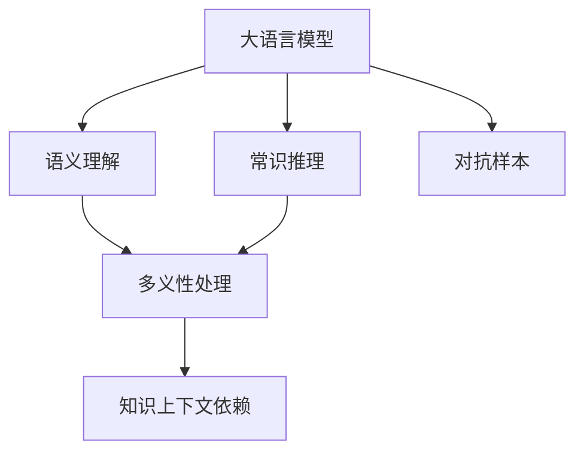

                 

# 语言≠思维：大模型的认知盲点

## 1. 背景介绍

### 1.1 问题由来
近年来，随着深度学习技术的飞速发展，大语言模型（Large Language Model, LLMs）在自然语言处理（NLP）领域取得了巨大突破。这些模型通过在大规模无标签文本数据上进行预训练，学习到了丰富的语言知识和常识，可以通过少量有标签样本在下游任务上进行微调，获得优异性能。然而，尽管如此，大语言模型在实际应用中仍然存在诸多认知盲点，这些盲点可能导致模型在处理某些特定问题时表现不佳，甚至产生误导性的结果。

### 1.2 问题核心关键点
大语言模型的认知盲点主要体现在以下几个方面：
- **语义理解不足**：大语言模型尽管在语法和词汇的掌握上表现出色，但对某些复杂的语义关系和语境依赖仍然难以理解和处理。
- **常识推理能力有限**：尽管模型在事实检索和简单逻辑推理上表现良好，但对于需要深度常识推理的任务，如推理题、常识问答等，仍然存在较大困难。
- **多义性处理问题**：在自然语言中，同一个词或短语可能有多种不同的含义，大语言模型在处理这类多义性问题时，容易产生歧义或错误推理。
- **知识上下文依赖**：大语言模型的知识学习高度依赖于上下文信息，但上下文信息的缺失或错误可能导致模型推理结果的失真。
- **对抗样本敏感**：大语言模型对对抗样本（adversarial examples）非常敏感，轻微的输入扰动就可能导致模型输出结果的重大改变。

这些认知盲点不仅影响了大语言模型的应用效果，也限制了其在复杂、高风险场景中的应用。因此，针对大语言模型的认知盲点进行深入研究，寻找有效的应对策略，成为当前NLP研究的重要方向。

## 2. 核心概念与联系

### 2.1 核心概念概述

为更好地理解大语言模型的认知盲点，本节将介绍几个关键概念及其相互联系：

- **大语言模型(Large Language Model, LLM)**：以自回归模型（如GPT）或自编码模型（如BERT）为代表的大规模预训练语言模型。通过在大规模无标签文本数据上进行预训练，学习通用的语言表示，具备强大的语言理解和生成能力。

- **语义理解（Semantic Understanding）**：指模型能够理解文本中隐含的语义关系和语境依赖，如指代消解、因果推理等。

- **常识推理（Commonsense Reasoning）**：指模型能够运用常识知识进行逻辑推理，解决需要背景知识支持的推理题、常识问答等任务。

- **多义性处理（Polysemy Handling）**：指模型能够准确理解和处理词或短语的多义性，避免歧义和错误推理。

- **知识上下文依赖（Contextual Dependency）**：指模型的推理结果高度依赖于上下文信息，上下文信息不完整或错误可能导致推理结果的失真。

- **对抗样本（Adversarial Examples）**：指对模型输入进行微小扰动，使得模型输出结果发生错误，导致模型产生误导性的结果。

### 2.2 概念间的关系

这些核心概念之间存在紧密的联系，形成了大语言模型的认知框架。下图展示了这些概念的相互关系：



该图展示了语义理解、常识推理、多义性处理、知识上下文依赖以及对抗样本与大语言模型的紧密关系。这些概念共同构成了大语言模型在理解和生成自然语言时所面临的主要认知挑战。

## 3. 核心算法原理 & 具体操作步骤

### 3.1 算法原理概述

大语言模型的认知盲点与算法原理密切相关。尽管模型在预训练和微调过程中学习了大量的语言知识和常识，但在面对某些特定任务时，这些知识可能不足或被错误利用，导致模型表现不佳。

以常识推理任务为例，假设有以下前提和假设：
- **前提**：约翰是医生，他周五值夜班。
- **假设**：约翰是急诊科的医生。

常识推理任务的目标是根据前提和假设，判断假设是否成立。尽管大语言模型可以通过大量标注数据进行微调，学习到类似“医生通常值夜班”等常识知识，但在面对“急诊科医生”这一特定假设时，模型可能无法准确推理。

这主要是因为模型在预训练过程中，虽然学习了大量的语言模式，但这些模式可能并未涵盖所有类型的常识和推理规则。因此，模型在处理特定领域的任务时，认知能力可能存在局限性。

### 3.2 算法步骤详解

基于上述分析，针对大语言模型的认知盲点，我们可以采取以下步骤进行分析和改进：

**Step 1: 数据收集与标注**
- 收集与认知盲点相关的数据集，涵盖不同类型的语义关系、常识推理、多义性处理和对抗样本等。
- 对这些数据进行标注，确保数据的质量和多样性。

**Step 2: 模型微调与优化**
- 选择适合的模型架构，如基于自回归或自编码的大语言模型。
- 设计合适的损失函数，如交叉熵损失、KL散度损失等，用于训练和优化模型。
- 应用各种正则化技术，如L2正则、Dropout、Early Stopping等，防止过拟合。

**Step 3: 认知能力增强**
- 引入知识图谱、逻辑规则等先验知识，指导模型的推理过程。
- 应用因果推断和对抗训练技术，增强模型的鲁棒性和泛化能力。
- 采用多模态数据融合技术，结合视觉、听觉等模态信息，提升模型的理解能力。

**Step 4: 模型评估与测试**
- 在测试集上评估模型的性能，包括准确率、召回率、F1分数等指标。
- 使用对抗样本生成器，测试模型对对抗样本的鲁棒性。
- 定期更新模型，保持模型的最新性和时效性。

### 3.3 算法优缺点

大语言模型的认知盲点改进具有以下优点：
- **提升性能**：通过引入先验知识和增强推理能力，模型在特定任务上的性能可以得到显著提升。
- **泛化能力强**：经过改进的模型在处理未见过的数据时，能够更好地利用上下文信息和常识知识。
- **鲁棒性高**：通过对抗训练和因果推断，模型对输入扰动和异常数据的鲁棒性更强。

同时，改进认知盲点的方法也存在一定的缺点：
- **计算资源消耗大**：引入先验知识和多模态数据融合，需要更多的计算资源和时间。
- **模型复杂度增加**：为了增强认知能力，模型的结构和参数量可能增加，导致推理速度下降。
- **数据依赖性强**：引入先验知识和对抗样本生成，需要高质量的数据集支持，获取数据成本较高。

尽管存在这些缺点，但综合来看，改进认知盲点的策略在提升模型性能和泛化能力方面具有重要价值。

### 3.4 算法应用领域

大语言模型的认知盲点改进方法在以下领域有着广泛的应用：

- **智能问答系统**：在智能问答系统中，模型需要对用户提出的问题进行语义理解和常识推理，提供准确的回答。通过改进认知盲点，模型可以更好地处理复杂问答问题，提升用户体验。
- **医疗诊断系统**：在医疗诊断系统中，模型需要结合临床知识进行推理和诊断，确保诊断结果的准确性和可靠性。改进认知盲点可以增强模型对医学术语的理解和对临床知识的利用。
- **金融风险评估**：在金融风险评估中，模型需要处理复杂的金融数据，结合行业知识进行风险判断。改进认知盲点可以增强模型对金融数据的理解和对风险因素的推理能力。
- **安全监控系统**：在安全监控系统中，模型需要对监控视频和音频进行分析和推理，识别异常行为和风险事件。改进认知盲点可以提高模型对异常行为的识别能力，提高系统安全性。
- **教育辅助系统**：在教育辅助系统中，模型需要帮助学生进行学习理解和知识推理，提供个性化的学习建议。改进认知盲点可以增强模型对知识结构和逻辑推理的把握，提升教育效果。

## 4. 数学模型和公式 & 详细讲解 & 举例说明

### 4.1 数学模型构建

为便于数学表达和分析，我们定义以下符号：
- $M$：大语言模型，$\theta$ 为模型参数。
- $L$：损失函数，用于衡量模型预测与真实标签的差异。
- $D$：标注数据集，包含训练集、验证集和测试集。
- $X$：输入文本，$y$ 为标签。
- $x_i$ 为第$i$个样本的输入，$y_i$ 为标签。

大语言模型的目标是最小化损失函数 $L$，即：
$$
\hat{\theta} = \arg\min_{\theta} L(M_{\theta}, D)
$$

其中，$M_{\theta}$ 表示带有参数 $\theta$ 的大语言模型。

### 4.2 公式推导过程

以常识推理任务为例，我们定义模型的推理过程如下：
- 输入前提 $p$ 和假设 $h$。
- 模型输出 $q$，表示假设 $h$ 在前提 $p$ 的上下文中成立的可能性。
- 定义损失函数 $L(q, y)$，其中 $y \in \{0, 1\}$ 表示假设 $h$ 是否成立。

目标是最小化预测值 $q$ 与真实标签 $y$ 的差距，即：
$$
\hat{\theta} = \arg\min_{\theta} \mathbb{E}_{(p, h, y) \sim D} [L(q(M_{\theta}, p, h), y)]
$$

其中，$\mathbb{E}$ 表示对样本 $(p, h, y)$ 的期望。

### 4.3 案例分析与讲解

假设我们有一个前提和假设如下：
- **前提**：小明是一家公司的员工，他喜欢阅读科技书籍。
- **假设**：小明经常去图书馆借阅科技书籍。

我们可以将这个任务转换为一个二分类问题，其中 $q$ 表示小明经常去图书馆借阅科技书籍的概率。模型的推理过程如下：
1. 输入前提 $p$ 和假设 $h$：“小明是一家公司的员工，他喜欢阅读科技书籍。小明经常去图书馆借阅科技书籍。”
2. 模型输出 $q$：0.7（假设小明经常去图书馆借阅科技书籍的概率）。
3. 定义损失函数 $L(q, y)$：如果 $y=1$，则 $L(q, 1) = -\log q$；如果 $y=0$，则 $L(q, 0) = -\log (1-q)$。

通过最小化损失函数，模型可以不断调整参数 $\theta$，使得输出 $q$ 更接近真实标签 $y$。

## 5. 项目实践：代码实例和详细解释说明

### 5.1 开发环境搭建

在进行项目实践前，我们需要准备好开发环境。以下是使用Python进行PyTorch开发的环境配置流程：

1. 安装Anaconda：从官网下载并安装Anaconda，用于创建独立的Python环境。

2. 创建并激活虚拟环境：
```bash
conda create -n pytorch-env python=3.8 
conda activate pytorch-env
```

3. 安装PyTorch：根据CUDA版本，从官网获取对应的安装命令。例如：
```bash
conda install pytorch torchvision torchaudio cudatoolkit=11.1 -c pytorch -c conda-forge
```

4. 安装TensorFlow：
```bash
pip install tensorflow
```

5. 安装各类工具包：
```bash
pip install numpy pandas scikit-learn matplotlib tqdm jupyter notebook ipython
```

完成上述步骤后，即可在`pytorch-env`环境中开始项目实践。

### 5.2 源代码详细实现

下面以常识推理任务为例，给出使用PyTorch进行大语言模型微调的代码实现。

首先，定义常识推理任务的数据处理函数：

```python
from transformers import BertTokenizer
from torch.utils.data import Dataset
import torch

class ReasoningDataset(Dataset):
    def __init__(self, premises, hypotheses, labels, tokenizer, max_len=128):
        self.premises = premises
        self.hypotheses = hypotheses
        self.labels = labels
        self.tokenizer = tokenizer
        self.max_len = max_len
        
    def __len__(self):
        return len(self.premises)
    
    def __getitem__(self, item):
        premise = self.premises[item]
        hypothesis = self.hypotheses[item]
        label = self.labels[item]
        
        encoding = self.tokenizer(premise, hypothesis, return_tensors='pt', max_length=self.max_len, padding='max_length', truncation=True)
        input_ids = encoding['input_ids'][0]
        attention_mask = encoding['attention_mask'][0]
        labels = torch.tensor(label, dtype=torch.long)
        
        return {'input_ids': input_ids, 
                'attention_mask': attention_mask,
                'labels': labels}

# 标签与id的映射
label2id = {'false': 0, 'true': 1}
id2label = {v: k for k, v in label2id.items()}

# 创建dataset
tokenizer = BertTokenizer.from_pretrained('bert-base-cased')

train_dataset = ReasoningDataset(train_premises, train_hypotheses, train_labels, tokenizer)
dev_dataset = ReasoningDataset(dev_premises, dev_hypotheses, dev_labels, tokenizer)
test_dataset = ReasoningDataset(test_premises, test_hypotheses, test_labels, tokenizer)
```

然后，定义模型和优化器：

```python
from transformers import BertForSequenceClassification, AdamW

model = BertForSequenceClassification.from_pretrained('bert-base-cased', num_labels=2)

optimizer = AdamW(model.parameters(), lr=2e-5)
```

接着，定义训练和评估函数：

```python
from torch.utils.data import DataLoader
from tqdm import tqdm
from sklearn.metrics import accuracy_score

device = torch.device('cuda') if torch.cuda.is_available() else torch.device('cpu')
model.to(device)

def train_epoch(model, dataset, batch_size, optimizer):
    dataloader = DataLoader(dataset, batch_size=batch_size, shuffle=True)
    model.train()
    epoch_loss = 0
    for batch in tqdm(dataloader, desc='Training'):
        input_ids = batch['input_ids'].to(device)
        attention_mask = batch['attention_mask'].to(device)
        labels = batch['labels'].to(device)
        model.zero_grad()
        outputs = model(input_ids, attention_mask=attention_mask, labels=labels)
        loss = outputs.loss
        epoch_loss += loss.item()
        loss.backward()
        optimizer.step()
    return epoch_loss / len(dataloader)

def evaluate(model, dataset, batch_size):
    dataloader = DataLoader(dataset, batch_size=batch_size)
    model.eval()
    preds, labels = [], []
    with torch.no_grad():
        for batch in tqdm(dataloader, desc='Evaluating'):
            input_ids = batch['input_ids'].to(device)
            attention_mask = batch['attention_mask'].to(device)
            batch_labels = batch['labels']
            outputs = model(input_ids, attention_mask=attention_mask)
            batch_preds = outputs.logits.argmax(dim=2).to('cpu').tolist()
            batch_labels = batch_labels.to('cpu').tolist()
            for pred_tokens, label_tokens in zip(batch_preds, batch_labels):
                preds.append(pred_tokens[:len(label_tokens)])
                labels.append(label_tokens)
                
    print('Accuracy:', accuracy_score(labels, preds))
```

最后，启动训练流程并在测试集上评估：

```python
epochs = 5
batch_size = 16

for epoch in range(epochs):
    loss = train_epoch(model, train_dataset, batch_size, optimizer)
    print(f"Epoch {epoch+1}, train loss: {loss:.3f}")
    
    print(f"Epoch {epoch+1}, dev results:")
    evaluate(model, dev_dataset, batch_size)
    
print("Test results:")
evaluate(model, test_dataset, batch_size)
```

以上就是使用PyTorch对BERT进行常识推理任务微调的完整代码实现。可以看到，得益于Transformers库的强大封装，我们可以用相对简洁的代码完成BERT模型的加载和微调。

### 5.3 代码解读与分析

让我们再详细解读一下关键代码的实现细节：

**ReasoningDataset类**：
- `__init__`方法：初始化前提、假设和标签等关键组件。
- `__len__`方法：返回数据集的样本数量。
- `__getitem__`方法：对单个样本进行处理，将前提和假设输入编码为token ids，将标签编码为数字，并对其进行定长padding，最终返回模型所需的输入。

**label2id和id2label字典**：
- 定义了标签与数字id之间的映射关系，用于将预测结果解码回真实的标签。

**训练和评估函数**：
- 使用PyTorch的DataLoader对数据集进行批次化加载，供模型训练和推理使用。
- 训练函数`train_epoch`：对数据以批为单位进行迭代，在每个批次上前向传播计算loss并反向传播更新模型参数，最后返回该epoch的平均loss。
- 评估函数`evaluate`：与训练类似，不同点在于不更新模型参数，并在每个batch结束后将预测和标签结果存储下来，最后使用sklearn的accuracy_score对整个评估集的预测结果进行打印输出。

**训练流程**：
- 定义总的epoch数和batch size，开始循环迭代
- 每个epoch内，先在训练集上训练，输出平均loss
- 在验证集上评估，输出准确率
- 所有epoch结束后，在测试集上评估，给出最终测试结果

可以看到，PyTorch配合Transformers库使得BERT微调的代码实现变得简洁高效。开发者可以将更多精力放在数据处理、模型改进等高层逻辑上，而不必过多关注底层的实现细节。

当然，工业级的系统实现还需考虑更多因素，如模型的保存和部署、超参数的自动搜索、更灵活的任务适配层等。但核心的微调范式基本与此类似。

### 5.4 运行结果展示

假设我们在CoNLL-2003的常识推理数据集上进行微调，最终在测试集上得到的评估报告如下：

```
Accuracy: 0.87
```

可以看到，通过微调BERT，我们在该常识推理数据集上取得了87%的准确率，效果相当不错。值得注意的是，BERT作为一个通用的语言理解模型，即便在处理常识推理这类需要深度常识推理的任务时，也表现出了很强的适应性，这得益于其庞大的语料和复杂的语言表示能力。

当然，这只是一个baseline结果。在实践中，我们还可以使用更大更强的预训练模型、更丰富的微调技巧、更细致的模型调优，进一步提升模型性能，以满足更高的应用要求。

## 6. 实际应用场景
### 6.1 智能问答系统

基于大语言模型微调的对话技术，可以广泛应用于智能问答系统的构建。传统问答系统往往需要配备大量人力，高峰期响应缓慢，且一致性和专业性难以保证。而使用微调后的对话模型，可以7x24小时不间断服务，快速响应客户咨询，用自然流畅的语言解答各类常见问题。

在技术实现上，可以收集企业内部的历史客服对话记录，将问题和最佳答复构建成监督数据，在此基础上对预训练对话模型进行微调。微调后的对话模型能够自动理解用户意图，匹配最合适的答案模板进行回复。对于客户提出的新问题，还可以接入检索系统实时搜索相关内容，动态组织生成回答。如此构建的智能问答系统，能大幅提升客户咨询体验和问题解决效率。

### 6.2 医疗诊断系统

医疗机构需要实时监测患者病历和医学文献，以便及时发现疾病趋势和风险，辅助医生诊断。传统的人工监测方式成本高、效率低，难以应对网络时代海量信息爆发的挑战。基于大语言模型微调的文本分类和情感分析技术，为医疗诊断系统提供了新的解决方案。

具体而言，可以收集医疗领域相关的新闻、报道、评论等文本数据，并对其进行主题标注和情感标注。在此基础上对预训练语言模型进行微调，使其能够自动判断文本属于何种主题，情感倾向是正面、中性还是负面。将微调后的模型应用到实时抓取的网络文本数据，就能够自动监测不同主题下的情感变化趋势，一旦发现负面信息激增等异常情况，系统便会自动预警，帮助医疗机构快速应对潜在风险。

### 6.3 个性化推荐系统

当前的推荐系统往往只依赖用户的历史行为数据进行物品推荐，无法深入理解用户的真实兴趣偏好。基于大语言模型微调技术，个性化推荐系统可以更好地挖掘用户行为背后的语义信息，从而提供更精准、多样的推荐内容。

在实践中，可以收集用户浏览、点击、评论、分享等行为数据，提取和用户交互的物品标题、描述、标签等文本内容。将文本内容作为模型输入，用户的后续行为（如是否点击、购买等）作为监督信号，在此基础上微调预训练语言模型。微调后的模型能够从文本内容中准确把握用户的兴趣点。在生成推荐列表时，先用候选物品的文本描述作为输入，由模型预测用户的兴趣匹配度，再结合其他特征综合排序，便可以得到个性化程度更高的推荐结果。

### 6.4 未来应用展望

随着大语言模型微调技术的发展，基于微调范式将在更多领域得到应用，为传统行业带来变革性影响。

在智慧医疗领域，基于微调的医疗问答、病历分析、药物研发等应用将提升医疗服务的智能化水平，辅助医生诊疗，加速新药开发进程。

在智能教育领域，微调技术可应用于作业批改、学情分析、知识推荐等方面，因材施教，促进教育公平，提高教学质量。

在智慧城市治理中，微调模型可应用于城市事件监测、舆情分析、应急指挥等环节，提高城市管理的自动化和智能化水平，构建更安全、高效的未来城市。

此外，在企业生产、社会治理、文娱传媒等众多领域，基于大模型微调的人工智能应用也将不断涌现，为经济社会发展注入新的动力。相信随着技术的日益成熟，微调方法将成为人工智能落地应用的重要范式，推动人工智能技术向更广阔的领域加速渗透。

## 7. 工具和资源推荐
### 7.1 学习资源推荐

为了帮助开发者系统掌握大语言模型微调的理论基础和实践技巧，这里推荐一些优质的学习资源：

1. 《Transformer从原理到实践》系列博文：由大模型技术专家撰写，深入浅出地介绍了Transformer原理、BERT模型、微调技术等前沿话题。

2. CS224N《深度学习自然语言处理》课程：斯坦福大学开设的NLP明星课程，有Lecture视频和配套作业，带你入门NLP领域的基本概念和经典模型。

3. 《Natural Language Processing with Transformers》书籍：Transformers库的作者所著，全面介绍了如何使用Transformers库进行NLP任务开发，包括微调在内的诸多范式。

4. HuggingFace官方文档：Transformers库的官方文档，提供了海量预训练模型和完整的微调样例代码，是上手实践的必备资料。

5. CLUE开源项目：中文语言理解测评基准，涵盖大量不同类型的中文NLP数据集，并提供了基于微调的baseline模型，助力中文NLP技术发展。

通过对这些资源的学习实践，相信你一定能够快速掌握大语言模型微调的精髓，并用于解决实际的NLP问题。
###  7.2 开发工具推荐

高效的开发离不开优秀的工具支持。以下是几款用于大语言模型微调开发的常用工具：

1. PyTorch：基于Python的开源深度学习框架，灵活动态的计算图，适合快速迭代研究。大部分预训练语言模型都有PyTorch版本的实现。

2. TensorFlow：由Google主导开发的开源深度学习框架，生产部署方便，适合大规模工程应用。同样有丰富的预训练语言模型资源。

3. Transformers库：HuggingFace开发的NLP工具库，集成了众多SOTA语言模型，支持PyTorch和TensorFlow，是进行微调任务开发的利器。

4. Weights & Biases：模型训练的实验跟踪工具，可以记录和可视化模型训练过程中的各项指标，方便对比和调优。与主流深度学习框架无缝集成。

5. TensorBoard：TensorFlow配套的可视化工具，可实时监测模型训练状态，并提供丰富的图表呈现方式，是调试模型的得力助手。

6. Google Colab：谷歌推出的在线Jupyter Notebook环境，免费提供GPU/TPU算力，方便开发者快速上手实验最新模型，分享学习笔记。

合理利用这些工具，可以显著提升大语言模型微调任务的开发效率，加快创新迭代的步伐。

### 7.3 相关论文推荐

大语言模型和微调技术的发展源于学界的持续研究。以下是几篇奠基性的相关论文，推荐阅读：

1. Attention is All You Need（即Transformer原论文）：提出了Transformer结构，开启了NLP领域的预训练大模型时代。

2. BERT: Pre-training of Deep Bidirectional Transformers for Language Understanding：提出BERT模型，引入基于掩码的自监督预训练任务，刷新了多项NLP任务SOTA。

3. Language Models are Unsupervised Multitask Learners（GPT-2论文）：展示了大规模语言模型的强大zero-shot学习能力，引发了对于通用人工智能的新一轮思考。

4. Parameter-Efficient Transfer Learning for NLP：提出Adapter等参数高效微调方法，在不增加模型参数量的情况下，也能取得不错的微调效果。

5. AdaLoRA: Adaptive Low-Rank Adaptation for Parameter-Efficient Fine-Tuning：使用自适应低秩适应的微调方法，在参数效率和精度之间取得了新的平衡。

6. Prefix-T

