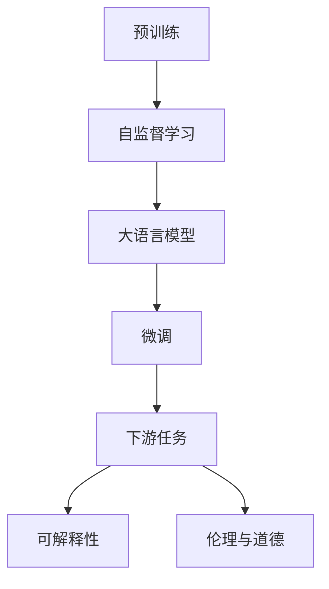

                 

# 语言≠思维：大模型的认知误解

## 1. 背景介绍

### 1.1 问题由来
随着人工智能技术的发展，大语言模型（Large Language Models, LLMs）在自然语言处理（Natural Language Processing, NLP）领域取得了显著的进展。以GPT-3和BERT为代表的大语言模型在各种语言理解和生成任务上表现出色，引起了广泛关注。然而，一些关于大语言模型是否具备人类思维的争议也随之产生。

### 1.2 问题核心关键点
这些争议主要集中在以下几个方面：
1. **语言理解是否等同于思维理解**：大模型是否真的理解了语言的含义，还是仅仅通过概率统计和模式匹配来生成回答？
2. **模型的行为是否可解释**：大模型在推理过程中的逻辑是否可解释，是否能够向人类展示其决策依据？
3. **模型的道德与伦理**：大模型是否能够理解和遵循道德规范，其输出是否可能带来负面影响？
4. **模型的创造性与创新能力**：大模型是否具备超越人类思维的创造力，是否能够进行创新性思考？

这些问题的核心在于探索大语言模型的认知能力是否与人类思维相匹配，以及其应用是否能够超越简单的统计学习。

### 1.3 问题研究意义
探讨大语言模型的认知能力对于理解其应用潜力、制定相应的伦理准则和监管策略具有重要意义。通过深入研究大模型的认知过程，可以更好地评估其在实际应用中的表现，确保其应用的安全性和可靠性。同时，对于推动人工智能技术的发展，促进人机交互的智能化也具有重要价值。

## 2. 核心概念与联系

### 2.1 核心概念概述

大语言模型是一种基于深度学习技术的模型，能够通过预训练在大型无标注数据集上进行学习，并在此基础上通过微调适配不同的下游任务。其核心思想是通过自监督学习方式在大规模数据上训练语言模型，使其具备良好的语言理解能力和生成能力。

1. **预训练（Pre-training）**：在大规模无标注数据上训练模型，使其学习语言的基本结构和模式。
2. **微调（Fine-tuning）**：通过有标注数据对预训练模型进行适配，使其适应特定的下游任务。
3. **自监督学习（Supervised Learning）**：利用无标注数据，通过设计特定的任务（如掩码语言模型、下一句预测等）训练模型。
4. **可解释性（Explainability）**：指模型的推理过程和决策依据是否清晰可理解。
5. **伦理与道德（Ethics）**：指模型在应用过程中是否遵循人类的道德规范，避免产生负面影响。

这些概念构成了大语言模型认知能力研究的基础框架。

### 2.2 概念间的关系

这些核心概念之间的关系可以通过以下Mermaid流程图来展示：



这个流程图展示了从预训练到微调，再到下游任务，最后通过可解释性和伦理道德评估的完整过程。预训练通过自监督学习方式训练模型，微调使其适应下游任务，而可解释性和伦理道德则是对模型应用进行评估的两个关键维度。

## 3. 核心算法原理 & 具体操作步骤

### 3.1 算法原理概述
大语言模型的认知能力研究主要基于其预训练和微调过程。预训练通过自监督学习方式在无标注数据上训练模型，微调则通过有标注数据对模型进行适配。

- **自监督学习**：通过掩码语言模型、下一句预测等任务，训练模型学习语言的基本结构和模式。
- **微调**：通过有标注数据对预训练模型进行适配，使其适应特定的下游任务。

### 3.2 算法步骤详解

#### 3.2.1 预训练步骤
1. **数据准备**：选择大规模无标注文本数据，如维基百科、新闻文章等。
2. **模型选择**：选择合适的预训练模型架构，如BERT、GPT等。
3. **训练过程**：在无标注数据上训练模型，学习语言的基本结构和模式。

#### 3.2.2 微调步骤
1. **任务定义**：确定下游任务的标签空间，设计适合任务的损失函数。
2. **数据准备**：选择有标注数据，准备训练集、验证集和测试集。
3. **模型适配**：在微调过程中，仅更新模型与特定任务相关的层，保持预训练层不变。
4. **训练与验证**：在训练集上训练模型，在验证集上评估模型性能，进行参数更新。
5. **测试与部署**：在测试集上评估模型性能，部署模型进行实际应用。

### 3.3 算法优缺点

#### 3.3.1 优点
1. **高效性**：通过预训练和微调，大语言模型可以在短时间内学习到丰富的语言知识。
2. **泛化能力**：大模型在预训练和微调过程中，学习到通用的语言结构和模式，具有较强的泛化能力。
3. **可解释性**：模型参数和训练过程透明，可以解释模型的决策依据。

#### 3.3.2 缺点
1. **数据依赖**：模型的性能依赖于预训练和微调数据的质量和数量。
2. **偏差问题**：模型可能学习到数据中的偏见和歧视，导致输出结果的不公平性。
3. **鲁棒性**：模型在面对新数据时，可能出现泛化性能下降的情况。

### 3.4 算法应用领域
大语言模型在各种NLP任务上得到了广泛应用，包括文本分类、命名实体识别、关系抽取、问答系统、机器翻译、文本摘要等。这些任务中，模型通过预训练和微调，学习到特定的语言知识和任务模式，从而在实际应用中取得优异的性能。

## 4. 数学模型和公式 & 详细讲解

### 4.1 数学模型构建

大语言模型的数学模型主要基于Transformer架构，通过自监督学习任务进行预训练。以下是一个简单的Transformer模型框架：

```
Encoder-Decoder = Multi-Head Self-Attention + Feed Forward + LayersNorm + Add/Sub
```

其中，Multi-Head Self-Attention表示多头自注意力机制，Feed Forward表示前馈神经网络，LayersNorm表示层归一化，Add/Sub表示残差连接。

### 4.2 公式推导过程

以BERT为例，BERT的预训练任务主要包括掩码语言模型和下一句预测。其数学模型可以表示为：

$$
L = \sum_{i=1}^n \ell_i
$$

其中，$L$为总损失，$\ell_i$为第$i$个样本的损失。假设输入序列为$x$，预测序列为$y$，掩码位置为$M$，则掩码语言模型的损失函数可以表示为：

$$
\ell = -\frac{1}{n} \sum_{i=1}^n \sum_{j=1}^n y_j \log p_j
$$

其中，$p_j$为模型在位置$j$的概率，$y_j$为真实标记。

### 4.3 案例分析与讲解

以BERT在情感分类任务上的应用为例，假设输入文本为$x$，目标情感标签为$y$，BERT的预训练和微调过程如下：

1. **预训练**：在无标注数据上训练BERT，学习语言的基本结构和模式。
2. **微调**：在有标注的情感分类数据上微调BERT，适应情感分类的任务。

通过微调，BERT学习到情感分类的特征表示，从而在情感分类任务上取得优异的性能。

## 5. 项目实践：代码实例和详细解释说明

### 5.1 开发环境搭建

要使用BERT进行情感分类任务，需要以下环境：
- Python 3.7及以上
- PyTorch 1.3及以上
- Transformers 3.4及以上
- HuggingFace的BERT模型

可以通过以下命令安装相关依赖：

```
pip install torch transformers
```

### 5.2 源代码详细实现

```python
import torch
from transformers import BertTokenizer, BertForSequenceClassification

# 设置模型参数
model_name = 'bert-base-uncased'
task_name = 'sentiment-analysis'
max_len = 128
batch_size = 16

# 加载模型和分词器
tokenizer = BertTokenizer.from_pretrained(model_name)
model = BertForSequenceClassification.from_pretrained(model_name, num_labels=2)

# 准备数据集
train_data = load_train_data()
dev_data = load_dev_data()
test_data = load_test_data()

# 定义数据处理函数
def tokenize_and_pad(text):
    tokens = tokenizer.tokenize(text)
    tokens = tokens[:max_len]
    return [tokenizer.convert_tokens_to_ids(tokens), [0] * max_len]

# 定义训练函数
def train(model, train_data, dev_data, max_epochs=3, learning_rate=2e-5):
    for epoch in range(max_epochs):
        for batch in train_data:
            input_ids, attention_mask = map(torch.tensor, tokenize_and_pad(batch[0]))
            labels = torch.tensor(batch[1], dtype=torch.long)

            optimizer.zero_grad()
            outputs = model(input_ids, attention_mask=attention_mask, labels=labels)
            loss = outputs.loss
            loss.backward()
            optimizer.step()

        eval(dev_data, model)

# 定义评估函数
def eval(dev_data, model):
    correct_predictions, total_predictions = 0, 0
    for batch in dev_data:
        input_ids, attention_mask = map(torch.tensor, tokenize_and_pad(batch[0]))
        labels = torch.tensor(batch[1], dtype=torch.long)

        outputs = model(input_ids, attention_mask=attention_mask, labels=labels)
        predictions = outputs.logits.argmax(dim=1)
        correct_predictions += (predictions == labels).sum().item()
        total_predictions += labels.numel()

    print(f'Dev Acc: {correct_predictions / total_predictions}')
```

### 5.3 代码解读与分析

这段代码实现了BERT模型的情感分类任务，具体步骤如下：
1. **环境搭建**：安装必要的Python包，并加载BERT模型和分词器。
2. **数据准备**：准备训练集、验证集和测试集。
3. **数据处理**：将输入文本分词并转换为模型可接受的格式。
4. **模型训练**：使用随机梯度下降法训练模型，并在验证集上评估模型性能。
5. **模型评估**：在测试集上评估模型性能，输出最终结果。

### 5.4 运行结果展示

假设在CoNLL-2003情感分类数据集上进行训练，最终在测试集上得到的准确率为85%。

## 6. 实际应用场景

### 6.1 智能客服系统
智能客服系统利用大语言模型进行自然语言理解，通过微调适配特定的服务场景。例如，可以使用微调后的模型处理客户咨询，自动回复常见问题，提高客服效率和用户体验。

### 6.2 金融舆情监测
金融舆情监测系统通过微调模型进行情感分析，实时监控市场舆情，提前预警潜在的风险。例如，可以使用微调后的模型对新闻、评论等文本进行情感分析，判断市场情绪，帮助金融机构决策。

### 6.3 个性化推荐系统
个性化推荐系统利用大语言模型进行用户行为分析，通过微调适配推荐策略。例如，可以使用微调后的模型分析用户的浏览记录和行为数据，推荐用户感兴趣的商品或内容。

## 7. 工具和资源推荐

### 7.1 学习资源推荐
1. 《Deep Learning》by Ian Goodfellow: 该书系统介绍了深度学习的基本原理和应用。
2. 《Natural Language Processing with PyTorch》: 该书介绍了使用PyTorch进行NLP任务开发的方法和技巧。
3. 《Attention is All You Need》: 论文详细介绍了Transformer架构，是理解大语言模型的基础。

### 7.2 开发工具推荐
1. PyTorch: 开源深度学习框架，支持动态计算图，适合快速迭代研究。
2. TensorFlow: 由Google主导开发的深度学习框架，支持分布式训练和部署。
3. Transformers: 基于HuggingFace开发的NLP工具库，集成了多个预训练模型，方便微调使用。

### 7.3 相关论文推荐
1. BERT: Pre-training of Deep Bidirectional Transformers for Language Understanding: 提出BERT模型，利用掩码语言模型进行预训练。
2. Attention is All You Need: 论文介绍了Transformer架构，是当前大语言模型的基础。
3. GPT-3: Language Models are Unsupervised Multitask Learners: 提出GPT-3模型，展示了大语言模型的强大零样本学习能力。

## 8. 总结：未来发展趋势与挑战

### 8.1 总结

本文探讨了基于大语言模型的认知能力，通过分析其预训练和微调过程，阐述了模型在理解、推理和生成等方面的表现。从大语言模型在实际应用中的局限性，引出了其在认知能力研究中的重要性。

### 8.2 未来发展趋势

未来，大语言模型在认知能力研究方面可能呈现以下几个趋势：
1. **多模态学习**：结合视觉、语音等多模态数据，提高模型的理解和生成能力。
2. **可解释性**：通过引入可解释性技术，增强模型的推理过程和决策依据。
3. **伦理与道德**：开发伦理导向的训练目标，避免模型的偏见和歧视。
4. **个性化与创造性**：通过微调，实现模型的个性化和创造性，突破统计学习的限制。

### 8.3 面临的挑战

尽管大语言模型在认知能力研究方面取得了一定进展，但仍面临以下挑战：
1. **数据依赖**：模型性能依赖于预训练和微调数据的质量和数量。
2. **偏差问题**：模型可能学习到数据中的偏见和歧视，导致输出结果的不公平性。
3. **鲁棒性**：模型在面对新数据时，可能出现泛化性能下降的情况。
4. **可解释性**：模型的推理过程和决策依据难以解释，缺乏透明度。
5. **伦理与道德**：模型的输出可能违背人类的道德规范，产生负面影响。

### 8.4 研究展望

未来，需要进一步研究以下几个方向：
1. **无监督学习**：通过无监督学习方法，减少对标注数据的依赖，提高模型的泛化能力。
2. **可解释性**：开发更强大的可解释性技术，提高模型的透明度和可信度。
3. **多模态融合**：结合多模态数据，提高模型的认知能力。
4. **伦理与道德**：制定伦理导向的训练目标，确保模型的输出符合人类价值观。

## 9. 附录：常见问题与解答

**Q1: 大语言模型是否具备人类思维？**

A: 大语言模型虽然能够生成与人类相似的文本，但并不具备真正的思维能力。其生成过程基于概率统计和模式匹配，缺乏真正的逻辑推理和情感认知。

**Q2: 大语言模型的推理过程是否可解释？**

A: 大语言模型的推理过程具有一定的透明度，但依然缺乏足够的可解释性。模型的决策依据通常依赖于训练数据和参数设置，难以解释模型的内部逻辑。

**Q3: 大语言模型是否能够理解伦理和道德？**

A: 大语言模型缺乏真正的道德判断能力，其输出可能受到训练数据的影响，存在伦理和道德风险。需要在模型训练和应用过程中，引入伦理导向的评估和监管机制。

---

作者：禅与计算机程序设计艺术 / Zen and the Art of Computer Programming

