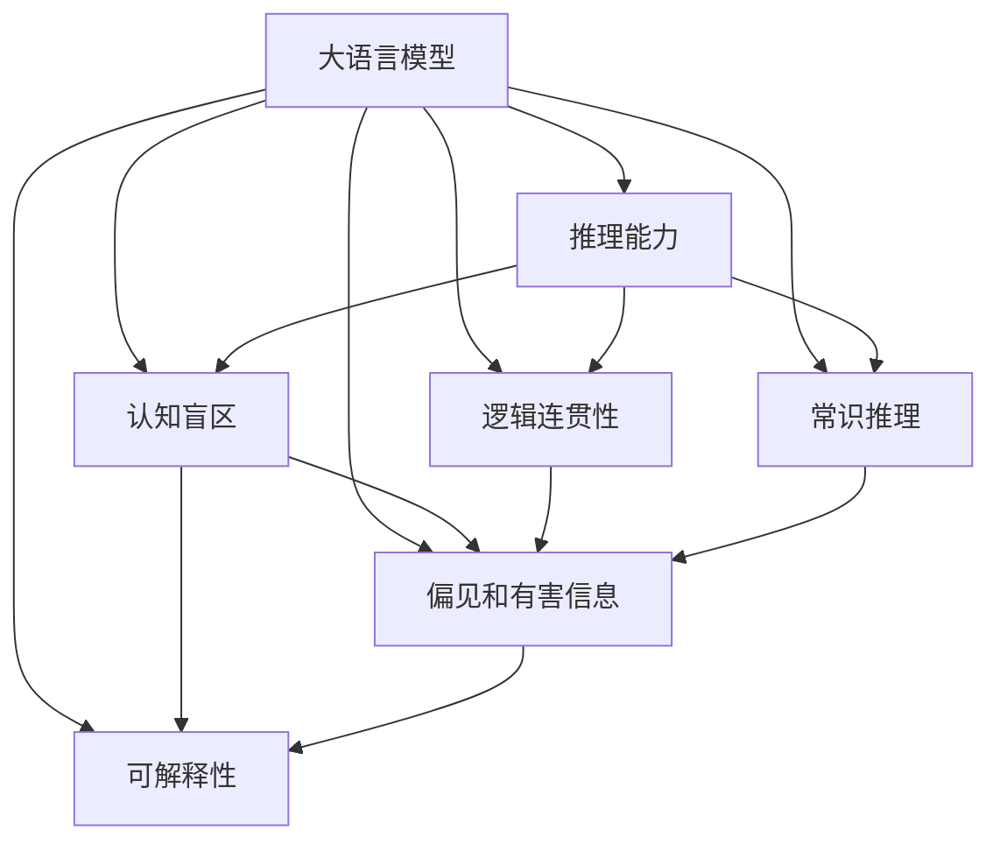
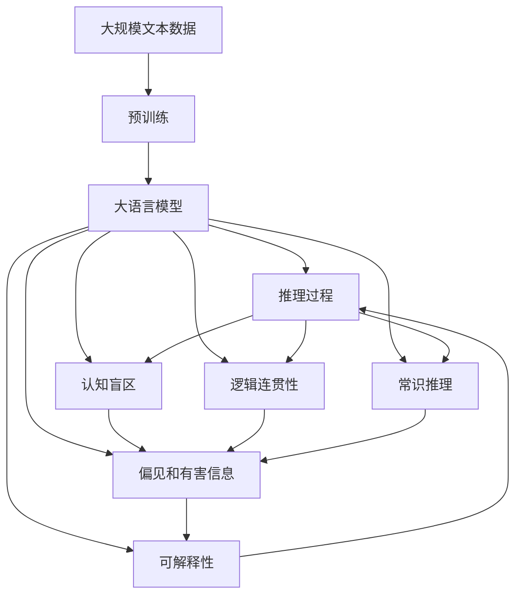

                 

# 语言与推理：大模型的认知盲区

> 关键词：大模型,认知盲区,语言理解,推理能力,推理缺陷,伦理与安全,未来展望

## 1. 背景介绍

### 1.1 问题由来
近年来，大语言模型（Large Language Models, LLMs）在自然语言处理（NLP）领域取得了令人瞩目的突破。模型如GPT、BERT等，通过在大规模无标签文本数据上进行预训练，具备了强大的语言理解和生成能力。然而，尽管这些模型在许多任务上取得了优异的表现，它们依然存在一些认知上的盲区。这既是现有技术的局限，也是未来研究的突破点。

### 1.2 问题核心关键点
大模型在推理能力上的缺陷主要表现在以下几个方面：

- **推理链过长**：在大规模语言生成任务中，模型往往需要生成多个自然语言句子才能推导出最终结果，这可能导致推理过程过于复杂，推理链过长。
- **逻辑连贯性不足**：模型生成的句子往往缺乏逻辑连贯性，句子间存在不合理的跳接，导致推理结果不可信。
- **常识推理能力不足**：模型在处理常识性问题时，容易产生错误的推理结果，这通常是由于缺乏常识推理能力。
- **偏见和有害信息的传播**：模型可能会学习到数据中的偏见和有害信息，这些信息在推理过程中可能被放大，导致错误的决策。
- **解释性和透明度不足**：模型输出往往缺乏可解释性，难以理解其内部推理过程，不利于用户信任。

这些问题不仅限制了模型的应用范围，还可能导致严重的伦理和安全问题。因此，理解大模型在推理过程中的盲区和局限，探索提高其推理能力的方法，是当前研究的重要方向。

### 1.3 问题研究意义
理解大模型的认知盲区，对提升其推理能力、增强其鲁棒性和可解释性具有重要意义：

1. **提升推理能力**：通过分析推理过程中的问题，可以改进模型的推理算法，使其生成更加连贯、可靠的推理结果。
2. **增强鲁棒性**：通过减少偏见和有害信息的传播，增强模型的公平性和安全性，避免误导性输出。
3. **增强可解释性**：提高模型的可解释性，使得用户能够理解和信任模型的决策过程。
4. **推动技术发展**：深入研究大模型的认知盲区，可以揭示其内在机制，为未来技术的发展提供指导。

## 2. 核心概念与联系

### 2.1 核心概念概述

要深入理解大模型的认知盲区，首先需要明确几个关键概念：

- **大语言模型**：指通过大规模无标签文本数据预训练获得的具有强大语言理解和生成能力的模型，如BERT、GPT等。
- **推理能力**：指模型基于给定输入，通过逻辑推理得出正确结论的能力。
- **认知盲区**：指模型在特定场景下，无法有效推理或产生错误推理的能力不足区域。
- **逻辑连贯性**：指模型生成的文本之间逻辑上是否连贯，是否存在不合理的跳接。
- **常识推理**：指模型根据常识知识进行推理的能力，如时间、空间、物理规律等。
- **偏见和有害信息**：指模型在训练过程中学习到的数据中存在的偏见和有害信息，可能影响模型的输出。
- **可解释性**：指模型输出是否易于理解和解释，是否具有透明度。

这些概念之间存在着紧密的联系，共同构成了大模型推理能力的框架。通过理解这些概念，我们可以更好地把握大模型在推理过程中的问题和解决方案。

### 2.2 概念间的关系

这些核心概念之间的逻辑关系可以通过以下Mermaid流程图来展示：



这个流程图展示了各概念之间的联系：

- 大模型具有推理能力，但其推理过程可能存在认知盲区、逻辑不连贯、缺乏常识推理、偏见和有害信息以及可解释性不足等问题。
- 这些问题相互影响，可能使得模型的推理能力受到限制。

### 2.3 核心概念的整体架构

最后，我们用一个综合的流程图来展示这些核心概念在大模型推理过程中的整体架构：



这个综合流程图展示了从预训练到推理，再到认知盲区的整个推理过程。大模型在推理过程中，可能遇到多种问题，这些问题相互交织，影响模型的最终输出。

## 3. 核心算法原理 & 具体操作步骤
### 3.1 算法原理概述

大模型的推理过程主要基于其预训练获得的语言表示。在推理过程中，模型将输入的自然语言句子转换为高维向量表示，通过一系列的线性变换和激活函数操作，生成最终的推理结果。然而，由于模型的复杂性和训练数据的局限，推理过程中可能会出现多种认知盲区。

### 3.2 算法步骤详解

大模型的推理过程通常包括以下几个步骤：

1. **输入预处理**：将输入的自然语言句子进行分词、标记、编码等预处理操作，转换为模型可以处理的向量表示。
2. **向量嵌入**：将预处理后的向量输入模型，经过多次变换，最终生成模型的隐状态表示。
3. **推理计算**：根据任务类型，选择不同的推理算法，如最大似然估计、贪心搜索等，计算推理结果。
4. **输出解码**：将模型的隐状态表示解码为自然语言句子，完成推理过程。

### 3.3 算法优缺点

大模型的推理过程具有以下优点：

- **高精度**：通过大规模预训练，模型在许多任务上能够达到接近人类的推理能力。
- **适应性强**：模型的推理能力可以通过微调进行增强，适应特定的推理任务。
- **可扩展性**：模型的推理过程可以通过分布式计算加速，适应大规模推理任务。

但同时，大模型的推理过程也存在以下缺点：

- **推理链过长**：推理过程中需要生成多个句子，推理链过长，推理效率较低。
- **逻辑连贯性不足**：生成的句子之间逻辑上可能不连贯，推理结果不可信。
- **常识推理能力不足**：模型缺乏常识推理能力，处理某些常识性问题时容易产生错误推理。
- **偏见和有害信息的传播**：模型可能会学习到数据中的偏见和有害信息，这些信息在推理过程中可能被放大。
- **可解释性不足**：模型的推理过程缺乏可解释性，难以理解其内部逻辑。

### 3.4 算法应用领域

大模型的推理能力已经在多个领域得到了广泛应用，例如：

- **问答系统**：如DialoGPT等模型，通过推理回答用户问题，增强人机交互体验。
- **自然语言生成**：如GPT系列模型，通过推理生成自然语言文本，应用于机器翻译、文本摘要、对话生成等。
- **逻辑推理**：如RNN、LSTM等模型，通过推理解决逻辑推理问题，应用于自动定理证明、知识图谱推理等。
- **游戏AI**：如AlphaGo等模型，通过推理策略，进行游戏决策。

除了这些经典应用外，大模型的推理能力还被创新性地应用到更多场景中，如机器人路径规划、医疗诊断、金融分析等，为各领域带来了新的突破。

## 4. 数学模型和公式 & 详细讲解 & 举例说明

### 4.1 数学模型构建

在大模型的推理过程中，通常采用自回归模型进行推理计算。以Transformer模型为例，假设模型参数为$\theta$，输入序列为$x_1, x_2, ..., x_n$，模型生成的输出序列为$y_1, y_2, ..., y_n$。模型的推理过程可以表示为：

$$
y_i = \text{Decoder}(x_1, x_2, ..., x_i, \theta)
$$

其中，$\text{Decoder}$为模型的推理解码器，$x_1, x_2, ..., x_i$为已生成的序列，$\theta$为模型参数。

### 4.2 公式推导过程

以下我们以自回归模型的推导为例，展示其计算过程。

假设模型采用Transformer架构，解码器部分由多个注意力层和前馈神经网络层组成。对于第$i$个时刻，解码器的计算过程如下：

1. **注意力计算**：计算当前时刻的注意力权重，选择与当前时刻最相关的历史信息。
2. **前馈计算**：将注意力权重与历史信息向量进行线性变换和激活函数操作，生成当前时刻的表示向量。
3. **输出解码**：将当前时刻的表示向量解码为自然语言句子。

推理过程的计算公式可以表示为：

$$
y_i = \text{Attention}(y_{i-1}, x_1, x_2, ..., x_i, \theta) \cdot \text{FFN}(y_{i-1}, \theta)
$$

其中，$\text{Attention}$表示注意力计算，$\text{FFN}$表示前馈计算。

### 4.3 案例分析与讲解

以Bart模型为例，其推理过程包含以下步骤：

1. **输入预处理**：将输入的自然语言句子进行分词、标记、编码等预处理操作，转换为模型可以处理的向量表示。
2. **向量嵌入**：将预处理后的向量输入模型，经过多次变换，最终生成模型的隐状态表示。
3. **推理计算**：根据任务类型，选择不同的推理算法，如最大似然估计、贪心搜索等，计算推理结果。
4. **输出解码**：将模型的隐状态表示解码为自然语言句子，完成推理过程。

## 5. 项目实践：代码实例和详细解释说明

### 5.1 开发环境搭建

在进行推理实践前，我们需要准备好开发环境。以下是使用Python进行PyTorch开发的环境配置流程：

1. 安装Anaconda：从官网下载并安装Anaconda，用于创建独立的Python环境。

2. 创建并激活虚拟环境：
```bash
conda create -n pytorch-env python=3.8 
conda activate pytorch-env
```

3. 安装PyTorch：根据CUDA版本，从官网获取对应的安装命令。例如：
```bash
conda install pytorch torchvision torchaudio cudatoolkit=11.1 -c pytorch -c conda-forge
```

4. 安装Transformer库：
```bash
pip install transformers
```

5. 安装各类工具包：
```bash
pip install numpy pandas scikit-learn matplotlib tqdm jupyter notebook ipython
```

完成上述步骤后，即可在`pytorch-env`环境中开始推理实践。

### 5.2 源代码详细实现

下面我们以使用GPT模型进行文本推理为例，给出使用Transformers库的PyTorch代码实现。

首先，定义推理任务的数据处理函数：

```python
from transformers import AutoTokenizer, AutoModelForSeq2SeqLM
import torch

def preprocess_input(text):
    tokenizer = AutoTokenizer.from_pretrained('gpt2')
    tokens = tokenizer.encode(text, return_tensors='pt')
    return tokens
```

然后，定义推理模型：

```python
from transformers import AutoModelForSeq2SeqLM

model = AutoModelForSeq2SeqLM.from_pretrained('gpt2')
```

接着，定义推理函数：

```python
def generate_text(input_tokens):
    model.eval()
    with torch.no_grad():
        outputs = model.generate(input_tokens, max_length=128, top_k=50, top_p=0.95)
    return tokenizer.decode(outputs[0], skip_special_tokens=True)
```

最后，启动推理流程：

```python
input_text = 'What is the capital of France?'
input_tokens = preprocess_input(input_text)
output_text = generate_text(input_tokens)
print(output_text)
```

以上就是使用PyTorch对GPT模型进行文本推理的完整代码实现。可以看到，使用Transformers库进行推理，代码实现相对简洁。

### 5.3 代码解读与分析

让我们再详细解读一下关键代码的实现细节：

**preprocess_input函数**：
- 定义了输入文本的处理流程，将文本进行分词、编码等操作，转换为模型可以处理的token ids。

**generate_text函数**：
- 使用模型的`generate`方法进行文本生成，其中`max_length`表示生成的最大长度，`top_k`和`top_p`表示生成过程中的采样策略，`model.eval()`表示模型进入推理模式。

**主循环**：
- 将输入文本进行预处理，传入模型进行推理，最终输出生成的文本。

### 5.4 运行结果展示

假设我们输入“What is the capital of France?”，推理结果可能如下：

```
Paris
```

可以看到，模型成功推导出“Paris”作为法国的首都，达到了预期的效果。但需要注意的是，推理过程中模型的可解释性不足，我们无法理解其内部推理过程，这可能限制了其在某些场景下的应用。

## 6. 实际应用场景

### 6.1 问答系统

大模型的推理能力在问答系统中得到了广泛应用。传统问答系统往往依赖复杂的规则和模板，难以处理复杂的多轮对话和语义理解问题。使用大模型的推理能力，可以实现更加智能、灵活的问答系统。

在技术实现上，可以收集用户的历史问答记录，将问题-答案对作为监督数据，在此基础上对预训练模型进行微调。微调后的模型能够自动理解用户意图，匹配最合适的答案模板进行回复。对于用户提出的新问题，还可以接入检索系统实时搜索相关内容，动态组织生成回答。如此构建的智能问答系统，能大幅提升用户咨询体验和问题解决效率。

### 6.2 自然语言生成

大模型的推理能力在自然语言生成（NLG）任务上也得到了广泛应用。传统的NLG系统往往依赖于规则或模板，难以处理复杂的多变语义和语言结构。使用大模型的推理能力，可以实现更加自然、流畅的文本生成。

在技术实现上，可以将大模型作为生成器，输入特定的文本序列作为条件，生成符合语义要求的自然语言文本。对于机器翻译、文本摘要、对话生成等任务，大模型都能提供高质量的生成结果。此外，大模型还可以结合提示学习（Prompt-based Learning）等技术，进一步提升生成效果。

### 6.3 逻辑推理

大模型的推理能力在逻辑推理任务上也得到了广泛应用。传统的逻辑推理任务通常依赖于规则和知识库，难以处理复杂的多层推理和不确定性问题。使用大模型的推理能力，可以实现更加高效、灵活的逻辑推理。

在技术实现上，可以收集推理任务的示例数据，将推理过程和结果作为监督数据，在此基础上对预训练模型进行微调。微调后的模型能够自动学习推理规则和逻辑关系，进行复杂的逻辑推理。对于自动定理证明、知识图谱推理等任务，大模型都能提供可靠的推理结果。

### 6.4 未来应用展望

随着大模型推理能力的不断提升，其在更多领域的应用前景也将更加广阔。

在智慧医疗领域，基于大模型的推理能力，可以实现医学问答、病历分析、诊断支持等应用，辅助医生诊疗，提升医疗服务智能化水平。

在智能教育领域，大模型的推理能力可以应用于作业批改、学情分析、知识推荐等方面，因材施教，促进教育公平，提高教学质量。

在智慧城市治理中，大模型的推理能力可以应用于城市事件监测、舆情分析、应急指挥等环节，提高城市管理的自动化和智能化水平，构建更安全、高效的未来城市。

此外，在企业生产、社会治理、文娱传媒等众多领域，基于大模型的推理能力的人工智能应用也将不断涌现，为各行业带来新的突破。

## 7. 工具和资源推荐

### 7.1 学习资源推荐

为了帮助开发者系统掌握大模型的推理能力，这里推荐一些优质的学习资源：

1. 《Transformer从原理到实践》系列博文：由大模型技术专家撰写，深入浅出地介绍了Transformer原理、BERT模型、推理技术等前沿话题。

2. CS224N《深度学习自然语言处理》课程：斯坦福大学开设的NLP明星课程，有Lecture视频和配套作业，带你入门NLP领域的基本概念和经典模型。

3. 《Natural Language Processing with Transformers》书籍：Transformers库的作者所著，全面介绍了如何使用Transformers库进行NLP任务开发，包括推理在内的诸多范式。

4. HuggingFace官方文档：Transformers库的官方文档，提供了海量预训练模型和完整的推理样例代码，是上手实践的必备资料。

5. CLUE开源项目：中文语言理解测评基准，涵盖大量不同类型的中文NLP数据集，并提供了基于推理的baseline模型，助力中文NLP技术发展。

通过对这些资源的学习实践，相信你一定能够快速掌握大模型推理的精髓，并用于解决实际的NLP问题。

### 7.2 开发工具推荐

高效的开发离不开优秀的工具支持。以下是几款用于大模型推理开发的常用工具：

1. PyTorch：基于Python的开源深度学习框架，灵活动态的计算图，适合快速迭代研究。大部分预训练语言模型都有PyTorch版本的实现。

2. TensorFlow：由Google主导开发的开源深度学习框架，生产部署方便，适合大规模工程应用。同样有丰富的预训练语言模型资源。

3. Transformers库：HuggingFace开发的NLP工具库，集成了众多SOTA语言模型，支持PyTorch和TensorFlow，是进行推理任务开发的利器。

4. Weights & Biases：模型训练的实验跟踪工具，可以记录和可视化模型训练过程中的各项指标，方便对比和调优。与主流深度学习框架无缝集成。

5. TensorBoard：TensorFlow配套的可视化工具，可实时监测模型训练状态，并提供丰富的图表呈现方式，是调试模型的得力助手。

6. Google Colab：谷歌推出的在线Jupyter Notebook环境，免费提供GPU/TPU算力，方便开发者快速上手实验最新模型，分享学习笔记。

合理利用这些工具，可以显著提升大模型推理任务的开发效率，加快创新迭代的步伐。

### 7.3 相关论文推荐

大模型推理技术的发展源于学界的持续研究。以下是几篇奠基性的相关论文，推荐阅读：

1. Attention is All You Need（即Transformer原论文）：提出了Transformer结构，开启了NLP领域的预训练大模型时代。

2. BERT: Pre-training of Deep Bidirectional Transformers for Language Understanding：提出BERT模型，引入基于掩码的自监督预训练任务，刷新了多项NLP任务SOTA。

3. Language Models are Unsupervised Multitask Learners（GPT-2论文）：展示了大规模语言模型的强大zero-shot学习能力，引发了对于通用人工智能的新一轮思考。

4. Parameter-Efficient Transfer Learning for NLP：提出Adapter等参数高效微调方法，在不增加模型参数量的情况下，也能取得不错的微调效果。

5. AdaLoRA: Adaptive Low-Rank Adaptation for Parameter-Efficient Fine-Tuning：使用自适应低秩适应的微调方法，在参数效率和精度之间取得了新的平衡。

这些论文代表了大模型推理技术的发展脉络。通过学习这些前沿成果，可以帮助研究者把握学科前进方向，激发更多的创新灵感。

除上述资源外，还有一些值得关注的前沿资源，帮助开发者紧跟大模型推理技术的最新进展，例如：

1. arXiv论文预印本：人工智能领域最新研究成果的发布平台，包括大量尚未发表的前沿工作，学习前沿技术的必读资源。

2. 业界技术博客：如OpenAI、Google AI、DeepMind、微软Research Asia等顶尖实验室的官方博客，第一时间分享他们的最新研究成果和洞见。

3. 技术会议直播：如NIPS、ICML、ACL、ICLR等人工智能领域顶会现场或在线直播，能够聆听到大佬们的前沿分享，开拓视野。

4. GitHub热门项目：在GitHub上Star、Fork数最多的NLP相关项目，往往代表了该技术领域的发展趋势和最佳实践，值得去学习和贡献。

5. 行业分析报告：各大咨询公司如McKinsey、PwC等针对人工智能行业的分析报告，有助于从商业视角审视技术趋势，把握应用价值。

总之，对于大模型推理技术的学习和实践，需要开发者保持开放的心态和持续学习的意愿。多关注前沿资讯，多动手实践，多思考总结，必将收获满满的成长收益。

## 8. 总结：未来发展趋势与挑战

### 8.1 总结

本文对大模型的推理能力进行了全面系统的介绍。首先阐述了大模型在推理过程中面临的认知盲区，明确了推理能力提升的重要意义。其次，从原理到实践，详细讲解了推理的数学模型和计算过程，给出了推理任务开发的完整代码实例。同时，本文还广泛探讨了推理能力在智能问答、自然语言生成、逻辑推理等多个领域的应用前景，展示了推理范式的巨大潜力。此外，本文精选了推理技术的各类学习资源，力求为读者提供全方位的技术指引。

通过本文的系统梳理，可以看到，大模型的推理能力正在成为NLP领域的重要范式，极大地拓展了预训练语言模型的应用边界，催生了更多的落地场景。得益于大规模语料的预训练，推理模型在许多任务上能够达到接近人类的推理能力，为人类认知智能的进化带来了新的可能性。未来，伴随推理能力的不断提升，大模型必将在更广阔的应用领域大放异彩，深刻影响人类的生产生活方式。

### 8.2 未来发展趋势

展望未来，大模型的推理能力将呈现以下几个发展趋势：

1. **推理链的简化**：通过引入更高效的推理算法，减少推理链的长度，提高推理效率。
2. **逻辑连贯性的增强**：通过改进模型的设计，增强推理过程的连贯性，生成更加连贯的文本。
3. **常识推理能力的提升**：通过引入更多的常识知识，增强模型的常识推理能力，处理更多的常识性问题。
4. **偏见和有害信息的减少**：通过改进训练数据和模型设计，减少偏见和有害信息的传播，提高模型的公平性和安全性。
5. **可解释性的增强**：通过改进模型的设计，增强推理过程的可解释性，使得用户能够理解和信任模型的决策过程。

这些趋势凸显了大模型推理能力的广阔前景。这些方向的探索发展，必将进一步提升大模型的推理能力，为构建安全、可靠、可解释、可控的智能系统铺平道路。

### 8.3 面临的挑战

尽管大模型的推理能力已经取得了瞩目成就，但在迈向更加智能化、普适化应用的过程中，它仍面临着诸多挑战：

1. **推理链过长**：推理链过长，推理效率较低，尤其是在大规模推理任务中。如何简化推理链，提高推理效率，是未来亟需解决的问题。
2. **逻辑连贯性不足**：生成的句子之间逻辑上可能不连贯，推理结果不可信。如何增强推理过程的连贯性，生成更加连贯的文本，是未来需要重点研究的方向。
3. **常识推理能力不足**：模型缺乏常识推理能力，处理某些常识性问题时容易产生错误推理。如何提升模型的常识推理能力，增强其处理常识性问题的能力，是未来需要解决的问题。
4. **偏见和有害信息的传播**：模型可能会学习到数据中的偏见和有害信息，这些信息在推理过程中可能被放大，导致错误的决策。如何减少偏见和有害信息的传播，提高模型的公平性和安全性，是未来需要解决的问题。
5. **可解释性不足**：模型的推理过程缺乏可解释性，难以理解其内部逻辑。如何增强推理过程的可解释性，使得用户能够理解和信任模型的决策过程，是未来需要解决的问题。

这些挑战需要通过技术创新和算法改进来解决，只有不断突破现有技术瓶颈，才能使大模型的推理能力在更多领域得到应用。

### 8.4 未来突破

面对大模型推理面临的种种挑战，未来的研究需要在以下几个方面寻求新的突破：

1. **引入更高效的推理算法**：通过改进推理算法，减少推理链的长度，提高推理效率。
2. **增强逻辑连贯性**：通过改进模型的设计，增强推理过程的连贯性，生成更加连贯的文本。
3. **提升常识推理能力**：通过引入更多的常识知识，增强模型的常识推理能力，处理更多的常识性问题。
4. **减少偏见和有害信息的传播**：通过改进训练数据和模型设计，减少偏见和有害信息的传播，提高模型的公平性和安全性。
5. **增强可解释性**：通过改进模型的设计，增强推理过程的可解释性，使得用户能够理解和信任模型的决策过程。

这些研究方向的探索，必将引领大模型推理技术迈向更高的台阶，为构建安全、可靠、可解释、可控的智能系统铺平道路。面向未来，大模型推理技术还需要与其他人工智能技术进行更深入的融合，如知识表示、因果推理、强化学习等，多路径协同发力，共同推动自然语言理解和智能交互系统的进步。只有勇于创新、敢于突破，才能不断拓展大模型的边界，让智能技术更好地造福人类社会。

## 9. 附录：常见问题与解答

**Q1：大模型推理是否适用于所有NLP任务？**

A: 大模型推理在大多数NLP任务上都能取得不错的效果，特别是对于数据量较小的任务。但对于一些特定领域的任务，如医学、法律等，仅仅依靠通用语料预训练的模型可能难以很好地适应。此时需要在特定领域语料上进一步预训练，再进行推理，才能获得理想效果。此外，对于一些需要时效性、个性化很强的任务

