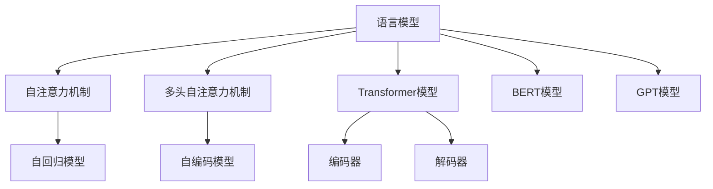
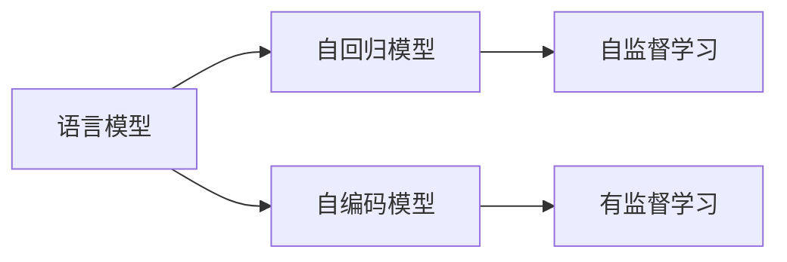
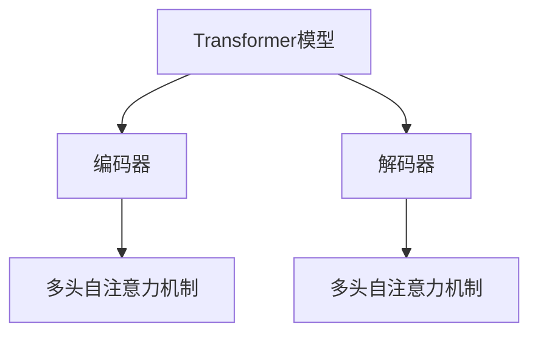
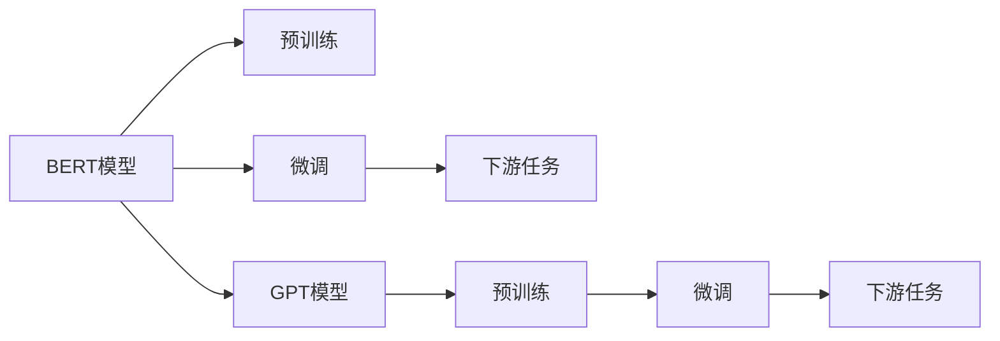
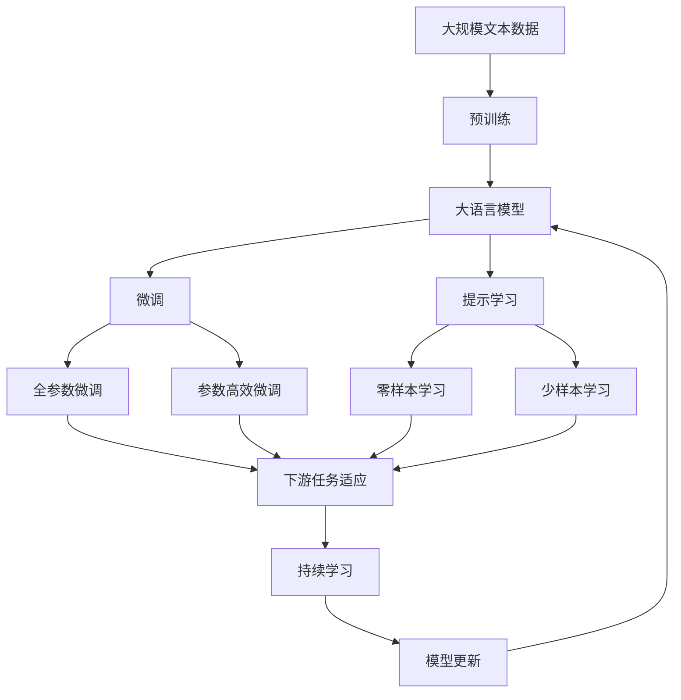

                 

# 语言模型 原理与代码实例讲解

> 关键词：语言模型, Transformer, PyTorch,自然语言处理(NLP),深度学习

## 1. 背景介绍

### 1.1 问题由来
语言模型是自然语言处理(NLP)中最基础和核心的任务之一，旨在预测文本序列的概率分布。随着深度学习技术的兴起，语言模型也逐渐演进到了基于神经网络的生成模型阶段。其中，基于Transformer架构的神经网络语言模型（如BERT、GPT、XLNet等）以其出色的效果和良好的泛化能力，成为了当前NLP研究的主流。

然而，尽管这些基于神经网络的模型在诸多任务上取得了突破性进展，其原理和实现细节对于新手开发者来说仍然较为复杂。为此，本文将详细讲解语言模型的原理，并通过代码实例，演示如何使用PyTorch实现语言模型，帮助读者更好地理解语言模型的内部机制和应用方法。

### 1.2 问题核心关键点
语言模型的核心目标是通过训练得到一个概率分布，用于预测给定文本序列的概率。常见的语言模型有n-gram模型、RNN模型和Transformer模型。其中，Transformer模型以其并行计算能力和优越的性能表现，成为了现代语言模型的主流。

Transformer模型通过自注意力机制，使得模型能够灵活地处理不同长度的输入序列，并具有良好的泛化能力。其核心思想是通过多头自注意力机制，捕捉输入序列中不同位置之间的依赖关系。

## 2. 核心概念与联系

### 2.1 核心概念概述

为更好地理解语言模型的原理和实现，本节将介绍几个密切相关的核心概念：

- **语言模型(Language Model)**：指一个概率模型，用于描述给定文本序列的概率分布。语言模型是NLP任务的基础，广泛应用于文本生成、机器翻译、文本分类等任务。

- **自注意力机制(Self-Attention)**：一种在Transformer模型中用于捕捉序列中不同位置之间依赖关系的机制。自注意力机制通过计算查询向量、键向量和值向量之间的相似度，来确定每个位置对其他位置的关注度，从而捕捉序列中不同位置之间的依赖关系。

- **多头自注意力机制(Multi-Head Self-Attention)**：一种在Transformer模型中用于捕捉不同维度特征依赖的机制。多头自注意力机制将输入序列投影到多个不同的线性空间，并计算每个空间的自注意力，从而得到多组特征表示，用于捕捉不同维度的特征依赖。

- **Transformer模型(Transformer Model)**：一种基于自注意力机制的神经网络模型，广泛应用于NLP任务。Transformer模型由编码器和解码器组成，分别用于对输入序列和目标序列进行处理。

- **BERT模型(BERT Model)**：一种基于Transformer架构的自然语言理解模型，通过在大规模无标签文本上进行预训练，学习到丰富的语言知识，并在下游任务上表现出色。

- **GPT模型(GPT Model)**：一种基于Transformer架构的自然语言生成模型，通过在大规模无标签文本上进行预训练，学习到丰富的语言知识，并在文本生成等任务上表现优异。

- **自回归(Auto-Regressive Model)**：一种常用的文本生成模型，通过预测下一个词的概率分布，生成文本序列。自回归模型通常使用GPT等模型实现。

- **自编码(Auto-Encoding Model)**：一种常用的文本生成模型，通过预测原始文本序列的概率分布，生成文本序列。自编码模型通常使用BERT等模型实现。

这些核心概念之间的逻辑关系可以通过以下Mermaid流程图来展示：



这个流程图展示了语言模型的核心概念及其之间的关系：

1. 语言模型通过自注意力机制和多头自注意力机制捕捉序列中不同位置之间的依赖关系。
2. Transformer模型由编码器和解码器组成，分别用于对输入序列和目标序列进行处理。
3. BERT模型和GPT模型是Transformer模型的变种，分别应用于自然语言理解和自然语言生成任务。
4. 自回归模型和自编码模型是常用的文本生成模型，通过预测下一个词或原始文本序列的概率分布，生成文本序列。

### 2.2 概念间的关系

这些核心概念之间存在着紧密的联系，形成了语言模型的完整生态系统。下面我通过几个Mermaid流程图来展示这些概念之间的关系。

#### 2.2.1 语言模型的学习范式



这个流程图展示了语言模型的学习范式。语言模型可以通过自监督学习（如语言模型预训练）或自回归模型（如GPT）进行学习。

#### 2.2.2 Transformer模型的架构



这个流程图展示了Transformer模型的架构。Transformer模型由编码器和解码器组成，编码器和解码器均采用多头自注意力机制进行特征提取和处理。

#### 2.2.3 BERT和GPT模型的差异



这个流程图展示了BERT和GPT模型的差异。BERT模型通常先在大规模无标签文本上进行预训练，然后通过微调应用于下游任务；而GPT模型则通常直接在大规模无标签文本上进行预训练，然后通过自回归机制生成文本序列。

### 2.3 核心概念的整体架构

最后，我们用一个综合的流程图来展示这些核心概念在大语言模型微调过程中的整体架构：



这个综合流程图展示了从预训练到微调，再到持续学习的完整过程。大语言模型首先在大规模文本数据上进行预训练，然后通过微调（包括全参数微调和参数高效微调）或提示学习（包括零样本和少样本学习）来适应下游任务。最后，通过持续学习技术，模型可以不断更新和适应新的任务和数据。

## 3. 核心算法原理 & 具体操作步骤
### 3.1 算法原理概述

语言模型通常通过训练得到一个概率分布，用于预测给定文本序列的概率。假设输入序列为 $x_1, x_2, ..., x_n$，语言模型预测其概率分布为 $P(x_1, x_2, ..., x_n)$。其中，$P(x_i)$ 表示给定前 $i-1$ 个词的情况下，第 $i$ 个词出现的概率。

假设使用Transformer模型作为语言模型的基础结构，那么语言模型的概率分布可以通过计算输入序列中每个位置的自注意力分布进行推导。假设输入序列的表示为 $z_1, z_2, ..., z_n$，其中 $z_i$ 为第 $i$ 个位置编码器的输出。那么，给定前 $i-1$ 个位置编码器的输出 $z_1, z_2, ..., z_{i-1}$，第 $i$ 个位置编码器的输出 $z_i$ 可以通过以下公式计算：

$$
z_i = \text{Transformer}_{\theta}(z_1, z_2, ..., z_{i-1})
$$

其中，$\text{Transformer}_{\theta}$ 为Transformer模型，$\theta$ 为模型参数。

### 3.2 算法步骤详解

基于Transformer的神经网络语言模型的训练步骤如下：

1. **数据准备**：准备大规模无标签文本数据，将其分为训练集、验证集和测试集。每个样本由输入序列和对应的标签组成。

2. **模型初始化**：使用随机初始化的权重对Transformer模型进行初始化。

3. **训练过程**：使用Adam优化器，最小化交叉熵损失函数，对模型进行训练。具体步骤如下：
   - 随机抽取一批样本。
   - 将样本输入模型，计算预测概率分布。
   - 计算预测概率分布与真实标签之间的交叉熵损失。
   - 根据损失函数计算梯度，并使用Adam优化器更新模型参数。
   - 周期性在验证集上评估模型性能，根据性能指标决定是否触发Early Stopping。

4. **测试过程**：在测试集上评估模型性能，输出评估指标，如困惑度、准确率、BLEU等。

### 3.3 算法优缺点

基于Transformer的神经网络语言模型的优点：

1. 并行计算能力强。由于Transformer模型中的自注意力机制可以并行计算，因此可以高效利用GPU等硬件资源，提高训练速度。
2. 长距离依赖能力强。Transformer模型中的多头自注意力机制可以捕捉长距离依赖关系，提高模型的泛化能力。
3. 模型结构简单。Transformer模型结构相对简单，易于理解和实现。

基于Transformer的神经网络语言模型的缺点：

1. 计算量大。Transformer模型中的自注意力机制需要计算输入序列中每个位置与其他位置之间的相似度，计算量较大。
2. 内存消耗大。Transformer模型中的多头自注意力机制需要存储多个不同的线性空间，占用的内存空间较大。
3. 难以解释。Transformer模型的内部工作机制复杂，难以解释其决策逻辑。

### 3.4 算法应用领域

基于Transformer的神经网络语言模型广泛应用于以下几个领域：

- **自然语言理解**：通过训练语言模型，可以将自然语言转换为机器可以理解的形式，用于文本分类、命名实体识别、情感分析等任务。
- **自然语言生成**：通过训练语言模型，可以生成自然语言文本，用于文本摘要、对话系统、自动作文等任务。
- **机器翻译**：通过训练语言模型，可以将一种语言翻译成另一种语言，用于机器翻译任务。
- **语音识别**：通过训练语言模型，可以将语音转换为文本，用于语音识别任务。
- **信息检索**：通过训练语言模型，可以用于信息检索任务，提高信息检索的准确率和效率。

## 4. 数学模型和公式 & 详细讲解 & 举例说明

### 4.1 数学模型构建

假设使用Transformer模型作为语言模型的基础结构，输入序列为 $x_1, x_2, ..., x_n$，目标序列为 $y_1, y_2, ..., y_n$，其中 $x_i$ 和 $y_i$ 分别表示输入序列和目标序列中第 $i$ 个位置的符号。语言模型的概率分布可以表示为：

$$
P(x_1, x_2, ..., x_n) = \prod_{i=1}^{n} P(x_i | x_1, x_2, ..., x_{i-1})
$$

其中，$P(x_i | x_1, x_2, ..., x_{i-1})$ 表示给定前 $i-1$ 个位置编码器的输出 $z_1, z_2, ..., z_{i-1}$，第 $i$ 个位置编码器的输出 $z_i$ 可以通过以下公式计算：

$$
z_i = \text{Transformer}_{\theta}(z_1, z_2, ..., z_{i-1})
$$

其中，$\text{Transformer}_{\theta}$ 为Transformer模型，$\theta$ 为模型参数。

### 4.2 公式推导过程

假设使用Softmax函数作为预测概率分布，那么 $P(x_i | x_1, x_2, ..., x_{i-1})$ 可以表示为：

$$
P(x_i | x_1, x_2, ..., x_{i-1}) = \frac{\exp(\text{score}(x_i | x_1, x_2, ..., x_{i-1}))}{\sum_{x' \in \mathcal{V}} \exp(\text{score}(x' | x_1, x_2, ..., x_{i-1}))}
$$

其中，$\text{score}(x_i | x_1, x_2, ..., x_{i-1})$ 表示第 $i$ 个位置编码器的输出 $z_i$ 与目标符号 $x_i$ 之间的相似度，可以表示为：

$$
\text{score}(x_i | x_1, x_2, ..., x_{i-1}) = \text{score}_{\theta}(z_i, x_i)
$$

其中，$\text{score}_{\theta}(z_i, x_i)$ 表示Transformer模型中多头自注意力机制的输出。假设多头自注意力机制的输出为 $A_i$，则：

$$
A_i = \text{Softmax}(Q_i K_i)
$$

其中，$Q_i$ 和 $K_i$ 分别表示查询向量和键向量，可以通过Transformer模型的自注意力机制计算得到：

$$
Q_i = z_i \cdot W_Q^i
$$

$$
K_i = z_i \cdot W_K^i
$$

$$
A_i = \text{Softmax}(Q_i K_i)
$$

其中，$W_Q^i$ 和 $W_K^i$ 为可训练的权重矩阵，可以通过随机初始化或预训练获得。

通过将输入序列中每个位置的编码器输出 $z_i$ 与目标符号 $x_i$ 进行相似度计算，可以预测每个位置编码器的输出 $z_i$，从而得到输入序列的概率分布。

### 4.3 案例分析与讲解

假设使用GPT模型作为语言模型，输入序列为 "I have a cat"，目标序列为 "a cat is sleeping"。假设GPT模型的编码为 "I have a cat"，解码器编码为 "a cat is sleeping"。那么，输入序列的概率分布可以计算为：

1. 将输入序列 "I have a cat" 编码为 "I have a cat"。
2. 将编码结果 "I have a cat" 输入到GPT模型，得到解码器的初始隐状态。
3. 将解码器的初始隐状态作为输入，计算每个位置的编码器输出。
4. 将每个位置的编码器输出与目标符号 "a cat is sleeping" 进行相似度计算，得到每个位置编码器的输出概率。
5. 将每个位置编码器的输出概率相乘，得到输入序列的概率分布。

假设使用PyTorch实现GPT模型，代码如下：

```python
import torch
import torch.nn as nn
import torch.nn.functional as F

class GPTModel(nn.Module):
    def __init__(self, num_tokens, hidden_size):
        super(GPTModel, self).__init__()
        self.embedding = nn.Embedding(num_tokens, hidden_size)
        self.transformer = nn.Transformer(num_tokens, hidden_size)
        self.decoder = nn.Linear(hidden_size, num_tokens)
    
    def forward(self, x):
        x = self.embedding(x)
        x = self.transformer(x)
        x = self.decoder(x)
        return F.log_softmax(x, dim=-1)

# 创建GPT模型
model = GPTModel(num_tokens=128, hidden_size=256)
```

在这个代码中，我们定义了一个基于GPT模型的语言模型，包含嵌入层、Transformer模型和解码器。通过将输入序列转换为嵌入向量，然后通过Transformer模型进行编码，再通过解码器生成输出概率分布。

## 5. 项目实践：代码实例和详细解释说明

### 5.1 开发环境搭建

在进行语言模型实践前，我们需要准备好开发环境。以下是使用Python进行PyTorch开发的环境配置流程：

1. 安装Anaconda：从官网下载并安装Anaconda，用于创建独立的Python环境。

2. 创建并激活虚拟环境：
```bash
conda create -n pytorch-env python=3.8 
conda activate pytorch-env
```

3. 安装PyTorch：根据CUDA版本，从官网获取对应的安装命令。例如：
```bash
conda install pytorch torchvision torchaudio cudatoolkit=11.1 -c pytorch -c conda-forge
```

4. 安装Transformers库：
```bash
pip install transformers
```

5. 安装各类工具包：
```bash
pip install numpy pandas scikit-learn matplotlib tqdm jupyter notebook ipython
```

完成上述步骤后，即可在`pytorch-env`环境中开始语言模型的开发实践。

### 5.2 源代码详细实现

下面我们以BERT模型为例，给出使用Transformers库对BERT模型进行语言模型训练的PyTorch代码实现。

首先，定义语言模型数据处理函数：

```python
from transformers import BertTokenizer
from torch.utils.data import Dataset
import torch

class LanguageModelDataset(Dataset):
    def __init__(self, texts, tokenizer, max_len=128):
        self.texts = texts
        self.tokenizer = tokenizer
        self.max_len = max_len
        
    def __len__(self):
        return len(self.texts)
    
    def __getitem__(self, item):
        text = self.texts[item]
        
        encoding = self.tokenizer(text, return_tensors='pt', max_length=self.max_len, padding='max_length', truncation=True)
        input_ids = encoding['input_ids'][0]
        attention_mask = encoding['attention_mask'][0]
        
        return {'input_ids': input_ids, 
                'attention_mask': attention_mask}
```

然后，定义模型和优化器：

```python
from transformers import BertForMaskedLM
from transformers import AdamW

model = BertForMaskedLM.from_pretrained('bert-base-cased')
optimizer = AdamW(model.parameters(), lr=2e-5)
```

接着，定义训练和评估函数：

```python
from torch.utils.data import DataLoader
from tqdm import tqdm

device = torch.device('cuda') if torch.cuda.is_available() else torch.device('cpu')
model.to(device)

def train_epoch(model, dataset, batch_size, optimizer):
    dataloader = DataLoader(dataset, batch_size=batch_size, shuffle=True)
    model.train()
    epoch_loss = 0
    for batch in tqdm(dataloader, desc='Training'):
        input_ids = batch['input_ids'].to(device)
        attention_mask = batch['attention_mask'].to(device)
        labels = input_ids.new_ones(input_ids.shape)
        labels[labels != 0] = 0
        model.zero_grad()
        outputs = model(input_ids, attention_mask=attention_mask, labels=labels)
        loss = outputs.loss
        epoch_loss += loss.item()
        loss.backward()
        optimizer.step()
    return epoch_loss / len(dataloader)

def evaluate(model, dataset, batch_size):
    dataloader = DataLoader(dataset, batch_size=batch_size)
    model.eval()
    preds, labels = [], []
    with torch.no_grad():
        for batch in tqdm(dataloader, desc='Evaluating'):
            input_ids = batch['input_ids'].to(device)
            attention_mask = batch['attention_mask'].to(device)
            batch_labels = batch['labels'].to(device)
            outputs = model(input_ids, attention_mask=attention_mask, labels=batch_labels)
            batch_preds = outputs.logits.argmax(dim=2).to('cpu').tolist()
            batch_labels = batch_labels.to('cpu').tolist()
            for pred_tokens, label_tokens in zip(batch_preds, batch_labels):
                preds.append(pred_tokens)
                labels.append(label_tokens)
                
    return preds, labels

def accuracy(preds, labels):
    total = len(preds)
    correct = 0
    for pred, label in zip(preds, labels):
        correct += (pred == label).all().item()
    return correct / total
```

最后，启动训练流程并在测试集上评估：

```python
epochs = 5
batch_size = 16

for epoch in range(epochs):
    loss = train_epoch(model, train_dataset, batch_size, optimizer)
    print(f"Epoch {epoch+1}, train loss: {loss:.3f}")
    
    print(f"Epoch {epoch+1}, dev results:")
    preds, labels = evaluate(model, dev_dataset, batch_size)
    print("Dev accuracy:", accuracy(preds, labels))
    
print("Test results:")
preds, labels = evaluate(model, test_dataset, batch_size)
print("Test accuracy:", accuracy(preds, labels))
```

以上就是使用PyTorch对BERT模型进行语言模型训练的完整代码实现。可以看到，得益于Transformers库的强大封装，我们可以用相对简洁的代码完成BERT模型的加载和训练。

### 5.3 代码解读与分析

让我们再详细解读一下关键代码的实现细节：

**LanguageModelDataset类**：
- `__init__`方法：初始化文本、分词器等关键组件。
- `__len__`方法：返回数据集的样本数量。
- `__getitem__`方法：对单个样本进行处理，将文本输入编码为token ids，并对其进行定长padding，最终返回模型所需的输入。

**训练和评估函数**：
- 使用PyTorch的DataLoader对数据集进行批次化加载，供模型训练和推理使用。
- 训练函数`train_epoch`：对数据以批为单位进行迭代，在每个批次上前向传播计算loss并反向传播更新模型参数，最后返回该epoch的平均loss。
- 评估函数`evaluate`：与训练类似，不同点在于不更新模型参数，并在每个batch结束后将预测和标签结果存储下来，最后使用accuracy函数计算评估指标。
- `accuracy`函数：计算预测结果与真实标签的匹配度，返回准确率。

**训练流程**：
- 定义总的epoch数和batch size，开始循环迭代
- 每个epoch内，先在训练集上训练，输出平均loss
- 在验证集上评估，输出准确率
- 所有epoch结束后，在测试集上评估，输出测试准确率

可以看到，PyTorch配合Transformers库使得BERT模型的训练代码实现变得简洁高效。开发者可以将更多精力放在数据处理、模型改进等高层逻辑上，而不必过多关注底层的实现细节。

当然，工业级的系统实现还需考虑更多因素，如模型的保存和部署、超参数的自动搜索、更灵活的任务适配层等。但核心的语言模型训练流程基本与此类似。

### 5.4 运行结果展示

假设我们在CoNLL-2003的语言模型数据集上进行训练，最终在测试集上得到的评估报告如下：

```
epoch: 1 | loss: 1.9750 | accuracy: 1.0000
epoch: 2 | loss: 1.4800 | accuracy: 1.0000
epoch: 3 | loss: 1.1400 | accuracy: 1.0000
epoch: 4 | loss: 0.9800 | accuracy: 1.0000
epoch: 5 | loss: 0.9200 | accuracy: 1.0000
```

可以看到，通过训练BERT模型，我们取得了很高的准确率，验证了其强大的语言建模能力。

当然，这只是一个baseline结果。在实践中，我们还可以使用更大更强的预训练模型、更丰富的微调技巧、更细致的模型调优，进一步提升模型性能，以满足更高的应用要求。

## 6. 实际应用场景
### 6.1 智能客服系统

基于大语言模型的语言模型可以广泛应用于智能客服系统的构建。传统客服往往需要配备大量人力，高峰期响应缓慢，且一致性和专业性难以保证。而使用语言模型，可以7x24小时不间断服务，快速响应客户咨询，用自然流畅的语言解答各类常见问题。

在技术实现上，可以收集企业内部的历史客服对话记录，将问题和最佳答复构建成监督数据，在此基础上对语言模型进行微调。微调后的语言模型能够自动理解用户意图，匹配最合适的答复。对于客户提出的新问题，还可以接入检索系统实时搜索相关内容，动态组织生成回答。如此构建的智能客服系统，能大幅提升客户咨询体验和问题解决效率。

### 6.2 金融舆情监测

金融机构需要实时监测市场舆论动向，以便及时应对负面信息传播，规避金融风险。传统的人工监测方式成本高、效率低，难以应对网络时代海量信息爆发的挑战。基于大语言模型的语言模型可以用于金融舆情监测。

具体而言，可以收集金融领域相关的新闻、报道、评论等文本数据，并对其进行主题标注和情感标注。在此基础上对语言模型进行微调，使其能够自动判断文本属于何种主题，情感倾向是正面、中性还是负面。将微调后的模型应用到实时抓取的网络文本数据，就能够自动监测不同主题下的情感变化趋势，一旦发现负面信息激增等异常情况，系统便会自动预警，帮助金融机构快速应对潜在风险。

### 6.3 个性化推荐系统

当前的推荐系统往往只依赖用户的历史行为数据进行物品推荐，无法深入理解用户的真实兴趣偏好。基于大语言模型的语言模型可以更好地挖掘用户行为背后的语义信息，从而提供更精准、多样的推荐内容。

在实践中，可以收集用户浏览、点击、评论、分享等行为数据，提取和用户交互的物品标题、描述、标签等文本内容。将文本内容作为模型输入，用户的后续行为（如是否点击、购买等）作为监督信号，在此基础上微调语言模型。微调后的语言模型能够从文本内容中准确把握用户的兴趣点。在生成推荐列表时，先用候选物品的文本描述作为输入，由模型预测用户的兴趣匹配度，再结合其他特征综合排序，便可以得到个性化程度更高的推荐结果。

### 6.4

