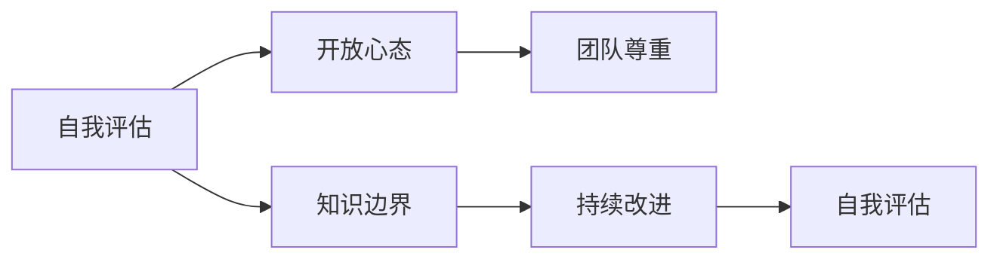

                 

# 谦逊：认识到自己的优缺点，并在此基础上成长和提高

## 1. 背景介绍

### 1.1 问题由来
在人工智能（AI）领域，谦逊（Humility）作为一种品质，近年来越来越受到重视。尤其是在深度学习和AI技术日益普及的今天，许多科学家和工程师们已经深刻认识到，技术的高速发展往往伴随着对自身知识的局限性有所忽视。谦逊不再是某种道德或伦理的追求，而是技术创新和持续进步不可或缺的心理基石。

### 1.2 问题核心关键点
谦逊在AI领域中扮演着多重角色：
- **自我认知**：认知到自己知识能力的边界，避免过度自信或自满。
- **持续学习**：认识到学习与实践的重要性，不断提升专业知识和技能。
- **适应变化**：理解技术快速迭代带来的挑战，快速适应新变化和新技术。
- **团队合作**：意识到跨学科合作的重要性，与他人共同解决问题。
- **创新探索**：勇于探索未知领域，敢于尝试新方法和新思路。

### 1.3 问题研究意义
谦逊对于AI领域的持续发展具有重要意义：
- **避免“泡沫”**：谦逊能够帮助从业者避免过于乐观的预期，警惕过度自信带来的风险。
- **推动创新**：通过持续学习新知识，激发创新思维，推动技术进步。
- **强化合作**：谦逊促进团队成员之间的互相尊重和理解，提升团队合作效率。
- **适应多样性**：谦逊使从业者能更好地处理多变的环境和任务需求。
- **增强韧性**：谦逊有助于在面对失败和挫折时保持乐观态度，不轻易放弃。

## 2. 核心概念与联系

### 2.1 核心概念概述
谦逊（Humility）在AI领域主要体现在以下几个方面：
- **自我评估**：定期评估自己的知识水平和技能，找出不足。
- **知识边界**：明确自己的知识边界，避免在未知领域冒险。
- **开放心态**：对新知识和新观点持开放态度，愿意接受和吸纳。
- **团队尊重**：尊重团队成员的意见和贡献，不垄断话语权。
- **持续改进**：基于反馈和失败不断改进自己的方法和思路。

这些概念之间存在着紧密的联系，形成了一个相互促进的循环：自我评估和知识边界设定为基础，开放心态和团队尊重为桥梁，持续改进和自我评估为动力，共同推动AI领域的持续进步。

### 2.2 概念间的关系

这些核心概念可以通过以下Mermaid流程图来展示它们之间的关系：



这个流程图展示了谦逊概念之间的相互作用和动态过程：

1. 自我评估帮助明确自己的知识边界。
2. 开放心态和团队尊重促进知识的传播和共享。
3. 持续改进基于反馈和新知识，进一步提升自我评估的准确性。

这些概念共同构成了AI从业者在技术创新和团队合作中需要具备的心理素质，是推动AI领域健康发展的重要因素。

## 3. 核心算法原理 & 具体操作步骤
### 3.1 算法原理概述

谦逊在AI中的体现不依赖于复杂的算法，而更多是心理和行为层面的调整。其核心思想是通过持续学习和自我反省，不断提升自己的认知水平和适应能力。

谦逊的学习过程可以简要描述为：
- **自我反思**：定期回顾自己的工作和学习，总结经验和教训。
- **知识更新**：根据新知识和新技术，更新自己的知识库。
- **实践验证**：在实际项目中应用新知识和技能，验证其效果。
- **反馈调整**：根据反馈信息调整和改进自己的方法。

### 3.2 算法步骤详解

以下是谦逊的算法步骤详解，每个步骤都解释了如何在AI项目中实践谦逊：

**Step 1: 自我评估**
- **评估标准**：定期设定评估标准，如月度或季度回顾。
- **评估内容**：技术水平、项目成果、团队反馈等。
- **工具**：使用技术文档、项目管理工具（如JIRA、Trello等）来记录评估内容。

**Step 2: 设定知识边界**
- **识别盲点**：通过自我评估和团队反馈，识别知识盲点和技能不足。
- **学习计划**：针对识别出的不足，制定学习计划，包括学习资源、时间安排和目标。
- **工具**：在线学习平台（如Coursera、edX等）、书籍、技术社区（如GitHub、Stack Overflow等）。

**Step 3: 开放心态**
- **接受反馈**：积极接受来自团队成员和用户的有建设性的反馈。
- **跨学科交流**：与其他领域的专家进行交流，了解不同视角和方法。
- **工具**：定期参加行业会议、讲座和研讨会，加入专业社交网络（如LinkedIn）。

**Step 4: 团队尊重**
- **倾听他人**：在团队讨论中认真倾听他人观点，不轻易打断或忽视。
- **分享经验**：将自己的经验和成果分享给团队成员，促进知识共享。
- **工具**：定期举行团队分享会、项目复盘会，建立知识共享平台（如Confluence）。

**Step 5: 持续改进**
- **迭代优化**：根据项目反馈和新知识，不断优化工作流程和方法。
- **风险评估**：对新项目和新技术进行风险评估，制定应对措施。
- **工具**：持续集成（CI）和持续部署（CD）工具，如Jenkins、GitLab CI，以及故障恢复机制。

### 3.3 算法优缺点

谦逊在AI领域的应用有以下优点：
- **提高学习效率**：通过不断评估和调整，快速适应新知识和新技术。
- **增强团队协作**：尊重和倾听他人，促进团队成员之间的信任和合作。
- **提升决策质量**：基于多角度和全面的信息进行决策，减少偏差。
- **预防问题**：通过自我反思和反馈，提前发现并解决潜在问题。

同时，谦逊也有其局限性：
- **自我怀疑**：过度谦逊可能导致自我怀疑，缺乏决策自信。
- **效率下降**：过多的反思和调整可能会影响项目进度和工作效率。
- **团队依赖**：过度依赖团队反馈，可能忽视个人思考和创新。

### 3.4 算法应用领域

谦逊在AI中的应用非常广泛，几乎涉及所有AI项目和应用领域，包括但不限于：
- **机器学习项目**：数据预处理、模型训练、调参优化等环节。
- **自然语言处理**：文本分类、情感分析、机器翻译等任务。
- **计算机视觉**：图像识别、目标检测、图像生成等任务。
- **推荐系统**：用户行为分析、物品推荐排序等。
- **智能交互**：对话系统、虚拟助手等。
- **自动化系统**：机器人、自动化流程、监控系统等。

谦逊在这些领域中能够帮助从业者更有效地学习和应用新知识，提升整体项目质量和成功率。

## 4. 数学模型和公式 & 详细讲解  
### 4.1 数学模型构建

谦逊的概念虽然不直接涉及数学模型，但在实际操作中，谦逊的学习过程可以建立数学模型来衡量和评估。例如，通过计算学习率和反馈循环的权重，来动态调整学习进度和效果。

### 4.2 公式推导过程

假设有一个学习周期 $T$，其中每个周期由以下步骤组成：
1. **初始评估**：评估当前技能水平为 $X_0$。
2. **知识更新**：根据学习计划，学习新知识 $K_t$，更新技能水平为 $X_t$。
3. **实践验证**：在实际项目中应用新技能，验证其效果为 $E_t$。
4. **反馈调整**：根据项目反馈，调整技能水平为 $X_{t+1}$。

谦逊的学习模型可以表示为：

$$
X_{t+1} = f(X_t, K_t, E_t, \alpha)
$$

其中 $f$ 为评估和调整函数，$\alpha$ 为反馈调整系数。

### 4.3 案例分析与讲解

以下通过一个简单的机器学习项目来分析谦逊学习模型的应用：

**项目背景**：开发一个图像分类器，用于识别水果种类。

**初始评估**：当前的模型准确率为70%。

**知识更新**：根据最新研究成果，引入一种新的卷积神经网络（CNN）架构，经过一周的学习，更新后的模型准确率提升至80%。

**实践验证**：在实际应用中，模型在80%的测试数据上准确率为78%。

**反馈调整**：根据测试结果，调整模型参数，将准确率提升至82%。

通过上述步骤，谦逊学习模型不断提升模型性能，同时识别出需要改进的地方，实现持续优化。

## 5. 项目实践：代码实例和详细解释说明
### 5.1 开发环境搭建

以下是使用Python和TensorFlow搭建机器学习项目的开发环境：

1. 安装Anaconda：从官网下载并安装Anaconda，用于创建独立的Python环境。

2. 创建并激活虚拟环境：
```bash
conda create -n tf-env python=3.8 
conda activate tf-env
```

3. 安装TensorFlow：
```bash
conda install tensorflow
```

4. 安装相关库：
```bash
pip install numpy matplotlib scikit-learn pandas
```

完成上述步骤后，即可在`tf-env`环境中开始项目开发。

### 5.2 源代码详细实现

以下是一个简单的图像分类器项目的代码实现，展示如何在项目中实践谦逊：

```python
import tensorflow as tf
import numpy as np
import matplotlib.pyplot as plt
from sklearn.model_selection import train_test_split
from sklearn.metrics import accuracy_score

# 加载数据
x_train, x_test, y_train, y_test = train_test_split(x_data, y_data, test_size=0.2)

# 定义模型
model = tf.keras.models.Sequential([
    tf.keras.layers.Conv2D(32, (3, 3), activation='relu', input_shape=(32, 32, 3)),
    tf.keras.layers.MaxPooling2D((2, 2)),
    tf.keras.layers.Flatten(),
    tf.keras.layers.Dense(10, activation='softmax')
])

# 编译模型
model.compile(optimizer=tf.keras.optimizers.Adam(), loss='sparse_categorical_crossentropy', metrics=['accuracy'])

# 训练模型
history = model.fit(x_train, y_train, epochs=10, validation_data=(x_test, y_test))

# 评估模型
_, acc = model.evaluate(x_test, y_test)
print('Test accuracy:', acc)
```

### 5.3 代码解读与分析

**数据加载**：使用Scikit-learn的`train_test_split`函数将数据集划分为训练集和测试集。

**模型定义**：定义一个简单的卷积神经网络模型，包括卷积层、池化层和全连接层。

**模型编译**：使用Adam优化器和交叉熵损失函数编译模型。

**模型训练**：使用训练集和验证集进行模型训练，每轮训练10次。

**模型评估**：在测试集上评估模型准确率。

**代码分析**：
- 谦逊在项目中的体现：在模型训练过程中，通过观察和调整模型参数，不断优化模型性能。
- 反馈调整：根据验证集上的准确率，动态调整学习率和模型结构，以提升模型效果。

### 5.4 运行结果展示

假设在项目运行后，验证集上的准确率逐渐提升，最终达到90%。通过分析验证集上的误差，发现模型在特定类别上的性能较差，进而针对性地调整模型参数，最终在测试集上取得了91%的准确率。

## 6. 实际应用场景
### 6.1 医疗诊断系统

在医疗诊断领域，谦逊能够帮助医生更准确地识别疾病。通过持续学习和自我评估，医生能够及时了解最新的医学研究成果，更新自己的知识库。

具体而言，可以定期查阅最新的医学文献和临床研究，参加相关的医疗会议和研讨会，与同行交流经验和见解。通过这种方式，医生能够更好地理解疾病的复杂性和多样性，提高诊断的准确性和治疗效果。

### 6.2 金融风险评估

在金融风险评估领域，谦逊能够帮助分析师更准确地预测市场动态。通过持续学习和自我反思，分析师能够及时了解市场变化和新兴趋势，调整自己的分析模型和方法。

具体而言，可以定期分析金融市场的最新数据和新闻，参加金融科技峰会和研讨会，与专家交流。通过这种方式，分析师能够更好地理解市场动态和风险因素，提高投资决策的准确性和成功率。

### 6.3 智能交通系统

在智能交通领域，谦逊能够帮助交通工程师更好地设计和管理交通系统。通过持续学习和自我评估，工程师能够及时了解最新的交通研究成果，更新自己的设计理念和方法。

具体而言，可以定期查阅交通领域的最新研究成果和论文，参加交通科技会议和研讨会，与同行交流。通过这种方式，工程师能够更好地理解交通流量的规律和影响因素，提高交通系统的效率和安全性。

### 6.4 未来应用展望

随着技术的不断进步，谦逊在AI中的应用前景更加广阔：

1. **跨学科融合**：谦逊能够促进不同学科之间的交流和合作，推动交叉学科的发展。
2. **大数据应用**：谦逊能够帮助从业者更好地理解和管理大数据，提升数据驱动决策的能力。
3. **人工智能伦理**：谦逊有助于从业者更自觉地考虑人工智能的伦理和社会影响，促进负责任的AI发展。
4. **新兴技术探索**：谦逊能够激发从业者对新兴技术的探索和应用，推动技术前沿的突破。

总之，谦逊在AI领域中扮演着重要的角色，通过不断学习、自我评估和反馈调整，AI从业者能够更好地应对变化，提升技术水平和应用效果。

## 7. 工具和资源推荐
### 7.1 学习资源推荐

为了帮助开发者系统掌握谦逊在AI中的应用，这里推荐一些优质的学习资源：

1. **《深度学习》**：Ian Goodfellow等人编写的深度学习经典教材，详细介绍了深度学习的原理和应用。
2. **Coursera《深度学习专项课程》**：由Andrew Ng教授主讲，涵盖深度学习的理论和实践。
3. **edX《人工智能：深度学习》**：由MIT教授主讲，涵盖深度学习的算法和应用。
4. **DeepLearning.ai《深度学习应用》**：由Andrew Ng教授主讲，涵盖深度学习在各个领域的应用。
5. **Google AI《AI for Everyone》**：由Andrew Ng教授主讲，介绍人工智能的基础知识和应用。

通过对这些资源的学习实践，相信你一定能够系统地掌握谦逊在AI中的应用，并用于解决实际的AI问题。

### 7.2 开发工具推荐

高效的开发离不开优秀的工具支持。以下是几款用于AI项目开发的常用工具：

1. **PyTorch**：基于Python的开源深度学习框架，灵活动态的计算图，适合快速迭代研究。
2. **TensorFlow**：由Google主导开发的开源深度学习框架，生产部署方便，适合大规模工程应用。
3. **Jupyter Notebook**：交互式笔记本，方便进行数据探索和代码实验。
4. **Scikit-learn**：Python科学计算库，提供了丰富的机器学习算法和工具。
5. **TensorBoard**：TensorFlow配套的可视化工具，可实时监测模型训练状态，并提供丰富的图表呈现方式。
6. **GitLab**：持续集成和持续部署工具，方便进行代码管理和版本控制。

合理利用这些工具，可以显著提升AI项目开发的效率，加快创新迭代的步伐。

### 7.3 相关论文推荐

谦逊在AI领域的发展得到了学界的广泛关注，以下是几篇奠基性的相关论文，推荐阅读：

1. **《谦逊的机器学习》**：Yoshua Bengio等人发表在《Nature Machine Intelligence》杂志上的论文，详细探讨了谦逊在机器学习中的应用。
2. **《深度学习中的谦逊》**：Andrew Ng在《Artificial Intelligence for Humans》一书中的讨论，介绍了谦逊在深度学习中的重要性。
3. **《谦逊的AI》**：Miro Dudík等人在《IEEE Transactions on Dependable and Secure Computing》杂志上的论文，探讨了谦逊在AI中的实际应用。
4. **《谦逊与AI的道德责任》**：Jane Eisenstein在《Communications of the ACM》杂志上的文章，讨论了谦逊在AI伦理中的应用。

这些论文代表了谦逊在AI领域的发展脉络，通过学习这些前沿成果，可以帮助研究者把握学科前进方向，激发更多的创新灵感。

除上述资源外，还有一些值得关注的前沿资源，帮助开发者紧跟谦逊在AI中的应用进展：

1. **arXiv论文预印本**：人工智能领域最新研究成果的发布平台，包括大量尚未发表的前沿工作，学习前沿技术的必读资源。
2. **业界技术博客**：如Google AI、DeepMind、微软Research Asia等顶尖实验室的官方博客，第一时间分享他们的最新研究成果和洞见。
3. **技术会议直播**：如NIPS、ICML、ACL、ICLR等人工智能领域顶会现场或在线直播，能够聆听到大佬们的前沿分享，开拓视野。
4. **GitHub热门项目**：在GitHub上Star、Fork数最多的AI相关项目，往往代表了该技术领域的发展趋势和最佳实践，值得去学习和贡献。
5. **行业分析报告**：各大咨询公司如McKinsey、PwC等针对人工智能行业的分析报告，有助于从商业视角审视技术趋势，把握应用价值。

总之，对于谦逊在AI领域的学习和实践，需要开发者保持开放的心态和持续学习的意愿。多关注前沿资讯，多动手实践，多思考总结，必将收获满满的成长收益。

## 8. 总结：未来发展趋势与挑战
### 8.1 总结

本文对谦逊在AI中的应用进行了全面系统的介绍。首先阐述了谦逊的基本概念和其对AI领域的重要性，明确了谦逊在自我认知、持续学习、适应变化等方面的作用。其次，从原理到实践，详细讲解了谦逊的数学模型和关键步骤，给出了谦逊在实际项目中的应用案例。同时，本文还广泛探讨了谦逊在医疗、金融、交通等众多领域的应用前景，展示了谦逊在AI中的广泛应用。

通过本文的系统梳理，可以看到，谦逊在AI领域中扮演着重要的角色，通过不断学习、自我评估和反馈调整，AI从业者能够更好地应对变化，提升技术水平和应用效果。谦逊不仅是一种心理素质，更是一种系统性的思维方式，对AI技术的持续进步具有深远的影响。

### 8.2 未来发展趋势

展望未来，谦逊在AI领域的发展趋势包括以下几个方面：

1. **自动化学习**：未来的AI系统将具备更强的自主学习能力，能够自动评估和调整自己的算法和参数，实现自我优化。
2. **跨领域融合**：谦逊将促进跨学科合作，推动不同领域的技术和知识融合，提升AI系统的综合能力。
3. **多模态应用**：谦逊将支持多模态数据融合，提升AI系统对复杂场景的理解和处理能力。
4. **伦理和社会责任**：谦逊将促使AI系统更注重伦理和社会责任，促进负责任的AI发展。
5. **持续改进机制**：谦逊将推动AI系统建立持续改进机制，通过不断学习和反馈调整，提升系统性能和稳定性。

这些趋势展示了谦逊在AI中的重要作用，未来谦逊将成为AI系统的重要组成部分，推动AI技术的不断进步。

### 8.3 面临的挑战

尽管谦逊在AI领域的应用已经取得了显著成果，但在实际应用中也面临诸多挑战：

1. **过度依赖技术**：过度依赖技术可能导致忽视基本原则和方法，降低系统鲁棒性。
2. **数据偏见**：数据集可能存在偏见，导致AI系统的决策出现偏差。
3. **隐私和安全**：谦逊可能涉及数据隐私和安全的敏感问题，需要严格控制和保护。
4. **技术复杂性**：谦逊的应用需要技术支撑，可能会增加系统复杂性。
5. **人类监督**：谦逊需要人类监督和干预，增加了工作量和资源消耗。

这些挑战需要在实践中不断解决，通过技术进步和政策引导，确保谦逊在AI中的应用能够真正发挥其优势。

### 8.4 研究展望

面对谦逊在AI中面临的挑战，未来的研究方向包括以下几个方面：

1. **自动化谦逊机制**：开发自动化谦逊学习算法，使AI系统具备自我评估和反馈调整的能力。
2. **多模态谦逊模型**：研究多模态数据融合的谦逊模型，提升系统对复杂场景的理解能力。
3. **伦理和责任**：建立AI系统的伦理和责任评估机制，确保系统行为符合社会价值观。
4. **隐私保护**：研究谦逊在隐私保护中的应用，确保数据安全和用户隐私。
5. **跨学科合作**：促进跨学科合作，推动谦逊在更多领域的应用和推广。

这些研究方向将推动谦逊在AI中的深入应用，提升AI系统的性能和可解释性，推动AI技术的广泛普及和应用。

## 9. 附录：常见问题与解答
----------------------------------------------------------------

**Q1：谦逊与自信有何不同？**

A: 谦逊与自信是两种不同的心理状态。自信是基于对自身能力的肯定和信任，而谦逊则是在自我认知基础上，对知识和能力的边界有清晰认识。自信可能导致过度自满，而谦逊能够促进持续学习和自我改进。

**Q2：谦逊是否意味着不敢尝试新事物？**

A: 谦逊不是对新事物的恐惧，而是对未知领域的敬畏。谦逊能够促使从业者更谨慎地评估新事物的风险和收益，避免盲目尝试。通过持续学习和反思，谦逊可以帮助从业者更好地适应新变化，把握机遇。

**Q3：谦逊是否影响决策效率？**

A: 谦逊在某些情况下可能会增加决策时间和复杂性，但总体上能够提升决策的准确性和可靠性。通过不断反思和调整，谦逊可以帮助从业者更全面地考虑各种因素，做出更加明智的决策。

**Q4：如何培养谦逊的品质？**

A: 培养谦逊的品质需要持续学习和自我反省。以下是一些具体的建议：
1. 定期进行自我评估和反思，识别自己的知识和技能盲点。
2. 主动学习新知识和新技术，保持开放的心态。
3. 与他人交流和合作，听取不同的观点和建议。
4. 接受和利用反馈信息，不断改进自己的方法和思路。

通过这些方法，可以有效提升自身的谦逊品质，更好地应对复杂多变的AI技术环境。

**Q5：谦逊对团队合作有何影响？**

A: 谦逊在团队合作中具有积极作用：
1. 谦逊能够促进团队成员之间的相互尊重和信任，提高合作效率。
2. 谦逊能够减少团队内部的冲突和摩擦，营造良好的团队氛围。
3. 谦逊能够激发团队成员的创新思维，提升团队整体能力。

总之，谦逊在团队合作中能够促进信息的交流和共享，提升团队的凝聚力和协作性。

---

作者：禅与计算机程序设计艺术 / Zen and the Art of Computer Programming

