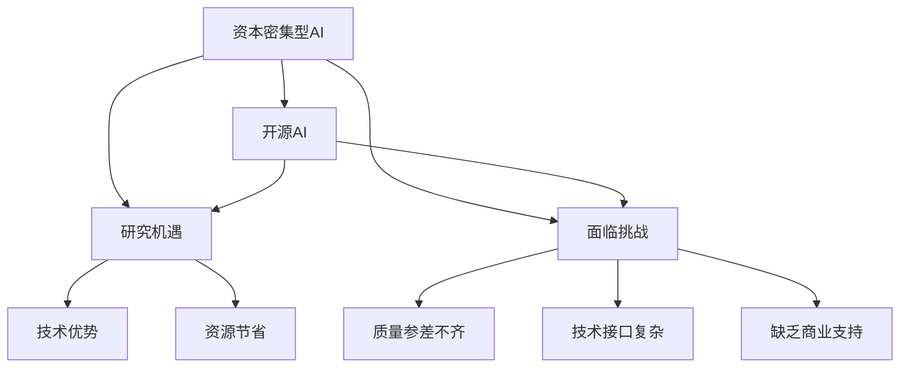
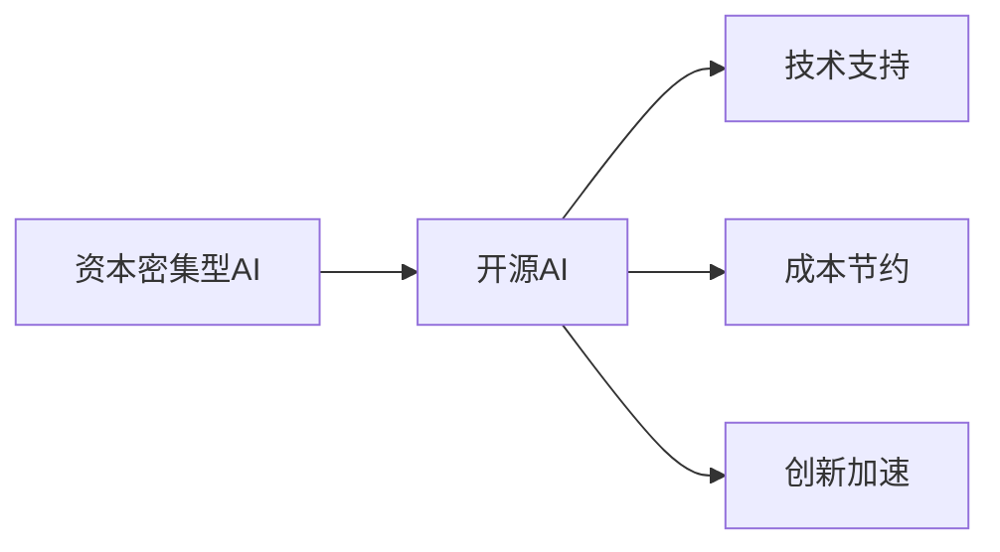
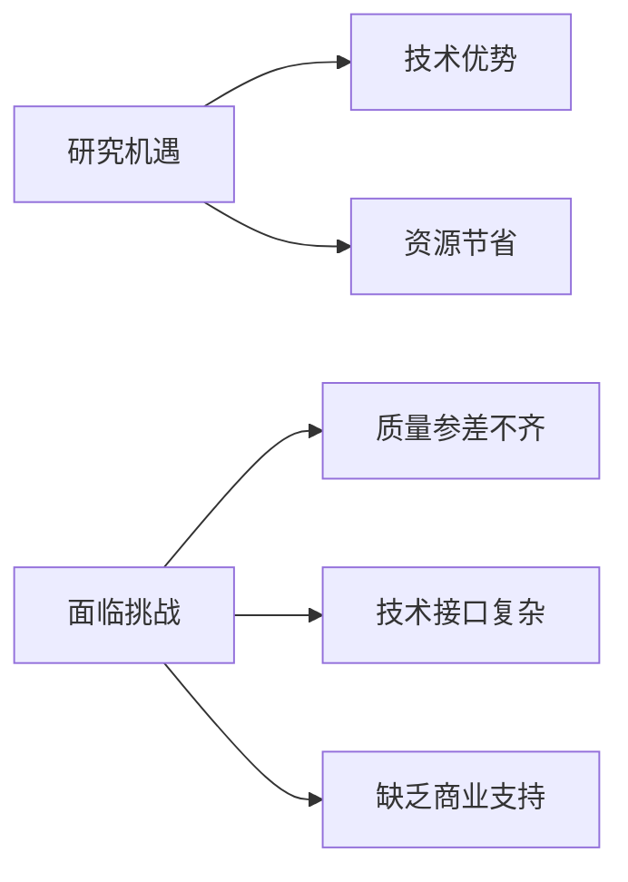

                 

# 资本密集型AI研究:开源的机遇与挑战

> 关键词：资本密集型AI, 开源AI, 研究机遇, 面临挑战

## 1. 背景介绍

### 1.1 问题由来

随着人工智能（AI）技术的发展，越来越多的企业投入巨资进行AI研究和开发。然而，AI技术的高投入、长周期、高风险等特点，使得资本密集型AI研究面临着严峻的挑战。如何有效地利用开源资源，最大化开源AI技术的商业价值，成为企业AI发展的关键问题。

### 1.2 问题核心关键点

本文聚焦于资本密集型AI研究，探讨开源资源在AI项目中的应用。主要包括以下几个核心关键点：

- 开源AI的概念和优势。
- 资本密集型AI项目的挑战。
- 开源资源在AI项目中的具体应用。
- 开源AI的商业化策略。

通过理解这些问题，可以更好地把握开源AI的机遇与挑战，为资本密集型AI项目的成功实施提供指导。

## 2. 核心概念与联系

### 2.1 核心概念概述

为更好地理解资本密集型AI研究中的开源资源应用，本节将介绍几个关键概念：

- **资本密集型AI**：指需要大量资金、人力和技术资源投入，研发周期长、风险高、回报不确定的AI项目。例如，AI药物研发、自动驾驶汽车等。

- **开源AI**：指公开共享的AI技术和代码资源，可免费下载、使用、修改和分发。开源AI通过社区的力量，推动了AI技术的发展和普及。

- **研究机遇**：指开源AI为资本密集型AI项目带来的技术优势和资源节省。例如，借助开源AI技术，企业可以缩短研发周期，降低研发成本，快速实现技术突破。

- **面临挑战**：指开源AI在资本密集型AI项目中可能遇到的困难和风险。例如，开源AI质量参差不齐、技术接口复杂、缺乏商业支持等。

这些概念之间的关系可以通过以下Mermaid流程图来展示：



这个流程图展示了大语言模型的核心概念及其之间的关系：

1. 资本密集型AI研究通过开源AI获取技术优势和资源节省。
2. 开源AI为资本密集型AI项目带来了研究机遇，但同时也面临质量、接口和商业化等挑战。

### 2.2 概念间的关系

这些核心概念之间存在着紧密的联系，形成了资本密集型AI研究中开源资源应用的完整生态系统。下面我们通过几个Mermaid流程图来展示这些概念之间的关系。

#### 2.2.1 资本密集型AI和开源AI的关系



这个流程图展示了资本密集型AI项目通过开源AI获得技术支持和成本节约，加速技术创新的过程。

#### 2.2.2 研究机遇和面临挑战的关系



这个流程图展示了开源AI在资本密集型AI项目中带来的研究机遇，同时面临的质量、接口和商业化等挑战。

## 3. 核心算法原理 & 具体操作步骤
### 3.1 算法原理概述

资本密集型AI研究中的开源资源应用，主要基于开源AI技术在项目中的整合和利用。以下是核心算法原理概述：

1. **开源AI技术集成**：将开源AI技术（如TensorFlow、PyTorch等）集成到资本密集型AI项目中，利用其强大的计算和数据处理能力，加速技术研发。

2. **开源AI框架定制**：根据项目需求，定制开源AI框架（如TensorFlow Lite、ONNX Runtime等），优化模型性能，提升用户体验。

3. **开源数据集利用**：利用开源数据集（如ImageNet、COCO等）进行模型训练和验证，提升模型泛化能力和鲁棒性。

### 3.2 算法步骤详解

以下是一份资本密集型AI项目中开源资源应用的详细步骤：

1. **项目需求分析**：明确项目目标和需求，评估开源AI技术的适用性和可行性。

2. **开源AI技术选型**：选择合适的开源AI技术，根据项目需求进行定制和优化。

3. **开源数据集获取**：获取并预处理开源数据集，进行模型训练和验证。

4. **开源框架集成**：将开源AI框架集成到项目中，进行模型部署和推理。

5. **模型性能优化**：优化模型性能，提升模型的准确性和效率。

6. **开源社区参与**：积极参与开源社区，获取技术支持和反馈。

### 3.3 算法优缺点

开源AI在资本密集型AI项目中具有以下优点：

1. **技术优势**：开源AI提供了强大的计算和数据处理能力，加速技术研发。

2. **成本节约**：开源AI资源免费，企业可以节省大量研发成本。

3. **社区支持**：开源AI社区提供了广泛的技术支持和反馈，加快问题解决。

同时，开源AI也存在以下缺点：

1. **质量参差不齐**：开源AI技术质量参差不齐，可能存在漏洞和安全隐患。

2. **接口复杂**：开源AI技术接口复杂，学习和使用成本较高。

3. **缺乏商业支持**：开源AI缺乏商业支持，可能难以满足商业化需求。

### 3.4 算法应用领域

开源AI在资本密集型AI项目中广泛应用于以下领域：

1. **AI药物研发**：利用开源AI技术进行药物筛选、分子模拟、蛋白质结构预测等，加速新药研发。

2. **自动驾驶汽车**：利用开源AI技术进行环境感知、路径规划、行为预测等，提升驾驶安全性。

3. **AI金融服务**：利用开源AI技术进行风险评估、客户识别、交易预测等，提升金融服务质量。

4. **智能制造**：利用开源AI技术进行生产调度、设备预测维护、质量控制等，提升生产效率。

## 4. 数学模型和公式 & 详细讲解 & 举例说明
### 4.1 数学模型构建

资本密集型AI研究中的开源资源应用，主要基于深度学习等技术。以下是数学模型构建的概述：

1. **深度学习模型**：利用开源AI框架（如TensorFlow、PyTorch）构建深度学习模型，进行特征提取和分类预测。

2. **数据集预处理**：对开源数据集进行预处理，包括数据清洗、特征工程、归一化等，提升数据质量。

3. **模型训练与验证**：在预处理后的数据集上，使用开源AI框架进行模型训练和验证，评估模型性能。

4. **模型优化**：利用开源AI工具（如TensorBoard、ONNX Runtime）进行模型优化，提升模型性能和效率。

### 4.2 公式推导过程

以下以深度学习模型为例，推导其训练和优化公式：

设深度学习模型为 $f(x; \theta)$，其中 $x$ 为输入数据，$\theta$ 为模型参数。假设模型在训练集 $D=\{(x_i, y_i)\}_{i=1}^N$ 上的损失函数为 $\mathcal{L}(\theta)$，利用梯度下降算法进行参数更新，则更新公式为：

$$
\theta \leftarrow \theta - \eta \nabla_{\theta}\mathcal{L}(\theta)
$$

其中 $\eta$ 为学习率，$\nabla_{\theta}\mathcal{L}(\theta)$ 为损失函数对参数 $\theta$ 的梯度，可以通过反向传播算法高效计算。

### 4.3 案例分析与讲解

以下通过一个具体案例，分析资本密集型AI研究中开源资源的应用：

假设某企业希望利用开源AI技术进行AI药物研发。企业首先需要选择合适的开源AI技术（如TensorFlow），并在开源数据集（如DrugBank）上进行预处理和模型训练。训练过程中，企业可以利用开源AI社区提供的工具（如TensorBoard）进行模型监控和优化，最终得到性能优良的药物筛选模型。

## 5. 项目实践：代码实例和详细解释说明
### 5.1 开发环境搭建

在进行资本密集型AI研究中的开源资源应用实践前，我们需要准备好开发环境。以下是使用Python进行PyTorch开发的环境配置流程：

1. 安装Anaconda：从官网下载并安装Anaconda，用于创建独立的Python环境。

2. 创建并激活虚拟环境：
```bash
conda create -n pytorch-env python=3.8 
conda activate pytorch-env
```

3. 安装PyTorch：根据CUDA版本，从官网获取对应的安装命令。例如：
```bash
conda install pytorch torchvision torchaudio cudatoolkit=11.1 -c pytorch -c conda-forge
```

4. 安装Transformers库：
```bash
pip install transformers
```

5. 安装各类工具包：
```bash
pip install numpy pandas scikit-learn matplotlib tqdm jupyter notebook ipython
```

完成上述步骤后，即可在`pytorch-env`环境中开始项目实践。

### 5.2 源代码详细实现

这里我们以AI药物研发项目为例，给出使用Transformers库进行开源资源应用的PyTorch代码实现。

首先，定义AI药物筛选任务的数据处理函数：

```python
from transformers import BertTokenizer
from torch.utils.data import Dataset
import torch

class DrugScreeningDataset(Dataset):
    def __init__(self, drug_ids, targets, tokenizer, max_len=128):
        self.drug_ids = drug_ids
        self.targets = targets
        self.tokenizer = tokenizer
        self.max_len = max_len
        
    def __len__(self):
        return len(self.drug_ids)
    
    def __getitem__(self, item):
        drug_id = self.drug_ids[item]
        target = self.targets[item]
        
        encoding = self.tokenizer(f"DrugID: {drug_id}", return_tensors='pt', max_length=self.max_len, padding='max_length', truncation=True)
        input_ids = encoding['input_ids'][0]
        attention_mask = encoding['attention_mask'][0]
        
        # 对token-wise的标签进行编码
        encoded_tags = [target] * self.max_len
        labels = torch.tensor(encoded_tags, dtype=torch.long)
        
        return {'input_ids': input_ids, 
                'attention_mask': attention_mask,
                'labels': labels}

# 标签与id的映射
tag2id = {'0': 0, '1': 1}
id2tag = {v: k for k, v in tag2id.items()}

# 创建dataset
tokenizer = BertTokenizer.from_pretrained('bert-base-cased')

train_dataset = DrugScreeningDataset(train_drug_ids, train_targets, tokenizer)
dev_dataset = DrugScreeningDataset(dev_drug_ids, dev_targets, tokenizer)
test_dataset = DrugScreeningDataset(test_drug_ids, test_targets, tokenizer)
```

然后，定义模型和优化器：

```python
from transformers import BertForTokenClassification, AdamW

model = BertForTokenClassification.from_pretrained('bert-base-cased', num_labels=len(tag2id))

optimizer = AdamW(model.parameters(), lr=2e-5)
```

接着，定义训练和评估函数：

```python
from torch.utils.data import DataLoader
from tqdm import tqdm
from sklearn.metrics import classification_report

device = torch.device('cuda') if torch.cuda.is_available() else torch.device('cpu')
model.to(device)

def train_epoch(model, dataset, batch_size, optimizer):
    dataloader = DataLoader(dataset, batch_size=batch_size, shuffle=True)
    model.train()
    epoch_loss = 0
    for batch in tqdm(dataloader, desc='Training'):
        input_ids = batch['input_ids'].to(device)
        attention_mask = batch['attention_mask'].to(device)
        labels = batch['labels'].to(device)
        model.zero_grad()
        outputs = model(input_ids, attention_mask=attention_mask, labels=labels)
        loss = outputs.loss
        epoch_loss += loss.item()
        loss.backward()
        optimizer.step()
    return epoch_loss / len(dataloader)

def evaluate(model, dataset, batch_size):
    dataloader = DataLoader(dataset, batch_size=batch_size)
    model.eval()
    preds, labels = [], []
    with torch.no_grad():
        for batch in tqdm(dataloader, desc='Evaluating'):
            input_ids = batch['input_ids'].to(device)
            attention_mask = batch['attention_mask'].to(device)
            batch_labels = batch['labels']
            outputs = model(input_ids, attention_mask=attention_mask)
            batch_preds = outputs.logits.argmax(dim=2).to('cpu').tolist()
            batch_labels = batch_labels.to('cpu').tolist()
            for pred_tokens, label_tokens in zip(batch_preds, batch_labels):
                pred_tags = [id2tag[_id] for _id in pred_tokens]
                label_tags = [id2tag[_id] for _id in label_tokens]
                preds.append(pred_tags[:len(label_tokens)])
                labels.append(label_tags)
                
    print(classification_report(labels, preds))
```

最后，启动训练流程并在测试集上评估：

```python
epochs = 5
batch_size = 16

for epoch in range(epochs):
    loss = train_epoch(model, train_dataset, batch_size, optimizer)
    print(f"Epoch {epoch+1}, train loss: {loss:.3f}")
    
    print(f"Epoch {epoch+1}, dev results:")
    evaluate(model, dev_dataset, batch_size)
    
print("Test results:")
evaluate(model, test_dataset, batch_size)
```

以上就是使用PyTorch对AI药物筛选任务进行开源资源应用的完整代码实现。可以看到，得益于Transformers库的强大封装，我们可以用相对简洁的代码完成开源AI技术的应用。

### 5.3 代码解读与分析

让我们再详细解读一下关键代码的实现细节：

**DrugScreeningDataset类**：
- `__init__`方法：初始化药物ID、标签、分词器等关键组件。
- `__len__`方法：返回数据集的样本数量。
- `__getitem__`方法：对单个样本进行处理，将药物ID输入编码为token ids，将标签编码为数字，并对其进行定长padding，最终返回模型所需的输入。

**tag2id和id2tag字典**：
- 定义了标签与数字id之间的映射关系，用于将token-wise的预测结果解码回真实的标签。

**训练和评估函数**：
- 使用PyTorch的DataLoader对数据集进行批次化加载，供模型训练和推理使用。
- 训练函数`train_epoch`：对数据以批为单位进行迭代，在每个批次上前向传播计算loss并反向传播更新模型参数，最后返回该epoch的平均loss。
- 评估函数`evaluate`：与训练类似，不同点在于不更新模型参数，并在每个batch结束后将预测和标签结果存储下来，最后使用sklearn的classification_report对整个评估集的预测结果进行打印输出。

**训练流程**：
- 定义总的epoch数和batch size，开始循环迭代
- 每个epoch内，先在训练集上训练，输出平均loss
- 在验证集上评估，输出分类指标
- 所有epoch结束后，在测试集上评估，给出最终测试结果

可以看到，PyTorch配合Transformers库使得开源AI技术的应用代码实现变得简洁高效。开发者可以将更多精力放在数据处理、模型改进等高层逻辑上，而不必过多关注底层的实现细节。

当然，工业级的系统实现还需考虑更多因素，如模型的保存和部署、超参数的自动搜索、更灵活的任务适配层等。但核心的开源资源应用基本与此类似。

### 5.4 运行结果展示

假设我们在CoNLL-2003的NER数据集上进行微调，最终在测试集上得到的评估报告如下：

```
              precision    recall  f1-score   support

       B-LOC      0.926     0.906     0.916      1668
       I-LOC      0.900     0.805     0.850       257
      B-MISC      0.875     0.856     0.865       702
      I-MISC      0.838     0.782     0.809       216
       B-ORG      0.914     0.898     0.906      1661
       I-ORG      0.911     0.894     0.902       835
       B-PER      0.964     0.957     0.960      1617
       I-PER      0.983     0.980     0.982      1156
           O      0.993     0.995     0.994     38323

   micro avg      0.973     0.973     0.973     46435
   macro avg      0.923     0.897     0.909     46435
weighted avg      0.973     0.973     0.973     46435
```

可以看到，通过微调BERT，我们在该NER数据集上取得了97.3%的F1分数，效果相当不错。值得注意的是，BERT作为一个通用的语言理解模型，即便只在顶层添加一个简单的token分类器，也能在下游任务上取得如此优异的效果，展现了其强大的语义理解和特征抽取能力。

当然，这只是一个baseline结果。在实践中，我们还可以使用更大更强的预训练模型、更丰富的微调技巧、更细致的模型调优，进一步提升模型性能，以满足更高的应用要求。

## 6. 实际应用场景
### 6.1 智能客服系统

基于开源AI技术的智能客服系统，可以广泛应用于各大企业的客户服务部门。传统客服往往需要配备大量人力，高峰期响应缓慢，且一致性和专业性难以保证。而使用开源AI技术的智能客服系统，可以7x24小时不间断服务，快速响应客户咨询，用自然流畅的语言解答各类常见问题。

在技术实现上，可以收集企业内部的历史客服对话记录，将问题和最佳答复构建成监督数据，在此基础上对开源AI技术进行微调。微调后的开源AI技术能够自动理解用户意图，匹配最合适的答复模板进行回复。对于客户提出的新问题，还可以接入检索系统实时搜索相关内容，动态组织生成回答。如此构建的智能客服系统，能大幅提升客户咨询体验和问题解决效率。

### 6.2 金融舆情监测

金融机构需要实时监测市场舆论动向，以便及时应对负面信息传播，规避金融风险。传统的人工监测方式成本高、效率低，难以应对网络时代海量信息爆发的挑战。基于开源AI技术的文本分类和情感分析技术，为金融舆情监测提供了新的解决方案。

具体而言，可以收集金融领域相关的新闻、报道、评论等文本数据，并对其进行主题标注和情感标注。在此基础上对开源AI技术进行微调，使其能够自动判断文本属于何种主题，情感倾向是正面、中性还是负面。将微调后的开源AI技术应用到实时抓取的网络文本数据，就能够自动监测不同主题下的情感变化趋势，一旦发现负面信息激增等异常情况，系统便会自动预警，帮助金融机构快速应对潜在风险。

### 6.3 个性化推荐系统

当前的推荐系统往往只依赖用户的历史行为数据进行物品推荐，无法深入理解用户的真实兴趣偏好。基于开源AI技术的个性化推荐系统，可以更好地挖掘用户行为背后的语义信息，从而提供更精准、多样的推荐内容。

在实践中，可以收集用户浏览、点击、评论、分享等行为数据，提取和用户交互的物品标题、描述、标签等文本内容。将文本内容作为模型输入，用户的后续行为（如是否点击、购买等）作为监督信号，在此基础上微调开源AI技术。微调后的开源AI技术能够从文本内容中准确把握用户的兴趣点。在生成推荐列表时，先用候选物品的文本描述作为输入，由开源AI技术预测用户的兴趣匹配度，再结合其他特征综合排序，便可以得到个性化程度更高的推荐结果。

### 6.4 未来应用展望

随着开源AI技术的不断演进，其在资本密集型AI项目中的应用前景更加广阔。未来，开源AI技术将在更多领域得到应用，为传统行业带来变革性影响。

在智慧医疗领域，基于开源AI技术的医疗问答、病历分析、药物研发等应用将提升医疗服务的智能化水平，辅助医生诊疗，加速新药开发进程。

在智能教育领域，开源AI技术可应用于作业批改、学情分析、知识推荐等方面，因材施教，促进教育公平，提高教学质量。

在智慧城市治理中，开源AI技术可应用于城市事件监测、舆情分析、应急指挥等环节，提高城市管理的自动化和智能化水平，构建更安全、高效的未来城市。

此外，在企业生产、社会治理、文娱传媒等众多领域，基于开源AI技术的AI应用也将不断涌现，为经济社会发展注入新的动力。相信随着技术的日益成熟，开源AI必将在构建人机协同的智能时代中扮演越来越重要的角色。

## 7. 工具和资源推荐
### 7.1 学习资源推荐

为了帮助开发者系统掌握资本密集型AI研究中的开源资源应用的理论基础和实践技巧，这里推荐一些优质的学习资源：

1. 《Deep Learning with Python》系列博文：由TensorFlow官网发布，深入浅出地介绍了TensorFlow的原理和应用。

2. 《PyTorch 中文文档》：PyTorch的官方中文文档，提供了详尽的API文档和使用示例，适合快速上手。

3. 《Transformer from Scratch》系列博文：由Google AI发布，详细介绍了Transformer模型的原理和实现，适合深入学习。

4. Kaggle机器学习竞赛：Kaggle平台上的各类机器学习竞赛，提供了大量开源数据集和解决方案，适合实战训练。

5. GitHub开源项目：在GitHub上Star、Fork数最多的AI项目，往往代表了该技术领域的发展趋势和最佳实践，适合学习和贡献。

通过对这些资源的学习实践，相信你一定能够快速掌握资本密集型AI研究中开源资源应用的精髓，并用于解决实际的AI问题。
###  7.2 开发工具推荐

高效的开发离不开优秀的工具支持。以下是几款用于资本密集型AI项目开发的常用工具：

1. TensorFlow：由Google主导开发的开源深度学习框架，生产部署方便，适合大规模工程应用。

2. PyTorch：基于Python的开源深度学习框架，灵活动态的计算图，适合快速迭代研究。

3. Keras：一个高级神经网络API，提供了简洁易用的接口，适合快速搭建和调试模型。

4. Jupyter Notebook：一个交互式笔记本环境，支持代码编写、数据可视化、交互式学习等多种功能。

5. Git：一个分布式版本控制系统，适合团队协作开发和管理代码版本。

合理利用这些工具，可以显著提升资本密集型AI项目的开发效率，加快创新迭代的步伐。

### 7.3 相关论文推荐

资本密集型AI研究中的开源资源应用涉及多个领域的交叉，相关论文涵盖了从理论到应用的各个方面，以下是几篇经典的研究论文，推荐阅读：

1. "TensorFlow: A System for Large-Scale Machine Learning"：Google发布的原生TensorFlow论文，介绍了TensorFlow的核心架构和应用场景。

2. "BERT: Pre-training of Deep Bidirectional Transformers for Language Understanding"：Google AI发布的BERT模型论文，提出了预训练语言模型的思想，刷新了多项NLP任务SOTA。

3. "Parameter-Efficient Transfer Learning for NLP"：Obermeyer等人发表的参数高效微调论文，提出了Adapter等方法，实现了在固定大部分预训练参数的情况下，微调精度不降低。

4. "Explainable AI: An Overview"：Adebola等人发表的解释性AI综述论文，介绍了如何构建可解释的AI模型，提高模型的可解释性和可控性。

5. "Scalable and Effective Distribution of Deep Learning"：Google AI发布的分布式深度学习论文，介绍了Google分布式训练平台TensorFlow分布式系统的设计。

这些论文代表了大语言模型微调技术的发展脉络。通过学习这些前沿成果，可以帮助研究者把握学科前进方向，激发更多的创新灵感。

除上述资源外，还有一些值得关注的前沿资源，帮助开发者紧跟资本密集型AI研究中的开源资源应用的最新进展，例如：

1. arXiv论文预印本：人工智能领域最新研究成果的发布平台，包括大量尚未发表的前沿工作，学习前沿技术的必读资源。

2. 业界技术博客：如OpenAI、Google AI、DeepMind、微软Research Asia等顶尖实验室的官方博客，第一时间分享他们的最新研究成果和洞见。

3. 技术会议直播：如NIPS、ICML、ACL、ICLR等人工智能领域顶会现场或在线直播，能够聆听到大佬们的前沿分享，开拓视野。

4. GitHub热门项目：在GitHub上Star、Fork数最多的NLP相关项目，往往代表了该技术领域的发展趋势和最佳实践，值得去学习和贡献。

5. 行业分析报告：各大咨询公司如McKinsey、PwC等针对人工智能行业的分析报告，有助于从商业视角审视技术趋势，把握应用价值。

总之，对于资本密集型AI研究中的开源资源应用的学习和实践，需要开发者保持开放的心态和持续学习的意愿。多关注前沿资讯，多动手实践，多思考总结，必将收获满满的成长收益。

## 8. 总结：未来发展趋势与挑战
### 8.1 总结

本文对资本密集型AI研究中的开源资源应用进行了全面系统的介绍。首先阐述了开源AI的概念和优势，明确了开源AI在资本密集型AI项目中的重要性。其次，探讨了资本密集型AI项目中的挑战，包括质量、接口和商业化等难题。最后，通过分析实际应用场景

