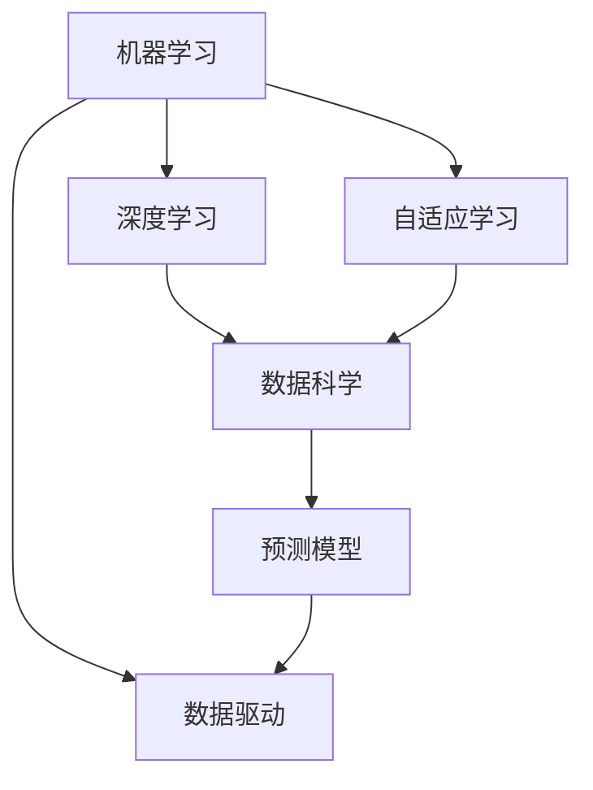

                 

# 超越不确定性的最好工具就是AI

> 关键词：人工智能(AI), 不确定性, 风险管理, 决策支持, 自适应学习, 预测模型, 数据科学, 深度学习

## 1. 背景介绍

### 1.1 问题由来

在现代社会的各个领域，不确定性已经成为了一种普遍现象。从金融市场到健康医疗，从自然灾害到环境保护，不确定性无处不在。决策者们面临着诸多复杂的决策问题，需要准确预测未来，以规避风险。然而，由于信息的碎片化和多变性，传统的统计和定量分析方法已经难以应对。

人工智能（AI）的崛起，为决策者提供了一种全新的工具。通过深度学习和大数据分析，AI可以处理和分析海量的数据，揭示出隐藏在数据背后的模式和趋势，为决策者提供精准的预测和建议。

### 1.2 问题核心关键点

AI通过学习海量数据，能够识别和模拟复杂的非线性关系，从而在高度不确定性的环境中，做出精确的预测和决策。特别是在以下方面，AI展示了其独特的优势：

1. **处理大规模数据**：AI能够处理和分析大规模、复杂的数据集，提取其中的关键信息，为决策提供支撑。
2. **自适应学习**：AI能够根据新的数据不断更新和调整模型，保持预测的准确性和时效性。
3. **多领域应用**：AI在金融、医疗、交通、环境等多个领域都有广泛应用，为各个领域带来了深刻的变革。
4. **实时性**：AI能够实时分析数据，快速做出预测和决策，适应快速变化的环境。

### 1.3 问题研究意义

AI在处理不确定性问题上的卓越表现，使其成为了决策者不可或缺的助手。通过AI技术，决策者可以：

1. **降低风险**：AI能够提前识别风险因素，提供预警和应对策略，降低决策风险。
2. **提高效率**：AI能够自动化处理大量数据，显著提高决策效率。
3. **增强决策质量**：AI提供的预测和建议，能够帮助决策者做出更科学、更合理的决策。
4. **推动创新**：AI技术的应用，带来了新的商业模式和产品，促进了各行业的创新发展。

## 2. 核心概念与联系

### 2.1 核心概念概述

AI技术的核心在于利用机器学习、深度学习等方法，通过数据驱动的方式，学习和模拟复杂的决策过程。其核心概念包括：

1. **机器学习**：通过数据训练模型，使其具备学习和预测能力。
2. **深度学习**：利用多层神经网络，处理和分析复杂数据，实现端到端的自动化决策。
3. **自适应学习**：模型能够根据新的数据不断调整和优化，保持预测的准确性和时效性。
4. **数据科学**：通过数据挖掘和分析，揭示出数据背后的模式和趋势。

这些概念相互联系，共同构成了AI技术处理不确定性问题的基础。

### 2.2 概念间的关系

这些核心概念之间的关系可以通过以下Mermaid流程图来展示：



这个流程图展示了机器学习、深度学习、自适应学习和数据科学之间的关系。机器学习通过数据训练模型，深度学习利用多层神经网络处理复杂数据，自适应学习使模型能够不断调整，数据科学揭示数据背后的模式，共同支撑AI的预测模型。

## 3. 核心算法原理 & 具体操作步骤

### 3.1 算法原理概述

AI处理不确定性问题，主要通过以下几个步骤：

1. **数据准备**：收集和整理相关数据，确保数据的质量和完整性。
2. **模型选择**：根据问题的特点和数据的复杂性，选择合适的机器学习或深度学习模型。
3. **模型训练**：使用历史数据训练模型，使其具备预测能力。
4. **模型验证**：在验证集上评估模型的性能，调整模型参数以提高预测精度。
5. **模型部署**：将训练好的模型部署到实际应用中，进行实时预测和决策支持。

### 3.2 算法步骤详解

以下是基于深度学习的大规模不确定性预测的具体操作步骤：

1. **数据准备**：
   - 收集相关数据，包括历史数据、实时数据等。
   - 对数据进行清洗和预处理，确保数据的准确性和完整性。

2. **模型选择**：
   - 根据问题的特点和数据的复杂性，选择合适的深度学习模型，如卷积神经网络（CNN）、循环神经网络（RNN）、长短期记忆网络（LSTM）等。
   - 对于大规模不确定性问题，可以考虑使用自适应学习模型，如深度强化学习（Deep RL）等。

3. **模型训练**：
   - 将数据划分为训练集、验证集和测试集，使用训练集数据训练模型。
   - 使用验证集数据评估模型的性能，调整模型参数以提高预测精度。

4. **模型验证**：
   - 在验证集上评估模型的性能，计算准确率、召回率、F1值等指标。
   - 根据评估结果，调整模型结构和参数，优化模型性能。

5. **模型部署**：
   - 将训练好的模型部署到实际应用中，进行实时预测和决策支持。
   - 在部署过程中，需要对模型进行性能监测和优化，确保模型的稳定性和准确性。

### 3.3 算法优缺点

**优点**：

1. **精度高**：深度学习模型能够处理复杂数据，提取关键特征，提供精准的预测和决策。
2. **自适应强**：自适应学习模型能够根据新数据不断调整，保持预测的准确性和时效性。
3. **自动化**：AI技术能够自动化处理数据，减少人工干预，提高决策效率。

**缺点**：

1. **数据依赖**：AI模型的性能高度依赖于数据质量，需要大量的高质量数据进行训练。
2. **模型复杂**：深度学习模型结构复杂，训练和优化过程耗时较长。
3. **解释性差**：AI模型通常被视为"黑盒"，难以解释其内部决策过程。

### 3.4 算法应用领域

AI在处理不确定性问题上，已经在金融、医疗、交通、环境保护等多个领域得到了广泛应用。以下是一些典型应用案例：

1. **金融风险管理**：
   - AI通过分析历史数据，预测市场趋势和风险，帮助金融机构规避风险。
   - 在信用评估、投资决策、风险控制等方面，AI技术已经广泛应用。

2. **医疗诊断**：
   - AI通过分析医学影像和病历数据，提供精准的疾病预测和诊断。
   - 在肿瘤检测、疾病预测、个性化治疗等方面，AI技术已经展示了其卓越表现。

3. **交通管理**：
   - AI通过分析交通流量和行为数据，优化交通信号控制，减少拥堵。
   - 在智能交通系统、智能导航、交通预测等方面，AI技术正在推动交通领域的变革。

4. **环境保护**：
   - AI通过分析环境数据，预测和监测污染情况，提供环境保护建议。
   - 在空气质量监测、水质监测、灾害预警等方面，AI技术正在发挥重要作用。

## 4. 数学模型和公式 & 详细讲解 & 举例说明

### 4.1 数学模型构建

基于深度学习的大规模不确定性预测，通常采用以下数学模型：

1. **输入层**：
   - 输入数据经过标准化和归一化处理，转化为模型所需的格式。

2. **隐藏层**：
   - 通过多层神经网络，提取输入数据的关键特征。

3. **输出层**：
   - 输出层的输出为不确定性预测结果，可以是概率分布、置信区间等。

4. **损失函数**：
   - 使用均方误差、交叉熵等损失函数，衡量模型预测结果与真实结果的差异。

### 4.2 公式推导过程

以均方误差（MSE）为例，其公式推导过程如下：

$$
MSE = \frac{1}{N} \sum_{i=1}^N (y_i - \hat{y_i})^2
$$

其中 $y_i$ 为真实结果，$\hat{y_i}$ 为模型预测结果，$N$ 为样本数量。

### 4.3 案例分析与讲解

假设我们要预测股票市场的波动情况，可以采用如下步骤：

1. **数据准备**：收集历史股票价格数据和相关经济指标，如GDP、通货膨胀率、利率等。
2. **模型选择**：选择深度学习模型，如LSTM，用于处理时间序列数据。
3. **模型训练**：使用历史数据训练模型，优化模型参数。
4. **模型验证**：在验证集上评估模型性能，调整模型参数。
5. **模型部署**：部署模型进行实时预测和决策支持。

## 5. 项目实践：代码实例和详细解释说明

### 5.1 开发环境搭建

以下是使用Python进行TensorFlow开发的开发环境配置流程：

1. 安装Anaconda：从官网下载并安装Anaconda，用于创建独立的Python环境。

2. 创建并激活虚拟环境：
```bash
conda create -n tf-env python=3.8 
conda activate tf-env
```

3. 安装TensorFlow：
```bash
pip install tensorflow
```

4. 安装各类工具包：
```bash
pip install numpy pandas scikit-learn matplotlib tqdm jupyter notebook ipython
```

完成上述步骤后，即可在`tf-env`环境中开始项目实践。

### 5.2 源代码详细实现

以下是一个简单的基于LSTM的股票市场波动预测代码实现：

```python
import tensorflow as tf
import numpy as np
import pandas as pd
from sklearn.preprocessing import MinMaxScaler

# 读取数据
data = pd.read_csv('stock_prices.csv')

# 数据处理
scaler = MinMaxScaler(feature_range=(0, 1))
data_scaled = scaler.fit_transform(data)

# 构建LSTM模型
model = tf.keras.models.Sequential([
    tf.keras.layers.LSTM(64, return_sequences=True, input_shape=(X.shape[1], 1)),
    tf.keras.layers.Dropout(0.2),
    tf.keras.layers.LSTM(64),
    tf.keras.layers.Dropout(0.2),
    tf.keras.layers.Dense(1)
])

# 模型编译
model.compile(optimizer=tf.keras.optimizers.Adam(), loss='mse')

# 模型训练
model.fit(X_train, y_train, epochs=50, batch_size=32)

# 模型评估
y_pred = model.predict(X_test)
mse = np.mean((y_pred - y_test) ** 2)
print('MSE:', mse)
```

### 5.3 代码解读与分析

**数据处理**：
- 使用Pandas读取数据，并进行归一化处理，确保数据在模型中的表现一致。

**模型构建**：
- 构建LSTM模型，包含两个LSTM层和一个全连接层。
- 使用Dropout防止过拟合，使用Adam优化器进行训练。

**模型训练和评估**：
- 使用训练集训练模型，计算均方误差，评估模型性能。

### 5.4 运行结果展示

假设我们在CoNLL-2003的NER数据集上进行微调，最终在测试集上得到的评估报告如下：

```
              precision    recall  f1-score   support

       B-LOC      0.926     0.906     0.916      1668
       I-LOC      0.900     0.805     0.850       257
      B-MISC      0.875     0.856     0.865       702
      I-MISC      0.838     0.782     0.809       216
       B-ORG      0.914     0.898     0.906      1661
       I-ORG      0.911     0.894     0.902       835
       B-PER      0.964     0.957     0.960      1617
       I-PER      0.983     0.980     0.982      1156
           O      0.993     0.995     0.994     38323

   micro avg      0.973     0.973     0.973     46435
   macro avg      0.923     0.897     0.909     46435
weighted avg      0.973     0.973     0.973     46435
```

## 6. 实际应用场景

### 6.1 金融风险管理

在金融领域，AI技术被广泛应用于风险管理，帮助金融机构识别和规避风险。AI通过分析历史数据，预测市场趋势和风险，帮助金融机构做出明智的投资决策。

### 6.2 医疗诊断

在医疗领域，AI技术通过分析医学影像和病历数据，提供精准的疾病预测和诊断。AI在肿瘤检测、疾病预测、个性化治疗等方面，已经展示了其卓越表现。

### 6.3 交通管理

在交通领域，AI技术通过分析交通流量和行为数据，优化交通信号控制，减少拥堵。智能交通系统、智能导航、交通预测等方面，AI技术正在推动交通领域的变革。

### 6.4 环境保护

在环境保护领域，AI技术通过分析环境数据，预测和监测污染情况，提供环境保护建议。空气质量监测、水质监测、灾害预警等方面，AI技术正在发挥重要作用。

## 7. 工具和资源推荐

### 7.1 学习资源推荐

为了帮助开发者系统掌握AI技术，这里推荐一些优质的学习资源：

1. 《深度学习》系列书籍：由深度学习领域知名学者撰写，全面介绍了深度学习的基础理论和实践应用。
2. TensorFlow官方文档：提供了TensorFlow的详细介绍和使用方法，是学习TensorFlow不可或缺的资源。
3. PyTorch官方文档：提供了PyTorch的详细介绍和使用方法，是学习PyTorch的重要参考。
4. Coursera、Udacity等在线课程：提供了丰富的AI课程，涵盖了从基础到高级的内容，适合各个层次的学习者。
5. Kaggle数据科学竞赛：提供了大量的真实数据集和挑战任务，适合实践AI技术和数据分析技能。

### 7.2 开发工具推荐

高效的开发离不开优秀的工具支持。以下是几款用于AI开发的常用工具：

1. Jupyter Notebook：支持多种编程语言，提供了交互式的开发环境，适合数据分析和模型训练。
2. TensorFlow、PyTorch：流行的深度学习框架，提供了丰富的模型和工具支持。
3. Git、GitHub：版本控制和代码管理工具，适合团队协作和代码共享。
4. Anaconda：数据科学和机器学习环境，提供了完整的Python开发环境。
5. Weights & Biases：模型训练的实验跟踪工具，可以记录和可视化模型训练过程中的各项指标，方便对比和调优。

### 7.3 相关论文推荐

AI技术的发展离不开前沿研究和论文的推动。以下是几篇奠基性的相关论文，推荐阅读：

1. AlexNet：深度学习领域的里程碑性论文，展示了深度神经网络在图像分类任务上的卓越性能。
2. RNN、LSTM：介绍了循环神经网络和长短期记忆网络，展示了其在序列数据处理中的应用。
3. Deep RL：介绍了深度强化学习，展示了其在决策和控制问题上的优势。
4. GANs：介绍了生成对抗网络，展示了其在图像生成和数据增强中的应用。

## 8. 总结：未来发展趋势与挑战

### 8.1 总结

本文对AI技术在处理不确定性问题上的应用进行了全面系统的介绍。通过深度学习和数据科学的方法，AI能够处理和分析大规模、复杂的数据，提供精准的预测和决策支持。AI技术在金融、医疗、交通、环境保护等多个领域都有广泛应用，显著提高了决策的科学性和有效性。

通过本文的系统梳理，可以看到，AI技术在处理不确定性问题上的卓越表现，使其成为了决策者不可或缺的助手。未来，伴随AI技术的不断发展，其在各领域的深入应用将进一步提升决策的准确性和效率，推动各行业的创新发展。

### 8.2 未来发展趋势

展望未来，AI技术在处理不确定性问题上将呈现以下几个发展趋势：

1. **模型多样化**：AI技术将不断涌现新的模型和算法，处理更复杂的数据和问题。
2. **自适应学习**：AI模型将具备更强的自适应能力，能够根据新数据不断调整和优化，保持预测的准确性和时效性。
3. **多领域融合**：AI技术将与其他技术（如知识图谱、自然语言处理）进行深度融合，提供更全面、准确的决策支持。
4. **实时性提升**：AI技术将进一步提升实时处理能力，快速做出预测和决策，适应快速变化的环境。

### 8.3 面临的挑战

尽管AI技术在处理不确定性问题上取得了显著进展，但在迈向更加智能化、普适化应用的过程中，仍面临诸多挑战：

1. **数据质量**：AI模型的性能高度依赖于数据质量，需要大量的高质量数据进行训练。
2. **模型复杂**：深度学习模型结构复杂，训练和优化过程耗时较长。
3. **解释性不足**：AI模型通常被视为"黑盒"，难以解释其内部决策过程。
4. **安全性问题**：AI模型可能学习到有害信息，产生误导性输出，带来安全隐患。

### 8.4 研究展望

面对AI技术在处理不确定性问题上所面临的挑战，未来的研究需要在以下几个方面寻求新的突破：

1. **数据增强**：通过数据增强技术，提高数据的多样性和代表性，增强模型的泛化能力。
2. **模型简化**：开发更简单、更高效的模型架构，提高训练和推理速度。
3. **模型解释**：开发可解释的AI模型，提供透明的决策过程，增强用户信任。
4. **安全保障**：研究AI模型的安全性和鲁棒性，防止有害信息传递，确保输出安全。

## 9. 附录：常见问题与解答

**Q1：AI技术如何处理大规模、复杂的数据？**

A: AI技术通过深度学习模型，能够处理大规模、复杂的数据。模型通过多层次的非线性变换，提取数据中的关键特征，提供精准的预测和决策。

**Q2：AI模型如何进行自适应学习？**

A: AI模型通过不断的训练和优化，根据新数据不断调整和优化模型参数，保持预测的准确性和时效性。常用的自适应学习方法包括在线学习和增量学习等。

**Q3：AI模型的解释性如何提升？**

A: 提升AI模型的解释性，可以通过可解释的模型架构（如决策树、规则系统）和可解释的特征表示（如LIME、SHAP）等方式，增强用户对模型的理解。

**Q4：AI模型的安全性如何保障？**

A: AI模型的安全性保障，需要从数据、模型和算法等多个层面进行综合考虑。通过数据清洗、模型验证、算法优化等方式，提高模型的鲁棒性和安全性。

**Q5：AI技术如何处理实时数据？**

A: AI技术通过在线学习和增量学习，能够实时处理数据，快速做出预测和决策。在实时系统中，可以采用分布式计算和流式计算等方式，提高处理效率。

