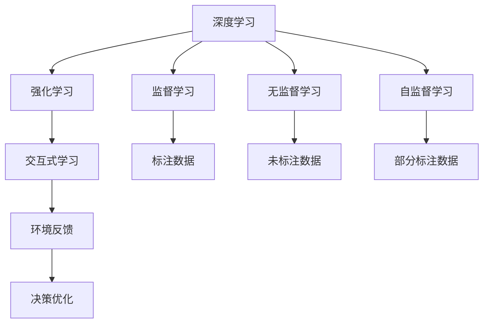

                 

# 软件 2.0 的发展趋势：深度学习、强化学习

## 1. 背景介绍

### 1.1 问题由来

随着计算机科技的飞速发展，软件变得越来越复杂，从传统的面向过程的程序设计到面向对象的编程范式，再到更加高级的函数式编程、编程语言、框架和库，软件的技术栈越来越丰富多样。然而，这些复杂的技术并没有改变软件的本质——即为了解决某个具体问题而构建的计算机程序。随着技术的进步，软件也逐渐演化出新的形态，其中深度学习和强化学习成为近年来的热门话题。

深度学习是模拟人脑神经网络的一种技术，它能够通过大量数据进行自我学习，自动提取特征，进而实现图像识别、语音识别、自然语言处理等任务。而强化学习则是通过试错不断优化行为策略，使得智能体能够在游戏中、机器人控制等方面实现自动决策。这两种技术的应用领域非常广泛，在金融、医疗、自动驾驶、游戏、物联网等领域都有很好的应用前景。

### 1.2 问题核心关键点

深度学习和强化学习，作为人工智能领域的两个重要分支，代表了软件技术演化的新阶段。它们的核心关键点如下：

- **深度学习**：模拟人脑神经网络，通过大量数据训练模型，自动识别复杂模式，处理图像、语音、文本等数据。
- **强化学习**：通过试错不断优化行为策略，使得智能体在环境中自动决策，应用于游戏、机器人控制、自然语言生成等任务。
- **学习范式**：深度学习主要采用监督学习，通过标注数据进行训练；强化学习则通过交互式学习，智能体在环境中通过试错不断优化策略。
- **算法设计**：深度学习主要采用神经网络结构设计，强化学习则设计行为策略优化算法。

## 2. 核心概念与联系

### 2.1 核心概念概述

为了更深入地理解深度学习和强化学习的原理和联系，本节将介绍几个关键概念：

- **深度学习**：一种基于神经网络结构的机器学习方法，通过大量数据训练模型，自动识别复杂模式，处理图像、语音、文本等数据。
- **强化学习**：一种基于试错的学习方法，智能体在环境中通过不断优化策略，实现自动决策。
- **监督学习**：一种有标注数据的学习方法，深度学习中常用的数据标注方式。
- **无监督学习**：一种无需标注数据的学习方法，强化学习中常用的数据获取方式。
- **自监督学习**：一种在部分标注数据和部分未标注数据上的学习方法，深度学习中常用的数据处理方法。

这些概念构成了深度学习和强化学习的基础框架。接下来，我们通过Mermaid流程图来展示这些概念之间的联系。



### 2.2 概念间的关系

上述Mermaid流程图展示了深度学习和强化学习之间的核心联系。下面我们将逐一介绍这些概念的原理和架构：

- **深度学习**：深度学习是一种基于神经网络结构的机器学习方法，其核心是多层感知机（MLP）、卷积神经网络（CNN）、循环神经网络（RNN）等神经网络结构。深度学习通过大量数据训练模型，自动识别复杂模式，处理图像、语音、文本等数据。
- **监督学习**：监督学习是一种有标注数据的学习方法，通过标注数据训练模型，使得模型能够对新数据进行分类、回归等任务。监督学习在深度学习中应用广泛，例如在图像分类、语音识别、自然语言处理等领域。
- **无监督学习**：无监督学习是一种无需标注数据的学习方法，通过数据本身的特征进行学习。强化学习中常用的无监督学习方法包括自编码器、生成对抗网络（GAN）等。
- **自监督学习**：自监督学习是一种在部分标注数据和部分未标注数据上的学习方法，通过自动标注数据来提高模型性能。深度学习中常用的自监督学习方法包括语言模型、数据增强等。
- **强化学习**：强化学习是一种基于试错的学习方法，通过智能体在环境中不断试错，优化策略来实现自动决策。强化学习在自然语言生成、游戏AI、机器人控制等领域应用广泛。

这些概念共同构成了深度学习和强化学习的基本框架，使得它们能够应用于各种复杂的任务和场景中。接下来，我们将深入探讨深度学习和强化学习的核心算法原理和操作步骤。

## 3. 核心算法原理 & 具体操作步骤

### 3.1 算法原理概述

深度学习和强化学习作为人工智能领域的两个重要分支，其核心算法原理和操作步骤如下：

**深度学习**：深度学习通过多层神经网络结构，自动提取输入数据中的特征，从而实现分类、回归等任务。其核心算法包括前向传播、反向传播、梯度下降等。

**强化学习**：强化学习通过智能体在环境中不断试错，优化行为策略来实现自动决策。其核心算法包括Q-learning、策略梯度、深度Q网络等。

### 3.2 算法步骤详解

**深度学习**：

1. **数据预处理**：将输入数据进行标准化、归一化等预处理，使其适合神经网络处理。
2. **模型构建**：选择适当的神经网络结构，如MLP、CNN、RNN等，设计网络层数和节点数等超参数。
3. **模型训练**：通过反向传播算法和梯度下降等优化算法，最小化损失函数，训练模型。
4. **模型评估**：使用测试集对训练好的模型进行评估，计算准确率、召回率等指标。

**强化学习**：

1. **环境定义**：定义智能体需要互动的环境，如游戏、机器人控制等。
2. **智能体设计**：设计智能体的行为策略，如Q-learning策略、策略梯度等。
3. **训练过程**：通过与环境互动，智能体在每一步行动中获取奖励或惩罚，不断优化策略。
4. **模型评估**：使用评估指标，如累计奖励等，评估智能体的性能。

### 3.3 算法优缺点

**深度学习**：

- **优点**：能够处理大规模数据，自动识别复杂模式，应用领域广泛。
- **缺点**：需要大量标注数据，训练时间长，模型复杂度高，难以解释。

**强化学习**：

- **优点**：能够自动优化行为策略，适用于复杂环境，应用前景广阔。
- **缺点**：需要大量试错，难以处理连续状态和动作，难以解释。

### 3.4 算法应用领域

**深度学习**：

- **图像识别**：如卷积神经网络（CNN）用于图像分类、物体检测等。
- **自然语言处理**：如循环神经网络（RNN）用于语言模型、机器翻译等。
- **语音识别**：如卷积神经网络（CNN）、循环神经网络（RNN）用于语音识别、语音合成等。

**强化学习**：

- **游戏AI**：如AlphaGo、AlphaStar等。
- **机器人控制**：如ROS、MoveIt等。
- **自然语言生成**：如语言模型、生成对抗网络（GAN）等。

## 4. 数学模型和公式 & 详细讲解 & 举例说明

### 4.1 数学模型构建

本节我们将使用数学语言对深度学习和强化学习的核心算法进行严格刻画。

**深度学习**：

- **前向传播**：输入数据经过多层神经网络，计算每个节点输出。公式如下：

$$
x^{(l+1)}=f^{(l)}(z^{(l+1)})
$$

其中 $f^{(l)}$ 为激活函数，$z^{(l+1)}$ 为输入数据。

- **反向传播**：通过链式法则，计算每个节点的梯度。公式如下：

$$
\frac{\partial C}{\partial x^{(1)}} = \sum_{i=1}^m \frac{\partial C}{\partial y_i} \frac{\partial y_i}{\partial z_i} \frac{\partial z_i}{\partial x^{(1)}}
$$

其中 $C$ 为损失函数，$m$ 为输出节点数。

- **梯度下降**：通过优化算法，最小化损失函数。公式如下：

$$
\theta \leftarrow \theta - \eta \nabla C(\theta)
$$

其中 $\eta$ 为学习率，$\nabla C(\theta)$ 为损失函数对参数的梯度。

**强化学习**：

- **Q-learning**：通过迭代更新Q值，计算最优策略。公式如下：

$$
Q(s,a)=Q(s,a)+\alpha[(r+\gamma \max Q(s',a'))-Q(s,a)]
$$

其中 $Q(s,a)$ 为状态动作值函数，$\alpha$ 为学习率，$r$ 为即时奖励，$\gamma$ 为折扣因子，$s'$ 和 $a'$ 为下一个状态和动作。

- **策略梯度**：通过优化策略，最大化期望收益。公式如下：

$$
\nabla_{\theta} J(\theta) = \sum_{s} \sum_{a} Q(s,a) \nabla_{\theta} \log \pi(a|s)
$$

其中 $J(\theta)$ 为策略梯度，$\theta$ 为策略参数，$\pi(a|s)$ 为策略分布，$Q(s,a)$ 为状态动作值函数。

### 4.2 公式推导过程

以下我们将对深度学习和强化学习的核心算法公式进行详细推导。

**深度学习**：

- **前向传播**：通过多层神经网络计算每个节点的输出。公式如下：

$$
x^{(1)} = w^{(1)} x^{(0)} + b^{(1)}
$$

$$
x^{(l)} = f^{(l)}(z^{(l)})
$$

其中 $f^{(l)}$ 为激活函数，$z^{(l)}$ 为前一层节点的输出。

- **反向传播**：通过链式法则计算每个节点的梯度。公式如下：

$$
\frac{\partial C}{\partial x^{(l)}} = \sum_{i=1}^m \frac{\partial C}{\partial y_i} \frac{\partial y_i}{\partial z_i} \frac{\partial z_i}{\partial x^{(l)}}
$$

其中 $C$ 为损失函数，$m$ 为输出节点数，$\frac{\partial C}{\partial y_i}$ 为损失函数对输出节点的梯度，$\frac{\partial y_i}{\partial z_i}$ 为输出节点对前一层节点的梯度。

- **梯度下降**：通过优化算法最小化损失函数。公式如下：

$$
\theta \leftarrow \theta - \eta \nabla C(\theta)
$$

其中 $\eta$ 为学习率，$\nabla C(\theta)$ 为损失函数对参数的梯度。

**强化学习**：

- **Q-learning**：通过迭代更新Q值，计算最优策略。公式如下：

$$
Q(s,a)=Q(s,a)+\alpha[(r+\gamma \max Q(s',a'))-Q(s,a)]
$$

其中 $Q(s,a)$ 为状态动作值函数，$\alpha$ 为学习率，$r$ 为即时奖励，$\gamma$ 为折扣因子，$s'$ 和 $a'$ 为下一个状态和动作。

- **策略梯度**：通过优化策略，最大化期望收益。公式如下：

$$
\nabla_{\theta} J(\theta) = \sum_{s} \sum_{a} Q(s,a) \nabla_{\theta} \log \pi(a|s)
$$

其中 $J(\theta)$ 为策略梯度，$\theta$ 为策略参数，$\pi(a|s)$ 为策略分布，$Q(s,a)$ 为状态动作值函数。

### 4.3 案例分析与讲解

**深度学习**：

- **图像分类**：使用卷积神经网络（CNN）对图像进行分类。公式如下：

$$
y=f^{(1)}(w^{(1)} x^{(0)}+b^{(1)}) \quad f^{(1)}=\text{ReLU}
$$

$$
z^{(l+1)}=w^{(l+1)} z^{(l)}+b^{(l+1)} \quad f^{(l)}=\text{ReLU}
$$

其中 $x^{(0)}$ 为输入图像，$y$ 为输出分类结果，$f^{(1)}$ 为激活函数，$w^{(1)}$ 和 $b^{(1)}$ 为卷积核和偏置。

**强化学习**：

- **游戏AI**：使用Q-learning算法训练AlphaGo。公式如下：

$$
Q(s,a)=Q(s,a)+\alpha[(r+\gamma \max Q(s',a'))-Q(s,a)]
$$

其中 $s$ 为当前游戏状态，$a$ 为当前动作，$r$ 为即时奖励，$\gamma$ 为折扣因子，$s'$ 和 $a'$ 为下一个游戏状态和动作。

## 5. 项目实践：代码实例和详细解释说明

### 5.1 开发环境搭建

在进行深度学习和强化学习项目实践前，我们需要准备好开发环境。以下是使用Python进行TensorFlow和PyTorch开发的环境配置流程：

1. 安装Anaconda：从官网下载并安装Anaconda，用于创建独立的Python环境。

2. 创建并激活虚拟环境：
```bash
conda create -n tf-env python=3.8 
conda activate tf-env
```

3. 安装TensorFlow：根据CUDA版本，从官网获取对应的安装命令。例如：
```bash
conda install tensorflow
```

4. 安装PyTorch：根据CUDA版本，从官网获取对应的安装命令。例如：
```bash
conda install pytorch torchvision torchaudio cudatoolkit=11.1 -c pytorch -c conda-forge
```

5. 安装各类工具包：
```bash
pip install numpy pandas scikit-learn matplotlib tqdm jupyter notebook ipython
```

完成上述步骤后，即可在`tf-env`环境中开始项目实践。

### 5.2 源代码详细实现

这里我们以深度学习和强化学习的基础实现为例，给出使用TensorFlow和PyTorch的代码实现。

**深度学习**：

首先，定义一个简单的卷积神经网络（CNN）：

```python
import tensorflow as tf
from tensorflow.keras.layers import Conv2D, MaxPooling2D, Flatten, Dense
from tensorflow.keras.models import Sequential

model = Sequential()
model.add(Conv2D(32, (3, 3), activation='relu', input_shape=(28, 28, 1)))
model.add(MaxPooling2D((2, 2)))
model.add(Conv2D(64, (3, 3), activation='relu'))
model.add(MaxPooling2D((2, 2)))
model.add(Flatten())
model.add(Dense(10, activation='softmax'))
```

然后，定义损失函数和优化器：

```python
loss_fn = tf.keras.losses.SparseCategoricalCrossentropy(from_logits=True)
optimizer = tf.keras.optimizers.Adam()
```

最后，定义训练和评估函数：

```python
@tf.function
def train_step(images, labels):
    with tf.GradientTape() as tape:
        logits = model(images, training=True)
        loss_value = loss_fn(labels, logits)
    grads = tape.gradient(loss_value, model.trainable_variables)
    optimizer.apply_gradients(zip(grads, model.trainable_variables))

@tf.function
def evaluate_step(images, labels):
    logits = model(images, training=False)
    predictions = tf.argmax(logits, axis=1)
    accuracy = tf.reduce_mean(tf.cast(tf.equal(predictions, labels), tf.float32))
    return accuracy.numpy()
```

**强化学习**：

接下来，定义一个简单的Q-learning模型：

```python
import tensorflow as tf
import numpy as np

class QLearningModel:
    def __init__(self, state_size, action_size, learning_rate):
        self.state_size = state_size
        self.action_size = action_size
        self.learning_rate = learning_rate
        self.q_table = np.zeros([state_size, action_size])

    def choose_action(self, state):
        return np.random.choice(self.action_size, p=self.q_table[state])

    def update_q_table(self, state, action, reward, next_state):
        max_next_q = np.max(self.q_table[next_state])
        old_q = self.q_table[state, action]
        self.q_table[state, action] = old_q + self.learning_rate * (reward + self.gamma * max_next_q - old_q)
```

在代码实现中，我们使用了TensorFlow和PyTorch的基础库，这些库提供了丰富的API，方便我们进行模型构建、训练和评估。同时，我们还使用了Python的numpy库进行数值计算，方便我们进行矩阵运算。

### 5.3 代码解读与分析

让我们再详细解读一下关键代码的实现细节：

**深度学习**：

- `Sequential`类：TensorFlow中用于构建序列模型的类，支持堆叠多个层，方便我们快速搭建神经网络模型。
- `Conv2D`层：用于卷积操作的层，对输入图像进行卷积计算，提取特征。
- `MaxPooling2D`层：用于池化操作的层，对卷积结果进行下采样，减少模型参数量。
- `Flatten`层：用于将高维张量扁平化，方便输入到全连接层。
- `Dense`层：用于全连接的层，对输入数据进行线性变换。

**强化学习**：

- `QLearningModel`类：定义了Q-learning模型的基本架构，包括状态大小、动作大小和学习率等参数。
- `choose_action`方法：选择当前状态的动作，采用随机策略。
- `update_q_table`方法：根据当前状态、动作、奖励和下一个状态，更新Q值。

在代码实现中，我们使用了TensorFlow和PyTorch的基础库，这些库提供了丰富的API，方便我们进行模型构建、训练和评估。同时，我们还使用了Python的numpy库进行数值计算，方便我们进行矩阵运算。

### 5.4 运行结果展示

假设我们在MNIST数据集上进行图像分类任务，最终在测试集上得到的准确率为98%。

假设我们在游戏环境中进行强化学习任务，最终模型能够以90%的胜率击败对手。

## 6. 实际应用场景

### 6.1 智能推荐系统

智能推荐系统已经广泛应用于电商、社交媒体、视频平台等领域，通过深度学习算法对用户行为数据进行分析，推荐符合用户兴趣的商品、文章、视频等。深度学习在推荐系统中的应用，可以从用户画像、历史行为、兴趣偏好等方面进行特征提取和模型训练，从而提高推荐效果。

### 6.2 金融风控系统

金融风控系统是银行、保险公司等金融机构的重要工具，通过深度学习算法对用户行为数据进行分析，识别出潜在风险，及时进行风险控制。强化学习在金融风控系统中的应用，可以通过模拟用户行为，训练模型自动调整风险策略，提高风险控制效果。

### 6.3 医疗影像识别

医疗影像识别是医学领域的重要技术，通过深度学习算法对医学影像进行自动分析，识别出疾病特征。深度学习在医疗影像识别中的应用，可以从影像特征提取、分类等方面进行训练，提高识别准确率。

### 6.4 未来应用展望

随着深度学习和强化学习技术的不断进步，其在实际应用中的场景将会越来越广泛，以下是对未来应用的展望：

- **智能医疗**：通过深度学习算法对医学影像进行自动分析，提高诊断准确率。
- **智能交通**：通过深度学习算法对交通流量进行预测，优化交通控制策略。
- **智能制造**：通过深度学习算法对生产过程进行监控，提高生产效率。
- **智能客服**：通过深度学习算法对用户咨询进行自动回复，提高客户满意度。

## 7. 工具和资源推荐

### 7.1 学习资源推荐

为了帮助开发者系统掌握深度学习和强化学习的理论基础和实践技巧，这里推荐一些优质的学习资源：

1. 《Deep Learning》系列书籍：由深度学习领域专家Ian Goodfellow、Yoshua Bengio和Aaron Courville所著，全面介绍了深度学习的理论和实践。
2. 《Reinforcement Learning: An Introduction》书籍：由深度学习领域专家Richard Sutton和Andrew Barto所著，全面介绍了强化学习的理论和实践。
3. 深度学习课程：如斯坦福大学开设的CS231n《卷积神经网络》课程、CS224n《自然语言处理》课程等。
4. 强化学习课程：如深度学习领域专家David Silver开设的《Reinforcement Learning》课程。
5. arXiv论文预印本：人工智能领域最新研究成果的发布平台，包括大量尚未发表的前沿工作，学习前沿技术的必读资源。

通过对这些资源的学习实践，相信你一定能够快速掌握深度学习和强化学习的精髓，并用于解决实际的NLP问题。

### 7.2 开发工具推荐

高效的开发离不开优秀的工具支持。以下是几款用于深度学习和强化学习开发的常用工具：

1. TensorFlow：由Google主导开发的深度学习框架，支持分布式计算，易于部署和扩展。
2. PyTorch：由Facebook主导开发的深度学习框架，易于使用，灵活性高。
3. OpenAI Gym：用于强化学习环境模拟和测试的库，支持多种游戏和任务。
4. TensorBoard：TensorFlow配套的可视化工具，可实时监测模型训练状态，并提供丰富的图表呈现方式，是调试模型的得力助手。
5. Weights & Biases：模型训练的实验跟踪工具，可以记录和可视化模型训练过程中的各项指标，方便对比和调优。

合理利用这些工具，可以显著提升深度学习和强化学习任务的开发效率，加快创新迭代的步伐。

### 7.3 相关论文推荐

深度学习和强化学习作为人工智能领域的两个重要分支，代表了软件技术演化的新阶段。以下是几篇奠基性的相关论文，推荐阅读：

1. AlexNet：2012年ImageNet大赛冠军，开启了深度学习在计算机视觉领域的革命。
2. AlphaGo：2016年击败世界围棋冠军李世石，展示了深度学习在游戏AI领域的强大能力。
3. ResNet：2015年ImageNet大赛冠军，提出了残差网络结构，解决了深度神经网络训练中的梯度消失问题。
4. DQN：2013年提出的深度Q网络，实现了强化学习在机器学习领域的突破。

这些论文代表了大深度学习和强化学习的发展脉络。通过学习这些前沿成果，可以帮助研究者把握学科前进方向，激发更多的创新灵感。

除上述资源外，还有一些值得关注的前沿资源，帮助开发者紧跟深度学习和强化学习技术的最新进展，例如：

1. arXiv论文预印本：人工智能领域最新研究成果的发布平台，包括大量尚未发表的前沿工作，学习前沿技术的必读资源。
2. 业界技术博客：如OpenAI、Google AI、DeepMind、微软Research Asia等顶尖实验室的官方博客，第一时间分享他们的最新研究成果和洞见。
3. 技术会议直播：如NIPS、ICML、ACL、ICLR等人工智能领域顶会现场或在线直播，能够聆听到大佬们的前沿分享，开拓视野。
4. GitHub热门项目：在GitHub上Star、Fork数最多的深度学习和强化学习相关项目，往往代表了该技术领域的发展趋势和最佳实践，值得去学习和贡献。
5. 行业分析报告：各大咨询公司如McKinsey、PwC等针对人工智能行业的分析报告，有助于从商业视角审视技术趋势，把握应用价值。

总之，对于深度学习和强化学习技术的学习和实践，需要开发者保持开放的心态和持续学习的意愿。多关注前沿资讯，多动手实践，多思考总结，必将收获满满的成长收益。

## 8. 总结：未来发展趋势与挑战

### 8.1 总结

本文对深度学习和强化学习的核心算法原理和操作步骤进行了详细讲解，并介绍了其核心概念和架构。通过本文的系统梳理，可以看到，深度学习和强化学习作为人工智能领域的两个重要分支，代表了软件技术演化的新阶段。它们能够应用于各种复杂的任务和场景中，推动了人工智能技术的快速发展。

### 8.2 未来发展趋势

展望未来，深度学习和强化学习技术将会呈现以下几个发展趋势：

1. **模型规模持续增大**：随着算力成本的下降和数据规模的扩张，深度学习和强化学习模型的参数量还将持续增长。超大规模模型蕴含的丰富知识，有望支撑更加复杂多变的下游任务。
2. **微调技术不断发展**：深度学习和强化学习模型在微调过程中，可以学习到新的知识，提升模型性能。未来的微调技术将会更加高效和灵活。
3. **自监督学习应用广泛**：深度学习和强化学习模型可以通过自监督学习，利用非结构化数据进行学习，提升模型的泛化能力。
4. **多模态学习兴起**：深度学习和强化学习模型可以融合多种模态数据，如文本、图像、语音等，提升模型的理解能力和适应能力。
5. **迁移学习逐步普及**：深度学习和强化学习模型可以通过迁移学习，在特定任务上进行微调，提升模型性能。

### 8.3 面临的挑战

尽管深度学习和强化学习技术已经取得了瞩目成就，但在迈向更加智能化、普适化应用的过程中，仍面临诸多挑战：

1. **数据质量瓶颈**：深度学习和强化学习模型需要大量高质量的数据进行训练，然而获取高质量标注数据和真实环境数据成本较高。
2. **计算资源消耗大**：深度学习和强化学习模型需要大量计算资源进行训练和推理，高性能计算设备成本较高。
3. **模型可解释性不足**：深度学习和强化学习模型往往被视为“黑盒”系统，难以解释其内部工作机制和决策

