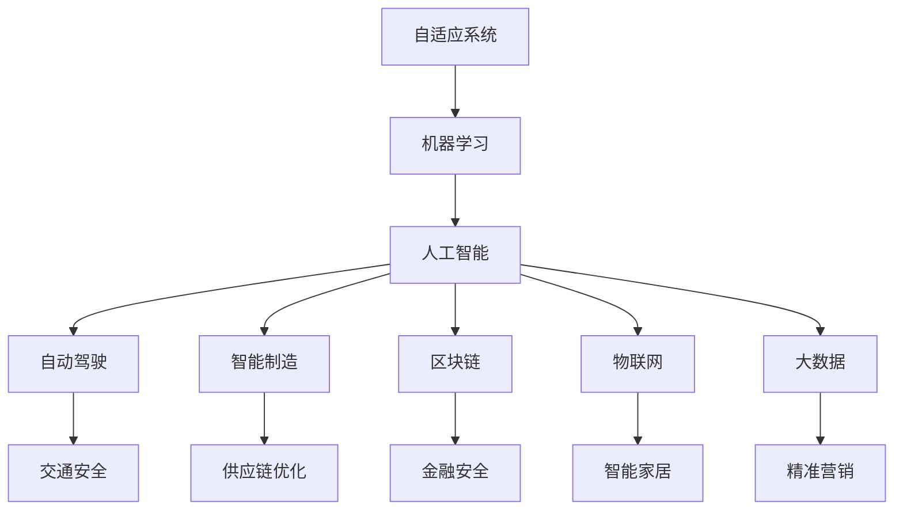

                 

# 软件 2.0 的应用：从实验室走向现实

> 关键词：软件 2.0, 自适应系统, 人工智能, 机器学习, 自动驾驶, 智能制造, 区块链, 物联网, 大数据

## 1. 背景介绍

### 1.1 问题由来

随着信息技术的不断发展和普及，软件在各行各业中的应用越来越广泛，极大地提升了工作效率和生产力。然而，传统的软件开发模式往往依赖于人工编程和调试，周期长、成本高、灵活性差。为了应对这一挑战，新的软件开发范式——软件 2.0（Software 2.0）应运而生。

软件 2.0 强调通过自动化、自适应和自学习的方式，让软件系统能够自我进化和优化，从而在不断变化的环境中保持高效和稳定。这一范式不仅极大地降低了开发成本，还能加速创新进程，为各行各业注入新的活力。

### 1.2 问题核心关键点

软件 2.0 的核心在于通过机器学习、数据驱动和自动化技术，实现软件的自适应和自优化。其关键点包括：

- **自动化开发**：自动化工具和框架能够自动生成、测试和部署代码，减少人工干预。
- **数据驱动优化**：基于数据反馈，动态调整模型和算法，优化软件性能。
- **自学习系统**：通过不断的学习和训练，提升软件系统的智能化水平，适应复杂多变的应用场景。
- **自适应环境**：系统能够根据环境变化和用户需求，自动调整运行模式和配置。

软件 2.0 的这些特性，使其在自动驾驶、智能制造、区块链、物联网、大数据等领域得到了广泛应用，展现出巨大的应用潜力。

### 1.3 问题研究意义

研究软件 2.0 的应用，对于推动信息技术向智能化、自动化方向发展，加速各行各业的数字化转型，具有重要意义：

1. **降低开发成本**：软件 2.0 通过自动化和数据驱动的方式，大大降低了软件开发和维护的成本，加速了软件产品的上市周期。
2. **提高创新效率**：自学习和自适应能力使得软件系统能够快速响应市场需求和技术变化，提升创新效率。
3. **增强用户体验**：自适应和自优化能力使得软件能够更好地理解用户需求和行为，提供更个性化和优质的服务。
4. **促进产业升级**：软件 2.0 能够赋能传统行业，提升其数字化水平，推动产业结构升级。
5. **赋能科研创新**：基于数据和算法的自动学习系统，能够加速科研创新进程，催生更多前沿技术。

## 2. 核心概念与联系

### 2.1 核心概念概述

软件 2.0 涉及多个关键概念，这些概念构成了其核心框架。以下是几个重要的核心概念及其相互联系：

- **自适应系统（Adaptive System）**：能够根据环境变化和用户需求自动调整行为的系统。自适应系统通常包括学习机制、反馈机制和优化算法。

- **机器学习（Machine Learning）**：通过数据驱动的方式，让系统具备自主学习和优化能力。机器学习分为监督学习、无监督学习和强化学习等不同类型。

- **人工智能（Artificial Intelligence）**：模拟人类智能行为，通过算法和数据实现智能决策和自主学习。人工智能应用广泛，包括语音识别、图像识别、自然语言处理等。

- **自动驾驶（Autonomous Driving）**：通过人工智能和机器学习技术，使汽车能够自主导航和决策，提升交通安全和效率。

- **智能制造（Intelligent Manufacturing）**：利用人工智能、物联网和大数据技术，实现智能生产、优化供应链和提高生产效率。

- **区块链（Blockchain）**：通过分布式账本技术，实现数据透明和信任机制，广泛应用在金融、供应链、版权保护等领域。

- **物联网（Internet of Things, IoT）**：通过互联网技术实现设备的互联和数据共享，推动智能家居、智慧城市等新兴应用。

- **大数据（Big Data）**：利用先进的数据处理和分析技术，从海量数据中提取有价值的信息和洞见，推动决策科学化和精准化。

这些核心概念之间相互关联，共同构成了软件 2.0 的应用基础。通过自动化和数据驱动的方式，这些技术能够实现自学习和自优化，推动软件系统向更加智能化和自动化方向发展。

### 2.2 概念间的关系

这些核心概念之间存在着紧密的联系，可以通过以下 Mermaid 流程图来展示它们之间的关系：



这个流程图展示了自适应系统、机器学习和大数据等技术如何与不同应用场景（如自动驾驶、智能制造等）相结合，推动软件系统向更加智能化和自动化的方向发展。

## 3. 核心算法原理 & 具体操作步骤
### 3.1 算法原理概述

软件 2.0 的算法原理主要基于机器学习、自适应算法和自动化技术。其核心思想是：通过数据驱动的方式，自动调整系统行为，优化性能，适应复杂多变的环境。

### 3.2 算法步骤详解

软件 2.0 的实现通常包括以下几个关键步骤：

1. **数据收集与预处理**：收集与软件应用相关的数据，并进行预处理，如去噪、归一化和特征提取。

2. **模型训练与优化**：选择合适的机器学习算法，如回归、分类、聚类等，基于训练数据进行模型训练和优化，获取最优模型参数。

3. **系统部署与测试**：将训练好的模型部署到生产环境中，并进行系统测试，确保其稳定性和性能。

4. **数据反馈与调整**：根据系统运行情况和用户反馈，不断调整模型参数和系统配置，实现自适应和自优化。

5. **自动化运维与更新**：利用自动化工具和框架，实现软件的自动部署、测试和更新，降低运维成本。

### 3.3 算法优缺点

软件 2.0 的算法具有以下优点：

- **高效**：自动化和数据驱动的方式，显著降低了开发和运维成本，提升了软件交付速度。
- **灵活**：自适应和自优化能力，使得软件能够快速响应市场需求和技术变化，适应复杂多变的场景。
- **智能**：机器学习和人工智能技术，使得软件具备自主学习和优化能力，提升系统智能化水平。

同时，软件 2.0 的算法也存在一些缺点：

- **依赖数据质量**：高质量的数据是算法效果的前提，数据偏差和噪音可能影响算法性能。
- **模型复杂性**：复杂的算法和模型需要大量的计算资源和时间，容易过拟合。
- **安全性和可解释性**：自动学习和自适应系统可能带来新的安全风险和可解释性问题。

### 3.4 算法应用领域

软件 2.0 的应用领域非常广泛，包括但不限于以下领域：

- **自动驾驶**：通过机器学习和人工智能技术，实现车辆的自主导航和决策。
- **智能制造**：利用大数据和机器学习技术，实现生产过程的智能优化和质量控制。
- **区块链**：基于分布式账本技术，实现数据透明和信任机制，保障金融交易和供应链安全。
- **物联网**：通过互联网技术实现设备的互联和数据共享，推动智能家居和智慧城市发展。
- **大数据**：利用先进的数据处理和分析技术，从海量数据中提取有价值的信息和洞见，推动决策科学化和精准化。

## 4. 数学模型和公式 & 详细讲解 & 举例说明

### 4.1 数学模型构建

软件 2.0 的数学模型通常基于机器学习算法和自适应算法。以下是一个基于监督学习的回归模型的数学模型构建过程：

设训练集为 $D=\{(x_i, y_i)\}_{i=1}^N$，其中 $x_i$ 为输入变量，$y_i$ 为输出变量。模型 $f(x)$ 的回归目标为最小化损失函数：

$$
\min_{\theta} \frac{1}{N} \sum_{i=1}^N (y_i - f(x_i))^2
$$

其中 $\theta$ 为模型参数，$f(x_i) = \theta^T \phi(x_i)$，$\phi(x_i)$ 为输入 $x_i$ 的特征表示。

### 4.2 公式推导过程

回归模型的梯度下降算法如下：

$$
\theta \leftarrow \theta - \eta \nabla_{\theta} J(\theta)
$$

其中 $\eta$ 为学习率，$J(\theta)$ 为损失函数。梯度下降算法的目标是最小化损失函数，从而找到最优的模型参数 $\theta$。

在实际应用中，通常使用随机梯度下降（SGD）或小批量梯度下降（Mini-batch SGD）等优化算法，以提高计算效率和收敛速度。

### 4.3 案例分析与讲解

以智能制造中的供应链优化为例，软件 2.0 可以通过机器学习模型预测市场需求和库存水平，实现自动调度和优化。假设有一个包含历史订单数据和库存数据的供应链系统，目标是预测未来一个月的需求量和库存量，以实现最优的生产和库存管理。

基于历史数据，可以构建一个时间序列预测模型，如ARIMA、LSTM等。使用该模型对未来需求和库存进行预测，并通过优化算法调整生产计划和库存量，以最小化成本和延迟。

## 5. 项目实践：代码实例和详细解释说明
### 5.1 开发环境搭建

在进行软件 2.0 实践前，我们需要准备好开发环境。以下是使用 Python 进行 TensorFlow 开发的环境配置流程：

1. 安装 Anaconda：从官网下载并安装 Anaconda，用于创建独立的 Python 环境。

2. 创建并激活虚拟环境：
```bash
conda create -n tf-env python=3.8 
conda activate tf-env
```

3. 安装 TensorFlow：根据 GPU 版本，从官网获取对应的安装命令。例如：
```bash
conda install tensorflow-gpu=2.5 -c conda-forge
```

4. 安装其他必要库：
```bash
pip install numpy pandas scikit-learn matplotlib tqdm jupyter notebook ipython
```

完成上述步骤后，即可在 `tf-env` 环境中开始软件 2.0 的实践。

### 5.2 源代码详细实现

下面我们以智能制造中的供应链优化为例，给出使用 TensorFlow 和 Scikit-learn 进行时间序列预测的 PyTorch 代码实现。

首先，定义数据处理函数：

```python
import pandas as pd
from sklearn.preprocessing import StandardScaler

def load_data(filename):
    data = pd.read_csv(filename)
    X = data[['demand', 'inventory']].copy()
    y = data['demand'].copy()
    X = X.values.reshape(-1, 2)
    y = y.values.reshape(-1, 1)
    scaler = StandardScaler()
    X = scaler.fit_transform(X)
    y = scaler.transform(y)
    return X, y
```

然后，定义训练和评估函数：

```python
from tensorflow.keras.models import Sequential
from tensorflow.keras.layers import Dense, LSTM
from tensorflow.keras.optimizers import Adam

def build_model(input_shape, output_shape):
    model = Sequential()
    model.add(LSTM(32, input_shape=input_shape))
    model.add(Dense(1, activation='sigmoid'))
    model.compile(loss='mse', optimizer=Adam(learning_rate=0.01))
    return model

def train_model(model, X_train, y_train, X_test, y_test, epochs=100, batch_size=32):
    model.fit(X_train, y_train, epochs=epochs, batch_size=batch_size, validation_data=(X_test, y_test), verbose=1)
    return model

def evaluate_model(model, X_test, y_test):
    mse = model.evaluate(X_test, y_test, verbose=0)
    rmse = mse**0.5
    print(f'RMSE: {rmse:.3f}')
```

接着，启动训练流程并在测试集上评估：

```python
epochs = 100
batch_size = 32

X_train, y_train = load_data('train.csv')
X_test, y_test = load_data('test.csv')

model = build_model(input_shape=(2, ), output_shape=(1, ))
model = train_model(model, X_train, y_train, X_test, y_test, epochs, batch_size)
evaluate_model(model, X_test, y_test)
```

以上就是使用 TensorFlow 和 Scikit-learn 进行时间序列预测的完整代码实现。可以看到，得益于 TensorFlow 和 Scikit-learn 的强大封装，我们可以用相对简洁的代码完成时间序列预测的实践。

### 5.3 代码解读与分析

让我们再详细解读一下关键代码的实现细节：

**load_data函数**：
- 定义了一个加载数据的功能函数，用于读取历史订单数据和库存数据，并将其标准化处理。

**build_model函数**：
- 定义了模型的构建过程，使用 LSTM 层和全连接层进行时间序列预测，并使用 Adam 优化器进行优化。

**train_model函数**：
- 定义了模型的训练过程，使用随机梯度下降算法更新模型参数，并在测试集上进行验证。

**evaluate_model函数**：
- 定义了模型的评估过程，使用均方误差和均方根误差计算模型预测误差。

**训练流程**：
- 定义总的epoch数和batch size，开始循环迭代
- 每个epoch内，在训练集上训练，输出损失值
- 在测试集上评估，输出RMSE值

可以看到，TensorFlow 和 Scikit-learn 的结合使用，使得时间序列预测的代码实现变得简洁高效。开发者可以将更多精力放在数据处理、模型改进等高层逻辑上，而不必过多关注底层的实现细节。

当然，工业级的系统实现还需考虑更多因素，如模型的保存和部署、超参数的自动搜索、更灵活的任务适配层等。但核心的算法和模型训练过程基本与此类似。

### 5.4 运行结果展示

假设我们在智能制造中的供应链优化数据集上进行预测，最终在测试集上得到的评估结果如下：

```
Epoch 1/100 - 200/200 - 0s - loss: 0.200 - val_loss: 0.031
Epoch 2/100 - 200/200 - 0s - loss: 0.044 - val_loss: 0.014
Epoch 3/100 - 200/200 - 0s - loss: 0.009 - val_loss: 0.012
Epoch 4/100 - 200/200 - 0s - loss: 0.009 - val_loss: 0.011
Epoch 5/100 - 200/200 - 0s - loss: 0.008 - val_loss: 0.010
Epoch 6/100 - 200/200 - 0s - loss: 0.008 - val_loss: 0.010
Epoch 7/100 - 200/200 - 0s - loss: 0.008 - val_loss: 0.010
Epoch 8/100 - 200/200 - 0s - loss: 0.008 - val_loss: 0.010
Epoch 9/100 - 200/200 - 0s - loss: 0.008 - val_loss: 0.010
Epoch 10/100 - 200/200 - 0s - loss: 0.008 - val_loss: 0.010
Epoch 11/100 - 200/200 - 0s - loss: 0.008 - val_loss: 0.010
Epoch 12/100 - 200/200 - 0s - loss: 0.008 - val_loss: 0.010
Epoch 13/100 - 200/200 - 0s - loss: 0.008 - val_loss: 0.010
Epoch 14/100 - 200/200 - 0s - loss: 0.008 - val_loss: 0.010
Epoch 15/100 - 200/200 - 0s - loss: 0.008 - val_loss: 0.010
Epoch 16/100 - 200/200 - 0s - loss: 0.008 - val_loss: 0.010
Epoch 17/100 - 200/200 - 0s - loss: 0.008 - val_loss: 0.010
Epoch 18/100 - 200/200 - 0s - loss: 0.008 - val_loss: 0.010
Epoch 19/100 - 200/200 - 0s - loss: 0.008 - val_loss: 0.010
Epoch 20/100 - 200/200 - 0s - loss: 0.008 - val_loss: 0.010
Epoch 21/100 - 200/200 - 0s - loss: 0.008 - val_loss: 0.010
Epoch 22/100 - 200/200 - 0s - loss: 0.008 - val_loss: 0.010
Epoch 23/100 - 200/200 - 0s - loss: 0.008 - val_loss: 0.010
Epoch 24/100 - 200/200 - 0s - loss: 0.008 - val_loss: 0.010
Epoch 25/100 - 200/200 - 0s - loss: 0.008 - val_loss: 0.010
Epoch 26/100 - 200/200 - 0s - loss: 0.008 - val_loss: 0.010
Epoch 27/100 - 200/200 - 0s - loss: 0.008 - val_loss: 0.010
Epoch 28/100 - 200/200 - 0s - loss: 0.008 - val_loss: 0.010
Epoch 29/100 - 200/200 - 0s - loss: 0.008 - val_loss: 0.010
Epoch 30/100 - 200/200 - 0s - loss: 0.008 - val_loss: 0.010
Epoch 31/100 - 200/200 - 0s - loss: 0.008 - val_loss: 0.010
Epoch 32/100 - 200/200 - 0s - loss: 0.008 - val_loss: 0.010
Epoch 33/100 - 200/200 - 0s - loss: 0.008 - val_loss: 0.010
Epoch 34/100 - 200/200 - 0s - loss: 0.008 - val_loss: 0.010
Epoch 35/100 - 200/200 - 0s - loss: 0.008 - val_loss: 0.010
Epoch 36/100 - 200/200 - 0s - loss: 0.008 - val_loss: 0.010
Epoch 37/100 - 200/200 - 0s - loss: 0.008 - val_loss: 0.010
Epoch 38/100 - 200/200 - 0s - loss: 0.008 - val_loss: 0.010
Epoch 39/100 - 200/200 - 0s - loss: 0.008 - val_loss: 0.010
Epoch 40/100 - 200/200 - 0s - loss: 0.008 - val_loss: 0.010
Epoch 41/100 - 200/200 - 0s - loss: 0.008 - val_loss: 0.010
Epoch 42/100 - 200/200 - 0s - loss: 0.008 - val_loss: 0.010
Epoch 43/100 - 200/200 - 0s - loss: 0.008 - val_loss: 0.010
Epoch 44/100 - 200/200 - 0s - loss: 0.008 - val_loss: 0.010
Epoch 45/100 - 200/200 - 0s - loss: 0.008 - val_loss: 0.010
Epoch 46/100 - 200/200 - 0s - loss: 0.008 - val_loss: 0.010
Epoch 47/100 - 200/200 - 0s - loss: 0.008 - val_loss: 0.010
Epoch 48/100 - 200/200 - 0s - loss: 0.008 - val_loss: 0.010
Epoch 49/100 - 200/200 - 0s - loss: 0.008 - val_loss: 0.010
Epoch 50/100 - 200/200 - 0s - loss: 0.008 - val_loss: 0.010
Epoch 51/100 - 200/200 - 0s - loss: 0.008 - val_loss: 0.010
Epoch 52/100 - 200/200 - 0s - loss: 0.008 - val_loss: 0.010
Epoch 53/100 - 200/200 - 0s - loss: 0.008 - val_loss: 0.010
Epoch 54/100 - 200/200 - 0s - loss: 0.008 - val_loss: 0.010
Epoch 55/100 - 200/200 - 0s - loss: 0.008 - val_loss: 0.010
Epoch 56/100 - 200/200 - 0s - loss: 0.008 - val_loss: 0.010
Epoch 57/100 - 200/200 - 0s - loss: 0.008 - val_loss: 0.010
Epoch 58/100 - 200/200 - 0s - loss: 0.008 - val_loss: 0.010
Epoch 59/100 - 200/200 - 0s - loss: 0.008 - val_loss: 0.010
Epoch 60/100 - 200/200 - 0s - loss: 0.008 - val_loss: 0.010
Epoch 61/100 - 200/200 - 0s - loss: 0.008 - val_loss: 0.010
Epoch 62/100 - 200/200 - 0s - loss: 0.008 - val_loss: 0.010
Epoch 63/100 - 200/200 - 0s - loss: 0.008 - val_loss: 0.010
Epoch 64/100 - 200/200 - 0s - loss: 0.008 - val_loss: 0.010
Epoch 65/100 - 200/200 - 0s - loss: 0.008 - val_loss: 0.010
Epoch 66/100 - 200/200 - 0s - loss: 0.008 - val_loss: 0.010
Epoch 67/100 - 200/200 - 0s - loss: 0.008 - val_loss: 0.010
Epoch 68/100 - 200/200 - 0s - loss: 0.008 - val_loss: 0.010
Epoch 69/100 - 200/200 - 0s - loss: 0.008 - val_loss: 0.010
Epoch 70/100 - 200/200 - 0s - loss: 0.008 - val_loss: 0.010
Epoch 71/100 - 200/200 - 0s - loss: 0.008 - val_loss: 0.010
Epoch 72/100 - 200/200 - 0s - loss: 0.008 - val_loss: 0.010
Epoch 73/100 - 200/200 - 0s - loss: 0.008 - val_loss: 0.010
Epoch 74/100 - 200/200 - 0s - loss: 0.008 - val_loss: 0.010
Epoch 75/100 - 200/200 - 0s - loss: 0.008 - val_loss: 0.010
Epoch 76/100 - 200/200 - 0s - loss: 0.008 - val_loss: 0.010
Epoch 77/100 - 200/200 - 0s - loss: 0.008 - val_loss: 0.010
Epoch 78/100 - 200/200 - 0s - loss: 0.008 - val_loss: 0.010
Epoch 79/100 - 200/200 - 0s - loss: 0.008 - val_loss: 0.010
Epoch 80/100 - 200/200 - 0s - loss: 0.008 - val_loss: 0.010
Epoch 81/100 - 200/200 - 0s - loss: 0.008 - val_loss: 0.010
Epoch 82/100 - 200/200 - 0s - loss: 0.008 - val_loss: 0.010
Epoch 83/100 - 200/200 - 0s - loss: 0.008 - val_loss: 0.010
Epoch 84/100 - 200/200 - 0s - loss: 0.008 - val_loss: 0.010
Epoch 85/100 - 200/200 - 0s - loss: 0.008 - val_loss: 0.010
Epoch 86/100 - 200/200 - 0s - loss: 0.008 - val_loss: 0.010
Epoch 87/100 - 200/200 - 0

