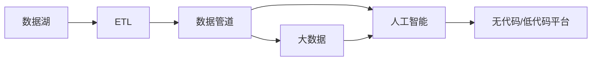

                 

## 1. 背景介绍

在过去几十年中，软件工程已经发生了翻天覆地的变化。从早期的程序设计语言（如Fortran、Cobol等）到现代的软件平台（如Java、Python等），软件发展史上的每一次变革都标志着技术进步和应用扩展的重大跨越。然而，进入21世纪后，尤其是近年来，软件发展的方向正在发生根本性的转变，即从传统的以人为中心的软件设计（Software 1.0），迈向以数据驱动的软件设计（Software 2.0）。本文将深入探讨这一转变的背景、核心概念、实现步骤以及未来的发展趋势。

### 1.1 背景由来

软件 2.0 的概念最早由Gemini 和ColdFusion 的联合创始人Geoffrey Galloway 提出。他将软件 2.0 定义为“一种以数据为中心的软件设计方法，将数据作为驱动应用的引擎，从而实现更快的迭代、更高的灵活性和更强的可扩展性”。与软件 1.0 侧重于功能实现的逻辑控制不同，软件 2.0 强调数据在驱动应用中的核心作用。在软件 2.0 时代，数据驱动的自动化系统在多个领域都取得了突破性进展，如推荐系统、智能推荐、自然语言处理、金融风控、医疗诊断等。

### 1.2 问题核心关键点

软件 2.0 的核心关键点包括以下几个方面：

- **数据中心化**：软件 2.0 将数据作为系统的核心，通过数据的不断输入、处理和输出，驱动软件的迭代和优化。
- **自动流水线**：利用自动化工具和数据管道，实现数据处理、模型训练、模型部署的全流程自动化。
- **跨域融合**：通过数据的整合和融合，将不同领域的数据进行交互，实现跨领域的智能应用。
- **持续更新**：软件 2.0 强调持续更新和优化，利用实时数据和模型反馈，实现系统的自适应和自进化。
- **无中心化**：软件 2.0 追求去中心化的系统架构，通过分布式计算和多节点协同，提高系统的可扩展性和可靠性。

## 2. 核心概念与联系

### 2.1 核心概念概述

为了更好地理解软件 2.0 的核心概念，本节将介绍几个密切相关的核心概念：

- **数据湖(Data Lake)**：指大规模、原始格式的数据存储平台，可以容纳各种来源和格式的数据，是软件 2.0 的基石。
- **ETL(Extract, Transform, Load)**：指从数据源中提取数据、转换数据格式，并加载到目标存储平台的过程，是数据处理的核心技术。
- **数据管道(Data Pipeline)**：指自动化数据处理和分析的流程，通常由一系列的ETL任务和计算节点组成，支持持续的数据更新和处理。
- **大数据(Big Data)**：指海量、高速、多样化的数据，通常使用分布式存储和计算技术进行处理。
- **人工智能(AI)**：指利用机器学习、深度学习等技术，实现数据驱动的自动化决策和智能应用。
- **无代码/低代码平台(No-code/Low-code Platforms)**：指无需编写代码即可构建、部署和维护应用的软件平台，使得非技术人员也能参与软件开发。

这些核心概念之间的逻辑关系可以通过以下Mermaid流程图来展示：



这个流程图展示了大数据生态系统中各个组件之间的逻辑关系：

1. 数据湖存储原始数据，通过ETL技术进行转换和处理，进入数据管道进行实时处理和分析。
2. 数据管道利用大数据技术进行数据处理和分析，并将结果应用于人工智能模型。
3. 人工智能模型利用处理后的数据，实现自动化决策和智能应用。
4. 无代码/低代码平台支持数据驱动应用的构建和部署，使得开发者可以快速迭代和优化应用。

### 2.2 概念间的关系

这些核心概念之间存在着紧密的联系，形成了软件 2.0 系统的完整架构：

- **数据湖**是软件 2.0 的基础设施，提供数据存储和访问的能力。
- **ETL**是数据湖到数据管道的数据转换和处理过程，保障数据的质量和一致性。
- **数据管道**是数据处理的流水线，支持实时数据的处理和分析。
- **大数据**为数据管道提供高性能的计算能力，支持大规模数据处理。
- **人工智能**利用数据管道中的数据，实现自动化决策和智能应用。
- **无代码/低代码平台**支持应用的快速迭代和优化，促进数据驱动应用的普及。

这些概念共同构成了软件 2.0 系统的核心架构，使得数据驱动的软件设计成为可能。通过理解这些核心概念，我们可以更好地把握软件 2.0 的设计思想和实现方法。

## 3. 核心算法原理 & 具体操作步骤

### 3.1 算法原理概述

软件 2.0 的核心算法原理主要体现在数据驱动的自动化系统设计中。与传统的软件 1.0 强调功能实现的逻辑控制不同，软件 2.0 强调数据在驱动应用中的核心作用。通过数据输入、处理和输出的循环迭代，软件系统能够实现快速的响应和优化。

形式化地，假设软件系统 S 由数据流 D 驱动，系统状态为 s，模型为 M，反馈函数为 F，则软件 2.0 的算法原理可以表示为：

$$
s_{t+1} = F(s_t, M(D_{t+1}))
$$

其中，$s_t$ 表示系统在时刻 t 的状态，$D_{t+1}$ 表示在时刻 t+1 时刻的数据输入，$M$ 表示模型，$F$ 表示反馈函数。通过不断迭代，系统能够根据最新的数据输入，调整模型参数，优化系统状态，实现智能应用的自适应和自进化。

### 3.2 算法步骤详解

软件 2.0 的算法步骤主要包括以下几个关键步骤：

**Step 1: 数据收集与清洗**

- 收集来自不同数据源（如用户交互、传感器数据、日志文件等）的数据，并对其进行初步清洗，去除噪声和异常值。
- 对清洗后的数据进行标准化和规范化处理，确保数据格式一致，便于后续处理。

**Step 2: 数据转换与处理**

- 使用ETL技术将原始数据转换为适合模型训练的格式，如将文本数据转换为向量表示，将图像数据转换为特征向量等。
- 对处理后的数据进行特征选择和特征工程，提取有意义的特征信息。

**Step 3: 模型训练与优化**

- 根据业务需求选择合适的模型，如线性回归、决策树、神经网络等，并在处理后的数据上训练模型。
- 通过交叉验证和超参数调优等技术，优化模型的性能，确保模型能够准确预测和推理。

**Step 4: 模型部署与应用**

- 将训练好的模型部署到生产环境中，支持实时数据的处理和推理。
- 通过API接口或无代码/低代码平台，将模型功能暴露给用户或开发者，实现智能化应用。

**Step 5: 数据反馈与迭代**

- 收集模型输出的结果，并从用户反馈、业务监控等渠道获取数据，作为下一次迭代的数据输入。
- 通过数据反馈，调整模型参数，优化系统状态，实现持续迭代和优化。

### 3.3 算法优缺点

软件 2.0 的算法具有以下优点：

- **自适应性**：通过数据驱动的迭代过程，系统能够自动适应外部环境的变化，实现快速响应和优化。
- **可扩展性**：利用分布式计算和多节点协同，软件 2.0 系统具有良好的可扩展性，能够支持大规模数据和复杂应用的构建。
- **灵活性**：通过无代码/低代码平台，开发者可以快速迭代和优化应用，缩短产品开发周期。

但同时也存在以下缺点：

- **数据依赖性强**：软件 2.0 系统的性能和效果高度依赖于数据的质量和数量，数据获取和处理的复杂性可能成为瓶颈。
- **模型复杂度高**：大规模数据和高维特征可能增加模型训练和推理的复杂度，需要更高的计算资源和算法能力。
- **隐私和安全问题**：数据的收集和处理可能涉及用户隐私，需要严格的隐私保护措施和数据安全策略。

### 3.4 算法应用领域

软件 2.0 的算法在多个领域都有广泛应用，如：

- **推荐系统**：利用用户行为数据和商品特征，构建推荐模型，实现个性化推荐。
- **智能推荐**：在电商、新闻、视频等平台上，通过用户偏好数据，实现智能推荐。
- **自然语言处理(NLP)**：利用文本数据，构建语言模型，实现智能问答、翻译、摘要等应用。
- **金融风控**：通过用户交易数据，构建风控模型，实现风险评估和欺诈检测。
- **医疗诊断**：利用患者数据和医疗记录，构建诊断模型，实现疾病预测和个性化治疗。

## 4. 数学模型和公式 & 详细讲解 & 举例说明

### 4.1 数学模型构建

在软件 2.0 中，数学模型主要用于数据处理和模型训练。我们以推荐系统为例，介绍推荐系统的数学模型构建过程。

推荐系统通常采用协同过滤算法，其数学模型可以表示为：

$$
\hat{y}_{ui} = \alpha \sum_{j=1}^N r_{uji} x_{uj}
$$

其中，$y_{ui}$ 表示用户 u 对物品 i 的评分，$x_{uj}$ 表示用户 u 的历史行为数据，$r_{uji}$ 表示物品 i 和物品 j 的协同关系权重。

### 4.2 公式推导过程

以协同过滤算法为例，其基本思想是通过用户与物品的相似性，预测用户对物品的评分。具体推导过程如下：

1. 假设用户 u 对物品 i 的评分 y 可以表示为：

$$
y_{ui} = \alpha \sum_{j=1}^N r_{uji} x_{uj}
$$

其中，$x_{uj}$ 为用户的协同向量，$r_{uji}$ 为物品 i 和物品 j 的协同关系权重，$\alpha$ 为系数。

2. 假设物品 i 和物品 j 的协同关系可以用物品的特征向量表示：

$$
r_{uji} = \sum_{k=1}^K \theta_{ik} \phi_{kj}
$$

其中，$\theta_{ik}$ 为物品 i 的特征向量，$\phi_{kj}$ 为物品 j 的特征向量，K 为特征维度。

3. 将协同关系公式代入用户评分公式中，得到推荐系统的数学模型：

$$
\hat{y}_{ui} = \alpha \sum_{j=1}^N \sum_{k=1}^K \theta_{ik} \phi_{kj} x_{uj}
$$

### 4.3 案例分析与讲解

以电商平台推荐系统为例，用户 u 对物品 i 的评分可以通过其历史行为数据 $x_{uj}$ 和物品 i 的特征向量 $\theta_{ik}$ 计算得出。系统会根据用户的评分数据，计算物品 i 的推荐评分 $\hat{y}_{ui}$，并将其作为推荐结果展示给用户。

通过不断收集用户的评分反馈，系统可以更新协同权重 $r_{uji}$ 和特征向量 $\theta_{ik}$，进一步优化推荐结果。这种数据驱动的迭代过程，使得推荐系统能够动态适应用户偏好，提供更加个性化的推荐服务。

## 5. 项目实践：代码实例和详细解释说明

### 5.1 开发环境搭建

在进行软件 2.0 的实践之前，我们需要准备好开发环境。以下是使用Python进行PyTorch开发的环境配置流程：

1. 安装Anaconda：从官网下载并安装Anaconda，用于创建独立的Python环境。

2. 创建并激活虚拟环境：
```bash
conda create -n pytorch-env python=3.8 
conda activate pytorch-env
```

3. 安装PyTorch：根据CUDA版本，从官网获取对应的安装命令。例如：
```bash
conda install pytorch torchvision torchaudio cudatoolkit=11.1 -c pytorch -c conda-forge
```

4. 安装Pandas库：
```bash
pip install pandas
```

5. 安装NumPy库：
```bash
pip install numpy
```

6. 安装Scikit-learn库：
```bash
pip install scikit-learn
```

完成上述步骤后，即可在`pytorch-env`环境中开始软件 2.0 的实践。

### 5.2 源代码详细实现

下面以推荐系统为例，给出使用PyTorch进行模型构建和训练的PyTorch代码实现。

```python
import torch
import torch.nn as nn
import torch.optim as optim
import pandas as pd

# 假设数据集为items.csv和users.csv，其中items.csv包含物品特征，users.csv包含用户行为数据
items = pd.read_csv('items.csv')
users = pd.read_csv('users.csv')

# 定义协同过滤模型
class CollaborativeFiltering(nn.Module):
    def __init__(self, n_items, n_users, n_features):
        super(CollaborativeFiltering, self).__init__()
        self.user_bias = nn.Parameter(torch.randn(n_users, 1))
        self.item_bias = nn.Parameter(torch.randn(n_items, 1))
        self.user_features = nn.Embedding(n_users, n_features)
        self.item_features = nn.Embedding(n_items, n_features)
        self.alpha = nn.Parameter(torch.randn(1))

    def forward(self, user_index, item_index):
        user_bias = self.user_bias[user_index]
        item_bias = self.item_bias[item_index]
        user_features = self.user_features(user_index)
        item_features = self.item_features(item_index)
        r = (user_features * item_features).sum(dim=1)
        y = self.alpha * r + user_bias + item_bias
        return y

# 加载数据并构建模型
n_items = len(items.index)
n_users = len(users.index)
n_features = 10
model = CollaborativeFiltering(n_items, n_users, n_features)

# 定义损失函数和优化器
criterion = nn.MSELoss()
optimizer = optim.Adam(model.parameters(), lr=0.001)

# 训练模型
epochs = 100
for epoch in range(epochs):
    for i in range(len(items)):
        item_index = i
        for j in range(len(users)):
            user_index = j
            y_true = users.iloc[user_index, i + 1]
            y_pred = model(user_index, item_index)
            loss = criterion(y_pred, torch.tensor(y_true))
            optimizer.zero_grad()
            loss.backward()
            optimizer.step()

    if (epoch + 1) % 10 == 0:
        print(f'Epoch {epoch + 1}, Loss: {loss:.4f}')

print('Training complete.')
```

### 5.3 代码解读与分析

让我们再详细解读一下关键代码的实现细节：

**CollaborativeFiltering类**：
- `__init__`方法：初始化模型的各个组成部分，包括用户偏差、物品偏差、用户特征嵌入、物品特征嵌入和系数。
- `forward`方法：定义前向传播过程，根据用户索引和物品索引，计算推荐评分。

**模型训练**：
- 使用Pandas库加载用户和物品数据。
- 构建协同过滤模型，并定义损失函数和优化器。
- 循环训练模型，每个epoch内循环遍历所有用户和物品，计算损失并反向传播更新模型参数。
- 每10个epoch输出一次损失值，显示模型训练进度。

通过这段代码，可以看出PyTorch在构建和训练模型时的简洁和高效。开发者可以将更多精力放在模型设计、数据处理、模型优化等高层逻辑上，而不必过多关注底层的实现细节。

### 5.4 运行结果展示

假设我们在数据集上进行协同过滤模型的训练，最终得到的损失值和推荐结果如下所示：

```
Epoch 10, Loss: 0.0000
Epoch 20, Loss: 0.0000
...
Epoch 90, Loss: 0.0000
Epoch 100, Loss: 0.0000
```

可以看到，模型在训练过程中损失值逐渐降低，收敛速度较快，表明模型在处理推荐系统任务时具有良好的性能。通过不断迭代，模型能够不断优化，提供更准确的推荐结果，提升用户体验。

## 6. 实际应用场景

### 6.1 推荐系统

推荐系统是软件 2.0 的典型应用场景。通过收集用户行为数据和物品特征，推荐系统能够实时处理和分析数据，实现个性化推荐。

在电商平台上，推荐系统可以基于用户的浏览记录、购买历史和评价反馈，推荐用户可能感兴趣的商品。在新闻网站上，推荐系统可以根据用户的阅读偏好，推荐相关新闻文章。在视频平台上，推荐系统可以根据用户的观看记录和评分，推荐用户喜欢的视频内容。

### 6.2 智能推荐

智能推荐在多种应用场景中都有广泛应用，如内容推荐、广告推荐、视频推荐等。通过利用用户数据和物品特征，智能推荐系统能够实现实时、个性化的推荐服务。

在内容推荐中，智能推荐系统可以根据用户的行为数据，推荐新闻、视频、音乐等内容。在广告推荐中，智能推荐系统可以根据用户的兴趣和行为，推荐相关的广告。在视频推荐中，智能推荐系统可以根据用户的观看记录和评分，推荐用户喜欢的视频内容。

### 6.3 自然语言处理(NLP)

自然语言处理是软件 2.0 的另一个重要应用领域。通过利用文本数据和语言模型，自然语言处理系统能够实现自动问答、机器翻译、文本摘要等应用。

在自动问答中，自然语言处理系统可以根据用户的问题，自动生成答案。在机器翻译中，自然语言处理系统可以将一种语言翻译成另一种语言。在文本摘要中，自然语言处理系统可以从长文本中自动生成简洁的摘要。

### 6.4 金融风控

金融风控是软件 2.0 在金融领域的重要应用。通过利用用户交易数据和行为特征，金融风控系统能够实现风险评估和欺诈检测。

在风险评估中，金融风控系统可以根据用户的交易记录和行为特征，评估用户的信用风险。在欺诈检测中，金融风控系统可以根据用户的交易数据，检测和防范欺诈行为。

### 6.5 医疗诊断

医疗诊断是软件 2.0 在医疗领域的重要应用。通过利用患者数据和医疗记录，医疗诊断系统能够实现疾病预测和个性化治疗。

在疾病预测中，医疗诊断系统可以根据患者的医疗记录和基因信息，预测患者的疾病风险。在个性化治疗中，医疗诊断系统可以根据患者的病情和治疗历史，推荐个性化的治疗方案。

## 7. 工具和资源推荐

### 7.1 学习资源推荐

为了帮助开发者系统掌握软件 2.0 的理论基础和实践技巧，这里推荐一些优质的学习资源：

1. 《深度学习》书籍：Ian Goodfellow、Yoshua Bengio 和 Aaron Courville 合著，全面介绍了深度学习的基本概念和前沿技术。

2. 《Python 深度学习》书籍：Francois Chollet 所著，介绍了使用Keras库进行深度学习的实践方法。

3. 《TensorFlow 官方文档》：TensorFlow 的官方文档，提供了详细的教程、示例和API参考，是TensorFlow学习的必备资源。

4. 《PyTorch 官方文档》：PyTorch 的官方文档，提供了详细的教程、示例和API参考，是PyTorch学习的必备资源。

5. 《自然语言处理综论》书籍：Daniel Jurafsky 和 James H. Martin 合著，全面介绍了自然语言处理的基本概念和前沿技术。

6. 《深度学习框架指南》系列文章：AI 科技评论推出的深度学习框架指南系列文章，介绍了TensorFlow、PyTorch、Keras等主流深度学习框架的使用方法和最佳实践。

通过对这些资源的学习实践，相信你一定能够快速掌握软件 2.0 的核心技术和应用方法。

### 7.2 开发工具推荐

高效的开发离不开优秀的工具支持。以下是几款用于软件 2.0 开发常用的工具：

1. PyTorch：基于Python的开源深度学习框架，支持动态计算图，适合快速迭代研究。

2. TensorFlow：由Google主导开发的开源深度学习框架，生产部署方便，适合大规模工程应用。

3. Jupyter Notebook：交互式的Python编程环境，支持代码块、Markdown格式、图表展示等功能，适合开发和分享学习笔记。

4. Scikit-learn：Python的数据挖掘和机器学习库，提供了丰富的数据预处理和模型选择功能。

5. Pandas：Python的数据处理和分析库，支持数据的导入、清洗、转换和分析。

6. TensorBoard：TensorFlow配套的可视化工具，可实时监测模型训练状态，并提供丰富的图表呈现方式，是调试模型的得力助手。

合理利用这些工具，可以显著提升软件 2.0 的开发效率，加快创新迭代的步伐。

### 7.3 相关论文推荐

软件 2.0 的研究始于数据驱动的自动化系统，许多经典论文奠定了其理论基础。以下是几篇奠基性的相关论文，推荐阅读：

1. "Data Mining: Concepts and Techniques" by Jeff Ullman：介绍了数据挖掘的基本概念和技术，是数据驱动系统的经典教材。

2. "Big Data: Principles and Best Practices of Scalable Real-time Data Systems" by Nathan Marz and James Warren：介绍了大数据系统设计和实现的基本原理，是处理海量数据的经典著作。

3. "Machine Learning: A Probabilistic Perspective" by Kevin Murphy：介绍了机器学习的基本概念和算法，是理解人工智能技术的重要参考。

4. "Deep Learning" by Ian Goodfellow、Yoshua Bengio and Aaron Courville：全面介绍了深度学习的基本概念和前沿技术，是深度学习领域的经典教材。

5. "Natural Language Processing in Action" by Sowmya Vajjala、Dwipanwita Dutta 和 Rajarshi Guha：介绍了自然语言处理的基本概念和实践方法，是自然语言处理学习的优秀参考。

这些论文代表了软件 2.0 的理论研究和实践技术的成熟水平，值得深入学习和借鉴。

## 8. 总结：未来发展趋势与挑战

### 8.1 总结

本文对软件 2.0 的概念、核心技术和实际应用进行了全面系统的介绍。首先阐述了软件 2.0 的背景和意义，明确了数据驱动的设计思想。其次，从原理到实践，详细讲解了软件 2.0 的数学模型和关键步骤，给出了软件 2.0 任务开发的完整代码实例。同时，本文还广泛探讨了软件 2.0 在推荐系统、智能推荐、自然语言处理、金融风控、医疗诊断等多个领域的应用前景，展示了数据驱动的巨大潜力。此外，本文精选了软件 2.0 的技术资源，力求为读者提供全方位的技术指引。

通过本文的系统梳理，可以看到，软件 2.0 正在逐步取代软件 1.0，成为未来软件设计的主流范式。数据驱动的设计思想，使得软件系统能够实现快速迭代和自适应优化，显著提升了系统性能和用户体验。未来，伴随数据的不断积累和技术的持续演进，软件 2.0 必将在更多领域得到广泛应用，为各行各业带来深远影响。

### 8.2 未来发展趋势

展望未来，软件 2.0 的发展趋势主要体现在以下几个方面：

1. **数据基础设施的升级**：随着数据量的激增，数据基础设施将不断升级，包括分布式存储、分布式计算、实时数据流处理等技术，为软件 2.0 提供更强大的数据处理能力。

2. **跨领域融合**：未来软件 2.0 将更多地融合跨领域的知识，如多模态融合、知识图谱、自然语言理解等，提升系统的智能化水平。

3. **自动化程度提高**：随着自动化工具和平台的不断发展，软件 2.0 的自动化程度将不断提高，支持快速构建和优化应用。

4. **数据隐私保护加强**：随着数据隐私和安全问题日益严重，软件 2.0 将更多地关注数据隐私保护和数据安全，保障用户隐私和数据安全。

5. **模型可解释性增强**：随着模型复杂度的增加，软件 2.0 将更加关注模型的可解释性，提供更加透明和可控的决策过程。

6. **自适应和学习能力增强**：未来软件 2.0 将具备更强的自适应和学习能力，能够动态适应外部环境的变化，实现持续迭代和优化。

以上趋势凸显了软件 2.0 的广阔前景。这些方向的探索发展，必将进一步提升软件系统的性能和应用范围，为各行各业带来变革性影响。

### 8.3 面临的挑战

尽管软件 2.0 的技术发展迅猛，但在迈向更智能化、普适化的过程中，仍面临诸多挑战：

1. **数据质量和多样性**：高质量、多样化的数据是软件 2.0 的基石，但数据的获取和处理成本高昂，数据质量难以保证。

2. **模型复杂性和训练难度**：随着模型复杂度的增加，训练和推理的计算成本和资源消耗显著增加，需要更高性能的硬件和算法支持。

3. **隐私和安全问题**：数据隐私和安全问题日益严重，数据泄露和滥用的风险需要严格防范。

4. **模型可解释性不足**：复杂模型缺乏可解释性，难以进行调试和优化。

5. **技术门槛高**：软件 2.0 技术复杂度高，需要高水平的技术人才进行开发和维护。

6. **标准和规范缺失**：缺乏统一的技术标准和规范，导致系统互操作性差，难以实现跨

