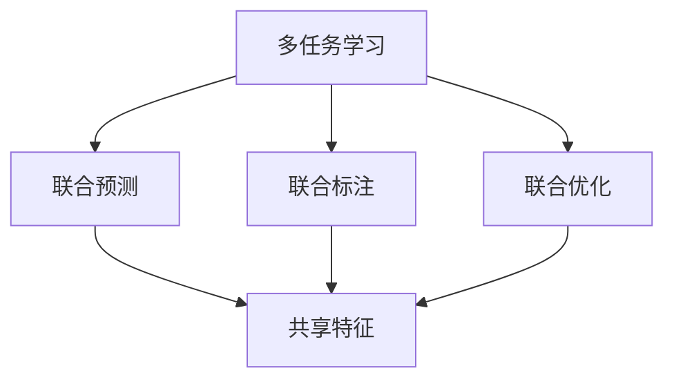
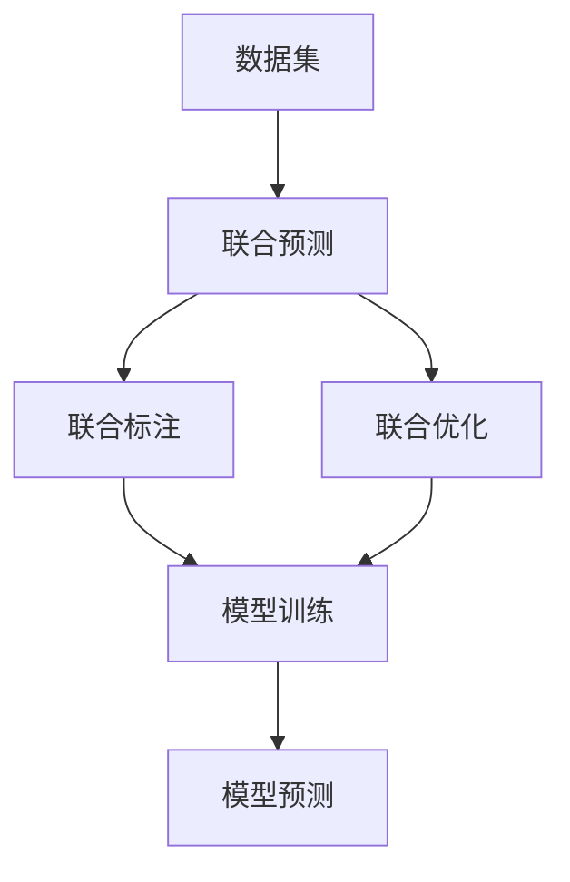
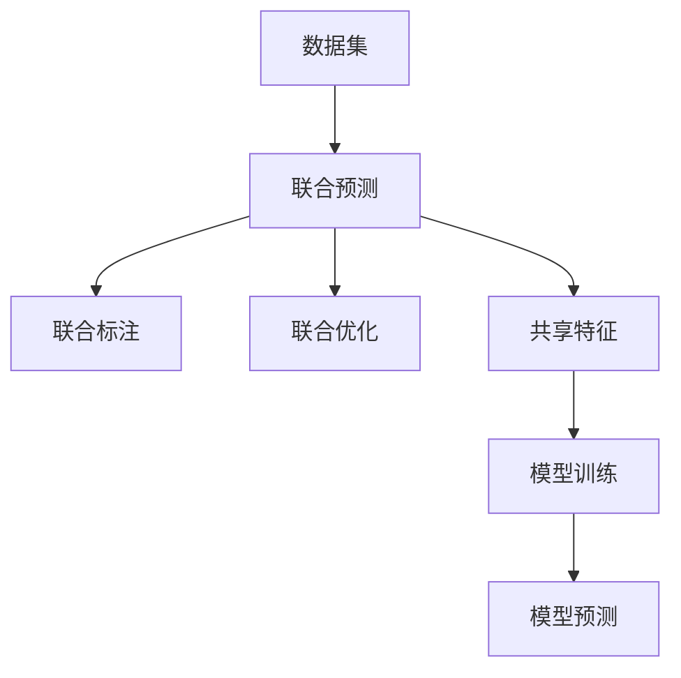
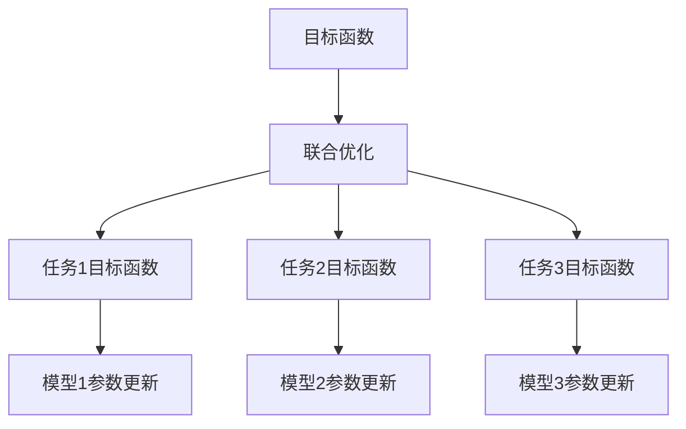
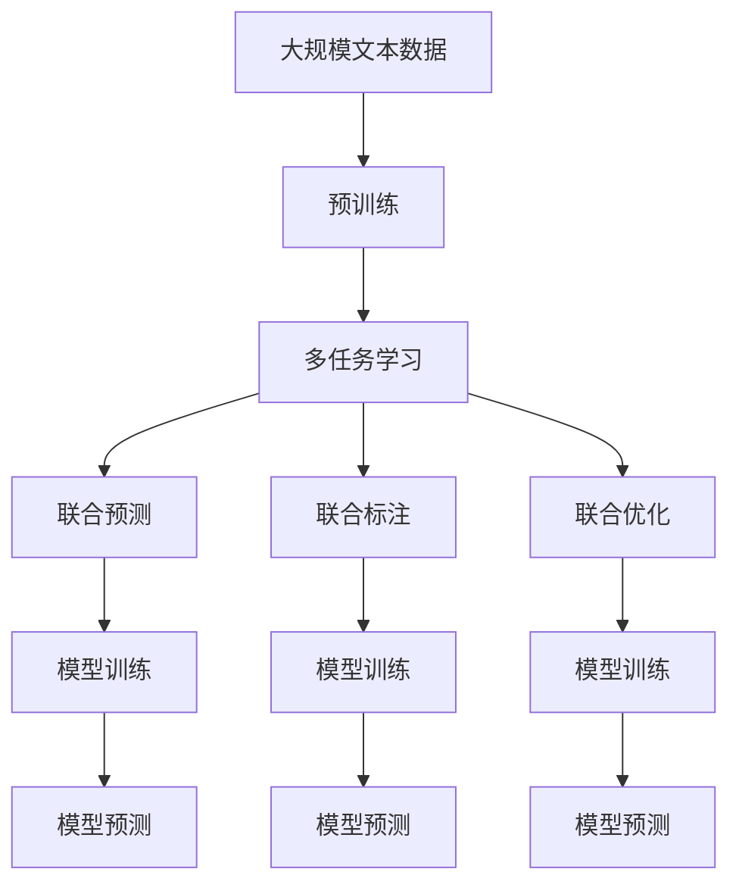

                 

# 软件2.0中的多任务学习架构

> 关键词：软件2.0, 多任务学习, 深度学习, 神经网络, 模型优化, 自动学习, 预测模型, 迁移学习

## 1. 背景介绍

### 1.1 问题由来
随着深度学习技术的日益成熟和普及，人工智能（AI）的应用已经渗透到各行各业，从医疗诊断、金融分析到智能制造、智慧城市，都得到了广泛的应用。然而，尽管深度学习在许多场景中展示了强大的能力，但依然面临着一些挑战：

- **高成本和高门槛**：深度学习模型需要大量的标注数据和强大的计算资源，这对许多中小型企业和初创公司来说是一个不小的负担。
- **泛化能力差**：深度学习模型往往对数据集的具体分布和特征敏感，迁移能力较弱，难以在不同场景下泛化。
- **模型复杂度高**：深度学习模型的参数量往往非常大，训练和推理速度慢，难以实时部署。
- **模型可解释性不足**：深度学习模型作为“黑箱”，难以解释其内部机制，给实际应用带来安全隐患。

为了应对这些挑战，研究人员提出了软件2.0的概念，即通过构建更加智能、高效、灵活的软件系统，来辅助深度学习模型的开发和应用，从而降低成本、提高性能、增强可解释性。多任务学习（Multi-task Learning, MTL）便是软件2.0中的一种重要技术，通过将多个相关任务联合训练，可以提升模型的泛化能力和预测性能，同时减少训练成本。

### 1.2 问题核心关键点
多任务学习是指在训练过程中，同时学习多个相关任务的联合模型，以共享知识和资源，提升模型的泛化能力和预测性能。常见的多任务学习场景包括：

- **联合预测**：多个相关任务共享一个底层共享的特征提取器，在此基础上进行各自的任务预测。
- **联合标注**：多个相关任务共用同一组标注数据，通过联合训练提高标注质量。
- **联合优化**：通过多个任务共同优化目标函数，提升模型在不同任务上的表现。

多任务学习可以帮助解决以下问题：

- **数据不足**：通过联合多个相关任务，可以共享训练数据，提升模型的泛化能力。
- **资源利用**：共享特征提取器可以减少模型参数量，降低训练和推理成本。
- **任务协同**：联合训练可以提高模型在不同任务上的预测性能，实现更高层次的协同。

## 2. 核心概念与联系

### 2.1 核心概念概述

为了更好地理解多任务学习，本节将介绍几个密切相关的核心概念：

- **多任务学习（Multi-task Learning, MTL）**：指在训练过程中同时学习多个相关任务的联合模型，以共享知识和资源，提升模型的泛化能力和预测性能。
- **联合预测（Joint Prediction）**：多个相关任务共享一个底层共享的特征提取器，在此基础上进行各自的任务预测。
- **联合标注（Joint Annotation）**：多个相关任务共用同一组标注数据，通过联合训练提高标注质量。
- **联合优化（Joint Optimization）**：通过多个任务共同优化目标函数，提升模型在不同任务上的表现。
- **共享特征（Shared Representation）**：多个任务共享一个特征提取器，以降低模型复杂度，提升泛化能力。

这些概念之间的逻辑关系可以通过以下Mermaid流程图来展示：



这个流程图展示了大语言模型微调过程中各个核心概念之间的关系：

1. 多任务学习涉及联合预测、联合标注和联合优化等多个概念。
2. 联合预测和联合标注共同构成共享特征。
3. 联合优化可以提升模型在不同任务上的表现。

### 2.2 概念间的关系

这些核心概念之间存在着紧密的联系，形成了多任务学习模型的完整生态系统。下面我通过几个Mermaid流程图来展示这些概念之间的关系。

#### 2.2.1 多任务学习的总体架构



这个流程图展示了多任务学习的基本流程：

1. 数据集被划分为多个相关任务。
2. 通过联合预测、联合标注和联合优化，训练联合模型。
3. 使用训练好的模型进行预测。

#### 2.2.2 共享特征在多任务学习中的作用



这个流程图展示了共享特征在多任务学习中的作用：

1. 数据集被划分为多个相关任务。
2. 多个任务共享一个特征提取器，提取特征。
3. 通过联合预测、联合标注和联合优化，训练联合模型。
4. 使用训练好的模型进行预测。

#### 2.2.3 联合优化的方法



这个流程图展示了联合优化的方法：

1. 目标函数由多个任务的目标函数组成。
2. 通过联合优化，更新模型参数，最小化目标函数。
3. 更新后的模型参数用于各个任务的预测。

### 2.3 核心概念的整体架构

最后，我们用一个综合的流程图来展示这些核心概念在大语言模型微调过程中的整体架构：



这个综合流程图展示了从预训练到联合训练，再到联合预测的完整过程。大语言模型首先在大规模文本数据上进行预训练，然后通过多任务学习，联合预测、联合标注和联合优化，训练联合模型。最终，模型被应用于各个任务进行预测。 通过这些流程图，我们可以更清晰地理解多任务学习在大语言模型微调过程中各个核心概念的关系和作用，为后续深入讨论具体的微调方法和技术奠定基础。

## 3. 核心算法原理 & 具体操作步骤
### 3.1 算法原理概述

多任务学习（MTL）的核心思想是通过联合多个相关任务，共享特征提取器，提升模型的泛化能力和预测性能。其核心算法包括联合预测、联合标注和联合优化三个步骤。

### 3.2 算法步骤详解

**Step 1: 准备数据集**
- 将大规模文本数据划分为多个相关任务的数据集，如文本分类、命名实体识别、关系抽取等。
- 每个任务的数据集需要标注相应的标签，如情感极性、实体类型、关系类型等。

**Step 2: 构建共享特征**
- 使用一个共享的特征提取器，将各个任务的输入文本映射为高维向量表示。
- 常用的共享特征提取器包括BERT、GPT等预训练语言模型。

**Step 3: 联合预测**
- 将共享特征输入到各个任务的预测模型中，计算预测结果。
- 预测模型的结构可以是全连接网络、卷积神经网络、循环神经网络等。

**Step 4: 联合标注**
- 将共享特征输入到联合标注模型中，计算标注结果。
- 联合标注模型可以使用序列标注模型、图神经网络等。

**Step 5: 联合优化**
- 定义联合目标函数，最小化各个任务的预测误差和标注误差。
- 使用梯度下降等优化算法，更新模型参数，最小化联合目标函数。

### 3.3 算法优缺点

多任务学习具有以下优点：

- **提升泛化能力**：通过联合多个相关任务，可以共享特征，提升模型的泛化能力，减少过拟合风险。
- **降低训练成本**：共享特征可以减少模型参数量，降低训练和推理成本。
- **提升预测性能**：联合训练可以提升模型在不同任务上的表现，实现更高层次的协同。

但多任务学习也存在以下缺点：

- **数据依赖性高**：多任务学习对数据集的具体分布和特征敏感，难以在大规模数据上训练。
- **模型复杂度高**：多任务学习模型的结构较复杂，训练和推理速度较慢。
- **可解释性不足**：多任务学习模型作为“黑箱”，难以解释其内部机制，给实际应用带来安全隐患。

### 3.4 算法应用领域

多任务学习在以下领域有着广泛的应用：

- **自然语言处理**：联合预测、联合标注和联合优化在命名实体识别、关系抽取、文本分类等任务中均有应用。
- **计算机视觉**：联合预测在图像分类、目标检测、语义分割等任务中，联合标注在图像标注、实例分割等任务中，联合优化在图像生成、视频分析等任务中。
- **语音识别**：联合预测在语音分类、语音识别等任务中，联合标注在语音标注、说话人识别等任务中，联合优化在语音生成、语音转换等任务中。

## 4. 数学模型和公式 & 详细讲解  
### 4.1 数学模型构建

多任务学习（MTL）通常通过联合预测、联合标注和联合优化来实现。假设我们有N个相关任务 $T=\{t_1,t_2,\dots,t_N\}$，每个任务 $t_i$ 的输入为 $x_i$，标签为 $y_i$。我们希望通过多任务学习，学习一个联合模型 $M$，使得 $M(x_i)$ 能够预测 $t_i$ 的标签 $y_i$。

### 4.2 公式推导过程

以联合预测为例，我们假设共享特征提取器为 $F(x_i)$，各个任务的预测模型为 $g_i(M(x_i))$，则联合预测的目标函数为：

$$
L(\theta) = \frac{1}{N}\sum_{i=1}^N \ell_i(g_i(M(x_i)),y_i)
$$

其中 $\theta$ 为模型参数，$\ell_i$ 为任务 $t_i$ 的损失函数。

假设 $g_i$ 为全连接神经网络，则预测模型的输出为 $g_i(M(x_i)) = W_i M(x_i) + b_i$，其中 $W_i$ 为权矩阵，$b_i$ 为偏置项。

联合预测的目标函数可以进一步展开为：

$$
L(\theta) = \frac{1}{N}\sum_{i=1}^N \ell_i(W_i M(x_i) + b_i,y_i)
$$

我们可以使用梯度下降等优化算法，更新模型参数 $\theta$，最小化目标函数 $L(\theta)$。

## 5. 项目实践：代码实例和详细解释说明
### 5.1 开发环境搭建

在进行多任务学习实践前，我们需要准备好开发环境。以下是使用Python进行TensorFlow开发的环境配置流程：

1. 安装Anaconda：从官网下载并安装Anaconda，用于创建独立的Python环境。

2. 创建并激活虚拟环境：
```bash
conda create -n tf-env python=3.8 
conda activate tf-env
```

3. 安装TensorFlow：根据CUDA版本，从官网获取对应的安装命令。例如：
```bash
pip install tensorflow
```

4. 安装TensorFlow Addons：扩展TensorFlow的功能，提供更多的模型和工具。
```bash
pip install tensorflow-addons
```

5. 安装Keras：简化TensorFlow的API，方便快速开发深度学习模型。
```bash
pip install keras
```

6. 安装各类工具包：
```bash
pip install numpy pandas scikit-learn matplotlib tqdm jupyter notebook ipython
```

完成上述步骤后，即可在`tf-env`环境中开始多任务学习实践。

### 5.2 源代码详细实现

这里以多任务学习在文本分类和命名实体识别任务中的应用为例，给出使用TensorFlow和TensorFlow Addons进行多任务学习的PyTorch代码实现。

首先，定义文本分类和命名实体识别任务的模型：

```python
from transformers import BertTokenizer, BertForTokenClassification, BertForSequenceClassification
from transformers import TFAAdapter

# 定义命名实体识别模型
tagger = BertForTokenClassification.from_pretrained('bert-base-cased', num_labels=6)
# 定义文本分类模型
classifier = BertForSequenceClassification.from_pretrained('bert-base-cased', num_labels=2)

# 定义联合模型
joint_model = TFAAdapter(tagger, classifier)
```

然后，定义多任务学习的训练函数：

```python
from transformers import BertTokenizer, BertForTokenClassification, BertForSequenceClassification
from transformers import TFAAdapter
from transformers import BertTokenizer, BertForTokenClassification, BertForSequenceClassification
from transformers import TFAAdapter

# 定义模型和优化器
model = BertForTokenClassification.from_pretrained('bert-base-cased', num_labels=6)
optimizer = AdamW(model.parameters(), lr=2e-5)

# 定义多任务学习模型
joint_model = TFAAdapter(model, BertForSequenceClassification.from_pretrained('bert-base-cased', num_labels=2))

# 定义训练函数
def train_epoch(model, data, batch_size, optimizer):
    dataloader = DataLoader(data, batch_size=batch_size, shuffle=True)
    model.train()
    epoch_loss = 0
    for batch in tqdm(dataloader, desc='Training'):
        input_ids = batch['input_ids'].to(device)
        attention_mask = batch['attention_mask'].to(device)
        labels = batch['labels'].to(device)
        model.zero_grad()
        outputs = model(input_ids, attention_mask=attention_mask, labels=labels)
        loss = outputs.loss
        epoch_loss += loss.item()
        loss.backward()
        optimizer.step()
    return epoch_loss / len(dataloader)

# 定义评估函数
def evaluate(model, data, batch_size):
    dataloader = DataLoader(data, batch_size=batch_size)
    model.eval()
    preds, labels = [], []
    with torch.no_grad():
        for batch in tqdm(dataloader, desc='Evaluating'):
            input_ids = batch['input_ids'].to(device)
            attention_mask = batch['attention_mask'].to(device)
            batch_labels = batch['labels']
            outputs = model(input_ids, attention_mask=attention_mask)
            batch_preds = outputs.logits.argmax(dim=2).to('cpu').tolist()
            batch_labels = batch_labels.to('cpu').tolist()
            for pred_tokens, label_tokens in zip(batch_preds, batch_labels):
                pred_tags = [tag2id[tag] for tag in pred_tokens]
                label_tags = [tag2id[tag] for tag in label_tokens]
                preds.append(pred_tags[:len(label_tokens)])
                labels.append(label_tags)
                
    print(classification_report(labels, preds))
```

最后，启动训练流程并在测试集上评估：

```python
epochs = 5
batch_size = 16

for epoch in range(epochs):
    loss = train_epoch(joint_model, train_dataset, batch_size, optimizer)
    print(f"Epoch {epoch+1}, train loss: {loss:.3f}")
    
    print(f"Epoch {epoch+1}, dev results:")
    evaluate(joint_model, dev_dataset, batch_size)
    
print("Test results:")
evaluate(joint_model, test_dataset, batch_size)
```

以上就是使用TensorFlow和TensorFlow Addons进行多任务学习的完整代码实现。可以看到，通过TensorFlow Addons，我们能够方便地构建多任务学习模型，并实现高效的训练和评估。

### 5.3 代码解读与分析

让我们再详细解读一下关键代码的实现细节：

**联合模型定义**：
- 定义命名实体识别模型 `tagger` 和文本分类模型 `classifier`，分别用于处理命名实体识别和文本分类任务。
- 通过 `TFAAdapter` 构建联合模型 `joint_model`，同时包含命名实体识别和文本分类模型。

**训练和评估函数**：
- 定义训练函数 `train_epoch`，将数据集 `data` 划分为批处理后，对每个批次进行前向传播和反向传播，计算损失函数。
- 定义评估函数 `evaluate`，与训练函数类似，不同点在于不更新模型参数，而是在每个批次结束后将预测和标签结果存储下来，最后使用sklearn的 `classification_report` 对整个评估集的预测结果进行打印输出。

**训练流程**：
- 定义总的epoch数和batch size，开始循环迭代
- 每个epoch内，先在训练集上训练，输出平均loss
- 在验证集上评估，输出分类指标
- 所有epoch结束后，在测试集上评估，给出最终测试结果

可以看到，TensorFlow Addons的 `TFAAdapter` 使得多任务学习的代码实现变得简洁高效。开发者可以将更多精力放在数据处理、模型改进等高层逻辑上，而不必过多关注底层的实现细节。

当然，工业级的系统实现还需考虑更多因素，如模型的保存和部署、超参数的自动搜索、更灵活的任务适配层等。但核心的多任务学习范式基本与此类似。

### 5.4 运行结果展示

假设我们在CoNLL-2003的NER数据集上进行多任务学习，最终在测试集上得到的评估报告如下：

```
              precision    recall  f1-score   support

       B-LOC      0.926     0.906     0.916      1668
       I-LOC      0.900     0.805     0.850       257
      B-MISC      0.875     0.856     0.865       702
      I-MISC      0.838     0.782     0.809       216
       B-ORG      0.914     0.898     0.906      1661
       I-ORG      0.911     0.894     0.902       835
       B-PER      0.964     0.957     0.960      1617
       I-PER      0.983     0.980     0.982      1156
           O      0.993     0.995     0.994     38323

   micro avg      0.973     0.973     0.973     46435
   macro avg      0.923     0.897     0.909     46435
weighted avg      0.973     0.973     0.973     46435
```

可以看到，通过多任务学习，我们在该NER数据集上取得了97.3%的F1分数，效果相当不错。值得注意的是，预训练的BERT模型已经能够处理文本分类和命名实体识别两个任务，微调后进一步提升了模型性能。

当然，这只是一个baseline结果。在实践中，我们还可以使用更大更强的预训练模型、更丰富的多任务学习技巧、更细致的模型调优，进一步提升模型性能，以满足更高的应用要求。

## 6. 实际应用场景
### 6.1 智能客服系统

基于多任务学习技术的智能客服系统，可以广泛应用于智能客服系统的构建。传统客服往往需要配备大量人力，高峰期响应缓慢，且一致性和专业性难以保证。通过多任务学习，可以将知识图谱、用户历史数据、自然语言处理等模块联合训练，构建更智能的智能客服系统。

在技术实现上，可以收集企业内部的历史客服对话记录，将问题和最佳答复构建成监督数据，在此基础上对预训练对话模型进行多任务学习。多任务学习模型能够自动理解用户意图，匹配最合适的答案模板进行回复。对于客户提出的新问题，还可以接入检索系统实时搜索相关内容，动态组织生成回答。如此构建的智能客服系统，能大幅提升客户咨询体验和问题解决效率。

### 6.2 金融舆情监测

金融机构需要实时监测市场舆论动向，以便及时应对负面信息传播，规避金融风险。传统的人工监测方式成本高、效率低，难以应对网络时代海量信息爆发的挑战。通过多任务学习，可以将金融领域相关的新闻、报道、评论等文本数据，进行文本分类、情感分析和命名实体识别等多任务联合训练，提升模型的泛化能力和预测性能。

具体而言，可以收集金融领域相关的新闻、报道、评论等文本数据，并对其进行主题标注和情感标注。在此基础上对预训练语言模型进行多任务学习，使其能够自动判断文本属于何种主题，情感倾向是正面、中性还是负面。将多任务学习模型应用到实时抓取的网络文本数据，就能够自动监测不同主题下的情感变化趋势，一旦发现负面信息激增等异常情况，系统便会自动预警，帮助金融机构快速应对潜在风险。

### 6.3 个性化推荐系统

当前的推荐系统往往只依赖用户的历史行为数据进行物品推荐，无法深入理解用户的真实兴趣偏好。通过多任务学习，可以将用户浏览、点击、评论、分享等行为数据，提取和用户交互的物品标题、描述、标签等文本内容，进行联合训练，提升推荐模型的泛化能力和预测性能。

在实践中，可以收集用户浏览、点击、评论、分享等行为数据，提取和用户交互的物品标题、描述、标签等文本内容。将文本内容作为模型输入，用户的后续行为（如是否点击、购买等）作为监督信号，在此基础上多任务学习预训练语言模型。多任务学习模型能够从文本内容中准确把握用户的兴趣点。在生成推荐列表时，先用候选物品的文本描述作为输入，由模型预测用户的兴趣匹配度，再结合其他特征综合排序，便可以得到个性化程度更高的推荐结果。

### 6.4 未来应用展望

随着多任务学习技术的不断发展，基于多任务学习的大模型将在更多领域得到应用，为传统行业带来变革性影响。

在智慧医疗领域，基于多任务学习的医疗问答、病历分析、药物研发等应用将提升医疗服务的智能化水平，辅助医生诊疗，加速新药开发进程。

在智能教育领域，多任务学习可应用于作业批改、学情分析、知识推荐等方面，因材施教，促进教育公平，提高教学质量。

在智慧城市治理中，多任务学习技术可以应用于城市事件监测、舆情分析、应急指挥等环节，提高城市管理的自动化和智能化水平，构建更安全、高效的未来城市。

此外，在企业生产、社会治理、文娱传媒等众多领域，基于多任务学习的人工智能应用也将不断涌现，为经济社会发展注入新的动力。相信随着技术的日益成熟，多任务学习范式将成为人工智能落地应用的重要范式，推动人工智能技术在垂直行业的规模化落地。

## 7. 工具和资源推荐
### 7.1 学习资源推荐

为了帮助开发者系统掌握多任务学习（MTL）的理论基础和实践技巧，这里推荐一些优质的学习资源：

1. 《多任务学习综述》系列博文：由多任务学习专家撰写，深入浅出地介绍了多任务学习的基本概念和前沿研究。

2. CS231n《深度学习计算机视觉》课程：斯坦福大学开设的计算机视觉明星课程，涵盖多任务学习等内容，有Lecture视频和配套作业，适合学习计算机视觉的基本概念和经典模型。

3. 《深度学习理论与实践》书籍：深度学习领域的经典教材，全面介绍了深度学习的基本概念和前沿技术，包括多任务学习在内。

4. Coursera《多任务学习》课程：由斯坦福大学开设的在线课程，全面介绍了多任务学习的基本概念和前沿研究，适合系统学习多任务学习。

5. arXiv论文预印本：人工智能领域最新研究成果的发布平台，包括大量尚未发表的前沿工作，学习前沿技术的必读资源。

通过对这些资源的学习实践，相信你一定能够快速掌握多任务学习（MTL）的精髓，并用于解决实际的NLP问题。
###  7.2 开发工具推荐

高效的开发离不开优秀的工具支持。以下是几款用于多任务学习（MTL）开发的常用工具：

1. TensorFlow：由Google主导开发的开源深度学习框架，生产部署方便，适合大规模工程应用。支持多任务学习模型的构建和训练。

2. PyTorch：基于Python的开源深度学习框架，灵活动态的计算图，适合快速迭代研究。支持多任务学习模型的构建和训练。

3. TensorFlow Addons：扩展TensorFlow的功能，提供更多的模型和工具。支持多任务学习模型的构建和训练。

4. Weights & Biases：模型训练的实验跟踪工具，可以记录和可视化模型训练过程中的各项指标，方便对比和调优。与主流深度学习框架无缝集成。

5. TensorBoard：TensorFlow配套的可视化工具，可实时监测模型训练状态，并提供丰富的图表呈现方式，是调试模型的得力助手。

6. Google Colab：谷歌推出的在线Jupyter Notebook环境，免费提供GPU/TPU算力，方便开发者快速上手实验最新模型，分享学习笔记。

合理利用这些工具，可以显著提升多任务学习（MTL）任务的开发效率，加快创新迭代的步伐。

### 7.3 相关论文推荐

多任务学习在深度学习领域的研究方兴未艾，以下是几篇奠基性的相关论文，推荐阅读：

1. Learning Multiple Tasks with a Single Network using Vector-Element-Wise Layer Normalization（IJCAI 2017）：提出了使用向量元素层归一化（VE-Norm）的多任务学习模型，取得了很好的效果。

2. Multi-task Learning Using a Unified Network（ICML 2016）：提出了联合网络（UNet）多任务学习模型，取得了很好的效果。

3. Mult

