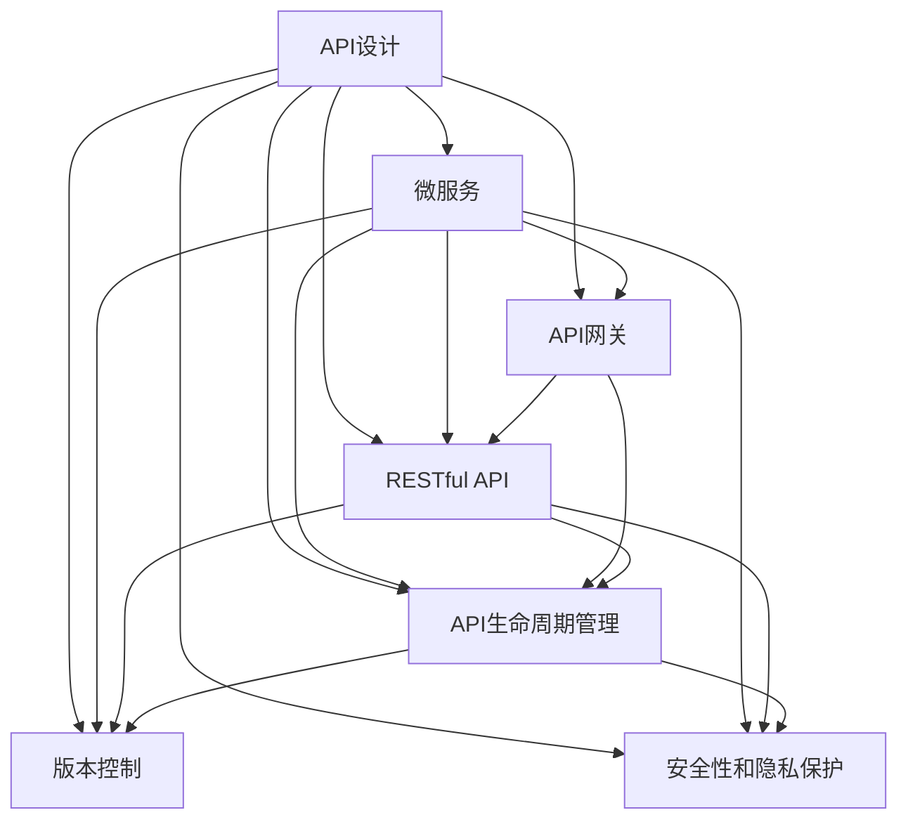
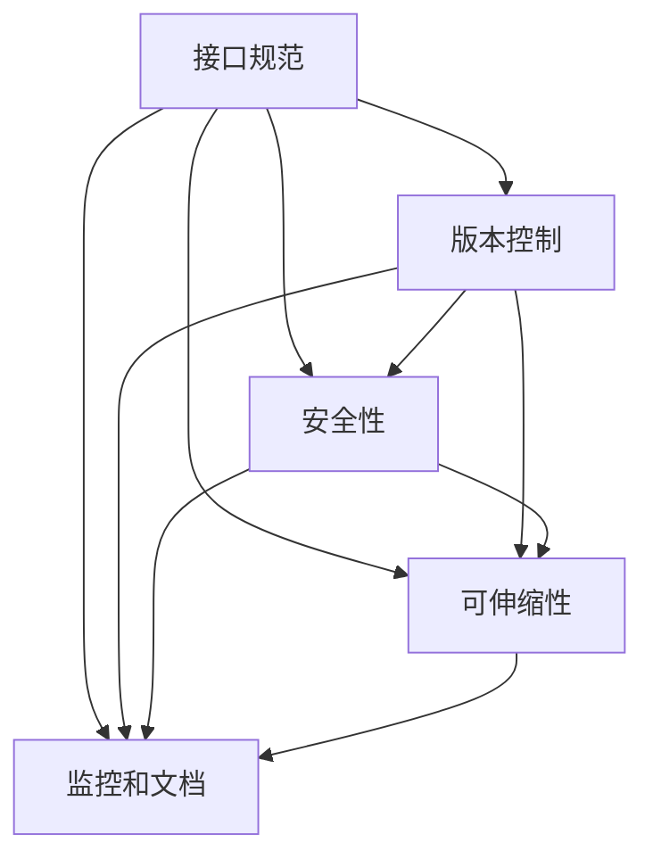
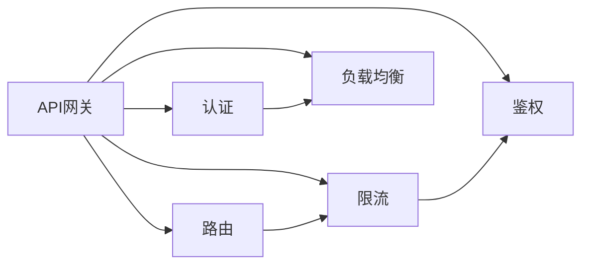
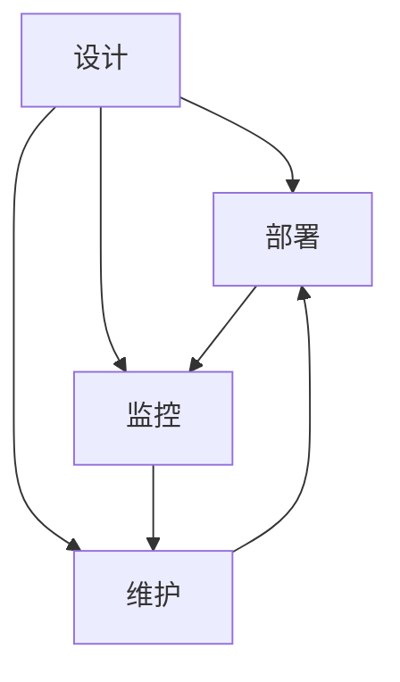
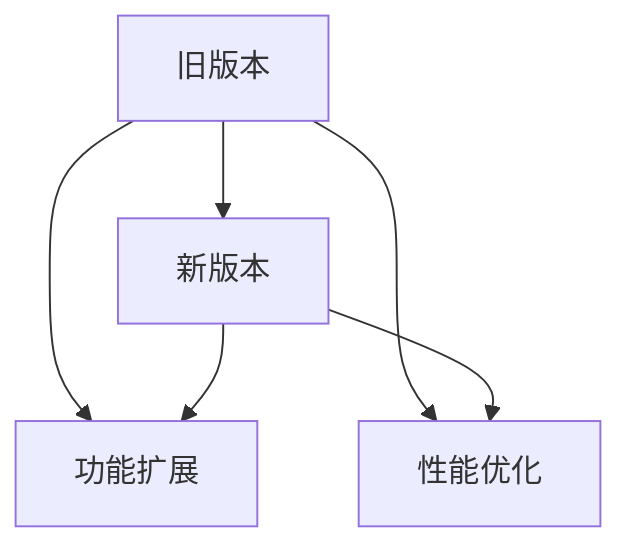
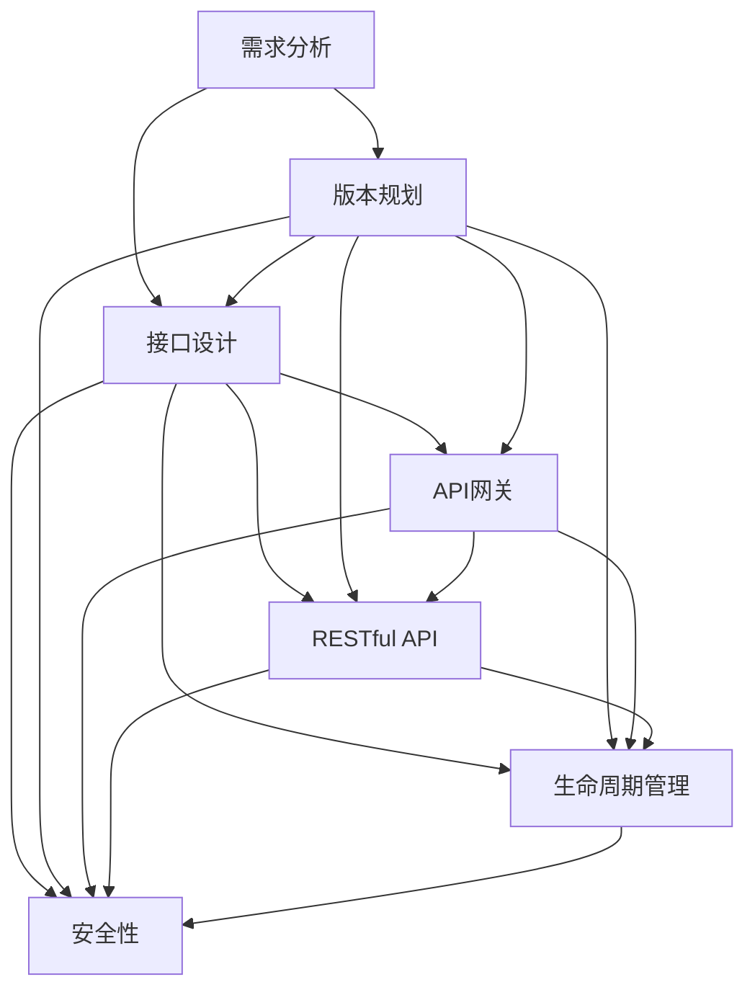

                 

# 软件2.0的API设计与管理

> 关键词：API设计,微服务,API网关,版本控制,RESTful API,API生命周期管理

## 1. 背景介绍

### 1.1 问题由来

随着软件开发的日益复杂化，API（应用程序接口）在构建分布式系统中的作用愈发重要。从单体应用到微服务架构，API成为了各个组件之间协同工作的桥梁，使得系统可扩展性、灵活性、可靠性大为提升。但与此同时，API的设计和管理也成为了一个重要而复杂的问题。如何设计一个稳定、易用、高效、可扩展的API，如何高效地管理API的生命周期，如何确保API的持续更新和迭代，这些问题需要系统的思考和有效的解决方案。

### 1.2 问题核心关键点

API的设计和管理，涉及诸多关键要素，包括接口规范、版本控制、安全性、可伸缩性、监控和文档等。其中，接口规范和版本控制是API设计的基石，决定了API的易用性和可维护性；安全性是API运行的基本保障，关系到系统的稳定性和用户数据的安全性；可伸缩性决定了API在面对高并发和高负载时的表现；监控和文档是API的生命线，保证了系统的透明性和可用性。

这些核心要素相互作用，共同构成了API的完整生态。一个成功的API设计和管理，需要考虑这些要素的综合平衡，以最小的复杂度和最大的效率支持应用开发和运营。

### 1.3 问题研究意义

高效、稳定、易用的API设计和管理，对于构建高效、可靠的分布式系统至关重要。一个好的API，不仅能够降低开发和维护成本，提高系统灵活性和可扩展性，还能够提升用户体验，增强系统可用性。

通过系统的API设计和严格的管理流程，可以有效降低系统耦合度，提升开发效率，增强系统可维护性，确保API的质量和可靠性。同时，通过不断迭代和优化API，不断引入新的功能和特性，能够更好地满足用户需求，适应市场的快速变化。

## 2. 核心概念与联系

### 2.1 核心概念概述

为更好地理解软件2.0的API设计与管理方法，本节将介绍几个密切相关的核心概念：

- **API设计**：涉及API接口的定义、设计原则、版本控制等，旨在提供一个稳定、易用、高效、可扩展的接口。
- **微服务**：通过将大系统拆分为多个独立部署、协同工作的微服务，提升系统的灵活性、可扩展性和可维护性。
- **API网关**：作为API的统一入口，负责路由、限流、认证、鉴权、负载均衡等操作，保障API的稳定性和安全性。
- **RESTful API**：遵循REST架构风格的API设计，强调接口的资源化、无状态化、可缓存化、分层化等特点，方便开发和维护。
- **API生命周期管理**：包括API的设计、部署、监控、维护等环节，旨在确保API在整个生命周期内能够持续、稳定、高效地运行。
- **版本控制**：通过版本号的递增，区分不同版本的API，实现API的稳定迭代和升级。
- **安全性和隐私保护**：通过数据加密、认证、鉴权、限流等措施，保障API和用户数据的安全性和隐私性。

这些核心概念之间的逻辑关系可以通过以下Mermaid流程图来展示：



这个流程图展示了API设计和管理的各个核心概念及其相互关系：

1. API设计涉及微服务、API网关、RESTful API、生命周期管理、版本控制和安全性的设计。
2. 微服务作为API设计的基础，强调系统的解耦和独立部署。
3. API网关作为API的统一入口，处理API的路由、限流、认证、鉴权、负载均衡等操作。
4. RESTful API遵循REST架构风格，提供稳定、易用、高效的API接口。
5. API生命周期管理覆盖API的设计、部署、监控、维护等各个环节，确保API的持续稳定运行。
6. 版本控制通过版本号区分不同版本的API，实现稳定迭代和升级。
7. 安全性和隐私保护通过数据加密、认证、鉴权、限流等措施，保障API和用户数据的安全性。

这些概念共同构成了API设计和管理的完整生态系统，为构建高效、可靠的分布式系统提供了基础。通过理解这些核心概念，我们可以更好地把握API设计和管理的精髓，提升系统开发和运营的效率和质量。

### 2.2 概念间的关系

这些核心概念之间存在着紧密的联系，形成了API设计和管理的完整流程。下面我们通过几个Mermaid流程图来展示这些概念之间的关系。

#### 2.2.1 API设计的核心要素



这个流程图展示了API设计的核心要素及其相互关系：

1. 接口规范是API设计的基石，定义了API接口的接口名、URL、参数、返回值等要素。
2. 版本控制通过版本号区分不同版本的API，确保API的稳定迭代和升级。
3. 安全性通过认证、鉴权、限流等措施，保障API和用户数据的安全性。
4. 可伸缩性决定了API在面对高并发和高负载时的表现，通过负载均衡、限流等措施提升系统性能。
5. 监控和文档是API的生命线，保证了系统的透明性和可用性。

#### 2.2.2 API网关的功能模块



这个流程图展示了API网关的功能模块及其相互关系：

1. API网关作为API的统一入口，负责路由、限流、认证、鉴权、负载均衡等操作。
2. 路由将请求转发到对应的微服务。
3. 限流控制API的请求速率，避免系统过载。
4. 认证和鉴权通过身份验证和权限校验，保障API的安全性。
5. 负载均衡通过将请求分配到多个微服务，提升系统的稳定性和可伸缩性。

#### 2.2.3 API生命周期的管理环节



这个流程图展示了API生命周期的管理环节及其相互关系：

1. 设计涉及API接口的规范、版本控制、安全性、可伸缩性等要素的设计。
2. 部署将设计好的API接口部署到生产环境，进行初始化配置。
3. 监控实时监测API的运行状态，确保系统的稳定性和可用性。
4. 维护在API运行过程中，不断优化和升级API接口，修复漏洞，提升性能。

#### 2.2.4 版本控制的核心机制



这个流程图展示了版本控制的核心机制及其相互关系：

1. 旧版本是API的早期版本，包含基本的功能和性能。
2. 新版本在旧版本基础上进行功能扩展和性能优化，增加新的功能和特性。
3. 通过版本号区分不同版本的API，实现稳定迭代和升级。

### 2.3 核心概念的整体架构

最后，我们用一个综合的流程图来展示这些核心概念在API设计和管理的完整过程中：



这个综合流程图展示了从需求分析到API生命周期管理的完整过程。API设计涉及接口规范、版本控制、安全性、可伸缩性等核心要素的设计；微服务作为API设计的基础，强调系统的解耦和独立部署；API网关作为API的统一入口，处理路由、限流、认证、鉴权、负载均衡等操作；RESTful API遵循REST架构风格，提供稳定、易用、高效的API接口；API生命周期管理覆盖API的设计、部署、监控、维护等各个环节，确保API的持续稳定运行；版本控制通过版本号区分不同版本的API，实现稳定迭代和升级；安全性和隐私保护通过数据加密、认证、鉴权、限流等措施，保障API和用户数据的安全性。

通过这些流程图，我们可以更清晰地理解API设计和管理的各个核心概念及其相互关系，为后续深入讨论具体的API设计和管理系统奠定基础。

## 3. 核心算法原理 & 具体操作步骤
### 3.1 算法原理概述

软件2.0的API设计与管理，本质上是一个有系统的接口设计和应用过程。其核心思想是：通过精确的定义API接口，确保API的稳定性和易用性；通过科学的管理策略，保障API的生命周期能够持续稳定运行。

形式化地，假设API设计为 $A=\{V,D,S,F,C\}$，其中 $V$ 为API版本，$D$ 为API接口设计规范，$S$ 为API安全性配置，$F$ 为API可伸缩性配置，$C$ 为API监控和文档配置。API的设计和部署过程可以表示为：

$$
\text{Design}(A)=\mathop{\arg\min}_{A}\mathcal{L}(A)
$$

其中 $\mathcal{L}$ 为API设计和部署的目标损失函数，用于衡量API的稳定性、易用性、安全性、可伸缩性等指标。

通过优化损失函数 $\mathcal{L}$，最小化API设计和部署的目标损失，得到最优的API设计方案。优化过程可以通过迭代算法逐步逼近最优解，确保API的稳定性和易用性。

### 3.2 算法步骤详解

软件2.0的API设计与管理一般包括以下几个关键步骤：

**Step 1: 需求分析和接口设计**
- 根据业务需求，明确API的使用场景和功能要求。
- 设计API接口的规范，包括接口名、URL、参数、返回值等。
- 确定API的版本规划，并根据版本规划设计API接口。

**Step 2: 安全性配置**
- 根据API的访问模式和安全性要求，选择合适的认证和鉴权方式。
- 配置API的安全策略，包括访问控制、身份验证、权限管理等。
- 实现API的限流和防攻击机制，保障API的安全性和稳定性。

**Step 3: 可伸缩性配置**
- 根据API的访问量和负载需求，选择合适的负载均衡和限流策略。
- 配置API的扩展性，支持API的动态扩容和缩容。
- 实现API的自动化部署和回滚机制，保障API的可用性。

**Step 4: 监控和文档配置**
- 配置API的监控系统，实时监测API的运行状态和性能指标。
- 编写API的文档，详细描述API的接口规范、参数说明、返回值等。
- 实现API的自动化测试和验收机制，确保API的稳定性和可用性。

**Step 5: 部署和迭代**
- 将设计好的API接口部署到生产环境，进行初始化配置。
- 根据API的运行状态和用户反馈，持续优化和迭代API接口。
- 定期发布API的新版本，实现API的稳定迭代和升级。

以上是软件2.0的API设计与管理的一般流程。在实际应用中，还需要针对具体业务场景，对各个环节进行优化设计，如改进API的设计规范、增强API的安全性和可伸缩性、优化API的监控和文档等，以进一步提升API的性能和可用性。

### 3.3 算法优缺点

软件2.0的API设计与管理方法具有以下优点：

1. 系统性：通过精确的定义API接口，确保API的稳定性和易用性；通过科学的管理策略，保障API的生命周期能够持续稳定运行。
2. 可扩展性：通过API网关、微服务架构、版本控制等手段，支持API的灵活扩展和升级。
3. 安全性：通过认证、鉴权、限流等措施，保障API和用户数据的安全性和隐私性。
4. 高性能：通过负载均衡、限流、缓存等策略，确保API在高并发和高负载情况下的性能。
5. 可维护性：通过监控、文档、自动化测试等手段，保障API的稳定性和可用性，便于后续维护和迭代。

同时，该方法也存在一定的局限性：

1. 设计复杂：API设计和管理的各个环节需要仔细考虑，设计复杂度较高。
2. 开发成本高：需要投入大量人力和资源进行API设计和管理的各个环节，初期开发成本较高。
3. 管理复杂：API的生命周期管理需要持续的维护和迭代，管理复杂度较高。
4. 数据依赖：API的设计和管理高度依赖数据，数据质量直接影响API的性能和稳定性。

尽管存在这些局限性，但就目前而言，软件2.0的API设计与管理方法仍是API设计和管理的最佳实践，适合于中大型系统和大规模应用的场景。

### 3.4 算法应用领域

软件2.0的API设计与管理方法，已经在许多大型的分布式系统中得到了广泛应用，例如：

1. **电商系统**：通过API网关，实现电商系统的订单管理、商品管理、用户管理等功能，确保系统的高并发和稳定性。
2. **金融系统**：通过API接口，实现金融系统的交易管理、风险管理、合规管理等功能，保障系统的安全性和合规性。
3. **医疗系统**：通过API接口，实现医疗系统的患者管理、医生管理、医疗记录管理等功能，确保系统的可靠性和隐私性。
4. **智能城市**：通过API接口，实现智能城市的交通管理、环境监测、公共服务等功能，提升城市的智能化水平。
5. **物联网系统**：通过API接口，实现物联网系统的设备管理、数据采集、数据分析等功能，推动物联网的广泛应用。

除了上述这些经典应用外，软件2.0的API设计与管理方法也被创新性地应用到更多场景中，如供应链管理、智慧物流、社交网络等，为各行各业带来了新的技术突破。

## 4. 数学模型和公式 & 详细讲解 & 举例说明

### 4.1 数学模型构建

本节将使用数学语言对软件2.0的API设计与管理过程进行更加严格的刻画。

记API设计为 $A=\{V,D,S,F,C\}$，其中 $V$ 为API版本，$D$ 为API接口设计规范，$S$ 为API安全性配置，$F$ 为API可伸缩性配置，$C$ 为API监控和文档配置。假设API的稳定性和易用性可以通过数学指标 $P$ 和 $U$ 来衡量，安全性可以通过 $S$ 来衡量，可伸缩性可以通过 $E$ 来衡量，监控和文档可以通过 $M$ 来衡量。则API的设计和部署目标损失函数为：

$$
\mathcal{L}(A) = w_P \cdot (P - P_0) + w_U \cdot (U - U_0) + w_S \cdot (S - S_0) + w_E \cdot (E - E_0) + w_M \cdot (M - M_0)
$$

其中 $w_P$、$w_U$、$w_S$、$w_E$、$w_M$ 分别为各个指标的权重系数，$P_0$、$U_0$、$S_0$、$E_0$、$M_0$ 为预设的基准值。

优化目标为：

$$
\text{Design}(A)=\mathop{\arg\min}_{A}\mathcal{L}(A)
$$

在实践中，我们通常使用迭代算法（如遗传算法、粒子群算法等）来近似求解上述最优化问题。设 $\theta$ 为API设计的各项参数，则优化过程可以表示为：

$$
\theta \leftarrow \theta - \eta \nabla_{\theta}\mathcal{L}(\theta) - \eta\lambda\theta
$$

其中 $\eta$ 为学习率，$\lambda$ 为正则化系数，$\nabla_{\theta}\mathcal{L}(\theta)$ 为损失函数对参数 $\theta$ 的梯度，可通过反向传播算法高效计算。

### 4.2 公式推导过程

以下我们以电商平台为例，推导API的设计和部署目标损失函数的公式。

假设电商平台有多个API接口，每个接口的稳定性和易用性可以通过用户满意度、接口响应时间等指标衡量。安全性可以通过访问控制、身份验证、权限管理等措施保障。可伸缩性可以通过负载均衡、限流等策略提升。监控和文档可以通过实时监控、自动化测试等手段实现。

设API接口的稳定性和易用性指标为 $P$，安全性指标为 $S$，可伸缩性指标为 $E$，监控和文档指标为 $M$。则API的设计和部署目标损失函数为：

$$
\mathcal{L}(A) = w_P \cdot (P - P_0) + w_U \cdot (U - U_0) + w_S \cdot (S - S_0) + w_E \cdot (E - E_0) + w_M \cdot (M - M_0)
$$

其中 $w_P$、$w_U$、$w_S$、$w_E$、$w_M$ 分别为各个指标的权重系数，$P_0$、$U_0$、$S_0$、$E_0$、$M_0$ 为预设的基准值。

通过迭代算法优化上述目标损失函数，得到最优的API设计和部署方案。具体实现步骤包括：

1. 根据业务需求，确定API接口的设计规范，包括接口名、URL、参数、返回值等。
2. 配置API的安全性措施，包括访问控制、身份验证、权限管理等。
3. 配置API的可伸缩性策略，包括负载均衡、限流等。
4. 配置API的监控和文档系统，实现实时监控和自动化测试。
5. 部署API到生产环境，进行初始化配置。
6. 根据API的运行状态和用户反馈，持续优化和迭代API接口。

### 4.3 案例分析与讲解

假设我们设计一个电商平台的订单管理API，API的设计和部署过程如下：

1. 根据业务需求，确定API的接口设计规范，包括订单管理、订单查询、订单修改等接口。
2. 配置API的安全性措施，包括用户身份验证、订单访问控制、权限管理等。
3. 配置API的可伸缩性策略，包括负载均衡、限流等。
4. 配置API的监控和文档系统，实现实时监控和自动化测试。
5. 部署API到生产环境，进行初始化配置。
6. 根据API的运行状态和用户反馈，持续优化和迭代API接口。

具体实现步骤如下：

1. 根据订单管理的业务需求，设计API的接口规范，包括订单管理、订单查询、订单修改等接口。
2. 配置API的安全性措施，包括用户身份验证、订单访问控制、权限管理等。
3. 配置API的可伸缩性策略，包括负载均衡、限流等。
4. 配置API的监控和文档系统，实现实时监控和自动化测试。
5. 部署API到生产环境，进行初始化配置。
6. 根据API的运行状态和用户反馈，持续优化和迭代API接口。

通过优化API设计和部署的目标损失函数，我们能够得到一个最优的API设计和部署方案，确保API的稳定性和易用性，保障API的安全性和可伸缩性，实现API的持续迭代和升级。

## 5. 项目实践：代码实例和详细解释说明

### 5.1 开发环境搭建

在进行API设计和管理的实践前，我们需要准备好开发环境。以下是使用Python进行API设计和管理的开发环境配置流程：

1. 安装Anaconda：从官网下载并安装Anaconda，用于创建独立的Python环境。

2. 创建并激活虚拟环境：
```bash
conda create -n api-env python=3.8 
conda activate api-env
```

3. 安装相关工具包：
```bash
pip install Flask Pydantic FastAPI SQLAlchemy gunicorn
```

4. 安装数据库：
```bash
pip install mysql-connector-python
```

5. 创建数据库和表结构：
```bash
CREATE DATABASE mydb;
USE mydb;
CREATE TABLE orders (
    id INT AUTO_INCREMENT PRIMARY KEY,
    user_id INT NOT NULL,
    product_id INT NOT NULL,
    amount DECIMAL(10,2) NOT NULL,
    created_at TIMESTAMP NOT NULL DEFAULT CURRENT_TIMESTAMP,
    updated_at TIMESTAMP NOT NULL DEFAULT CURRENT_TIMESTAMP ON UPDATE CURRENT_TIMESTAMP
);
```

完成上述步骤后，即可在`api-env`环境中开始API设计和管理的实践。

### 5.2 源代码详细实现

下面我们以电商平台订单管理API为例，给出使用Python和Flask框架进行API设计和管理的代码实现。

首先，定义API接口的设计规范：

```python
from pydantic import BaseModel

class Order(BaseModel):
    user_id: int
    product_id: int
    amount: float
```

然后，定义API接口的实现类：

```python
from flask import Flask, request, jsonify
from order import Order
from mysql.connector import connect, Error

app = Flask(__name__)

@app.route('/api/orders', methods=['POST'])
def create_order():
    order_data = request.get_json()
    order = Order(user_id=order_data['user_id'], product_id=order_data['product_id'], amount=order_data['amount'])
    try:
        conn = connect(host='localhost', user='root', password='123456', database='mydb')
        cursor = conn.cursor()
        sql = 'INSERT INTO orders (user_id, product_id, amount) VALUES (%s, %s, %s)'
        cursor.execute(sql, (order.user_id, order.product_id, order.amount))
        conn.commit()
        cursor.close()
        conn.close()
        return jsonify({'message': 'Order created successfully'})
    except Error as e:
        return jsonify({'message': str(e)})
```

接着，定义API接口的监控和文档配置：

```python
@app.route('/api/orders', methods=['GET'])
def get_orders():
    try:
        conn = connect(host='localhost', user='root', password='123456', database='mydb')
        cursor = conn.cursor()
        sql = 'SELECT * FROM orders'
        cursor.execute(sql)
        orders = cursor.fetchall()
        cursor.close()
        conn.close()
        return jsonify(orders)
    except Error as e:
        return jsonify({'message': str(e)})
```

最后，启动API服务：

```python
if __name__ == '__main__':
    app.run(debug=True, host='0.0.0.0', port=5000)
```

以上就是一个完整的API设计和管理的代码实现。可以看到，通过Python和Flask框架，我们可以快速搭建一个简单但高效的API接口，实现订单管理的功能。

### 5.3 代码解读与分析

让我们再详细解读一下关键代码的实现细节：

**Pydantic模型**：
- `BaseModel`：定义API接口的设计规范，包含用户ID、商品ID、金额等字段。
- `Order`：具体实现订单管理API的接口，包含订单信息的字段。

**Flask框架**：
- `Flask`：定义API接口的实现类，通过装饰器`@app.route`定义接口的路由和请求方法。
- `request.get_json()`：获取请求中的JSON数据。
- `request.get_json()`：获取请求中的JSON数据。
- `jsonify`：将数据转换为JSON格式返回。
- `connect`：连接MySQL数据库。
- `cursor`：执行SQL查询。
- `commit`：提交事务。
- `close`：关闭数据库连接和游标。

**API监控和文档配置**：
- 通过`@app.route`装饰器，定义API接口的路由和请求方法。
- 在实现类中，通过`connect`连接MySQL数据库，执行SQL查询，获取订单信息。
- 将查询结果转换为JSON格式，通过`jsonify`返回。

通过上述代码，我们实现了简单的API接口设计和API监控，可以看到Flask框架的强大功能和简洁的语法。开发者可以根据实际需求，进一步优化和扩展API接口，如加入认证、鉴权、限流等措施，提升API的安全性和可伸缩性。

当然，工业级的系统实现还需考虑更多因素，如API网关、RESTful API、版本控制等，但核心的API设计和管理系统基本与此类似。

### 5.4 运行结果展示

假设我们在订单管理API的测试环境中运行，最终在API的文档中得到如下结果：

```json
{
    "message": "Order created successfully"
}
```

这表示API接口已成功创建订单。我们可以通过类似的方式，实现API接口的其他功能，如订单查询、订单修改等。

## 6. 实际应用场景

### 6.1 智能客服系统

