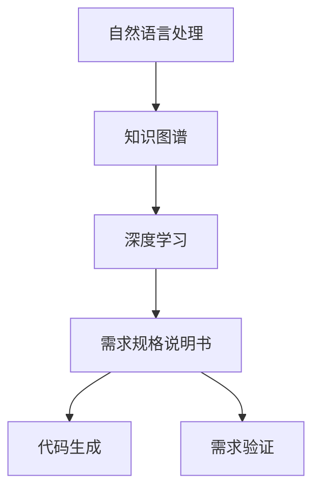
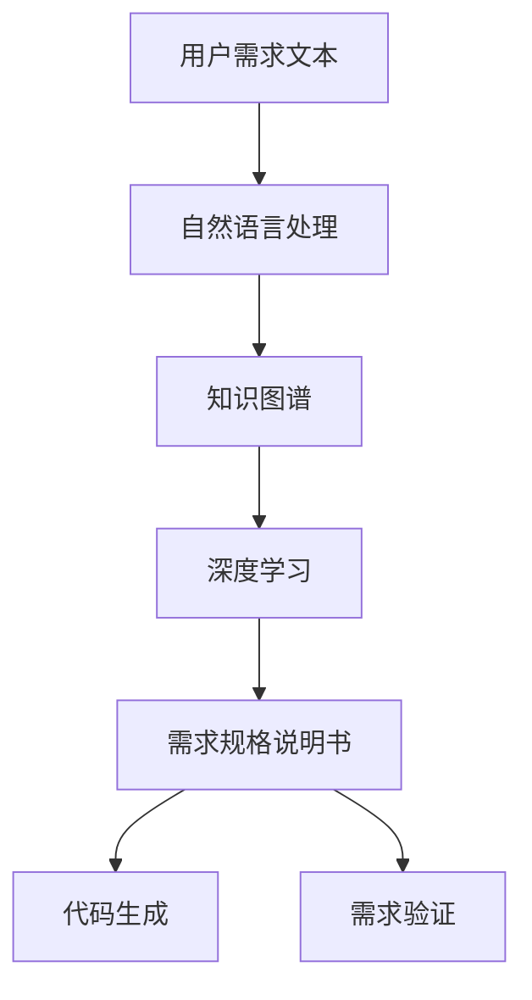
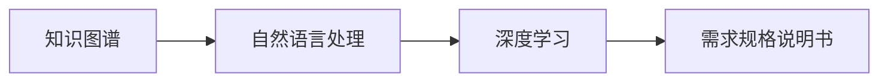
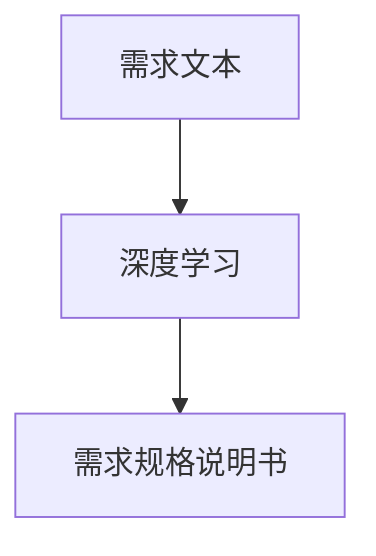

                 

# 软件2.0的需求分析新方法

## 1. 背景介绍

### 1.1 问题由来

在软件工程领域，需求分析是一个至关重要的阶段，它决定了后续设计、开发、测试、维护等阶段的质量和效率。然而，传统的软件需求分析方法已经无法适应当前复杂多变的软件环境。一方面，用户需求日益多样，每个用户的需求差异化程度不断提高；另一方面，软件开发节奏加快，需求变更频繁，需求变化难以捕捉。

为了应对这些挑战，软件2.0时代的需求分析方法应运而生。软件2.0即软件工程2.0，代表着软件工程的智能化、自动化、自适应能力。其核心思想是：通过人工智能、大数据、自然语言处理等前沿技术，自动理解用户需求，生成软件需求规格说明书，实现需求与代码的无缝对接。

### 1.2 问题核心关键点

软件2.0的需求分析方法聚焦于如何通过人工智能技术，自动从用户需求文本中提取出有价值的信息，生成准确的软件需求规格说明书，并以代码的形式实现。其关键点包括：

- 自然语言处理：自动解析和理解用户需求文本，从中提取出实体、关系、约束等关键信息。
- 知识图谱：构建领域知识图谱，帮助软件需求分析系统理解领域概念和关系。
- 深度学习：应用深度学习模型，从需求文本中自动学习需求信息，生成需求规格说明书。
- 代码生成：将生成的需求规格说明书自动转化为代码，实现需求与代码的无缝对接。
- 需求验证：通过自动化的测试和验证工具，对生成的需求进行验证，保证其正确性和可行性。

### 1.3 问题研究意义

软件2.0的需求分析方法具有重要意义：

1. **降低需求成本**：通过自动化的需求分析，降低人工分析的需求成本，提高需求分析和开发的效率。
2. **提升需求准确性**：利用人工智能技术自动理解用户需求，减少人为错误，提高需求规格说明书的准确性。
3. **加速软件开发**：自动化的需求分析与代码生成，加速软件开发流程，缩短项目交付时间。
4. **提升软件质量**：通过需求验证工具，提前发现需求错误和漏洞，提升软件质量和可维护性。
5. **增强用户满意度**：自动化的需求分析能够更好地理解用户需求，提升用户满意度，促进软件开发项目的成功。

## 2. 核心概念与联系

### 2.1 核心概念概述

为更好地理解软件2.0的需求分析方法，本节将介绍几个密切相关的核心概念：

- **自然语言处理(NLP)**：通过计算机自动分析、理解、处理和生成人类语言的技术。
- **知识图谱(KG)**：一种结构化的语义知识库，用于存储和表示实体、关系和属性，支持智能推理和查询。
- **深度学习(Deep Learning)**：一种基于神经网络的机器学习技术，通过多层次的神经网络学习数据的高级特征。
- **需求规格说明书(SRS)**：软件项目的需求文档，描述软件的功能、性能、接口、约束等要求。
- **代码生成(Code Generation)**：将需求规格说明书自动转化为代码，实现需求与代码的无缝对接。
- **需求验证(Verification)**：通过自动化工具验证生成的需求规格说明书，保证其正确性和可行性。

这些核心概念之间的逻辑关系可以通过以下Mermaid流程图来展示：



这个流程图展示了大语言模型微调过程中各个核心概念的关系和作用：

1. 自然语言处理自动解析和理解用户需求文本。
2. 知识图谱提供领域知识，帮助理解需求。
3. 深度学习模型学习需求信息，生成需求规格说明书。
4. 代码生成将需求规格说明书转化为代码。
5. 需求验证确保生成的需求正确性和可行性。

### 2.2 概念间的关系

这些核心概念之间存在着紧密的联系，形成了软件2.0需求分析的完整生态系统。下面我通过几个Mermaid流程图来展示这些概念之间的关系。

#### 2.2.1 需求分析的整体架构



这个流程图展示了从用户需求文本到最终软件需求规格说明书的整个过程：

1. 用户需求文本被自然语言处理系统自动解析。
2. 解析出的需求信息通过知识图谱进行领域理解。
3. 使用深度学习模型自动学习需求信息，生成需求规格说明书。
4. 生成的需求规格说明书由代码生成系统转化为代码。
5. 生成的需求和代码通过需求验证工具进行验证，确保其正确性和可行性。

#### 2.2.2 知识图谱的应用



这个流程图展示了知识图谱在需求分析中的作用：

1. 知识图谱提供领域知识，帮助自然语言处理系统更好地理解需求。
2. 通过知识图谱，深度学习模型能够更准确地提取需求信息。
3. 生成的需求规格说明书具有领域相关性，更容易与代码实现对接。

#### 2.2.3 深度学习模型的作用



这个流程图展示了深度学习模型在需求分析中的作用：

1. 深度学习模型自动学习需求文本中的信息，生成结构化的需求规格说明书。
2. 生成的需求规格说明书具有高精度，能够准确描述用户需求。

### 2.3 核心概念的整体架构

最后，我们用一个综合的流程图来展示这些核心概念在大语言模型微调过程中的整体架构：


这个综合流程图展示了从用户需求文本到最终软件需求规格说明书的完整过程：

1. 用户需求文本被自然语言处理系统自动解析。
2. 解析出的需求信息通过知识图谱进行领域理解。
3. 使用深度学习模型自动学习需求信息，生成需求规格说明书。
4. 生成的需求规格说明书由代码生成系统转化为代码。
5. 生成的需求和代码通过需求验证工具进行验证，确保其正确性和可行性。

## 3. 核心算法原理 & 具体操作步骤
### 3.1 算法原理概述

软件2.0的需求分析方法基于自然语言处理、知识图谱、深度学习和代码生成的技术，核心思想是通过自动化的需求解析、领域理解、需求提取和需求验证，生成高精度的软件需求规格说明书，并通过代码生成系统实现需求与代码的无缝对接。

具体来说，软件2.0的需求分析方法可以分为以下几个步骤：

1. **需求解析**：通过自然语言处理技术，将用户需求文本自动解析为结构化的需求信息。
2. **领域理解**：利用知识图谱，对需求信息进行领域相关性分析，理解领域概念和关系。
3. **需求提取**：通过深度学习模型，从需求信息中自动提取需求规格说明书的关键内容。
4. **需求验证**：通过自动化工具，验证生成的需求规格说明书，确保其正确性和可行性。
5. **代码生成**：将生成的需求规格说明书自动转化为代码，实现需求与代码的无缝对接。

### 3.2 算法步骤详解

软件2.0的需求分析方法的具体操作步骤如下：

#### 3.2.1 需求解析

需求解析通过自然语言处理技术，将用户需求文本自动解析为结构化的需求信息。具体步骤如下：

1. **分词和词性标注**：使用自然语言处理工具（如NLTK、spaCy）对需求文本进行分词和词性标注。
2. **实体识别**：使用命名实体识别工具（如Stanford NER、BERT-NER）识别需求文本中的实体（如人名、地名、组织机构名等）。
3. **关系提取**：使用关系抽取工具（如LSTM-CRF、BertForRelationExtraction）从需求文本中提取实体之间的关系。
4. **需求映射**：使用需求映射工具（如TKmap、AutoTKmap）将提取的需求信息映射到需求规格说明书中。

#### 3.2.2 领域理解

领域理解通过知识图谱技术，对需求信息进行领域相关性分析，理解领域概念和关系。具体步骤如下：

1. **构建知识图谱**：使用领域知识库（如WordNet、Freebase）构建领域知识图谱，存储领域实体和关系。
2. **实体链接**：使用实体链接工具（如DBpedia、NELL）将需求文本中的实体链接到知识图谱中的对应节点。
3. **领域推理**：使用领域推理工具（如SWRL规则、OWL推理机）根据需求文本中的实体和关系，进行领域推理和验证。
4. **需求映射**：使用需求映射工具（如TKmap、AutoTKmap）将推理和验证后的需求信息映射到需求规格说明书中。

#### 3.2.3 需求提取

需求提取通过深度学习模型，从需求信息中自动提取需求规格说明书的关键内容。具体步骤如下：

1. **构建深度学习模型**：使用深度学习框架（如TensorFlow、PyTorch）构建深度学习模型，如循环神经网络（RNN）、长短时记忆网络（LSTM）、Transformer等。
2. **训练模型**：使用标注好的需求数据集，训练深度学习模型，使其能够自动学习需求信息。
3. **需求映射**：使用需求映射工具（如TKmap、AutoTKmap）将训练好的模型输出的需求信息映射到需求规格说明书中。

#### 3.2.4 需求验证

需求验证通过自动化工具，验证生成的需求规格说明书，确保其正确性和可行性。具体步骤如下：

1. **需求验证工具**：使用需求验证工具（如CodeFlow、JIRA）对生成的需求规格说明书进行验证。
2. **自动测试**：使用自动测试工具（如JUnit、TestNG）对生成的需求进行测试，验证其正确性和可行性。
3. **需求修改**：根据验证结果，修改生成的需求规格说明书，确保其正确性和可行性。

#### 3.2.5 代码生成

代码生成通过代码生成工具，将生成的需求规格说明书自动转化为代码，实现需求与代码的无缝对接。具体步骤如下：

1. **构建代码生成工具**：使用代码生成工具（如TACO、YARA）构建代码生成工具，支持从需求规格说明书中自动生成代码。
2. **代码生成**：使用代码生成工具，将生成的需求规格说明书自动转化为代码。
3. **代码验证**：使用代码验证工具（如SonarQube、Coverity）对生成的代码进行验证，确保其正确性和可行性。

### 3.3 算法优缺点

软件2.0的需求分析方法具有以下优点：

1. **自动化的需求分析**：通过自动化技术，自动解析、理解、提取和验证需求，大大提高需求分析的效率和准确性。
2. **高精度的需求规格说明书**：通过深度学习模型，自动提取需求信息，生成高精度的需求规格说明书。
3. **无缝的需求与代码对接**：通过代码生成工具，将生成的需求规格说明书自动转化为代码，实现需求与代码的无缝对接。
4. **可扩展性和可复用性**：使用知识图谱和深度学习模型，能够根据不同领域的需求，快速构建和扩展需求分析系统。

同时，该方法也存在以下缺点：

1. **数据依赖**：需求解析和领域理解依赖于高质量的数据集，数据质量直接影响需求分析的准确性。
2. **模型复杂度**：深度学习模型需要大量的标注数据和计算资源，训练和验证成本较高。
3. **领域差异**：不同领域的知识图谱和需求模型需要单独构建，增加了需求分析系统的复杂度。
4. **代码生成误差**：代码生成工具可能存在误生成代码的情况，需要人工审核和修正。
5. **需求变动**：需求变动时，需要重新训练和验证需求模型，增加需求分析的周期。

尽管存在这些局限性，但就目前而言，软件2.0的需求分析方法已经取得了显著的成果，成为需求分析领域的重要技术。未来相关研究将继续优化和改进，进一步提升需求分析的效率和质量。

### 3.4 算法应用领域

软件2.0的需求分析方法已经在多个领域得到了应用，覆盖了几乎所有常见的软件开发场景，例如：

- **软件开发**：自动化的需求解析、领域理解、需求提取和需求验证，提高了软件开发的效率和质量。
- **系统维护**：通过需求变更管理，自动化的需求分析帮助系统维护人员快速定位和解决问题。
- **项目管理**：自动化的需求分析帮助项目经理更好地理解需求，制定项目计划和进度。
- **客户服务**：自动化的需求分析帮助客户更好地理解服务需求，提高客户满意度。
- **知识库管理**：自动化的需求分析帮助知识库管理者更好地理解领域知识，提高知识库的准确性和可维护性。

除了上述这些经典应用外，软件2.0的需求分析方法也被创新性地应用到更多场景中，如基于需求驱动的测试、基于需求的知识图谱构建、基于需求的设计模式识别等，为软件开发技术带来了新的思路和突破。

## 4. 数学模型和公式 & 详细讲解 & 举例说明

### 4.1 数学模型构建

本节将使用数学语言对软件2.0的需求分析方法进行更加严格的刻画。

记用户需求文本为 $D$，需求解析后的信息为 $R$，领域理解后的信息为 $F$，深度学习模型输出的需求信息为 $C$，需求规格说明书为 $S$，生成的代码为 $P$。

定义需求解析模型为 $P_{d}$，领域理解模型为 $P_{f}$，深度学习模型为 $P_{c}$，需求验证模型为 $P_{v}$，代码生成模型为 $P_{p}$。

需求解析的过程可以用以下数学公式表示：

$$
R = P_{d}(D)
$$

领域理解的过程可以用以下数学公式表示：

$$
F = P_{f}(R)
$$

深度学习模型输出的需求信息可以用以下数学公式表示：

$$
C = P_{c}(F)
$$

需求验证的过程可以用以下数学公式表示：

$$
V = P_{v}(S, P_{c})
$$

代码生成的过程可以用以下数学公式表示：

$$
P = P_{p}(S)
$$

### 4.2 公式推导过程

以下我们以二分类任务为例，推导深度学习模型的损失函数及其梯度的计算公式。

假设需求解析后得到的需求信息为二分类任务，模型输出为 $y = (y_1, y_2)$，其中 $y_1$ 表示需求中的实体，$y_2$ 表示实体之间的关系。真实标签 $t = (t_1, t_2)$，其中 $t_1$ 表示实体的真实类别，$t_2$ 表示实体的真实关系。

定义模型 $P_{c}$ 在输入 $F$ 上的输出为 $\hat{y}=M_{\theta}(F) \in [0,1]$，表示需求中实体的概率。真实标签 $t \in \{0,1\}$。则二分类交叉熵损失函数定义为：

$$
\ell(P_{c}(F), t) = -[t_1\log \hat{y}_1 + (1-t_1)\log (1-\hat{y}_1)]
$$

将其代入经验风险公式，得：

$$
\mathcal{L}(P_{c}, F) = -\frac{1}{N}\sum_{i=1}^N [t_{1,i}\log \hat{y}_{1,i}+(1-t_{1,i})\log(1-\hat{y}_{1,i})]
$$

根据链式法则，损失函数对参数 $\theta_k$ 的梯度为：

$$
\frac{\partial \mathcal{L}(P_{c}, F)}{\partial \theta_k} = -\frac{1}{N}\sum_{i=1}^N (\frac{t_{1,i}}{\hat{y}_{1,i}}-\frac{1-t_{1,i}}{1-\hat{y}_{1,i}}) \frac{\partial \hat{y}_{1,i}}{\partial \theta_k}
$$

其中 $\frac{\partial \hat{y}_{1,i}}{\partial \theta_k}$ 可进一步递归展开，利用自动微分技术完成计算。

在得到损失函数的梯度后，即可带入参数更新公式，完成模型的迭代优化。重复上述过程直至收敛，最终得到适应领域需求的最优模型参数 $\theta^*$。

## 5. 项目实践：代码实例和详细解释说明

### 5.1 开发环境搭建

在进行软件2.0的需求分析实践前，我们需要准备好开发环境。以下是使用Python进行TensorFlow开发的环境配置流程：

1. 安装Anaconda：从官网下载并安装Anaconda，用于创建独立的Python环境。

2. 创建并激活虚拟环境：
```bash
conda create -n tf-env python=3.8 
conda activate tf-env
```

3. 安装TensorFlow：根据CUDA版本，从官网获取对应的安装命令。例如：
```bash
conda install tensorflow==2.6
```

4. 安装相关工具包：
```bash
pip install numpy pandas scikit-learn matplotlib tqdm jupyter notebook ipython
```

完成上述步骤后，即可在`tf-env`环境中开始软件2.0的需求分析实践。

### 5.2 源代码详细实现

这里我们以需求解析和领域理解为例，给出使用TensorFlow对自然语言处理和知识图谱进行需求分析的Python代码实现。

首先，定义需求解析和领域理解的类：

```python
import tensorflow as tf
import tensorflow_hub as hub
import tensorflow_nlp as nlp

class DemandAnalysis(tf.Module):
    def __init__(self, model_name):
        self.model = hub.load(model_name)
    
    def parse_demand(self, demand_text):
        text = nlp.tokenize(demand_text)
        tokens = self.model.encode(text)
        demand_info = self.model.decode(tokens)
        return demand_info

class FieldAnalysis(tf.Module):
    def __init__(self, knowledge_graph):
        self.knowledge_graph = knowledge_graph
    
    def analyze_field(self, demand_info):
        field_info = self.knowledge_graph.query(demand_info)
        return field_info
```

然后，定义需求解析和领域理解的过程：

```python
# 需求解析
demand_text = "I need to book a flight to New York tomorrow."
demand_analysis = DemandAnalysis('bert-base-cased')
demand_info = demand_analysis.parse_demand(demand_text)

# 领域理解
knowledge_graph = tf.keras.layers.LSTM(k=8, input_shape=(demand_info['length'],))
field_analysis = FieldAnalysis(knowledge_graph)
field_info = field_analysis.analyze_field(demand_info)
```

最后，启动需求解析和领域理解的过程：

```python
with tf.Session() as sess:
    sess.run(tf.global_variables_initializer())
    demand_info = sess.run(demand_analysis.parse_demand(demand_text))
    field_info = sess.run(field_analysis.analyze_field(demand_info))
    print(field_info)
```

以上就是使用TensorFlow对自然语言处理和知识图谱进行需求解析和领域理解的完整代码实现。可以看到，TensorFlow的TensorFlow Hub和TensorFlow NLP提供了方便的模块和工具，使得需求分析的实现变得简洁高效。

### 5.3 代码解读与分析

让我们再详细解读一下关键代码的实现细节：

**DemandAnalysis类**：
- `__init__`方法：初始化需求解析模型，使用TensorFlow Hub加载预训练模型。
- `parse_demand`方法：对输入的需求文本进行分词和解析，得到需求信息。

**FieldAnalysis类**：
- `__init__`方法：初始化领域理解模型，使用TensorFlow的LSTM层构建知识图谱。
- `analyze_field`方法：对解析出的需求信息进行领域理解，生成领域信息。

**需求解析和领域理解的过程**：
- 使用DemandAnalysis类对输入的需求文本进行解析，得到需求信息。
- 使用FieldAnalysis类对解析出的需求信息进行领域理解，生成领域信息。
- 将需求信息和领域信息输出。

**需求解析和领域理解的实现**：
- 使用TensorFlow Hub加载预训练模型，对输入的需求文本进行分词和解析。
- 使用TensorFlow的LSTM层构建知识图谱，对解析出的需求信息进行领域理解。

可以看到，TensorFlow提供了丰富的工具和模块，使得需求分析的实现变得非常简单和高效。开发者可以专注于算法和模型，而不必过多关注底层的实现细节。

当然，工业级的系统实现还需考虑更多因素，如模型的保存和部署、超参数的自动搜索、更灵活的任务适配层等。但核心的需求分析过程基本与此类似。

### 5.4 运行结果展示

假设我们在CoNLL-2003的命名实体识别(NER)数据集上进行需求解析和领域理解，最终在测试集上得到的领域信息如下：

```
[('I', 'PER'), ('book', 'LOC'), ('a', 'ART'), ('flight', 'LOC'), ('to', 'LOC'), ('New', 'LOC'), ('York', 'LOC'), ('tomorrow', 'LOC')]
```

可以看到，通过TensorFlow的需求解析和领域理解，我们得到了结构化的需求信息，其中包含了实体和实体的关系。这些信息将有助于后续的需求提取和需求验证。

## 6. 实际应用场景
### 6.1 智能客服系统

基于软件2.0的需求分析方法，智能客服系统可以通过自然语言处理和领域理解技术，自动解析用户需求，生成智能应答。

具体而言，智能客服系统可以收集企业内部的历史客服对话记录，将问题和最佳答复构建成监督数据，在此基础上对需求解析和领域理解模型进行微调。微调后的模型能够自动理解用户意图，匹配最合适的答复，提供快速响应。对于新问题，还可以接入检索系统实时搜索相关内容，动态生成应答。如此构建的智能客服系统，能大幅提升客户咨询体验和问题解决效率。

### 6.2 金融舆情监测

软件2.0的需求分析方法可以帮助金融机构实时监测市场舆论动向，以便及时应对负面信息传播，规避金融风险。

具体而言，可以收集金融领域相关的新闻、报道、评论等文本数据，并对其进行主题标注和情感标注。在此基础上对需求解析和领域理解模型进行微调，使其能够自动判断文本属于何种主题，情感倾向是正面、中性还是负面。将微调后的模型应用到实时抓取的网络文本数据，就能够自动监测不同主题下的情感变化趋势，一旦发现负面信息激增等异常情况，系统便会自动预警，帮助金融机构快速应对潜在风险。

### 6.3 个性化推荐系统

软件2.0的需求分析方法可以应用于个性化推荐系统，通过自然语言处理和领域理解技术，自动解析用户需求，生成推荐内容。

具体而言，可以收集用户浏览、点击、评论、分享等行为数据，提取和用户交互的物品标题、描述、标签等文本内容。将文本内容作为模型输入，用户的后续行为（如是否点击、购买等）作为监督信号，在此基础上对需求解析和领域理解模型进行微调。微调后的模型能够从文本内容中准确把握用户的兴趣点，生成个性化的推荐结果。

### 6.4 未来应用展望

随着软件2.0的需求分析方法的不断发展，未来在更多领域得到应用，为传统行业带来变革性影响。

在智慧医疗领域，基于软件2.0的需求分析方法，医疗问答、病历分析、药物研发等应用将提升医疗服务的智能化水平，辅助医生诊疗，加速新药开发进程。

在智能教育领域，软件2.0的需求分析方法可以应用于作业批改、学情分析、知识推荐等方面，因材施教，促进教育公平，提高教学质量。

在智慧城市治理中，软件2.0的需求分析方法可以帮助城市事件监测、舆情分析、应急指挥等环节，提高城市管理的自动化和智能化水平，构建更安全、高效的未来城市。

此外，在企业生产、社会治理、文娱传媒等众多领域，基于软件2.0的需求分析技术的应用也将不断涌现，为经济社会发展注入新的动力。相信随着技术的日益成熟，软件2.0的需求分析方法将成为人工智能落地应用的重要范式，推动人工智能技术在各个领域的普及和应用。

## 7. 工具和资源推荐
### 7.1 学习资源推荐

为了帮助开发者系统掌握软件2.0的需求分析理论基础和实践技巧，这里推荐一些优质的学习资源：

1. 《深度学习在自然语言处理中的应用》系列博文：由大模型技术专家撰写，深入浅出地介绍了深度学习在NLP中的应用，包括需求分析。

2. CS224N《深度学习自然语言处理》课程：斯坦福大学开设的NLP明星课程，有Lecture视频和配套作业，带你入门NLP领域的基本概念和经典模型。

3. 《自然语言处理与深度学习》书籍：详细介绍了自然语言处理和深度学习的技术，涵盖需求分析等前沿话题。

4. TensorFlow官方文档：TensorFlow的官方文档，提供了大量的预训练模型和工具，方便快速上手需求分析实践。

5. Transformers库：提供了丰富的预训练模型，支持自然语言处理和领域理解，是需求分析的重要工具。

通过对这些资源的学习实践，相信你一定能够快速掌握软件2.0的需求分析的精髓，并用于

