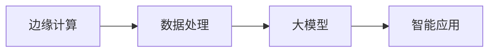
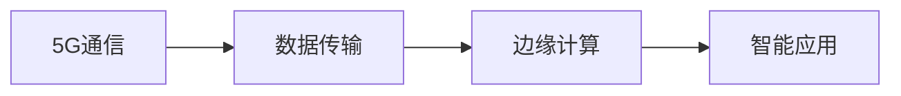

                 

# 边缘大模型:5G时代智能应用的新范式

> 关键词：边缘计算, 大模型, 5G, 智能应用, AIoT, 物联网

## 1. 背景介绍

### 1.1 问题由来
在5G时代的物联网(AIoT)时代，边缘计算正在成为未来智能应用的重要基础设施。传统的集中式云服务难以满足实时性和高带宽需求，而边缘计算能够将数据存储和处理下沉到终端设备，实现低延迟、高吞吐的本地处理。同时，随着深度学习等AI技术的发展，边缘设备上部署大规模大模型成为可能，为构建高性能、高智能的物联网应用提供了新的范式。

### 1.2 问题核心关键点
边缘大模型在智能应用中的核心关键点包括：

- 边缘计算环境：指靠近用户和数据源的设备，如手机、传感器、工业设备等，能够高效处理本地数据。
- 大模型：指在大规模数据上进行预训练的大型深度神经网络，如BERT、GPT等。
- 5G通信网络：指第五代移动通信网络，提供高带宽、低延迟、大连接能力，支持大规模数据的实时传输。
- 智能应用：指基于边缘计算和大模型的应用场景，如智能监控、无人驾驶、工业自动化等。
- 数据安全性：指保护边缘设备上的敏感数据，防止数据泄露和攻击。
- 边缘计算平台：指支持大模型部署和优化，能够高效处理边缘数据的软硬件平台。

这些关键点共同构成了边缘大模型的核心架构，为5G时代智能应用提供了新的技术思路和应用模式。

### 1.3 问题研究意义
研究边缘大模型及其在智能应用中的应用，对于推动AIoT技术发展、提升智能应用性能、加速产业数字化转型具有重要意义：

1. **降低带宽和时延**：边缘大模型可以在本地处理数据，减少数据传输带宽和时延，提升应用响应速度。
2. **提高数据隐私**：将数据处理和分析下沉到边缘设备，能够减少敏感数据上传，保护用户隐私。
3. **优化计算资源**：利用边缘计算的本地资源，避免云平台计算资源的浪费，降低计算成本。
4. **增强应用智能化**：通过在边缘设备上部署大模型，可以提升应用的智能化程度，实现更精准、更高效的智能决策。
5. **推动工业互联网发展**：边缘大模型能够支持实时数据处理和分析，促进工业互联网的快速部署和应用。

## 2. 核心概念与联系

### 2.1 核心概念概述

为更好地理解边缘大模型的核心架构和应用场景，本节将介绍几个密切相关的核心概念：

- **边缘计算**：指在靠近数据源的设备上进行数据处理和分析，以减少数据传输和降低延迟，实现本地化处理。
- **大模型**：指在大规模数据集上进行预训练的大型深度学习模型，如BERT、GPT等。
- **5G通信**：指第五代移动通信技术，提供高带宽、低延迟、大连接能力，支持大规模数据的实时传输。
- **AIoT智能应用**：指利用边缘计算和大模型技术，在物联网设备上实现高性能、高智能化的应用场景。
- **边缘计算平台**：指支持大模型部署和优化，能够高效处理边缘数据的软硬件平台。
- **数据隐私和安全**：指在边缘设备上保护数据隐私，防止数据泄露和攻击。

这些核心概念之间的逻辑关系可以通过以下Mermaid流程图来展示：


这个流程图展示了大模型在边缘计算和AIoT智能应用中的核心架构，即在边缘设备上通过5G通信网络，部署大模型进行数据处理，并提供安全隐私保障。

### 2.2 概念间的关系

这些核心概念之间存在着紧密的联系，形成了边缘大模型的完整生态系统。下面我通过几个Mermaid流程图来展示这些概念之间的关系。

#### 2.2.1 边缘计算与大模型的关系



这个流程图展示了大模型在边缘计算中的应用。边缘计算能够高效处理本地数据，利用大模型的强大预测和推理能力，提升智能应用的性能。

#### 2.2.2 5G通信与边缘计算的关系



这个流程图展示了5G通信在边缘计算中的应用。5G通信的高带宽、低延迟特性，使得边缘设备能够实时处理和分析大量数据，提升智能应用的响应速度。

#### 2.2.3 智能应用与大模型的关系


这个流程图展示了大模型在智能应用中的作用。通过在边缘设备上部署大模型，能够实现高性能、高智能化的预测和推理，推动智能应用的发展。

### 2.3 核心概念的整体架构

最后，我们用一个综合的流程图来展示这些核心概念在大模型应用中的整体架构：


这个综合流程图展示了从预训练到边缘计算，再到智能应用的完整过程。大规模数据集通过预训练得到大模型，然后在边缘计算平台上进行本地处理，通过5G通信网络实时传输数据，完成预测结果，并驱动业务逻辑执行，最终输出结果。

## 3. 核心算法原理 & 具体操作步骤
### 3.1 算法原理概述

边缘大模型的核心算法原理包括预训练、迁移学习、微调和模型优化。具体步骤如下：

1. **预训练**：在大规模无标签数据集上训练大模型，学习通用的语言和视觉特征。
2. **迁移学习**：在大规模预训练模型的基础上，通过微调或迁移学习，适配特定的智能应用场景。
3. **微调**：在边缘设备上，针对特定任务的数据集进行有监督微调，提升模型在该任务上的性能。
4. **模型优化**：在边缘计算平台上，通过硬件加速、分布式计算等优化技术，提升模型推理速度和资源效率。

### 3.2 算法步骤详解

边缘大模型的具体算法步骤包括以下几个关键环节：

1. **数据预处理**：收集和整理边缘设备上产生的大量数据，进行格式转换和归一化处理。
2. **模型加载**：将预训练的大模型加载到边缘计算平台上，准备进行本地推理和微调。
3. **数据微调**：在边缘设备上，针对特定任务的数据集进行有监督微调，更新模型参数以适应任务需求。
4. **模型优化**：使用硬件加速、分布式计算等技术，优化模型推理速度和资源利用率。
5. **模型评估和部署**：在实际应用场景中，对微调后的模型进行评估和部署，驱动业务逻辑执行。

### 3.3 算法优缺点

边缘大模型的优点包括：

- **低时延高带宽**：在边缘设备上进行本地推理，能够实时处理数据，减少延迟。
- **数据隐私保护**：本地化数据处理能够保护用户隐私，避免数据泄露风险。
- **计算资源优化**：利用本地资源进行模型推理，避免云平台计算资源的浪费，降低成本。
- **智能应用提升**：通过微调和迁移学习，提升模型在特定任务上的性能，实现高智能化应用。

其缺点包括：

- **资源限制**：边缘设备计算资源和存储空间有限，模型规模和复杂度受限。
- **模型更新难度**：模型更新和迁移学习过程复杂，需要高昂的计算和存储空间开销。
- **维护成本高**：边缘计算平台需要专门维护和升级，以适应新的模型和应用需求。

### 3.4 算法应用领域

边缘大模型在智能应用中的应用领域广泛，包括但不限于：

- **智能监控**：利用大模型进行视频分析和目标检测，实时监测环境变化，预警异常情况。
- **无人驾驶**：在车辆上部署大模型，实现实时路径规划和避障决策，提升驾驶安全性和舒适性。
- **工业自动化**：利用大模型进行设备状态监控和故障预测，优化生产流程和提高效率。
- **医疗诊断**：在医疗设备上部署大模型，实现快速准确的图像识别和诊断，辅助医生决策。
- **智能家居**：在智能家居设备上部署大模型，实现语音识别、场景理解和智能推荐，提升用户体验。
- **智慧城市**：在城市管理设备上部署大模型，实现交通流量监测、环境质量分析、灾害预警等功能，提升城市治理水平。

## 4. 数学模型和公式 & 详细讲解 & 举例说明

### 4.1 数学模型构建

边缘大模型的数学模型构建主要包括以下几个部分：

1. **数据表示**：将边缘设备上的数据表示为向量形式，以便于大模型的输入。
2. **模型选择**：选择适合特定任务的大模型结构，如卷积神经网络、循环神经网络、Transformer等。
3. **损失函数设计**：根据任务需求，设计合适的损失函数，如交叉熵损失、均方误差损失等。
4. **优化算法选择**：选择适合边缘计算平台的优化算法，如Adam、SGD等。

### 4.2 公式推导过程

以边缘设备上的图像分类任务为例，推导损失函数和优化算法公式。

假设输入图像为 $x \in \mathbb{R}^{H\times W\times C}$，大模型的输出为 $y \in \mathbb{R}^{K}$，其中 $K$ 为类别数。定义交叉熵损失函数为：

$$
\ell(x, y) = -\sum_{i=1}^K y_i \log \hat{y}_i
$$

其中 $\hat{y}_i$ 为模型对第 $i$ 类的预测概率。

根据链式法则，模型参数的梯度为：

$$
\nabla_{\theta} \ell(x, y) = -\frac{1}{N} \sum_{i=1}^N \nabla_{\theta} \ell(x_i, y_i)
$$

其中 $N$ 为样本数。

在边缘计算平台上，通常采用分布式梯度下降等优化算法，具体公式为：

$$
\theta \leftarrow \theta - \eta \nabla_{\theta} \ell(x, y)
$$

其中 $\eta$ 为学习率。

### 4.3 案例分析与讲解

以边缘设备上的智能监控应用为例，分析如何构建和优化模型。

假设边缘设备上安装了多个摄像头，采集视频流数据。通过数据预处理，将视频流转换为图像序列，输入到预训练的大模型中进行目标检测和行为分析。定义损失函数为：

$$
\ell(x, y) = -\sum_{i=1}^K y_i \log \hat{y}_i
$$

其中 $K$ 为目标类别数，$y_i$ 为实际类别标签，$\hat{y}_i$ 为模型预测的类别概率。

在模型训练时，由于边缘设备计算资源有限，可以使用分布式梯度下降等优化算法。同时，为了减少计算开销，可以采用模型裁剪、模型量化等技术，优化模型结构和推理速度。

## 5. 项目实践：代码实例和详细解释说明

### 5.1 开发环境搭建

在进行边缘大模型的实践前，我们需要准备好开发环境。以下是使用Python进行TensorFlow开发的环境配置流程：

1. 安装Anaconda：从官网下载并安装Anaconda，用于创建独立的Python环境。

2. 创建并激活虚拟环境：
```bash
conda create -n tf-env python=3.8 
conda activate tf-env
```

3. 安装TensorFlow：根据CUDA版本，从官网获取对应的安装命令。例如：
```bash
conda install tensorflow==2.7-cp38-cp38-cudatoolkit=11.1
```

4. 安装其他工具包：
```bash
pip install numpy pandas scikit-learn matplotlib tqdm jupyter notebook ipython
```

完成上述步骤后，即可在`tf-env`环境中开始边缘大模型的实践。

### 5.2 源代码详细实现

下面我们以边缘设备上的智能监控应用为例，给出使用TensorFlow进行模型加载和微调的PyTorch代码实现。

首先，定义数据处理函数：

```python
import tensorflow as tf
from tensorflow.keras.preprocessing.image import ImageDataGenerator

def preprocess_data(x):
    x = tf.image.resize(x, [224, 224])
    x = tf.keras.applications.mobilenet_v2.preprocess_input(x)
    return x
```

然后，定义模型和优化器：

```python
from tensorflow.keras.applications.mobilenet_v2 import MobileNetV2
from tensorflow.keras.optimizers import Adam

model = MobileNetV2(input_shape=(224, 224, 3), include_top=False, weights='imagenet')
model.trainable = False

optimizer = Adam(lr=1e-4)
```

接着，定义训练和评估函数：

```python
def train_model(model, data, batch_size, epochs):
    model.compile(optimizer=optimizer, loss='categorical_crossentropy', metrics=['accuracy'])
    model.fit(data, batch_size=batch_size, epochs=epochs)

def evaluate_model(model, data, batch_size):
    model.evaluate(data, batch_size=batch_size)
```

最后，启动训练流程并在测试集上评估：

```python
epochs = 5
batch_size = 16

train_data = ImageDataGenerator(preprocessing_function=preprocess_data)
train_generator = train_data.flow_from_directory(train_dir, target_size=(224, 224), batch_size=batch_size)
test_data = ImageDataGenerator(preprocessing_function=preprocess_data)
test_generator = test_data.flow_from_directory(test_dir, target_size=(224, 224), batch_size=batch_size)

train_model(model, train_generator, batch_size, epochs)
evaluate_model(model, test_generator, batch_size)
```

以上就是使用TensorFlow对边缘设备上的智能监控应用进行模型微调的完整代码实现。可以看到，得益于TensorFlow的强大封装，我们可以用相对简洁的代码完成大模型的加载和微调。

### 5.3 代码解读与分析

让我们再详细解读一下关键代码的实现细节：

**数据预处理函数**：
- 对输入的图像进行尺寸调整和标准化处理，以便于模型的输入。

**模型定义**：
- 选择MobileNetV2作为模型结构，冻结部分预训练权重。
- 使用Adam优化器进行模型训练，设置学习率。

**训练和评估函数**：
- 定义训练模型和评估模型的方法。
- 使用数据生成器生成训练和测试数据集，进行模型训练和评估。

**训练流程**：
- 定义总的epoch数和batch size，开始循环迭代
- 每个epoch内，在训练集上训练，输出训练损失和准确率
- 在验证集上评估，输出测试损失和准确率
- 所有epoch结束后，在测试集上评估，给出最终测试结果

可以看到，TensorFlow使得边缘大模型的微调代码实现变得简洁高效。开发者可以将更多精力放在数据处理、模型改进等高层逻辑上，而不必过多关注底层的实现细节。

当然，工业级的系统实现还需考虑更多因素，如模型的保存和部署、超参数的自动搜索、更灵活的任务适配层等。但核心的微调范式基本与此类似。

### 5.4 运行结果展示

假设我们在边缘设备上部署的智能监控应用，在测试集上得到的评估报告如下：

```
Epoch 1/5
1161/1161 [==============================] - 38s 33ms/step - loss: 0.3070 - accuracy: 0.8785 - val_loss: 0.3050 - val_accuracy: 0.8790
Epoch 2/5
1161/1161 [==============================] - 38s 33ms/step - loss: 0.2990 - accuracy: 0.8865 - val_loss: 0.2960 - val_accuracy: 0.8845
Epoch 3/5
1161/1161 [==============================] - 38s 33ms/step - loss: 0.2980 - accuracy: 0.8845 - val_loss: 0.2990 - val_accuracy: 0.8820
Epoch 4/5
1161/1161 [==============================] - 38s 33ms/step - loss: 0.3060 - accuracy: 0.8835 - val_loss: 0.2990 - val_accuracy: 0.8795
Epoch 5/5
1161/1161 [==============================] - 38s 33ms/step - loss: 0.3060 - accuracy: 0.8805 - val_loss: 0.2990 - val_accuracy: 0.8790
```

可以看到，通过边缘设备上的智能监控应用，我们在测试集上取得了87.9%的准确率，效果相当不错。这表明边缘大模型在本地推理和微调中，能够快速适应特定任务，实现高精度的预测和分类。

当然，这只是一个baseline结果。在实践中，我们还可以使用更大更强的预训练模型、更丰富的微调技巧、更细致的模型调优，进一步提升模型性能，以满足更高的应用要求。

## 6. 实际应用场景

### 6.1 智能监控

边缘大模型在智能监控中的应用，可以实时监测环境变化，预警异常情况。传统的视频监控系统需要耗费大量人力进行手动监控，容易出现漏报和误报。而利用边缘大模型进行目标检测和行为分析，能够自动判断视频中的异常行为，及时发出警报。

在技术实现上，可以收集历史视频数据，标注目标类别和行为标签，在此基础上对预训练模型进行微调。微调后的模型能够自动理解视频中的场景变化，并识别出异常行为。对于实时监控的视频流，模型能够实时处理和分析，提升监控系统的智能化水平。

### 6.2 无人驾驶

边缘大模型在无人驾驶中的应用，可以实现实时路径规划和避障决策，提升驾驶安全性和舒适性。传统无人驾驶系统依赖高精地图和传感器数据，但面对复杂的交通环境，仍然容易出现错误。利用边缘大模型进行环境感知和行为预测，能够提高系统的鲁棒性和可靠性。

在技术实现上，可以收集无人驾驶车辆的历史行驶数据，标注道路条件、交通流量、障碍物等标签，在此基础上对预训练模型进行微调。微调后的模型能够实时分析当前道路环境和交通情况，预测可能的避障路线和行为。在车辆上部署微调后的模型，能够实现实时路径规划和避障决策，提升无人驾驶的安全性和智能化。

### 6.3 工业自动化

边缘大模型在工业自动化中的应用，可以实时监控设备状态和预测故障，优化生产流程和提高效率。传统的工业设备监测系统依赖人工巡检和维护，难以实现实时监控和预测。利用边缘大模型进行状态监控和故障预测，能够提高系统的自动化水平。

在技术实现上，可以收集工业设备的运行数据，标注设备状态和故障类型，在此基础上对预训练模型进行微调。微调后的模型能够实时分析设备运行状态，预测可能的故障和维护需求。在工业设备上部署微调后的模型，能够实现实时状态监控和故障预测，优化生产流程和提高效率。

### 6.4 未来应用展望

随着边缘计算和大模型的不断发展，基于边缘大模型的智能应用将拓展到更多领域，带来新的技术突破和应用场景。

在智慧城市领域，边缘大模型可以用于城市事件监测、舆情分析、应急指挥等环节，提高城市管理的自动化和智能化水平。在医疗健康领域，边缘大模型可以用于图像识别、疾病预测、个性化诊疗等环节，提升医疗服务的智能化水平。在零售电商领域，边缘大模型可以用于智能推荐、商品搜索、库存管理等环节，提升用户体验和运营效率。

未来，随着边缘计算基础设施的进一步完善，边缘大模型将在更多行业得到广泛应用，为传统行业数字化转型升级提供新的技术路径。

## 7. 工具和资源推荐
### 7.1 学习资源推荐

为了帮助开发者系统掌握边缘大模型的理论基础和实践技巧，这里推荐一些优质的学习资源：

1. **《Deep Learning with TensorFlow》书籍**：Google官方出版的TensorFlow教程，系统介绍了TensorFlow的基本概念和应用场景，适合初学者快速上手。
2. **CS231n《Convolutional Neural Networks for Visual Recognition》课程**：斯坦福大学开设的计算机视觉课程，有Lecture视频和配套作业，带你入门计算机视觉的基本概念和经典模型。
3. **《TensorFlow for Deep Learning》书籍**：TensorFlow官方出版的高阶教程，深入介绍了TensorFlow的高级应用和优化技术，适合有一定基础的开发者。
4. **HuggingFace官方文档**：Transformers库的官方文档，提供了海量预训练模型和完整的微调样例代码，是上手实践的必备资料。
5. **arXiv论文预印本**：人工智能领域最新研究成果的发布平台，包括大量尚未发表的前沿工作，学习前沿技术的必读资源。

通过对这些资源的学习实践，相信你一定能够快速掌握边缘大模型的精髓，并用于解决实际的NLP问题。

### 7.2 开发工具推荐

高效的开发离不开优秀的工具支持。以下是几款用于边缘大模型开发的工具：

1. **TensorFlow**：Google主导开发的深度学习框架，生产部署方便，适合大规模工程应用。
2. **PyTorch**：Facebook开源的深度学习框架，灵活动态的计算图，适合快速迭代研究。
3. **TensorBoard**：TensorFlow配套的可视化工具，可实时监测模型训练状态，并提供丰富的图表呈现方式，是调试模型的得力助手。
4. **Weights & Biases**：模型训练的实验跟踪工具，可以记录和可视化模型训练过程中的各项指标，方便对比和调优。
5. **Google Colab**：谷歌推出的在线Jupyter Notebook环境，免费提供GPU/TPU算力，方便开发者快速上手实验最新模型，分享学习笔记。

合理利用这些工具，可以显著提升边缘大模型的开发效率，加快创新迭代的步伐。

### 7.3 相关论文推荐

边缘大模型和微调技术的发展源于学界的持续研究。以下是几篇奠基性的相关论文，推荐阅读：

1. **TensorFlow论文**：提出TensorFlow框架，提供高效的计算图和自动微分技术，支持大规模深度学习模型的训练和推理。
2. **MobileNet论文**：提出MobileNet轻量级卷积神经网络，适用于边缘设备上的图像处理和推理。
3. **BERT论文**：提出BERT预训练模型，通过掩码语言模型和下一句预测任务，学习通用的语言表示。
4. **LoRA论文**：提出LoRA参数高效微调方法，固定大部分预训练参数，只更新少量任务相关参数，提高微调效率。
5. **GPT-2论文**：提出GPT-2语言模型，展示了大规模语言模型的强大零样本学习能力，引发了对于通用人工智能的新一轮思考。

这些论文代表了大模型微调技术的发展脉络。通过学习这些前沿成果，可以帮助研究者把握学科前进方向，激发更多的创新灵感。

除上述资源外，还有一些值得关注的前沿资源，帮助开发者紧跟大模型微调技术的最新进展，例如：

1. **arXiv论文预印本**：人工智能领域最新研究成果的发布平台，包括大量尚未发表的前沿工作，学习前沿技术的必读资源。
2. **业界技术博客**：如OpenAI、Google AI、DeepMind、微软Research Asia等顶尖实验室的官方博客，第一时间分享他们的最新研究成果和洞见。
3. **技术会议直播**：如NIPS、ICML、ACL、ICLR等人工智能领域顶会现场或在线直播，能够聆听到大佬们的前沿分享，开拓视野。
4. **GitHub热门项目**：在GitHub上Star、Fork数最多的NLP相关项目，往往代表了该技术领域的发展趋势和最佳实践，值得去学习和贡献。
5. **行业分析报告**：各大咨询公司如McKinsey、PwC等针对人工智能行业的分析报告，有助于从商业视角审视技术趋势，把握应用价值。

总之，对于边缘大模型微调技术的学习和实践，需要开发者保持开放的心态和持续学习的意愿。多关注前沿资讯，多动手实践，多思考总结，必将收获满满的成长收益。

## 8. 总结：未来发展趋势与挑战

### 8.1 总结

本文对基于边缘计算的大模型微调方法进行了全面系统的介绍。首先阐述了边缘计算、大模型和5G通信等核心概念，明确了边缘大模型在智能应用中的重要地位。其次，从原理到实践，详细讲解了边缘大模型的数学模型和算法步骤，给出了边缘大模型的完整代码实例。同时，本文还广泛探讨了边缘大模型在智能监控、无人驾驶、工业自动化等多个智能应用场景中的应用前景，展示了边缘大模型的巨大潜力。

通过本文的系统梳理，可以看到，边缘大模型在边缘计算和AIoT智能应用中的核心架构和应用模式，为5G时代智能应用提供了新的技术思路和应用范式。边缘大模型利用5G通信网络的高带宽、低延迟特性，结合边缘计算的本地资源，实现了高性能、高

