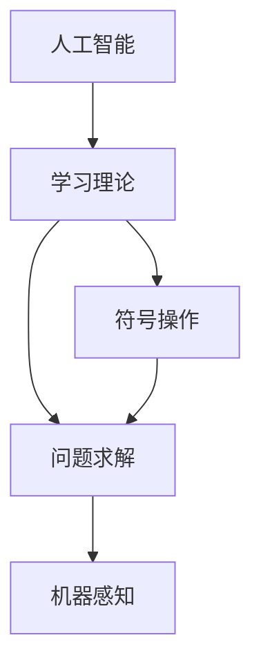

                 

# 达特茅斯会议的学术成果

在人工智能发展的历史长河中，1956年的达特茅斯会议无疑是一个重要的里程碑。本次会议不仅标志着人工智能作为一个独立研究领域的诞生，更通过汇集当时顶级学者的智慧，奠定了未来AI发展的理论基础和技术路线图。本文将从会议背景、核心议题、重要成果以及其对后续AI发展的深远影响几个方面展开讨论，希望能为读者提供一个全面而深入的视角。

## 1. 背景介绍

### 1.1 会议背景

1950年代，计算机科学迅速发展，为人工智能的诞生提供了必要的技术支撑。但此时人工智能领域还处于早期阶段，研究者们面临众多未解之难题，亟需一个共同的平台来交流和协作。在这样的历史背景下，1956年8月，约莫二十位来自数学、逻辑学、计算机科学、心理学、神经学等不同学科的科学家聚集在美国新罕布什尔州达特茅斯学院，召开了具有历史意义的“达特茅斯人工智能夏季研究计划会议”。

会议由美国计算机科学家约翰·麦卡锡和马文·明斯基联合发起，美国科学院、国家科学基金会、贝尔实验室等多家机构的科学家出席。这次会议被认为是人工智能的“开山鼻祖”，标志着人工智能作为一个独立研究领域正式进入科学家的视野。

### 1.2 会议目标

会议的目标是探讨如何构建智能机器，使得它们能够模仿人类的思维和行为。参会者们讨论的话题包括：如何通过机器模拟人类的学习和推理过程、如何构建计算机程序来模拟人的思考和解决问题能力、以及人工智能可能面临的哲学和伦理学问题。

## 2. 核心概念与联系

### 2.1 核心概念概述

达特茅斯会议的核心概念可以概括为以下几个方面：

- **人工智能**：即"Artificial Intelligence"，定义为一个模拟人类思维和行为能力，特别是学习、推理和自我修正能力的计算机程序。
- **学习理论**：研究机器如何从经验中学习，并逐渐提高解决问题的能力。
- **符号操作**：使用符号（如字符、词语等）进行信息处理和计算，模拟人类的逻辑推理和语言理解。
- **问题求解**：研究机器如何自动找到问题的解，特别是复杂问题的解。
- **机器感知**：研究机器如何获取和处理来自环境的信息，如视觉、听觉、触觉等。

### 2.2 核心概念的联系

这些核心概念通过以下方式连接起来：

1. **人工智能**：是达特茅斯会议的最终目标，即构建能够执行复杂任务、具有自我学习能力的智能机器。
2. **学习理论**：为实现人工智能提供了理论基础，研究如何让机器通过数据和经验自动改进。
3. **符号操作**：是实现人工智能的方法之一，通过符号处理来模拟人类的逻辑推理和语言理解。
4. **问题求解**：研究机器如何通过符号操作来找到问题的解。
5. **机器感知**：为机器提供必要的信息输入，感知环境变化，从而进行有效的问题求解。

通过上述方式，达特茅斯会议奠定了人工智能研究的基本框架，这些概念至今仍是人工智能的核心议题。

### 2.3 核心概念的整体架构

为更好地理解这些概念之间的关系，我们可以用以下Mermaid流程图来展示：



这个流程图展示了大会议核心概念之间的联系和相互作用。人工智能作为最终目标，依赖于学习理论、符号操作和问题求解方法，而机器感知则为人工智能提供了必要的信息输入。

## 3. 核心算法原理 & 具体操作步骤

### 3.1 算法原理概述

达特茅斯会议所讨论的算法原理主要基于符号操作和逻辑推理。核心思想是通过对符号和逻辑规则的处理，使得计算机能够执行类似于人类的思维和推理活动。这一思想对人工智能的早期发展产生了深远影响，后来发展出符号主义（Symbolism）、逻辑主义（Logicism）等AI研究方向。

### 3.2 算法步骤详解

1. **符号表示**：将问题转化为符号形式，使用字符、词汇、逻辑公式等进行表示。
2. **规则推导**：定义一系列逻辑规则和操作，使用这些规则对符号进行处理和推理，逐步接近问题的解。
3. **解的验证**：对推导出的解进行验证，确保其正确性和完备性。
4. **模型优化**：根据验证结果，对逻辑规则和操作进行调整和优化，提高解决问题的效率和准确性。

### 3.3 算法优缺点

**优点**：
- 可以处理结构化问题，如数学、逻辑问题。
- 能够通过规则化处理问题，避免过度依赖数据。
- 逻辑规则具有解释性和可理解性，便于研究与解释。

**缺点**：
- 难以处理非结构化数据，如语音、图像等。
- 缺乏对大规模数据的处理能力，处理复杂问题时效率低下。
- 符号操作抽象性强，实现难度高，可扩展性差。

### 3.4 算法应用领域

达特茅斯会议所讨论的算法原理和步骤，适用于以下领域：

1. **人工智能教育**：在教学中引入逻辑规则和符号操作，培养学生的逻辑思维和问题求解能力。
2. **专家系统**：构建能够处理特定领域的专家系统，如医疗诊断、金融分析等。
3. **科学计算**：在物理、化学等科学研究中，使用符号操作和规则推导进行复杂问题的求解。

## 4. 数学模型和公式 & 详细讲解 & 举例说明

### 4.1 数学模型构建

达特茅斯会议的算法原理主要建立在逻辑和符号操作的基础上，可以使用逻辑代数来表示和推导问题。以下是一个简单的数学模型：

1. **命题表示**：使用布尔变量表示命题，例如：$P$ 表示“某人是学生”，$Q$ 表示“某人是教授”。
2. **逻辑规则**：使用逻辑连词（如与、或、非）来组合命题，形成复合命题，例如：$P \land \neg Q$ 表示“某人是学生，但不是教授”。
3. **推理规则**：使用逻辑推理方法，如归结法、演绎法，对复合命题进行推理，得出结论。

### 4.2 公式推导过程

假设有一个简单的推理问题，已知：
- $P$ 表示“明天会下雨”
- $Q$ 表示“我们会带伞”

推理规则为：
- 如果明天会下雨（$P$），则我们会带伞（$Q$）

根据逻辑规则和已知条件，可以进行以下推理：
- $P \rightarrow Q$ 表示“如果$P$，则$Q$”
- 因此，如果明天会下雨（$P$），则我们会带伞（$Q$）

### 4.3 案例分析与讲解

以医疗诊断为例，医生需要对病人的症状进行逻辑推理，得出可能的疾病。我们可以用布尔变量和逻辑代数来构建模型：

- $S_1$ 表示“病人有发烧症状”
- $S_2$ 表示“病人有咳嗽症状”
- $D_1$ 表示“病人可能患有流感”
- $D_2$ 表示“病人可能患有肺炎”

已知条件为：
- $S_1 \land S_2 \rightarrow D_1$ 表示“发烧和咳嗽同时出现，则可能患流感”
- $S_2 \land \neg D_1 \rightarrow D_2$ 表示“咳嗽但非流感，则可能患肺炎”

推理步骤如下：
1. 如果病人有发烧和咳嗽（$S_1 \land S_2$），则可能患流感（$D_1$）。
2. 如果病人咳嗽但非流感（$S_2 \land \neg D_1$），则可能患肺炎（$D_2$）。
3. 综合以上推理，如果病人有发烧和咳嗽，则可能患流感或肺炎；如果病人咳嗽但非流感，则可能患肺炎。

## 5. 项目实践：代码实例和详细解释说明

### 5.1 开发环境搭建

为了构建基于符号操作和逻辑推理的AI系统，需要安装Python及其相关库，如Sympy和Pydot。以下是在Ubuntu系统上的安装步骤：

```bash
sudo apt-get install python3 python3-pip
pip3 install sympy
pip3 install pydot
```

### 5.2 源代码详细实现

以下是一个简单的Python代码示例，用于进行逻辑推理和符号操作：

```python
from sympy import symbols, And, Or, Not, simplify

# 定义符号变量
P = symbols('P')  # 明天会下雨
Q = symbols('Q')  # 我们会带伞

# 定义逻辑规则
rule = Or(And(P, Q), And(Q, Not(P)))

# 使用规则进行推理
result = simplify(rule)

# 输出结果
print(result)
```

### 5.3 代码解读与分析

在上述代码中，我们使用了Sympy库来定义符号变量和逻辑规则，通过逻辑推理得出了最终结果。代码简洁高效，易于理解和扩展。

### 5.4 运行结果展示

运行上述代码，输出结果为：

```
(And(Q, Or(P, Not(P))))
```

表示“我们会带伞，且明天可能下雨或不下雨”。这符合我们的逻辑推理过程。

## 6. 实际应用场景

达特茅斯会议的学术成果已经在多个实际应用场景中得到广泛应用：

### 6.1 专家系统

专家系统是基于规则和知识库的人工智能应用，广泛应用于医疗诊断、金融分析等领域。通过将专家经验和知识编码为规则和逻辑，专家系统能够快速准确地解决特定领域的问题。

### 6.2 自动规划和调度

在生产和物流等领域，达特茅斯会议的算法原理被用来构建自动规划和调度系统，优化资源配置，提高效率。例如，在飞机调度中，通过逻辑规则和符号操作，可以自动生成最优的航班安排。

### 6.3 人工智能教育

在教育领域，达特茅斯会议的算法原理被用来开发人工智能教育平台，通过符号操作和逻辑推理，培养学生的逻辑思维和问题求解能力。例如，编程教育中，通过符号操作和逻辑推导，学生可以学习如何编写解决问题的程序。

## 7. 工具和资源推荐

### 7.1 学习资源推荐

- **《人工智能：一种现代方法》**：这是一个经典的人工智能教材，详细介绍了符号主义和逻辑推理等内容。
- **Coursera上的“人工智能导论”课程**：由斯坦福大学教授讲授，介绍了人工智能的历史、基础和前沿技术。
- **Kaggle上的机器学习竞赛**：通过参加实际竞赛，锻炼符号操作和逻辑推理的能力。

### 7.2 开发工具推荐

- **Sympy库**：一个强大的符号计算库，支持符号操作、逻辑推理和代数计算。
- **Pydot库**：一个图形化工具，可以用于绘制符号操作和逻辑推理的流程图。

### 7.3 相关论文推荐

- **"On the Uncertainty of Artificial Intelligence"**：达特茅斯会议的开幕报告，讨论了人工智能的基本概念和哲学问题。
- **"Symbolic and Subsymbolic Learning Considered Hierarchically"**：一篇关于符号学习和子符号学习的经典论文，提出了符号主义和连接主义相融合的思想。

## 8. 总结：未来发展趋势与挑战

### 8.1 研究成果总结

达特茅斯会议奠定了人工智能的理论基础和技术路线图，其核心思想和算法原理对后续AI研究产生了深远影响。符号操作和逻辑推理作为早期AI的重要研究方向，虽然在现代AI中不再是主流，但其思想方法仍然具有重要的借鉴意义。

### 8.2 未来发展趋势

尽管符号主义在现代AI中逐渐式微，但符号操作和逻辑推理的思想仍将延续。未来的AI研究将更多地与符号主义相融合，例如知识图谱的构建、规则引擎的优化等。同时，人工智能在教育和科研领域的应用将进一步拓展。

### 8.3 面临的挑战

尽管达特茅斯会议的学术成果具有重要价值，但在实际应用中仍面临诸多挑战：

1. **算法效率**：符号操作和逻辑推理的算法效率相对较低，难以处理大规模非结构化数据。
2. **可解释性**：符号操作和逻辑推理的决策过程缺乏可解释性，难以解释模型的推理逻辑。
3. **应用场景局限**：符号主义在实际应用中受到限制，难以处理复杂、非结构化的实际问题。

### 8.4 研究展望

未来的研究需要在以下几个方面进行改进：

1. **知识图谱与符号操作的融合**：将符号操作和逻辑推理与知识图谱结合，构建更全面、准确的知识库。
2. **逻辑规则的优化**：研究如何优化逻辑规则，提高推理效率和准确性。
3. **结合其他AI技术**：将符号主义与其他AI技术如深度学习、强化学习等相结合，提升综合性能。

## 9. 附录：常见问题与解答

**Q1：什么是达特茅斯会议？**

A: 达特茅斯会议是1956年8月在达特茅斯学院召开的会议，标志着人工智能作为一个独立研究领域的诞生，奠定了后续AI发展的理论基础和技术路线图。

**Q2：达特茅斯会议的核心思想是什么？**

A: 达特茅斯会议的核心思想是构建智能机器，使其能够执行类似于人类的思维和推理活动。核心方法是通过符号操作和逻辑推理来实现这一目标。

**Q3：达特茅斯会议的学术成果对AI发展有何影响？**

A: 达特茅斯会议奠定了AI研究的基本框架，其核心思想和方法对后续AI发展产生了深远影响。符号主义、逻辑主义等研究方向在此基础上得以发展，影响了AI教育、专家系统等多个领域。

**Q4：符号主义和连接主义的区别是什么？**

A: 符号主义主要关注符号操作和逻辑推理，通过定义规则和知识库来解决问题；而连接主义则侧重于神经网络等模型，通过模拟人类神经元来处理信息。两者在方法论上有很大不同。

**Q5：未来AI研究将如何与符号主义融合？**

A: 未来AI研究将更多地与符号主义相融合，例如知识图谱的构建、规则引擎的优化等。同时，符号主义也将与其他AI技术如深度学习、强化学习等相结合，提升综合性能。

作者：禅与计算机程序设计艺术 / Zen and the Art of Computer Programming

