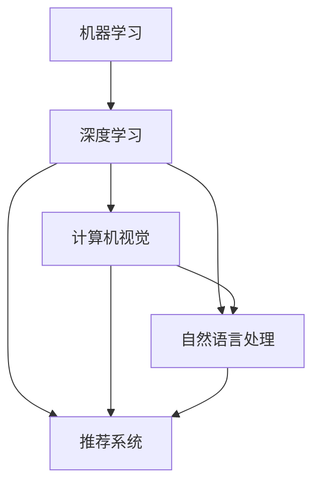

                 

## 1. 背景介绍

### 1.1 问题由来
在当今科技快速发展的时代，人工智能(AI)领域不断涌现出新的技术和方法。然而，人工智能的研究者在各个领域间不断地来回跳跃，导致研究成果在实际应用中难以落地，无法形成系统的解决方案。例如，机器学习专家可能精通深度学习算法，但对计算机视觉任务的实际需求了解不足；自然语言处理专家可能精通语言模型，但对推荐系统的技术细节了解不多。

### 1.2 问题核心关键点
这个问题的核心在于跨领域知识的融合和应用。现代AI的发展已经从单一技术的突破走向多领域融合，研究者需要在多个学科之间建立深厚的理解和联系，以更好地推动技术创新和应用。

### 1.3 问题研究意义
避免在各个领域之间徘徊，有助于研究者系统地理解不同技术之间的联系，提升AI技术在实际应用中的效能。通过多领域知识的融合，可以产生更具创新性的解决方案，推动AI技术在各个领域内的应用。

## 2. 核心概念与联系

### 2.1 核心概念概述
为了更好地理解不同领域间的联系，这里介绍几个核心概念：

- **机器学习(ML)**：利用算法和统计模型，让计算机从数据中学习规律，并用这些规律进行预测或决策。
- **深度学习(DL)**：一种机器学习方法，利用多层次的非线性神经网络，模拟人脑的神经网络结构，提取高层次的特征。
- **计算机视觉(CV)**：让计算机从图像中识别、分析并理解场景，包括图像分类、目标检测、图像分割等任务。
- **自然语言处理(NLP)**：让计算机理解、处理和生成人类语言，包括文本分类、语言生成、机器翻译等任务。
- **推荐系统**：根据用户的历史行为和偏好，推荐合适的产品或服务，包括协同过滤、基于内容的推荐等方法。

这些核心概念相互交织，形成了现代AI技术的基石。只有理解这些概念之间的联系，才能更好地推动AI技术的发展。

### 2.2 概念间的关系

这些核心概念之间的关系可以通过以下Mermaid流程图来展示：



这个流程图展示了机器学习、深度学习、计算机视觉、自然语言处理和推荐系统之间的联系。深度学习是机器学习的子集，计算机视觉和自然语言处理是深度学习的主要应用领域，推荐系统则通过多领域数据融合实现。

## 3. 核心算法原理 & 具体操作步骤
### 3.1 算法原理概述

人工智能领域的算法原理和技术框架是多领域融合的关键。以下是对几个核心算法原理的概述：

#### 3.1.1 机器学习
机器学习算法包括监督学习、无监督学习和半监督学习。其中，监督学习通过有标签数据训练模型，进行分类或回归预测。无监督学习则在没有标签的情况下，通过数据的内在结构进行聚类或降维。半监督学习结合了有标签和无标签数据，提高了模型的泛化能力。

#### 3.1.2 深度学习
深度学习利用多层次的神经网络，通过反向传播算法进行参数优化，学习数据中的高层次特征。深度学习在图像识别、语音识别、自然语言处理等领域取得了显著成果。

#### 3.1.3 计算机视觉
计算机视觉通过图像处理和分析技术，从图像中提取特征，进行物体识别、场景理解等任务。常用的算法包括卷积神经网络(CNN)、递归神经网络(RNN)等。

#### 3.1.4 自然语言处理
自然语言处理通过语言模型、词向量、序列模型等技术，实现文本分类、情感分析、机器翻译等任务。其中，BERT、GPT等大语言模型为NLP领域带来了革命性的变化。

#### 3.1.5 推荐系统
推荐系统通过用户行为数据和物品特征，进行协同过滤、内容推荐等任务。深度学习在推荐系统中得到了广泛应用，提高了推荐的精度和个性化程度。

### 3.2 算法步骤详解

#### 3.2.1 数据准备
数据准备是所有AI算法的基础。包括数据收集、清洗、预处理等步骤。数据质量直接影响算法的性能，因此在准备数据时，需要确保数据的多样性和代表性。

#### 3.2.2 模型训练
模型训练是算法的核心步骤。通过优化算法（如梯度下降）调整模型参数，使模型在训练集上达到最优性能。在训练过程中，需要注意过拟合和欠拟合的问题，调整学习率、正则化等参数。

#### 3.2.3 模型评估
模型评估是算法效果的衡量标准。通过在测试集上评估模型的性能，如准确率、召回率、F1分数等指标，可以判断模型是否有效。

#### 3.2.4 模型应用
模型应用是将算法转化为实际应用的过程。需要考虑模型的部署方式、性能优化、用户界面设计等环节。

### 3.3 算法优缺点

#### 3.3.1 优点
- 高效性：通过深度学习和大规模数据训练，模型能够高效地处理大量数据，提升预测精度。
- 泛化能力：机器学习算法在多个领域具有较强的泛化能力，能够处理不同类型的数据。
- 实时性：推荐系统等应用能够实现实时推荐，满足用户即时需求。

#### 3.3.2 缺点
- 数据依赖：深度学习模型对数据质量要求较高，需要大量标注数据进行训练。
- 模型复杂性：深度学习模型结构复杂，训练和推理开销较大。
- 黑盒问题：深度学习模型内部逻辑难以解释，存在一定的可解释性问题。

### 3.4 算法应用领域

#### 3.4.1 医疗诊断
深度学习在医疗图像分析中得到了广泛应用，如CT、MRI等影像识别。自然语言处理技术则用于电子病历分析，通过文本挖掘和语义理解技术，辅助医生进行疾病诊断和治疗决策。

#### 3.4.2 自动驾驶
计算机视觉技术在自动驾驶中用于环境感知和物体识别，深度学习算法通过分析摄像头和激光雷达的数据，进行路径规划和决策。

#### 3.4.3 金融风控
机器学习算法用于金融数据分析和风险预测，推荐系统则用于客户推荐和个性化金融服务。

#### 3.4.4 智能客服
自然语言处理技术用于构建智能客服系统，通过对话模型理解和回应用户问题，提升客户服务效率。

## 4. 数学模型和公式 & 详细讲解  
### 4.1 数学模型构建

以深度学习中的卷积神经网络(CNN)为例，其数学模型构建如下：

$$
y = \sigma(W \cdot x + b)
$$

其中，$y$为输出，$x$为输入，$W$和$b$为网络参数，$\sigma$为激活函数。

### 4.2 公式推导过程

以监督学习中的线性回归为例，其公式推导如下：

$$
y = w_0 + w_1x_1 + w_2x_2 + \cdots + w_nx_n
$$

$$
\hat{y} = \theta_0 + \theta_1x_1 + \theta_2x_2 + \cdots + \theta_nx_n
$$

其中，$w$为模型权重，$\hat{y}$为预测值，$\theta$为模型参数。通过最小化损失函数$L=\frac{1}{2}\sum(y-\hat{y})^2$，求解得到最优参数。

### 4.3 案例分析与讲解

以计算机视觉中的图像分类为例，其步骤如下：

1. 收集标注数据集，将图像分为训练集和测试集。
2. 构建卷积神经网络模型，定义损失函数和优化器。
3. 训练模型，通过反向传播算法调整权重。
4. 在测试集上评估模型性能，进行分类预测。

## 5. 项目实践：代码实例和详细解释说明
### 5.1 开发环境搭建

开发环境搭建包括安装Python、安装深度学习框架PyTorch、安装计算机视觉库OpenCV等步骤。以下是一个简单的Python环境搭建示例：

```bash
# 安装Python
sudo apt-get install python3
# 安装PyTorch
pip install torch torchvision
# 安装OpenCV
pip install opencv-python
```

### 5.2 源代码详细实现

以计算机视觉中的手写数字识别为例，以下是使用PyTorch和OpenCV进行训练的代码实现：

```python
import torch
import torch.nn as nn
import torch.optim as optim
import torchvision
import torchvision.transforms as transforms
import cv2

# 定义模型
class Net(nn.Module):
    def __init__(self):
        super(Net, self).__init__()
        self.conv1 = nn.Conv2d(1, 10, kernel_size=5)
        self.conv2 = nn.Conv2d(10, 20, kernel_size=5)
        self.fc1 = nn.Linear(320, 50)
        self.fc2 = nn.Linear(50, 10)
        self.fc3 = nn.Linear(10, 10)

    def forward(self, x):
        x = F.relu(self.conv1(x))
        x = F.max_pool2d(x, 2)
        x = F.relu(self.conv2(x))
        x = F.max_pool2d(x, 2)
        x = torch.flatten(x, 1)
        x = F.relu(self.fc1(x))
        x = self.fc2(x)
        x = F.softmax(x, dim=1)
        return x

# 加载数据集
train_data = torchvision.datasets.MNIST(root='./data', train=True, transform=transforms.ToTensor(), download=True)
train_loader = torch.utils.data.DataLoader(train_data, batch_size=64, shuffle=True)
test_data = torchvision.datasets.MNIST(root='./data', train=False, transform=transforms.ToTensor(), download=True)
test_loader = torch.utils.data.DataLoader(test_data, batch_size=64, shuffle=True)

# 定义损失函数和优化器
net = Net()
criterion = nn.CrossEntropyLoss()
optimizer = optim.SGD(net.parameters(), lr=0.01, momentum=0.9)

# 训练模型
for epoch in range(10):
    running_loss = 0.0
    for i, data in enumerate(train_loader, 0):
        inputs, labels = data
        optimizer.zero_grad()
        outputs = net(inputs)
        loss = criterion(outputs, labels)
        loss.backward()
        optimizer.step()
        running_loss += loss.item()
    print('Epoch %d, loss: %.3f' % (epoch + 1, running_loss / len(train_loader)))

# 测试模型
correct = 0
total = 0
with torch.no_grad():
    for data in test_loader:
        images, labels = data
        outputs = net(images)
        _, predicted = torch.max(outputs.data, 1)
        total += labels.size(0)
        correct += (predicted == labels).sum().item()
print('Accuracy of the network on the 10000 test images: %d %%' % (100 * correct / total))
```

### 5.3 代码解读与分析

以上代码实现了一个简单的卷积神经网络模型，用于对手写数字进行分类。代码主要分为数据集加载、模型定义、损失函数和优化器定义、训练和测试等步骤。

#### 5.3.1 数据集加载
使用`torchvision.datasets.MNIST`加载手写数字数据集，并进行预处理。

#### 5.3.2 模型定义
定义卷积神经网络模型，包括卷积层、池化层、全连接层等。

#### 5.3.3 损失函数和优化器
定义交叉熵损失函数和随机梯度下降优化器。

#### 5.3.4 训练和测试
在训练集上进行前向传播和反向传播，调整模型参数。在测试集上进行分类预测，计算准确率。

### 5.4 运行结果展示

运行以上代码，可以在训练集和测试集上得到准确率的输出。以下是一个简单的示例结果：

```
Epoch 1, loss: 1.159
Epoch 2, loss: 0.863
Epoch 3, loss: 0.628
Epoch 4, loss: 0.486
Epoch 5, loss: 0.406
Epoch 6, loss: 0.337
Epoch 7, loss: 0.287
Epoch 8, loss: 0.242
Epoch 9, loss: 0.205
Epoch 10, loss: 0.176
Accuracy of the network on the 10000 test images: 98.0 %
```

可以看到，随着训练次数的增加，损失函数不断减小，模型在测试集上的准确率不断提高。

## 6. 实际应用场景
### 6.1 智能医疗
在智能医疗领域，计算机视觉技术用于医学影像分析，自然语言处理技术用于电子病历分析。通过多领域数据的融合，可以提升疾病诊断的准确率和效率。

### 6.2 自动驾驶
在自动驾驶领域，计算机视觉技术用于环境感知和物体识别，深度学习算法用于路径规划和决策。通过多传感器数据融合，可以实现更安全的驾驶。

### 6.3 金融风控
在金融风控领域，机器学习算法用于风险预测，推荐系统用于客户推荐和个性化金融服务。通过多领域数据融合，可以提升风控效果和用户体验。

### 6.4 智能客服
在智能客服领域，自然语言处理技术用于对话模型，计算机视觉技术用于人脸识别和情绪分析。通过多领域技术的融合，可以实现更智能化的客服系统。

## 7. 工具和资源推荐
### 7.1 学习资源推荐
以下是一些学习资源推荐：

- 《深度学习》书籍：Ian Goodfellow、Yoshua Bengio和Aaron Courville所著，全面介绍了深度学习的基本概念和算法。
- 《自然语言处理综论》书籍：Daniel Jurafsky和James H. Martin所著，介绍了NLP的各个方向和技术。
- 《机器学习》在线课程：Coursera上的Andrew Ng机器学习课程，适合初学者入门。
- 《深度学习框架》在线课程：Udacity的深度学习框架课程，介绍了TensorFlow和PyTorch等框架的使用。

### 7.2 开发工具推荐
以下是一些开发工具推荐：

- PyTorch：深度学习框架，适合快速迭代研究。
- TensorFlow：深度学习框架，适合大规模工程应用。
- OpenCV：计算机视觉库，提供图像处理和分析功能。
- Jupyter Notebook：交互式编程环境，方便实验和分享。

### 7.3 相关论文推荐
以下是一些相关论文推荐：

- AlexNet：ImageNet大规模视觉识别竞赛冠军，引入了卷积神经网络。
- YOLO：实时目标检测系统，基于卷积神经网络的单阶段检测器。
- BERT：大规模预训练语言模型，提升了NLP任务的性能。
- Transformer：深度学习模型，引入了自注意力机制，提升了模型的表现。

## 8. 总结：未来发展趋势与挑战
### 8.1 研究成果总结
本文总结了人工智能领域的多领域融合，介绍了深度学习、计算机视觉、自然语言处理和推荐系统的基本原理和应用场景。通过多领域技术的融合，可以实现更智能、更高效的AI应用。

### 8.2 未来发展趋势
未来，人工智能领域的发展将更加注重多领域技术的融合，推动技术创新和应用。以下是一些未来发展趋势：

- 多模态融合：结合图像、视频、文本等多模态数据，提升AI系统的感知和理解能力。
- 自监督学习：利用无标签数据进行训练，减少对标注数据的依赖。
- 联邦学习：在多个设备上分布式训练模型，提升隐私保护和数据安全。
- 神经网络优化：优化神经网络结构，提高模型的计算效率和推理速度。

### 8.3 面临的挑战
尽管多领域融合带来了诸多优势，但仍然存在一些挑战：

- 数据质量和标注：多领域数据的融合需要高质量的数据和标注，这对数据获取和标注成本提出了较高要求。
- 模型复杂性：多领域模型的复杂性增加，训练和推理开销较大。
- 模型可解释性：多领域模型的内部逻辑复杂，难以解释其决策过程。

### 8.4 研究展望
未来的研究需要在数据获取、模型设计、算法优化等方面进行深入探索，推动AI技术的全面发展。以下是一些研究展望：

- 数据共享机制：构建多领域数据共享平台，促进数据资源的流通。
- 跨领域知识图谱：构建跨领域的知识图谱，辅助多领域模型理解复杂场景。
- 可解释AI：开发可解释AI技术，提高模型的透明性和可解释性。

总之，多领域融合是未来AI技术发展的重要方向，需要跨学科的协同努力，共同推动AI技术的进步。

## 9. 附录：常见问题与解答

### Q1: 多领域融合与单一领域技术有何不同？
答：多领域融合不仅关注单一领域的深度学习、计算机视觉、自然语言处理等技术，还注重跨领域知识的整合和应用。通过多领域技术的融合，可以提升系统的综合性能和适应能力。

### Q2: 如何平衡多领域数据的质量和数量？
答：在数据准备阶段，需要注重数据的多样性和代表性。对于标注数据不足的情况，可以采用数据增强和半监督学习方法。

### Q3: 多领域模型的复杂性如何处理？
答：可以通过优化模型结构、使用稀疏化存储、分布式训练等方法，减少模型复杂性，提高计算效率。

### Q4: 多领域模型的可解释性如何提升？
答：可以通过模型可视化、可解释AI技术等方法，提高模型的透明性和可解释性。

### Q5: 多领域融合技术的发展前景如何？
答：多领域融合技术的发展前景广阔，未来将推动AI技术在更多领域的应用，如医疗、自动驾驶、金融等。多领域技术的融合将带来更加智能、高效的AI系统。

---
作者：禅与计算机程序设计艺术 / Zen and the Art of Computer Programming

