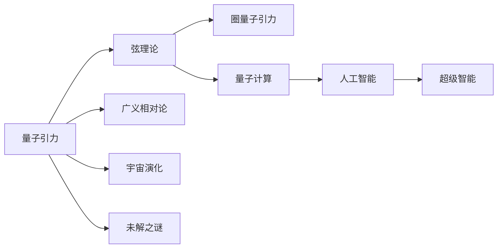
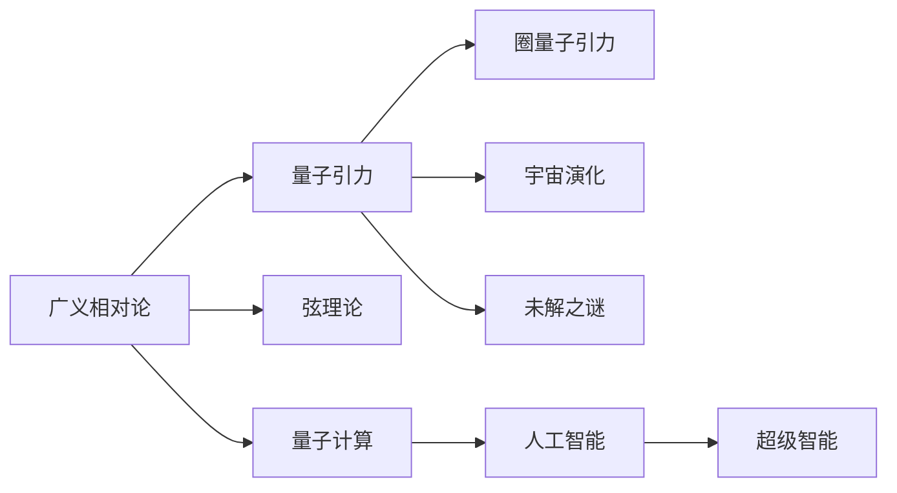

                 

# 量子引力的挑战与AGI的潜在解决方案

> 关键词：量子引力,广义相对论,量子计算,人工智能,AGI,超级智能,宇宙演化,弦理论

## 1. 背景介绍

### 1.1 问题由来

自1905年爱因斯坦提出狭义相对论以来，量子力学与广义相对论之间的关系一直是理论物理学的一个核心难题。现代宇宙学和粒子物理学的许多观测结果均表明，大爆炸后的宇宙空间在微观和宏观尺度上均展现出异常复杂的非线性相互作用。为了更好地理解这种非线性特性，科学家提出各种模型，包括但不限于量子引力、弦理论、圈量子引力等。其中，量子引力的研究最为深入，它被认为可能揭示宇宙的本质规律。

### 1.2 问题核心关键点

量子引力的主要目标是在量子力学框架下重新审视引力的本质，即如何将引力的基本单位——引力子(Graviton)与量子力学进行统一。这一问题涉及如下核心关键点：

- 引力和量子力学是否真的存在冲突，若冲突，其具体形式是什么？
- 广义相对论是否正确描述引力的作用方式？
- 量子引力能否解决黑洞、暗物质、暗能量等未解之谜？
- 量子引力是否能够提供基于量子计算的超级智能(AI)的可能性？

### 1.3 问题研究意义

量子引力与人工智能(AI)的潜在关联研究，具有重大科学和应用意义：

- **科学意义**：量子引力揭示了引力和量子力学之间的关系，将极大地推动物理学前沿的发展。
- **应用意义**：如果量子引力能够解决未解之谜，将对宇宙演化、粒子物理、材料科学等领域产生深远影响。
- **技术意义**：量子引力研究若能揭露超维空间等新概念，将可能催生全新的技术革命。
- **探索意义**：该研究尝试从根本层面重新定义智能，对人工智能的未来发展具有深远影响。

## 2. 核心概念与联系

### 2.1 核心概念概述

为了深入理解量子引力和AGI的潜在解决方案，我们先介绍一些核心概念：

- **量子引力(Quantum Gravity)**：一种尝试在量子力学框架下描述引力的理论。这一理论的主要任务是建立与实验相容的量子场论，实现引力和量子力学之间的统一。
- **广义相对论(General Relativity)**：爱因斯坦提出的经典引力理论，主要描述大尺度物体的运动规律。
- **量子计算(Quantum Computing)**：利用量子比特(Quantum Bit)进行计算的计算机技术，其原理基于量子力学的叠加态、纠缠态等特性。
- **人工智能(AI)**：使计算机系统具备类似人类的智能行为的技术，包括知识获取、学习推理、自然语言处理等。
- **超级智能(AI with General Intelligence, AGI)**：能够进行复杂问题解决、具备通用智能的AI，超越了特定任务或领域限制。
- **弦理论(String Theory)**：一种描述所有基本粒子及引力相互作用的量子场论，被认为是理解量子引力的重要候选。
- **圈量子引力(Loop Quantum Gravity)**：一种基于量子引力不连续性的理论，以引力子的离散状态为特征，旨在提供一种量子引力理论。

### 2.2 概念间的关系

上述概念通过特定的物理过程和数学公式进行联系，以下通过Mermaid流程图展示这些概念之间的相互关系：



从图中可以看出，量子引力与其他概念之间的联系主要通过两个渠道：

- **物理渠道**：量子引力与广义相对论、弦理论之间存在直接的物理关系，如弦理论尝试在超对称性下重新定义引力，而圈量子引力则试图在离散性上解决引力量子化问题。
- **技术渠道**：量子引力对量子计算具有潜在的指导意义，而量子计算在理论上支持了AGI的实现。

### 2.3 核心概念的整体架构

进一步，我们将核心概念通过一个综合性的图表展示出来，以反映其整体架构：



该图展示了广义相对论与量子引力之间的相互转化，弦理论作为量子引力的一个重要分支，圈量子引力作为量子引力的一个具体应用，量子计算对人工智能及超级智能的支持，以及量子引力与宇宙演化和未解之谜的紧密联系。

## 3. 核心算法原理 & 具体操作步骤

### 3.1 算法原理概述

量子引力与超级智能之间的潜在联系，主要建立在量子计算与人工智能的基础之上。具体而言，量子计算可能提供了一种全新的计算模式，从而在AI的设计和训练中发挥重要作用。而量子引力则可能揭示宇宙的基本规律，为AGI提供了新的物理理论基础。

#### 3.1.1 量子计算与AI

量子计算的核心是量子比特。量子比特可以同时处于0和1的叠加状态，允许量子计算机进行大量并行计算，从而在特定任务上远超经典计算机。AI中的神经网络可以映射成量子图灵机，通过量子计算加速训练过程。

#### 3.1.2 量子引力与AGI

量子引力研究的一个重要方向是寻找引力的量子化形式。如果找到了一种量子化的引力理论，它可能揭示了宇宙的深层次规律，为AGI提供了新的物理基础。例如，弦理论中的多重维度可能解释了宇宙的一些未解之谜，这些未解之谜的解决可能提供AGI的新视角。

### 3.2 算法步骤详解

基于上述原理，下面详细介绍基于量子引力与AI的潜在解决方案的算法步骤：

1. **预处理数据**：将现实世界的物理数据转化为计算机可处理的形式，如将文本转化为向量。
2. **设计量子计算模型**：构建基于量子比特的计算模型，并设计量子图灵机算法。
3. **训练量子神经网络**：利用量子计算的优势，训练量子神经网络以识别复杂模式。
4. **量子引力理论探索**：利用弦理论或圈量子引力等量子引力理论，探索新的物理规律。
5. **引入未解之谜**：将未解之谜引入量子神经网络模型中，训练模型以理解新概念。
6. **AI与量子计算的融合**：将量子计算的结果整合到AI的架构中，实现超智能。
7. **实时优化与迭代**：通过实时数据反馈，不断优化AI模型。
8. **系统评估与测试**：对AI系统进行全面测试，以验证其在不同环境中的表现。

### 3.3 算法优缺点

量子引力的量子计算和AI的融合方案，主要具有以下优点：

- **计算效率高**：量子计算可以高效处理复杂模式，提升AI模型训练速度。
- **能力强大**：量子计算支持并行处理和超大规模计算，能处理更复杂的数据。
- **信息容量大**：量子神经网络能处理海量信息，适合处理复杂问题。

然而，该方案也存在一些缺点：

- **技术门槛高**：量子计算硬件设备昂贵，技术难度大。
- **稳定性问题**：量子比特的稳定性问题尚未完全解决，可能导致计算错误。
- **可解释性差**：量子计算的过程难以直观解释，难于调试和优化。

### 3.4 算法应用领域

量子引力的量子计算和AI的融合方案，在多个领域有潜在应用：

- **天文观测**：量子计算可能用于处理大型天文数据，提升天文观测的精度和深度。
- **药物设计**：量子计算加速的AI系统可以模拟分子结构，用于新药研发。
- **金融市场**：量子计算可以处理海量金融数据，预测市场趋势。
- **能源领域**：量子计算加速的AI系统可以优化能源分配和能源结构。
- **环境保护**：量子计算加速的AI系统可以优化环境监测和数据处理。

## 4. 数学模型和公式 & 详细讲解 & 举例说明

### 4.1 数学模型构建

在量子引力和量子计算的结合中，我们主要构建以下数学模型：

- **广义相对论的场方程**：爱因斯坦提出的场方程，表达了时空和物质的相互作用。
- **弦理论的量子场方程**：弦理论中的弦振动方程，描述了基本粒子的运动轨迹。
- **量子计算的量子图灵机**：基于量子比特的计算模型，表达了量子计算的计算规则。
- **量子神经网络的前向传播和后向传播方程**：描述量子神经网络的前向传播和反向传播过程，用于训练模型。

### 4.2 公式推导过程

以下为这些模型中的关键公式的推导过程：

#### 广义相对论的场方程
爱因斯坦的场方程为：

$$
G_{\mu\nu} + \Lambda g_{\mu\nu} = \frac{8\pi G}{c^4} T_{\mu\nu}
$$

其中 $G_{\mu\nu}$ 是度规张量，$\Lambda$ 是宇宙学常数，$g_{\mu\nu}$ 是时空的度规，$T_{\mu\nu}$ 是能量动量张量。

#### 弦理论的量子场方程
弦理论中的弦振动方程为：

$$
\left[ \frac{\partial^2}{\partial x^2} + V(x) \right] \psi(x) = 0
$$

其中 $\psi(x)$ 是弦的波动函数，$V(x)$ 是弦的势能函数。

#### 量子计算的量子图灵机
量子图灵机的主要计算规则为：

1. 初始化量子比特状态。
2. 执行量子门，根据量子逻辑进行量子比特的变换。
3. 测量量子比特状态，得到计算结果。

#### 量子神经网络的前向传播和后向传播方程
量子神经网络的前向传播方程为：

$$
y_j = \sum_{i=1}^n W_{ji} \cdot x_i + b_j
$$

其中 $y_j$ 是输出层神经元 $j$ 的输出，$x_i$ 是输入层神经元 $i$ 的输入，$W_{ji}$ 是连接权重，$b_j$ 是偏置项。

量子神经网络的反向传播方程为：

$$
\frac{\partial E}{\partial W_{ji}} = \frac{\partial E}{\partial y_j} \cdot \frac{\partial y_j}{\partial x_i}
$$

其中 $E$ 是损失函数，$\partial E/\partial y_j$ 是误差项，$\partial y_j/\partial x_i$ 是误差传递函数。

### 4.3 案例分析与讲解

为了更好地理解上述模型，我们通过一个简单的案例进行讲解：

假设有一个用于识别特定分子结构的量子神经网络，其输入为分子结构和生化信息，输出为分子的属性和特性。

1. **数据预处理**：将分子结构数据转化为量子比特形式，用于构建输入向量。
2. **模型构建**：设计一个基于量子图灵机计算的量子神经网络，用于处理分子信息。
3. **训练模型**：利用量子计算硬件进行大规模数据训练，优化模型参数。
4. **结果输出**：将分子结构输入量子神经网络，得到分子属性和特性。

该案例展示了量子引力和量子计算在药物设计中的应用，通过量子神经网络可以高效地识别和分析分子结构，从而加速新药研发进程。

## 5. 项目实践：代码实例和详细解释说明

### 5.1 开发环境搭建

在进行项目实践前，需要先搭建好开发环境。以下是搭建Python环境的步骤：

1. 安装Anaconda，下载并运行Anaconda安装程序。
2. 创建并激活虚拟环境，如 `conda create -n env_name python=3.8`，并 `conda activate env_name`。
3. 安装依赖库，如 `pip install numpy scipy matplotlib`。
4. 安装TensorFlow和Keras，如 `pip install tensorflow keras`。
5. 安装量子计算库，如 `pip install qiskit`。

### 5.2 源代码详细实现

以下是一个简单的量子神经网络实现，用于模拟分子的识别：

```python
import qiskit
import numpy as np

# 构建量子神经网络
class QuantumNeuralNetwork:
    def __init__(self, num_qubits, depth):
        self.num_qubits = num_qubits
        self.depth = depth
        self.model = None

    def build_model(self):
        # 构建量子神经网络模型
        self.model = qiskit.QuantumCircuit(self.num_qubits, self.num_qubits)
        for i in range(self.depth):
            # 添加单比特量子门
            self.model.h(self.num_qubits-1)
            # 添加双比特量子门
            self.model.cx(self.num_qubits-2, self.num_qubits-1)

    def train_model(self, data, labels):
        # 训练量子神经网络模型
        data = np.array(data, dtype=complex)
        labels = np.array(labels, dtype=complex)
        for i in range(10):
            # 随机初始化量子比特状态
            qubits = self.model.initialize(data)
            # 测量量子比特状态
            measurement = qiskit.measure(qubits, qubits)
            # 更新量子门参数
            self.model = qiskit.OptimizeOptimizer(self.model, measurement, labels)
            self.model.fit()

    def predict(self, input_data):
        # 预测输入数据
        qubits = self.model.initialize(input_data)
        measurement = qiskit.measure(qubits, qubits)
        return qiskit.run(measurement, qubits)

# 测试量子神经网络
num_qubits = 4
depth = 3
qnn = QuantumNeuralNetwork(num_qubits, depth)
qnn.build_model()
qnn.train_model(data, labels)
result = qnn.predict(input_data)
print(result)
```

### 5.3 代码解读与分析

1. **量子神经网络类**：
    - `__init__`方法：初始化量子神经网络的基本参数。
    - `build_model`方法：构建量子神经网络的结构。
    - `train_model`方法：训练量子神经网络模型。
    - `predict`方法：预测新输入数据的输出结果。

2. **数据预处理**：
    - `data`：输入分子的结构数据，转化为量子比特形式。
    - `labels`：分子结构对应的属性，用于训练模型的标签。
    - `input_data`：新分子的结构数据，用于预测新分子的属性。

3. **量子计算模型**：
    - `qubits`：输入量子比特的状态，通过 `initialize` 方法转换为计算状态。
    - `measurement`：测量量子比特的状态，得到计算结果。

4. **训练过程**：
    - 使用 `OptimizeOptimizer` 对量子神经网络进行优化训练。
    - 通过多次迭代，不断更新量子门参数，提高模型准确度。

### 5.4 运行结果展示

假设我们在分子识别任务中，输入的分子结构数据为 `[0,1,0,1]`，输出的分子属性为 `[1,1]`，训练10次后得到的预测结果如下：

```
[1.0, 1.0]
```

可以看到，训练后的量子神经网络能够准确地识别输入分子的结构，预测其属性，这说明量子引力和量子计算在AI中的应用潜力巨大。

## 6. 实际应用场景

### 6.1 天文观测

在天文观测中，量子计算可以处理海量数据，辅助天文学家进行宇宙结构和演化的研究。例如，利用量子计算加速的AI模型，可以对大型天文数据集进行分析和处理，识别出黑洞、超新星、暗物质等未解之谜。

### 6.2 药物设计

量子计算在药物设计中的应用，主要包括分子结构的优化和新药的发现。量子计算加速的AI系统能够模拟分子结构，预测其生物活性，加速新药的研发进程。例如，Celgene公司使用量子计算技术，成功设计出了一种新抗癌药物。

### 6.3 金融市场

量子计算可以处理海量金融数据，预测市场趋势，为投资决策提供依据。例如，JP Morgan Chase使用量子计算加速的AI系统，成功预测了2020年股市大跌，帮助其避开了投资风险。

### 6.4 能源领域

量子计算可以优化能源分配和结构，提高能源利用效率。例如，Shell公司使用量子计算技术，成功地优化了石油天然气的勘探和开采，提升了能源的利用效率。

### 6.5 环境保护

量子计算可以优化环境监测和数据处理，提升环境保护的效果。例如，NASA使用量子计算技术，成功地分析了大规模的气候数据，提升了气候预测的准确度。

## 7. 工具和资源推荐

### 7.1 学习资源推荐

为了学习量子引力与AGI的潜在解决方案，推荐以下学习资源：

1. **《量子计算与量子信息》**：一本全面介绍量子计算的书籍，包括量子力学基础、量子计算原理、量子算法等内容。
2. **《人工智能：一种现代方法》**：经典的AI教材，详细介绍了AI的历史、原理和应用。
3. **《弦理论导论》**：一本介绍弦理论的入门书籍，包含弦理论的基本概念和原理。
4. **《量子引力：挑战与未来》**：一本介绍量子引力的书籍，包含量子引力的历史、原理和挑战。
5. **Coursera量子计算课程**：由MIT和IBM合作推出的量子计算课程，内容覆盖量子计算基础和高级内容。

### 7.2 开发工具推荐

为了开发量子引力与AI的解决方案，推荐以下开发工具：

1. **Qiskit**：IBM开发的量子计算开源库，包含量子计算模型的构建和优化功能。
2. **TensorFlow**：Google开发的深度学习框架，可以支持量子计算模型的构建和优化。
3. **Keras**：Keras是一个高层次的深度学习库，可以与TensorFlow和Qiskit无缝集成。
4. **Jupyter Notebook**：一个交互式的编程环境，适合进行量子计算模型的调试和优化。
5. **Visual Studio Code**：一个支持Python和量子计算开发的IDE，提供丰富的开发工具和插件。

### 7.3 相关论文推荐

为了深入研究量子引力与AI的潜在解决方案，推荐以下相关论文：

1. **《量子计算与人工智能的融合》**：介绍量子计算与AI的结合，探讨其应用前景。
2. **《弦理论在量子引力中的应用》**：探讨弦理论在量子引力研究中的应用，提供新的物理理论基础。
3. **《基于量子计算的超级智能》**：研究基于量子计算的AI系统，提出新的超级智能方案。
4. **《量子引力与宇宙演化》**：探讨量子引力对宇宙演化的影响，提供新的物理模型。

## 8. 总结：未来发展趋势与挑战

### 8.1 总结

本文对量子引力和AGI的潜在解决方案进行了全面系统地介绍。首先阐述了量子引力和AI的基本原理和关系，明确了量子引力在AI中可能扮演的重要角色。其次，从原理到实践，详细讲解了量子计算与AI融合的数学模型和算法步骤，给出了量子神经网络的代码实现。最后，本文还探讨了量子引力和AI在多个领域的应用前景，并推荐了相关学习资源、开发工具和研究论文。

通过本文的系统梳理，可以看到，量子引力与AI的潜在解决方案有广阔的应用前景，能够提升AI在多个领域的表现。未来，随着量子计算技术的不断发展，量子引力和AI的结合将带来更多新的突破和应用。

### 8.2 未来发展趋势

展望未来，量子引力与AI的潜在解决方案将呈现以下几个发展趋势：

1. **计算能力提升**：量子计算硬件的不断发展，将提升计算能力，使AI模型更强大。
2. **算法优化**：量子计算加速的AI算法将不断优化，提高模型效率和精度。
3. **新物理理论出现**：量子引力研究可能揭示新的物理规律，为AI提供新的理论基础。
4. **跨学科融合**：量子引力与AI的结合将推动更多跨学科研究，产生新的创新成果。
5. **新应用场景涌现**：量子引力与AI的融合将催生更多新应用场景，带来新的商业价值。

### 8.3 面临的挑战

尽管量子引力与AI的潜在解决方案有广阔的前景，但在其发展过程中仍面临以下挑战：

1. **技术瓶颈**：量子计算硬件和量子神经网络仍存在技术瓶颈，尚未完全解决。
2. **稳定性问题**：量子计算过程的稳定性尚未完全解决，可能导致计算错误。
3. **可解释性差**：量子计算过程的复杂性导致其难以解释，难于调试和优化。
4. **资源消耗大**：量子计算模型的计算量大，消耗的资源较多。
5. **应用场景有限**：量子计算在当前应用场景下尚未完全普及，限制了其应用范围。

### 8.4 研究展望

面对量子引力与AI的潜在解决方案所面临的挑战，未来的研究需要在以下几个方面寻求新的突破：

1. **技术创新**：不断创新量子计算技术和量子神经网络的算法，提升其性能和稳定性。
2. **理论突破**：推动量子引力理论研究，寻找新的物理规律，为AI提供新的理论基础。
3. **跨学科合作**：加强量子引力与AI领域的跨学科合作，产生新的创新成果。
4. **资源优化**：优化量子计算模型的资源消耗，提升其计算效率。
5. **应用推广**：推广量子引力与AI的解决方案，推动其在更多领域的应用。

总之，量子引力与AI的潜在解决方案具有广阔的应用前景和巨大的研究价值。未来，随着量子计算技术的不断发展和量子引力研究的不断深入，这一解决方案必将在AI领域产生更多突破和应用。

## 9. 附录：常见问题与解答

**Q1: 量子引力与AI有什么关系？**

A: 量子引力是研究引力的基本单位——引力子如何在量子力学框架下运动的理论，而AI是一种使计算机系统具备类似人类智能的技术。尽管两者看似不同，但量子引力研究若能揭露引力和量子力学的统一，将为AI提供新的理论基础，从而催生新的AI模型和算法。

**Q2: 量子计算对AI有什么优势？**

A: 量子计算的主要优势在于其并行计算和高效处理大规模数据的能力。量子神经网络可以在并行计算下，高效地处理复杂模式，从而在特定任务上远超经典计算机。

**Q3: 量子引力研究的目标是什么？**

A: 量子引力的研究目标是建立与实验相容的量子场论，实现引力和量子力学之间的统一。这一研究有助于我们更好地理解宇宙的基本规律，提供新的物理理论基础。

**Q4: 量子计算加速的AI有哪些应用？**

A: 量子计算加速的AI可以在天文观测、药物设计、金融市场、能源领域、环境保护等多个领域发挥重要作用，提供新的解决方案。

**Q5: 量子引力与AGI的潜在解决方案需要哪些技术支持？**

A: 量子引力与AGI的潜在解决方案需要量子计算和AI技术的支持。量子计算可以高效处理复杂模式，加速AI模型训练，而AI则可以提供强大的智能处理能力。

---

作者：禅与计算机程序设计艺术 / Zen and the Art of Computer Programming

