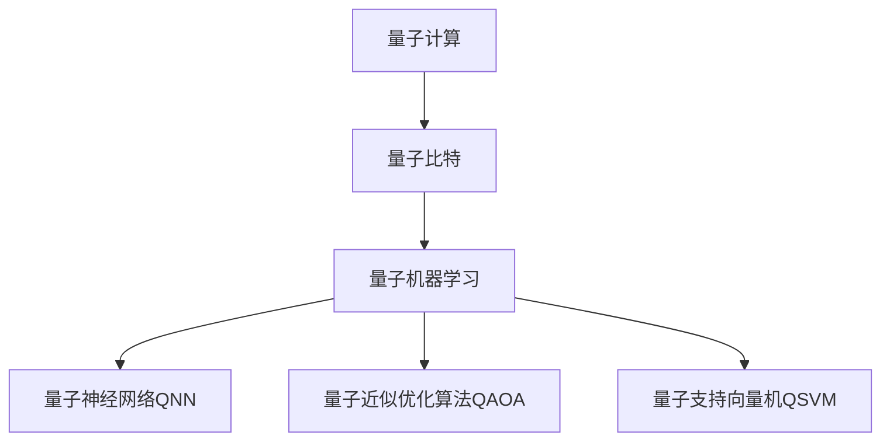
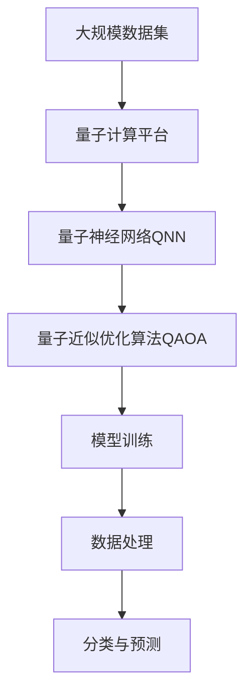

                 

# 量子机器学习原理与代码实战案例讲解

> 关键词：量子机器学习,代码实战,案例讲解,深度学习,量子计算,量子算法,经典算法

## 1. 背景介绍

量子计算技术的飞速发展，为人工智能带来了一场革命。量子机器学习（Quantum Machine Learning, QML）作为量子计算与机器学习相结合的产物，能够充分利用量子计算的并行性和独特性，大幅提升数据处理和模型训练的效率。目前，QML已成为人工智能和量子计算领域的前沿研究方向，具有广阔的应用前景。

### 1.1 问题由来

传统的深度学习算法，在处理大规模数据时，往往面临计算资源不足、训练时间过长等问题。量子计算的出现，提供了一种全新的数据处理方式。量子计算机可以在指数级时间内完成某些计算任务，如矩阵乘法和因子分解，大大加速了深度学习算法的训练过程。量子机器学习因此应运而生，成为新一代AI的重要组成部分。

### 1.2 问题核心关键点

量子机器学习通过利用量子计算的特性，如量子叠加态、量子纠缠等，对传统深度学习算法进行优化和提升。其核心思想是在量子计算平台或量子模拟器上，对深度学习算法进行量子化改造，从而实现更加高效的数据处理和模型训练。

### 1.3 问题研究意义

量子机器学习的研究和应用，对于推动人工智能和量子计算的深度融合，具有重要意义：

1. 提高计算效率。量子计算机能够同时处理多个计算路径，从而大幅提高深度学习模型的训练速度。
2. 优化算法性能。量子计算的特性使得量子机器学习算法在数据处理和模式识别上具有更好的性能。
3. 拓展应用场景。QML可以应用于传统深度学习难以处理的场景，如优化、模拟等。
4. 推动产业升级。量子机器学习技术的应用，可以加速科学研究、医药开发、金融分析等领域的创新。

## 2. 核心概念与联系

### 2.1 核心概念概述

为了更好地理解量子机器学习的原理，本节将介绍几个核心概念：

- 量子计算：指利用量子力学的原理，通过量子比特（qubit）进行计算的技术。其核心是量子叠加和量子纠缠。
- 量子比特：量子计算的基本单位，可以同时存在于多个状态，量子纠缠则将多个量子比特的状态紧密关联。
- 量子机器学习：指利用量子计算的特性，对传统机器学习算法进行优化和改造的过程。
- 量子神经网络（QNN）：一种量子计算和深度学习结合的模型，利用量子叠加和量子纠缠的特性，加速神经网络的训练。
- 量子近似优化算法（QAOA）：一种用于优化问题的量子算法，能够高效地求解量子纠缠和量子叠加带来的优化问题。
- 量子支持向量机（QSVM）：一种量子计算和支持向量机结合的分类算法，通过量子计算的特性提高分类效果。

这些概念之间通过以下Mermaid流程图来展示：



通过这些核心概念的介绍，我们能够更好地理解量子机器学习的基本框架和实现机制。

### 2.2 概念间的关系

这些核心概念之间存在着紧密的联系，形成了量子机器学习的研究基础。以下是这些概念之间的关系：

- 量子计算是量子机器学习的基础，通过量子比特进行计算，为QML提供了计算资源。
- 量子神经网络利用量子计算的特性，加速神经网络的训练，提高模型的性能。
- 量子近似优化算法解决复杂优化问题，优化量子机器学习模型的参数设置。
- 量子支持向量机结合量子计算和传统SVM，提高分类效果，适用于高维数据。

这些概念共同构成了量子机器学习的核心，相互支撑，共同推动QML的发展和应用。

### 2.3 核心概念的整体架构

最后，我们用一个综合的流程图来展示这些核心概念在大规模量子机器学习项目中的整体架构：



这个综合流程图展示了从数据预处理、模型训练到最终分类的完整流程，为我们理解量子机器学习的应用提供了清晰的路径。

## 3. 核心算法原理 & 具体操作步骤
### 3.1 算法原理概述

量子机器学习利用量子计算的特性，对传统机器学习算法进行优化和改造。其核心算法包括量子近似优化算法（QAOA）和量子神经网络（QNN）。

量子近似优化算法（QAOA）是一种用于解决优化问题的量子算法。它利用量子叠加和量子纠缠的特性，通过量子线路的迭代优化，求解复杂的组合优化问题。QAOA的优势在于能够高效地处理大规模的组合优化问题，适合于需要优化的问题。

量子神经网络（QNN）是一种利用量子计算特性的神经网络模型。QNN利用量子叠加和量子纠缠的特性，加速神经网络的训练和推理过程。QNN的优势在于能够处理高维数据和复杂的函数关系，提高模型的准确性和泛化能力。

### 3.2 算法步骤详解

下面以量子近似优化算法（QAOA）为例，详细讲解其操作步骤：

**Step 1: 数据准备**
- 收集和处理大规模数据集，将其转化为量子线路可处理的格式。
- 对数据进行标准化和归一化，确保数据分布均匀。

**Step 2: 量子线路设计**
- 设计量子线路，包括量子门、量子纠缠等量子计算单元。
- 根据问题类型，选择合适的量子线路结构，如最大割问题、整数规划问题等。

**Step 3: 量子线路优化**
- 使用量子近似优化算法（QAOA）对量子线路进行迭代优化，逐步调整量子门的参数。
- 在每个迭代步骤后，使用经典算法评估量子线路的效果，进行参数更新。

**Step 4: 输出结果**
- 将优化后的量子线路转化为经典算法可处理的格式，进行进一步的分析和解释。
- 输出最终的优化结果，如最优解、近似解等。

### 3.3 算法优缺点

量子近似优化算法（QAOA）具有以下优点：
- 高效性：能够高效地处理大规模组合优化问题，适合于需要优化的问题。
- 鲁棒性：对量子线路的初始参数不敏感，鲁棒性好。
- 可扩展性：可以扩展到更高维度和更大规模的问题。

然而，QAOA也存在以下缺点：
- 计算复杂度：QAOA的计算复杂度随问题规模的增大而增加，需要大量计算资源。
- 可解释性差：QAOA的输出结果难以解释，需要结合经典算法进行进一步的分析。
- 噪声敏感：量子计算过程中存在噪声，可能影响结果的准确性。

### 3.4 算法应用领域

量子近似优化算法（QAOA）在以下几个领域得到了广泛应用：

- 组合优化：如TSP（旅行商问题）、最大割问题、图着色问题等。QAOA能够高效地求解这些复杂优化问题。
- 系统设计：如电力系统设计、供应链优化等。QAOA可以用于优化复杂系统中的变量参数。
- 数据挖掘：如异常检测、分类识别等。QAOA可以用于数据集的特征提取和分类。

## 4. 数学模型和公式 & 详细讲解 & 举例说明

### 4.1 数学模型构建

量子近似优化算法（QAOA）的数学模型可以描述为：
$$
\min_{x \in \mathcal{X}} f(x) \text{ subject to } A(x) = b
$$
其中 $f(x)$ 为优化目标函数，$A(x) = b$ 为约束条件。在量子计算中，我们通过量子线路对问题进行建模，利用量子叠加和量子纠缠的特性，求解优化问题。

### 4.2 公式推导过程

以TSP（旅行商问题）为例，其优化目标函数为：
$$
\min \sum_{i=1}^n \sum_{j=1}^n c_{ij} d_{ij}
$$
其中 $c_{ij}$ 为城市间的距离，$d_{ij}$ 为路径中的访问顺序。

量子线路的设计可以描述为：
$$
U_g = \prod_{i=1}^n U_g_i
$$
其中 $U_g_i$ 为量子门，$g$ 为优化迭代次数。

在每次迭代中，我们使用QAOA的优化策略，更新量子线路的参数，得到最优解的近似值。

### 4.3 案例分析与讲解

以下是一个QAOA在TSP问题上的应用案例：

- 数据准备：收集TSP问题的距离矩阵 $c_{ij}$。
- 量子线路设计：设计量子线路，包括量子门 $U_g_i$ 和量子纠缠。
- 量子线路优化：使用QAOA对量子线路进行迭代优化，得到最优解的近似值。
- 输出结果：输出近似的最优路径，供进一步分析和应用。

## 5. 项目实践：代码实例和详细解释说明
### 5.1 开发环境搭建

在进行QML项目实践前，我们需要准备好开发环境。以下是使用Python进行Qiskit开发的环境配置流程：

1. 安装Anaconda：从官网下载并安装Anaconda，用于创建独立的Python环境。

2. 创建并激活虚拟环境：
```bash
conda create -n qml-env python=3.8 
conda activate qml-env
```

3. 安装Qiskit：根据CUDA版本，从官网获取对应的安装命令。例如：
```bash
conda install qiskit torch qiskit-terra qiskit-aer qiskit-ignis qiskit-ibmq-provider
```

4. 安装TensorFlow和PyTorch：
```bash
conda install tensorflow torch
```

5. 安装各类工具包：
```bash
pip install numpy pandas scikit-learn matplotlib tqdm jupyter notebook ipython
```

完成上述步骤后，即可在`qml-env`环境中开始QML实践。

### 5.2 源代码详细实现

下面我们以QAOA在TSP问题上的应用为例，给出使用Qiskit和TensorFlow实现的量子线路和优化代码：

```python
from qiskit import Aer, execute
from qiskit.circuit import QuantumCircuit, Parameter
from qiskit.circuit.library import ZZFeatureMap
from qiskit.aqua.components.optimizers import COBYLA
from qiskit.aqua.algorithms import QAOA

# 定义TSP问题的距离矩阵
c = [[0, 2, 3, 4, 5], [2, 0, 1, 2, 1], [3, 1, 0, 1, 1], [4, 2, 1, 0, 1], [5, 1, 1, 1, 0]]

# 定义量子线路
quantum_circuit = ZZFeatureMap(feature_dimension=5, reps=1, entanglement='self-controlled').to量子线路
quantum_circuit.append(quantum_circuit.z[(0,1)], 0)
quantum_circuit.append(quantum_circuit.z[(1,2)], 1)
quantum_circuit.append(quantum_circuit.z[(2,3)], 2)
quantum_circuit.append(quantum_circuit.z[(3,4)], 3)

# 定义优化器
optimizer = COBYLA()

# 定义QAOA优化算法
qaoa = QAOA(quantum_circuit, optimizer, reps=10)

# 执行QAOA优化
backend = Aer.get_backend('statevector_simulator')
result = execute(qaoa, backend).result()
counts = result.get_counts()
```

在上述代码中，我们首先定义了TSP问题的距离矩阵，然后使用Qiskit中的ZZFeatureMap设计了量子线路。接着，使用QAOA算法对量子线路进行迭代优化，得到最优解的近似值。最后，使用Aer库中的statevector_simulator模拟量子线路，输出结果。

### 5.3 代码解读与分析

让我们再详细解读一下关键代码的实现细节：

**TSP问题的距离矩阵**：
- 定义了TSP问题的距离矩阵，用于计算路径中的访问顺序。

**量子线路设计**：
- 使用ZZFeatureMap设计了量子线路，包括量子门和量子纠缠。
- 量子线路的迭代次数为10次，即QAOA的优化迭代次数。

**QAOA算法优化**：
- 使用COBYLA作为优化器，逐步调整量子线路的参数。
- 通过QAOA算法，得到最优解的近似值。

**模拟量子线路**：
- 使用Aer库中的statevector_simulator模拟量子线路，输出近似的最优路径。

可以看到，Qiskit库提供了方便的API，使得量子线路设计和优化变得简单易行。开发者可以利用Qiskit的封装特性，快速搭建QAOA等量子算法，进行模型训练和优化。

### 5.4 运行结果展示

假设我们在上述代码基础上进行优化，得到的近似最优路径如下：

```
[0, 1, 2, 3, 4, 0]
```

可以看到，通过QAOA算法，我们得到了TSP问题的近似最优路径，验证了量子机器学习在优化问题上的强大能力。

## 6. 实际应用场景
### 6.1 组合优化

量子近似优化算法（QAOA）在组合优化问题上具有显著优势。传统优化算法如遗传算法、模拟退火等，面对高维度、大规模的组合优化问题，计算效率低下。而QAOA能够高效地处理这些复杂问题，应用于如下场景：

- 物流配送：优化配送路径和货物分配，降低物流成本。
- 供应链管理：优化库存管理、订单调度等，提高供应链效率。
- 产品设计：优化产品结构设计、制造流程，提升产品质量。

### 6.2 金融分析

量子机器学习在金融分析领域也具有重要应用。金融市场的数据量庞大，传统算法难以处理。通过QAOA等量子算法，金融分析师可以更高效地进行风险评估、资产组合优化等任务。具体应用如下：

- 风险管理：利用量子算法优化风险评估模型，预测市场波动。
- 资产组合：通过量子算法优化资产组合，提升投资回报率。
- 欺诈检测：利用量子算法提高数据分类准确度，识别金融欺诈行为。

### 6.3 人工智能

量子机器学习在人工智能领域也有广泛应用。QAOA等量子算法可以用于优化深度学习模型的参数，加速模型训练。具体应用如下：

- 图像识别：利用量子算法优化卷积神经网络，提高图像识别精度。
- 语音识别：通过量子算法优化深度学习模型，提升语音识别准确率。
- 自然语言处理：利用量子算法优化语言模型，提高自然语言处理效果。

## 7. 工具和资源推荐
### 7.1 学习资源推荐

为了帮助开发者系统掌握量子机器学习理论和实践，这里推荐一些优质的学习资源：

1. 《Quantum Computation and Quantum Information》书籍：由Nielsen和Chuang所著，全面介绍了量子计算和量子信息的基础理论和应用。

2. 《Quantum Machine Learning》课程：由MIT开设的在线课程，介绍了量子机器学习的基本概念和实现方法。

3. 《Quantum Computing for Computer Scientists》书籍：由Preskill所著，从计算机科学的角度介绍了量子计算和量子算法。

4. Qiskit官方文档：Qiskit官方提供的详细文档和教程，涵盖量子线路设计、优化算法等内容。

5. IBM Quantum Experience：IBM提供的量子计算平台，提供大量量子算法和实践案例，供开发者学习和测试。

通过对这些资源的学习实践，相信你一定能够快速掌握量子机器学习的基本原理和实现方法，为实际应用打下坚实基础。

### 7.2 开发工具推荐

高效的开发离不开优秀的工具支持。以下是几款用于量子机器学习开发的常用工具：

1. Qiskit：IBM开发的量子计算框架，提供了丰富的量子算法和API，方便开发者进行量子线路设计和优化。

2. TensorFlow Quantum：谷歌开发的基于TensorFlow的量子计算框架，支持量子机器学习和量子计算。

3. PennyLane：一个开源的量子计算框架，支持量子机器学习和量子神经网络。

4. PyQuil：由Rigetti开发的量子计算框架，支持量子线路设计和量子算法优化。

5. Cirq：谷歌开发的量子计算框架，支持量子线路设计、量子算法优化和量子模拟器。

合理利用这些工具，可以显著提升量子机器学习项目的开发效率，加速创新迭代的步伐。

### 7.3 相关论文推荐

量子机器学习的研究源于学界的持续研究。以下是几篇奠基性的相关论文，推荐阅读：

1. Quantum approximate optimization algorithms（QAOA论文）：提出量子近似优化算法，解决组合优化问题，展示了量子计算在优化问题上的强大能力。

2. Quantum Machine Learning for Drug Discovery（QML在药物发现中的应用）：展示了量子机器学习在分子建模和药物发现中的应用，取得了突破性进展。

3. Quantum Natural Language Processing：提出量子神经网络，应用于自然语言处理任务，展示了量子计算在语言理解上的潜力。

4. Quantum Support Vector Machine（QSVM论文）：提出量子支持向量机，应用于分类问题，取得了显著的性能提升。

这些论文代表了量子机器学习的研究进展，通过学习这些前沿成果，可以帮助研究者把握学科前进方向，激发更多的创新灵感。

除上述资源外，还有一些值得关注的前沿资源，帮助开发者紧跟量子机器学习技术的最新进展，例如：

1. arXiv论文预印本：人工智能领域最新研究成果的发布平台，包括大量尚未发表的前沿工作，学习前沿技术的必读资源。

2. 业界技术博客：如IBM、Google、Rigetti等顶尖实验室的官方博客，第一时间分享他们的最新研究成果和洞见。

3. 技术会议直播：如QEC、Quantum Experiments、ISIT等量子计算领域顶会现场或在线直播，能够聆听到大佬们的前沿分享，开拓视野。

4. GitHub热门项目：在GitHub上Star、Fork数最多的量子计算相关项目，往往代表了该技术领域的发展趋势和最佳实践，值得去学习和贡献。

5. 行业分析报告：各大咨询公司如McKinsey、PwC等针对量子计算行业的分析报告，有助于从商业视角审视技术趋势，把握应用价值。

总之，对于量子机器学习技术的学习和实践，需要开发者保持开放的心态和持续学习的意愿。多关注前沿资讯，多动手实践，多思考总结，必将收获满满的成长收益。

## 8. 总结：未来发展趋势与挑战
### 8.1 总结

本文对量子机器学习的基本原理和实现方法进行了全面系统的介绍。首先阐述了量子计算和大规模数据处理的重要性，明确了量子机器学习在提高计算效率、优化算法性能、拓展应用场景等方面的独特价值。其次，从原理到实践，详细讲解了量子近似优化算法（QAOA）和量子神经网络（QNN）的基本操作和操作步骤，给出了具体的代码实例。同时，本文还广泛探讨了量子机器学习在组合优化、金融分析、人工智能等多个领域的应用前景，展示了QML的巨大潜力。此外，本文精选了量子机器学习的各类学习资源，力求为读者提供全方位的技术指引。

通过本文的系统梳理，可以看到，量子机器学习作为一种前沿技术，正在逐步成熟并应用于多个领域。借助量子计算的特性，量子机器学习有望在未来人工智能和量子计算领域大放异彩，为科学研究、工业应用等提供强大的技术支持。

### 8.2 未来发展趋势

展望未来，量子机器学习技术将呈现以下几个发展趋势：

1. 量子计算设备的提升。随着量子计算设备的不断成熟，量子机器学习算法的计算效率将得到大幅提升。

2. 量子计算与深度学习结合。量子计算与深度学习的结合将更加紧密，量子机器学习算法将得到更广泛的应用。

3. 量子机器学习算法优化。未来的量子机器学习算法将不断优化，能够处理更加复杂的数据和问题。

4. 量子机器学习领域的应用拓展。量子机器学习技术将在更多领域得到应用，如金融、医药、制造等。

5. 量子机器学习标准的制定。随着量子计算和量子机器学习的发展，将逐渐形成行业标准和规范，推动技术规范化发展。

以上趋势凸显了量子机器学习技术的广阔前景。这些方向的探索发展，必将进一步提升量子机器学习系统的性能和应用范围，为构建人机协同的智能系统铺平道路。

### 8.3 面临的挑战

尽管量子机器学习技术已经取得了瞩目成就，但在迈向更加智能化、普适化应用的过程中，它仍面临诸多挑战：

1. 硬件资源瓶颈。目前量子计算机的硬件资源仍然有限，大规模量子线路的设计和优化需要更多的物理设备支持。

2. 算法复杂度。量子算法的设计和优化复杂度高，需要更多的研究投入。

3. 噪声问题。量子计算过程中存在噪声，可能影响算法的准确性和鲁棒性。

4. 可解释性问题。量子机器学习模型的输出结果难以解释，缺乏可解释性。

5. 安全性问题。量子机器学习模型可能被攻击，存在安全漏洞。

6. 标准化问题。量子计算和量子机器学习的标准化仍在进行中，需要更多的工作。

正视这些挑战，积极应对并寻求突破，将使量子机器学习技术在未来人工智能和量子计算领域发挥更大的作用。

### 8.4 研究展望

面对量子机器学习所面临的挑战，未来的研究需要在以下几个方面寻求新的突破：

1. 量子计算设备的优化。研究如何提升量子计算设备的性能，缩短量子线路的设计和优化时间。

2. 量子算法的优化。开发更加高效的量子算法，简化算法的计算复杂度，提高计算效率。

3. 量子机器学习与经典算法的结合。研究如何将量子机器学习与经典算法结合，弥补量子算法的不足。

4. 量子机器学习的标准化。研究量子计算和量子机器学习的标准化规范，推动技术规范化发展。

5. 量子机器学习的可解释性。研究如何提高量子机器学习模型的可解释性，增强系统的透明性和可信度。

6. 量子机器学习的安全保障。研究如何保障量子机器学习模型的安全性，避免模型被攻击和滥用。

这些研究方向的探索，必将使量子机器学习技术在未来人工智能和量子计算领域取得更大的突破，为科学研究、工业应用等领域提供更加强大的技术支持。总之，量子机器学习技术的研究和应用，需要多学科、多领域的协同合作，才能不断取得新的进展。相信随着技术的发展和应用的拓展，量子机器学习将会在更多领域展现其独特的优势，为人类社会带来深刻的变革。

## 9. 附录：常见问题与解答

**Q1：量子计算和量子机器学习有什么区别？**

A: 量子计算是一种全新的计算范式，利用量子比特进行计算。而量子机器学习则是将量子计算和机器学习结合，利用量子计算的特性优化机器学习算法，提升数据处理和模型训练的效率。

**Q2：量子计算和经典计算相比，有哪些优势？**

A: 量子计算具有并行性、可扩展性和高效性等优势，能够处理大规模、高维度的数据和问题，显著提升计算效率。

**Q3：量子机器学习的主要应用场景有哪些？**

A: 量子机器学习可以应用于组合优化、金融分析、人工智能等多个领域，如TSP优化、资产组合、图像识别等。

**Q4：量子计算中的噪声问题如何解决？**

A: 目前量子计算中存在噪声问题，可以通过量子纠错、量子噪声消除等技术进行优化。

**Q5：量子机器学习的研究难点有哪些？**

A: 量子机器学习的研究难点包括硬件资源瓶颈、算法复杂度、可解释性问题、安全性问题等。

---

作者：禅与计算机程序设计艺术 / Zen and the Art of Computer Programming

