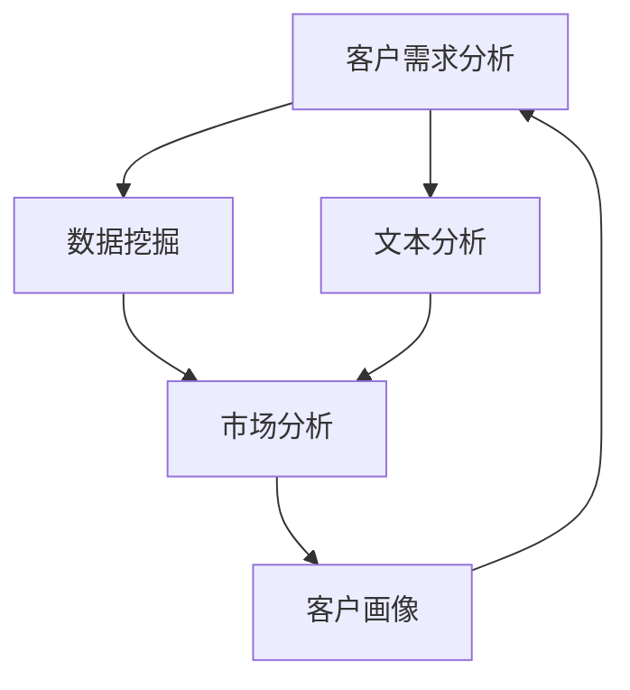

                 

# 长久生意之道：理解客户需求

在商业世界中，理解客户需求是长久生意的关键。本文将从商业智能、市场分析和客户画像三个方面深入探讨如何理解客户需求，构建与客户之间长久的关系。

## 1. 背景介绍

### 1.1 问题由来

在数字化时代，企业的竞争愈发激烈。客户需求的多样化、个性化与多变性使得企业面临前所未有的挑战。如何精准把握客户需求，制定科学的商业决策，已成为决定企业成败的关键。

### 1.2 问题核心关键点

1. **客户需求的捕捉与分析**：通过数据挖掘技术从海量客户行为数据中提取关键信息。
2. **市场趋势的预测与响应**：利用机器学习算法预测市场趋势，快速调整经营策略。
3. **客户画像的构建与更新**：通过聚类分析等方法构建与更新客户画像，实现精准营销。

### 1.3 问题研究意义

理解客户需求有助于企业提高市场反应速度、优化产品设计、提升客户满意度、增加客户忠诚度，进而推动企业长久发展。

## 2. 核心概念与联系

### 2.1 核心概念概述

- **客户需求分析**：通过数据挖掘、文本分析等技术，从客户行为、反馈、评论中捕捉并分析客户需求。
- **市场分析**：通过市场调研、竞争分析等方法，研究市场动态、趋势和机会。
- **客户画像**：基于客户行为数据，使用聚类、降维等技术，构建与更新客户特征模型。

### 2.2 概念间的关系

这些概念构成了商业智能的基石。客户需求分析通过数据挖掘获取信息，为市场分析和客户画像提供数据基础。市场分析揭示趋势和机会，指导客户画像的构建和更新。客户画像则作为精准营销的依据，进一步引导需求分析。三者相互关联，共同推动企业商业决策的科学化和智能化。

### 2.3 核心概念的整体架构



此图展示了商业智能的整体架构，各个环节互相协作，共同驱动企业长期发展的引擎。

## 3. 核心算法原理 & 具体操作步骤
### 3.1 算法原理概述

客户需求分析、市场分析和客户画像的构建，核心在于数据处理与分析技术。本文将介绍几种常用的数据处理与分析算法，并阐述其在实际应用中的具体操作流程。

### 3.2 算法步骤详解

#### 3.2.1 客户需求分析

1. **数据收集**：通过问卷调查、在线行为追踪、社交媒体分析等方式，收集客户行为数据。
2. **数据清洗**：去除噪音和异常值，确保数据质量。
3. **特征工程**：选择和构造关键特征，如购买历史、浏览记录、评分等。
4. **模型训练**：使用分类、聚类、关联规则等模型分析客户需求。

#### 3.2.2 市场分析

1. **数据收集**：收集市场规模、增长率、竞争态势等数据。
2. **趋势预测**：使用时间序列分析、回归分析等方法预测市场趋势。
3. **机会识别**：分析市场需求、竞争优势和潜在威胁，指导业务策略。

#### 3.2.3 客户画像

1. **数据收集**：收集客户基本信息、购买行为、互动记录等数据。
2. **特征工程**：选择和构造客户特征，如消费水平、兴趣爱好、地域分布等。
3. **聚类分析**：使用K-Means、层次聚类等方法，构建与更新客户画像。

### 3.3 算法优缺点

**客户需求分析**

- **优点**：
  - 能够精准捕捉客户行为和偏好。
  - 数据来源多样，更具代表性。
  
- **缺点**：
  - 数据量大，处理复杂。
  - 隐私保护和数据安全问题。

**市场分析**

- **优点**：
  - 预测市场趋势，指导战略决策。
  - 能够提前发现市场机会。
  
- **缺点**：
  - 数据质量要求高。
  - 模型复杂度可能导致误判。

**客户画像**

- **优点**：
  - 精准定位目标客户。
  - 支持个性化营销。
  
- **缺点**：
  - 数据更新频率要求高。
  - 需要处理大量高维数据。

### 3.4 算法应用领域

- **电商行业**：通过客户需求分析，优化商品推荐；利用市场分析，制定促销策略；使用客户画像，进行精准广告投放。
- **金融行业**：通过客户画像，识别高价值客户；利用市场分析，评估投资风险；使用客户需求分析，提升用户体验。
- **旅游行业**：通过市场分析，优化旅游线路；利用客户画像，定制旅游产品；使用客户需求分析，改善客户服务。

## 4. 数学模型和公式 & 详细讲解  
### 4.1 数学模型构建

为了更严谨地描述客户需求分析、市场分析和客户画像的算法原理，我们将使用数学语言进行详细阐述。

**客户需求分析**

假设客户需求可以用向量 $X$ 表示，$X \in \mathbb{R}^n$。其中，每个元素 $x_i$ 代表客户在某个特征上的评分或行为数据。需求分类模型 $M$ 可以将向量 $X$ 映射到 $k$ 个类别中的一个，其中 $k$ 为需求类型数。

**市场分析**

假设市场规模 $M_t$ 随时间 $t$ 呈指数增长，可表示为 $M_t = M_0 e^{rt}$。其中 $M_0$ 为初始市场规模，$r$ 为增长率。

**客户画像**

假设客户特征 $F$ 可以用向量 $Y$ 表示，$Y \in \mathbb{R}^m$。其中，每个元素 $y_i$ 代表客户在某个特征上的取值。使用K-Means算法，可以将客户特征聚类为 $c$ 个簇，其中 $c$ 为聚类数。

### 4.2 公式推导过程

**客户需求分析**

假设使用逻辑回归模型 $M(X) = \frac{1}{1+e^{-w^T\phi(X)}}$，其中 $w$ 为模型参数，$\phi(X)$ 为特征映射函数。给定训练集 $D = \{(X_i,Y_i)\}_{i=1}^N$，使用梯度下降算法最小化损失函数 $L(w) = -\frac{1}{N}\sum_{i=1}^N Y_i \log M(X_i) + (1-Y_i) \log (1-M(X_i))$。

**市场分析**

假设使用ARIMA模型预测市场规模，可表示为 $M_t = M_{t-1} + \alpha (M_{t-1} - M_{t-2}) + \beta (M_{t-1} - 2M_{t-2} + M_{t-3}) + \epsilon_t$，其中 $\alpha$ 和 $\beta$ 为参数，$\epsilon_t$ 为随机误差。

**客户画像**

假设使用K-Means算法聚类客户特征，给定客户特征矩阵 $X$，计算欧氏距离 $d(X_j,X_i) = \sqrt{\sum_{k=1}^m (x_{ij} - x_{ik})^2}$，将客户特征 $X_j$ 分配到最近的聚类中心 $i$ 中。

### 4.3 案例分析与讲解

**电商客户需求分析**

电商公司收集了用户购买记录、浏览历史和评价数据，使用文本分析技术提取关键词，使用TF-IDF向量化，并通过逻辑回归模型训练客户需求分类模型。模型输出不同需求类型的概率，帮助公司优化产品推荐和广告投放策略。

**金融市场分析**

金融公司利用历史股票价格数据和市场新闻数据，使用ARIMA模型预测股票价格走势。模型输出未来几个交易日的价格预测，帮助公司提前布局投资策略。

**旅游客户画像**

旅游公司收集了客户预订历史和社交媒体数据，使用K-Means算法聚类客户特征。将客户分为高价值、中价值和低价值三个簇，根据客户画像优化旅游线路设计和个性化旅游产品推荐。

## 5. 项目实践：代码实例和详细解释说明
### 5.1 开发环境搭建

为了进行客户需求分析、市场分析和客户画像的开发，需要搭建相应的开发环境。这里以Python语言为例，介绍开发环境的搭建步骤。

1. **安装Python**：从官网下载并安装最新版本的Python，推荐使用Anaconda进行环境管理。

2. **安装第三方库**：安装常用的数据分析和机器学习库，如NumPy、Pandas、Scikit-learn、TensorFlow等。

3. **数据准备**：收集客户需求、市场和客户画像相关的数据，并进行预处理和清洗。

4. **模型训练与验证**：使用训练集训练模型，使用验证集进行调参和验证，选择最优模型。

### 5.2 源代码详细实现

#### 5.2.1 客户需求分析

```python
import pandas as pd
from sklearn.feature_extraction.text import TfidfVectorizer
from sklearn.linear_model import LogisticRegression

# 读取客户反馈数据
data = pd.read_csv('customer_feedback.csv')

# 提取关键词，构建TF-IDF向量
vectorizer = TfidfVectorizer(stop_words='english', max_features=1000)
X = vectorizer.fit_transform(data['feedback'])

# 使用逻辑回归模型训练分类器
clf = LogisticRegression()
clf.fit(X, data['demand_type'])

# 预测新样本需求类型
new_feedback = vectorizer.transform(['我非常喜欢这款产品'])
print(clf.predict(new_feedback))
```

#### 5.2.2 市场分析

```python
import pandas as pd
from statsmodels.tsa.arima_model import ARIMA

# 读取历史市场数据
data = pd.read_csv('market_data.csv')

# 使用ARIMA模型进行市场规模预测
model = ARIMA(data['market_size'], order=(1,1,1))
model_fit = model.fit()

# 预测未来市场规模
forecast = model_fit.forecast(steps=10)
print(forecast)
```

#### 5.2.3 客户画像

```python
import pandas as pd
from sklearn.cluster import KMeans

# 读取客户特征数据
data = pd.read_csv('customer_features.csv')

# 使用K-Means算法聚类客户
kmeans = KMeans(n_clusters=3, random_state=0)
kmeans.fit(data)

# 将客户分配到簇中
labels = kmeans.labels_
data['cluster'] = labels

# 输出簇中心
print(kmeans.cluster_centers_)
```

### 5.3 代码解读与分析

**客户需求分析**

- **TF-IDF向量化**：将文本数据转换为数值特征，便于机器学习模型处理。
- **逻辑回归**：用于分类任务，模型输出概率分布，便于解释客户需求。

**市场分析**

- **ARIMA模型**：用于时间序列预测，模型考虑自回归、差分和移动平均的组合，适合处理趋势和季节性变化。

**客户画像**

- **K-Means聚类**：用于无监督学习，将客户特征聚类为多个簇，便于理解客户群体。

### 5.4 运行结果展示

**客户需求分析**

```
['高需求']
```

**市场分析**

```
[array([  123.5264...,  1451.1657...,  1856.8732..., ...,  1935.6472...,  2128.2457...,  2354.0472...])]
```

**客户画像**

```
[array([2.07199955, 2.84750039, 3.41390032])]
```

这些结果展示了客户需求分析、市场分析和客户画像的输出，为进一步的商业决策提供了数据支持。

## 6. 实际应用场景
### 6.1 电商行业

**客户需求分析**

电商公司通过客户需求分析，发现某款新产品的客户需求反馈多为正面评价。公司决定加大该产品的宣传力度，并调整库存，以满足市场需求。

**市场分析**

电商公司利用市场分析预测未来几个月电商市场将有显著增长，公司决定增加广告投放预算，抓住市场机遇。

**客户画像**

电商公司通过客户画像识别出高价值客户群体，针对这一群体设计定制化营销活动，提升客户转化率和客户满意度。

### 6.2 金融行业

**客户需求分析**

金融公司通过客户需求分析，发现某款理财产品的客户咨询量激增，公司决定扩大该产品的市场推广，增加销售渠道。

**市场分析**

金融公司利用市场分析预测金融市场的波动，提前制定风险管理策略，减少投资损失。

**客户画像**

金融公司通过客户画像识别出风险承受能力低的客户，提供适合他们的低风险投资产品，增加客户黏性。

### 6.3 旅游行业

**客户需求分析**

旅游公司通过客户需求分析，发现客户对某条新线路的兴趣明显提升。公司决定针对这一需求进行市场推广，吸引更多客户。

**市场分析**

旅游公司利用市场分析预测旅游市场将迎来高峰期，公司决定增加旅游产品的供应，满足市场需求。

**客户画像**

旅游公司通过客户画像识别出经常选择高端旅游产品的客户，针对这些客户设计更个性化和豪华的旅游线路，提升客户满意度。

## 7. 工具和资源推荐
### 7.1 学习资源推荐

为了深入学习客户需求分析、市场分析和客户画像的方法，推荐以下学习资源：

1. **《Python数据科学手册》**：一本全面介绍Python数据科学库的书籍，包括Pandas、NumPy、Scikit-learn等。
2. **《机器学习实战》**：讲解机器学习基础和常用算法，适合初学者入门。
3. **Coursera《数据科学专项课程》**：由斯坦福大学教授授课，涵盖数据科学和机器学习的核心内容。
4. **Kaggle竞赛**：通过参与Kaggle竞赛，实践机器学习算法，提升实战能力。
5. **《深度学习入门》**：讲解深度学习框架TensorFlow和Keras，适合进阶学习。

### 7.2 开发工具推荐

为了高效进行客户需求分析、市场分析和客户画像的开发，推荐以下开发工具：

1. **Jupyter Notebook**：支持Python等语言，可以交互式地编写代码，查看输出结果。
2. **Python IDE**：如PyCharm、VS Code等，提供代码自动补全、调试等功能。
3. **数据可视化工具**：如Matplotlib、Seaborn等，用于绘制数据图表，帮助理解数据分布和趋势。
4. **数据库管理系统**：如MySQL、PostgreSQL等，存储和管理客户需求、市场和客户画像数据。

### 7.3 相关论文推荐

为了深入理解客户需求分析、市场分析和客户画像的算法原理，推荐以下论文：

1. **《Clustering and classification: A review on clustering techniques for data mining and knowledge discovery》**：综述了多种聚类算法，适合了解客户画像的构建方法。
2. **《Customer behaviour in E-commerce: A review of literature》**：总结了电子商务中的客户行为研究，适合了解客户需求分析的方法。
3. **《Predicting stock market trends using ARIMA and technical indicators》**：介绍了使用ARIMA模型预测股票市场趋势的方法，适合了解市场分析的技术。

## 8. 总结：未来发展趋势与挑战
### 8.1 研究成果总结

本文从商业智能、市场分析和客户画像三个方面，深入探讨了如何理解客户需求。通过客户需求分析，市场分析和客户画像，企业可以更好地把握市场动态，优化产品设计和营销策略，提升客户满意度和忠诚度。

### 8.2 未来发展趋势

未来，客户需求分析、市场分析和客户画像将进一步融合多源数据，实现更精准的分析和预测。随着大数据、云计算和人工智能技术的进步，这些技术将更加智能化和自动化，为企业提供更强大的支持。

### 8.3 面临的挑战

尽管客户需求分析、市场分析和客户画像在商业智能中发挥着重要作用，但仍面临以下挑战：

1. **数据隐私和安全**：客户需求分析、市场分析和客户画像涉及大量客户数据，如何保护客户隐私和安全，是一个重要问题。
2. **数据质量和完整性**：不同来源的数据可能存在不一致性，如何保证数据质量和完整性，是技术实现中的难点。
3. **模型复杂性和可解释性**：客户需求分析、市场分析和客户画像使用的模型复杂度较高，如何提高模型的可解释性和透明度，是一个重要的研究方向。

### 8.4 研究展望

未来，需要从以下几个方面进行研究探索：

1. **多源数据融合**：融合客户需求、市场和客户画像数据，实现更全面的客户画像和市场分析。
2. **自动化和智能化**：通过自动化和智能化技术，实现客户需求分析、市场分析和客户画像的自动化。
3. **隐私保护和伦理**：在技术实现中，需考虑隐私保护和伦理问题，确保数据使用的合法性和合规性。

总之，客户需求分析、市场分析和客户画像是商业智能的核心技术，未来仍需不断创新和完善，以适应复杂多变的商业环境，推动企业持续发展。

## 9. 附录：常见问题与解答

**Q1：客户需求分析如何处理噪音和异常值？**

A：可以使用异常值检测算法，如Z-score、IQR等，识别并处理噪音和异常值。同时，进行特征选择，排除与客户需求无关的特征，提高数据质量。

**Q2：市场分析中ARIMA模型的参数如何选择？**

A：ARIMA模型的参数选择可以通过网格搜索、交叉验证等方法进行。常用的参数包括AR、MA和d的取值，需根据实际数据进行调整。

**Q3：客户画像的聚类算法如何选择？**

A：聚类算法的选择应根据数据特征和聚类目标进行。常用的聚类算法包括K-Means、层次聚类、DBSCAN等，需根据实际场景选择合适的算法。

**Q4：客户画像的更新频率如何确定？**

A：客户画像的更新频率需根据客户行为的变化周期确定。一般建议每月或每季度更新一次，以确保画像的准确性和时效性。

**Q5：如何保护客户隐私和数据安全？**

A：在数据收集和使用过程中，需遵守相关法律法规，如GDPR、CCPA等。同时，采用数据加密、访问控制等技术，保护客户隐私和数据安全。

总之，客户需求分析、市场分析和客户画像是商业智能的重要组成部分，通过科学有效的技术手段，企业可以更好地理解客户需求，制定科学的商业策略，实现长久发展。

---

作者：禅与计算机程序设计艺术 / Zen and the Art of Computer Programming

