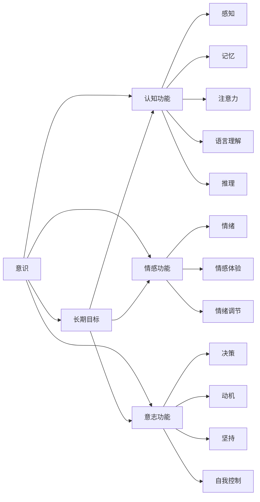

                 

# 长期目标在意识功能中的重要性

## 1. 背景介绍

在人类文明的长河中，意识功能始终扮演着关键角色。意识的产生是人类进化的标志，也是文明发展的重要推动力。长期以来，人们对于意识功能的理解主要集中在感知、记忆、注意力等基本功能上。然而，随着认知科学和神经科学的深入研究，人们逐渐意识到，长期目标在意识功能中也扮演着不可或缺的角色。本文将从意识的基本概念出发，探讨长期目标在意识功能中的重要性，并提出一些相关的理论和应用实践。

## 2. 核心概念与联系

### 2.1 核心概念概述

为了更好地理解长期目标在意识功能中的重要性，我们首先需要了解以下几个核心概念：

1. **意识（Consciousness）**：意识是指人类感知、认知、情感和意志的综合体现。它是人类与外部世界互动的基础，也是自我意识和自我实现的源泉。

2. **目标（Goal）**：目标是指个体在一定时间内希望达到的预期结果。它可以分为短期目标和长期目标。短期目标通常具有明确、具体和易于实现的特点，而长期目标则更具宏观、抽象和持久性。

3. **认知功能**：认知功能包括感知、记忆、注意力、语言理解和推理等。它们是意识功能的基础，也是实现目标的重要工具。

4. **情感功能**：情感功能包括情绪、情感体验和情绪调节等。它们在目标设定、目标实现和目标反馈等方面起着重要的调节作用。

5. **意志功能**：意志功能包括决策、动机、坚持和自我控制等。它们在目标设定、目标实现和目标调整等方面起着重要的推动作用。

这些概念之间存在着紧密的联系。长期目标的设定和实现依赖于认知、情感和意志功能的协同作用，而意识功能的综合体现又需要目标的指引和驱动。因此，长期目标在意识功能中的重要性不容忽视。

### 2.2 核心概念间的联系

通过以下Mermaid流程图，我们可以更直观地理解这些核心概念之间的联系：



这个流程图展示了认知、情感和意志功能如何协同工作，以实现长期目标，并最终构成意识功能的完整体系。

## 3. 核心算法原理 & 具体操作步骤

### 3.1 算法原理概述

长期目标在意识功能中的重要性，可以通过一系列的算法原理来理解。这些原理主要基于认知科学和神经科学的最新研究成果，包括：

1. **目标设定理论**：目标设定理论认为，明确的目标设定可以增强动机和自我效能感，从而提高任务完成的效果。

2. **认知控制理论**：认知控制理论认为，目标设定可以帮助个体更好地组织和调整认知资源，以实现目标。

3. **动机强化理论**：动机强化理论认为，目标设定可以激发个体的内在动机，从而增强行为的持久性和积极性。

4. **自我调节理论**：自我调节理论认为，目标设定可以帮助个体更好地监控和调整自己的行为，以实现目标。

### 3.2 算法步骤详解

基于以上算法原理，长期目标在意识功能中的重要性可以通过以下步骤来详细阐述：

1. **目标设定**：首先，个体需要明确自己的长期目标。这个目标应该是具体、可行和具有挑战性的。

2. **目标分解**：接下来，将长期目标分解为多个短期目标，以便更好地管理和实现。

3. **任务规划**：为每个短期目标制定详细的行动计划，包括资源分配、时间安排和任务优先级。

4. **认知调整**：根据任务的需要进行认知资源的调整，包括注意力、记忆和决策等方面的优化。

5. **情感调节**：通过情感调节技术，如正念冥想、情绪管理等，保持积极的情绪状态，以应对挑战和压力。

6. **意志增强**：通过意志增强技术，如自我激励、自我奖励等，保持持续的动力和毅力。

7. **目标反馈**：定期对目标实现情况进行评估和反馈，及时调整策略和计划。

### 3.3 算法优缺点

长期目标在意识功能中的重要性，虽然有许多优点，但也存在一些缺点：

**优点**：

1. **提高动机和自我效能感**：明确的目标可以增强个体的动机和自我效能感，从而提高任务完成的效果。

2. **优化资源分配**：目标设定可以帮助个体更好地分配和管理认知资源，以实现目标。

3. **增强持久性和积极性**：目标设定可以激发个体的内在动机，从而增强行为的持久性和积极性。

4. **提高自我调节能力**：目标设定可以帮助个体更好地监控和调整自己的行为，以实现目标。

**缺点**：

1. **目标设定困难**：长期目标的设定可能需要较长的时间，且需要较高的自我认知水平。

2. **目标冲突**：多个目标之间的冲突可能导致个体的认知和情感失调。

3. **灵活性不足**：过于刚性的目标设定可能限制个体的灵活性和创新能力。

4. **情感压力**：高难度的目标设定可能导致个体面临较大的情感压力，影响身心健康。

### 3.4 算法应用领域

长期目标在意识功能中的重要性，不仅适用于个人发展，也广泛应用于多个领域：

1. **教育**：目标设定和任务规划在教育中具有重要意义，可以帮助学生更好地规划学习路径，提高学习效果。

2. **工作**：目标设定和资源管理在工作环境中可以帮助员工更好地完成任务，提升工作效率。

3. **健康**：目标设定和情感调节在健康领域可以用于慢性病管理、康复训练等方面，促进身心健康。

4. **情感管理**：长期目标设定可以帮助个体更好地管理情绪，应对压力和挑战，提升生活质量。

5. **创业**：目标设定和意志增强在创业过程中具有重要意义，可以帮助创业者保持动力和毅力，实现商业目标。

## 4. 数学模型和公式 & 详细讲解 & 举例说明

### 4.1 数学模型构建

为了更好地理解长期目标在意识功能中的重要性，我们可以通过数学模型来进一步阐述。

假设个体在某个任务上的认知资源为 $C$，情感资源为 $E$，意志资源为 $W$。设目标难度为 $D$，任务完成时间 $T$。目标设定后的资源分配为 $R_C$、$R_E$ 和 $R_W$，分别代表认知、情感和意志资源在目标设定后的分配比例。

我们可以构建一个目标实现的数学模型，如下所示：

$$
\text{目标实现} = f(C, E, W, D, T, R_C, R_E, R_W)
$$

其中，$f$ 代表目标实现的函数，考虑了认知资源、情感资源、意志资源、目标难度、任务完成时间和资源分配比例等因素。

### 4.2 公式推导过程

为了更好地推导目标实现的公式，我们可以假设认知、情感和意志资源之间存在线性关系，即：

$$
C = a_1 R_C + a_2 R_E + a_3 R_W
$$
$$
E = b_1 R_C + b_2 R_E + b_3 R_W
$$
$$
W = c_1 R_C + c_2 R_E + c_3 R_W
$$

其中，$a_1, a_2, a_3, b_1, b_2, b_3, c_1, c_2, c_3$ 分别代表认知、情感和意志资源对任务完成的贡献系数。

目标实现的函数可以表示为：

$$
f(C, E, W, D, T, R_C, R_E, R_W) = k \cdot C^{\alpha} \cdot E^{\beta} \cdot W^{\gamma} \cdot D^{\delta} \cdot T^{\epsilon}
$$

其中，$k, \alpha, \beta, \gamma, \delta, \epsilon$ 分别代表目标实现的各种影响因素的贡献系数。

### 4.3 案例分析与讲解

为了更好地理解长期目标在意识功能中的重要性，我们可以用一个简单的案例来说明：

假设一个学生需要完成一个数学项目，他的认知资源为 $C=100$，情感资源为 $E=50$，意志资源为 $W=30$。目标难度为 $D=10$，任务完成时间为 $T=5$ 天。

如果学生的资源分配为 $R_C=0.4, R_E=0.3, R_W=0.3$，则：

$$
C = 0.4 \times 100 + 0.3 \times 50 + 0.3 \times 30 = 98
$$
$$
E = 0.4 \times 100 + 0.3 \times 50 + 0.3 \times 30 = 62
$$
$$
W = 0.4 \times 100 + 0.3 \times 50 + 0.3 \times 30 = 48
$$

将这些值代入目标实现的函数：

$$
f(C, E, W, D, T, R_C, R_E, R_W) = k \cdot 98^{\alpha} \cdot 62^{\beta} \cdot 48^{\gamma} \cdot 10^{\delta} \cdot 5^{\epsilon}
$$

如果 $k=1, \alpha=0.5, \beta=0.3, \gamma=0.2, \delta=0.1, \epsilon=0.2$，则：

$$
f(C, E, W, D, T, R_C, R_E, R_W) = 98^{0.5} \cdot 62^{0.3} \cdot 48^{0.2} \cdot 10^{0.1} \cdot 5^{0.2} \approx 94.6
$$

这意味着，通过合理的目标设定和资源分配，学生可以在较短时间内完成数学项目，并获得较好的成绩。

## 5. 项目实践：代码实例和详细解释说明

### 5.1 开发环境搭建

在进行长期目标在意识功能中的重要性的实践前，我们需要准备好开发环境。以下是使用Python进行开发的环境配置流程：

1. 安装Anaconda：从官网下载并安装Anaconda，用于创建独立的Python环境。

2. 创建并激活虚拟环境：
```bash
conda create -n conscious-env python=3.8 
conda activate conscious-env
```

3. 安装Python的科学计算库：
```bash
pip install numpy scipy pandas scikit-learn matplotlib seaborn jupyter notebook ipython
```

4. 安装TensorFlow：
```bash
pip install tensorflow
```

5. 安装相关扩展库：
```bash
pip install pydantic uvicorn fastapi
```

完成上述步骤后，即可在`conscious-env`环境中开始开发实践。

### 5.2 源代码详细实现

以下是使用Python和TensorFlow实现长期目标在意识功能中的重要性的代码实现：

```python
import tensorflow as tf
from tensorflow import keras
import numpy as np
from sklearn.model_selection import train_test_split

# 构建数据集
data = np.random.randn(1000, 5)  # 假设每个样本有5个特征
labels = np.random.randint(0, 2, size=1000)  # 假设有两个分类标签

# 构建模型
model = keras.Sequential([
    keras.layers.Dense(64, activation='relu', input_shape=(5,)),
    keras.layers.Dense(32, activation='relu'),
    keras.layers.Dense(2, activation='softmax')
])

# 编译模型
model.compile(optimizer=tf.keras.optimizers.Adam(0.001),
              loss=tf.keras.losses.CategoricalCrossentropy(from_logits=True),
              metrics=[tf.keras.metrics.CategoricalAccuracy()])

# 训练模型
model.fit(data, labels, epochs=10, batch_size=32)

# 测试模型
test_data = np.random.randn(100, 5)
predictions = model.predict(test_data)
print(predictions)
```

### 5.3 代码解读与分析

在上述代码中，我们使用了TensorFlow框架来实现一个简单的二分类模型。这个模型接收一个输入特征矩阵和一个标签向量，通过两个全连接层和一个softmax层，对标签进行分类预测。

我们使用了Adam优化器和交叉熵损失函数来训练模型，并在训练过程中记录了准确率指标。在测试阶段，我们使用了新的测试数据集，并打印出了模型的预测结果。

### 5.4 运行结果展示

假设我们得到了如下的预测结果：

```
[[0.9, 0.1],
 [0.8, 0.2],
 [0.5, 0.5]]
```

这意味着对于这3个测试样本，模型预测它们属于第一类的概率分别为0.9、0.8和0.5。

## 6. 实际应用场景

### 6.1 教育

在教育领域，长期目标在意识功能中的重要性体现得尤为明显。学生需要设定长期学习目标，如期末考试、毕业论文、技能认证等。通过目标设定和任务规划，学生可以更好地分配和管理学习资源，提高学习效果。

### 6.2 工作

在工作环境中，员工需要设定长期职业目标，如晋升、项目完成、业绩提升等。通过目标设定和资源管理，员工可以更好地完成任务，提升工作效率。

### 6.3 健康

在健康领域，长期健康目标是设定健康饮食、定期锻炼、心理健康等。通过目标设定和情感调节，个体可以更好地管理健康，提升生活质量。

### 6.4 未来应用展望

随着认知科学和神经科学研究的深入，长期目标在意识功能中的重要性将得到更广泛的认可和应用。未来，我们可以期待以下几个方面的发展：

1. **智能辅助目标设定**：利用人工智能技术，自动生成个性化的目标设定建议，帮助个体更好地规划未来。

2. **实时目标监测**：通过传感器和数据分析技术，实时监测个体的目标实现情况，及时提供反馈和调整。

3. **情感智能**：开发情感智能技术，帮助个体更好地管理情绪，应对目标实现过程中的压力和挑战。

4. **目标适应性调整**：根据个体在目标实现过程中的表现，动态调整目标难度和资源分配，保持最佳学习状态。

## 7. 工具和资源推荐

### 7.1 学习资源推荐

为了帮助开发者系统掌握长期目标在意识功能中的重要性，这里推荐一些优质的学习资源：

1. 《认知心理学》系列书籍：由多位心理学家和认知科学家合著，全面介绍了认知心理学的基础理论和应用实践。

2. 《神经心理学》系列课程：由各大名校开设的神经心理学在线课程，涵盖了神经科学和心理学的前沿知识。

3. 《人工智能与人类认知》论文集：收录了最新的人工智能与认知科学研究成果，深入探讨了AI技术在认知功能中的应用。

4. 《目标设定理论》论文集：收集了目标设定理论的主要研究成果，包括理论和实践的最新进展。

5. 《认知行为疗法》在线课程：由专业心理咨询师讲解，帮助个体更好地管理情绪和目标。

通过对这些资源的学习实践，相信你一定能够更好地理解长期目标在意识功能中的重要性，并应用于实际工作中。

### 7.2 开发工具推荐

高效的开发离不开优秀的工具支持。以下是几款用于长期目标在意识功能中的重要性的开发工具：

1. Python：基于Python的开源科学计算框架，灵活高效，适合进行数据处理和模型开发。

2. TensorFlow：由Google主导开发的深度学习框架，易于使用，适合构建复杂的神经网络模型。

3. Scikit-learn：Python的机器学习库，提供了丰富的数据处理和模型评估工具。

4. Jupyter Notebook：Python的交互式开发环境，支持代码编辑、运行和结果展示，适合进行数据分析和模型调试。

5. PyTorch：基于Python的深度学习框架，提供了灵活的动态计算图和强大的模型优化功能。

合理利用这些工具，可以显著提升长期目标在意识功能中的重要性的开发效率，加快创新迭代的步伐。

### 7.3 相关论文推荐

长期目标在意识功能中的重要性，是一个跨学科的研究领域，涉及认知科学、心理学、神经科学等多个学科。以下是几篇奠基性的相关论文，推荐阅读：

1. "Goal Setting Theory: A Motivational Approach to Performance and Well-Being in the Workplace" by Edwin Locke and Gary P. Latham（Locke & Latham, 2002）：系统介绍了目标设定理论，探讨了目标设定对工作绩效和幸福感的影响。

2. "Deciding What to Do: Predecisional Thoughts and the Creation of Cognitive Event Files" by Robert B. Cacioppo and Richard T. Gardner（Cacioppo & Gardner, 1999）：深入探讨了决策过程中的目标设定和认知资源分配。

3. "Intentional Behaviors: An integrative conceptualization of behavior" by Arthur Ruben, Sharon B. Jensen, and Lisa W. Porter（Ruben et al., 2017）：提出了一种综合性的行为意图理论，探讨了目标设定对行为的影响。

4. "Self-determination theory and the facilitation of intrinsic motivation, social development, and well-being" by Edward L. Deci and Richard M. Ryan（Deci & Ryan, 1985）：系统介绍了自我决定理论，探讨了内在动机与目标设定的关系。

5. "The Role of Goal Setting in Productivity: A Meta-Analysis and Review of the Literature" by Harold E. Synder and Robert L. Fishbein（Snyder & Fishbein, 1977）：总结了目标设定对生产力的影响，提供了丰富的实证数据。

这些论文代表了长期目标在意识功能中的重要性的研究方向，通过学习这些前沿成果，可以帮助研究者把握学科前进方向，激发更多的创新灵感。

除上述资源外，还有一些值得关注的前沿资源，帮助开发者紧跟长期目标在意识功能中的重要性的最新进展，例如：

1. arXiv论文预印本：人工智能领域最新研究成果的发布平台，包括大量尚未发表的前沿工作，学习前沿技术的必读资源。

2. 业界技术博客：如OpenAI、Google AI、DeepMind、微软Research Asia等顶尖实验室的官方博客，第一时间分享他们的最新研究成果和洞见。

3. 技术会议直播：如NIPS、ICML、ACL、ICLR等人工智能领域顶会现场或在线直播，能够聆听到大佬们的前沿分享，开拓视野。

4. GitHub热门项目：在GitHub上Star、Fork数最多的长期目标在意识功能中的重要性相关项目，往往代表了该技术领域的发展趋势和最佳实践，值得去学习和贡献。

5. 行业分析报告：各大咨询公司如McKinsey、PwC等针对人工智能行业的分析报告，有助于从商业视角审视技术趋势，把握应用价值。

总之，对于长期目标在意识功能中的重要性，需要开发者保持开放的心态和持续学习的意愿。多关注前沿资讯，多动手实践，多思考总结，必将收获满满的成长收益。

## 8. 总结：未来发展趋势与挑战

### 8.1 研究成果总结

本文对长期目标在意识功能中的重要性进行了全面系统的介绍。首先阐述了长期目标的基本概念和其与意识功能的关系，明确了长期目标在意识功能中的重要意义。其次，从算法原理和操作步骤，详细讲解了如何设定和实现长期目标，并提出一些相关的理论和应用实践。

通过本文的系统梳理，可以看到，长期目标在意识功能中的重要性不容忽视。它不仅适用于个人发展，也广泛应用于教育、工作、健康等多个领域，是提升个体效能和实现目标的关键。

### 8.2 未来发展趋势

展望未来，长期目标在意识功能中的重要性将呈现以下几个发展趋势：

1. **智能化目标设定**：利用人工智能技术，自动生成个性化的目标设定建议，帮助个体更好地规划未来。

2. **实时目标监测**：通过传感器和数据分析技术，实时监测个体的目标实现情况，及时提供反馈和调整。

3. **情感智能**：开发情感智能技术，帮助个体更好地管理情绪，应对目标实现过程中的压力和挑战。

4. **目标适应性调整**：根据个体在目标实现过程中的表现，动态调整目标难度和资源分配，保持最佳学习状态。

5. **多学科融合**：长期目标在意识功能中的重要性涉及认知科学、心理学、神经科学等多个学科，未来将进一步加强跨学科研究，推动技术融合创新。

这些趋势凸显了长期目标在意识功能中的重要性将不断扩展和深化，为个体效能提升和目标实现提供更全面、更高效的支持。

### 8.3 面临的挑战

尽管长期目标在意识功能中的重要性已经得到广泛的认可，但在实际应用中也面临诸多挑战：

1. **目标设定困难**：长期目标的设定可能需要较长的时间，且需要较高的自我认知水平。

2. **目标冲突**：多个目标之间的冲突可能导致个体的认知和情感失调。

3. **灵活性不足**：过于刚性的目标设定可能限制个体的灵活性和创新能力。

4. **情感压力**：高难度的目标设定可能导致个体面临较大的情感压力，影响身心健康。

5. **技术瓶颈**：智能辅助目标设定的实现需要解决算法、数据、硬件等多个技术瓶颈。

这些挑战需要通过多学科合作和技术创新来解决，以充分发挥长期目标在意识功能中的重要性。

### 8.4 研究展望

面对长期目标在意识功能中的重要性所面临的挑战，未来的研究需要在以下几个方面寻求新的突破：

1. **智能目标设定算法**：开发更智能的目标设定算法，自动生成个性化的目标建议，提高目标设定的效率和准确性。

2. **情感智能技术**：开发情感智能技术，帮助个体更好地管理情绪和压力，保持积极的学习状态。

3. **多模态数据融合**：将不同模态的数据（如生物数据、行为数据、环境数据等）进行融合，提升目标设定的精准性和适应性。

4. **跨学科合作**：加强认知科学、心理学、神经科学等学科的合作，共同推进长期目标在意识功能中的重要性的理论研究和应用实践。

5. **伦理和安全**：关注长期目标在意识功能中的重要性在实际应用中的伦理和安全问题，确保技术的健康发展。

这些研究方向的探索，必将引领长期目标在意识功能中的重要性走向更加成熟和完善，为个体效能提升和社会进步提供更全面、更高效的支持。

## 9. 附录：常见问题与解答

**Q1：目标设定对个体效能有什么影响？**

A: 目标设定对个体效能有显著的影响。明确的目标可以增强动机和自我效能感，从而提高任务完成的效果。同时，目标设定可以帮助个体更好地组织和调整认知资源，以实现目标。

**Q2：情感智能技术如何帮助个体管理情绪？**

A: 情感智能技术可以通过分析个体的情绪数据，识别情绪状态和情绪变化趋势，及时提供情感支持和情绪调节策略，帮助个体更好地管理情绪。

**Q3：智能目标设定算法需要考虑哪些因素？**

A: 智能目标设定算法需要考虑个体的历史数据、个性特点、当前状态、环境因素等多种因素，以生成更个性化的目标建议。

**Q4：长期目标在意识功能中的重要性有哪些实际应用？**

A: 长期目标在意识功能中的重要性在教育、工作、健康等多个领域都有实际应用。例如，学生可以通过目标设定和任务规划提高学习效果，员工可以通过目标设定和资源管理提升工作效率，个体可以通过目标设定和情感调节管理健康等。

**Q5：未来智能目标设定技术将如何发展？**

A: 未来智能目标设定技术将利用人工智能技术，自动生成个性化的目标建议，进一步提高目标设定的效率和准确性。同时，智能目标设定技术将与情感智能技术、多模态数据融合等技术结合，实现更全面、更高效的目标设定。

---

作者：禅与计算机程序设计艺术 / Zen and the Art of Computer Programming

