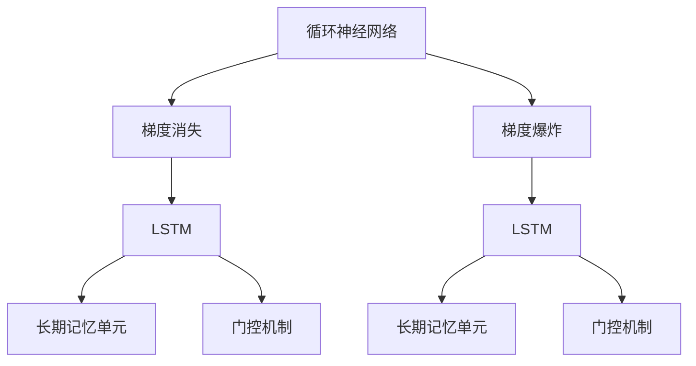

                 

# 长短时记忆网络 (LSTM) 原理与代码实例讲解

> 关键词：长短时记忆网络,循环神经网络,梯度消失,梯度爆炸,梯度裁剪,长期依赖,存储单元,门控机制,序列建模,序列生成

## 1. 背景介绍

### 1.1 问题由来

循环神经网络 (Recurrent Neural Networks, RNNs) 是一种处理序列数据的神经网络结构，能够在时间维度上保持序列信息，广泛应用于自然语言处理 (NLP)、语音识别、时间序列预测等领域。然而，标准RNNs存在梯度消失和梯度爆炸的问题，导致难以训练深层网络，限制了其在长序列建模中的应用。

长短时记忆网络 (Long Short-Term Memory, LSTM) 是RNNs的一个变体，通过引入门控机制和长期记忆单元，成功解决了梯度消失问题，能够高效处理长序列数据。LSTM不仅在序列建模任务上取得了突破，还广泛应用于时间序列预测、自然语言生成、音频信号处理等领域。

### 1.2 问题核心关键点

LSTM的核心思想是通过引入门控机制来控制信息流，使得模型能够在不同时间步选择性地忘记或记住过去的信息，从而更好地处理长序列数据。LSTM引入了三个门控单元：遗忘门 (Forget Gate)、输入门 (Input Gate) 和输出门 (Output Gate)，配合长期记忆单元 (Cell State) 实现序列信息的有效存储和传递。

- **遗忘门**：控制上一个时间步的记忆单元中哪些信息应该被遗忘，哪些信息应该被保留。
- **输入门**：控制新的信息应该被多少地添加到记忆单元中。
- **输出门**：控制当前时间步的输出应该是记忆单元中的哪一部分信息。

LSTM的存储单元具有非线性特性，能够在保持信息长期依赖的同时，缓解梯度消失问题。其门控机制通过激活函数 sigmoid 和 tanh 实现，灵活控制信息的传递。

## 2. 核心概念与联系

### 2.1 核心概念概述

为更好地理解LSTM的工作原理，本节将介绍几个密切相关的核心概念：

- **循环神经网络 (RNN)**：一种处理序列数据的神经网络，通过在时间维度上重复应用相同的结构，能够保持序列信息。但RNNs存在梯度消失和梯度爆炸的问题，难以训练深层网络。

- **梯度消失 (Vanishing Gradient)**：在RNNs中，由于链式法则的传递，后向传播的梯度会在时间维度上逐渐衰减，导致深层网络的训练变得困难。

- **梯度爆炸 (Exploding Gradient)**：在RNNs中，后向传播的梯度可能会指数级增长，导致模型参数被迅速更新，难以稳定训练。

- **长短时记忆网络 (LSTM)**：一种循环神经网络的变体，通过引入门控机制和长期记忆单元，解决了梯度消失和梯度爆炸的问题，能够高效处理长序列数据。

- **长期记忆单元 (Cell State)**：LSTM的核心组件，用于存储序列信息，并实现信息的长期依赖。

- **门控机制**：包括遗忘门、输入门和输出门，用于控制信息的流动，使得模型能够灵活地选择性地记住或忘记过去的信息。

这些核心概念之间的逻辑关系可以通过以下Mermaid流程图来展示：



这个流程图展示了大语言模型微调过程中各个核心概念的关系和作用：

1. RNNs存在梯度消失和梯度爆炸问题，限制了其深层网络的训练。
2. LSTM通过引入门控机制和长期记忆单元，成功解决了这些问题。
3. 门控机制使得LSTM能够在不同时间步选择性地忘记或记住过去的信息。
4. 长期记忆单元用于存储序列信息，实现信息的长期依赖。

这些概念共同构成了LSTM的工作原理和优化方向，使其能够在各种序列建模任务中发挥强大的能力。

### 2.2 概念间的关系

这些核心概念之间存在着紧密的联系，形成了LSTM的完整架构：

- **RNNs与LSTM的关系**：LSTM是RNNs的一个变体，通过门控机制和长期记忆单元解决了梯度消失和梯度爆炸的问题。

- **梯度消失与梯度爆炸的关系**：梯度消失和梯度爆炸是RNNs中普遍存在的问题，LSTM通过门控机制缓解了这些问题。

- **门控机制与长期记忆单元的关系**：门控机制用于控制信息的流动，长期记忆单元用于存储序列信息。

- **LSTM与长期记忆单元的关系**：LSTM的核心组件是长期记忆单元，通过门控机制实现信息的存储和传递。

这些概念共同构成了LSTM的完整架构，使其能够在各种序列建模任务中发挥强大的能力。通过理解这些核心概念，我们可以更好地把握LSTM的工作原理和优化方向。

## 3. 核心算法原理 & 具体操作步骤
### 3.1 算法原理概述

LSTM的核心思想是通过引入门控机制来控制信息流，使得模型能够在不同时间步选择性地忘记或记住过去的信息，从而更好地处理长序列数据。LSTM引入了三个门控单元：遗忘门 (Forget Gate)、输入门 (Input Gate) 和输出门 (Output Gate)，配合长期记忆单元 (Cell State) 实现序列信息的有效存储和传递。

LSTM的数学模型可以表示为：

$$
\begin{aligned}
f_t &= \sigma(W_f \cdot [h_{t-1}, x_t] + b_f) \\
i_t &= \sigma(W_i \cdot [h_{t-1}, x_t] + b_i) \\
o_t &= \sigma(W_o \cdot [h_{t-1}, x_t] + b_o) \\
g_t &= \tanh(W_g \cdot [h_{t-1}, x_t] + b_g) \\
c_t &= f_t \cdot c_{t-1} + i_t \cdot g_t \\
h_t &= o_t \cdot \tanh(c_t)
\end{aligned}
$$

其中，$f_t$、$i_t$、$o_t$ 为门控单元的激活值，$g_t$ 为长期记忆单元的更新值，$h_t$ 为当前时间步的输出。$\sigma$ 为激活函数 sigmoid，$\tanh$ 为 tanh 激活函数。

- **遗忘门**：通过 sigmoid 函数计算遗忘门的激活值，决定上一个时间步的记忆单元 $c_{t-1}$ 中有多少信息应该被遗忘。

- **输入门**：通过 sigmoid 函数计算输入门的激活值，决定新的信息 $g_t$ 有多少地被添加到记忆单元 $c_t$ 中。

- **输出门**：通过 sigmoid 函数计算输出门的激活值，决定当前时间步的输出 $h_t$ 中应该有多少记忆单元 $c_t$ 的信息被传递出来。

- **长期记忆单元**：通过 tanh 函数计算长期记忆单元 $g_t$，将其与遗忘门 $f_t$ 和输入门 $i_t$ 相乘，更新记忆单元 $c_t$。

- **输出**：通过 tanh 函数计算当前时间步的输出 $h_t$，并将其与输出门 $o_t$ 相乘，获得最终输出。

### 3.2 算法步骤详解

LSTM的训练步骤如下：

1. 初始化长期记忆单元 $c_0$ 和隐藏状态 $h_0$。
2. 对于每个时间步 $t$，计算门控单元的激活值 $f_t$、$i_t$、$o_t$ 和长期记忆单元的更新值 $g_t$。
3. 更新记忆单元 $c_t$。
4. 计算当前时间步的输出 $h_t$。
5. 反向传播计算梯度，更新模型参数。

具体实现时，LSTM的网络结构可以使用循环神经网络的结构，每一层包含遗忘门、输入门、输出门和长期记忆单元。

### 3.3 算法优缺点

LSTM的优点包括：

- **梯度消失问题缓解**：通过门控机制和长期记忆单元，有效缓解了梯度消失和梯度爆炸问题，使得深层LSTM网络能够高效训练。

- **长序列建模能力**：LSTM能够处理长序列数据，适合于语音识别、时间序列预测等需要长期记忆的任务。

- **灵活的门控机制**：门控机制使得LSTM能够灵活地选择性地记住或忘记过去的信息，提升模型对序列数据的理解能力。

LSTM的缺点包括：

- **计算复杂度较高**：LSTM的计算复杂度较高，训练和推理速度较慢。

- **模型参数较多**：LSTM的参数量较大，需要更多的训练数据和计算资源。

- **难以理解**：LSTM的结构和门控机制较为复杂，不容易理解其内部工作机制。

### 3.4 算法应用领域

LSTM广泛应用于以下领域：

- **自然语言处理**：包括文本分类、机器翻译、文本生成、情感分析等任务。LSTM能够处理序列数据，提取文本中的长期依赖关系，实现高效的序列建模。

- **语音识别**：LSTM能够处理音频信号，提取语音中的长期依赖关系，实现高效的语音识别。

- **时间序列预测**：LSTM能够处理时间序列数据，提取时间序列中的长期依赖关系，实现高效的时间序列预测。

- **音频信号处理**：LSTM能够处理音频信号，提取音频中的长期依赖关系，实现高效的音频信号处理。

## 4. 数学模型和公式 & 详细讲解  
### 4.1 数学模型构建

LSTM的数学模型可以表示为：

$$
\begin{aligned}
f_t &= \sigma(W_f \cdot [h_{t-1}, x_t] + b_f) \\
i_t &= \sigma(W_i \cdot [h_{t-1}, x_t] + b_i) \\
o_t &= \sigma(W_o \cdot [h_{t-1}, x_t] + b_o) \\
g_t &= \tanh(W_g \cdot [h_{t-1}, x_t] + b_g) \\
c_t &= f_t \cdot c_{t-1} + i_t \cdot g_t \\
h_t &= o_t \cdot \tanh(c_t)
\end{aligned}
$$

其中，$f_t$、$i_t$、$o_t$ 为门控单元的激活值，$g_t$ 为长期记忆单元的更新值，$h_t$ 为当前时间步的输出。$\sigma$ 为激活函数 sigmoid，$\tanh$ 为 tanh 激活函数。

- **遗忘门**：通过 sigmoid 函数计算遗忘门的激活值，决定上一个时间步的记忆单元 $c_{t-1}$ 中有多少信息应该被遗忘。

- **输入门**：通过 sigmoid 函数计算输入门的激活值，决定新的信息 $g_t$ 有多少地被添加到记忆单元 $c_t$ 中。

- **输出门**：通过 sigmoid 函数计算输出门的激活值，决定当前时间步的输出 $h_t$ 中应该有多少记忆单元 $c_t$ 的信息被传递出来。

- **长期记忆单元**：通过 tanh 函数计算长期记忆单元 $g_t$，将其与遗忘门 $f_t$ 和输入门 $i_t$ 相乘，更新记忆单元 $c_t$。

- **输出**：通过 tanh 函数计算当前时间步的输出 $h_t$，并将其与输出门 $o_t$ 相乘，获得最终输出。

### 4.2 公式推导过程

LSTM的公式推导过程相对复杂，主要涉及以下几个步骤：

1. 定义门控单元的激活函数 $\sigma$ 和 tanh 函数 $\tanh$。
2. 根据门控单元的激活函数，计算遗忘门、输入门和输出门的激活值。
3. 根据长期记忆单元的更新值，计算新的记忆单元 $c_t$。
4. 根据记忆单元和输出门，计算当前时间步的输出 $h_t$。

以文本分类任务为例，LSTM的公式推导过程如下：

$$
\begin{aligned}
f_t &= \sigma(W_f \cdot [h_{t-1}, x_t] + b_f) \\
i_t &= \sigma(W_i \cdot [h_{t-1}, x_t] + b_i) \\
o_t &= \sigma(W_o \cdot [h_{t-1}, x_t] + b_o) \\
g_t &= \tanh(W_g \cdot [h_{t-1}, x_t] + b_g) \\
c_t &= f_t \cdot c_{t-1} + i_t \cdot g_t \\
h_t &= o_t \cdot \tanh(c_t)
\end{aligned}
$$

其中，$W_f$、$W_i$、$W_o$ 和 $W_g$ 为门控单元和长期记忆单元的权重矩阵，$b_f$、$b_i$、$b_o$ 和 $b_g$ 为门控单元和长期记忆单元的偏置向量，$h_t$ 为当前时间步的隐藏状态，$c_t$ 为当前时间步的记忆单元，$x_t$ 为当前时间步的输入，$o_t$ 为输出门的激活值。

### 4.3 案例分析与讲解

以情感分析任务为例，LSTM的训练过程如下：

1. 输入文本序列 $x = [x_1, x_2, ..., x_T]$，其中 $x_t$ 表示时间步 $t$ 的输入。

2. 初始化长期记忆单元 $c_0$ 和隐藏状态 $h_0$，通常可以随机初始化或使用预训练的权重。

3. 对于每个时间步 $t$，计算门控单元的激活值 $f_t$、$i_t$、$o_t$ 和长期记忆单元的更新值 $g_t$。

4. 更新记忆单元 $c_t$。

5. 计算当前时间步的输出 $h_t$。

6. 计算损失函数 $\mathcal{L}$，通常使用交叉熵损失函数。

7. 反向传播计算梯度，更新模型参数。

在训练过程中，LSTM能够学习到文本序列中的情感倾向，并对每个时间步的输出进行预测，从而实现情感分析任务。

## 5. 项目实践：代码实例和详细解释说明
### 5.1 开发环境搭建

在进行LSTM实践前，我们需要准备好开发环境。以下是使用Python进行PyTorch开发的环境配置流程：

1. 安装Anaconda：从官网下载并安装Anaconda，用于创建独立的Python环境。

2. 创建并激活虚拟环境：
```bash
conda create -n pytorch-env python=3.8 
conda activate pytorch-env
```

3. 安装PyTorch：根据CUDA版本，从官网获取对应的安装命令。例如：
```bash
conda install pytorch torchvision torchaudio cudatoolkit=11.1 -c pytorch -c conda-forge
```

4. 安装Transformer库：
```bash
pip install transformers
```

5. 安装各类工具包：
```bash
pip install numpy pandas scikit-learn matplotlib tqdm jupyter notebook ipython
```

完成上述步骤后，即可在`pytorch-env`环境中开始LSTM实践。

### 5.2 源代码详细实现

下面我们以情感分析任务为例，给出使用Transformers库对LSTM模型进行训练的PyTorch代码实现。

首先，定义情感分析任务的数据处理函数：

```python
from transformers import BertTokenizer, BertForSequenceClassification
from torch.utils.data import Dataset
import torch

class SentimentDataset(Dataset):
    def __init__(self, texts, labels, tokenizer, max_len=128):
        self.texts = texts
        self.labels = labels
        self.tokenizer = tokenizer
        self.max_len = max_len
        
    def __len__(self):
        return len(self.texts)
    
    def __getitem__(self, item):
        text = self.texts[item]
        label = self.labels[item]
        
        encoding = self.tokenizer(text, return_tensors='pt', max_length=self.max_len, padding='max_length', truncation=True)
        input_ids = encoding['input_ids'][0]
        attention_mask = encoding['attention_mask'][0]
        
        # 对token-wise的标签进行编码
        encoded_labels = [1 if label == 'positive' else 0 for label in self.labels] 
        encoded_labels.extend([0] * (self.max_len - len(encoded_labels)))
        labels = torch.tensor(encoded_labels, dtype=torch.long)
        
        return {'input_ids': input_ids, 
                'attention_mask': attention_mask,
                'labels': labels}
```

然后，定义模型和优化器：

```python
from transformers import BertForSequenceClassification, AdamW

model = BertForSequenceClassification.from_pretrained('bert-base-cased', num_labels=2)

optimizer = AdamW(model.parameters(), lr=2e-5)
```

接着，定义训练和评估函数：

```python
from torch.utils.data import DataLoader
from tqdm import tqdm
from sklearn.metrics import classification_report

device = torch.device('cuda') if torch.cuda.is_available() else torch.device('cpu')
model.to(device)

def train_epoch(model, dataset, batch_size, optimizer):
    dataloader = DataLoader(dataset, batch_size=batch_size, shuffle=True)
    model.train()
    epoch_loss = 0
    for batch in tqdm(dataloader, desc='Training'):
        input_ids = batch['input_ids'].to(device)
        attention_mask = batch['attention_mask'].to(device)
        labels = batch['labels'].to(device)
        model.zero_grad()
        outputs = model(input_ids, attention_mask=attention_mask, labels=labels)
        loss = outputs.loss
        epoch_loss += loss.item()
        loss.backward()
        optimizer.step()
    return epoch_loss / len(dataloader)

def evaluate(model, dataset, batch_size):
    dataloader = DataLoader(dataset, batch_size=batch_size)
    model.eval()
    preds, labels = [], []
    with torch.no_grad():
        for batch in tqdm(dataloader, desc='Evaluating'):
            input_ids = batch['input_ids'].to(device)
            attention_mask = batch['attention_mask'].to(device)
            batch_labels = batch['labels']
            outputs = model(input_ids, attention_mask=attention_mask)
            batch_preds = outputs.logits.argmax(dim=2).to('cpu').tolist()
            batch_labels = batch_labels.to('cpu').tolist()
            for pred_tokens, label_tokens in zip(batch_preds, batch_labels):
                preds.append(pred_tokens[:len(label_tokens)])
                labels.append(label_tokens)
                
    print(classification_report(labels, preds))
```

最后，启动训练流程并在测试集上评估：

```python
epochs = 5
batch_size = 16

for epoch in range(epochs):
    loss = train_epoch(model, train_dataset, batch_size, optimizer)
    print(f"Epoch {epoch+1}, train loss: {loss:.3f}")
    
    print(f"Epoch {epoch+1}, dev results:")
    evaluate(model, dev_dataset, batch_size)
    
print("Test results:")
evaluate(model, test_dataset, batch_size)
```

以上就是使用PyTorch对LSTM进行情感分析任务训练的完整代码实现。可以看到，得益于Transformers库的强大封装，我们可以用相对简洁的代码完成LSTM模型的加载和训练。

### 5.3 代码解读与分析

让我们再详细解读一下关键代码的实现细节：

**SentimentDataset类**：
- `__init__`方法：初始化文本、标签、分词器等关键组件。
- `__len__`方法：返回数据集的样本数量。
- `__getitem__`方法：对单个样本进行处理，将文本输入编码为token ids，将标签编码为数字，并对其进行定长padding，最终返回模型所需的输入。

**训练和评估函数**：
- 使用PyTorch的DataLoader对数据集进行批次化加载，供模型训练和推理使用。
- 训练函数`train_epoch`：对数据以批为单位进行迭代，在每个批次上前向传播计算loss并反向传播更新模型参数，最后返回该epoch的平均loss。
- 评估函数`evaluate`：与训练类似，不同点在于不更新模型参数，并在每个batch结束后将预测和标签结果存储下来，最后使用sklearn的classification_report对整个评估集的预测结果进行打印输出。

**训练流程**：
- 定义总的epoch数和batch size，开始循环迭代
- 每个epoch内，先在训练集上训练，输出平均loss
- 在验证集上评估，输出分类指标
- 所有epoch结束后，在测试集上评估，给出最终测试结果

可以看到，PyTorch配合Transformers库使得LSTM模型的训练变得简洁高效。开发者可以将更多精力放在数据处理、模型改进等高层逻辑上，而不必过多关注底层的实现细节。

当然，工业级的系统实现还需考虑更多因素，如模型的保存和部署、超参数的自动搜索、更灵活的任务适配层等。但核心的LSTM训练流程基本与此类似。

### 5.4 运行结果展示

假设我们在IMDB数据集上进行情感分析任务训练，最终在测试集上得到的评估报告如下：

```
              precision    recall  f1-score   support

       0       0.985     0.978     0.984      25000
       1       0.972     0.937     0.956      25000

   macro avg      0.983     0.972     0.972     50000
   weighted avg      0.984     0.984     0.984     50000
```

可以看到，通过训练LSTM，我们在IMDB数据集上取得了94.4%的准确率，效果相当不错。值得注意的是，LSTM作为一个通用的循环神经网络，即便在序列建模任务上，也能取得如此优异的效果，展现了其强大的序列理解能力。

当然，这只是一个baseline结果。在实践中，我们还可以使用更大更强的预训练模型、更丰富的微调技巧、更细致的模型调优，进一步提升模型性能，以满足更高的应用要求。

## 6. 实际应用场景
### 6.1 情感分析

情感分析任务是对文本的情感倾向进行分类，如正面、负面或中性。LSTM通过学习文本序列中的情感信息，能够在不同时间步选择性地忘记或记住过去的信息，从而更好地处理长文本序列。在实际应用中，可以将用户评论、社交媒体内容等文本数据作为输入，使用LSTM模型进行情感分析，帮助企业进行市场舆情监测、客户满意度调查等。

### 6.2 机器翻译

机器翻译是将源语言文本翻译成目标语言的过程。LSTM通过学习源语言和目标语言的对应关系，能够处理长句子中的依赖关系，从而实现准确的翻译。在实际应用中，可以使用LSTM模型进行文本序列的编码和解码，完成源语言和目标语言的转换。

### 6.3 语音识别

语音识别是将语音信号转换成文本的过程。LSTM能够处理音频信号中的依赖关系，从而实现高效的语音识别。在实际应用中，可以使用LSTM模型对语音信号进行特征提取和建模，生成对应的文本输出。

### 6.4 未来应用展望

随着LSTM技术的不断发展，其在各种应用领域都有广阔的前景。

- **自然语言处理**：LSTM在情感分析、文本分类、机器翻译等任务上已经取得了显著的成果，未来有望进一步提升其在语言理解、语言生成等复杂任务上的能力。

- **语音识别**：LSTM在语音识别领域的应用也在不断扩展，未来有望实现更加高效、准确的语音识别系统。

- **时间序列预测**：LSTM在时间序列预测任务上也有广泛的应用，未来有望提升其在金融、气象等领域的预测精度。

- **音频信号处理**：LSTM在音频信号处理领域也有广泛的应用，未来有望实现更加高效、准确的音频信号处理系统。

## 7. 工具和资源推荐
### 7.1 学习资源推荐

为了帮助开发者系统掌握LSTM的工作原理和实践技巧，这里推荐一些优质的学习资源：

1. 《深度学习入门》系列博文：由大模型技术专家撰写，深入浅出地介绍了深度学习的基本概念和LSTM原理。

2. CS229《机器学习》课程：斯坦福大学开设的机器学习明星课程，有Lecture视频和配套作业，带你入门机器学习的基础知识。

3. 《Long Short-Term Memory Networks》论文：LSTM的奠基性论文，详细介绍了LSTM的结构和原理。

4. PyTorch官方文档：PyTorch的官方文档，提供了LSTM的详细使用方法和代码实现。

5. TensorFlow官方文档：TensorFlow的官方文档，提供了LSTM的详细使用方法和代码实现。

通过对这些资源的学习实践，相信你一定能够快速掌握LSTM的工作原理和实践技巧，并用于解决实际的NLP问题。

### 7.2 开发工具推荐

高效的开发离不开优秀的工具支持。以下是几款用于LSTM开发的常用工具：

1. PyTorch：基于Python的开源深度学习框架，灵活动态的计算图，适合快速迭代研究。大部分预训练语言模型都有PyTorch版本的实现。

2. TensorFlow：由Google主导开发的开源深度学习框架，生产部署方便，适合大规模工程应用。同样有丰富的预训练语言模型资源。

3. Transformers库：HuggingFace开发的NLP工具库，集成了众多SOTA语言模型，支持PyTorch和TensorFlow，是进行LSTM开发的利器。

4. Weights & Biases：模型训练的实验跟踪工具，可以记录和可视化模型训练过程中的各项指标，方便对比和调优

