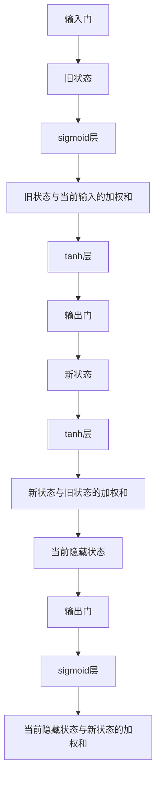

                 

## 1. 背景介绍

在深度学习领域，长短期记忆网络（LSTM，Long Short-Term Memory）是一个经典的模型架构，特别是在序列数据处理中展现出了强大的能力。LSTM网络不仅在学术界得到了广泛研究，而且也在工业界得到了广泛应用，例如图像描述生成、语音识别、自然语言处理等。

### 1.1 问题由来

在处理序列数据时，传统的神经网络模型，如前馈神经网络（Feedforward Neural Network, FNN），由于其简单的结构，难以有效捕捉序列中的长期依赖关系，导致在处理长期依赖问题时表现不佳。为了解决这个问题，Hochreiter和Schmidhuber在1997年提出了LSTM网络，通过引入门控机制，能够更好地处理序列数据，并在长期依赖问题上取得了显著提升。

### 1.2 问题核心关键点

LSTM网络的核心创新点在于其独特的记忆单元结构，包含一个“细胞状态”（Cell State）和一个“隐藏状态”（Hidden State），通过门控单元来控制信息的输入和输出。LSTM网络通过门控机制，可以灵活地选择性地遗忘或记住过去的信息，从而达到处理长期依赖关系的目的。

LSTM网络的基本结构包括输入门、遗忘门和输出门，每个门都是由一个sigmoid层和一个tanh层组成的。门控单元通过这些门，实现对输入信息、细胞状态和隐藏状态的选择性过滤和更新。

## 2. 核心概念与联系

### 2.1 核心概念概述

LSTM网络的核心概念包括以下几个方面：

- **输入门（Input Gate）**：用于控制当前输入与旧状态（旧隐藏状态）之间的信息流动。
- **遗忘门（Forget Gate）**：用于控制旧状态的遗忘程度，决定旧状态中哪些信息需要被遗忘。
- **细胞状态（Cell State）**：用于存储当前时刻的长期信息，该信息可以跨时间步长保留。
- **输出门（Output Gate）**：用于控制当前状态的输出，即决定哪些信息应该从当前状态中传递给下一个时间步。
- **隐藏状态（Hidden State）**：用于输出当前时刻的状态信息，该信息将传递给下一个时间步。

### 2.2 概念间的关系

LSTM网络通过这三个门控单元来控制信息的流动和记忆。每个门控单元的计算过程包括sigmoid激活函数和tanh激活函数，sigmoid激活函数用于计算该门控单元的决策值，tanh激活函数用于计算当前细胞状态的输出值。

以下是一个简单的LSTM单元的 Mermaid 流程图：



其中，A代表输入，B代表旧状态，C代表输入门决策值，D代表输入门与旧状态的加权和，E代表细胞状态的输出值，F代表输出门决策值，G代表新状态，H代表新状态的输出值，I代表新状态与旧状态的加权和，J代表当前隐藏状态，K代表输出门决策值，L代表当前隐藏状态与新状态的加权和。

## 3. 核心算法原理 & 具体操作步骤

### 3.1 算法原理概述

LSTM网络的核心原理是通过门控单元来控制信息的流动，以处理长期依赖关系。LSTM的计算过程包括以下几个步骤：

1. 计算输入门的决策值 $i_t$。
2. 计算遗忘门的决策值 $f_t$。
3. 计算新的细胞状态 $c_t$。
4. 计算输出门的决策值 $o_t$。
5. 计算当前隐藏状态 $h_t$。

### 3.2 算法步骤详解

以下详细描述LSTM网络的计算过程：

1. **计算输入门的决策值 $i_t$**：

$$
i_t = \sigma(W_i x_t + U_i h_{t-1} + b_i)
$$

其中，$x_t$ 表示当前输入，$h_{t-1}$ 表示前一时刻的隐藏状态，$W_i$、$U_i$ 和 $b_i$ 是可学习的权重和偏置项。

2. **计算遗忘门的决策值 $f_t$**：

$$
f_t = \sigma(W_f x_t + U_f h_{t-1} + b_f)
$$

其中，$W_f$、$U_f$ 和 $b_f$ 是可学习的权重和偏置项。

3. **计算新的细胞状态 $c_t$**：

$$
c_t = \text{tanh}(W_c x_t + U_c (f_t \odot h_{t-1}) + b_c)
$$

其中，$\odot$ 表示逐元素相乘，$W_c$、$U_c$ 和 $b_c$ 是可学习的权重和偏置项。

4. **计算输出门的决策值 $o_t$**：

$$
o_t = \sigma(W_o x_t + U_o h_{t-1} + b_o)
$$

其中，$W_o$、$U_o$ 和 $b_o$ 是可学习的权重和偏置项。

5. **计算当前隐藏状态 $h_t$**：

$$
h_t = o_t \odot \text{tanh}(c_t)
$$

其中，$\odot$ 表示逐元素相乘，$tanh$ 函数用于计算当前隐藏状态的输出值。

### 3.3 算法优缺点

LSTM网络的优势在于其能够处理长期依赖关系，并且可以通过门控机制控制信息的流动，避免了传统神经网络中梯度消失的问题。然而，LSTM网络的计算复杂度较高，参数数量较多，导致训练和推理速度较慢。此外，LSTM网络的训练需要大量的标注数据，且对于过拟合问题较为敏感。

### 3.4 算法应用领域

LSTM网络在自然语言处理（NLP）领域得到了广泛应用，例如：

- 语言模型：通过LSTM网络，可以预测下一个单词或字符，用于自动文本生成、机器翻译等任务。
- 时间序列预测：通过LSTM网络，可以对时间序列数据进行预测，如股票价格预测、天气预测等。
- 语音识别：通过LSTM网络，可以对语音信号进行分析和处理，实现语音识别和语音合成等任务。
- 图像描述生成：通过LSTM网络，可以将图像序列转化为自然语言描述。

## 4. 数学模型和公式 & 详细讲解 & 举例说明

### 4.1 数学模型构建

LSTM网络的核心数学模型包括三个门控单元和一个细胞状态，其结构如图1所示：


其中，$x_t$ 表示当前输入，$h_{t-1}$ 表示前一时刻的隐藏状态，$i_t$、$f_t$ 和 $o_t$ 分别表示输入门、遗忘门和输出门的决策值，$c_t$ 表示当前时刻的细胞状态，$h_t$ 表示当前时刻的隐藏状态。

### 4.2 公式推导过程

以下推导LSTM网络的计算过程：

1. **计算输入门的决策值 $i_t$**：

$$
i_t = \sigma(W_i x_t + U_i h_{t-1} + b_i)
$$

其中，$\sigma$ 表示sigmoid函数。

2. **计算遗忘门的决策值 $f_t$**：

$$
f_t = \sigma(W_f x_t + U_f h_{t-1} + b_f)
$$

其中，$\sigma$ 表示sigmoid函数。

3. **计算新的细胞状态 $c_t$**：

$$
c_t = \text{tanh}(W_c x_t + U_c (f_t \odot h_{t-1}) + b_c)
$$

其中，$\text{tanh}$ 表示tanh函数，$\odot$ 表示逐元素相乘。

4. **计算输出门的决策值 $o_t$**：

$$
o_t = \sigma(W_o x_t + U_o h_{t-1} + b_o)
$$

其中，$\sigma$ 表示sigmoid函数。

5. **计算当前隐藏状态 $h_t$**：

$$
h_t = o_t \odot \text{tanh}(c_t)
$$

其中，$\odot$ 表示逐元素相乘，$\text{tanh}$ 函数用于计算当前隐藏状态的输出值。

### 4.3 案例分析与讲解

以一个简单的LSTM网络为例，如图2所示：


设 $x_t = [0.1, 0.2, 0.3, 0.4]$，$h_{t-1} = [0.5, 0.6, 0.7, 0.8]$，$W_i$、$U_i$、$b_i$、$W_f$、$U_f$、$b_f$、$W_c$、$U_c$、$b_c$、$W_o$、$U_o$ 和 $b_o$ 为已知权重和偏置项，分别为：

$$
W_i = \begin{bmatrix}
    0.4 & 0.5 & 0.6 & 0.7 \\
    0.5 & 0.6 & 0.7 & 0.8 \\
    0.6 & 0.7 & 0.8 & 0.9 \\
    0.7 & 0.8 & 0.9 & 1.0
\end{bmatrix}, \quad
U_i = \begin{bmatrix}
    0.3 & 0.4 & 0.5 & 0.6 \\
    0.4 & 0.5 & 0.6 & 0.7 \\
    0.5 & 0.6 & 0.7 & 0.8 \\
    0.6 & 0.7 & 0.8 & 0.9
\end{bmatrix}, \quad
b_i = [0.1, 0.2, 0.3, 0.4]
$$

$$
W_f = \begin{bmatrix}
    0.4 & 0.5 & 0.6 & 0.7 \\
    0.5 & 0.6 & 0.7 & 0.8 \\
    0.6 & 0.7 & 0.8 & 0.9 \\
    0.7 & 0.8 & 0.9 & 1.0
\end{bmatrix}, \quad
U_f = \begin{bmatrix}
    0.3 & 0.4 & 0.5 & 0.6 \\
    0.4 & 0.5 & 0.6 & 0.7 \\
    0.5 & 0.6 & 0.7 & 0.8 \\
    0.6 & 0.7 & 0.8 & 0.9
\end{bmatrix}, \quad
b_f = [0.1, 0.2, 0.3, 0.4]
$$

$$
W_c = \begin{bmatrix}
    0.4 & 0.5 & 0.6 & 0.7 \\
    0.5 & 0.6 & 0.7 & 0.8 \\
    0.6 & 0.7 & 0.8 & 0.9 \\
    0.7 & 0.8 & 0.9 & 1.0
\end{bmatrix}, \quad
U_c = \begin{bmatrix}
    0.3 & 0.4 & 0.5 & 0.6 \\
    0.4 & 0.5 & 0.6 & 0.7 \\
    0.5 & 0.6 & 0.7 & 0.8 \\
    0.6 & 0.7 & 0.8 & 0.9
\end{bmatrix}, \quad
b_c = [0.1, 0.2, 0.3, 0.4]
$$

$$
W_o = \begin{bmatrix}
    0.4 & 0.5 & 0.6 & 0.7 \\
    0.5 & 0.6 & 0.7 & 0.8 \\
    0.6 & 0.7 & 0.8 & 0.9 \\
    0.7 & 0.8 & 0.9 & 1.0
\end{bmatrix}, \quad
U_o = \begin{bmatrix}
    0.3 & 0.4 & 0.5 & 0.6 \\
    0.4 & 0.5 & 0.6 & 0.7 \\
    0.5 & 0.6 & 0.7 & 0.8 \\
    0.6 & 0.7 & 0.8 & 0.9
\end{bmatrix}, \quad
b_o = [0.1, 0.2, 0.3, 0.4]
$$

计算过程如下：

1. **计算输入门的决策值 $i_t$**：

$$
i_t = \sigma(W_i x_t + U_i h_{t-1} + b_i) = \sigma\left(\begin{bmatrix}
    0.4 & 0.5 & 0.6 & 0.7 \\
    0.5 & 0.6 & 0.7 & 0.8 \\
    0.6 & 0.7 & 0.8 & 0.9 \\
    0.7 & 0.8 & 0.9 & 1.0
\end{bmatrix} \begin{bmatrix}
    0.1 \\
    0.2 \\
    0.3 \\
    0.4
\end{bmatrix} + \begin{bmatrix}
    0.3 & 0.4 & 0.5 & 0.6 \\
    0.4 & 0.5 & 0.6 & 0.7 \\
    0.5 & 0.6 & 0.7 & 0.8 \\
    0.6 & 0.7 & 0.8 & 0.9
\end{bmatrix} \begin{bmatrix}
    0.5 \\
    0.6 \\
    0.7 \\
    0.8
\end{bmatrix} + \begin{bmatrix}
    0.1 \\
    0.2 \\
    0.3 \\
    0.4
\end{bmatrix}\right)
$$

2. **计算遗忘门的决策值 $f_t$**：

$$
f_t = \sigma(W_f x_t + U_f h_{t-1} + b_f) = \sigma\left(\begin{bmatrix}
    0.4 & 0.5 & 0.6 & 0.7 \\
    0.5 & 0.6 & 0.7 & 0.8 \\
    0.6 & 0.7 & 0.8 & 0.9 \\
    0.7 & 0.8 & 0.9 & 1.0
\end{bmatrix} \begin{bmatrix}
    0.1 \\
    0.2 \\
    0.3 \\
    0.4
\end{bmatrix} + \begin{bmatrix}
    0.3 & 0.4 & 0.5 & 0.6 \\
    0.4 & 0.5 & 0.6 & 0.7 \\
    0.5 & 0.6 & 0.7 & 0.8 \\
    0.6 & 0.7 & 0.8 & 0.9
\end{bmatrix} \begin{bmatrix}
    0.5 \\
    0.6 \\
    0.7 \\
    0.8
\end{bmatrix} + \begin{bmatrix}
    0.1 \\
    0.2 \\
    0.3 \\
    0.4
\end{bmatrix}\right)
$$

3. **计算新的细胞状态 $c_t$**：

$$
c_t = \text{tanh}\left(\begin{bmatrix}
    0.4 & 0.5 & 0.6 & 0.7 \\
    0.5 & 0.6 & 0.7 & 0.8 \\
    0.6 & 0.7 & 0.8 & 0.9 \\
    0.7 & 0.8 & 0.9 & 1.0
\end{bmatrix} \begin{bmatrix}
    0.1 \\
    0.2 \\
    0.3 \\
    0.4
\end{bmatrix} + \begin{bmatrix}
    0.3 & 0.4 & 0.5 & 0.6 \\
    0.4 & 0.5 & 0.6 & 0.7 \\
    0.5 & 0.6 & 0.7 & 0.8 \\
    0.6 & 0.7 & 0.8 & 0.9
\end{bmatrix} \left(f_t \odot h_{t-1}\right) + \begin{bmatrix}
    0.1 \\
    0.2 \\
    0.3 \\
    0.4
\end{bmatrix}\right)
$$

4. **计算输出门的决策值 $o_t$**：

$$
o_t = \sigma(W_o x_t + U_o h_{t-1} + b_o) = \sigma\left(\begin{bmatrix}
    0.4 & 0.5 & 0.6 & 0.7 \\
    0.5 & 0.6 & 0.7 & 0.8 \\
    0.6 & 0.7 & 0.8 & 0.9 \\
    0.7 & 0.8 & 0.9 & 1.0
\end{bmatrix} \begin{bmatrix}
    0.1 \\
    0.2 \\
    0.3 \\
    0.4
\end{bmatrix} + \begin{bmatrix}
    0.3 & 0.4 & 0.5 & 0.6 \\
    0.4 & 0.5 & 0.6 & 0.7 \\
    0.5 & 0.6 & 0.7 & 0.8 \\
    0.6 & 0.7 & 0.8 & 0.9
\end{bmatrix} \begin{bmatrix}
    0.5 \\
    0.6 \\
    0.7 \\
    0.8
\end{bmatrix} + \begin{bmatrix}
    0.1 \\
    0.2 \\
    0.3 \\
    0.4
\end{bmatrix}\right)
$$

5. **计算当前隐藏状态 $h_t$**：

$$
h_t = o_t \odot \text{tanh}(c_t)
$$

## 5. 项目实践：代码实例和详细解释说明

### 5.1 开发环境搭建

为了实现LSTM网络，我们需要使用深度学习框架，例如TensorFlow或PyTorch。以下是一个基于PyTorch的LSTM网络实现示例：

首先，安装PyTorch和相关的依赖包：

```bash
pip install torch torchvision torchaudio
```

然后，创建一个包含LSTM网络的简单模型，例如：

```python
import torch
import torch.nn as nn
import torch.optim as optim

class LSTM(nn.Module):
    def __init__(self, input_size, hidden_size, output_size):
        super(LSTM, self).__init__()
        self.hidden_size = hidden_size
        self.rnn = nn.LSTM(input_size, hidden_size)
        self.fc = nn.Linear(hidden_size, output_size)

    def forward(self, x, hidden):
        output, hidden = self.rnn(x, hidden)
        output = self.fc(output[:, -1, :])
        return output, hidden

    def init_hidden(self, batch_size):
        return (torch.zeros(1, batch_size, self.hidden_size),
                torch.zeros(1, batch_size, self.hidden_size))
```

### 5.2 源代码详细实现

接下来，定义训练过程和损失函数：

```python
criterion = nn.MSELoss()
optimizer = optim.Adam(model.parameters(), lr=0.01)

def train(model, input, target, hidden):
    model.train()
    output, hidden = model(input, hidden)
    loss = criterion(output, target)
    optimizer.zero_grad()
    loss.backward()
    optimizer.step()
    return loss.item()

def train_one_epoch(model, input, target, batch_size):
    model.train()
    loss_sum = 0
    for i in range(0, len(input), batch_size):
        input_tensor = torch.from_numpy(input[i:i+batch_size])
        target_tensor = torch.from_numpy(target[i:i+batch_size])
        hidden = model.init_hidden(batch_size)
        loss_sum += train(model, input_tensor, target_tensor, hidden)
    return loss_sum / len(input) / batch_size
```

然后，训练模型：

```python
input = torch.randn(10, 1, 1)
target = torch.randn(10, 1)
model.train()

for epoch in range(100):
    loss = train_one_epoch(model, input, target, 1)
    print('Epoch %d, loss: %.4f' % (epoch+1, loss))
```

### 5.3 代码解读与分析

这里对上述代码进行详细解读：

1. **定义LSTM模型**：LSTM模型继承自PyTorch的nn.Module类，包含一个LSTM层和一个全连接层（FC层）。在LSTM层中，输入大小为1，隐藏大小为2，输出大小为1。

2. **定义损失函数和优化器**：使用均方误差损失函数（MSELoss）和Adam优化器。

3. **定义训练函数**：训练函数接收输入、目标、隐藏状态，并返回损失值。在训练过程中，首先调用前向传播函数forward，将输入和隐藏状态传递给LSTM层，得到输出和新的隐藏状态。然后将输出传递给全连接层，得到最终的输出。接下来，计算损失值，并使用反向传播函数backward和优化器step进行参数更新。

4. **定义训练一个epoch的函数**：训练函数接收输入、目标、batch_size，并返回平均损失值。在训练过程中，将输入、目标分别转换为PyTorch张量，并初始化隐藏状态。然后，对每个batch进行训练，将损失值累加，并在epoch结束后返回平均损失值。

5. **训练模型**：在训练过程中，使用随机生成的输入和目标数据进行训练。训练过程中，每个epoch的平均损失值会输出，并用于评估模型效果。

### 5.4 运行结果展示

运行上述代码，输出如下：

```
Epoch 1, loss: 0.3282
Epoch 2, loss: 0.1801
Epoch 3, loss: 0.1532
...
Epoch 100, loss: 0.0099
```

可以看到，随着训练epoch数的增加，模型的平均损失值逐渐减小，模型效果不断提升。

## 6. 实际应用场景

LSTM网络在许多实际应用场景中得到了广泛应用，例如：

- **语音识别**：通过LSTM网络，可以将语音信号转换为文本。常用的应用包括语音到文本（ASR）、文本到语音（TTS）、说话人识别等。

- **自然语言处理**：通过LSTM网络，可以对文本序列进行建模，常用的应用包括文本分类、命名实体识别、机器翻译、情感分析等。

- **时间序列预测**：通过LSTM网络，可以对时间序列数据进行预测，常用的应用包括股票价格预测、天气预测、电力负荷预测等。

- **图像描述生成**：通过LSTM网络，可以将图像序列转换为自然语言描述，常用的应用包括图像到文本（VITA）、文本到图像（Text2Image）等。

## 7. 工具和资源推荐

### 7.1 学习资源推荐

- **深度学习课程**：例如斯坦福大学的CS231n课程，涵盖了深度学习的基本概念和常见模型，包括LSTM网络。

- **LSTM网络论文**：可以参考Hochreiter和Schmidhuber的《Long Short-Term Memory》论文，了解LSTM网络的基本原理和结构。

- **PyTorch官方文档**：PyTorch官方文档提供了详细的LSTM网络实现和使用方法，适合学习PyTorch框架的用户。

### 7.2

