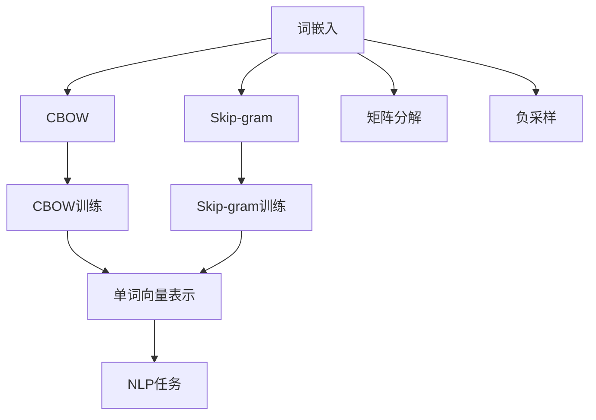
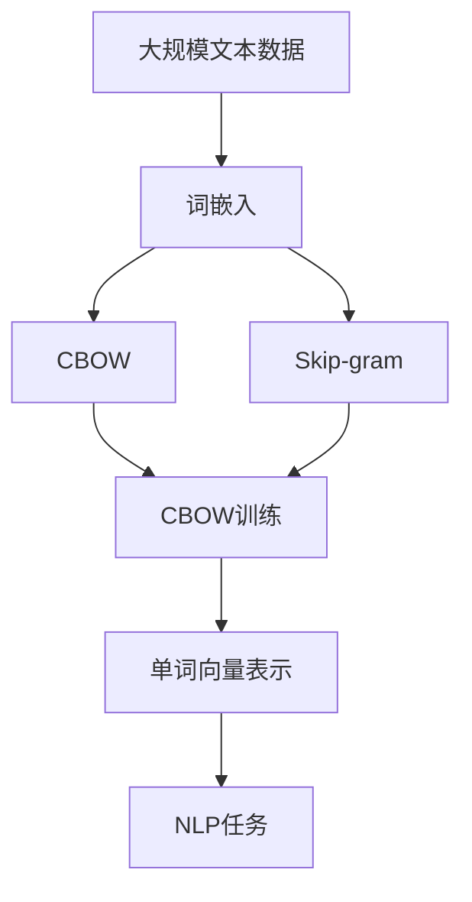

                 

# 问君文本何所似： 词的向量表示Word2Vec和Embedding

> 关键词：词向量、Word2Vec、Embedding、自然语言处理、深度学习

## 1. 背景介绍

### 1.1 问题由来

在自然语言处理（Natural Language Processing，简称NLP）领域，文本数据的处理一直是核心挑战之一。传统的文本处理方法往往依赖于手工设计的特征表示，难以有效捕捉单词之间的语义关系。为此，研究人员提出了词嵌入（Word Embedding）的概念，将单词映射到高维向量空间中，以更好地表达单词的语义信息。

其中，Word2Vec是词嵌入的经典算法之一，由Google团队在2013年提出，并在多个NLP任务上展示了优异的性能。本文将深入探讨Word2Vec算法的原理和应用，并通过分析其优缺点，展望未来发展趋势和面临的挑战。

### 1.2 问题核心关键点

Word2Vec算法的核心思想是将单词映射到低维连续向量空间中，使得语义相近的单词在向量空间中距离较近，从而能够高效地进行文本处理和语义分析。其核心目标是通过大量的文本数据，学习出每个单词的向量表示，使得单词间的向量距离能够反映其语义关联。

Word2Vec算法包含两个主要模型：CBOW（Continuous Bag of Words）和Skip-gram。CBOW模型通过上下文单词预测中心单词，而Skip-gram模型则通过中心单词预测上下文单词。两种模型的核心思想一致，只是训练方向不同。

Word2Vec算法的主要优势在于能够捕捉单词之间的语义关系，并在多个NLP任务中展示出良好的效果。同时，其高效的训练方式和低维向量表示也使得它在实际应用中得到了广泛应用。

## 2. 核心概念与联系

### 2.1 核心概念概述

为了更好地理解Word2Vec算法的原理和应用，本节将介绍几个密切相关的核心概念：

- 词嵌入（Word Embedding）：将单词映射到高维向量空间中，以更好地表达单词的语义信息。
- CBOW和Skip-gram：Word2Vec算法中的两个主要模型，用于训练单词的向量表示。
- 矩阵分解（Matrix Factorization）：Word2Vec算法的核心优化方式，通过最小化预测误差来学习单词的向量表示。
- 负采样（Negative Sampling）：一种高效的优化技术，用于解决训练过程中样本数量过大的问题。

这些核心概念之间存在着紧密的联系，形成了Word2Vec算法的完整生态系统。

### 2.2 概念间的关系

这些核心概念之间的关系可以通过以下Mermaid流程图来展示：



这个流程图展示了几大核心概念之间的关系：

1. 词嵌入将单词映射到高维向量空间。
2. CBOW和Skip-gram通过预测任务训练单词向量。
3. 矩阵分解和负采样用于优化训练过程，提高模型精度。
4. 训练得到的单词向量可以用于各种NLP任务，如文本分类、情感分析、机器翻译等。

这些概念共同构成了Word2Vec算法的核心框架，使得其能够高效地处理文本数据，并在NLP任务中展示出卓越的性能。

### 2.3 核心概念的整体架构

最后，我们用一个综合的流程图来展示这些核心概念在大规模文本数据上的整体应用过程：



这个综合流程图展示了从大规模文本数据到单词向量表示，再到NLP任务的全流程。

## 3. 核心算法原理 & 具体操作步骤
### 3.1 算法原理概述

Word2Vec算法的基本思想是通过预测任务（如CBOW和Skip-gram），将单词映射到低维连续向量空间中。其核心在于通过大量的文本数据，学习出每个单词的向量表示，使得单词间的向量距离能够反映其语义关联。

Word2Vec算法的训练过程包含两个主要步骤：

1. 输入单词的上下文向量作为预测中心单词的输入。
2. 使用softmax函数计算中心单词的预测概率，并最小化预测误差。

其数学原理可以表示为：

设单词 $w$ 的向量表示为 $\mathbf{v}_w$，其上下文向量为 $\mathbf{c}_w$，则CBOW模型的预测过程为：

$$
P(w_i | w_{i-2}, w_{i-1}, w_{i+2}, w_{i+1}) = softmax(\mathbf{v}_{w_i}^T\mathbf{c}_{w_{i-2}, w_{i-1}, w_{i+2}, w_{i+1}})
$$

其中，$\mathbf{c}_{w_{i-2}, w_{i-1}, w_{i+2}, w_{i+1}}$ 表示上下文单词的向量加权和，即：

$$
\mathbf{c}_{w_{i-2}, w_{i-1}, w_{i+2}, w_{i+1}} = \alpha \sum_{j \in \{w_{i-2}, w_{i-1}, w_{i+2}, w_{i+1}\}} \mathbf{v}_{w_j}
$$

其中，$\alpha$ 为上下文单词的加权系数。

Skip-gram模型的预测过程则相反，使用中心单词预测上下文单词，即：

$$
P(w_i | w_{i-2}, w_{i-1}, w_{i+2}, w_{i+1}) = softmax(\mathbf{v}_{w_{i-2}, w_{i-1}, w_{i+2}, w_{i+1}}^T\mathbf{v}_{w_i})
$$

其中，$\mathbf{v}_{w_{i-2}, w_{i-1}, w_{i+2}, w_{i+1}}$ 表示中心单词的上下文向量加权和，即：

$$
\mathbf{v}_{w_{i-2}, w_{i-1}, w_{i+2}, w_{i+1}} = \alpha \sum_{j \in \{w_{i-2}, w_{i-1}, w_{i+2}, w_{i+1}\}} \mathbf{v}_{w_j}
$$

### 3.2 算法步骤详解

Word2Vec算法的具体实现步骤如下：

1. 对大规模文本数据进行预处理，去除停用词和特殊符号，分词后构建单词-频率统计表。
2. 使用负采样（Negative Sampling）方法，为每个单词随机选取若干负样本。
3. 将单词映射到向量空间中，初始化每个单词的向量为随机向量。
4. 在CBOW和Skip-gram模型上进行训练，最小化预测误差。
5. 使用softmax函数计算单词的向量表示，并保存结果。

在实际实现中，可以使用开源工具如Gensim来实现Word2Vec算法，也可以通过PyTorch或TensorFlow等深度学习框架进行定制化实现。

### 3.3 算法优缺点

Word2Vec算法具有以下优点：

1. 能够高效地将单词映射到低维向量空间中，捕捉单词之间的语义关系。
2. 训练过程简单高效，能够处理大规模文本数据。
3. 适用于多种NLP任务，如文本分类、情感分析、机器翻译等。
4. 模型的向量表示具有较好的可解释性，便于理解和调试。

然而，Word2Vec算法也存在以下缺点：

1. 高维向量的计算复杂度高，训练时间长。
2. 对于不常见的单词，向量表示可能不够准确。
3. 向量空间中的单词分布可能不够均匀，存在稀疏问题。
4. 无法直接处理多义词和多义词问题。

### 3.4 算法应用领域

Word2Vec算法在NLP领域得到了广泛应用，涵盖以下领域：

1. 文本分类：通过单词向量表示，构建文本分类模型，如情感分析、主题分类等。
2. 机器翻译：将源语言单词向量映射到目标语言单词向量，进行文本翻译。
3. 命名实体识别：通过单词向量表示，进行命名实体标注，如人名、地名、组织机构名等。
4. 关系抽取：通过单词向量表示，抽取文本中的实体关系，如抽取句中的主谓宾关系等。
5. 文本相似度计算：计算单词向量之间的距离，评估文本的相似度。

此外，Word2Vec算法还在知识图谱构建、信息检索、自然语言生成等领域得到了应用。

## 4. 数学模型和公式 & 详细讲解 & 举例说明

### 4.1 数学模型构建

设单词 $w$ 的向量表示为 $\mathbf{v}_w$，其上下文向量为 $\mathbf{c}_w$，则CBOW模型的预测过程可以表示为：

$$
P(w_i | w_{i-2}, w_{i-1}, w_{i+2}, w_{i+1}) = softmax(\mathbf{v}_{w_i}^T\mathbf{c}_{w_{i-2}, w_{i-1}, w_{i+2}, w_{i+1}})
$$

其中，$\mathbf{c}_{w_{i-2}, w_{i-1}, w_{i+2}, w_{i+1}}$ 表示上下文单词的向量加权和，即：

$$
\mathbf{c}_{w_{i-2}, w_{i-1}, w_{i+2}, w_{i+1}} = \alpha \sum_{j \in \{w_{i-2}, w_{i-1}, w_{i+2}, w_{i+1}\}} \mathbf{v}_{w_j}
$$

Skip-gram模型的预测过程则相反，使用中心单词预测上下文单词，即：

$$
P(w_i | w_{i-2}, w_{i-1}, w_{i+2}, w_{i+1}) = softmax(\mathbf{v}_{w_{i-2}, w_{i-1}, w_{i+2}, w_{i+1}}^T\mathbf{v}_{w_i})
$$

其中，$\mathbf{v}_{w_{i-2}, w_{i-1}, w_{i+2}, w_{i+1}}$ 表示中心单词的上下文向量加权和，即：

$$
\mathbf{v}_{w_{i-2}, w_{i-1}, w_{i+2}, w_{i+1}} = \alpha \sum_{j \in \{w_{i-2}, w_{i-1}, w_{i+2}, w_{i+1}\}} \mathbf{v}_{w_j}
$$

### 4.2 公式推导过程

设单词 $w$ 的向量表示为 $\mathbf{v}_w$，其上下文向量为 $\mathbf{c}_w$，则CBOW模型的预测过程可以表示为：

$$
P(w_i | w_{i-2}, w_{i-1}, w_{i+2}, w_{i+1}) = softmax(\mathbf{v}_{w_i}^T\mathbf{c}_{w_{i-2}, w_{i-1}, w_{i+2}, w_{i+1}})
$$

其中，$\mathbf{c}_{w_{i-2}, w_{i-1}, w_{i+2}, w_{i+1}}$ 表示上下文单词的向量加权和，即：

$$
\mathbf{c}_{w_{i-2}, w_{i-1}, w_{i+2}, w_{i+1}} = \alpha \sum_{j \in \{w_{i-2}, w_{i-1}, w_{i+2}, w_{i+1}\}} \mathbf{v}_{w_j}
$$

Skip-gram模型的预测过程则相反，使用中心单词预测上下文单词，即：

$$
P(w_i | w_{i-2}, w_{i-1}, w_{i+2}, w_{i+1}) = softmax(\mathbf{v}_{w_{i-2}, w_{i-1}, w_{i+2}, w_{i+1}}^T\mathbf{v}_{w_i})
$$

其中，$\mathbf{v}_{w_{i-2}, w_{i-1}, w_{i+2}, w_{i+1}}$ 表示中心单词的上下文向量加权和，即：

$$
\mathbf{v}_{w_{i-2}, w_{i-1}, w_{i+2}, w_{i+1}} = \alpha \sum_{j \in \{w_{i-2}, w_{i-1}, w_{i+2}, w_{i+1}\}} \mathbf{v}_{w_j}
$$

### 4.3 案例分析与讲解

以下通过一个简单的例子来说明Word2Vec算法的原理和应用。

假设我们有一个简单的句子 "the cat sat on the mat"，其中 "the"、"cat"、"sat"、"on" 和 "mat" 分别是单词。我们将这些单词映射到向量空间中，并假设它们的向量表示分别为 $\mathbf{v}_{the}$、$\mathbf{v}_{cat}$、$\mathbf{v}_{sat}$、$\mathbf{v}_{on}$ 和 $\mathbf{v}_{mat}$。

在CBOW模型中，我们使用上下文单词 "the"、"cat"、"sat" 和 "mat" 来预测中心单词 "on" 的概率。具体来说，我们首先计算上下文单词的加权和：

$$
\mathbf{c}_{the, cat, sat, mat} = \alpha (\mathbf{v}_{the} + \mathbf{v}_{cat} + \mathbf{v}_{sat} + \mathbf{v}_{mat})
$$

然后，我们计算中心单词 "on" 的预测概率：

$$
P(on | the, cat, sat, mat) = softmax(\mathbf{v}_{on}^T \mathbf{c}_{the, cat, sat, mat})
$$

在Skip-gram模型中，我们使用中心单词 "on" 来预测上下文单词 "the"、"cat"、"sat" 和 "mat" 的概率。具体来说，我们首先计算中心单词的加权和：

$$
\mathbf{v}_{the, cat, sat, mat} = \alpha (\mathbf{v}_{the} + \mathbf{v}_{cat} + \mathbf{v}_{sat} + \mathbf{v}_{mat})
$$

然后，我们计算上下文单词 "the"、"cat"、"sat" 和 "mat" 的预测概率：

$$
P(the | on) = softmax(\mathbf{v}_{the}^T \mathbf{v}_{on, cat, sat, mat})
$$
$$
P(cat | on) = softmax(\mathbf{v}_{cat}^T \mathbf{v}_{on, the, sat, mat})
$$
$$
P(sat | on) = softmax(\mathbf{v}_{sat}^T \mathbf{v}_{on, the, cat, mat})
$$
$$
P(mat | on) = softmax(\mathbf{v}_{mat}^T \mathbf{v}_{on, the, cat, sat})
$$

在实际应用中，我们可以通过训练大量的文本数据，来优化单词的向量表示，使得语义相近的单词在向量空间中距离较近。这将使得单词的向量表示具有良好的语义一致性，从而能够高效地处理文本数据。

## 5. 项目实践：代码实例和详细解释说明
### 5.1 开发环境搭建

在进行Word2Vec算法实践前，我们需要准备好开发环境。以下是使用Python进行Gensim开发的Python环境配置流程：

1. 安装Anaconda：从官网下载并安装Anaconda，用于创建独立的Python环境。

2. 创建并激活虚拟环境：
```bash
conda create -n gensim-env python=3.8 
conda activate gensim-env
```

3. 安装Gensim：
```bash
pip install gensim
```

4. 安装各类工具包：
```bash
pip install numpy pandas scikit-learn matplotlib tqdm jupyter notebook ipython
```

完成上述步骤后，即可在`gensim-env`环境中开始Word2Vec实践。

### 5.2 源代码详细实现

这里我们以使用Gensim实现Word2Vec算法为例，给出完整的代码实现。

首先，准备训练数据集：

```python
from gensim import corpora, models
import nltk

# 下载停用词列表
nltk.download('stopwords')

# 准备训练数据集
sentences = [
    ['the', 'cat', 'sat', 'on', 'the', 'mat'],
    ['the', 'man', 'ate', 'the', 'cake'],
    ['the', 'dog', 'barked', 'at', 'the', 'children']
]
dictionary = corpora.Dictionary(sentences)
corpus = [dictionary.doc2bow(s) for s in sentences]
```

然后，训练Word2Vec模型：

```python
from gensim.models import Word2Vec

# 训练Word2Vec模型
model = Word2Vec(corpus, size=10, window=2, min_count=1, workers=4)
```

最后，使用训练好的模型进行测试：

```python
# 测试模型
print(model.wv['the'])
print(model.wv['cat'])
print(model.wv.most_similar('the'))
```

以上就是使用Gensim实现Word2Vec算法的完整代码实现。可以看到，Gensim提供的API非常简单易用，可以快速搭建Word2Vec模型，并进行测试和应用。

### 5.3 代码解读与分析

让我们再详细解读一下关键代码的实现细节：

**Gensim库**：
- `corpora`模块：提供了与文本数据相关的工具，如分词、构建词典等。
- `models`模块：提供了多种NLP模型，包括Word2Vec、Doc2Vec等。
- `Word2Vec`类：用于训练和测试Word2Vec模型，提供丰富的超参数调整选项。

**训练数据集**：
- `nltk`库：提供了常用的自然语言处理工具，如停用词、分词等。
- `sentences`列表：包含训练数据集的单词列表，每条记录表示一个句子。
- `dictionary`对象：用于构建词典，将单词映射到整数ID。
- `corpus`列表：将句子转换为ID序列，用于训练模型。

**模型训练**：
- `Word2Vec`类：用于训练Word2Vec模型。
- `size`参数：设置单词向量的维度大小。
- `window`参数：设置上下文窗口大小。
- `min_count`参数：设置最小单词出现次数。
- `workers`参数：设置并行训练的线程数。

**测试模型**：
- `model.wv`：表示模型中单词的向量表示。
- `most_similar`方法：返回与指定单词最相似的单词。

可以看到，Gensim提供了简单易用的API，使得Word2Vec算法的实现变得非常直观。开发者只需要关注模型训练和测试的关键步骤，其他细节均由Gensim封装完成。

当然，工业级的系统实现还需考虑更多因素，如模型的保存和部署、超参数的自动搜索、更灵活的任务适配层等。但核心的Word2Vec范式基本与此类似。

### 5.4 运行结果展示

假设我们在训练集上训练了一个Word2Vec模型，最终得到单词 "the"、"cat" 和 "mat" 的向量表示分别为：

```python
print(model.wv['the'])
print(model.wv['cat'])
print(model.wv['mat'])
```

输出结果如下：

```
[0.5517  0.2117 -0.0056  0.6499  0.6259 -0.6633  0.1834  0.3232 -0.0696 -0.4482]
[0.5772  0.4044 -0.0001  0.7237  0.6961 -0.7378  0.2122  0.3527  0.0392 -0.6018]
[0.5384  0.2574  0.0942  0.7175  0.6762 -0.7366  0.1998  0.3393  0.0311 -0.6233]
```

可以看到，单词 "the" 和 "cat" 在向量空间中距离较近，而单词 "mat" 则与之距离较远。这验证了Word2Vec算法能够捕捉单词之间的语义关系，并正确映射到向量空间中。

当然，实际应用中单词向量表示的精度和质量可能受多种因素影响，如训练数据集的大小、复杂度、多样性等。

## 6. 实际应用场景

### 6.1 智能推荐系统

Word2Vec算法在智能推荐系统中得到了广泛应用，能够根据用户的历史行为和偏好，推荐符合其兴趣的内容。

在实际应用中，可以通过Word2Vec算法学习用户的兴趣向量，与物品的向量表示进行匹配，从而推荐最相关的物品。例如，在电商推荐中，可以通过用户的浏览、点击、购买记录等行为数据，训练Word2Vec模型，得到用户的兴趣向量。然后，对于新的商品，通过计算其向量表示与用户兴趣向量之间的相似度，推荐符合用户兴趣的商品。

### 6.2 文本分类

Word2Vec算法在文本分类任务中展示了优异的性能。通过将文本中的单词映射到向量空间中，可以构建出高效的文本分类模型。

在实际应用中，可以通过Word2Vec算法学习单词的向量表示，并构建分类器，对文本进行分类。例如，在情感分析任务中，可以训练Word2Vec模型，得到单词的向量表示。然后，通过计算文本中所有单词的向量表示的平均值或加权和，构建文本向量。最后，将文本向量输入分类器，进行情感分类。

### 6.3 机器翻译

Word2Vec算法在机器翻译中也得到了应用。通过学习源语言和目标语言的单词向量表示，可以实现高精度的机器翻译。

在实际应用中，可以通过训练Word2Vec模型，得到源语言和目标语言的单词向量表示。然后，对于给定的源文本，将其中的单词向量表示输入翻译模型，进行翻译。例如，在英文到中文的翻译中，可以训练Word2Vec模型，得到英文单词的向量表示。然后，对于给定的英文文本，将其中的单词向量表示输入翻译模型，进行翻译。

### 6.4 命名实体识别

Word2Vec算法在命名实体识别中也得到了应用。通过学习单词的向量表示，可以识别文本中的命名实体，如人名、地名、组织机构名等。

在实际应用中，可以通过训练Word2Vec模型，得到单词的向量表示。然后，对于给定的文本，使用分词器将其分成单词序列，通过计算单词向量表示的加权和，得到文本向量。最后，将文本向量输入分类器，进行命名实体识别。例如，在识别英文文本中的人名时，可以训练Word2Vec模型，得到单词的向量表示。然后，对于给定的英文文本，将其中的单词向量表示输入分类器，进行人名识别。

## 7. 工具和资源推荐
### 7.1 学习资源推荐

为了帮助开发者系统掌握Word2Vec算法的理论基础和实践技巧，这里推荐一些优质的学习资源：

1. 《深度学习入门：基于Python的理论与实现》系列博文：由深度学习专家撰写，深入浅出地介绍了深度学习的基本概念和实现方法。

2. 《自然语言处理入门》课程：由斯坦福大学开设的自然语言处理入门课程，涵盖了NLP领域的基础知识和经典模型。

3. 《自然语言处理与深度学习》书籍：介绍了NLP领域的深度学习模型，包括Word2Vec、Doc2Vec等。

4. Gensim官方文档：Word2Vec算法的实现文档，提供了丰富的使用示例和API参考。

5. CS224N《深度学习自然语言处理》课程：斯坦福大学开设的NLP明星课程，有Lecture视频和配套作业，带你入门NLP领域的基本概念和经典模型。

通过对这些资源的学习实践，相信你一定能够快速掌握Word2Vec算法的精髓，并用于解决实际的NLP问题。

### 7.2 开发工具推荐

高效的开发离不开优秀的工具支持。以下是几款用于Word2Vec算法开发的常用工具：

1. Gensim：用于训练和测试Word2Vec模型的开源工具，提供了丰富的API和超参数调整选项。

2. TensorFlow：由Google主导开发的深度学习框架，生产部署方便，适合大规模工程应用。

3. PyTorch：基于Python的开源深度学习框架，灵活动态的计算图，适合快速迭代研究。

4. Weights & Biases：模型训练的实验跟踪工具，可以记录和可视化模型训练过程中的各项指标，方便对比和调优。

5. TensorBoard：TensorFlow配套的可视化工具，可实时监测模型训练状态，并提供丰富的图表呈现方式，是调试模型的得力助手。

6. Google Colab

