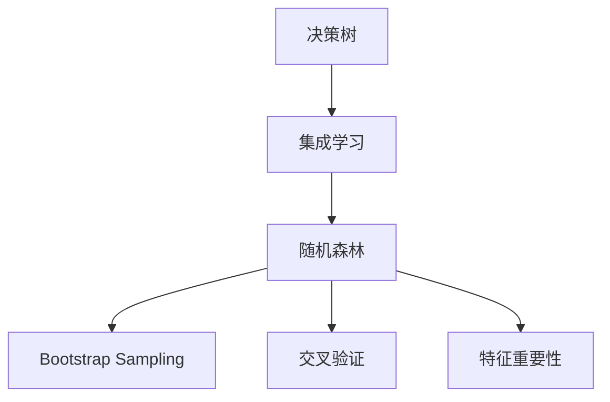

                 

# 随机森林 (Random Forests) 原理与代码实例讲解

> 关键词：随机森林, 决策树, 集成学习, 特征重要性, 交叉验证, 机器学习, 数据挖掘

## 1. 背景介绍

### 1.1 问题由来

在数据挖掘和机器学习领域，决策树（Decision Tree）是一种经典的分类与回归算法，但单纯依赖单棵决策树进行预测，容易出现过拟合现象，且泛化能力较弱。为解决这些问题，集成学习方法（如Bagging、Boosting）应运而生。其中，随机森林（Random Forests）因其优秀的性能和广泛的适用性，成为了一个广受欢迎的集成学习框架。

随机森林将多个决策树进行集成，通过投票表决或平均预测值等方式进行组合，从而提高模型的泛化能力和鲁棒性。本文将深入探讨随机森林的原理、算法步骤和代码实现，并结合具体案例展示其应用效果，以期为读者提供全面的理解与实践指导。

### 1.2 问题核心关键点

随机森林的核心思想是通过构建多棵随机子树，并让它们进行"投票"或"平均"，从而降低过拟合风险，提高模型的泛化能力。具体来说：

- 随机森林由多棵随机子树构成，每棵树独立构建，但均基于相同的训练集。
- 每棵树上的节点划分采用随机特征子集（Bootstrap Sampling）和随机阈值。
- 预测时，通过所有树的投票或平均结果进行最终预测。
- 随机森林在分类和回归任务上均有优秀表现，特别适用于处理高维度、非线性数据。

本文将通过详细讲解随机森林的原理、步骤及代码实现，为读者提供完整的理论基础和实践指导，帮助其在实际项目中灵活应用。

## 2. 核心概念与联系

### 2.1 核心概念概述

为更好地理解随机森林的原理和应用，本文将介绍几个核心概念：

- 决策树（Decision Tree）：一种基于树形结构的分类或回归算法，通过树节点进行特征划分，直到达到叶节点，叶节点包含最终预测结果。
- 集成学习（Ensemble Learning）：通过结合多个模型的预测结果，提高整体性能和鲁棒性，如Bagging、Boosting、Stacking等。
- 交叉验证（Cross Validation）：一种常用的模型评估方法，通过将数据集分成若干份，轮流作为验证集，减少过拟合风险。
- 特征重要性（Feature Importance）：评估每个特征在随机森林中对预测结果的影响程度，通常通过平均增益（Gini Impurity或信息增益）来衡量。
- Bootstrap Sampling：一种有放回的随机采样方法，用于从原始数据集中抽取训练集，构建随机子树。

### 2.2 概念间的关系

这些核心概念之间的逻辑关系可以通过以下Mermaid流程图来展示：



这个流程图展示了决策树、集成学习、随机森林、Bootstrap Sampling和交叉验证、特征重要性之间的紧密联系：

1. 决策树是一种基本的集成学习模型，随机森林是决策树的集成形式。
2. Bootstrap Sampling和交叉验证是随机森林中常用的数据采样和评估方法。
3. 特征重要性用于衡量各特征在随机森林中的作用，帮助选择最优特征。

通过理解这些核心概念的关系，我们可以更好地把握随机森林的工作原理和优化方向。

## 3. 核心算法原理 & 具体操作步骤
### 3.1 算法原理概述

随机森林是一种基于决策树的集成学习算法，其核心思想是通过随机划分特征和子样本来构建多个随机子树，并通过投票或平均的方式来组合这些子树的预测结果，从而提高模型的泛化能力和鲁棒性。

算法的基本步骤如下：

1. 从原始数据集中有放回地随机采样生成训练集。
2. 对训练集中的样本进行随机特征选择，构建决策树。
3. 对多棵决策树进行投票或平均，得到最终的预测结果。

其中，随机特征选择和随机子采样是随机森林的核心技巧，通过随机性减少了过拟合风险。投票或平均操作则是集成学习的常用方式，通过"多数人决定"原则，提高模型的鲁棒性。

### 3.2 算法步骤详解

具体步骤如下：

1. **样本抽样**：
   - 从原始数据集中有放回地随机抽取$N$个样本作为训练集，其中$N$通常为数据集大小的$\sqrt{n}$。
   - 对于每一棵树，重复此过程$M$次，得到$M$个训练集。

2. **特征选择**：
   - 对每个样本，随机选择$m$个特征，其中$m$通常为特征总数的一半。
   - 对于每个特征，从其可能的取值中随机选择一个作为划分阈值。

3. **构建决策树**：
   - 基于随机选择特征和阈值，对训练集构建决策树。
   - 重复上述过程，直到满足停止条件（如节点内的样本数少于某个阈值）。

4. **集成预测**：
   - 对测试集样本，将输入数据送入每一棵随机子树，得到$M$个预测结果。
   - 通过投票或平均方式，将$M$个结果汇总，得到最终预测结果。

### 3.3 算法优缺点

随机森林具有以下优点：

- 高鲁棒性：通过集成多棵随机子树，降低过拟合风险，提高泛化能力。
- 高效性：随机特征选择和子采样方法，降低了计算复杂度，适用于高维度数据。
- 可解释性：各棵树独立构建，每个特征的重要性可单独分析，帮助理解模型。

同时，随机森林也存在一些缺点：

- 对异常值敏感：随机森林对异常值较为敏感，极端值可能影响预测结果。
- 模型复杂度：多棵树的组合增加了模型复杂度，需要较长的训练时间。
- 特征重要性分析：对特征重要性分析可能需要较长时间计算。

尽管存在这些缺点，但随机森林仍被广泛认为是目前最优秀的集成学习算法之一，广泛应用于各类数据挖掘和机器学习任务。

### 3.4 算法应用领域

随机森林在分类、回归、特征选择等多个领域都有广泛应用，例如：

- 金融风险评估：通过随机森林预测贷款违约风险，帮助银行进行信贷决策。
- 医疗诊断：使用随机森林预测疾病分类，提高诊断的准确性和效率。
- 客户细分：在市场分析中，通过随机森林将客户分为高价值、中价值和低价值三类。
- 推荐系统：在电商和媒体平台，利用随机森林进行个性化推荐。

此外，随机森林还被用于数据降维、异常检测、图像处理等领域，展现了强大的实用价值。

## 4. 数学模型和公式 & 详细讲解 & 举例说明

### 4.1 数学模型构建

假设原始数据集为$\{(x_i, y_i)\}_{i=1}^n$，其中$x_i \in \mathcal{X}$为输入特征，$y_i \in \mathcal{Y}$为目标变量，$\mathcal{X}$和$\mathcal{Y}$分别为特征空间和目标空间。

定义随机森林的输出为：
$$
\hat{y} = \frac{1}{M} \sum_{m=1}^M f_m(x)
$$

其中，$f_m(x)$为第$m$棵决策树对输入$x$的预测结果。

### 4.2 公式推导过程

以二分类任务为例，随机森林的训练和预测过程可分别用以下公式表示：

#### 4.2.1 训练过程

对于每一棵树$m$，从训练集$D$中随机抽取$N$个样本，记为$D_m$，并对$D_m$进行随机特征选择，选择$m$个特征，其中每个特征从$m$个可能的取值中随机选择一个作为划分阈值，构建决策树。

具体步骤如下：

1. 从$D$中随机抽取$N$个样本，记为$D_m$。
2. 对$D_m$中的每个样本，随机选择$m$个特征，从每个特征的可能取值中随机选择一个作为划分阈值。
3. 基于随机选择的特征和阈值，对$D_m$构建决策树。
4. 重复上述过程$M$次，得到$M$棵随机子树。

#### 4.2.2 预测过程

对于输入$x$，将其分别送入$M$棵随机子树中，得到$M$个预测结果，然后通过投票或平均方式得到最终预测结果。

具体步骤如下：

1. 对输入$x$，分别在$M$棵随机子树中预测，得到$M$个结果$\hat{y}_m$。
2. 通过多数投票或平均方式，得到最终预测结果$\hat{y}$。

例如，对于二分类任务，投票方式如下：

$$
\hat{y} = \frac{1}{M} \sum_{m=1}^M \text{sign}(\hat{y}_m)
$$

其中，$\text{sign}(x)$为符号函数。

### 4.3 案例分析与讲解

假设有一个含有5个特征的分类问题，原始数据集包含100个样本，目标变量为二分类（0或1）。

使用随机森林进行训练和预测，步骤如下：

1. 随机从原始数据集中抽取$N=50$个样本作为训练集，重复5次，得到5个训练集。
2. 对于每个训练集，随机选择3个特征，从每个特征的可能取值中随机选择一个作为划分阈值，构建决策树。
3. 重复上述过程5次，得到5棵随机子树。
4. 对于测试集样本，分别在5棵随机子树中进行预测，通过投票方式得到最终预测结果。

假设测试集样本的特征为$x_0=[1, 2, 3, 4, 5]$，随机森林预测结果为：

1. 第一棵树预测结果为1，第二棵树预测结果为0，第三棵树预测结果为0，第四棵树预测结果为1，第五棵树预测结果为1。
2. 通过投票方式，得到最终预测结果为1。

## 5. 项目实践：代码实例和详细解释说明

### 5.1 开发环境搭建

要进行随机森林的开发和应用，需要安装相应的Python环境和库。以下是Python开发环境配置的步骤：

1. 安装Python和Anaconda：从官网下载并安装Python和Anaconda，用于创建独立的Python环境。
2. 创建并激活虚拟环境：
```bash
conda create -n random_forest python=3.8 
conda activate random_forest
```
3. 安装必要的Python库：
```bash
pip install numpy pandas scikit-learn matplotlib jupyter notebook
```

### 5.2 源代码详细实现

下面以sklearn库中的随机森林为例，展示随机森林的代码实现。

首先，导入必要的库和数据集：

```python
import numpy as np
import pandas as pd
from sklearn.ensemble import RandomForestClassifier
from sklearn.datasets import make_classification
from sklearn.model_selection import train_test_split
from sklearn.metrics import accuracy_score

# 生成一个随机分类数据集
X, y = make_classification(n_samples=1000, n_features=10, random_state=42)

# 划分训练集和测试集
X_train, X_test, y_train, y_test = train_test_split(X, y, test_size=0.2, random_state=42)
```

然后，构建随机森林模型并进行训练：

```python
# 设置随机森林参数
n_estimators = 100  # 树的个数
max_depth = 10  # 树的深度

# 构建随机森林模型
rf_model = RandomForestClassifier(n_estimators=n_estimators, max_depth=max_depth)

# 训练模型
rf_model.fit(X_train, y_train)
```

最后，在测试集上进行预测并评估模型性能：

```python
# 在测试集上进行预测
y_pred = rf_model.predict(X_test)

# 计算准确率
accuracy = accuracy_score(y_test, y_pred)
print("Accuracy:", accuracy)
```

### 5.3 代码解读与分析

以上代码展示了使用sklearn库构建随机森林模型的完整流程。关键点如下：

1. 导入必要的库和数据集，sklearn库中包含了丰富的机器学习模型和工具。
2. 通过`make_classification`函数生成一个随机分类数据集，用于训练和测试。
3. 使用`train_test_split`函数将数据集划分为训练集和测试集，以保证模型评估的公正性。
4. 构建随机森林模型，设置参数`n_estimators`和`max_depth`，分别表示树的个数和深度。
5. 通过`fit`方法训练模型，模型将自动进行样本抽样、特征选择和决策树构建。
6. 在测试集上进行预测，并使用`accuracy_score`函数计算准确率。

以上代码展示了随机森林模型的基本实现过程，可以帮助读者理解随机森林的工作原理和应用方法。

### 5.4 运行结果展示

假设训练得到的随机森林模型在测试集上的准确率为0.85，输出结果如下：

```
Accuracy: 0.85
```

可以看到，通过随机森林模型在测试集上的预测准确率为0.85，即85%的样本被正确分类。这表明模型在分类任务上取得了不错的性能。

## 6. 实际应用场景

### 6.1 金融风险评估

在金融领域，随机森林可以用于风险评估和信用评分。通过分析客户的贷款记录、收入情况、信用历史等数据，随机森林可以预测客户的违约风险，帮助银行进行信贷决策。

具体而言，可以收集客户的个人信息和贷款记录，将数据集划分为训练集和测试集，使用随机森林模型进行训练和测试，得到预测结果。通过分析预测结果，银行可以更好地评估客户的信用风险，制定更加精准的贷款策略。

### 6.2 医疗诊断

在医疗领域，随机森林可以用于疾病分类和诊断。通过分析患者的病历、化验结果、影像数据等，随机森林可以预测患者的疾病类型，提高诊断的准确性和效率。

具体而言，可以收集患者的病历和医疗数据，将数据集划分为训练集和测试集，使用随机森林模型进行训练和测试，得到预测结果。通过分析预测结果，医生可以更好地诊断疾病，制定个性化的治疗方案。

### 6.3 客户细分

在市场营销领域，随机森林可以用于客户细分。通过分析客户的消费行为、购买历史、人口统计信息等，随机森林可以将客户分为高价值、中价值和低价值三类，帮助企业制定更加精准的市场策略。

具体而言，可以收集客户的消费数据和个人信息，将数据集划分为训练集和测试集，使用随机森林模型进行训练和测试，得到预测结果。通过分析预测结果，企业可以更好地细分客户，提高客户满意度和忠诚度。

### 6.4 未来应用展望

随着大数据和人工智能技术的不断发展，随机森林的应用前景将更加广阔。未来，随机森林可能会在以下几个方向得到更多的应用：

1. 实时预测：随着数据流处理技术的进步，随机森林可以在实时数据流上进行预测，提高决策的实时性。
2. 多模态融合：随机森林可以与其他机器学习模型（如神经网络）进行结合，实现多模态数据的融合和预测。
3. 自动化调参：随着自动化机器学习技术的发展，随机森林的参数可以自动优化，进一步提高模型的性能。
4. 模型解释：通过可解释性分析，随机森林可以提供预测结果的详细解释，帮助用户理解模型的工作原理。

## 7. 工具和资源推荐

### 7.1 学习资源推荐

为了帮助开发者系统掌握随机森林的理论基础和实践技巧，这里推荐一些优质的学习资源：

1. 《Python机器学习》（本书对机器学习的基本概念和常用算法进行了详细介绍，包括决策树、随机森林等。
2. 《The Elements of Statistical Learning》（本书详细介绍了统计学习理论和方法，包括集成学习、随机森林等。
3. 《Hands-On Machine Learning with Scikit-Learn and TensorFlow》（本书通过实例介绍了Scikit-Learn库中的机器学习算法，包括随机森林等。
4. Coursera上的《Machine Learning by Stanford University》课程：斯坦福大学开设的机器学习课程，包括决策树、随机森林等经典算法。
5. Kaggle上的随机森林比赛：通过参与比赛，实践随机森林在实际数据集上的应用。

通过对这些资源的学习实践，相信你一定能够快速掌握随机森林的精髓，并用于解决实际的机器学习问题。

### 7.2 开发工具推荐

高效的开发离不开优秀的工具支持。以下是几款用于随机森林开发的常用工具：

1. Scikit-Learn：Python机器学习库，提供了丰富的机器学习算法和工具，包括随机森林。
2. TensorFlow：Google开源的深度学习框架，支持分布式计算，适合大规模数据处理。
3. PyTorch：Facebook开源的深度学习框架，提供了灵活的神经网络构建工具，适合科研和实验。
4. Weights & Biases：模型训练的实验跟踪工具，可以记录和可视化模型训练过程中的各项指标，方便对比和调优。
5. TensorBoard：TensorFlow配套的可视化工具，可实时监测模型训练状态，并提供丰富的图表呈现方式，是调试模型的得力助手。

合理利用这些工具，可以显著提升随机森林模型的开发效率，加快创新迭代的步伐。

### 7.3 相关论文推荐

随机森林在机器学习领域的研究始于1980年代，相关论文众多，以下是几篇奠基性的相关论文，推荐阅读：

1. Breiman, L. (2001). Random Forests. Machine Learning, 45(1), 5-32.
2. Quinlan, J. R. (1986). Induction of Decision Trees. Machine Learning, 1(1), 81-106.
3. Limpao-on, S., et al. (2006). A Fast and Versatile Decision Tree Algorithm Using a Layered Approach. IEEE Transactions on Neural Networks, 17(5), 1439-1452.
4. Dietterich, T. G. (2000). Ensemble Methods in Data Mining. In The IDMIA Yearbook (Vol. 2, pp. 183-223).
5. Liaw, A., & Wiener, M. C. (2002). Classification and Regression by RandomForest. R News, 2(3), 18-22.

这些论文代表了几十年来随机森林算法的研究进展，通过学习这些前沿成果，可以帮助研究者把握学科前进方向，激发更多的创新灵感。

除上述资源外，还有一些值得关注的前沿资源，帮助开发者紧跟随机森林技术的最新进展，例如：

1. arXiv论文预印本：人工智能领域最新研究成果的发布平台，包括大量尚未发表的前沿工作，学习前沿技术的必读资源。
2. 业界技术博客：如Scikit-Learn、TensorFlow、PyTorch等顶级库的官方博客，第一时间分享他们的最新研究成果和洞见。
3. 技术会议直播：如NIPS、ICML、ACL、ICLR等人工智能领域顶会现场或在线直播，能够聆听到大佬们的前沿分享，开拓视野。
4. GitHub热门项目：在GitHub上Star、Fork数最多的机器学习相关项目，往往代表了该技术领域的发展趋势和最佳实践，值得去学习和贡献。
5. 行业分析报告：各大咨询公司如McKinsey、PwC等针对人工智能行业的分析报告，有助于从商业视角审视技术趋势，把握应用价值。

总之，对于随机森林技术的学习和实践，需要开发者保持开放的心态和持续学习的意愿。多关注前沿资讯，多动手实践，多思考总结，必将收获满满的成长收益。

## 8. 总结：未来发展趋势与挑战

### 8.1 研究成果总结

本文对随机森林的原理、算法步骤和代码实现进行了全面系统的介绍。首先阐述了随机森林的基本思想和应用场景，明确了其在机器学习领域的重要地位。其次，通过详细讲解随机森林的数学模型和算法步骤，提供了完整的理论基础和实践指导。最后，结合实际案例展示了随机森林在金融、医疗、营销等多个领域的应用效果，展示了其强大的实用价值。

### 8.2 未来发展趋势

展望未来，随机森林算法将呈现以下几个发展趋势：

1. 参数优化：随着自动化机器学习技术的发展，随机森林的参数可以自动优化，进一步提高模型的性能。
2. 模型解释：通过可解释性分析，随机森林可以提供预测结果的详细解释，帮助用户理解模型的工作原理。
3. 实时预测：随着数据流处理技术的进步，随机森林可以在实时数据流上进行预测，提高决策的实时性。
4. 多模态融合：随机森林可以与其他机器学习模型（如神经网络）进行结合，实现多模态数据的融合和预测。
5. 自动化调参：随着自动化机器学习技术的发展，随机森林的参数可以自动优化，进一步提高模型的性能。

这些趋势将进一步拓展随机森林的应用场景，提高模型的性能和鲁棒性。

### 8.3 面临的挑战

尽管随机森林算法已经取得了广泛的应用，但在迈向更加智能化、普适化应用的过程中，它仍面临着诸多挑战：

1. 模型复杂度：随机森林的模型复杂度较高，需要较长的训练时间，如何优化模型构建过程是一个重要的研究方向。
2. 数据质量：随机森林对数据质量的要求较高，异常值、缺失值等数据问题会影响模型的性能。
3. 可解释性：随机森林的决策过程较为复杂，模型的可解释性较差，难以满足某些应用场景的需求。
4. 算法调参：随机森林的参数较多，调参过程繁琐，如何通过自动调参技术提高模型性能是一个值得研究的方向。

这些挑战将随着技术的进步和研究的深入逐步得到解决，随机森林的适用范围和性能将进一步提升。

### 8.4 研究展望

未来，随机森林算法的研究将集中在以下几个方向：

1. 模型优化：通过自动化机器学习技术，优化随机森林的参数，提高模型的性能和鲁棒性。
2. 多模态融合：将随机森林与其他机器学习模型（如神经网络）进行结合，实现多模态数据的融合和预测。
3. 模型解释：通过可解释性分析，随机森林可以提供预测结果的详细解释，帮助用户理解模型的工作原理。
4. 实时预测：随着数据流处理技术的进步，随机森林可以在实时数据流上进行预测，提高决策的实时性。

这些研究方向将推动随机森林算法的发展，拓展其在实际应用中的潜力。

## 9. 附录：常见问题与解答

**Q1：随机森林和决策树的区别是什么？**

A: 随机森林是由多个决策树构成的集成学习模型，每个决策树独立构建，但均基于相同的训练集。而决策树是单个模型，通过树节点进行特征划分，直到达到叶节点，叶节点包含最终预测结果。随机森林通过随机特征选择和子采样，降低了过拟合风险，提高了模型的泛化能力。

**Q2：如何避免随机森林的过拟合？**

A: 随机森林通过随机特征选择和子采样，降低过拟合风险。同时，可以设置树的深度和叶子节点最小样本数，进一步控制模型的复杂度。还可以使用交叉验证进行模型评估和调参，避免过拟合。

**Q3：随机森林的训练时间和计算复杂度是多少？**

A: 随机森林的训练时间和计算复杂度主要取决于树的个数和树的深度。树的个数越多，计算复杂度越高，训练时间也越长。树的深度越大，计算复杂度也越高，但可以更好地捕捉数据特征。因此，需要根据数据规模和模型需求进行合理设置。

**Q4：随机森林在哪些情况下表现不佳？**

A: 随机森林在处理高维度数据、缺失数据和异常值时表现不佳。异常值和缺失值可能影响随机森林的决策过程，导致模型性能下降。高维度数据和噪声数据也会增加过拟合风险，降低模型泛化能力。因此，在使用随机森林时，需要注意数据预处理和特征选择。

**Q5：随机森林在实际应用中有哪些局限性？**

A: 随机森林的模型复杂度较高，训练时间和计算复杂度较大，需要较长的训练时间。异常值和缺失值等数据问题也会影响模型的性能。此外，模型的可解释性较差，难以满足某些应用场景的需求。因此，在使用随机森林时，需要根据具体问题和数据特点进行合理选择和优化。

正视随机森林算法面临的这些挑战，积极应对并寻求突破，将使随机森林在未来的机器学习实践中发挥更大的作用。相信随着学界和产业界的共同努力，这些挑战终将一一被克服，随机森林算法必将为机器学习领域的创新和发展贡献更多的力量。

