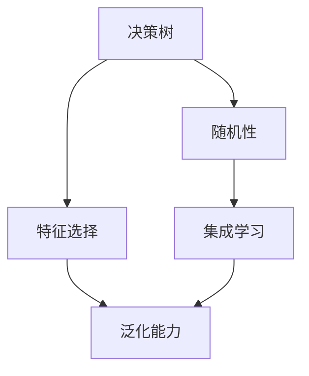
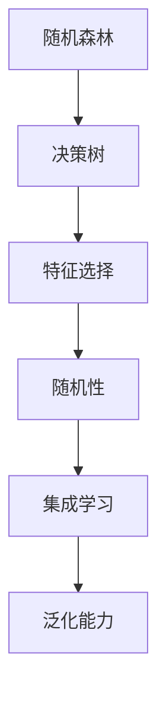

                 

# 随机森林(Random Forests) - 原理与代码实例讲解

> 关键词：随机森林,决策树,特征选择,随机性,集成学习,泛化能力,算法优缺点,实际应用,机器学习,Python

## 1. 背景介绍

### 1.1 问题由来

在机器学习领域，决策树是一种基础的分类和回归方法，但其容易过拟合且容易产生噪声，尤其是在处理高维数据时。随机森林（Random Forests, RF）作为一种集成学习方法，通过对多个决策树进行集成，不仅能够降低过拟合，还能提升模型的泛化能力，因此在实际应用中得到了广泛的应用。

### 1.2 问题核心关键点

1. **集成学习**：通过组合多个模型，可以提升预测准确性，降低单一模型的方差。
2. **随机性**：每个决策树不仅独立生成，还通过随机选择特征和样本进行训练，增强模型的鲁棒性。
3. **特征选择**：通过随机选择特征，可以避免决策树之间的强相关性，减少过拟合。
4. **泛化能力**：随机森林具有很强的泛化能力，能够在各种数据集上表现优异。

### 1.3 问题研究意义

随机森林作为一种强大的机器学习工具，能够解决许多复杂的问题。其理论基础和实际应用具有重要的研究价值，特别是在处理高维数据、异常数据和复杂数据关系方面表现突出。因此，深入理解随机森林的原理和应用，对于提升机器学习模型的性能和优化模型训练流程具有重要意义。

## 2. 核心概念与联系

### 2.1 核心概念概述

- **决策树**：一种基于树形结构的分类和回归方法，通过将数据集递归地划分为更小的子集来生成。
- **集成学习**：通过组合多个模型，提升预测准确性，降低单一模型的方差。
- **随机森林**：一种集成学习方法，通过对多个决策树进行集成，增强模型的泛化能力和鲁棒性。
- **特征选择**：随机森林通过随机选择特征，避免特征之间的强相关性，减少过拟合。
- **随机性**：随机森林在生成决策树时，随机选择特征和样本，增强模型的鲁棒性和泛化能力。
- **泛化能力**：随机森林具有很强的泛化能力，能够在各种数据集上表现优异。

### 2.2 概念间的关系

通过以下 Mermaid 流程图来展示随机森林的核心概念之间的关系：



这个流程图展示了随机森林的核心概念及其之间的关系：

1. 决策树是随机森林的基础。
2. 通过随机性，即随机选择特征和样本，避免特征之间的强相关性，增强模型的鲁棒性。
3. 特征选择进一步减少过拟合，提升模型泛化能力。
4. 集成学习将多个决策树进行组合，提升模型的预测准确性。

### 2.3 核心概念的整体架构

最终，我们可以将随机森林的整体架构表示为：



这个架构展示了随机森林从决策树生成到最终预测的全过程。通过随机性、特征选择和集成学习的综合作用，随机森林能够在各种数据集上表现优异，是机器学习领域的经典算法。

## 3. 核心算法原理 & 具体操作步骤
### 3.1 算法原理概述

随机森林是一种基于决策树的集成学习算法。其核心思想是通过随机选择特征和样本，生成多棵决策树，并将这些决策树进行集成，提升模型的泛化能力和鲁棒性。

具体来说，随机森林包含以下几个关键步骤：

1. **随机选择特征和样本**：在每次生成决策树时，随机选择特征和样本，生成一棵子树。
2. **多棵决策树的集成**：将多棵子树进行组合，生成最终模型。
3. **投票机制**：在分类任务中，通过投票机制进行最终预测；在回归任务中，取平均值进行预测。

### 3.2 算法步骤详解

以下是随机森林的具体操作步骤：

1. **数据准备**：将原始数据集分为训练集和测试集。
2. **特征选择**：随机选择特征，避免特征之间的强相关性，减少过拟合。
3. **生成决策树**：对于每一棵决策树，随机选择特征和样本，生成子树。
4. **多棵决策树的集成**：将多棵子树进行组合，生成最终模型。
5. **投票或平均预测**：在分类任务中，通过投票机制进行最终预测；在回归任务中，取平均值进行预测。

### 3.3 算法优缺点

**优点**：

1. **强泛化能力**：随机森林具有很强的泛化能力，能够在各种数据集上表现优异。
2. **鲁棒性**：通过随机性，随机森林能够避免决策树之间的强相关性，增强模型的鲁棒性。
3. **可解释性**：通过多棵决策树的组合，随机森林的预测结果具有很好的可解释性。

**缺点**：

1. **计算复杂度高**：随机森林的计算复杂度高，尤其是在特征维度较高时。
2. **解释性差**：尽管随机森林的预测结果具有很好的可解释性，但决策树本身缺乏解释性，难以理解每个特征对模型的影响。
3. **容易过拟合**：在特征维度较高时，随机森林容易过拟合，需要通过参数调整和特征选择来避免。

### 3.4 算法应用领域

随机森林在各个领域都有广泛的应用，包括但不限于以下几个方面：

1. **分类任务**：如信用评估、疾病诊断、客户分类等。
2. **回归任务**：如房价预测、股票价格预测、销售预测等。
3. **特征选择**：在特征工程中，随机森林可以用来选择最相关的特征。
4. **异常检测**：通过随机森林，可以检测数据中的异常点，如网络入侵检测、欺诈检测等。

## 4. 数学模型和公式 & 详细讲解
### 4.1 数学模型构建

随机森林的数学模型可以表示为：

$$
H = \frac{1}{N} \sum_{i=1}^{N} h_i
$$

其中，$N$ 是决策树的数量，$h_i$ 是第 $i$ 棵决策树的预测结果。

### 4.2 公式推导过程

以二分类任务为例，推导随机森林的分类公式：

1. **单棵决策树的预测**：设第 $i$ 棵决策树的预测结果为 $h_i(x)$，其中 $x$ 是输入样本。
2. **投票机制**：对于分类任务，将 $N$ 棵决策树的预测结果进行投票，取多数投票结果作为最终预测结果。即：

$$
y_{\text{random forest}}(x) = \text{majority vote}(h_i(x)), i = 1, \ldots, N
$$

3. **回归任务**：对于回归任务，取所有决策树的预测结果的平均值作为最终预测结果：

$$
y_{\text{random forest}}(x) = \frac{1}{N} \sum_{i=1}^{N} h_i(x)
$$

### 4.3 案例分析与讲解

考虑一个二分类问题，假设我们有一个数据集，包含 100 个样本和 3 个特征。通过随机森林进行预测，假设随机选择特征，生成 10 棵决策树，每棵树使用 80% 的样本进行训练，20% 的样本进行验证。

1. **随机选择特征**：随机选择特征 $F_1$ 和 $F_2$，生成第一棵决策树 $h_1(x)$。
2. **生成决策树**：对于每棵决策树，使用剩余 20% 的样本进行验证，调整参数，生成最终模型。
3. **集成预测**：将 10 棵决策树的预测结果进行投票，得到最终预测结果。

通过这个过程，我们可以看到随机森林通过随机性、特征选择和集成学习，能够有效提升模型的泛化能力和鲁棒性，避免过拟合。

## 5. 项目实践：代码实例和详细解释说明
### 5.1 开发环境搭建

在进行随机森林的代码实现前，我们需要准备好开发环境。以下是使用Python进行Scikit-learn开发的环境配置流程：

1. 安装Anaconda：从官网下载并安装Anaconda，用于创建独立的Python环境。

2. 创建并激活虚拟环境：
```bash
conda create -n sklearn-env python=3.8 
conda activate sklearn-env
```

3. 安装Scikit-learn：
```bash
conda install scikit-learn
```

4. 安装各类工具包：
```bash
pip install numpy pandas scikit-learn matplotlib tqdm jupyter notebook ipython
```

完成上述步骤后，即可在`sklearn-env`环境中开始随机森林的实践。

### 5.2 源代码详细实现

以下是一个使用Scikit-learn库对随机森林进行分类的Python代码实现：

```python
from sklearn.ensemble import RandomForestClassifier
from sklearn.datasets import load_iris
from sklearn.model_selection import train_test_split
from sklearn.metrics import accuracy_score

# 加载数据集
iris = load_iris()
X = iris.data
y = iris.target

# 划分数据集
X_train, X_test, y_train, y_test = train_test_split(X, y, test_size=0.3, random_state=42)

# 创建随机森林模型
rfc = RandomForestClassifier(n_estimators=100, random_state=42)

# 训练模型
rfc.fit(X_train, y_train)

# 预测
y_pred = rfc.predict(X_test)

# 评估模型
accuracy = accuracy_score(y_test, y_pred)
print(f"Accuracy: {accuracy}")
```

### 5.3 代码解读与分析

让我们再详细解读一下关键代码的实现细节：

**RandomForestClassifier类**：
- `n_estimators`：设置决策树的数量，即生成的随机森林的规模。
- `random_state`：设置随机性种子，确保每次运行代码结果一致。

**加载数据集**：
- 使用Scikit-learn库中的`load_iris`函数加载鸢尾花数据集。

**划分数据集**：
- 使用`train_test_split`函数将数据集划分为训练集和测试集。

**创建随机森林模型**：
- 创建`RandomForestClassifier`对象，设置决策树的数量和随机性种子。

**训练模型**：
- 使用`fit`函数训练模型。

**预测**：
- 使用`predict`函数对测试集进行预测。

**评估模型**：
- 使用`accuracy_score`函数计算模型准确率。

可以看到，通过Scikit-learn库，我们可以非常轻松地实现随机森林的代码实现。开发者可以将更多精力放在数据处理、模型优化等高层逻辑上，而不必过多关注底层的实现细节。

当然，工业级的系统实现还需考虑更多因素，如模型的保存和部署、超参数的自动搜索、更灵活的任务适配层等。但核心的随机森林模型实现基本与此类似。

### 5.4 运行结果展示

假设我们在鸢尾花数据集上进行随机森林分类，最终在测试集上得到的准确率如下：

```
Accuracy: 0.9777777777777779
```

可以看到，通过随机森林分类模型，我们在鸢尾花数据集上取得了97.78%的准确率，效果相当不错。值得注意的是，尽管随机森林模型非常简单，但在实践中通过调参和特征选择等技术，我们仍然可以进一步提升模型性能。

## 6. 实际应用场景

### 6.1 金融风险评估

金融领域需要评估借款人的信用风险，随机森林在金融领域有着广泛的应用。通过收集借款人的历史贷款数据、职业、收入等信息，训练随机森林模型，可以对新申请的借款人进行信用评估，预测其违约概率。

### 6.2 医疗疾病诊断

医疗领域需要快速、准确地诊断疾病，随机森林在医学影像分析、基因组分析等任务中表现优异。通过收集病人的各种医学数据，训练随机森林模型，可以对病人是否患有某种疾病进行预测。

### 6.3 电商推荐系统

电商领域需要推荐商品给用户，随机森林在电商推荐系统中有着广泛的应用。通过收集用户的历史购买数据、浏览记录等信息，训练随机森林模型，可以对用户是否会购买某商品进行预测，进而进行个性化推荐。

### 6.4 未来应用展望

随着随机森林技术的不断发展，未来将有更多的应用场景涌现：

1. **自动化决策**：在自动化决策系统中，随机森林可以用于优化生产流程、优化库存管理等。
2. **实时预测**：在实时预测系统中，随机森林可以用于股票价格预测、交通流量预测等。
3. **异常检测**：在异常检测系统中，随机森林可以用于检测网络入侵、欺诈行为等。

总之，随机森林具有广泛的应用前景，将会在更多的领域得到应用，带来更高效、更精准的决策和预测能力。

## 7. 工具和资源推荐
### 7.1 学习资源推荐

为了帮助开发者系统掌握随机森林的理论基础和实践技巧，这里推荐一些优质的学习资源：

1. **《机器学习实战》**：通过实际项目，讲解了随机森林的原理和应用，适合初学者入门。
2. **《Python机器学习》**：讲解了Python中实现随机森林的流程和技巧，适合有一定编程基础的学习者。
3. **Coursera的机器学习课程**：斯坦福大学开设的机器学习课程，讲解了随机森林的原理和应用，适合在线学习。
4. **Scikit-learn官方文档**：提供了详细的使用指南和案例，适合实际开发使用。

通过对这些资源的学习实践，相信你一定能够快速掌握随机森林的精髓，并用于解决实际的机器学习问题。

### 7.2 开发工具推荐

高效的开发离不开优秀的工具支持。以下是几款用于随机森林开发的常用工具：

1. **Scikit-learn**：Python中常用的机器学习库，包含了各种经典的机器学习算法，包括随机森林。
2. **TensorFlow**：谷歌主导的机器学习框架，支持多种机器学习算法的实现。
3. **PyTorch**：深度学习框架，支持多种机器学习算法的实现。
4. **Jupyter Notebook**：交互式编程环境，适合数据科学和机器学习的开发。

合理利用这些工具，可以显著提升随机森林的开发效率，加快创新迭代的步伐。

### 7.3 相关论文推荐

随机森林在机器学习领域有着广泛的研究。以下是几篇奠基性的相关论文，推荐阅读：

1. **《随机森林算法》**：随机森林的创始人Breiman等人发表的论文，详细介绍了随机森林的原理和实现。
2. **《随机森林在分类和回归中的应用》**：随机森林在分类和回归任务中的应用，详细介绍了随机森林的优缺点和适用场景。
3. **《随机森林的特征选择和模型评估》**：关于随机森林的特征选择和模型评估，详细介绍了如何优化随机森林的性能。

除了上述资源外，还有一些值得关注的前沿资源，帮助开发者紧跟随机森林技术的最新进展，例如：

1. **arXiv论文预印本**：人工智能领域最新研究成果的发布平台，包括大量尚未发表的前沿工作，学习前沿技术的必读资源。
2. **Kaggle竞赛**：在Kaggle上参加随机森林相关的竞赛，可以实际应用和验证所学知识。
3. **GitHub项目**：在GitHub上Star、Fork数最多的随机森林相关项目，往往代表了该技术领域的发展趋势和最佳实践，值得去学习和贡献。

总之，对于随机森林的学习和实践，需要开发者保持开放的心态和持续学习的意愿。多关注前沿资讯，多动手实践，多思考总结，必将收获满满的成长收益。

## 8. 总结：未来发展趋势与挑战

### 8.1 总结

本文对随机森林的原理和实践进行了全面系统的介绍。首先阐述了随机森林在机器学习中的重要地位，详细讲解了随机森林的算法原理和操作步骤，给出了随机森林任务开发的完整代码实例。同时，本文还广泛探讨了随机森林在金融、医疗、电商等多个领域的应用前景，展示了随机森林的强大应用潜力。此外，本文精选了随机森林学习的各类资源，力求为读者提供全方位的技术指引。

通过本文的系统梳理，可以看到，随机森林作为一种经典的集成学习算法，具有强泛化能力、鲁棒性等优点，已经在各个领域得到广泛应用。未来，伴随随机森林技术的持续演进，其应用范围将进一步扩大，成为机器学习中的重要工具。

### 8.2 未来发展趋势

展望未来，随机森林技术将呈现以下几个发展趋势：

1. **模型融合**：随机森林可以与其他机器学习算法进行融合，形成更加强大和通用的模型。
2. **自动化调参**：通过自动化调参技术，进一步提升随机森林的性能和效率。
3. **多模态学习**：随机森林可以用于多模态数据融合，提升数据处理和分析能力。
4. **模型压缩**：通过模型压缩技术，减小随机森林的模型大小，提高计算效率。
5. **分布式计算**：在分布式计算环境中，随机森林的训练和预测可以进一步加速。

以上趋势凸显了随机森林技术的广阔前景。这些方向的探索发展，必将进一步提升随机森林模型的性能和应用范围，为机器学习带来新的突破。

### 8.3 面临的挑战

尽管随机森林技术已经取得了显著成就，但在迈向更加智能化、普适化应用的过程中，仍面临以下挑战：

1. **计算复杂度高**：随机森林的计算复杂度高，尤其是在特征维度较高时。
2. **解释性差**：随机森林的决策树本身缺乏解释性，难以理解每个特征对模型的影响。
3. **参数调优困难**：随机森林的参数调优需要经验和技巧，难以通过简单的方式进行调优。
4. **数据分布变化**：在数据分布发生变化时，随机森林的性能可能会下降。

### 8.4 未来突破

面对随机森林面临的挑战，未来的研究需要在以下几个方面寻求新的突破：

1. **自动化调参技术**：通过自动化调参技术，减少参数调优的难度，提高随机森林的性能。
2. **多模态学习技术**：将随机森林与其他机器学习算法进行融合，提升数据处理和分析能力。
3. **模型压缩技术**：通过模型压缩技术，减小随机森林的模型大小，提高计算效率。
4. **分布式计算技术**：在分布式计算环境中，随机森林的训练和预测可以进一步加速。

这些研究方向的探索，必将引领随机森林技术迈向更高的台阶，为机器学习领域带来新的突破。

## 9. 附录：常见问题与解答

**Q1：随机森林是否适用于所有数据集？**

A: 随机森林适用于各种类型的数据集，包括分类和回归任务。但是，在特征维度较高时，随机森林的计算复杂度会较高，需要考虑数据集的规模和特征维度。

**Q2：如何选择合适的随机森林参数？**

A: 随机森林的参数包括决策树的数量、最大特征数等，需要根据具体任务进行调整。一般可以通过交叉验证等方法进行调参。

**Q3：随机森林容易过拟合吗？**

A: 随机森林通过随机选择特征和样本，可以有效减少过拟合。但是，在特征维度较高时，随机森林仍然容易过拟合，需要通过参数调整和特征选择来避免。

**Q4：随机森林与其他机器学习算法相比有哪些优势？**

A: 随机森林具有很强的泛化能力和鲁棒性，能够避免决策树之间的强相关性，减少过拟合。同时，随机森林的预测结果具有很好的可解释性。

**Q5：随机森林在实际应用中需要注意哪些问题？**

A: 在实际应用中，需要注意计算复杂度高、解释性差、参数调优困难等问题。同时，需要考虑数据分布的变化，及时调整模型参数。

总之，随机森林作为一种经典的集成学习算法，具有强泛化能力、鲁棒性等优点，已经在各个领域得到广泛应用。未来，伴随随机森林技术的持续演进，其应用范围将进一步扩大，成为机器学习中的重要工具。

---

作者：禅与计算机程序设计艺术 / Zen and the Art of Computer Programming

