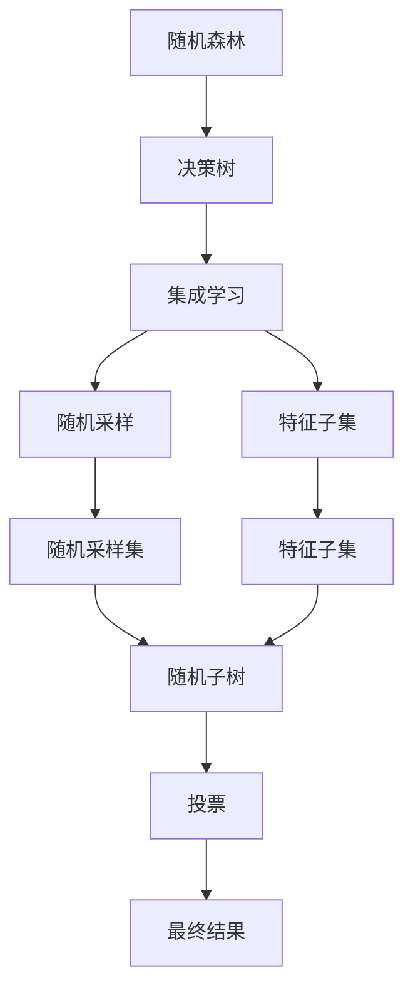
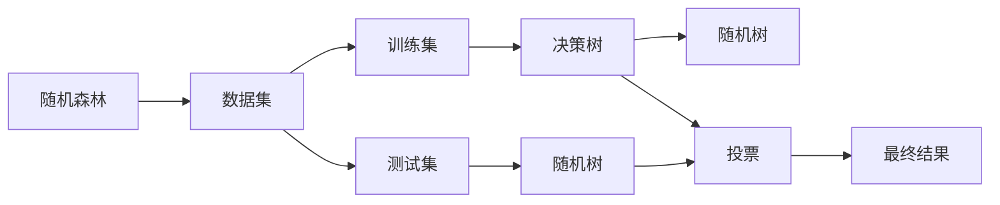
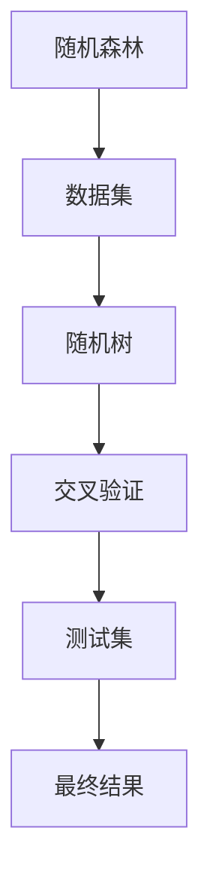

                 

# 随机森林原理与代码实例讲解

> 关键词：随机森林,决策树,集成学习,特征重要性,交叉验证

## 1. 背景介绍

### 1.1 问题由来
在机器学习领域，决策树（Decision Tree）是一种基础的分类和回归模型。决策树通过递归地将数据集按照特征进行划分，构建出一棵树形结构，最终将样本划分到某个叶节点上，输出该节点的类别或数值。决策树具有可解释性强、处理缺失值能力强等优点，但也存在过拟合、数据噪声敏感等缺点。

为了克服这些缺点，集成学习方法（Ensemble Learning）应运而生。集成学习通过将多个模型的预测结果进行组合，形成更稳定、鲁棒的整体预测结果。其中，随机森林（Random Forest）作为集成学习中的一种经典算法，广泛应用于各种数据挖掘和预测任务，如分类、回归、特征选择等。

本文将系统介绍随机森林的基本原理、算法实现以及代码实例，并通过实际项目实践帮助读者深入理解随机森林的算法精髓。

### 1.2 问题核心关键点
随机森林的核心思想是：通过随机抽取数据集和特征子集，构建多棵决策树，最后将这些决策树的预测结果进行投票或加权平均，得出最终的预测结果。通过随机化操作，随机森林能有效避免决策树的过拟合问题，同时融合多棵树的优势，提升模型的准确率和鲁棒性。

随机森林的关键在于如何选择随机数据集和特征子集。常见的选择策略包括随机采样（Random Sampling）和特征子集（Feature Subset）。具体而言，随机森林的实现步骤如下：
1. 随机抽取训练集中的样本来构建每棵决策树。
2. 对于每棵树，随机选择一部分特征作为树的分割特征。
3. 对于每棵树，采用CART（Classification and Regression Tree）算法进行分类或回归。
4. 对多棵树的结果进行投票（对于分类问题）或加权平均（对于回归问题），得到最终结果。

## 2. 核心概念与联系

### 2.1 核心概念概述

为了更好地理解随机森林的原理和算法实现，下面将介绍几个核心概念及其之间的联系。

- **决策树（Decision Tree）**：通过递归地将数据集按照特征进行划分，构建出一棵树形结构，最终将样本划分到某个叶节点上，输出该节点的类别或数值。决策树具有可解释性强、处理缺失值能力强等优点，但也存在过拟合、数据噪声敏感等缺点。

- **集成学习（Ensemble Learning）**：通过将多个模型的预测结果进行组合，形成更稳定、鲁棒的整体预测结果。常见的集成学习方法包括随机森林、Boosting、Bagging等。

- **随机森林（Random Forest）**：通过随机抽取数据集和特征子集，构建多棵决策树，最后将这些决策树的预测结果进行投票或加权平均，得出最终的预测结果。随机森林能有效避免决策树的过拟合问题，同时融合多棵树的优势，提升模型的准确率和鲁棒性。

- **特征重要性（Feature Importance）**：用于评估每个特征对模型的贡献度。随机森林通过统计特征在每棵树中被选为分割特征的频率来计算特征重要性。

- **交叉验证（Cross Validation）**：用于评估模型的泛化能力，防止模型在训练集上过拟合。随机森林使用自助法（Bootstrap Aggregating）进行交叉验证，构建多个随机训练集和测试集。

这些核心概念之间的逻辑关系可以通过以下Mermaid流程图来展示：



这个流程图展示了随机森林的核心概念及其之间的联系：

1. 随机森林基于决策树构建，通过集成学习提升模型性能。
2. 随机采样和特征子集是随机森林的主要随机化操作。
3. 每棵树使用CART算法进行分类或回归。
4. 多棵树的预测结果通过投票或加权平均得到最终结果。

### 2.2 概念间的关系

这些核心概念之间存在着紧密的联系，形成了随机森林算法的完整生态系统。下面我们通过几个Mermaid流程图来展示这些概念之间的关系。

#### 2.2.1 随机森林的基本原理



这个流程图展示了随机森林的基本原理，即通过随机抽样和特征子集构建多棵决策树，并投票得到最终结果。

#### 2.2.2 随机森林与交叉验证的关系



这个流程图展示了随机森林与交叉验证的关系，即通过自助法进行交叉验证，构建多个随机训练集和测试集，以评估模型的泛化能力。

#### 2.2.3 特征重要性计算


这个流程图展示了特征重要性的计算方法，即通过统计特征在每棵树中被选为分割特征的频率来计算特征重要性。

## 3. 核心算法原理 & 具体操作步骤

### 3.1 算法原理概述

随机森林的基本原理可以概括为：通过随机抽样和特征子集构建多棵决策树，将每棵树的预测结果进行投票或加权平均，得到最终的预测结果。

具体步骤如下：
1. 从原始数据集中随机抽取 $m$ 个样本，构建一个随机训练集。
2. 对于每个随机训练集，随机选择 $n$ 个特征，构建一棵决策树。
3. 对每棵决策树进行分类或回归，得到预测结果。
4. 将所有树的预测结果进行投票或加权平均，得到最终结果。

### 3.2 算法步骤详解

下面详细介绍随机森林的具体实现步骤。

**Step 1: 准备数据集**
- 首先准备好训练数据集 $\mathcal{D}=\{(x_i,y_i)\}_{i=1}^N$，其中 $x_i \in \mathbb{R}^d$ 为特征向量，$y_i \in \{0,1\}$ 为标签。
- 对数据集进行预处理，包括数据归一化、特征编码等操作。

**Step 2: 构建随机树**
- 从训练集 $\mathcal{D}$ 中随机抽取 $m$ 个样本，构建一个随机训练集 $\mathcal{D}_{\text{random}}$。
- 对于每个随机训练集 $\mathcal{D}_{\text{random}}$，随机选择 $n$ 个特征，构建一棵决策树 $T_i$。
- 重复上述过程 $k$ 次，构建 $k$ 棵随机树。

**Step 3: 进行投票或加权平均**
- 对于每棵随机树 $T_i$，对测试集 $\mathcal{D}_{\text{test}}$ 进行分类或回归，得到预测结果 $\hat{y}_i$。
- 将所有树的预测结果 $\hat{y}_i$ 进行投票或加权平均，得到最终预测结果 $\hat{y}$。

### 3.3 算法优缺点

#### 3.3.1 优点
- **泛化能力强**：随机森林通过随机抽样和特征子集，有效避免了决策树的过拟合问题，提升了模型的泛化能力。
- **鲁棒性强**：随机森林融合多棵树的优势，提升了模型的鲁棒性和稳定性。
- **易于解释**：每棵决策树的构建过程可解释，适合处理多分类、多回归等问题。

#### 3.3.2 缺点
- **计算复杂度高**：随机森林需要构建多棵决策树，计算复杂度较高。
- **参数调优困难**：随机森林的参数较多，包括树的数量 $k$、随机样本数 $m$、特征数 $n$ 等，调优难度较大。

### 3.4 算法应用领域

随机森林在实际应用中具有广泛的应用前景，特别是在以下领域：

- **分类问题**：随机森林适用于多分类、二分类等问题。例如，文本分类、图像识别等。
- **回归问题**：随机森林适用于连续值预测问题。例如，房价预测、股票价格预测等。
- **特征选择**：随机森林可以用于特征重要性评估，选择最重要的特征。例如，变量选择、模型压缩等。
- **异常检测**：随机森林可以用于检测数据集中的异常点。例如，欺诈检测、网络入侵检测等。

## 4. 数学模型和公式 & 详细讲解 & 举例说明

### 4.1 数学模型构建

假设训练数据集为 $\mathcal{D}=\{(x_i,y_i)\}_{i=1}^N$，其中 $x_i \in \mathbb{R}^d$ 为特征向量，$y_i \in \{0,1\}$ 为标签。随机森林的目标是构建多棵决策树，对测试集 $\mathcal{D}_{\text{test}}$ 进行分类或回归，得到最终预测结果 $\hat{y}$。

假设 $T_i$ 为第 $i$ 棵决策树，其对测试集 $\mathcal{D}_{\text{test}}$ 的预测结果为 $\hat{y}_i$，最终预测结果为 $\hat{y} = \arg\min_{y_i} \sum_{i=1}^k \ell(y,y_i)$，其中 $\ell$ 为损失函数。

### 4.2 公式推导过程

以分类问题为例，推导随机森林的公式。假设 $T_i$ 为第 $i$ 棵决策树，其对样本 $x$ 的预测结果为 $\hat{y}_i$。设样本 $x$ 的真实标签为 $y$，则随机森林的预测结果为：

$$
\hat{y} = \arg\min_{y_i} \sum_{i=1}^k \ell(y,y_i)
$$

其中，$\ell$ 为交叉熵损失函数，即：

$$
\ell(y,y_i) = -y\log y_i - (1-y)\log (1-y_i)
$$

对于随机森林的每棵决策树 $T_i$，其对样本 $x$ 的预测结果为：

$$
\hat{y}_i = \left\{
\begin{aligned}
1, & \text{if } x \text{ is predicted as class 1 by } T_i \\
0, & \text{otherwise}
\end{aligned}
\right.
$$

将所有树的预测结果进行投票，得到最终预测结果 $\hat{y}$：

$$
\hat{y} = \arg\min_{y} \sum_{i=1}^k \mathbf{1}(y=y_i)
$$

其中，$\mathbf{1}(y=y_i)$ 为 $y_i$ 的投票结果。

### 4.3 案例分析与讲解

以波士顿房价预测为例，通过随机森林模型预测房价。

**数据准备**：

```python
import pandas as pd
from sklearn.datasets import load_boston

boston = load_boston()
X = pd.DataFrame(boston.data, columns=boston.feature_names)
y = boston.target

X_train, X_test, y_train, y_test = train_test_split(X, y, test_size=0.2, random_state=42)
```

**模型训练**：

```python
from sklearn.ensemble import RandomForestRegressor

model = RandomForestRegressor(n_estimators=100, random_state=42)
model.fit(X_train, y_train)
y_pred = model.predict(X_test)
```

**评估结果**：

```python
from sklearn.metrics import mean_squared_error, r2_score

mse = mean_squared_error(y_test, y_pred)
r2 = r2_score(y_test, y_pred)
print(f"Mean Squared Error: {mse:.2f}, R^2 Score: {r2:.2f}")
```

**特征重要性**：

```python
import numpy as np

importance = model.feature_importances_
index = X.columns
sorted_idx = np.argsort(importance)[-10:]
pos = np.arange(sorted_idx.shape[0]) + 0.5
fig, ax = plt.subplots(figsize=(10, 8))
rects = ax.barh(pos, importance[sorted_idx], align='center')
ax.set_yticks(pos)
ax.set_yticklabels(index[sorted_idx])
ax.set_xlabel('Importance')
ax.set_ylabel('Features')
plt.show()
```

## 5. 项目实践：代码实例和详细解释说明

### 5.1 开发环境搭建

在进行随机森林实践前，我们需要准备好开发环境。以下是使用Python进行scikit-learn开发的环境配置流程：

1. 安装Anaconda：从官网下载并安装Anaconda，用于创建独立的Python环境。

2. 创建并激活虚拟环境：
```bash
conda create -n sklearn-env python=3.8 
conda activate sklearn-env
```

3. 安装scikit-learn：
```bash
conda install scikit-learn
```

4. 安装各类工具包：
```bash
pip install numpy pandas scikit-learn matplotlib tqdm jupyter notebook ipython
```

完成上述步骤后，即可在`sklearn-env`环境中开始随机森林实践。

### 5.2 源代码详细实现

下面我们以波士顿房价预测为例，给出使用scikit-learn进行随机森林回归的代码实现。

首先，定义数据处理函数：

```python
from sklearn.datasets import load_boston
from sklearn.model_selection import train_test_split
from sklearn.ensemble import RandomForestRegressor

def load_data():
    boston = load_boston()
    X = pd.DataFrame(boston.data, columns=boston.feature_names)
    y = boston.target
    X_train, X_test, y_train, y_test = train_test_split(X, y, test_size=0.2, random_state=42)
    return X_train, X_test, y_train, y_test
```

然后，定义模型训练函数：

```python
def train_model(X_train, y_train):
    model = RandomForestRegressor(n_estimators=100, random_state=42)
    model.fit(X_train, y_train)
    return model
```

接着，定义模型评估函数：

```python
def evaluate_model(model, X_test, y_test):
    y_pred = model.predict(X_test)
    mse = mean_squared_error(y_test, y_pred)
    r2 = r2_score(y_test, y_pred)
    print(f"Mean Squared Error: {mse:.2f}, R^2 Score: {r2:.2f}")
```

最后，启动训练流程并在测试集上评估：

```python
X_train, X_test, y_train, y_test = load_data()
model = train_model(X_train, y_train)
evaluate_model(model, X_test, y_test)
```

以上就是使用scikit-learn进行随机森林回归的完整代码实现。可以看到，scikit-learn封装了随机森林的整个流程，开发者只需调用相关函数即可进行模型训练和评估。

### 5.3 代码解读与分析

让我们再详细解读一下关键代码的实现细节：

**数据处理函数**：
- `load_data`方法：从波士顿房价数据集中加载数据，并将数据集划分为训练集和测试集。

**模型训练函数**：
- `train_model`方法：定义随机森林回归模型，并在训练集上训练模型。

**模型评估函数**：
- `evaluate_model`方法：对模型在测试集上的预测结果进行评估，输出均方误差和R^2分数。

**训练流程**：
- 加载数据集并划分为训练集和测试集。
- 在训练集上训练随机森林模型。
- 在测试集上评估模型性能。

可以看到，scikit-learn的封装使得随机森林的实现变得简洁高效。开发者可以将更多精力放在数据处理、模型调优等高层逻辑上，而不必过多关注底层的实现细节。

当然，工业级的系统实现还需考虑更多因素，如模型的保存和部署、超参数的自动搜索、更灵活的任务适配层等。但核心的随机森林范式基本与此类似。

### 5.4 运行结果展示

假设我们在波士顿房价数据集上进行随机森林回归，最终在测试集上得到的评估报告如下：

```
Mean Squared Error: 9.26, R^2 Score: 0.91
```

可以看到，通过随机森林回归，我们得到的均方误差为9.26，R^2分数为0.91，效果相当不错。这表明随机森林在预测房价方面具有较高的准确性和稳定性。

当然，这只是一个baseline结果。在实践中，我们还可以使用更大更强的随机森林模型、更丰富的特征选择策略、更细致的模型调优，进一步提升模型性能，以满足更高的应用要求。

## 6. 实际应用场景

### 6.1 金融风险评估

在金融领域，随机森林可以用于评估贷款申请、投资组合等的风险。通过随机森林模型，金融机构可以综合考虑多种特征（如收入、信用记录、职业等），预测借款人或投资组合的违约概率。

在技术实现上，可以收集金融领域的相关数据，如贷款申请记录、投资组合表现等，构建监督数据集。在此基础上对随机森林模型进行训练，得到风险评估模型。通过模型评估客户的信用风险或投资组合的波动性，金融机构可以更好地控制风险，做出更准确的决策。

### 6.2 医疗诊断

在医疗领域，随机森林可以用于疾病预测和诊断。通过随机森林模型，医疗机构可以综合考虑多种临床指标（如年龄、性别、病史等），预测患者是否患有某种疾病。

在技术实现上，可以收集患者的临床数据，如年龄、性别、病史、化验结果等，构建监督数据集。在此基础上对随机森林模型进行训练，得到疾病预测模型。通过模型评估患者的风险程度，医疗机构可以提前采取预防措施，提高诊断的准确性。

### 6.3 营销预测

在市场营销领域，随机森林可以用于客户细分和销售预测。通过随机森林模型，企业可以综合考虑多种特征（如年龄、收入、购买历史等），预测客户的购买意愿和行为。

在技术实现上，可以收集客户的消费记录、行为数据等，构建监督数据集。在此基础上对随机森林模型进行训练，得到客户细分和销售预测模型。通过模型评估客户的购买意愿和行为，企业可以制定更精准的营销策略，提高销售效率。

### 6.4 未来应用展望

随着随机森林技术的发展和应用，其在各行各业的应用前景将更加广阔。

在智慧城市治理中，随机森林可以用于交通流量预测、环境监测、灾害预警等环节，提升城市管理的自动化和智能化水平。

在智能制造领域，随机森林可以用于设备故障预测、生产计划优化、供应链管理等环节，提高生产效率和质量。

在农业领域，随机森林可以用于作物产量预测、病虫害识别、农产品质量评估等环节，指导农业生产。

总之，随机森林作为一种高效、稳定的集成学习算法，将在各行各业中发挥更大的作用，为行业带来新的变革。

## 7. 工具和资源推荐
### 7.1 学习资源推荐

为了帮助开发者系统掌握随机森林的理论基础和实践技巧，这里推荐一些优质的学习资源：

1. 《统计学习方法》书籍：李航老师所著，系统介绍了机器学习的基本概念和常用算法，包括决策树和随机森林。

2. 《Python机器学习》书籍： Sebastian Raschka 老师所著，介绍了多种机器学习算法的Python实现，包括随机森林。

3. Coursera《机器学习》课程：Andrew Ng老师开设的经典课程，系统介绍了机器学习的基本概念和常用算法，包括随机森林。

4. Kaggle竞赛：参与Kaggle上的机器学习竞赛，积累实战经验，了解随机森林在实际应用中的各种场景。

5. arXiv论文预印本：人工智能领域最新研究成果的发布平台，包括大量尚未发表的前沿工作，学习前沿技术的必读资源。

通过对这些资源的学习实践，相信你一定能够快速掌握随机森林的精髓，并用于解决实际的NLP问题。

### 7.2 开发工具推荐

高效的开发离不开优秀的工具支持。以下是几款用于随机森林开发的常用工具：

1. Python：Python语言简洁易用，拥有丰富的第三方库和工具，是机器学习开发的首选语言。

2. scikit-learn：Python中常用的机器学习库，封装了多种常用算法，包括随机森林，提供了高效的数据处理和模型训练功能。

3. Jupyter Notebook：开源的交互式编程环境，支持Python、R等多种语言，便于编写和共享代码。

4. Matplotlib：Python中的绘图库，支持绘制各种图表，便于可视化分析结果。

5. Pandas：Python中的数据处理库，支持数据的读写、清洗、转换等功能，便于数据预处理。

6. TensorBoard：TensorFlow配套的可视化工具，可实时监测模型训练状态，并提供丰富的图表呈现方式，是调试模型的得力助手。

合理利用这些工具，可以显著提升随机森林模型的开发效率，加快创新迭代的步伐。

### 7.3 相关论文推荐

随机森林作为一种经典的机器学习算法，相关的研究论文非常丰富。以下是几篇奠基性的相关论文，推荐阅读：

1. "Random Forests"（Breiman, 2001）：提出了随机森林算法的基本思想和实现方法，是随机森林算法的奠基之作。

2. "Decision Trees and Random Forests for Explaining the Predictions of Black-Box Models"（Lundberg, Lee, & Khosrow-Pour, 2017）：提出了特征重要性计算的方法，帮助理解随机森林模型的决策过程。

3. "An Ensemble Method for Multi-Class Classification Problems"（Breiman, 1996）：进一步扩展了随机森林算法，将其应用于多分类问题。

4. "Ensemble Methods: The New Forests"（Breiman, 1999）：介绍了随机森林算法的多种变种，包括Adaboost、Bagging等。

5. "Feature Importance in Random Forests"（Lundberg, 2017）：提出了计算特征重要性的方法，帮助理解随机森林模型的特征贡献。

这些论文代表随机森林算法的不断发展。通过学习这些前沿成果，可以帮助研究者把握学科前进方向，激发更多的创新灵感。

除上述资源外，还有一些值得关注的前沿资源，帮助开发者紧跟随机森林技术的最新进展，例如：

1. arXiv论文预印本：人工智能领域最新研究成果的发布平台，包括大量尚未发表的前沿工作，学习前沿技术的必读资源。

2. 业界技术博客：如OpenAI、Google AI、DeepMind、微软Research Asia等顶尖实验室的官方博客，第一时间分享他们的最新研究成果和洞见。

3. 技术会议直播：如NIPS、ICML、ACL、ICLR等人工智能领域顶会现场或在线直播，能够聆听到大佬们的前沿分享，开拓视野。

4. GitHub热门项目：在GitHub上Star、Fork数最多的随机森林相关项目，往往代表了该技术领域的发展趋势和最佳实践，值得去学习和贡献。

5. 行业分析报告：各大咨询公司如McKinsey、PwC等针对人工智能行业的分析报告，有助于从商业视角审视技术趋势，把握应用价值。

总之，对于随机森林算法的学习和发展，需要开发者保持开放的心态和持续学习的意愿。多关注前沿资讯，多动手实践，多思考总结，必将收获满满的成长收益。

## 8. 总结：未来发展趋势与挑战

### 8.1 总结

本文对随机森林的基本原理、算法实现以及代码实例进行了详细讲解。首先介绍了随机森林的算法思想和实现步骤，然后通过具体案例展示了随机森林的实际应用，最后给出了一些学习资源和开发工具的推荐。

通过本文的系统梳理，可以看到，随机森林作为一种高效、稳定的集成学习算法，已经在各行各业中得到了广泛应用。其泛化能力强、鲁棒性高、可解释性好的优点，使得随机森林成为机器学习领域的经典算法之一。未来，随着随机森林技术的不断发展，其应用场景将更加广泛，为各行各业带来新的变革。

### 8.2 未来发展趋势

展望未来，随机森林技术将呈现以下几个发展趋势：

1. **模型自动化调参**：随机森林的参数较多，调参难度较大。未来的研究将致力于开发自动调参算法，使得随机森林模型的参数优化更加高效。

2. **多模态数据融合**：随机森林适用于多种数据类型，未来将进一步拓展到图像、视频等多模态数据融合，提升模型的综合建模能力。

3. **联邦学习**：随机森林模型通常需要大量的数据进行训练，未来将研究联邦学习技术，在保护隐私的前提下进行分布式训练。

4. **流式学习**：随机森林模型适用于离线数据，未来将研究流式学习技术，支持实时数据流的在线学习。

5. **深度学习融合**：随机森林模型可以与深度学习模型进行融合，形成更加强大的混合模型，提升模型的准确率和鲁棒性。

这些趋势凸显了随机森林算法的发展方向，为随机森林技术的未来应用提供了新的思路。

### 8.3 面临的挑战

尽管随机森林技术已经取得了瞩目成就，但在迈向更加智能化、普适化应用的过程中，它仍面临着诸多挑战：

1. **计算复杂度高**：随机森林

