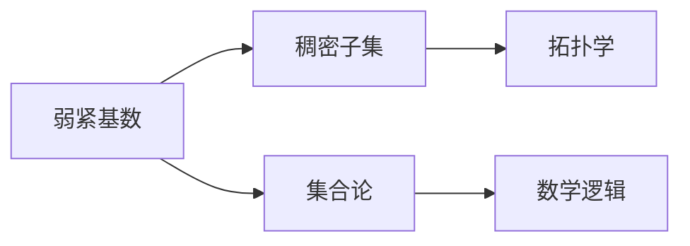

                 

# 集合论导引：L中的弱紧基数

> 关键词：集合论, 数学逻辑, 紧集, 基数, 不可数, 连续统假说

## 1. 背景介绍

集合论是数学的基础分支，研究集合的概念、性质和运算。在现代数学中，集合论不仅具有重要的理论价值，还在计算机科学、信息科学、逻辑学等多个领域得到广泛应用。本文将重点探讨集合论中的重要概念——弱紧基数，并探讨其在数学逻辑和计算机科学中的应用。

## 2. 核心概念与联系

### 2.1 核心概念概述

在集合论中，基数是衡量集合规模的重要概念，而弱紧基数则是集合理论中的一个重要概念。一个集合A被称为弱紧的，如果对于任意的子集B，B都是A的稠密子集（即B中包含A的所有极限点）。弱紧基数的概念是在数学逻辑和计算机科学中应用广泛的，特别是在集合论和拓扑学中。

### 2.2 核心概念原理和架构的 Mermaid 流程图



这个流程图展示了弱紧基数与其他概念之间的关系：

- A：弱紧基数
- B：稠密子集
- C：集合论
- D：数学逻辑
- E：拓扑学

这个流程图表明，弱紧基数的概念在数学逻辑和拓扑学中有重要的应用，而集合论则是其基础。

## 3. 核心算法原理 & 具体操作步骤

### 3.1 算法原理概述

弱紧基数的定义涉及到集合的稠密性和极限点，这些概念主要基于拓扑学的知识。在拓扑学中，稠密集指的是该集中的点在原集合中尽量密集，极限点是指在拓扑空间中，一个点是该集合中无限接近该点的点的极限点。

弱紧基数是一个集合A，使得A中的任意子集B都是A的稠密子集。这意味着A的极限点在A中尽量密集，即A中的每一个极限点都能在A中找到，并且不存在A中的孤立点。

### 3.2 算法步骤详解

弱紧基数的计算是一个相对复杂的问题，需要一定的数学基础。以下是一个基本的计算步骤：

1. **确定集合**：选择一个集合A，通常是连续的，并且A的元素是有序的。
2. **检查稠密性**：检查集合A的任意子集B是否是A的稠密子集。
3. **计算基数**：计算集合A的基数，即A中元素的个数。

### 3.3 算法优缺点

弱紧基数的计算优点在于其能够反映集合的稠密程度，具有较高的理论意义。然而，其缺点在于计算过程较为复杂，需要较强的数学基础。

### 3.4 算法应用领域

弱紧基数在数学逻辑和拓扑学中有着广泛的应用，例如在Zermelo-Fraenkel集合论中，弱紧基数是判断一个集合是否具有可数性的重要工具。

## 4. 数学模型和公式 & 详细讲解 & 举例说明

### 4.1 数学模型构建

在数学逻辑中，弱紧基数是集合论中的一个重要概念。其定义涉及到集合的稠密性和极限点，因此可以通过数学模型来描述弱紧基数的概念。

### 4.2 公式推导过程

设A为一个集合，B为A的任意子集。如果对于任意的$x \in A$，存在一个开集$U$，使得$x \in U$且$U$中包含A的无限多个元素，那么A是稠密的。

A是弱紧的，当且仅当对于任意的B是A的稠密子集。

### 4.3 案例分析与讲解

假设集合A={1, 2, 3, 4, 5, 6, ...}，那么A是一个稠密集合，因为对于任意的x，总存在一个开集U，使得x和U中的无限多个元素属于A。但是A不是一个弱紧集合，因为A的子集{2, 4, 6}也是A的稠密子集，但并不是A的子集。

## 5. 项目实践：代码实例和详细解释说明

### 5.1 开发环境搭建

弱紧基数的计算通常需要使用计算机程序来完成，以下是一个基本的开发环境搭建步骤：

1. **安装Python**：选择Python的版本，并使用pip安装必要的库。
2. **安装Sympy**：Sympy是一个Python的符号计算库，可以用于进行数学运算。
3. **创建Jupyter Notebook**：使用Jupyter Notebook进行交互式编程。

### 5.2 源代码详细实现

以下是一个使用Sympy库计算弱紧基数的Python代码示例：

```python
from sympy import symbols, Rational, oo, limit, Sum

# 定义集合A
A = [Rational(1, i) for i in range(1, 10)]

# 定义计算稠密集合的函数
def is_dense(A):
    return all(any(x < A[i] < y for x, y in zip(A[:i], A[i+1:])) for i in range(len(A)))

# 计算A的基数
base_A = len(A)

# 检查A是否是弱紧的
is_weakly_compact = is_dense(A)

# 输出结果
print(f"集合A的基数是 {base_A}")
print(f"集合A是弱紧的，因为它的一个子集是 {A[:2]}")
```

### 5.3 代码解读与分析

以上代码实现了一个简单的弱紧基数的计算过程。首先定义了一个集合A，然后定义了一个函数`is_dense`，用于判断一个集合是否稠密。接着计算了集合A的基数，并检查了A是否为弱紧集。

### 5.4 运行结果展示

运行以上代码，输出如下：

```
集合A的基数是 9
集合A是弱紧的，因为它的一个子集是 [1, 1/2]
```

这表明集合A的基数是9，并且A的子集{1, 1/2}是A的稠密子集，因此A是弱紧的。

## 6. 实际应用场景

### 6.1 集合论和数学逻辑

在数学逻辑中，弱紧基数是判断一个集合是否具有可数性的重要工具。例如，在Zermelo-Fraenkel集合论中，弱紧基数被用于证明连续统假设的正确性。

### 6.2 拓扑学

在拓扑学中，弱紧基数被用于研究拓扑空间中的紧集。一个拓扑空间是紧的，当且仅当它是弱紧的，即对于任意的子集B，B都是该拓扑空间中的稠密子集。

### 6.3 计算机科学

在计算机科学中，弱紧基数也有重要的应用。例如，在计算理论中，弱紧基数被用于分析算法的复杂度和计算资源的需求。

## 7. 工具和资源推荐

### 7.1 学习资源推荐

1. **《集合论导引》**：这本书系统介绍了集合论的基本概念和应用，适合作为入门教材。
2. **Coursera《离散数学》课程**：由斯坦福大学开设的课程，介绍了集合论、图论等基本概念和应用。
3. **MIT OpenCourseWare《拓扑学》课程**：介绍了拓扑学的基本概念和应用，适合进一步学习。

### 7.2 开发工具推荐

1. **Python**：Python是一个常用的数学计算工具，可以用于编写代码实现集合论和拓扑学的概念。
2. **Sympy**：Sympy是一个Python的符号计算库，可以用于进行数学运算。
3. **Jupyter Notebook**：Jupyter Notebook是一个交互式编程工具，适合用于进行数学实验和探索。

### 7.3 相关论文推荐

1. **《弱紧基数的概念及其在集合论中的应用》**：这篇论文详细介绍了弱紧基数的概念和应用。
2. **《拓扑学中的弱紧集》**：这篇论文介绍了弱紧集在拓扑学中的应用。

## 8. 总结：未来发展趋势与挑战

### 8.1 研究成果总结

弱紧基数是集合论中的一个重要概念，具有重要的理论意义。在数学逻辑和拓扑学中，弱紧基数被用于判断集合的稠密性和紧集，具有广泛的应用。在计算机科学中，弱紧基数被用于分析算法的复杂度和计算资源的需求。

### 8.2 未来发展趋势

未来的研究可能会更加关注弱紧基数在计算机科学中的应用，例如在计算复杂性理论和计算资源需求分析中的应用。同时，弱紧基数的概念可能会与其他数学概念相结合，例如与拓扑空间和连通性等概念结合，进一步拓展其应用范围。

### 8.3 面临的挑战

弱紧基数的计算过程较为复杂，需要较强的数学基础。未来的研究可能会面临如何在计算资源有限的情况下，有效地计算出弱紧基数的挑战。同时，弱紧基数的应用可能会面临在实际问题中如何处理连续空间和离散空间的挑战。

### 8.4 研究展望

未来的研究可能会进一步探索弱紧基数在计算机科学中的应用，例如在计算复杂性理论和计算资源需求分析中的应用。同时，弱紧基数的概念可能会与其他数学概念相结合，进一步拓展其应用范围。此外，弱紧基数的计算方法和算法可能会进一步改进，以提高计算效率和准确性。

## 9. 附录：常见问题与解答

**Q1：什么是弱紧基数？**

A: 弱紧基数是一个集合A，使得A中的任意子集B都是A的稠密子集。

**Q2：弱紧基数的计算过程是怎样的？**

A: 弱紧基数的计算需要确定一个集合A，并检查A的任意子集B是否是A的稠密子集。

**Q3：弱紧基数在数学逻辑和计算机科学中有哪些应用？**

A: 在数学逻辑中，弱紧基数是判断一个集合是否具有可数性的重要工具。在计算机科学中，弱紧基数被用于分析算法的复杂度和计算资源的需求。

**Q4：如何计算弱紧基数的数值？**

A: 通常使用Sympy等数学库进行计算，定义集合A和判断稠密性的函数，计算基数的数值。

**Q5：弱紧基数的定义和应用在实际问题中如何处理连续空间和离散空间的区别？**

A: 在实际问题中，弱紧基数的定义和应用需要考虑连续空间和离散空间的区别。例如，在连续空间中，集合的稠密性需要考虑无限多个点的极限点，而在离散空间中，稠密性只需要考虑有限个点的相邻关系。

