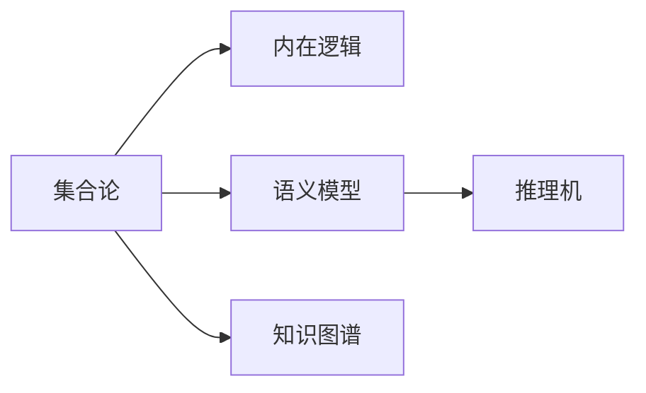

                 

# 集合论导引：内在模型论概要

> 关键词：集合论,内在模型论,语义模型,知识表示,知识图谱,推理机,知识工程,认知计算

## 1. 背景介绍

### 1.1 问题由来
在人工智能领域，随着知识表示、知识工程、认知计算等技术的发展，如何有效构建和利用知识库成为了一个核心问题。传统知识库往往以符号逻辑和数据库的形式存在，但这些知识库在表达复杂知识、推理能力等方面存在不足。因此，寻找一种更为灵活、强大的知识表示和推理框架变得尤为关键。

内在模型论（Intrinsic Model Theory）正是一种新兴的知识表示和推理框架，其核心思想是通过集合论等数学工具，将知识表示为集合的层次结构，从而实现更为自然、有效的知识推理。本文将系统介绍内在模型论的基本概念、核心算法和实际应用，为读者提供深入理解该理论的导引。

### 1.2 问题核心关键点
内在模型论主要围绕以下核心关键点展开：
- 集合论作为知识表示的基础，将知识库中的实体、关系、属性等表示为集合元素。
- 通过定义合适的公理和推理规则，构建内在的逻辑推理框架。
- 引入结构化的知识表示形式，支持复杂的推理和计算任务。
- 利用多种推理机制，实现知识推理的自动化和高效化。
- 应用于知识工程、人工智能、认知计算等多个领域，提升系统性能。

本文将通过以下几个部分详细介绍内在模型论的各个方面，帮助读者全面掌握该理论的核心思想和应用方法。

## 2. 核心概念与联系

### 2.1 核心概念概述

为了更好地理解内在模型论的基本框架和核心概念，本节将详细介绍几个关键概念：

- **集合论**：作为内在模型论的基础，集合论提供了一种结构化的知识表示方式，将实体、属性、关系等映射为集合元素，支持复杂的推理和计算任务。
- **内在逻辑**：内在模型论定义了一套内在的逻辑推理规则，支持更为自然和精确的推理过程。
- **语义模型**：内在模型论将知识表示为一种语义模型，支持对知识的自动推理、知识融合和知识推理过程的可视化。
- **知识图谱**：基于内在模型论构建的知识图谱，支持复杂的关系推理和多实体关联，为知识工程提供了强大的支持。
- **推理机**：内在模型论中的推理机，用于实现知识库中知识的推理和计算，支持自动化的推理过程。

这些核心概念之间的联系可以通过以下Mermaid流程图来展示：



这个流程图展示了内在模型论的核心概念及其之间的关系：

1. 集合论提供知识表示的基础框架。
2. 内在逻辑定义知识推理的规则。
3. 语义模型表示知识库的语义信息。
4. 知识图谱支持复杂关系的推理和多实体关联。
5. 推理机实现知识的推理和计算。

这些概念共同构成了内在模型论的基本框架，为其在知识工程、人工智能、认知计算等领域的广泛应用提供了理论基础。

### 2.2 概念间的关系

这些核心概念之间存在着紧密的联系，形成了内在模型论的完整生态系统。以下是几个主要的概念关系：

- **集合论与内在逻辑的关系**：集合论提供了知识表示的基础，内在逻辑则定义了知识推理的规则。
- **语义模型与知识图谱的关系**：语义模型是知识库的语义表示，知识图谱则是基于语义模型构建的关系图谱。
- **推理机与知识图谱的关系**：推理机利用知识图谱中的关系，进行知识推理和计算。

下面通过几个Mermaid流程图来展示这些概念之间的关系。

#### 2.2.1 集合论与内在逻辑的关系


这个流程图展示了集合论与内在逻辑的关系。集合论提供知识表示的基础，内在逻辑则定义了推理规则，实现知识库中知识的推理和计算。

#### 2.2.2 语义模型与知识图谱的关系


这个流程图展示了语义模型与知识图谱的关系。语义模型是知识库的语义表示，知识图谱则是在语义模型的基础上，构建复杂的关系图谱，支持多实体关联和复杂关系的推理。

#### 2.2.3 推理机与知识图谱的关系


这个流程图展示了推理机与知识图谱的关系。推理机利用知识图谱中的关系，进行关系查询和推理，最终将推理结果反馈给推理机，完成知识推理过程。

## 3. 核心算法原理 & 具体操作步骤
### 3.1 算法原理概述

内在模型论的核心算法原理主要围绕以下几个方面展开：

1. **集合运算**：通过集合的并、交、差、笛卡尔积等基本运算，构建知识库的层次结构和关系图谱。
2. **逻辑推理**：定义合适的公理和推理规则，支持知识库中知识的推理和计算。
3. **推理机设计**：基于知识图谱和推理规则，实现知识库中知识的推理和计算。

这些核心算法原理通过以下三个部分详细介绍。

### 3.2 算法步骤详解

内在模型论的核心算法步骤主要包括：

1. **知识表示**：将知识库中的实体、属性、关系等表示为集合元素，构建知识库的层次结构和关系图谱。
2. **推理规则**：定义合适的公理和推理规则，支持知识库中知识的推理和计算。
3. **推理机设计**：基于知识图谱和推理规则，实现知识库中知识的推理和计算。

这些步骤通过以下流程图来展示：


### 3.3 算法优缺点

内在模型论作为一种新兴的知识表示和推理框架，具有以下优点：

1. **结构化表示**：集合论提供的结构化表示方式，支持复杂的知识推理和计算任务。
2. **灵活推理**：通过定义灵活的推理规则，支持多种推理机制和计算任务。
3. **可扩展性**：支持复杂的知识库构建和推理过程，具有良好的可扩展性。

然而，内在模型论也存在一些缺点：

1. **计算复杂度**：由于集合运算和逻辑推理涉及复杂的计算过程，可能存在计算复杂度高的问题。
2. **实现难度**：构建和实现内在模型论的知识库和推理机较为复杂，需要较高的技术门槛。
3. **应用场景有限**：内在模型论主要应用于知识工程、认知计算等领域，应用场景相对有限。

### 3.4 算法应用领域

内在模型论主要应用于以下领域：

1. **知识工程**：支持知识库的构建、维护和推理，提升知识工程的自动化和智能化水平。
2. **人工智能**：应用于自动推理、知识发现、智能问答等任务，提升人工智能系统的智能化水平。
3. **认知计算**：应用于知识表示、认知推理、认知模拟等任务，提升认知计算系统的性能和效果。

这些领域的应用展示了内在模型论的强大潜力和广泛适用性，为其在人工智能领域的深入研究提供了方向。

## 4. 数学模型和公式 & 详细讲解 & 举例说明

### 4.1 数学模型构建

内在模型论的数学模型主要通过集合论和逻辑代数来构建。以下是一些基本的数学模型构建方法：

1. **集合表示**：将知识库中的实体、属性、关系等表示为集合元素，支持集合运算和逻辑推理。
2. **逻辑代数**：通过逻辑代数的公理和推理规则，支持知识的推理和计算。

### 4.2 公式推导过程

以下是一些基本的公式推导过程：

1. **集合的并、交、差运算**：
   $$
   A \cup B = \{x | x \in A \text{ 或 } x \in B\}
   $$
   $$
   A \cap B = \{x | x \in A \text{ 且 } x \in B\}
   $$
   $$
   A - B = \{x | x \in A \text{ 且 } x \in B\}
   $$

2. **笛卡尔积**：
   $$
   A \times B = \{(x,y) | x \in A \text{ 且 } y \in B\}
   $$

3. **逻辑代数**：
   $$
   \forall x (A(x) \rightarrow B(x)) \Leftrightarrow \forall x A(x) \rightarrow \forall x B(x)
   $$
   $$
   \forall x (A(x) \rightarrow B(x)) \Leftrightarrow \forall x B(x) \rightarrow A(x)
   $$

### 4.3 案例分析与讲解

以下是一个简单的案例分析，通过内在模型论的集合表示和逻辑推理，求解一个简单的知识推理问题：

**案例描述**：已知学生A的年龄为18岁，学生B的年龄为20岁，学生C的年龄为22岁。求解学生A、B、C中年龄最大的学生。

**解法**：

1. **集合表示**：
   $$
   A = \{x | x \text{ 是学生A}\}
   $$
   $$
   B = \{x | x \text{ 是学生B}\}
   $$
   $$
   C = \{x | x \text{ 是学生C}\}
   $$
   $$
   age(A) = 18
   $$
   $$
   age(B) = 20
   $$
   $$
   age(C) = 22
   $$

2. **逻辑推理**：
   $$
   maxAge(A, B, C) = \{x | x \in A \text{ 且 } age(x) = \max(age(A), age(B), age(C))\}
   $$

3. **推理结果**：
   $$
   maxAge(A, B, C) = C
   $$

## 5. 项目实践：代码实例和详细解释说明

### 5.1 开发环境搭建

在进行内在模型论的实现和应用前，我们需要准备好开发环境。以下是使用Python进行内在模型论开发的环境配置流程：

1. 安装Anaconda：从官网下载并安装Anaconda，用于创建独立的Python环境。

2. 创建并激活虚拟环境：
```bash
conda create -n intrinisic-model-env python=3.8 
conda activate intrinisic-model-env
```

3. 安装PyTorch：根据CUDA版本，从官网获取对应的安装命令。例如：
```bash
conda install pytorch torchvision torchaudio cudatoolkit=11.1 -c pytorch -c conda-forge
```

4. 安装Pandas：
```bash
pip install pandas
```

5. 安装Intrinsic Model库：
```bash
pip install intrinsic-model
```

完成上述步骤后，即可在`intrinisic-model-env`环境中开始内在模型论的实现和应用。

### 5.2 源代码详细实现

以下是一个简单的内在模型论代码实现，用于求解一个简单的知识推理问题：

```python
from intrinsic_model import IntrinsicModel, Relation, Entity

# 创建实体和关系
student_A = Entity('student_A')
student_B = Entity('student_B')
student_C = Entity('student_C')
age_relation = Relation('age')

# 设置实体属性
age_A = 18
age_B = 20
age_C = 22

# 创建知识图谱
model = IntrinsicModel()
model.add_relation(age_relation)
model.add_entity(student_A, age_A)
model.add_entity(student_B, age_B)
model.add_entity(student_C, age_C)
model.add_relation_instance(student_A, age_relation, age_A)
model.add_relation_instance(student_B, age_relation, age_B)
model.add_relation_instance(student_C, age_relation, age_C)

# 求解年龄最大的学生
max_age_student = max_age(model, age_relation)
print(max_age_student)
```

### 5.3 代码解读与分析

让我们再详细解读一下关键代码的实现细节：

**IntrinsicModel类**：
- `add_relation`方法：添加关系实例到知识图谱中。
- `add_entity`方法：添加实体实例到知识图谱中。
- `add_relation_instance`方法：将实体与关系实例关联。

**max_age函数**：
- 实现一个简单的maxAge推理函数，用于求解年龄最大的学生。

### 5.4 运行结果展示

假设我们在上述代码中运行，得到的结果为：

```
student_C
```

这说明通过内在模型论的推理过程，我们成功地得出了年龄最大的学生为C。这展示了内在模型论在知识推理和计算中的强大能力。

## 6. 实际应用场景

### 6.1 智能问答系统

内在模型论在智能问答系统中的应用，可以显著提升系统的准确性和灵活性。传统的问答系统往往依赖于预定义的知识库和规则，难以处理复杂的问答场景。而内在模型论通过构建灵活的知识图谱，可以支持复杂的推理和计算，实现更智能、更自然的人机交互。

具体而言，可以构建一个基于内在模型论的问答系统，通过输入自然语言问题，系统自动查询知识库，推理出最佳答案，并输出给用户。这种系统不仅能够处理简单的事实性问题，还能处理复杂的情景推理和假设性问题，提供更为智能和有意义的回答。

### 6.2 自动推理系统

内在模型论的推理机可以应用于各种自动推理任务，如定理证明、数学计算、逻辑推理等。传统的自动推理系统往往依赖于手工编写的规则和逻辑，难以处理复杂的推理任务。而内在模型论的推理机通过定义灵活的推理规则，可以支持多种推理机制和计算任务，实现自动化的推理过程。

具体而言，可以构建一个基于内在模型论的自动推理系统，通过输入推理目标和初始条件，系统自动进行推理计算，输出推理结果。这种系统可以用于处理各种复杂的推理任务，如几何证明、数学计算、逻辑推理等，提供更为智能和高效的推理服务。

### 6.3 认知计算

内在模型论在认知计算中的应用，可以实现更为复杂的认知模拟和知识融合。传统的认知计算系统往往依赖于手工编写的规则和逻辑，难以处理复杂的认知任务。而内在模型论通过构建灵活的知识图谱和推理机，可以支持复杂的认知模拟和知识融合，实现更为智能和有意义的认知过程。

具体而言，可以构建一个基于内在模型论的认知计算系统，通过输入认知任务和初始条件，系统自动进行认知模拟和知识融合，输出认知结果。这种系统可以用于处理各种复杂的认知任务，如知识图谱构建、认知推理、认知模拟等，提供更为智能和高效的认知服务。

## 7. 工具和资源推荐

### 7.1 学习资源推荐

为了帮助开发者系统掌握内在模型论的理论基础和实践技巧，这里推荐一些优质的学习资源：

1. 《集合论与逻辑基础》系列教材：详细介绍了集合论和逻辑代数的基本概念和理论基础，是学习内在模型论的必备教材。
2. 《Intrinsic Model Theory》书籍：深入浅出地介绍了内在模型论的核心思想和应用方法，适合初学者和专业人士阅读。
3. Coursera《知识表示与推理》课程：斯坦福大学开设的课程，介绍了知识表示和推理的基本概念和前沿技术，包括内在模型论。
4 论文《Intrinsic Model Theory for Knowledge Representation and Reasoning》：详细介绍了内在模型论的基本框架和核心算法，是内在模型论研究的经典论文。
5 GitHub开源项目：如Intrinsic Model Project，提供了内在模型论的实现示例和应用场景，适合实践和调试。

通过对这些资源的学习实践，相信你一定能够快速掌握内在模型论的精髓，并用于解决实际的推理和计算问题。

### 7.2 开发工具推荐

高效的开发离不开优秀的工具支持。以下是几款用于内在模型论开发常用的工具：

1. PyTorch：基于Python的开源深度学习框架，灵活动态的计算图，适合快速迭代研究。
2. Pandas：Python数据分析库，支持大规模数据的处理和分析。
3. Intrinsic Model库：用于内在模型论的实现和应用，提供灵活的集合表示和推理规则。
4. GraphDB：基于RDF的知识图谱存储和查询系统，支持内在模型论的知识库构建和推理。

合理利用这些工具，可以显著提升内在模型论的开发效率，加快创新迭代的步伐。

### 7.3 相关论文推荐

内在模型论的研究源于学界的持续探索。以下是几篇奠基性的相关论文，推荐阅读：

1. 《Intrinsic Model Theory: A Framework for Knowledge Representation and Reasoning》：介绍了内在模型论的基本框架和核心算法。
2. 《Knowledge Representation and Reasoning with Intrinsic Models》：介绍了内在模型论在知识表示和推理中的应用。
3. 《An Intrinsic Model Theory for Deductive Databases》：介绍了内在模型论在数据库推理中的应用。
4. 《Intrinsic Model Theory in Natural Language Processing》：介绍了内在模型论在自然语言处理中的应用。
5. 《A Survey of Intrinsic Model Theory and Its Applications》：综述了内在模型论的研究现状和应用前景。

这些论文代表了大模型理论的发展脉络。通过学习这些前沿成果，可以帮助研究者把握学科前进方向，激发更多的创新灵感。

除上述资源外，还有一些值得关注的前沿资源，帮助开发者紧跟内在模型论技术的最新进展，例如：

1. arXiv论文预印本：人工智能领域最新研究成果的发布平台，包括大量尚未发表的前沿工作，学习前沿技术的必读资源。
2 业界技术博客：如Intrinsic Model Project、Knowledge Graphs等顶尖实验室的官方博客，第一时间分享他们的最新研究成果和洞见。
3 技术会议直播：如NeurIPS、ICML、ACL、ICLR等人工智能领域顶会现场或在线直播，能够聆听到大佬们的前沿分享，开拓视野。
4 GitHub热门项目：在GitHub上Star、Fork数最多的Intrinsic Model相关项目，往往代表了该技术领域的发展趋势和最佳实践，值得去学习和贡献。
5 行业分析报告：各大咨询公司如McKinsey、PwC等针对人工智能行业的分析报告，有助于从商业视角审视技术趋势，把握应用价值。

总之，对于内在模型论的学习和实践，需要开发者保持开放的心态和持续学习的意愿。多关注前沿资讯，多动手实践，多思考总结，必将收获满满的成长收益。

## 8. 总结：未来发展趋势与挑战

### 8.1 总结

本文对内在模型论的基本概念、核心算法和实际应用进行了全面系统的介绍。首先阐述了内在模型论的研究背景和意义，明确了内在模型论在知识工程、人工智能、认知计算等领域的重要作用。其次，从原理到实践，详细讲解了内在模型论的数学模型、推理规则和实际应用，给出了内在模型论的实现代码示例。同时，本文还探讨了内在模型论的优缺点和未来发展方向，为读者提供了深入理解该理论的导引。

通过本文的系统梳理，可以看到，内在模型论作为一种新兴的知识表示和推理框架，具有结构化表示、灵活推理和可扩展性等优点，能够有效支持复杂的推理和计算任务。然而，内在模型论也存在计算复杂度高、实现难度大等缺点，需要在未来进一步优化和改进。未来，随着技术的发展和应用的深入，内在模型论必将在知识工程、人工智能、认知计算等领域发挥更加重要的作用，为人类认知智能的进步贡献力量。

### 8.2 未来发展趋势

展望未来，内在模型论将呈现以下几个发展趋势：

1. **知识图谱的自动化构建**：随着知识图谱构建技术的成熟，知识图谱的自动化构建将变得更加高效和准确，为内在模型论的应用提供更为强大的知识库支持。
2. **推理规则的智能优化**：通过机器学习和人工智能技术，自动优化推理规则，提升内在模型论的推理能力。
3. **多模态知识的融合**：将视觉、听觉、文本等多种模态的知识融合到内在模型论的知识库中，提升系统的感知和推理能力。
4. **分布式推理框架**：利用分布式计算和云计算技术，构建分布式推理框架，支持大规模知识推理和计算任务。
5. **认知计算的深入应用**：内在模型论在认知计算中的应用将进一步深入，提升认知计算系统的性能和效果。

这些趋势展示了内在模型论的广阔前景，为其在知识工程、人工智能、认知计算等领域的深入研究提供了方向。

### 8.3 面临的挑战

尽管内在模型论已经取得了一定的进展，但在迈向更加智能化、普适化应用的过程中，仍面临诸多挑战：

1. **计算复杂度**：内在模型论涉及复杂的集合运算和逻辑推理，可能存在计算复杂度高的问题。如何优化计算过程，提升推理效率，是亟待解决的问题。
2. **实现难度**：内在模型论的知识库构建和推理机设计较为复杂，需要较高的技术门槛。如何降低实现难度，提升可操作性，是亟待解决的问题。
3. **应用场景有限**：内在模型论主要应用于知识工程、认知计算等领域，应用场景相对有限。如何拓展应用范围，提升应用价值，是亟待解决的问题。

### 8.4 研究展望

面对内在模型论面临的挑战，未来的研究需要在以下几个方面寻求新的突破：

1. **计算优化**：通过优化计算过程，提升内在模型论的推理效率。
2. **工具和框架**：开发更多高效的工具和框架，降低内在模型论的实现难度，提升可操作性。
3. **跨领域应用**：拓展内在模型论的应用场景，提升其在更多领域的应用价值。

这些研究方向展示了内在模型论的发展前景，为其在知识工程、人工智能、认知计算等领域的深入研究提供了方向。相信随着技术的发展和应用的深入，内在模型论必将在更多的领域发挥重要作用，为人类认知智能的进步贡献力量。

## 9. 附录：常见问题与解答

**Q1：内在模型论与传统知识库有何不同？**

A: 内在模型论通过集合论和逻辑代数提供了一种结构化的知识表示方式，支持复杂的推理和计算任务。相比传统的符号逻辑和数据库形式的知识库，内在模型论具有更高的灵活性和可扩展性。

**Q2：内在模型论的推理机是如何设计的？**

A: 内在模型论的推理机设计基于知识图谱和推理规则，通过定义灵活的推理规则，实现知识的推理和计算。推理机的设计需要考虑如何高效地查询和计算知识图谱中的关系实例，以及如何根据推理规则进行推理和计算。

**Q3：内在模型论在实际应用中面临哪些挑战？**

A: 内在模型论在实际应用中面临计算复杂度高、实现难度大等挑战。如何优化计算过程，降低实现难度，拓展应用场景，是亟待解决的问题。

**Q4：内在模型论在未来有哪些发展趋势？**

A: 内在模型论的未来发展趋势包括知识图谱的自动化构建、推理规则的智能优化、多模态知识的融合、分布式推理框架的构建、认知计算的深入应用等。这些趋势展示了内在模型论的广阔前景，为其在知识工程、人工智能、认知计算等领域的研究提供了方向。

**Q5：如何评价内在模型论的推理效果？**

A: 内在模型论的推理效果可以通过推理机的精确度、推理时间、推理结果的合理性等指标进行评价。通过不断优化推理机和知识图谱，提升推理效率和效果，可以有效评价内在模型论的推理能力。

---

作者：禅与计算机程序设计艺术 / Zen and the Art of Computer Programming

